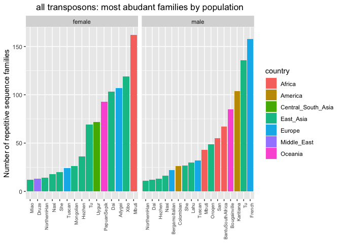
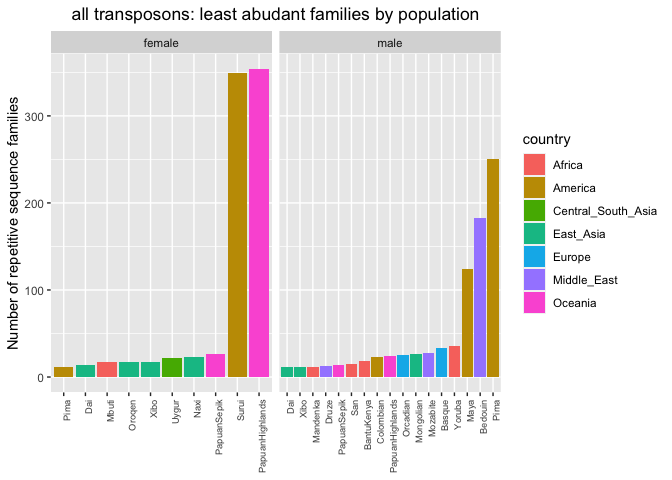
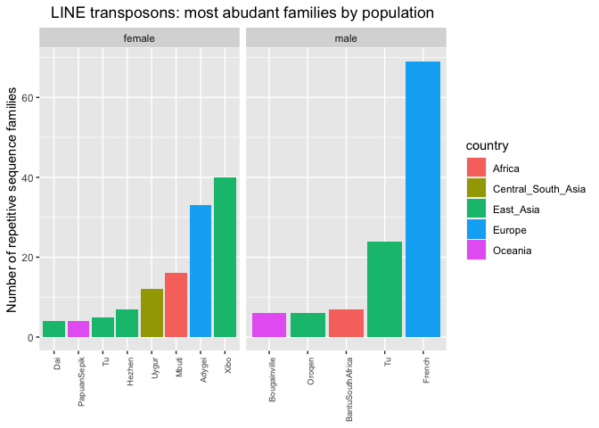
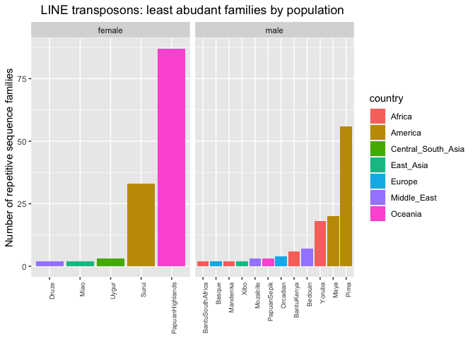
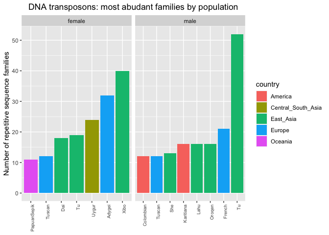
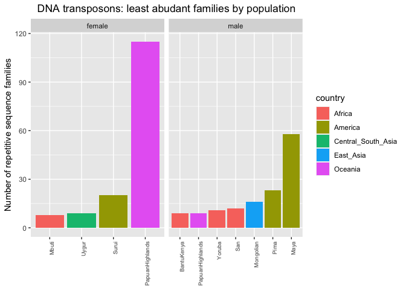
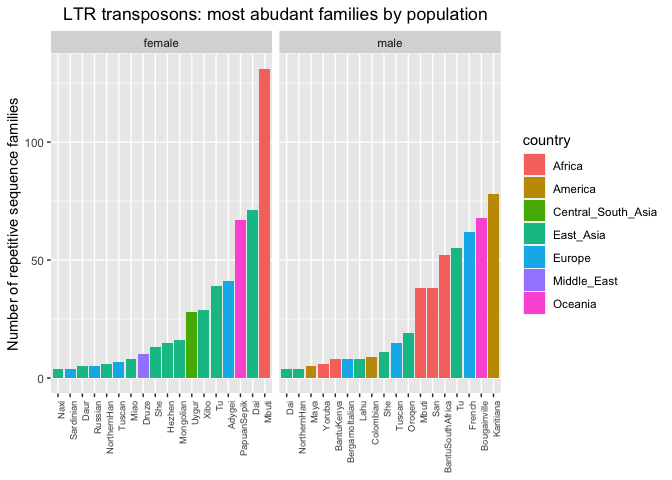
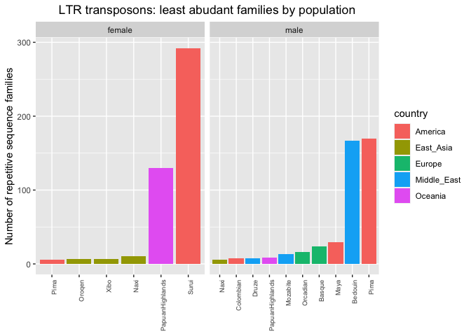

HGDP - General analysis about TEs geographic distribution
================

In all the previous analysis, we just focused on the most variable TE,
selected in the scripts 1-2-3. Here I want to give a more comprehensive
overview of the geographic distributions of TE abundance.

## Creating a customized global classification of TE

First, I read the file
*/Volumes/Temp1/rpianezza/TE/summary-HGDP/HGDP_cutoff_classified.tsv*,
which is a file which combine the previously used *HGDP_cutoff* with
*repbase_classification.txt*, a file containing the classification of
each TE present in our reference library, directly from RepBase.

``` r
library(tidyverse)
```

    ## ── Attaching packages ─────────────────────────────────────── tidyverse 1.3.2 ──
    ## ✔ ggplot2 3.4.0      ✔ purrr   0.3.4 
    ## ✔ tibble  3.1.8      ✔ dplyr   1.0.10
    ## ✔ tidyr   1.2.1      ✔ stringr 1.4.1 
    ## ✔ readr   2.1.2      ✔ forcats 0.5.2 
    ## ── Conflicts ────────────────────────────────────────── tidyverse_conflicts() ──
    ## ✖ dplyr::filter() masks stats::filter()
    ## ✖ dplyr::lag()    masks stats::lag()

``` r
library(ggpubr)

HGDP <- read_tsv("/Volumes/Temp1/rpianezza/TE/summary-HGDP/HGDP_cutoff_classified.tsv", col_names = c( "ID","pop","sex","country","type","familyname","length","reads","copynumber","batch", "superfamily", "shared_with"), skip=1)
```

    ## Rows: 1396835 Columns: 12
    ## ── Column specification ────────────────────────────────────────────────────────
    ## Delimiter: "\t"
    ## chr (9): ID, pop, sex, country, type, familyname, batch, superfamily, shared...
    ## dbl (3): length, reads, copynumber
    ## 
    ## ℹ Use `spec()` to retrieve the full column specification for this data.
    ## ℹ Specify the column types or set `show_col_types = FALSE` to quiet this message.

Then I add the coordinates for each population and create the dataframe
`data` which can be plotted using the funcion `plot_map` created in
script 4. This function can be used to check the results of the
following analysis in details.

``` r
coordinates <- read_tsv("/Users/rpianezza/TE/summary-HGDP/HGDP_populationcoordinates.txt", col_names = c("pop", "region", "latitude", "longitude"))
```

    ## Rows: 54 Columns: 4
    ## ── Column specification ────────────────────────────────────────────────────────
    ## Delimiter: "\t"
    ## chr (2): pop, region
    ## dbl (2): latitude, longitude
    ## 
    ## ℹ Use `spec()` to retrieve the full column specification for this data.
    ## ℹ Specify the column types or set `show_col_types = FALSE` to quiet this message.

``` r
coord <- select(coordinates, pop, latitude, longitude)

by_pop <- group_by(HGDP, pop, country, familyname, type, sex) %>% dplyr::summarise(sd=sd(copynumber), copynumber = mean(copynumber), count=n())
```

    ## `summarise()` has grouped output by 'pop', 'country', 'familyname', 'type'. You
    ## can override using the `.groups` argument.

``` r
data <- inner_join(coord, by_pop, by = "pop")
```

The classification available in RepBase give us the `superfamily` of
each `familyname`. This helps us to create a further larger
classification which divides the repetitive sequences in the library
into 5 main classes:

- DNA transposons (`DNA`)
- LINE (`LINE`)
- SINE (`SINE`, comprehends SVA_A)
- LTR transposons (`LTR`, all the endogenous retroviruses)
- Satellites (`satellite`)

Note that some families are not included in this classification. As
reported in
<https://mobilednajournal.biomedcentral.com/articles/10.1186/s13100-017-0107-y#Tab2>,
some TE are still `non classified` (`NA`).

``` r
DNA_names <- c("Crypton", "hAT", "Helitron", "Kolobok", "Mariner/Tc1", "Merlin", "MuDR", "piggyBac", "DNA transposon")
LINE_names <- c("L1", "CR1", "L2", "Crack", "RTE", "RTEX", "R4", "Vingi", "Tx1", "Penelope")
SINE_names <- c("SINE1/7SL", "SINE2/tRNA", "SINE3/5S", "SINE")
LTR_names <- c("ERV1", "ERV2", "ERV3", "Gypsy", "Endogenous Retrovirus", "LTR Retrotransposon", "Long terminal repeat", "Non-LTR Retrotransposon")
satellites_names <- c("Satellite", "satellite", "SAT")

classification <- select(HGDP, familyname, superfamily) %>% mutate(class = case_when(superfamily %in% DNA_names ~ "DNA", superfamily %in% LINE_names ~ "LINE", superfamily %in% SINE_names ~ "SINE", superfamily %in% LTR_names ~ "LTR", superfamily %in% satellites_names ~ "satellite"))
```

## Geographic classification and mean abundance by continent

After creating the sequence classification, I create also a simplified
**geographic classification**. All the populations from
`Central South Asia`, `East Asia`, `Middle East`, and `Europe` are
grouped under the label `Eurasia`, since from the PCA and from all the
other analysis these populations always clustered together in terms of
TE abundance.

Then, I calculate the **mean copynumber** of each TE for every continent
(`country`).

``` r
(continents <- by_pop %>% group_by(country, familyname, type, sex) %>% mutate(country = replace(country, country == 'Central_South_Asia', 'Eurasia')) %>% mutate(country = replace(country, country == 'East_Asia', 'Eurasia')) %>% mutate(country = replace(country, country == 'Middle_East', 'Eurasia')) %>% mutate(country = replace(country, country == 'Europe', 'Eurasia')) %>% dplyr::summarise(country_mean=mean(copynumber)) %>% arrange(familyname) %>% pivot_wider(names_from = country, values_from = country_mean) %>% full_join(classification, by="familyname") %>% distinct())
```

    ## `summarise()` has grouped output by 'country', 'familyname', 'type'. You can
    ## override using the `.groups` argument.

    ## # A tibble: 3,374 × 9
    ## # Groups:   familyname, type [1,687]
    ##    familyname     type  sex    Africa America Eurasia Oceania superfamily class 
    ##    <chr>          <chr> <chr>   <dbl>   <dbl>   <dbl>   <dbl> <chr>       <chr> 
    ##  1 6kbHsap        te    female 351.   323.     328.    335.   satellite   satel…
    ##  2 6kbHsap        te    male   371.   344.     333.    317.   satellite   satel…
    ##  3 a_AC067968.1_2 krab  female   1.54   1.48     1.58    1.58 <NA>        <NA>  
    ##  4 a_AC067968.1_2 krab  male     1.59   1.59     1.58    1.62 <NA>        <NA>  
    ##  5 a_AC092835.1_5 krab  female   1.87   1.67     1.79    1.84 <NA>        <NA>  
    ##  6 a_AC092835.1_5 krab  male     1.82   1.73     1.80    1.80 <NA>        <NA>  
    ##  7 a_CDK8_20      krab  female   2.01   1.92     2.10    2.06 <NA>        <NA>  
    ##  8 a_CDK8_20      krab  male     2.06   2.05     2.08    2.06 <NA>        <NA>  
    ##  9 a_CHD3_3       krab  female   1.03   0.997    1.02    1.03 <NA>        <NA>  
    ## 10 a_CHD3_3       krab  male     1.07   1.03     1.02    1.04 <NA>        <NA>  
    ## # … with 3,364 more rows

## Functions

This code chunk contains a function `pie_chart_more_in` which creates
two pie charts that shows the percentage of TE families that are more
abundant in each continent, one for the females and one for the males.

The two arguments are:

- `class_or_superfamily`: used to subset the dataset and select only a
  class or a superfamily to show in the pie charts. If “class”, it will
  subset looking for TE which are in a class, if “superfamily” it will
  do the same but just in one superfamily
- `which_TE`: the specific `class` or `superfamily` name is specified in
  this argument (es. “LINE”).

``` r
pie_chart_more_in <- function(data, class_or_superfamily, which_TE){

if (class_or_superfamily=="class"){subset <- filter(data, class==which_TE)}
if (class_or_superfamily=="superfamily"){subset <- filter(data, superfamily==which_TE)}
if (class_or_superfamily=="type"){subset <- filter(data, type==which_TE)}
  
f_eurasia <- filter(subset, Eurasia-Africa>0, Eurasia-America>0, Eurasia-Oceania>0, sex=="female") %>% ungroup %>% dplyr::summarise(eurasia = n()) %>% pull
f_africa <- filter(subset, Africa-Eurasia>0, Africa-America>0, Africa-Oceania>0, sex=="female") %>% ungroup %>% dplyr::summarise(africa = n()) %>% pull
f_america <- filter(subset, America-Eurasia>0, America-Africa>0, America-Oceania>0, sex=="female") %>% ungroup %>% dplyr::summarise(america = n()) %>% pull
f_oceania <- filter(subset, Oceania-Eurasia>0, Oceania-Africa>0, Oceania-America>0, sex=="female") %>% ungroup %>% dplyr::summarise(oceania = n()) %>% pull

continents_names <- c("Eurasia", "Africa", "America", "Oceania")
f_morein <- c(f_eurasia, f_africa, f_america, f_oceania)

tot=f_eurasia+f_africa+f_america+f_oceania

f_morein_tibble <- tibble(continents_names, f_morein) %>% mutate(f_perc=round((f_morein/tot), 2))

f_bp <- ggplot(f_morein_tibble, aes("More abundant in", y=f_morein, fill=continents_names)) +
  geom_bar(width = 1, stat = "identity") + labs(fill='') 

f_pie <- f_bp + coord_polar("y", start=0) +
  ggtitle("Females") + theme(plot.title = element_text(hjust = 0.5, size=8)) +
  theme(axis.text.x=element_blank()) + theme(axis.title.x=element_blank()) +
  theme(axis.text.y=element_blank()) + theme(axis.title.y=element_blank()) + theme(axis.ticks.y=element_blank()) +
  geom_label(aes(label = f_morein), position = position_stack(vjust = 0.5), show.legend = FALSE)


m_eurasia <- filter(subset, Eurasia-Africa>0, Eurasia-America>0, Eurasia-Oceania>0, sex=="male") %>% ungroup %>% dplyr::summarise(eurasia = n()) %>% pull
m_africa <- filter(subset, Africa-Eurasia>0, Africa-America>0, Africa-Oceania>0, sex=="male") %>% ungroup %>% dplyr::summarise(africa = n()) %>% pull
m_america <- filter(subset, America-Eurasia>0, America-Africa>0, America-Oceania>0, sex=="male") %>% ungroup %>% dplyr::summarise(america = n()) %>% pull
m_oceania <- filter(subset, Oceania-Eurasia>0, Oceania-Africa>0, Oceania-America>0, sex=="male") %>% ungroup %>% dplyr::summarise(oceania = n()) %>% pull

m_morein <- c(m_eurasia, m_africa, m_america, m_oceania)

m_morein_tibble <- tibble(continents_names, m_morein) %>% mutate(m_perc=round((m_morein/tot), 2))

m_bp <- ggplot(m_morein_tibble, aes("More abundant in", y=m_morein, fill=continents_names)) +
  geom_bar(width = 1, stat = "identity") + labs(fill='') 

m_pie <- m_bp + coord_polar("y", start=0) +
  ggtitle("Males") + theme(plot.title = element_text(hjust = 0.5, size=8)) +
  theme(axis.text.x=element_blank()) + theme(axis.title.x=element_blank()) +
  theme(axis.text.y=element_blank()) + theme(axis.title.y=element_blank()) + theme(axis.ticks.y=element_blank()) +
  geom_label(aes(label = m_morein), position = position_stack(vjust = 0.5), show.legend = FALSE)

figure <- ggarrange(f_pie, m_pie, ncol = 2, nrow = 1, common.legend = TRUE, legend = "right", align = "hv", font.label = list(size = 10, color = "black", face = "bold", family = NULL, position = "top"))

text <- paste(which_TE, "- How many families are most abundant in each continent?")

(figure_final <- annotate_figure(figure, top = text_grob(text, color = "black", size = 15, hjust = 0.55, vjust = 2), fig.lab = ""))

}
```

This second function `pie_chart_less_in` does the same thing as the one
above, but it will check for the `less abundant` TE in each continent
instead.

``` r
pie_chart_less_in <- function(data, class_or_superfamily, which_TE){

if (class_or_superfamily=="class"){subset <- filter(data, class==which_TE)}
if (class_or_superfamily=="superfamily"){subset <- filter(data, superfamily==which_TE)}
if (class_or_superfamily=="type"){subset <- filter(data, type==which_TE)}

less_f_eurasia <- filter(subset, Eurasia-Africa<0, Eurasia-America<0, Eurasia-Oceania<0, sex=="female") %>% ungroup %>% dplyr::summarise(eurasia = dplyr::n()) %>% pull
less_f_africa <- filter(subset, Africa-Eurasia<0, Africa-America<0, Africa-Oceania<0, sex=="female") %>% ungroup %>% dplyr::summarise(africa = dplyr::n()) %>% pull
less_f_america <- filter(subset, America-Eurasia<0, America-Africa<0, America-Oceania<0, sex=="female") %>% ungroup %>% dplyr::summarise(america = dplyr::n()) %>% pull
less_f_oceania <- filter(subset, Oceania-Eurasia<0, Oceania-Africa<0, Oceania-America<0, sex=="female") %>% ungroup %>% dplyr::summarise(oceania = dplyr::n()) %>% pull

f_lessin <- c(less_f_eurasia, less_f_africa, less_f_america, less_f_oceania)
continents_names <- c("Eurasia", "Africa", "America", "Oceania")
tot=less_f_eurasia+less_f_africa+less_f_america+less_f_oceania

f_lessin_tibble <- tibble(continents_names, f_lessin) %>% mutate(less_f_perc=round((f_lessin/tot), 2))

less_f_bp <- ggplot(f_lessin_tibble, aes("Less abundant in", y=f_lessin, fill=continents_names)) +
  geom_bar(width = 1, stat = "identity") + labs(fill='') 

less_f_pie <- less_f_bp + coord_polar("y", start=0) +
  ggtitle("Females") + theme(plot.title = element_text(hjust = 0.5, size=8)) +
  theme(axis.text.x=element_blank()) + theme(axis.title.x=element_blank()) +
  theme(axis.text.y=element_blank()) + theme(axis.title.y=element_blank()) + theme(axis.ticks.y=element_blank()) +
  geom_label(aes(label = f_lessin), position = position_stack(vjust = 0.5), show.legend = FALSE)


less_m_eurasia <- filter(subset, Eurasia-Africa<0, Eurasia-America<0, Eurasia-Oceania<0, sex=="male") %>% ungroup %>% dplyr::summarise(eurasia = dplyr::n()) %>% pull
less_m_africa <- filter(subset, Africa-Eurasia<0, Africa-America<0, Africa-Oceania<0, sex=="male") %>% ungroup %>% dplyr::summarise(africa = dplyr::n()) %>% pull
less_m_america <- filter(subset, America-Eurasia<0, America-Africa<0, America-Oceania<0, sex=="male") %>% ungroup %>% dplyr::summarise(america = dplyr::n()) %>% pull
less_m_oceania <- filter(subset, Oceania-Eurasia<0, Oceania-Africa<0, Oceania-America<0, sex=="male") %>% ungroup %>% dplyr::summarise(oceania = dplyr::n()) %>% pull

m_lessin <- c(less_m_eurasia, less_m_africa, less_m_america, less_m_oceania)

m_lessin_tibble <- tibble(continents_names, m_lessin) %>% mutate(less_m_perc=round((m_lessin/tot), 2))

less_m_bp <- ggplot(m_lessin_tibble, aes("Less abundant in", y=m_lessin, fill=continents_names)) +
  geom_bar(width = 1, stat = "identity") + labs(fill='') 

less_m_pie <- less_m_bp + coord_polar("y", start=0) +
  ggtitle("Males") + theme(plot.title = element_text(hjust = 0.5, size=8)) +
  theme(axis.text.x=element_blank()) + theme(axis.title.x=element_blank()) +
  theme(axis.text.y=element_blank()) + theme(axis.title.y=element_blank()) + theme(axis.ticks.y=element_blank()) +
  geom_label(aes(label = m_lessin), position = position_stack(vjust = 0.5), show.legend = FALSE)

figure <- ggarrange(less_f_pie, less_m_pie, ncol = 2, nrow = 1, common.legend = TRUE, legend = "right", align = "hv", font.label = list(size = 10, color = "black", face = "bold", family = NULL, position = "top"))

text <- paste(which_TE, "- How many families are least abundant in each continent?")

(figure_final <- annotate_figure(figure, top = text_grob(text, color = "black", size = 15, hjust = 0.55, vjust = 2), fig.lab = ""))
}
```

``` r
chi_most <- function(data, class_or_superfamily, which_TE){
  
if (class_or_superfamily=="class"){subset <- filter(data, class==which_TE)}
if (class_or_superfamily=="superfamily"){subset <- filter(data, superfamily==which_TE)}
if (class_or_superfamily=="type"){subset <- filter(data, type==which_TE)}

chi_m <- ungroup(subset) %>% mutate(most = case_when((Eurasia-Africa>0 & Eurasia-America>0 & Eurasia-Oceania>0) ~ "Eurasia", (Africa-Eurasia>0 & Africa-America>0 & Africa-Oceania>0) ~ "Africa", (America-Africa>0 & America-Eurasia>0 & America-Oceania>0) ~ "America", (Oceania-Africa>0 & Oceania-America>0 & Oceania-Eurasia>0) ~ "Oceania")) %>% group_by(most) %>% dplyr::summarise(n = dplyr::n()) %>% select(n) %>% pull

while (length(chi_m)!=4) {
  chi_m <- append(chi_m, 0)
  }
  
chisq.test(chi_m)
}
```

``` r
chi_least <- function(data, class_or_superfamily, which_TE){
  
if (class_or_superfamily=="class"){subset <- filter(data, class==which_TE)}
if (class_or_superfamily=="superfamily"){subset <- filter(data, superfamily==which_TE)}
if (class_or_superfamily=="type"){subset <- filter(data, type==which_TE)}

chi_l <- ungroup(subset) %>% mutate(least = case_when((Eurasia-Africa<0 & Eurasia-America<0 & Eurasia-Oceania<0) ~ "Eurasia", (Africa-Eurasia<0 & Africa-America<0 & Africa-Oceania<0) ~ "Africa", (America-Africa<0 & America-Eurasia<0 & America-Oceania<0) ~ "America", (Oceania-Africa<0 & Oceania-America<0 & Oceania-Eurasia<0) ~ "Oceania")) %>% group_by(least) %>% dplyr::summarise(n = dplyr::n()) %>% select(n) %>% pull

while (length(chi_l)!=4) {
  chi_l <- append(chi_l, 0)
  }
  
chi_l
}
```

After creating the functions, we can explore the dataset using them.

## All

``` r
pie_chart_more_in(continents, "type", "te")
```

<!-- -->

``` r
chi_most(continents, "type", "te")
```

    ## 
    ##  Chi-squared test for given probabilities
    ## 
    ## data:  chi_m
    ## X-squared = 1199.1, df = 3, p-value < 2.2e-16

``` r
pie_chart_less_in(continents, "type", "te")
```

<!-- -->

``` r
#chi_least(continents, "type", "te")
```

## By class

``` r
pie_chart_more_in(continents, "class", "LINE")
```

<!-- -->

``` r
chi_most(continents, "class", "LINE")
```

    ## 
    ##  Chi-squared test for given probabilities
    ## 
    ## data:  chi_m
    ## X-squared = 369.94, df = 3, p-value < 2.2e-16

``` r
pie_chart_less_in(continents, "class", "LINE")
```

<!-- -->

``` r
#chi_least(continents, "class", "LINE")
```

- **More abundant**: we have a clear bias towards **Eurasia**.
  **Africa** follows, while very few TEs are more abundant in the other
  two continents.

- **Less abundant**: as expected, mainly in **Oceania** and **America**.
  **Males** from **Eurasia** also shows some low abundance TEs, which
  may be interesting.

``` r
#pie_chart_more_in(continents, "class", "SINE")
#chi_most(continents, "class", "SINE")

#pie_chart_less_in(continents, "class", "SINE")
#chi_least(continents, "class", "SINE")
```

The number of **SINE** families is very low, so I do not expect these
charts to be relevant.

- **More abundant**: **Eurasia** and **Africa**. In the **males** also
  **America**.
- **Less abundant**: **Oceania**, followed by \`**Africa**.

``` r
pie_chart_more_in(continents, "class", "DNA")
```

<!-- -->

``` r
chi_most(continents, "class", "DNA")
```

    ## 
    ##  Chi-squared test for given probabilities
    ## 
    ## data:  chi_m
    ## X-squared = 573.22, df = 3, p-value < 2.2e-16

``` r
pie_chart_less_in(continents, "class", "DNA")
```

<!-- -->

``` r
#chi_least(continents, "class", "DNA")
```

**DNA transposons** shows surpisingly similar plots to **LINEs**!

``` r
pie_chart_more_in(continents, "class", "LTR")
```

<!-- -->

``` r
chi_most(continents, "class", "LTR")
```

    ## 
    ##  Chi-squared test for given probabilities
    ## 
    ## data:  chi_m
    ## X-squared = 970.28, df = 3, p-value < 2.2e-16

``` r
pie_chart_less_in(continents, "class", "LTR")
```

<!-- -->

``` r
#chi_least(continents, "class", "LTR")
```

**LTR transposons** are more abundant in **Africa**! **Eurasia**
follows. Less abundant, as expected, in **America** and a bit in
**Oceania**. Again, it is interesting to notice how **eurasian males**
are very present in the **less abundant** chart.

``` r
#pie_chart_more_in(continents, "class", "satellite")
#chi_most(continents, "class", "satellite")

#pie_chart_less_in(continents, "class", "satellite")
#chi_least(continents, "class", "satellite")
```

The number of **satellite** families is very low, so I do not expect
these charts to be relevant.

- **More abundant**: Evenly distributed apart from **Eurasia** in
  **females** and **America** in males, which are poorly represented.
- **Less abundant**: Mostly evenly distributed apart from a positive
  bias towards **America** in females.

## By superfamily

``` r
pie_chart_more_in(continents, "superfamily", "L1")
```

<!-- -->

``` r
chi_most(continents, "superfamily", "L1")
```

    ## 
    ##  Chi-squared test for given probabilities
    ## 
    ## data:  chi_m
    ## X-squared = 401.52, df = 3, p-value < 2.2e-16

``` r
pie_chart_less_in(continents, "superfamily", "L1")
```

<!-- -->

``` r
#chi_least(continents, "superfamily", "L1")
```

LINE-1 (`L1`) are expected to be the most active TEs in humans, thus we
expect these charts to be an extremization of the `LINE` plots,
containing both L1s and other LINEs (less active). This is exactly what
we find here.

## KRAB-ZNF

``` r
pie_chart_more_in(continents, "type", "krab")
```

<!-- -->

``` r
chi_most(continents, "type", "krab")
```

    ## 
    ##  Chi-squared test for given probabilities
    ## 
    ## data:  chi_m
    ## X-squared = 65.604, df = 3, p-value = 3.726e-14

``` r
pie_chart_less_in(continents, "type", "krab")
```

<!-- -->

``` r
#chi_least(continents, "type", "krab")
```

# What do we expect with random values?

Here I substitute the TEs `copynumbers` with random values between 0 and
1.

``` r
set.seed(42)

random_by_pop <- group_by(HGDP, pop, country, familyname, sex) %>% select(!(copynumber)) %>% add_column(copynumber = runif(nrow(.))) %>% dplyr::summarise(sd=sd(copynumber), copynumber = mean(copynumber), count=n())
```

    ## `summarise()` has grouped output by 'pop', 'country', 'familyname'. You can
    ## override using the `.groups` argument.

``` r
random_data <- inner_join(coord, random_by_pop, by = "pop")

random_continents <- random_by_pop %>% group_by(country, familyname, sex) %>% mutate(country = replace(country, country == 'Central_South_Asia', 'Eurasia')) %>% mutate(country = replace(country, country == 'East_Asia', 'Eurasia')) %>% mutate(country = replace(country, country == 'Middle_East', 'Eurasia')) %>% mutate(country = replace(country, country == 'Europe', 'Eurasia')) %>% dplyr::summarise(country_mean=mean(copynumber)) %>% arrange(familyname) %>% pivot_wider(names_from = country, values_from = country_mean) %>% inner_join(classification, by="familyname") %>% distinct()
```

    ## `summarise()` has grouped output by 'country', 'familyname'. You can override
    ## using the `.groups` argument.

``` r
#pie_chart_more_in(random_continents, "class", "LINE")
#pie_chart_less_in(random_continents, "class", "LINE")
#pie_chart_more_in(random_continents, "class", "SINE")
#pie_chart_less_in(random_continents, "class", "SINE")
#pie_chart_more_in(random_continents, "class", "LTR")
#pie_chart_less_in(random_continents, "class", "LTR")
#pie_chart_more_in(random_continents, "class", "DNA")
#pie_chart_less_in(random_continents, "class", "DNA")
#pie_chart_more_in(random_continents, "class", "satellite")
#pie_chart_less_in(random_continents, "class", "satellite")
```

# Removing non variant TE

``` r
var_names <- HGDP %>% filter(type=="te") %>% group_by(familyname) %>% filter(max(copynumber)-min(copynumber)>1) %>% select(familyname) %>% distinct() %>% as_vector()

variant <- filter(continents, familyname %in% var_names)

#pie_chart_more_in(variant, "class", "LINE")
#chi_most(variant, "class", "LINE")

#pie_chart_less_in(variant, "class", "LINE")
#chi_least(variant, "class", "LINE")

#pie_chart_more_in(variant, "class", "DNA")
#chi_most(variant, "class", "DNA")

#pie_chart_less_in(variant, "class", "DNA")
#chi_least(variant, "class", "DNA")

#pie_chart_more_in(variant, "class", "LTR")
#chi_most(variant, "class", "LTR")

#pie_chart_less_in(variant, "class", "LTR")
#chi_least(variant, "class", "LTR")
```

# Split eurasians

``` r
(splitted <- by_pop %>% group_by(country, familyname, type, sex) %>% dplyr::summarise(country_mean=mean(copynumber)) %>% arrange(familyname) %>% pivot_wider(names_from = country, values_from = country_mean) %>% full_join(classification, by="familyname") %>% distinct())
```

    ## `summarise()` has grouped output by 'country', 'familyname', 'type'. You can
    ## override using the `.groups` argument.

    ## # A tibble: 3,374 × 12
    ## # Groups:   familyname, type [1,687]
    ##    familyname  type  sex   Africa America Centr…¹ East_…² Europe Middl…³ Oceania
    ##    <chr>       <chr> <chr>  <dbl>   <dbl>   <dbl>   <dbl>  <dbl>   <dbl>   <dbl>
    ##  1 6kbHsap     te    fema… 351.   323.    316.     333.   332.   322.     335.  
    ##  2 6kbHsap     te    male  371.   344.    331.     332.   336.   333.     317.  
    ##  3 a_AC067968… krab  fema…   1.54   1.48    1.55     1.57   1.64   1.56     1.58
    ##  4 a_AC067968… krab  male    1.59   1.59    1.58     1.57   1.62   1.52     1.62
    ##  5 a_AC092835… krab  fema…   1.87   1.67    1.79     1.80   1.81   1.73     1.84
    ##  6 a_AC092835… krab  male    1.82   1.73    1.80     1.79   1.82   1.75     1.80
    ##  7 a_CDK8_20   krab  fema…   2.01   1.92    2.12     2.10   2.11   2.00     2.06
    ##  8 a_CDK8_20   krab  male    2.06   2.05    2.08     2.09   2.11   1.98     2.06
    ##  9 a_CHD3_3    krab  fema…   1.03   0.997   0.990    1.03   1.01   1.01     1.03
    ## 10 a_CHD3_3    krab  male    1.07   1.03    1.02     1.02   1.04   0.992    1.04
    ## # … with 3,364 more rows, 2 more variables: superfamily <chr>, class <chr>, and
    ## #   abbreviated variable names ¹​Central_South_Asia, ²​East_Asia, ³​Middle_East

``` r
pie_chart_less_in_splitted <- function(data, class_or_superfamily, which_TE){

if (class_or_superfamily=="class"){subset <- filter(data, class==which_TE)}
if (class_or_superfamily=="superfamily"){subset <- filter(data, superfamily==which_TE)}
if (class_or_superfamily=="type"){subset <- filter(data, type==which_TE)}

less_f_Central_South_Asia <- filter(subset, Central_South_Asia-Africa<0, Central_South_Asia-America<0, Central_South_Asia-Oceania<0, Central_South_Asia-East_Asia<0, Central_South_Asia-Europe<0, Central_South_Asia-Middle_East<0,sex=="female") %>% ungroup %>% dplyr::summarise(Central_South_Asia = dplyr::n()) %>% pull
less_f_East_Asia <- filter(subset, East_Asia-Africa<0, East_Asia-America<0, East_Asia-Oceania<0, East_Asia-Central_South_Asia<0, East_Asia-Europe<0, East_Asia-Middle_East<0,sex=="female") %>% ungroup %>% dplyr::summarise(East_Asia = dplyr::n()) %>% pull
less_f_Europe <- filter(subset, Europe-Africa<0, Europe-America<0, Europe-Oceania<0, Europe-Central_South_Asia<0, Europe-East_Asia<0, Europe-Middle_East<0,sex=="female") %>% ungroup %>% dplyr::summarise(Europe = dplyr::n()) %>% pull
less_f_Middle_East <- filter(subset, Middle_East-Africa<0, Middle_East-America<0, Middle_East-Oceania<0, Middle_East-Central_South_Asia<0, Middle_East-East_Asia<0, Middle_East-Europe<0,sex=="female") %>% ungroup %>% dplyr::summarise(Middle_East = dplyr::n()) %>% pull
less_f_Africa <- filter(subset, Africa-Middle_East<0, Africa-America<0, Africa-Oceania<0, Africa-Central_South_Asia<0, Africa-East_Asia<0, Africa-Europe<0,sex=="female") %>% ungroup %>% dplyr::summarise(Africa = dplyr::n()) %>% pull
less_f_America <- filter(subset, America-Middle_East<0, America-Africa<0, America-Oceania<0, America-Central_South_Asia<0, America-East_Asia<0, America-Europe<0,sex=="female") %>% ungroup %>% dplyr::summarise(America = dplyr::n()) %>% pull
less_f_Oceania <- filter(subset, Oceania-Middle_East<0, Oceania-Africa<0, Oceania-America<0, Oceania-Central_South_Asia<0, Oceania-East_Asia<0, Oceania-Europe<0,sex=="female") %>% ungroup %>% dplyr::summarise(Oceania = dplyr::n()) %>% pull

f_lessin <- c(less_f_Central_South_Asia, less_f_East_Asia, less_f_Europe, less_f_Middle_East, less_f_Africa, less_f_America, less_f_Oceania)
continents_names <- c("Central_South_Asia", "East_Asia", "Europe", "Middle_East", "Africa", "America", "Oceania")
tot=less_f_Central_South_Asia+less_f_East_Asia+less_f_Europe+less_f_Middle_East+less_f_Africa+less_f_America+less_f_Oceania

f_lessin_tibble <- tibble(continents_names, f_lessin) %>% mutate(less_f_perc=round((f_lessin/tot), 2))

less_f_bp <- ggplot(f_lessin_tibble, aes("Less abundant in", y=f_lessin, fill=continents_names)) +
  geom_bar(width = 1, stat = "identity") + labs(fill='') 

less_f_pie <- less_f_bp + coord_polar("y", start=0) +
  ggtitle("Females") + theme(plot.title = element_text(hjust = 0.5, size=8)) +
  theme(axis.text.x=element_blank()) + theme(axis.title.x=element_blank()) +
  theme(axis.text.y=element_blank()) + theme(axis.title.y=element_blank()) + theme(axis.ticks.y=element_blank()) +
  geom_label(aes(label = f_lessin), position = position_stack(vjust = 0.5), show.legend = FALSE)


less_m_Central_South_Asia <- filter(subset, Central_South_Asia-Africa<0, Central_South_Asia-America<0, Central_South_Asia-Oceania<0, Central_South_Asia-East_Asia<0, Central_South_Asia-Europe<0, Central_South_Asia-Middle_East<0,sex=="male") %>% ungroup %>% dplyr::summarise(Central_South_Asia = dplyr::n()) %>% pull
less_m_East_Asia <- filter(subset, East_Asia-Africa<0, East_Asia-America<0, East_Asia-Oceania<0, East_Asia-Central_South_Asia<0, East_Asia-Europe<0, East_Asia-Middle_East<0,sex=="male") %>% ungroup %>% dplyr::summarise(East_Asia = dplyr::n()) %>% pull
less_m_Europe <- filter(subset, Europe-Africa<0, Europe-America<0, Europe-Oceania<0, Europe-Central_South_Asia<0, Europe-East_Asia<0, Europe-Middle_East<0,sex=="male") %>% ungroup %>% dplyr::summarise(Europe = dplyr::n()) %>% pull
less_m_Middle_East <- filter(subset, Middle_East-Africa<0, Middle_East-America<0, Middle_East-Oceania<0, Middle_East-Central_South_Asia<0, Middle_East-East_Asia<0, Middle_East-Europe<0,sex=="male") %>% ungroup %>% dplyr::summarise(Middle_East = dplyr::n()) %>% pull
less_m_Africa <- filter(subset, Africa-Middle_East<0, Africa-America<0, Africa-Oceania<0, Africa-Central_South_Asia<0, Africa-East_Asia<0, Africa-Europe<0,sex=="male") %>% ungroup %>% dplyr::summarise(Africa = dplyr::n()) %>% pull
less_m_America <- filter(subset, America-Middle_East<0, America-Africa<0, America-Oceania<0, America-Central_South_Asia<0, America-East_Asia<0, America-Europe<0,sex=="male") %>% ungroup %>% dplyr::summarise(America = dplyr::n()) %>% pull
less_m_Oceania <- filter(subset, Oceania-Middle_East<0, Oceania-Africa<0, Oceania-America<0, Oceania-Central_South_Asia<0, Oceania-East_Asia<0, Oceania-Europe<0,sex=="male") %>% ungroup %>% dplyr::summarise(Oceania = dplyr::n()) %>% pull

m_lessin <- c(less_m_Central_South_Asia, less_m_East_Asia, less_m_Europe, less_m_Middle_East, less_m_Africa, less_m_America, less_m_Oceania)
tot=less_m_Central_South_Asia+less_m_East_Asia+less_m_Europe+less_m_Middle_East+less_m_Africa+less_m_America+less_m_Oceania

m_lessin_tibble <- tibble(continents_names, m_lessin) %>% mutate(less_m_perc=round((m_lessin/tot), 2))

less_m_bp <- ggplot(m_lessin_tibble, aes("Less abundant in", y=m_lessin, fill=continents_names)) +
  geom_bar(width = 1, stat = "identity") + labs(fill='') 

less_m_pie <- less_m_bp + coord_polar("y", start=0) +
  ggtitle("Males") + theme(plot.title = element_text(hjust = 0.5, size=8)) +
  theme(axis.text.x=element_blank()) + theme(axis.title.x=element_blank()) +
  theme(axis.text.y=element_blank()) + theme(axis.title.y=element_blank()) + theme(axis.ticks.y=element_blank()) +
  geom_label(aes(label = m_lessin), position = position_stack(vjust = 0.5), show.legend = FALSE)

figure <- ggarrange(less_f_pie, less_m_pie, ncol = 2, nrow = 1, common.legend = TRUE, legend = "right", align = "hv", font.label = list(size = 10, color = "black", face = "bold", family = NULL, position = "top"))

text <- paste(which_TE, "- How many families are least abundant in each continent?")

(figure_final <- annotate_figure(figure, top = text_grob(text, color = "black", size = 15, hjust = 0.55, vjust = 2), fig.lab = ""))
}

pie_chart_more_in_splitted <- function(data, class_or_superfamily, which_TE){

if (class_or_superfamily=="class"){subset <- filter(data, class==which_TE)}
if (class_or_superfamily=="superfamily"){subset <- filter(data, superfamily==which_TE)}
if (class_or_superfamily=="type"){subset <- filter(data, type==which_TE)}
  
  
more_f_Central_South_Asia <- filter(subset, Central_South_Asia-Africa>0, Central_South_Asia-America>0, Central_South_Asia-Oceania>0, Central_South_Asia-East_Asia>0, Central_South_Asia-Europe>0, Central_South_Asia-Middle_East>0,sex=="female") %>% ungroup %>% dplyr::summarise(Central_South_Asia = dplyr::n()) %>% pull
more_f_East_Asia <- filter(subset, East_Asia-Africa>0, East_Asia-America>0, East_Asia-Oceania>0, East_Asia-Central_South_Asia>0, East_Asia-Europe>0, East_Asia-Middle_East>0,sex=="female") %>% ungroup %>% dplyr::summarise(East_Asia = dplyr::n()) %>% pull
more_f_Europe <- filter(subset, Europe-Africa>0, Europe-America>0, Europe-Oceania>0, Europe-Central_South_Asia>0, Europe-East_Asia>0, Europe-Middle_East>0,sex=="female") %>% ungroup %>% dplyr::summarise(Europe = dplyr::n()) %>% pull
more_f_Middle_East <- filter(subset, Middle_East-Africa>0, Middle_East-America>0, Middle_East-Oceania>0, Middle_East-Central_South_Asia>0, Middle_East-East_Asia>0, Middle_East-Europe>0,sex=="female") %>% ungroup %>% dplyr::summarise(Middle_East = dplyr::n()) %>% pull
more_f_Africa <- filter(subset, Africa-Middle_East>0, Africa-America>0, Africa-Oceania>0, Africa-Central_South_Asia>0, Africa-East_Asia>0, Africa-Europe>0,sex=="female") %>% ungroup %>% dplyr::summarise(Africa = dplyr::n()) %>% pull
more_f_America <- filter(subset, America-Middle_East>0, America-Africa>0, America-Oceania>0, America-Central_South_Asia>0, America-East_Asia>0, America-Europe>0,sex=="female") %>% ungroup %>% dplyr::summarise(America = dplyr::n()) %>% pull
more_f_Oceania <- filter(subset, Oceania-Middle_East>0, Oceania-Africa>0, Oceania-America>0, Oceania-Central_South_Asia>0, Oceania-East_Asia>0, Oceania-Europe>0,sex=="female") %>% ungroup %>% dplyr::summarise(Oceania = dplyr::n()) %>% pull

f_morein <- c(more_f_Central_South_Asia, more_f_East_Asia, more_f_Europe, more_f_Middle_East, more_f_Africa, more_f_America, more_f_Oceania)
continents_names <- c("Central_South_Asia", "East_Asia", "Europe", "Middle_East", "Africa", "America", "Oceania")
tot=more_f_Central_South_Asia+more_f_East_Asia+more_f_Europe+more_f_Middle_East+more_f_Africa+more_f_America+more_f_Oceania

f_morein_tibble <- tibble(continents_names, f_morein) %>% mutate(more_f_perc=round((f_morein/tot), 2))

more_f_bp <- ggplot(f_morein_tibble, aes("More abundant in", y=f_morein, fill=continents_names)) +
  geom_bar(width = 1, stat = "identity") + labs(fill='') 

more_f_pie <- more_f_bp + coord_polar("y", start=0) +
  ggtitle("Females") + theme(plot.title = element_text(hjust = 0.5, size=8)) +
  theme(axis.text.x=element_blank()) + theme(axis.title.x=element_blank()) +
  theme(axis.text.y=element_blank()) + theme(axis.title.y=element_blank()) + theme(axis.ticks.y=element_blank()) +
  geom_label(aes(label = f_morein), position = position_stack(vjust = 0.5), show.legend = FALSE)


more_m_Central_South_Asia <- filter(subset, Central_South_Asia-Africa>0, Central_South_Asia-America>0, Central_South_Asia-Oceania>0, Central_South_Asia-East_Asia>0, Central_South_Asia-Europe>0, Central_South_Asia-Middle_East>0,sex=="male") %>% ungroup %>% dplyr::summarise(Central_South_Asia = dplyr::n()) %>% pull
more_m_East_Asia <- filter(subset, East_Asia-Africa>0, East_Asia-America>0, East_Asia-Oceania>0, East_Asia-Central_South_Asia>0, East_Asia-Europe>0, East_Asia-Middle_East>0,sex=="male") %>% ungroup %>% dplyr::summarise(East_Asia = dplyr::n()) %>% pull
more_m_Europe <- filter(subset, Europe-Africa>0, Europe-America>0, Europe-Oceania>0, Europe-Central_South_Asia>0, Europe-East_Asia>0, Europe-Middle_East>0,sex=="male") %>% ungroup %>% dplyr::summarise(Europe = dplyr::n()) %>% pull
more_m_Middle_East <- filter(subset, Middle_East-Africa>0, Middle_East-America>0, Middle_East-Oceania>0, Middle_East-Central_South_Asia>0, Middle_East-East_Asia>0, Middle_East-Europe>0,sex=="male") %>% ungroup %>% dplyr::summarise(Middle_East = dplyr::n()) %>% pull
more_m_Africa <- filter(subset, Africa-Middle_East>0, Africa-America>0, Africa-Oceania>0, Africa-Central_South_Asia>0, Africa-East_Asia>0, Africa-Europe>0,sex=="male") %>% ungroup %>% dplyr::summarise(Africa = dplyr::n()) %>% pull
more_m_America <- filter(subset, America-Middle_East>0, America-Africa>0, America-Oceania>0, America-Central_South_Asia>0, America-East_Asia>0, America-Europe>0,sex=="male") %>% ungroup %>% dplyr::summarise(America = dplyr::n()) %>% pull
more_m_Oceania <- filter(subset, Oceania-Middle_East>0, Oceania-Africa>0, Oceania-America>0, Oceania-Central_South_Asia>0, Oceania-East_Asia>0, Oceania-Europe>0,sex=="male") %>% ungroup %>% dplyr::summarise(Oceania = dplyr::n()) %>% pull

m_morein <- c(more_m_Central_South_Asia, more_m_East_Asia, more_m_Europe, more_m_Middle_East, more_m_Africa, more_m_America, more_m_Oceania)
tot=more_m_Central_South_Asia+more_m_East_Asia+more_m_Europe+more_m_Middle_East+more_m_Africa+more_m_America+more_m_Oceania

m_morein_tibble <- tibble(continents_names, m_morein) %>% mutate(more_m_perc=round((m_morein/tot), 2))

more_m_bp <- ggplot(m_morein_tibble, aes("More abundant in", y=m_morein, fill=continents_names)) +
  geom_bar(width = 1, stat = "identity") + labs(fill='') 

more_m_pie <- more_m_bp + coord_polar("y", start=0) +
  ggtitle("Males") + theme(plot.title = element_text(hjust = 0.5, size=8)) +
  theme(axis.text.x=element_blank()) + theme(axis.title.x=element_blank()) +
  theme(axis.text.y=element_blank()) + theme(axis.title.y=element_blank()) + theme(axis.ticks.y=element_blank()) +
  geom_label(aes(label = m_morein), position = position_stack(vjust = 0.5), show.legend = FALSE)

figure_more <- ggarrange(more_f_pie, more_m_pie, ncol = 2, nrow = 1, common.legend = TRUE, legend = "right", align = "hv", font.label = list(size = 10, color = "black", face = "bold", family = NULL, position = "top"))

text <- paste(which_TE, "- How many families are most abundant in each continent?")

(figure_final <- annotate_figure(figure_more, top = text_grob(text, color = "black", size = 15, hjust = 0.55, vjust = 2), fig.lab = ""))
}
```

``` r
#pie_chart_more_in_splitted(splitted, "class", "LINE")
#pie_chart_less_in_splitted(splitted, "class", "LINE")

#pie_chart_more_in_splitted(splitted, "class", "DNA")
#pie_chart_less_in_splitted(splitted, "class", "DNA")

#pie_chart_more_in_splitted(splitted, "class", "LTR")
#pie_chart_less_in_splitted(splitted, "class", "LTR")
```

## By population

To try to increase the resolution of our analysis, I performed the same
test but instead of calculating the mean for each Continent, I did that
for each population.

``` r
(populations <- by_pop %>% group_by(pop, familyname, type, sex) %>% dplyr::summarise(pop_mean=mean(copynumber)) %>% arrange(familyname) %>% pivot_wider(names_from = pop, values_from = pop_mean) %>% full_join(classification, by="familyname") %>% distinct() %>% dplyr::rename(TE_type = class))
```

    ## `summarise()` has grouped output by 'pop', 'familyname', 'type'. You can
    ## override using the `.groups` argument.

    ## # A tibble: 3,374 × 59
    ## # Groups:   familyname, type [1,687]
    ##    familyn…¹ type  sex    Adygei Balochi Bantu…² Bantu…³  Basque Bedouin Berga…⁴
    ##    <chr>     <chr> <chr>   <dbl>   <dbl>   <dbl>   <dbl>   <dbl>   <dbl>   <dbl>
    ##  1 6kbHsap   te    fema… 354.      NA      NA      NA    295.    326.     362.  
    ##  2 6kbHsap   te    male  353.     334.    360.    379.   320.    346.     328.  
    ##  3 a_AC0679… krab  fema…   1.66    NA      NA      NA      1.59    1.50     1.62
    ##  4 a_AC0679… krab  male    1.56     1.64    1.67    1.59   1.56    1.50     1.66
    ##  5 a_AC0928… krab  fema…   1.81    NA      NA      NA      1.75    1.70     1.82
    ##  6 a_AC0928… krab  male    1.79     1.81    1.81    1.80   1.74    1.73     1.83
    ##  7 a_CDK8_20 krab  fema…   2.22    NA      NA      NA      2.05    1.96     2.15
    ##  8 a_CDK8_20 krab  male    2.12     2.14    2.13    2.13   2.01    1.96     2.22
    ##  9 a_CHD3_3  krab  fema…   0.987   NA      NA      NA      1.04    1.03     1.00
    ## 10 a_CHD3_3  krab  male    1.03     1.03    1.05    1.13   0.983   0.996    1.07
    ## # … with 3,364 more rows, 49 more variables: Biaka <dbl>, Bougainville <dbl>,
    ## #   Brahui <dbl>, Burusho <dbl>, Cambodian <dbl>, Colombian <dbl>, Dai <dbl>,
    ## #   Daur <dbl>, Druze <dbl>, French <dbl>, Han <dbl>, Hazara <dbl>,
    ## #   Hezhen <dbl>, Japanese <dbl>, Kalash <dbl>, Karitiana <dbl>, Lahu <dbl>,
    ## #   Makrani <dbl>, Mandenka <dbl>, Maya <dbl>, Mbuti <dbl>, Miao <dbl>,
    ## #   Mongolian <dbl>, Mozabite <dbl>, Naxi <dbl>, NorthernHan <dbl>,
    ## #   Orcadian <dbl>, Oroqen <dbl>, Palestinian <dbl>, PapuanHighlands <dbl>, …

``` r
#write_csv(populations, "/Volumes/Temp1/rpianezza/TE/general-analysis-by-pop/by_pop.csv")
```

The next step was performed in Python using the script
“most-least_abundant_by-pop”. Here I read the resulting file.

``` r
regions <- HGDP %>% select(pop, country) %>% distinct()

(leastmost_bypop <- read_csv("/Volumes/Temp1/rpianezza/TE/general-analysis-by-pop/most.csv", col_names = c("pop", "families", "sex", "class", "most_or_least")) %>% inner_join(regions, by="pop"))
```

    ## Rows: 864 Columns: 5
    ## ── Column specification ────────────────────────────────────────────────────────
    ## Delimiter: ","
    ## chr (4): pop, sex, class, most_or_least
    ## dbl (1): families
    ## 
    ## ℹ Use `spec()` to retrieve the full column specification for this data.
    ## ℹ Specify the column types or set `show_col_types = FALSE` to quiet this message.

    ## # A tibble: 864 × 6
    ##    pop              families sex    class most_or_least country           
    ##    <chr>               <dbl> <chr>  <chr> <chr>         <chr>             
    ##  1 Adygei                107 female all   most          Europe            
    ##  2 Balochi                 0 female all   most          Central_South_Asia
    ##  3 BantuKenya              0 female all   most          Africa            
    ##  4 BantuSouthAfrica        0 female all   most          Africa            
    ##  5 Basque                  0 female all   most          Europe            
    ##  6 Bedouin                 0 female all   most          Middle_East       
    ##  7 BergamoItalian          1 female all   most          Europe            
    ##  8 Biaka                   0 female all   most          Africa            
    ##  9 Bougainville            1 female all   most          Oceania           
    ## 10 Brahui                  0 female all   most          Central_South_Asia
    ## # … with 854 more rows

This function was used to plot the above data using different subsets.

``` r
library(tidytext)

pop_pies <- function(data, most_least, TE_type, threshold){
  
  subset <- filter(data, most_or_least == most_least, class==TE_type) %>% mutate(pop = reorder_within(pop, families, sex)) %>% filter(families>threshold)
  
  pops <- select(subset, pop, sex) %>% distinct() %>% select(pop) %>% separate(pop, into = c("pop", "crap")) %>% select(!(crap)) %>% pull()
  
  ggplot(subset, aes(pop, families, fill=country)) +
    geom_bar(stat = "identity") +
    facet_grid(~ sex, scales = "free") + theme(axis.text.x = element_text(angle = 90, hjust = 1, size=7), axis.title.x = element_blank(), plot.title = element_text(hjust = 0.5)) + ggtitle(paste0(TE_type, " transposons: ", most_least, " abudant families by population")) + ylab("Number of repetitive sequence families")  +
    scale_x_reordered()
  }
```

``` r
pop_pies(leastmost_bypop, "most", "all", 10)
```

<!-- -->

``` r
pop_pies(leastmost_bypop, "least", "all", 10)
```

<!-- -->

``` r
pop_pies(leastmost_bypop, "most", "LINE", 3)
```

<!-- -->

``` r
pop_pies(leastmost_bypop, "least", "LINE", 1)
```

<!-- -->

``` r
pop_pies(leastmost_bypop, "most", "DNA", 10)
```

<!-- -->

``` r
pop_pies(leastmost_bypop, "least", "DNA", 7)
```

<!-- -->

``` r
pop_pies(leastmost_bypop, "most", "LTR", 3)
```

<!-- -->

``` r
pop_pies(leastmost_bypop, "least", "LTR", 5)
```

<!-- -->
