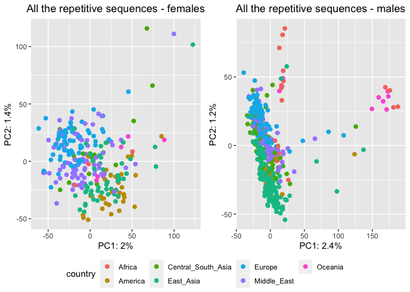
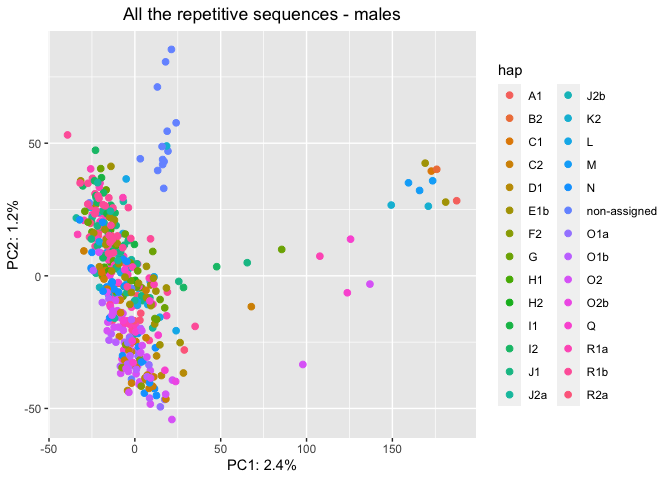

HGDP - SNPs analysis
================

All the files are present in the folders
<https://sourceforge.net/p/human-te-dynamics/data/HEAD/tree/raw-data/>.

``` r
library(tidyverse)
```

    ## ── Attaching packages ─────────────────────────────────────── tidyverse 1.3.2 ──
    ## ✔ ggplot2 3.4.0      ✔ purrr   0.3.4 
    ## ✔ tibble  3.1.8      ✔ dplyr   1.0.10
    ## ✔ tidyr   1.2.1      ✔ stringr 1.4.1 
    ## ✔ readr   2.1.2      ✔ forcats 0.5.2 
    ## ── Conflicts ────────────────────────────────────────── tidyverse_conflicts() ──
    ## ✖ dplyr::filter() masks stats::filter()
    ## ✖ dplyr::lag()    masks stats::lag()

``` r
library(ggpubr)
library(janitor)
```

    ## 
    ## Attaching package: 'janitor'
    ## 
    ## The following objects are masked from 'package:stats':
    ## 
    ##     chisq.test, fisher.test

``` r
no_pcr_samples <- read_tsv("/Volumes/Temp1/rpianezza/investigation/HGDP-no-PCR/HGDP-only-pcr-free-samples.tsv", col_names = ("ID"))
```

    ## Rows: 676 Columns: 1
    ## ── Column specification ────────────────────────────────────────────────────────
    ## Delimiter: "\t"
    ## chr (1): ID
    ## 
    ## ℹ Use `spec()` to retrieve the full column specification for this data.
    ## ℹ Specify the column types or set `show_col_types = FALSE` to quiet this message.

``` r
HGDP <- read_tsv("/Volumes/Temp1/rpianezza/TE/summary-HGDP/HGDP_cutoff_classified.tsv", col_names = c( "ID","pop","sex","country","type","familyname","length","reads","copynumber","batch", "superfamily", "shared_with"), skip=1) %>% mutate(country = recode(country, "Oceania_(SGDP),Oceania"="Oceania")) %>% type_convert() %>% filter(ID %in% no_pcr_samples$ID)
```

    ## Rows: 1396835 Columns: 12
    ## ── Column specification ────────────────────────────────────────────────────────
    ## Delimiter: "\t"
    ## chr (9): ID, pop, sex, country, type, familyname, batch, superfamily, shared...
    ## dbl (3): length, reads, copynumber
    ## 
    ## ℹ Use `spec()` to retrieve the full column specification for this data.
    ## ℹ Specify the column types or set `show_col_types = FALSE` to quiet this message.
    ## 
    ## ── Column specification ────────────────────────────────────────────────────────
    ## cols(
    ##   ID = col_character(),
    ##   pop = col_character(),
    ##   sex = col_character(),
    ##   country = col_character(),
    ##   type = col_character(),
    ##   familyname = col_character(),
    ##   batch = col_character(),
    ##   superfamily = col_character(),
    ##   shared_with = col_character()
    ## )

``` r
sync_files <- read_tsv("/Volumes/Temp1/rpianezza/TE/SNP/file_list", col_names = "ID") %>% separate(ID, into = c("ID", "desc"), sep="-") %>% select(ID) %>% distinct(ID)
```

    ## Rows: 828 Columns: 1
    ## ── Column specification ────────────────────────────────────────────────────────
    ## Delimiter: "\t"
    ## chr (1): ID
    ## 
    ## ℹ Use `spec()` to retrieve the full column specification for this data.
    ## ℹ Specify the column types or set `show_col_types = FALSE` to quiet this message.

``` r
ID <- distinct(HGDP, ID)
identical(ID, sync_files)
```

    ## [1] FALSE

## Y chromosme haplotypes

``` r
hap1 <- read_csv("/Volumes/Temp1/rpianezza/TE/Y-chromosome/males-Y-chromosome.txt")
```

    ## Rows: 553 Columns: 3
    ## ── Column specification ────────────────────────────────────────────────────────
    ## Delimiter: ","
    ## chr (3): ID, haplotype, hap_group
    ## 
    ## ℹ Use `spec()` to retrieve the full column specification for this data.
    ## ℹ Specify the column types or set `show_col_types = FALSE` to quiet this message.

``` r
id <- HGDP %>% filter(sex=="male") %>% select(ID) %>% distinct()

hap2 <- inner_join(hap1, id, by="ID")

(metadata_hap <- inner_join(hap2, HGDP, by="ID"))
```

    ## # A tibble: 703,479 × 14
    ##    ID     haplo…¹ hap_g…² pop   sex   country type  famil…³ length reads copyn…⁴
    ##    <chr>  <chr>   <chr>   <chr> <chr> <chr>   <chr> <chr>    <dbl> <dbl>   <dbl>
    ##  1 HGDP0… L       6       Brah… male  Centra… scg   chr1:9…   4152 1279.   0.988
    ##  2 HGDP0… L       6       Brah… male  Centra… scg   chr1:9…   5136 1704.   1.06 
    ##  3 HGDP0… L       6       Brah… male  Centra… scg   chr1:1…   3064 1051.   1.10 
    ##  4 HGDP0… L       6       Brah… male  Centra… scg   chr1:1…   3239 1096.   1.09 
    ##  5 HGDP0… L       6       Brah… male  Centra… scg   chr1:1…   4035 1445.   1.15 
    ##  6 HGDP0… L       6       Brah… male  Centra… scg   chr1:1…   2500  924.   1.19 
    ##  7 HGDP0… L       6       Brah… male  Centra… scg   chr1:1…   2599  779.   0.962
    ##  8 HGDP0… L       6       Brah… male  Centra… scg   chr1:1…   2124  613.   0.926
    ##  9 HGDP0… L       6       Brah… male  Centra… scg   chr1:2…   6284 2020.   1.03 
    ## 10 HGDP0… L       6       Brah… male  Centra… scg   chr1:2…   3222 1054.   1.05 
    ## # … with 703,469 more rows, 3 more variables: batch <chr>, superfamily <chr>,
    ## #   shared_with <chr>, and abbreviated variable names ¹​haplotype, ²​hap_group,
    ## #   ³​familyname, ⁴​copynumber

## All

``` r
SNP_all <- function(freq_matrix, metadata){

matrix <- read_csv(freq_matrix)
  
f_metadata <- metadata %>% filter(sex=="female") %>% select(ID, sex, country, pop) %>% distinct()
m_metadata <- metadata %>% filter(sex=="male") %>% select(ID, sex, country, pop) %>% distinct()
males_matrix <- filter(matrix, ID %in% m_metadata$ID) %>% select(!(ID))
females_matrix <- filter(matrix, ID %in% f_metadata$ID) %>% select(!(ID))

f_pca_data <- females_matrix %>% select_if(negate(function(col) sd(col)==0))
m_pca_data <- males_matrix %>% select_if(negate(function(col) sd(col)==0))

f_pca_result <- prcomp(f_pca_data, center = TRUE, scale = TRUE)
m_pca_result <- prcomp(m_pca_data, center = TRUE, scale = TRUE)
  
f_var_explained <- f_pca_result$sdev^2/sum(f_pca_result$sdev^2)
m_var_explained <- m_pca_result$sdev^2/sum(m_pca_result$sdev^2)
   
f <- f_pca_result$x %>% as_tibble() %>% add_column(.before = 1, ID=f_metadata$ID, sex=f_metadata$sex, pop=f_metadata$pop, country=f_metadata$country) %>% as.data.frame() %>%
 ggplot(aes(x=PC1,y=PC2, color=country)) + geom_point(size=2) +
labs(x=paste0("PC1: ",round(f_var_explained[1]*100,1),"%"),
        y=paste0("PC2: ",round(f_var_explained[2]*100,1),"%")) + ggtitle("All the repetitive sequences - females") +
 theme(plot.title = element_text(hjust = 0.5))
   
  m <- m_pca_result$x %>% as_tibble() %>% add_column(.before = 1, ID=m_metadata$ID, sex=m_metadata$sex, pop=m_metadata$pop, country=m_metadata$country) %>% as.data.frame() %>%
  ggplot(aes(x=PC1,y=PC2, color=country)) + geom_point(size=2) +
   labs(x=paste0("PC1: ",round(m_var_explained[1]*100,1),"%"),
        y=paste0("PC2: ",round(m_var_explained[2]*100,1),"%")) + ggtitle("All the repetitive sequences - males") +
 theme(plot.title = element_text(hjust = 0.5))
 
ggarrange(f, m, ncol = 2, nrow = 1, common.legend = TRUE, legend = "bottom", align = "hv", font.label = list(size = 10, color = "black", face = "bold", family = NULL, position = "top"))
  }
```

``` r
SNP_all("/Volumes/Temp1/rpianezza/TE/SNP/try04/separed.all.08.5000x.matrix.tsv", HGDP)
```

    ## Rows: 828 Columns: 69481
    ## ── Column specification ────────────────────────────────────────────────────────
    ## Delimiter: ","
    ## chr     (1): ID
    ## dbl (69480): HERV9_te_78A, HERV9_te_78T, HERV9_te_78C, HERV9_te_78G, HERV9_t...
    ## 
    ## ℹ Use `spec()` to retrieve the full column specification for this data.
    ## ℹ Specify the column types or set `show_col_types = FALSE` to quiet this message.

<!-- -->

``` r
SNP_all_hap <- function(freq_matrix, metadata){

matrix <- read_csv(freq_matrix)

m_metadata <- metadata %>% filter(sex=="male") %>% select(ID, sex, country, pop, haplotype) %>% distinct()
males_matrix <- filter(matrix, ID %in% m_metadata$ID) %>% select(!(ID))
m_pca_data <- males_matrix %>% select_if(negate(function(col) sd(col)==0))
m_pca_result <- prcomp(m_pca_data, center = TRUE, scale = TRUE)
m_var_explained <- m_pca_result$sdev^2/sum(m_pca_result$sdev^2)
   
m_pca_result$x %>% as_tibble() %>% add_column(.before = 1, ID=m_metadata$ID, sex=m_metadata$sex, pop=m_metadata$pop, country=m_metadata$country, hap=m_metadata$haplotype) %>% as.data.frame() %>%
  ggplot(aes(x=PC1,y=PC2, color=hap
             )) + geom_point(size=2) +
   labs(x=paste0("PC1: ",round(m_var_explained[1]*100,1),"%"),
        y=paste0("PC2: ",round(m_var_explained[2]*100,1),"%")) + ggtitle("All the repetitive sequences - males") +
 theme(plot.title = element_text(hjust = 0.5))
  }
```

``` r
SNP_all_hap("/Volumes/Temp1/rpianezza/TE/SNP/try04/separed.all.08.5000x.matrix.tsv", metadata_hap)
```

    ## Rows: 828 Columns: 69481
    ## ── Column specification ────────────────────────────────────────────────────────
    ## Delimiter: ","
    ## chr     (1): ID
    ## dbl (69480): HERV9_te_78A, HERV9_te_78T, HERV9_te_78C, HERV9_te_78G, HERV9_t...
    ## 
    ## ℹ Use `spec()` to retrieve the full column specification for this data.
    ## ℹ Specify the column types or set `show_col_types = FALSE` to quiet this message.

<!-- -->
