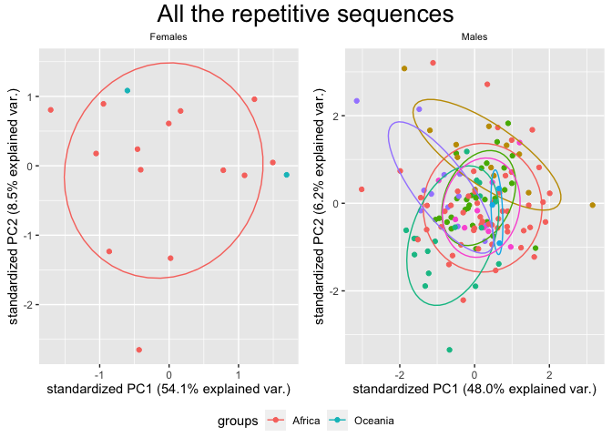
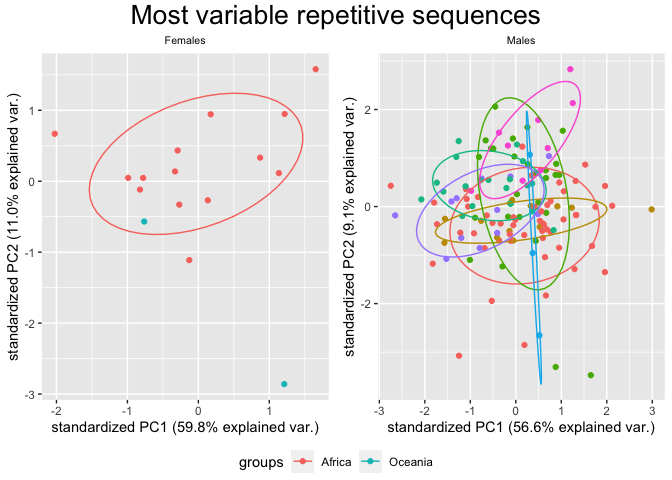

PCA for different subsets of the dataset
================

In this script I create different PCAs for different subsets of the HGDP
summary dataset. The focus is the `copynumber` of every transposon for
each individual.

``` r
library(tidyverse)
```

    ## ── Attaching packages ─────────────────────────────────────── tidyverse 1.3.2 ──
    ## ✔ ggplot2 3.4.0      ✔ purrr   0.3.4 
    ## ✔ tibble  3.1.8      ✔ dplyr   1.0.10
    ## ✔ tidyr   1.2.1      ✔ stringr 1.4.1 
    ## ✔ readr   2.1.2      ✔ forcats 0.5.2 
    ## ── Conflicts ────────────────────────────────────────── tidyverse_conflicts() ──
    ## ✖ dplyr::filter() masks stats::filter()
    ## ✖ dplyr::lag()    masks stats::lag()

``` r
library(ggpubr)

no_pcr_samples <- read_tsv("/Volumes/Temp1/rpianezza/investigation/HGDP-no-PCR/HGDP-only-pcr-free-samples.tsv", col_names = ("ID"))
```

    ## Rows: 676 Columns: 1
    ## ── Column specification ────────────────────────────────────────────────────────
    ## Delimiter: "\t"
    ## chr (1): ID
    ## 
    ## ℹ Use `spec()` to retrieve the full column specification for this data.
    ## ℹ Specify the column types or set `show_col_types = FALSE` to quiet this message.

``` r
HGDP <- read_csv("/Volumes/Temp1/rpianezza/TE/summary-HGDP/USEME_HGDP_complete_reflib6.2_mq10_batchinfo_cutoff0.01.txt", col_names = c("ID","pop","sex","country","type","familyname","length","reads","copynumber","batch"), skip=1) %>% type_convert() %>% filter(!(ID %in% no_pcr_samples$ID))
```

    ## Rows: 1394352 Columns: 10
    ## ── Column specification ────────────────────────────────────────────────────────
    ## Delimiter: ","
    ## chr (7): ID, pop, sex, country, type, familyname, batch
    ## dbl (3): length, reads, copynumber
    ## 
    ## ℹ Use `spec()` to retrieve the full column specification for this data.
    ## ℹ Specify the column types or set `show_col_types = FALSE` to quiet this message.
    ## 
    ## ── Column specification ────────────────────────────────────────────────────────
    ## cols(
    ##   ID = col_character(),
    ##   pop = col_character(),
    ##   sex = col_character(),
    ##   country = col_character(),
    ##   type = col_character(),
    ##   familyname = col_character(),
    ##   batch = col_character()
    ## )

# Function for PCA plotting

``` r
PCA <- function(data, title){
  m <- filter(data, sex=='male') %>% group_by(familyname) %>% filter(var(copynumber) > 0) %>% ungroup()
  f <- filter(data, sex=='female')%>% group_by(familyname) %>% filter(var(copynumber) > 0) %>% ungroup()
  m_len <- length(unique(m$familyname))
  f_len <- length(unique(f$familyname))
  males <- length(unique(m$ID))
  females <- length(unique(f$ID))

  f_matrix<-matrix(as.vector(f$copynumber),nrow=females,ncol=f_len,byrow=T)
  f_fram<-data.frame(f_matrix)
  

 
  names(f_fram)<-unique(f$familyname)
    f_fram
  f_matrixcont<-matrix(as.vector(f$country),nrow=females,ncol=f_len,byrow=T)
   f_framcont<-data.frame(f_matrixcont)
   f_contcol<-c(f_framcont$X1)

 fHGDP.pca <- prcomp(f_fram, center = TRUE, scale = TRUE)
    
    m_matrix<-matrix(as.vector(m$copynumber),nrow=males,ncol=m_len,byrow=T)
    m_fram<-data.frame(m_matrix)
  
    names(m_fram)<-unique(m$familyname)
    m_matrixcont<-matrix(as.vector(m$country),nrow=males,ncol=m_len,byrow=T)
    m_framcont<-data.frame(m_matrixcont)
    m_contcol<-c(m_framcont$X1)
  
    mHGDP.pca <- prcomp(m_fram, center = TRUE, scale = TRUE)
  
    
   library(ggbiplot)
  f_PCA <- ggbiplot(fHGDP.pca, var.axes=FALSE, groups = f_contcol, ellipse = TRUE)+ ggtitle("Females")+ theme(plot.title = element_text(size = 8, hjust = 0.5)) 
  m_PCA <- ggbiplot(mHGDP.pca, var.axes=FALSE, groups = m_contcol, ellipse = TRUE)+ ggtitle("Males")+ theme(plot.title = element_text(size = 8, hjust = 0.5)) 
  
figure <- ggarrange(f_PCA, m_PCA, ncol = 2, nrow = 1, common.legend = TRUE, legend = "bottom", align = "hv", font.label = list(size = 10, color = "black", face = "bold", family = NULL, position = "top"))

annotate_figure(figure, top = text_grob(title, color = "black", size = 20), fig.lab = "")
}
```

# PCA for the most variable TEs

``` r
TE_cutoff <- filter(HGDP, type=='te') %>% group_by(familyname, sex) %>% mutate(max=max(copynumber), min=min(copynumber)) %>% mutate(diff = max-min, ratio = max/min)

out_abs <- filter(TE_cutoff, diff>200 & diff<Inf)
out_rel <- filter(TE_cutoff, ratio>5 & ratio<Inf & max>1.5)
out_abs_names <- c(unique(out_abs$familyname))
out_rel_names <- c(unique(out_rel$familyname))
out_names <- c(out_abs_names, out_rel_names[!(out_rel_names %in% out_abs_names)]) %>% sort()

most_variable<-subset(HGDP, type=="te") %>% filter(familyname %in% out_names)

PCA(TE_cutoff, "All the repetitive sequences")
```

    ## Loading required package: plyr

    ## ------------------------------------------------------------------------------

    ## You have loaded plyr after dplyr - this is likely to cause problems.
    ## If you need functions from both plyr and dplyr, please load plyr first, then dplyr:
    ## library(plyr); library(dplyr)

    ## ------------------------------------------------------------------------------

    ## 
    ## Attaching package: 'plyr'

    ## The following object is masked from 'package:ggpubr':
    ## 
    ##     mutate

    ## The following objects are masked from 'package:dplyr':
    ## 
    ##     arrange, count, desc, failwith, id, mutate, rename, summarise,
    ##     summarize

    ## The following object is masked from 'package:purrr':
    ## 
    ##     compact

    ## Loading required package: scales

    ## 
    ## Attaching package: 'scales'

    ## The following object is masked from 'package:purrr':
    ## 
    ##     discard

    ## The following object is masked from 'package:readr':
    ## 
    ##     col_factor

    ## Loading required package: grid

<!-- -->

``` r
PCA(most_variable, "Most variable repetitive sequences")
```

<!-- -->
