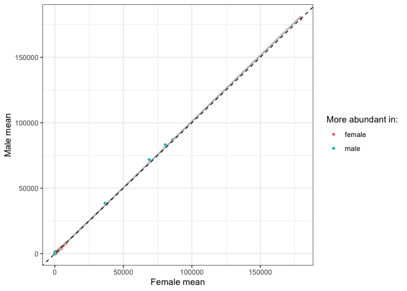
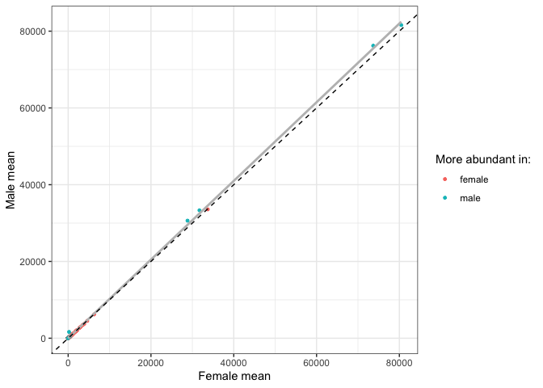
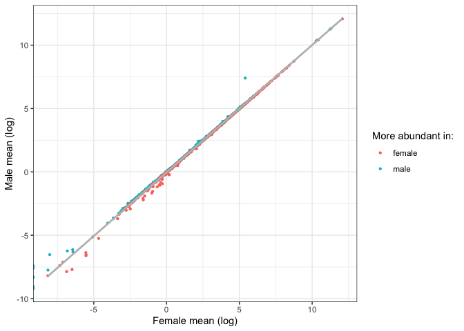
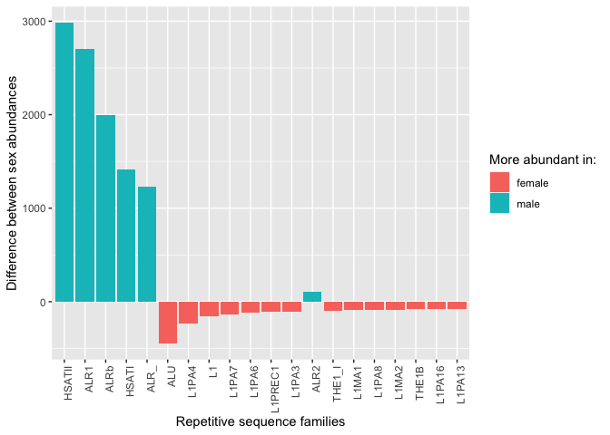
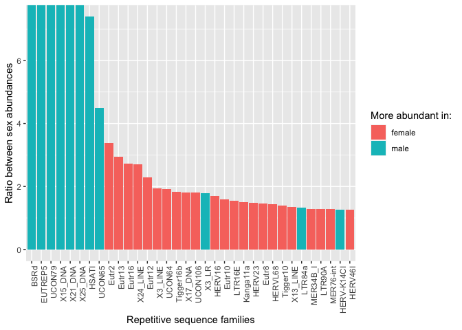
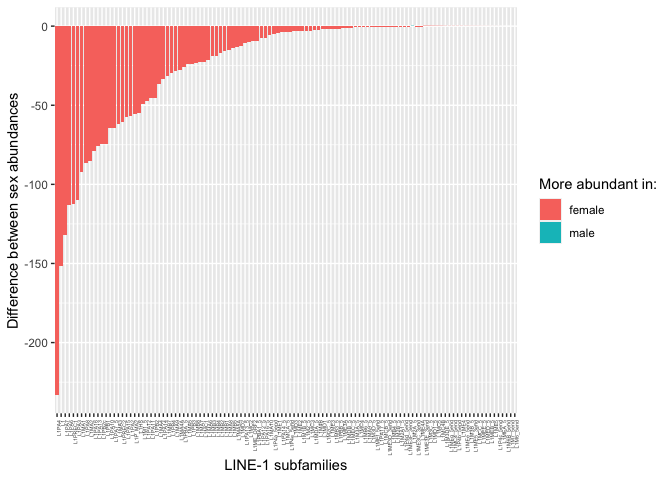
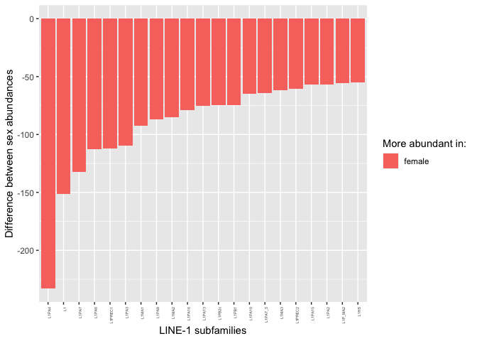
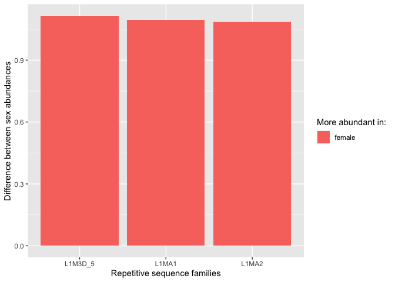

Comparing the mean TE copy numbers in males and females
================

In this script I re-wrote Florian’s script 5 and added some new
analysis. The topic is the comparison of TE abundances between the two
sexes.

``` r
library(tidyverse)
```

    ## ── Attaching packages ─────────────────────────────────────── tidyverse 1.3.2 ──
    ## ✔ ggplot2 3.4.0      ✔ purrr   0.3.4 
    ## ✔ tibble  3.1.8      ✔ dplyr   1.0.10
    ## ✔ tidyr   1.2.1      ✔ stringr 1.4.1 
    ## ✔ readr   2.1.2      ✔ forcats 0.5.2 
    ## ── Conflicts ────────────────────────────────────────── tidyverse_conflicts() ──
    ## ✖ dplyr::filter() masks stats::filter()
    ## ✖ dplyr::lag()    masks stats::lag()

``` r
library(ggpubr)

no_pcr_samples <- read_tsv("/Volumes/Temp1/rpianezza/investigation/HGDP-no-PCR/HGDP-only-pcr-free-samples.tsv", col_names = ("ID"))
```

    ## Rows: 676 Columns: 1
    ## ── Column specification ────────────────────────────────────────────────────────
    ## Delimiter: "\t"
    ## chr (1): ID
    ## 
    ## ℹ Use `spec()` to retrieve the full column specification for this data.
    ## ℹ Specify the column types or set `show_col_types = FALSE` to quiet this message.

``` r
HGDP <- read_tsv("/Volumes/Temp1/rpianezza/TE/summary-HGDP/USEME_HGDP_mq0_cutoff0.01.txt", col_names = c("ID","pop","sex","country","type","familyname","length","reads","copynumber","batch"), skip=1) %>% mutate(country = recode(country, "Oceania_(SGDP),Oceania"="Oceania")) %>% type_convert() %>% filter(!(ID %in% no_pcr_samples$ID))
```

    ## Rows: 1396835 Columns: 10
    ## ── Column specification ────────────────────────────────────────────────────────
    ## Delimiter: "\t"
    ## chr (7): ID, pop, sex, country, type, familyname, batch
    ## dbl (3): length, reads, copynumber
    ## 
    ## ℹ Use `spec()` to retrieve the full column specification for this data.
    ## ℹ Specify the column types or set `show_col_types = FALSE` to quiet this message.
    ## 
    ## ── Column specification ────────────────────────────────────────────────────────
    ## cols(
    ##   ID = col_character(),
    ##   pop = col_character(),
    ##   sex = col_character(),
    ##   country = col_character(),
    ##   type = col_character(),
    ##   familyname = col_character(),
    ##   batch = col_character()
    ## )

## Calculating mean abundance for males and females

``` r
data <- filter(HGDP, type=="te") %>% group_by(familyname, sex) %>% dplyr::summarise(sd=sd(copynumber), mean=mean(copynumber))
```

    ## `summarise()` has grouped output by 'familyname'. You can override using the
    ## `.groups` argument.

``` r
f<-filter(data, sex=="female") %>% dplyr::rename(f_mean = mean, f_sd = sd)
m<-filter(data, sex=="male") %>% dplyr::rename(m_mean = mean, m_sd = sd)

(final_data <- inner_join(f, m, by = "familyname") %>% select(familyname, f_mean, m_mean, f_sd, m_sd) %>% mutate(f_mean_log=log(f_mean), m_mean_log=log(m_mean), diff=m_mean-f_mean, abs_diff=abs(diff), ratio=case_when(diff>=0 ~ m_mean/f_mean, diff<0 ~ f_mean/m_mean), more_in=case_when(diff>=0 ~ "male", diff<0 ~ "female")) %>% arrange(desc(ratio)) %>% mutate(familyname=fct_reorder(familyname,ratio)))
```

    ## # A tibble: 968 × 11
    ## # Groups:   familyname [968]
    ##    familyname    f_mean  m_mean    f_sd    m_sd f_mea…¹ m_mea…²     diff abs_d…³
    ##    <fct>          <dbl>   <dbl>   <dbl>   <dbl>   <dbl>   <dbl>    <dbl>   <dbl>
    ##  1 BSRd         0       4.30e-4 0       1.70e-3 -Inf      -7.75  4.30e-4 4.30e-4
    ##  2 EUTREP5      0       6.10e-4 0       2.08e-3 -Inf      -7.40  6.10e-4 6.10e-4
    ##  3 UCON79       0       5.02e-4 0       2.95e-3 -Inf      -7.60  5.02e-4 5.02e-4
    ##  4 X15_DNA      0       2.54e-4 0       1.50e-3 -Inf      -8.28  2.54e-4 2.54e-4
    ##  5 X21_DNA      0       2.38e-4 0       1.45e-3 -Inf      -8.34  2.38e-4 2.38e-4
    ##  6 X25_DNA      0       1.00e-4 0       8.25e-4 -Inf      -9.21  1.00e-4 1.00e-4
    ##  7 HSATI        2.21e+2 1.64e+3 3.95e+1 3.71e+2    5.40    7.40  1.42e+3 1.42e+3
    ##  8 UCON65       3.26e-4 1.46e-3 1.30e-3 3.61e-3   -8.03   -6.53  1.14e-3 1.14e-3
    ##  9 Eutr2        1.52e-3 4.51e-4 3.47e-3 1.68e-3   -6.49   -7.70 -1.07e-3 1.07e-3
    ## 10 Eutr13       3.95e-3 1.34e-3 8.37e-3 4.31e-3   -5.54   -6.61 -2.60e-3 2.60e-3
    ## # … with 958 more rows, 2 more variables: ratio <dbl>, more_in <chr>, and
    ## #   abbreviated variable names ¹​f_mean_log, ²​m_mean_log, ³​abs_diff

## Comparing mean abundance between males and females

``` r
(all <- ggplot(final_data, aes(x=f_mean, y=m_mean, color=more_in))+ labs(color = "More abundant in:") +
  geom_point(size=1)+
  geom_smooth(method="lm",color="grey", se=F)+ 
  ylab("Male mean")+ xlab("Female mean")+geom_abline(slope=1,linetype='dashed')+theme_bw())
```

    ## `geom_smooth()` using formula = 'y ~ x'

<!-- -->

``` r
noALU <- final_data_noALU <- filter(final_data, !(familyname=="ALU"))#, !(familyname=="ALR1"), !(familyname=="HSATI"))
(ggplot(final_data_noALU, aes(x=f_mean, y=m_mean, color=more_in))+ labs(color = "More abundant in:") +
  geom_point(size=1)+
  geom_smooth(method="lm",color="grey", se=F)+ ylab("Male mean")+ xlab("Female mean")+geom_abline(slope=1,linetype='dashed')+theme_bw())
```

    ## `geom_smooth()` using formula = 'y ~ x'

<!-- -->

``` r
(log <- ggplot(final_data, aes(f_mean_log, m_mean_log, color=more_in))+ labs(color = "More abundant in:") +
  geom_point(size=0.8)+
  geom_smooth(method="lm",color="grey",se=F)+theme_bw()+ ylab("Male mean (log)")+ xlab("Female mean (log)"))
```

    ## `geom_smooth()` using formula = 'y ~ x'

    ## Warning: Removed 7 rows containing non-finite values (`stat_smooth()`).

<!-- -->

## Relative and absolute mean differences between the sexes

### Absolute differences

``` r
abs_subset <- filter(final_data, abs_diff>75) # This number is arbitrary, feel free to look at more/less TEs in the plot

(abs <- ggplot(abs_subset, aes(reorder(familyname, -abs(diff)), diff, fill=more_in)) + labs(fill = "More abundant in:") +
  geom_bar(stat="identity") + ylab("Difference between sex abundances") + xlab("Repetitive sequence families") +
  theme(axis.text.x = element_text(angle = 90, hjust = 1)))
```

<!-- -->

### Relative differences

``` r
rel_all <- ggplot(final_data, aes(reorder(familyname, -ratio), ratio, fill=more_in)) + labs(fill = "More abundant in:")+geom_bar(stat="identity") + ylab("Ratio between sex abundances") + xlab("Repetitive sequence families") + theme(axis.text.x=element_blank())

rel_subset<- filter(final_data, ratio>1.25) # This number is arbitrary, feel free to look at more/less TEs in the plot

(rel <- ggplot(rel_subset, aes(reorder(familyname, -ratio), ratio, fill=more_in)) + labs(fill = "More abundant in:") +
  geom_bar(stat="identity") + ylab("Ratio between sex abundances") + xlab("Repetitive sequence families") +
  theme(axis.text.x = element_text(angle = 90, hjust = 1)))
```

<!-- -->

## L1 family differences between the two sexes

``` r
L1<-final_data %>% filter(str_detect(familyname, "^L1"))
(L1plot <- ggplot(L1, aes(reorder(familyname, -abs(diff)), diff, fill=more_in)) + labs(fill = "More abundant in:") +
  geom_bar(stat="identity") + ylab("Difference between sex abundances") + xlab("LINE-1 subfamilies") +
  theme(axis.text.x = element_text(angle = 90, hjust = 1, size=4)))
```

<!-- -->

``` r
L1_50<-final_data %>% filter(str_detect(familyname, "^L1"), abs_diff>50)
(L1_50plot <- ggplot(L1_50, aes(reorder(familyname, -abs(diff)), diff, fill=more_in)) + labs(fill = "More abundant in:") +
  geom_bar(stat="identity") + ylab("Difference between sex abundances") + xlab("LINE-1 subfamilies") +
  theme(axis.text.x = element_text(angle = 90, hjust = 1, size=4)))
```

<!-- -->

``` r
(L1_male <- filter(L1, more_in == "male"))
```

    ## # A tibble: 3 × 11
    ## # Groups:   familyname [3]
    ##   familyname f_mean m_mean   f_sd   m_sd f_mean_…¹ m_mea…²    diff abs_d…³ ratio
    ##   <fct>       <dbl>  <dbl>  <dbl>  <dbl>     <dbl>   <dbl>   <dbl>   <dbl> <dbl>
    ## 1 L1M6B_5end  0.118  0.120 0.0276 0.0263     -2.13   -2.12 1.59e-3 1.59e-3  1.01
    ## 2 L1M2A_5    25.1   25.3   1.01   0.823       3.22    3.23 2.38e-1 2.38e-1  1.01
    ## 3 L1M7_5end   0.213  0.213 0.0151 0.0165     -1.55   -1.54 8.44e-4 8.44e-4  1.00
    ## # … with 1 more variable: more_in <chr>, and abbreviated variable names
    ## #   ¹​f_mean_log, ²​m_mean_log, ³​abs_diff

``` r
nrow(L1_male)
```

    ## [1] 3

``` r
nrow(L1)
```

    ## [1] 113

``` r
L1_rel <- filter(L1, ratio>1.08)

ggplot(L1_rel, aes(reorder(familyname, -abs(ratio)), ratio, fill=more_in)) + labs(fill = "More abundant in:") +
  geom_bar(stat="identity") + ylab("Difference between sex abundances") + xlab("Repetitive sequence families")
```

<!-- -->
