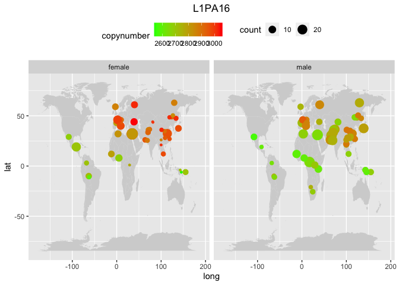
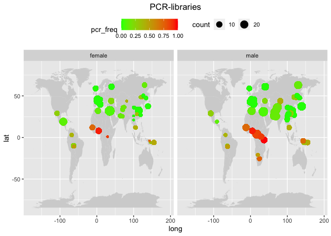

Why the results in the two datasets are that different?
================

After processing the SGDP dataset, the results were ambiguous. While the
most variable TEs are confirmed in both the datasets as well as the most
divergent among sexes, the geographical pattern disappeared both in the
world maps and in the copynumbers PCA. Let’s try to understand why.

``` r
library(tidyverse)
```

    ## ── Attaching packages ─────────────────────────────────────── tidyverse 1.3.2 ──
    ## ✔ ggplot2 3.4.0      ✔ purrr   0.3.4 
    ## ✔ tibble  3.1.8      ✔ dplyr   1.0.10
    ## ✔ tidyr   1.2.1      ✔ stringr 1.4.1 
    ## ✔ readr   2.1.2      ✔ forcats 0.5.2 
    ## ── Conflicts ────────────────────────────────────────── tidyverse_conflicts() ──
    ## ✖ dplyr::filter() masks stats::filter()
    ## ✖ dplyr::lag()    masks stats::lag()

## Check the amount of unmapped reads in both the datasets

We expect the amount of unmapped reads in the two datasets to be
slightly different due to different sequencing methods and read length.
If the differences are huge, it’s not expected. We downloaded 3 samples
for each dataset.

This command subset the full cram file into a file containing only the
unmapped reads.

    samtools view -f 4 /Volumes/Temp2/rpianezza/testing_unmapped_reads/HGDP01303.alt_bwamem_GRCh38DH.20181023.Uygur.cram >> /Volumes/Temp2/rpianezza/testing_unmapped_reads/unmapped_HGDP_HGDP01303

This create an output file with the number of reads of each cram file.

    find /Volumes/Temp2/rpianezza/testing_unmapped_reads -name '*.cram' -exec sh -c 'echo $(samtools view -c {}) $(basename {}) >> /Volumes/Temp2/rpianezza/testing_unmapped_reads/wc.tsv' \; 

I manually conclude the file that I read here:

``` r
(unmapped <- read_tsv("/Volumes/Temp2/rpianezza/testing_unmapped_reads/wc.tsv") %>% mutate(unmapped = all-mapped) %>% mutate(freq_unmapped = unmapped/all))
```

    ## Rows: 6 Columns: 3
    ## ── Column specification ────────────────────────────────────────────────────────
    ## Delimiter: "\t"
    ## chr (1): sample
    ## dbl (2): all, mapped
    ## 
    ## ℹ Use `spec()` to retrieve the full column specification for this data.
    ## ℹ Specify the column types or set `show_col_types = FALSE` to quiet this message.

    ## # A tibble: 6 × 5
    ##          all     mapped sample       unmapped freq_unmapped
    ##        <dbl>      <dbl> <chr>           <dbl>         <dbl>
    ## 1  828828382  818263959 HGDP00205    10564423        0.0127
    ## 2  811561168  801569430 HGDP00462     9991738        0.0123
    ## 3  789336456  780923746 HGDP01303     8412710        0.0107
    ## 4 1274426418 1255193501 SAMEA3302647 19232917        0.0151
    ## 5 2460287722 2428879697 SAMEA3302685 31408025        0.0128
    ## 6 1313167612 1265895791 SAMEA3302706 47271821        0.0360

The differences are small, and probably explainable from the different
rl.

## Sequencing libraries bias

In the HGDP supplement, it’s reported that some samples are produced
using PCR, while the vast majority is PCR-free. Let’s see if it has an
impact.

``` r
HGDP <- read_delim("/Volumes/Temp1/rpianezza/TE/summary-HGDP/USEME_HGDP_mq0_cutoff0.01.txt")
```

    ## Rows: 1396835 Columns: 10
    ## ── Column specification ────────────────────────────────────────────────────────
    ## Delimiter: "\t"
    ## chr (7): ID, Pop, sex, Country, type, familyname, batch
    ## dbl (3): length, reads, copynumber
    ## 
    ## ℹ Use `spec()` to retrieve the full column specification for this data.
    ## ℹ Specify the column types or set `show_col_types = FALSE` to quiet this message.

``` r
names(HGDP)<-c("ID","pop","sex","country","type","familyname","length","reads","copynumber","batch")

(libraries <- read_tsv("/Volumes/Temp1/rpianezza/investigation/libraries_HGDP_by_pop.tsv", col_names = c("pop", "country", "latitude", "longitude", "PCR_free", "PCR"), skip=1) %>% select(c(pop, latitude, longitude, PCR_free, PCR)))
```

    ## Rows: 54 Columns: 6
    ## ── Column specification ────────────────────────────────────────────────────────
    ## Delimiter: "\t"
    ## chr (2): pop, country
    ## dbl (4): latitude, longitude, PCR_free, PCR
    ## 
    ## ℹ Use `spec()` to retrieve the full column specification for this data.
    ## ℹ Specify the column types or set `show_col_types = FALSE` to quiet this message.

    ## # A tibble: 54 × 5
    ##    pop              latitude longitude PCR_free   PCR
    ##    <chr>               <dbl>     <dbl>    <dbl> <dbl>
    ##  1 Adygei               44        39         11     3
    ##  2 Balochi              30.5      66.5       19     3
    ##  3 BantuKenya           -3        37          0     9
    ##  4 BantuSouthAfrica    -25.6      24.2        1     3
    ##  5 Basque               43         0         21     0
    ##  6 Bedouin              31        35         41     3
    ##  7 BergamoItalian       46        10         10     0
    ##  8 Biaka                 4        17          3    17
    ##  9 Bougainville         -6       155          5     4
    ## 10 Brahui               30.5      66.5       20     3
    ## # … with 44 more rows

``` r
by_pop <- filter(HGDP, type=='te') %>% group_by(pop, country, familyname, sex) %>% dplyr::summarise(sd=sd(copynumber), copynumber = mean(copynumber), count=n())
```

    ## `summarise()` has grouped output by 'pop', 'country', 'familyname'. You can
    ## override using the `.groups` argument.

``` r
data <- inner_join(libraries, by_pop, by = "pop") %>% type_convert()
```

    ## 
    ## ── Column specification ────────────────────────────────────────────────────────
    ## cols(
    ##   pop = col_character(),
    ##   country = col_character(),
    ##   familyname = col_character(),
    ##   sex = col_character()
    ## )

``` r
plot_map <- function(data, famname){
TE <- filter(data, familyname == famname)
world_map = map_data("world")

ggplot() +
  geom_map(
    data = world_map, map = world_map,
    aes(long, lat, map_id = region),
    color = "white", fill = "lightgray", size = 0) +
  geom_point(
    data = TE, aes(x=longitude, y=latitude, color = copynumber, size = count)
  ) + geom_errorbar() + theme(legend.position="top") + scale_colour_gradient(low = "green", high = "red") + theme(plot.title = element_text(hjust = 0.5)) +
  facet_wrap(~sex) + ggtitle(famname)}

plot_libraries <- function(data, famname){
TE <- data %>% select(c(pop, latitude, longitude, PCR_free, PCR, sex, count)) %>% mutate(pcr_freq = PCR/(PCR_free+PCR))
world_map = map_data("world")

ggplot() +
  geom_map(
    data = world_map, map = world_map,
    aes(long, lat, map_id = region),
    color = "white", fill = "lightgray", size = 0) +
  geom_point(
    data = TE, aes(x=longitude, y=latitude, color = pcr_freq, size = count)
  ) + geom_errorbar() + theme(legend.position="top") + scale_colour_gradient(low = "green", high = "red") + theme(plot.title = element_text(hjust = 0.5)) +
  facet_wrap(~sex) + ggtitle(famname)}
```

``` r
plot_map(data, "L1PA16")
```

    ## Warning: Using `size` aesthetic for lines was deprecated in ggplot2 3.4.0.
    ## ℹ Please use `linewidth` instead.

    ## Warning in geom_map(data = world_map, map = world_map, aes(long, lat, map_id =
    ## region), : Ignoring unknown aesthetics: x and y

<!-- -->

``` r
plot_libraries(data, "PCR-libraries")
```

    ## Warning in geom_map(data = world_map, map = world_map, aes(long, lat, map_id =
    ## region), : Ignoring unknown aesthetics: x and y

<!-- -->

Wow. We can conclude that at, least partially, our geographic pattern IS
influenced by this. I can filter the PCR samples from both the datasets
(around 100 in HGDP, 16 in SGDP).

``` r
no_pcr <- read_tsv("/Volumes/Temp1/rpianezza/investigation/SGDP_no_PCR.tsv", col_names = c("url",   "md5",  "Data_collection", "Data_type", "Analysis_group", "Sample", "Population", "Data reuse policy")) %>% select(Sample)
```

    ## Rows: 262 Columns: 8
    ## ── Column specification ────────────────────────────────────────────────────────
    ## Delimiter: "\t"
    ## chr (8): url, md5, Data_collection, Data_type, Analysis_group, Sample, Popul...
    ## 
    ## ℹ Use `spec()` to retrieve the full column specification for this data.
    ## ℹ Specify the column types or set `show_col_types = FALSE` to quiet this message.

``` r
#write_tsv(no_pcr, "/Volumes/Temp1/rpianezza/investigation/SGDP-only-pcr-free-samples.tsv")
```

``` r
sgdp_pcr_free <- read_tsv("/Volumes/Temp1/rpianezza/investigation/SGDP-only-pcr-free-samples.tsv", col_names = "sample")
```

    ## Rows: 263 Columns: 1
    ## ── Column specification ────────────────────────────────────────────────────────
    ## Delimiter: "\t"
    ## chr (1): sample
    ## 
    ## ℹ Use `spec()` to retrieve the full column specification for this data.
    ## ℹ Specify the column types or set `show_col_types = FALSE` to quiet this message.

``` r
sgdp_metadata <- read_tsv("/Volumes/Temp1/rpianezza/SGDP/metadata/SGDP_metadata.tsv") %>% select(sample, biosample)
```

    ## Rows: 276 Columns: 7
    ## ── Column specification ────────────────────────────────────────────────────────
    ## Delimiter: "\t"
    ## chr (5): sample, biosample, sex, pop, country
    ## dbl (2): latitude, longitude
    ## 
    ## ℹ Use `spec()` to retrieve the full column specification for this data.
    ## ℹ Specify the column types or set `show_col_types = FALSE` to quiet this message.

``` r
sgdp_pcr_free_samples <- inner_join(sgdp_pcr_free, sgdp_metadata, by="sample") %>% select(biosample) %>% dplyr::rename(ID=biosample)

#write_tsv(sgdp_pcr_free_samples, "/Volumes/Temp1/rpianezza/investigation/SGDP-no-PCR/SGDP-no-PCR.tsv")
```

## Check the quality of sequencing in the two dataset

By calculating variance of scg copynumbers in each sample, we can
estimate the precision of the sequencing method used.

``` r
SGDP <- read_tsv("/Volumes/Temp2/rpianezza/SGDP/summary/USEME_SGDP_cutoff_mq0")
```

    ## Rows: 470028 Columns: 10
    ## ── Column specification ────────────────────────────────────────────────────────
    ## Delimiter: "\t"
    ## chr (7): biosample, sex, pop, country, type, familyname, batch
    ## dbl (3): length, reads, copynumber
    ## 
    ## ℹ Use `spec()` to retrieve the full column specification for this data.
    ## ℹ Specify the column types or set `show_col_types = FALSE` to quiet this message.

``` r
HGDP <- read_delim("/Volumes/Temp1/rpianezza/TE/summary-HGDP/USEME_HGDP_mq0_cutoff0.01.txt")
```

    ## Rows: 1396835 Columns: 10
    ## ── Column specification ────────────────────────────────────────────────────────
    ## Delimiter: "\t"
    ## chr (7): ID, Pop, sex, Country, type, familyname, batch
    ## dbl (3): length, reads, copynumber
    ## 
    ## ℹ Use `spec()` to retrieve the full column specification for this data.
    ## ℹ Specify the column types or set `show_col_types = FALSE` to quiet this message.

``` r
names(HGDP) <- c("ID","pop","sex","country","type","familyname","length","reads","copynumber","batch")
HGDP <- HGDP %>% mutate(country = recode(country, "Oceania_(SGDP),Oceania"="Oceania"))
```

``` r
(SGDP_scg <- SGDP %>% filter(type=="scg") %>% group_by(biosample, pop, country, sex) %>% dplyr::summarise(var = var(copynumber)) %>% arrange(desc(var)))# %>% filter(var<0.025))
```

    ## `summarise()` has grouped output by 'biosample', 'pop', 'country'. You can
    ## override using the `.groups` argument.

    ## # A tibble: 276 × 5
    ## # Groups:   biosample, pop, country [276]
    ##    biosample    pop        country                  sex       var
    ##    <chr>        <chr>      <chr>                    <chr>   <dbl>
    ##  1 SAMEA3302887 Jordanian  West Eurasia             male   0.0608
    ##  2 SAMEA3302765 Crete      West Eurasia             female 0.0476
    ##  3 SAMEA3302697 Mixe       America                  female 0.0461
    ##  4 SAMEA3302833 Mbuti      Africa                   male   0.0453
    ##  5 SAMEA3302625 Crete      West Eurasia             male   0.0445
    ##  6 SAMEA3302719 Australian Oceania                  female 0.0444
    ##  7 SAMEA3302709 Quechua    America                  female 0.0441
    ##  8 SAMEA3302768 Kyrgyz     Central Asia and Siberia female 0.0437
    ##  9 SAMEA3302733 Dinka      Africa                   male   0.0413
    ## 10 SAMEA3302712 French     West Eurasia             male   0.0393
    ## # … with 266 more rows

``` r
(HGDP_scg <- HGDP %>% filter(type=="scg") %>% group_by(ID, pop, country, sex) %>% dplyr::summarise(var = var(copynumber)) %>% arrange(desc(var)))# %>% filter(var<0.025))
```

    ## `summarise()` has grouped output by 'ID', 'pop', 'country'. You can override
    ## using the `.groups` argument.

    ## # A tibble: 828 × 5
    ## # Groups:   ID, pop, country [828]
    ##    ID        pop         country            sex       var
    ##    <chr>     <chr>       <chr>              <chr>   <dbl>
    ##  1 HGDP01024 Han         East_Asia          female 0.0379
    ##  2 HGDP01263 Mozabite    Middle_East        male   0.0253
    ##  3 HGDP01381 Adygei      Europe             female 0.0179
    ##  4 HGDP00690 Palestinian Middle_East        female 0.0164
    ##  5 HGDP00468 Mbuti       Africa             male   0.0147
    ##  6 HGDP00452 Biaka       Africa             male   0.0145
    ##  7 HGDP00763 Japanese    East_Asia          male   0.0143
    ##  8 HGDP01254 Mozabite    Middle_East        female 0.0139
    ##  9 HGDP00854 Maya        America            female 0.0135
    ## 10 HGDP00119 Hazara      Central_South_Asia male   0.0127
    ## # … with 818 more rows

We conclude that the HGDP samples have on average higher quality, since
only 2 samples have a variability in SCGs copynumber \> 0.2, compared to
the SGDP where there are 26 samples over this threshold!

## Run the pipeline on FASTQ files

Our program is based on processing .cram files, the aligned file to the
human reference genome. The unmapped reads were present in the files, so
the fact that the file is aligned should not have an impact on our
results. Anyway, here we run the pipeline on the .fastq files for 3
african females and 3 european females and compare the results with the
.cram files. We do this for both the datasets.

First we download all the .fastq files for each sample and merge them in
a single fastq file. Then, using a modified version of the mapping
script (run.map.fastqp), we run the pipeline on these files.

    cat /Volumes/Temp2/riccardo/fastq-control/ERR757740_1.fastq.gz /Volumes/Temp2/riccardo/fastq-control/ERR757740_2.fastq.gz >> /Volumes/Temp2/riccardo/fastq-control/full.fastq.files/HGDP00471_ERR757740.fastq.gz 
