HGDP - Geographic distribution by population for the most interesting
TEs
================

``` r
library(tidyverse)
```

    ## ── Attaching packages ─────────────────────────────────────── tidyverse 1.3.2 ──
    ## ✔ ggplot2 3.4.0      ✔ purrr   0.3.4 
    ## ✔ tibble  3.1.8      ✔ dplyr   1.0.10
    ## ✔ tidyr   1.2.1      ✔ stringr 1.4.1 
    ## ✔ readr   2.1.2      ✔ forcats 0.5.2 
    ## ── Conflicts ────────────────────────────────────────── tidyverse_conflicts() ──
    ## ✖ dplyr::filter() masks stats::filter()
    ## ✖ dplyr::lag()    masks stats::lag()

``` r
library(ggpubr)
library(forcats)

no_pcr_samples <- read_tsv("/Volumes/Temp1/rpianezza/investigation/HGDP-no-PCR/HGDP-only-pcr-free-samples.tsv", col_names = ("ID"))
```

    ## Rows: 676 Columns: 1
    ## ── Column specification ────────────────────────────────────────────────────────
    ## Delimiter: "\t"
    ## chr (1): ID
    ## 
    ## ℹ Use `spec()` to retrieve the full column specification for this data.
    ## ℹ Specify the column types or set `show_col_types = FALSE` to quiet this message.

``` r
HGDP <- read_csv("/Volumes/Temp1/rpianezza/TE/summary-HGDP/USEME_HGDP_complete_reflib6.2_mq10_batchinfo_cutoff0.01.txt", col_names = c("ID","pop","sex","country","type","familyname","length","reads","copynumber","batch"), skip=1) %>% type_convert() %>% filter(ID %in% no_pcr_samples$ID)
```

    ## Rows: 1394352 Columns: 10
    ## ── Column specification ────────────────────────────────────────────────────────
    ## Delimiter: ","
    ## chr (7): ID, pop, sex, country, type, familyname, batch
    ## dbl (3): length, reads, copynumber
    ## 
    ## ℹ Use `spec()` to retrieve the full column specification for this data.
    ## ℹ Specify the column types or set `show_col_types = FALSE` to quiet this message.
    ## 
    ## ── Column specification ────────────────────────────────────────────────────────
    ## cols(
    ##   ID = col_character(),
    ##   pop = col_character(),
    ##   sex = col_character(),
    ##   country = col_character(),
    ##   type = col_character(),
    ##   familyname = col_character(),
    ##   batch = col_character()
    ## )

# Geographical distribution of interesting TE by population

## Preparatory work

``` r
coordinates <- read_tsv("/Users/rpianezza/TE/summary-HGDP/HGDP_populationcoordinates.txt", col_names = c("pop", "region", "latitude", "longitude"))
```

    ## Rows: 54 Columns: 4
    ## ── Column specification ────────────────────────────────────────────────────────
    ## Delimiter: "\t"
    ## chr (2): pop, region
    ## dbl (2): latitude, longitude
    ## 
    ## ℹ Use `spec()` to retrieve the full column specification for this data.
    ## ℹ Specify the column types or set `show_col_types = FALSE` to quiet this message.

``` r
coord <- select(coordinates, pop, latitude, longitude)

TE <- filter(HGDP, type=='te')
```

``` r
by_pop <- group_by(TE, pop, country, familyname, sex) %>% dplyr::summarise(sd=sd(copynumber), copynumber = mean(copynumber), count=n())
```

    ## `summarise()` has grouped output by 'pop', 'country', 'familyname'. You can
    ## override using the `.groups` argument.

``` r
data <- inner_join(x = coordinates, y = by_pop, by = "pop")
```

We are now ready to analyze the geographic distribution of the most
interesting TE. I first create a function which I will use to plot each
TE family.

``` r
plot_map <- function(data, famname){
TE <- filter(data, familyname == famname)
world_map = map_data("world")

ggplot() +
  geom_map(
    data = world_map, map = world_map,
    aes(long, lat, map_id = region),
    color = "white", fill = "lightgray", size = 0) +
  geom_point(
    data = TE, aes(longitude, latitude, color = copynumber, size = count)
  ) + geom_errorbar() + theme(legend.position="top") + scale_colour_gradient(low = "green", high = "red") + theme(plot.title = element_text(hjust = 0.5)) +
  facet_wrap(~sex) + ggtitle(famname)}
```

## Details for every interesting TE

### LINEs

``` r
plot_map(data, "L1PB1")
```

    ## Warning: Using `size` aesthetic for lines was deprecated in ggplot2 3.4.0.
    ## ℹ Please use `linewidth` instead.

    ## Warning in geom_map(data = world_map, map = world_map, aes(long, lat, map_id =
    ## region), : Ignoring unknown aesthetics: x and y

<!-- -->

``` r
plot_map(data, "L1PA3")
```

    ## Warning in geom_map(data = world_map, map = world_map, aes(long, lat, map_id =
    ## region), : Ignoring unknown aesthetics: x and y

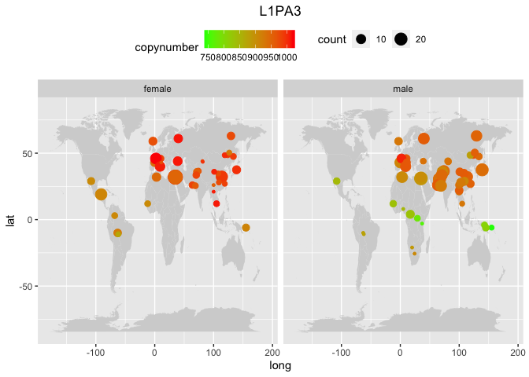<!-- -->

``` r
plot_map(data, "L1PA7_5")
```

    ## Warning in geom_map(data = world_map, map = world_map, aes(long, lat, map_id =
    ## region), : Ignoring unknown aesthetics: x and y

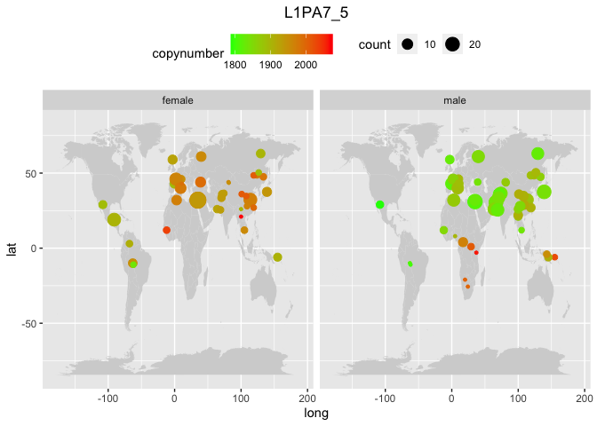<!-- -->

``` r
#plot_map(data, "L1PA4")
#plot_map(data, "L1")
#plot_map(data, "L1PREC1")
#plot_map(data, "L1PA16")
#plot_map(data, "L1PA6")
#plot_map(data, "L1HS")
#plot_map(data, "L1PA7")
#plot_map(data, "L1PB2c")
#plot_map(data, "L1PA10")
##plot_map(data, "L1PA8")
#plot_map(data, "L1PREC2")
#plot_map(data, "L1PA15")
#plot_map(data, "L1P_MA2")
#plot_map(data, "L1MC1")
#plot_map(data, "L1PB2")
#plot_map(data, "L1PB4")
```

### SINEs

``` r
plot_map(data, "ALU")
```

    ## Warning in geom_map(data = world_map, map = world_map, aes(long, lat, map_id =
    ## region), : Ignoring unknown aesthetics: x and y

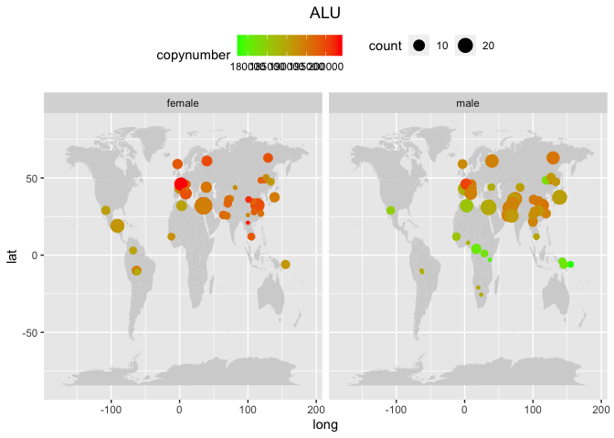<!-- -->

``` r
#plot_map(data, "SVA_A")
```

### DNA transposons

``` r
plot_map(data, "MER2")
```

    ## Warning in geom_map(data = world_map, map = world_map, aes(long, lat, map_id =
    ## region), : Ignoring unknown aesthetics: x and y

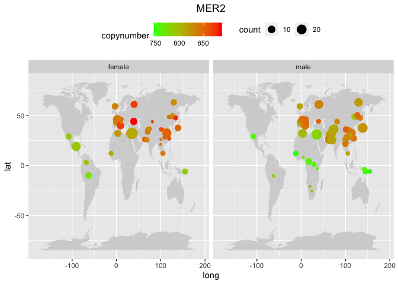<!-- -->

### Endogenous retroviruses

``` r
plot_map(data, "MLT2A1")
```

    ## Warning in geom_map(data = world_map, map = world_map, aes(long, lat, map_id =
    ## region), : Ignoring unknown aesthetics: x and y

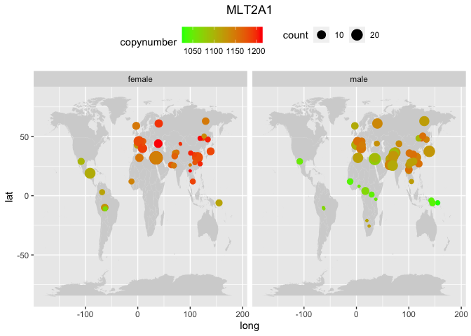<!-- -->

### Satellites

``` r
plot_map(data, "GSATII")
```

    ## Warning in geom_map(data = world_map, map = world_map, aes(long, lat, map_id =
    ## region), : Ignoring unknown aesthetics: x and y

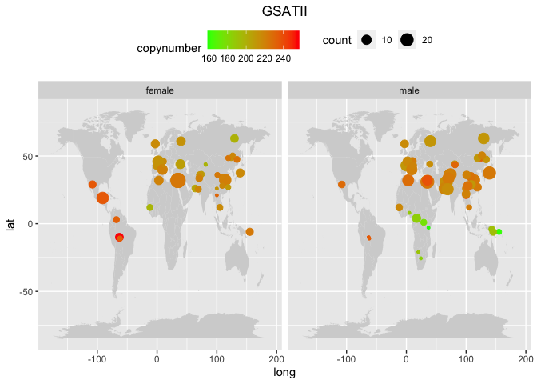<!-- -->

## Copynumber standard deviation by population

``` r
plot_cn_sd <- function(data, TE, ylimits){
  
m <- filter(data, sex=="male")
f <- filter(data, sex=="female")

m_singleTE <- filter(m, familyname==TE) %>% mutate(pop = fct_reorder(pop, copynumber))
m_plot <- ggplot(m_singleTE, aes(pop, copynumber, fill=country))+
  geom_bar(stat = "identity")+
  geom_errorbar(aes(ymin=copynumber-sd, ymax=copynumber+sd), alpha=0.5)+
  ggtitle("male") + ylab("Mean copynumber") + xlab("Population") +
  theme(axis.text.x = element_text(angle = 90, hjust = 1, size=4), axis.title.y = element_blank()) + coord_cartesian(ylim=ylimits) +
  theme(plot.title = element_text(hjust = 0.5))

f_singleTE <- filter(f, familyname==TE) %>% mutate(pop = fct_reorder(pop, copynumber))
f_plot <- ggplot(f_singleTE, aes(pop, copynumber, fill=country))+
  geom_bar(stat = "identity")+
  geom_errorbar(aes(ymin=copynumber-sd, ymax=copynumber+sd), alpha=0.5)+
  ggtitle("female") + ylab("Mean copynumber") + xlab("Population") +
  theme(axis.text.x = element_text(angle = 90, hjust = 1, size=4)) + coord_cartesian(ylim=ylimits) +
  theme(plot.title = element_text(hjust = 0.5))

figure <- ggarrange(f_plot, m_plot, common.legend = TRUE)
(figure_final <- annotate_figure(figure, top=text_grob(TE)))
}

plot_cn_sd(data, "L1PA16", c(1850, 2500))
```

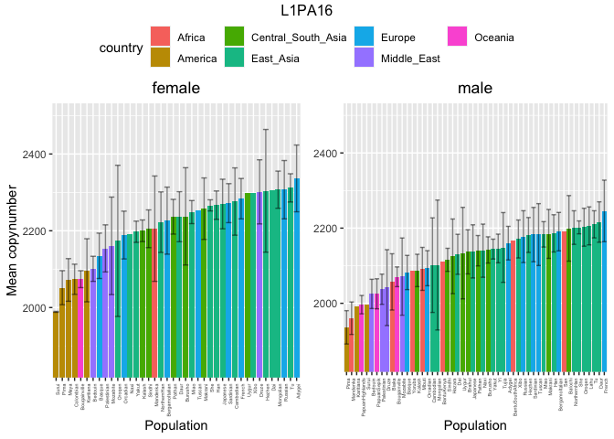<!-- -->

``` r
plot_cn_sd(data, "L1PA3", c(800, 1100))
```

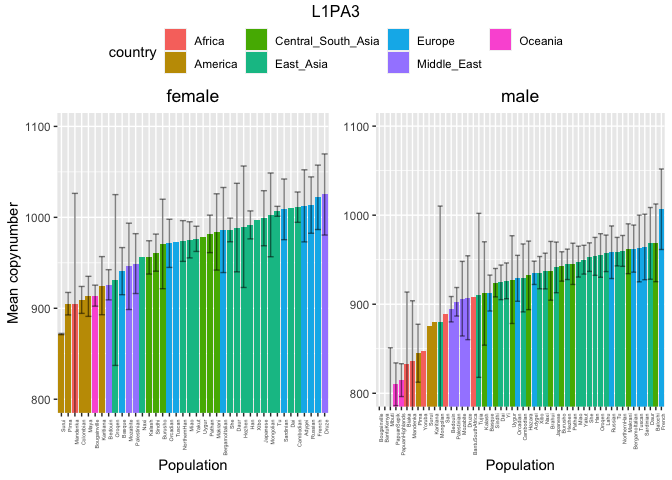<!-- -->

``` r
plot_cn_sd(data, "L1PB1", c(1100, 1450))
```

<!-- -->

``` r
plot_cn_sd(data, "L1PA7_5", c(1800, 2150))
```

<!-- -->

``` r
plot_cn_sd(data, "ALU", c(150000, 220000))
```

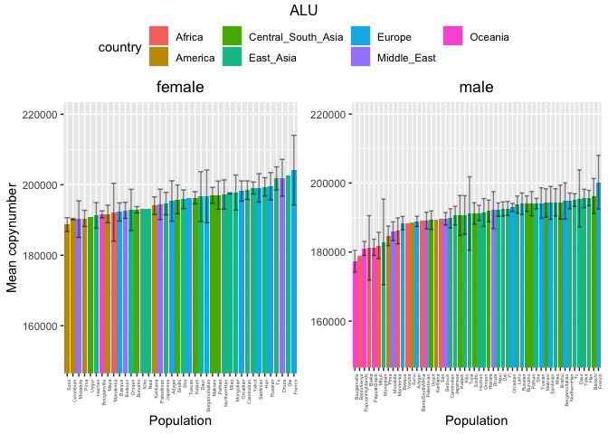<!-- -->

``` r
plot_cn_sd(data, "MER2", c(750, 950))
```

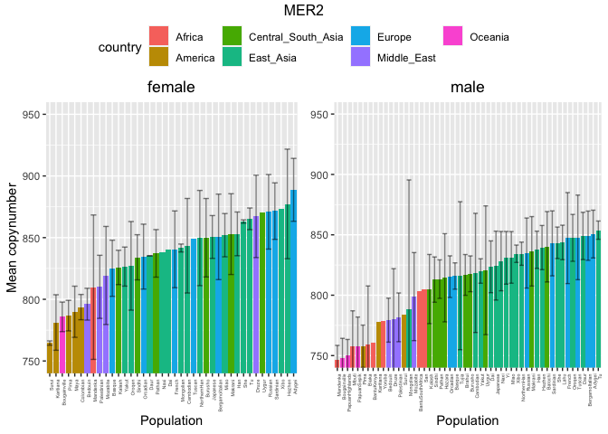<!-- -->

``` r
plot_cn_sd(data, "MLT2A1", c(900, 1280))
```

<!-- -->

``` r
plot_cn_sd(data, "L2", c(5, 11))
```

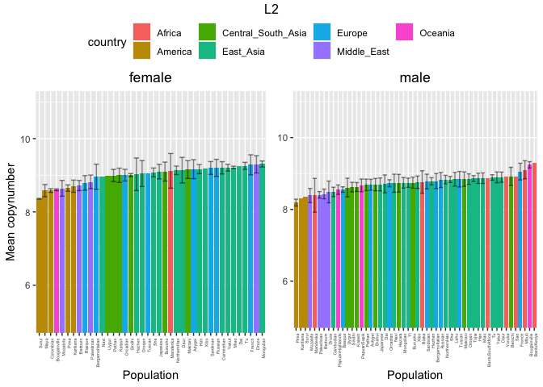<!-- -->
