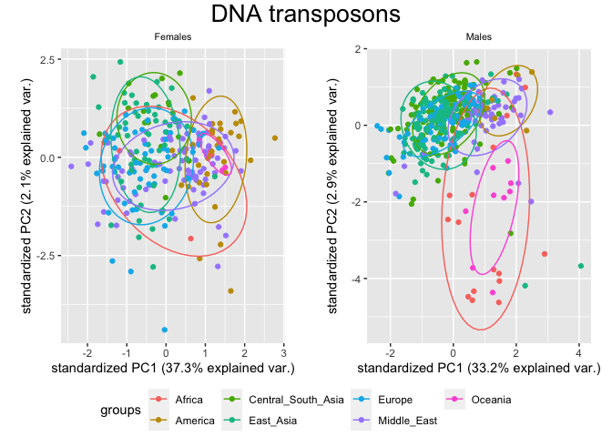
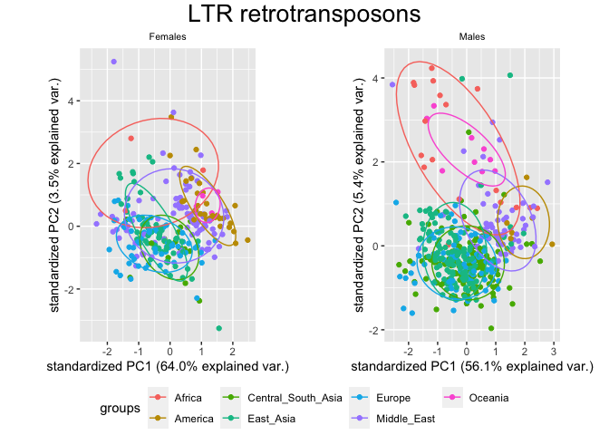
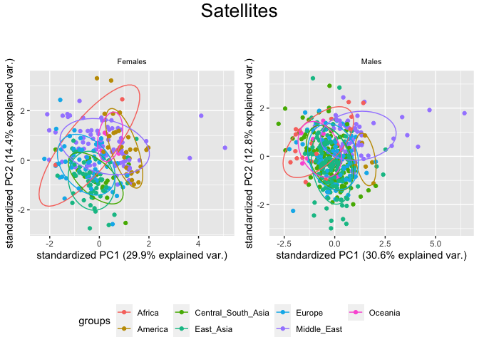
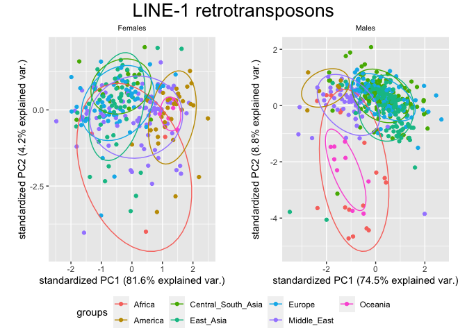
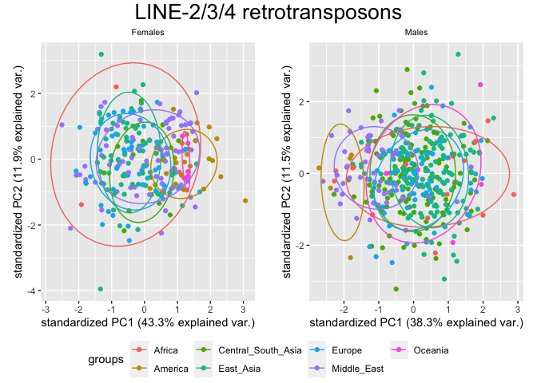

PCA for different subsets of the dataset
================

In this script I create different PCAs for different subsets of the HGDP
summary dataset. The focus is the `copynumber` of every transposon for
each individual.

``` r
library(tidyverse)
```

    ## ── Attaching packages ─────────────────────────────────────── tidyverse 1.3.2 ──
    ## ✔ ggplot2 3.4.0      ✔ purrr   0.3.4 
    ## ✔ tibble  3.1.8      ✔ dplyr   1.0.10
    ## ✔ tidyr   1.2.1      ✔ stringr 1.4.1 
    ## ✔ readr   2.1.2      ✔ forcats 0.5.2 
    ## ── Conflicts ────────────────────────────────────────── tidyverse_conflicts() ──
    ## ✖ dplyr::filter() masks stats::filter()
    ## ✖ dplyr::lag()    masks stats::lag()

``` r
library(ggpubr)

no_pcr_samples <- read_tsv("/Volumes/Temp1/rpianezza/investigation/HGDP-no-PCR/HGDP-only-pcr-free-samples.tsv", col_names = ("ID"))
```

    ## Rows: 676 Columns: 1
    ## ── Column specification ────────────────────────────────────────────────────────
    ## Delimiter: "\t"
    ## chr (1): ID
    ## 
    ## ℹ Use `spec()` to retrieve the full column specification for this data.
    ## ℹ Specify the column types or set `show_col_types = FALSE` to quiet this message.

``` r
HGDP <- read_csv("/Volumes/Temp1/rpianezza/TE/summary-HGDP/USEME_HGDP_complete_reflib6.2_mq10_batchinfo_cutoff0.01.txt", col_names = c("ID","pop","sex","country","type","familyname","length","reads","copynumber","batch"), skip=1) %>% type_convert() %>% filter(ID %in% no_pcr_samples$ID)
```

    ## Rows: 1394352 Columns: 10
    ## ── Column specification ────────────────────────────────────────────────────────
    ## Delimiter: ","
    ## chr (7): ID, pop, sex, country, type, familyname, batch
    ## dbl (3): length, reads, copynumber
    ## 
    ## ℹ Use `spec()` to retrieve the full column specification for this data.
    ## ℹ Specify the column types or set `show_col_types = FALSE` to quiet this message.
    ## 
    ## ── Column specification ────────────────────────────────────────────────────────
    ## cols(
    ##   ID = col_character(),
    ##   pop = col_character(),
    ##   sex = col_character(),
    ##   country = col_character(),
    ##   type = col_character(),
    ##   familyname = col_character(),
    ##   batch = col_character()
    ## )

# Function for PCA plotting

``` r
PCA <- function(data, title){
  m <- filter(data, sex=='male')
  f <- filter(data, sex=='female')
  len <- length(unique(data$familyname))
  males <- length(unique(m$ID))
  females <- length(unique(f$ID))

  f_matrix<-matrix(as.vector(f$copynumber),nrow=females,ncol=len,byrow=T)
  f_fram<-data.frame(f_matrix)

  names(f_fram)<-unique(f$familyname)
  f_matrixcont<-matrix(as.vector(f$country),nrow=females,ncol=len,byrow=T)
  f_framcont<-data.frame(f_matrixcont)
  f_contcol<-c(f_framcont$X1)

  fHGDP.pca <- prcomp(f_fram, center = TRUE, scale = TRUE)
  
  m_matrix<-matrix(as.vector(m$copynumber),nrow=males,ncol=len,byrow=T)
  m_fram<-data.frame(m_matrix)

  names(m_fram)<-unique(m$familyname)
  m_matrixcont<-matrix(as.vector(m$country),nrow=males,ncol=len,byrow=T)
  m_framcont<-data.frame(m_matrixcont)
  m_contcol<-c(m_framcont$X1)

  mHGDP.pca <- prcomp(m_fram, center = TRUE, scale = TRUE)
  
  
  library(ggbiplot)
  f_PCA <- ggbiplot(fHGDP.pca, var.axes=FALSE, groups = f_contcol, ellipse = TRUE)+ ggtitle("Females")+ theme(plot.title = element_text(size = 8, hjust = 0.5)) 
  m_PCA <- ggbiplot(mHGDP.pca, var.axes=FALSE, groups = m_contcol, ellipse = TRUE)+ ggtitle("Males")+ theme(plot.title = element_text(size = 8, hjust = 0.5)) 
  
figure <- ggarrange(f_PCA, m_PCA, ncol = 2, nrow = 1, common.legend = TRUE, legend = "bottom", align = "hv", font.label = list(size = 10, color = "black", face = "bold", family = NULL, position = "top"))

annotate_figure(figure, top = text_grob(title, color = "black", size = 20), fig.lab = "")
}
```

# PCA for the most variable TEs

``` r
TE_cutoff <- filter(HGDP, type=='te') %>% group_by(familyname, sex) %>% mutate(max=max(copynumber), min=min(copynumber)) %>% mutate(diff = max-min, ratio = max/min)

out_abs <- filter(TE_cutoff, diff>200 & diff<Inf)
out_rel <- filter(TE_cutoff, ratio>5 & ratio<Inf & max>1.5)
out_abs_names <- c(unique(out_abs$familyname))
out_rel_names <- c(unique(out_rel$familyname))
(out_names <- c(out_abs_names, out_rel_names[!(out_rel_names %in% out_abs_names)]) %>% sort())
```

    ##  [1] "6kbHsap"     "ALR"         "ALR_"        "ALR1"        "ALR2"       
    ##  [6] "ALRa_"       "ALRb"        "ALU"         "AmnSINE1_HS" "CER"        
    ## [11] "HSATI"       "HSATII"      "L1"          "L1HS"        "L1ME5"      
    ## [16] "L1P_MA2"     "L1PA10"      "L1PA15"      "L1PA16"      "L1PA3"      
    ## [21] "L1PA4"       "L1PA6"       "L1PA7"       "L1PA7_5"     "L1PA8"      
    ## [26] "L1PB1"       "L1PB2c"      "L1PREC1"     "L1PREC2"     "LSAU"       
    ## [31] "MER2"        "MER22"       "MLT1B"       "MLT2A1"      "MLT2A2"     
    ## [36] "MSTA"        "SVA_A"       "THE1_I"      "THE1A"       "THE1B"      
    ## [41] "THE1C"       "THE1D"       "TIGGER1"

``` r
most_variable<-subset(HGDP, type=="te") %>% filter(familyname %in% out_names)

PCA(TE_cutoff, "All the repetitive sequences")
```

    ## Loading required package: plyr

    ## ------------------------------------------------------------------------------

    ## You have loaded plyr after dplyr - this is likely to cause problems.
    ## If you need functions from both plyr and dplyr, please load plyr first, then dplyr:
    ## library(plyr); library(dplyr)

    ## ------------------------------------------------------------------------------

    ## 
    ## Attaching package: 'plyr'

    ## The following object is masked from 'package:ggpubr':
    ## 
    ##     mutate

    ## The following objects are masked from 'package:dplyr':
    ## 
    ##     arrange, count, desc, failwith, id, mutate, rename, summarise,
    ##     summarize

    ## The following object is masked from 'package:purrr':
    ## 
    ##     compact

    ## Loading required package: scales

    ## 
    ## Attaching package: 'scales'

    ## The following object is masked from 'package:purrr':
    ## 
    ##     discard

    ## The following object is masked from 'package:readr':
    ## 
    ##     col_factor

    ## Loading required package: grid

<!-- -->

``` r
PCA(most_variable, "Most variable repetitive sequences")
```

<!-- -->

# PCA for different RepSeq families

``` r
classification_tot <- read_tsv("/Users/rpianezza/TE/ric-documentation-Rmd/other-files/repbase_classification.txt", col_names = c("familyname", "superfamily", "shared_with"))
```

    ## Rows: 1386 Columns: 3
    ## ── Column specification ────────────────────────────────────────────────────────
    ## Delimiter: "\t"
    ## chr (3): familyname, superfamily, shared_with
    ## 
    ## ℹ Use `spec()` to retrieve the full column specification for this data.
    ## ℹ Specify the column types or set `show_col_types = FALSE` to quiet this message.

``` r
families_in_HGDP <- filter(HGDP, type=="te") %>% distinct(familyname) %>% pull()

classification <- filter(classification_tot, familyname %in% families_in_HGDP)

HGDP_class <- full_join(HGDP, classification, by="familyname")

#write_tsv(HGDP_class, "/Volumes/Temp1/rpianezza/TE/summary-HGDP/HGDP_cutoff_classified.tsv", col_names = TRUE)

DNA_names <- c("Crypton", "hAT", "Helitron", "Kolobok", "Mariner/Tc1", "Merlin", "MuDR", "piggyBac", "DNA transposon")
LINE_names <- c("L1", "CR1", "L2", "Crack", "RTE", "RTEX", "R4", "Vingi", "Tx1", "Penelope")
SINE_names <- c("SINE1/7SL", "SINE2/tRNA", "SINE3/5S", "SINE")
LTR_names <- c("ERV1", "ERV2", "ERV3", "Gypsy", "Endogenous Retrovirus", "LTR Retrotransposon", "Long terminal repeat", "Non-LTR Retrotransposon")
satellites_names <- c("Satellite", "satellite", "SAT")

(classification <- HGDP_class %>% mutate(class = case_when(superfamily %in% DNA_names ~ "DNA", superfamily %in% LINE_names ~ "LINE", superfamily %in% SINE_names ~ "SINE", superfamily %in% LTR_names ~ "LTR", superfamily %in% satellites_names ~ "satellite")))
```

    ## # A tibble: 1,138,384 × 13
    ##    ID       pop   sex   country type  famil…¹ length reads copyn…² batch super…³
    ##    <chr>    <chr> <chr> <chr>   <chr> <chr>    <dbl> <dbl>   <dbl> <chr> <chr>  
    ##  1 HGDP000… Brah… male  Centra… scg   chr1:9…   4152 1279.   0.989 ro    <NA>   
    ##  2 HGDP000… Brah… male  Centra… scg   chr1:9…   5136 1700.   1.06  ro    <NA>   
    ##  3 HGDP000… Brah… male  Centra… scg   chr1:1…   3064 1051.   1.10  ro    <NA>   
    ##  4 HGDP000… Brah… male  Centra… scg   chr1:1…   3239 1096.   1.09  ro    <NA>   
    ##  5 HGDP000… Brah… male  Centra… scg   chr1:1…   4035 1445.   1.15  ro    <NA>   
    ##  6 HGDP000… Brah… male  Centra… scg   chr1:1…   2500  924.   1.19  ro    <NA>   
    ##  7 HGDP000… Brah… male  Centra… scg   chr1:1…   2599  779.   0.963 ro    <NA>   
    ##  8 HGDP000… Brah… male  Centra… scg   chr1:1…   2124  613.   0.926 ro    <NA>   
    ##  9 HGDP000… Brah… male  Centra… scg   chr1:2…   6284 2020.   1.03  ro    <NA>   
    ## 10 HGDP000… Brah… male  Centra… scg   chr1:2…   3222 1044.   1.04  ro    <NA>   
    ## # … with 1,138,374 more rows, 2 more variables: shared_with <chr>, class <chr>,
    ## #   and abbreviated variable names ¹​familyname, ²​copynumber, ³​superfamily

``` r
LINE <- filter(classification, type=="te", class=="LINE")
PCA(LINE, "LINEs")
```

<!-- -->

``` r
DNA <- filter(classification, type=="te", class=="DNA")
PCA(DNA, "DNA transposons")
```

<!-- -->

``` r
LTR <- filter(classification, type=="te", class=="LTR")
PCA(LTR, "LTR retrotransposons")
```

<!-- -->

``` r
simple_repeats <- filter(classification, type=="te", class=="satellite")
PCA(simple_repeats, "Satellites")
```

<!-- -->

I notice that the pattern previously described is evident in **non-LTR
retrotransposons** as well as in **DNA transposons**, but not in
**simple repeats**. We do not expect simple repeats to rapidly spread
into different populations as TEs, so this is an expected result, but
still nice to see.

``` r
L1 <- filter(classification, type=="te", superfamily=="L1")
PCA(L1, "LINE-1 retrotransposons")
```

<!-- -->

``` r
L2 <- subset(classification, type=="te") %>% filter(grepl("L2|L3|L4",familyname))
PCA(L2, "LINE-2/3/4 retrotransposons")
```

<!-- -->
