SNPs - exclude non variable TEs
================

## Prepare the environment

``` r
library(tidyverse)
```

    ## ── Attaching packages ─────────────────────────────────────── tidyverse 1.3.2 ──
    ## ✔ ggplot2 3.4.0      ✔ purrr   0.3.4 
    ## ✔ tibble  3.1.8      ✔ dplyr   1.0.10
    ## ✔ tidyr   1.2.1      ✔ stringr 1.4.1 
    ## ✔ readr   2.1.2      ✔ forcats 0.5.2 
    ## ── Conflicts ────────────────────────────────────────── tidyverse_conflicts() ──
    ## ✖ dplyr::filter() masks stats::filter()
    ## ✖ dplyr::lag()    masks stats::lag()

``` r
library(ggpubr)
```

## Create list of non-variable TEs and other files

``` r
HGDP<-read_delim("/Volumes/Temp1/rpianezza/TE/summary-HGDP/USEME_HGDP_complete_reflib6.2_mq10_batchinfo_cutoff0.01.txt")
```

    ## Rows: 1394352 Columns: 10
    ## ── Column specification ────────────────────────────────────────────────────────
    ## Delimiter: ","
    ## chr (7): ID, Pop, sex, Country, type, familyname, batch
    ## dbl (3): length, reads, copynumber
    ## 
    ## ℹ Use `spec()` to retrieve the full column specification for this data.
    ## ℹ Specify the column types or set `show_col_types = FALSE` to quiet this message.

``` r
names(HGDP)<-c("ID","pop","sex","country","type","familyname","length","reads","copynumber","batch")

order <- c("Africa","America","Central Asia and Siberia","East Asia","West Eurasia","South Asia","Oceania")
SGDP <- read_tsv("/Volumes/Temp2/rpianezza/SGDP/summary/USEME_SGDP_cutoff") %>% dplyr::rename(ID=biosample)
```

    ## Rows: 470028 Columns: 10
    ## ── Column specification ────────────────────────────────────────────────────────
    ## Delimiter: "\t"
    ## chr (7): biosample, sex, pop, country, type, familyname, batch
    ## dbl (3): length, reads, copynumber
    ## 
    ## ℹ Use `spec()` to retrieve the full column specification for this data.
    ## ℹ Specify the column types or set `show_col_types = FALSE` to quiet this message.

``` r
HGDP_pcr_free_samples <- read_tsv("/Volumes/Temp1/rpianezza/investigation/HGDP-no-PCR/HGDP-only-pcr-free-samples.tsv", col_names = "ID")
```

    ## Rows: 676 Columns: 1
    ## ── Column specification ────────────────────────────────────────────────────────
    ## Delimiter: "\t"
    ## chr (1): ID
    ## 
    ## ℹ Use `spec()` to retrieve the full column specification for this data.
    ## ℹ Specify the column types or set `show_col_types = FALSE` to quiet this message.

``` r
HGDP_pcr_free <- HGDP %>% filter(ID %in% HGDP_pcr_free_samples$ID)
HGDP_pcr <- HGDP %>% filter(!(ID %in% HGDP_pcr_free_samples$ID))

SGDP_pcr_free_samples <- read_tsv("/Volumes/Temp1/rpianezza/SGDP/ric-documentation/SGDP-no-PCR.tsv")
```

    ## Rows: 261 Columns: 1
    ## ── Column specification ────────────────────────────────────────────────────────
    ## Delimiter: "\t"
    ## chr (1): ID
    ## 
    ## ℹ Use `spec()` to retrieve the full column specification for this data.
    ## ℹ Specify the column types or set `show_col_types = FALSE` to quiet this message.

``` r
SGDP_pcr_free <- SGDP %>% filter(ID %in% SGDP_pcr_free_samples$ID)
SGDP_pcr <- SGDP %>% filter(!(ID %in% SGDP_pcr_free_samples$ID))

a_HGDP <- read_tsv("/Volumes/Temp1/rpianezza/PCA-copynumber-all-analysis/a_HGDP.tsv")
```

    ## Rows: 828 Columns: 2
    ## ── Column specification ────────────────────────────────────────────────────────
    ## Delimiter: "\t"
    ## chr (1): ID
    ## dbl (1): a
    ## 
    ## ℹ Use `spec()` to retrieve the full column specification for this data.
    ## ℹ Specify the column types or set `show_col_types = FALSE` to quiet this message.

``` r
HGDP_nobiased_samples <- filter(a_HGDP, (a > (-0.5)) & (a<0.5)) %>% select(ID) %>% pull()
HGDP_nobiasedID <- filter(HGDP, ID %in% HGDP_nobiased_samples)
HGDP_nobiasedID_pcrfree <- filter(HGDP_pcr_free, ID %in% HGDP_nobiased_samples)

a_SGDP <- read_tsv("/Volumes/Temp1/rpianezza/PCA-copynumber-all-analysis/a_SGDP.tsv")
```

    ## Rows: 276 Columns: 2
    ## ── Column specification ────────────────────────────────────────────────────────
    ## Delimiter: "\t"
    ## chr (1): ID
    ## dbl (1): a
    ## 
    ## ℹ Use `spec()` to retrieve the full column specification for this data.
    ## ℹ Specify the column types or set `show_col_types = FALSE` to quiet this message.

``` r
SGDP_nobiased_samples <- filter(a_SGDP, (a > (-0.5)) & (a<0.5)) %>% select(ID) %>% pull()
SGDP_nobiasedID <- filter(SGDP, ID %in% SGDP_nobiased_samples)
SGDP_nobiasedID_pcrfree <- filter(SGDP_pcr_free, ID %in% SGDP_nobiased_samples)
```

## Read the SNPs matrixes

The SNPs matrixes are created using the script
**frequency_matrix_v7.py**. This version of the script filters
automatically the non-variable TEs in copynumber.

``` r
HGDP_all = "/Volumes/Temp1/rpianezza/PCA-SNPs-all-analysis/matrixes/only-variableTEs/HGDP.matrix_processed"
SGDP_all = "/Volumes/Temp1/rpianezza/PCA-SNPs-all-analysis/matrixes/only-variableTEs/SGDP.matrix_processed"

HGDP_noGCbias = "/Volumes/Temp1/rpianezza/PCA-SNPs-all-analysis/matrixes/only-variableTEs/HGDP.noGCbias.matrix_processed"
SGDP_noGCbias = "/Volumes/Temp1/rpianezza/PCA-SNPs-all-analysis/matrixes/only-variableTEs/SGDP.noGCbias.matrix_processed"

HGDP_45_55 = "/Volumes/Temp1/rpianezza/PCA-SNPs-all-analysis/matrixes/only-variableTEs/HGDP.45-55.matrix_processed"
SGDP_45_55 = "/Volumes/Temp1/rpianezza/PCA-SNPs-all-analysis/matrixes/only-variableTEs/SGDP.45-55.matrix_processed"

HGDP_noGCbias_45_55 = "/Volumes/Temp1/rpianezza/PCA-SNPs-all-analysis/matrixes/only-variableTEs/HGDP.noGCbias.45-55.matrix_processed"
SGDP_noGCbias_45_55 = "/Volumes/Temp1/rpianezza/PCA-SNPs-all-analysis/matrixes/only-variableTEs/SGDP.noGCbias.45-55.matrix_processed"
```

## Create the function for PCA plotting

``` r
PCA <- function(freq_matrix, metadata){

matrix <- read_csv(freq_matrix)
  
f_metadata <- metadata %>% filter(sex=="female") %>% select(ID, sex, country, pop) %>% distinct()
m_metadata <- metadata %>% filter(sex=="male") %>% select(ID, sex, country, pop) %>% distinct()
males_matrix <- inner_join(m_metadata, matrix, by="ID")
females_matrix <- inner_join(f_metadata, matrix, by="ID")

f_pca_data <- females_matrix %>%  select_if(~ !all(. == .[1]))
m_pca_data <- males_matrix %>%  select_if(~ !all(. == .[1]))
f_pca_result <- prcomp(f_pca_data[, -c(1:3)], center = TRUE, scale = TRUE)
m_pca_result <- prcomp(m_pca_data[, -c(1:3)], center = TRUE, scale = TRUE)
      
f_var_explained <- f_pca_result$sdev^2/sum(f_pca_result$sdev^2)
m_var_explained <- m_pca_result$sdev^2/sum(m_pca_result$sdev^2)
      
f <- ggplot(data.frame(f_pca_result$x, country=females_matrix$country), aes(x=PC1,y=PC2, color=country)) + geom_point(size=2, show.legend = FALSE) + labs(x=paste0("PC1: ",round(f_var_explained[1]*100,1),"%"), y=paste0("PC2: ",round(f_var_explained[2]*100,1),"%"))
   
m <- ggplot(data.frame(m_pca_result$x, country=males_matrix$country), aes(x=PC1,y=PC2, color=country)) + geom_point(size=2, show.legend = FALSE) + labs(x=paste0("PC1: ",round(m_var_explained[1]*100,1),"%"), y=paste0("PC2: ",round(m_var_explained[2]*100,1),"%"))
     
plot <- ggarrange(f, m, ncol = 2, nrow = 1, common.legend = TRUE, legend = "bottom", align = "hv", font.label = list(size = 10, color = "black", face = "bold", family = NULL, position = "top"))
}

PCA_SGDP <- function(freq_matrix, metadata, order){
  matrix <- read_csv(freq_matrix)
  
  f_metadata <- metadata %>% filter(sex=="female") %>% select(ID, sex, country, pop) %>% distinct()
  m_metadata <- metadata %>% filter(sex=="male") %>% select(ID, sex, country, pop) %>% distinct()
  f_metadata$country_reordered <- factor(f_metadata$country, levels=order)
  m_metadata$country_reordered <- factor(m_metadata$country, levels=order)
  males_matrix <- inner_join(m_metadata, matrix, by="ID")
  females_matrix <- inner_join(f_metadata, matrix, by="ID")

   f_pca_data <- females_matrix %>%  select_if(~ !all(. == .[1]))
   m_pca_data <- males_matrix %>%  select_if(~ !all(. == .[1]))
    f_pca_result <- prcomp(f_pca_data[, -c(1:4)], center = TRUE, scale = TRUE)
    m_pca_result <- prcomp(m_pca_data[, -c(1:4)], center = TRUE, scale = TRUE)
     
    f_var_explained <- f_pca_result$sdev^2/sum(f_pca_result$sdev^2)
    m_var_explained <- m_pca_result$sdev^2/sum(m_pca_result$sdev^2)
        
 f <- ggplot(data.frame(f_pca_result$x, country=females_matrix$country), aes(x=PC1,y=PC2, color=females_matrix$country_reordered)) + geom_point(size=2, show.legend = FALSE) + labs(x=paste0("PC1: ",round(f_var_explained[1]*100,1),"%"), y=paste0("PC2: ",round(f_var_explained[2]*100,1),"%"))
 m <- ggplot(data.frame(m_pca_result$x, country=males_matrix$country), aes(x=PC1,y=PC2, color=males_matrix$country_reordered)) + geom_point(size=2, show.legend = FALSE) + labs(x=paste0("PC1: ",round(m_var_explained[1]*100,1),"%"), y=paste0("PC2: ",round(m_var_explained[2]*100,1),"%"))
       
    plot <- ggarrange(f, m, ncol = 2, nrow = 1, common.legend = TRUE, legend = "bottom", align = "hv", font.label = list(size = 10, color = "black", face = "bold", family = NULL, position = "top"))
}
```

``` r
# All samples
(HGDP_ <- PCA(HGDP_all, HGDP))
```

    ## Rows: 828 Columns: 46289
    ## ── Column specification ────────────────────────────────────────────────────────
    ## Delimiter: ","
    ## chr     (1): ID
    ## dbl (46288): HERV9_te_78A, HERV9_te_78T, HERV9_te_78C, HERV9_te_78G, HERV9_t...
    ## 
    ## ℹ Use `spec()` to retrieve the full column specification for this data.
    ## ℹ Specify the column types or set `show_col_types = FALSE` to quiet this message.

<!-- -->

``` r
(HGDP_nobiasSNPs <- PCA(HGDP_noGCbias, HGDP))                                   # no GC biased SNPs
```

    ## Rows: 828 Columns: 1993
    ## ── Column specification ────────────────────────────────────────────────────────
    ## Delimiter: ","
    ## chr    (1): ID
    ## dbl (1992): HERV9_te_2585A, HERV9_te_2585T, HERV9_te_2585C, HERV9_te_2585G, ...
    ## 
    ## ℹ Use `spec()` to retrieve the full column specification for this data.
    ## ℹ Specify the column types or set `show_col_types = FALSE` to quiet this message.

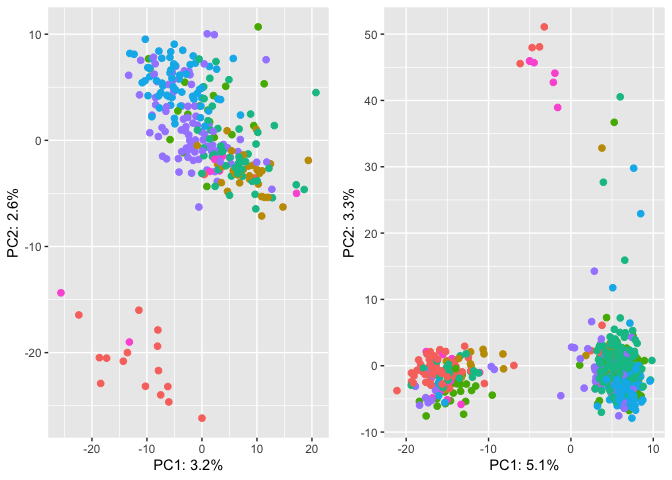<!-- -->

``` r
(HGDP_45to55 <- PCA(HGDP_45_55, HGDP))                                          # no GC biased TEs
```

    ## Rows: 828 Columns: 19717
    ## ── Column specification ────────────────────────────────────────────────────────
    ## Delimiter: ","
    ## chr     (1): ID
    ## dbl (19716): HERV9_te_78A, HERV9_te_78T, HERV9_te_78C, HERV9_te_78G, HERV9_t...
    ## 
    ## ℹ Use `spec()` to retrieve the full column specification for this data.
    ## ℹ Specify the column types or set `show_col_types = FALSE` to quiet this message.

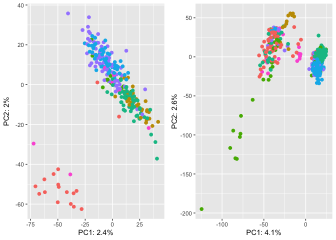<!-- -->

``` r
(HGDP_nobiasSNPs_45to55 <- PCA(HGDP_noGCbias_45_55, HGDP))                      # no GC biased SNPs and TEs
```

    ## Rows: 828 Columns: 837
    ## ── Column specification ────────────────────────────────────────────────────────
    ## Delimiter: ","
    ## chr   (1): ID
    ## dbl (836): HERV9_te_2585A, HERV9_te_2585T, HERV9_te_2585C, HERV9_te_2585G, H...
    ## 
    ## ℹ Use `spec()` to retrieve the full column specification for this data.
    ## ℹ Specify the column types or set `show_col_types = FALSE` to quiet this message.

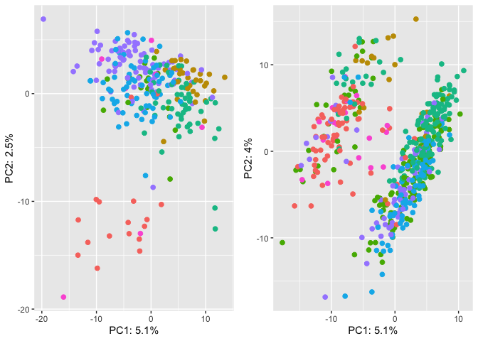<!-- -->

``` r
# PCR-free
(HGDP_pcrfree <- PCA(HGDP_all, HGDP_pcr_free))
```

    ## Rows: 828 Columns: 46289
    ## ── Column specification ────────────────────────────────────────────────────────
    ## Delimiter: ","
    ## chr     (1): ID
    ## dbl (46288): HERV9_te_78A, HERV9_te_78T, HERV9_te_78C, HERV9_te_78G, HERV9_t...
    ## 
    ## ℹ Use `spec()` to retrieve the full column specification for this data.
    ## ℹ Specify the column types or set `show_col_types = FALSE` to quiet this message.

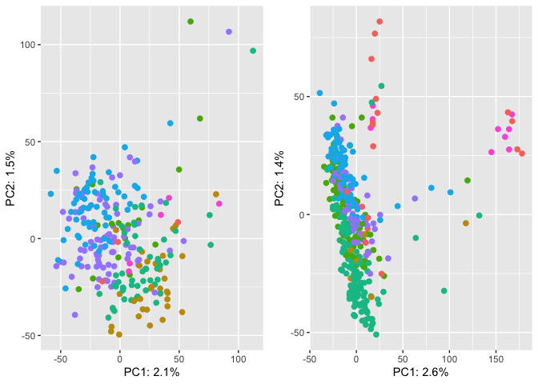<!-- -->

``` r
(HGDP_nobiasSNPs_pcrfree <- PCA(HGDP_noGCbias, HGDP_pcr_free))                  # no GC biased SNPs
```

    ## Rows: 828 Columns: 1993
    ## ── Column specification ────────────────────────────────────────────────────────
    ## Delimiter: ","
    ## chr    (1): ID
    ## dbl (1992): HERV9_te_2585A, HERV9_te_2585T, HERV9_te_2585C, HERV9_te_2585G, ...
    ## 
    ## ℹ Use `spec()` to retrieve the full column specification for this data.
    ## ℹ Specify the column types or set `show_col_types = FALSE` to quiet this message.

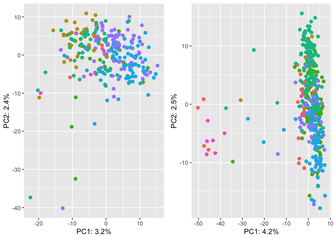<!-- -->

``` r
(HGDP_45to55_pcrfree <- PCA(HGDP_45_55, HGDP_pcr_free))                         # no GC biased TEs
```

    ## Rows: 828 Columns: 19717
    ## ── Column specification ────────────────────────────────────────────────────────
    ## Delimiter: ","
    ## chr     (1): ID
    ## dbl (19716): HERV9_te_78A, HERV9_te_78T, HERV9_te_78C, HERV9_te_78G, HERV9_t...
    ## 
    ## ℹ Use `spec()` to retrieve the full column specification for this data.
    ## ℹ Specify the column types or set `show_col_types = FALSE` to quiet this message.

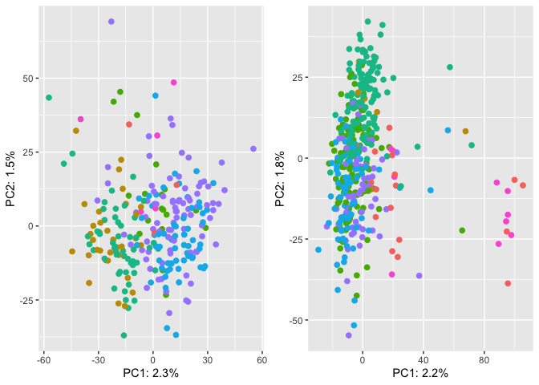<!-- -->

``` r
(HGDP_nobiasSNPs_45to55_pcrfree <- PCA(HGDP_noGCbias_45_55, HGDP_pcr_free))     # no GC biased SNPs and TEs
```

    ## Rows: 828 Columns: 837
    ## ── Column specification ────────────────────────────────────────────────────────
    ## Delimiter: ","
    ## chr   (1): ID
    ## dbl (836): HERV9_te_2585A, HERV9_te_2585T, HERV9_te_2585C, HERV9_te_2585G, H...
    ## 
    ## ℹ Use `spec()` to retrieve the full column specification for this data.
    ## ℹ Specify the column types or set `show_col_types = FALSE` to quiet this message.

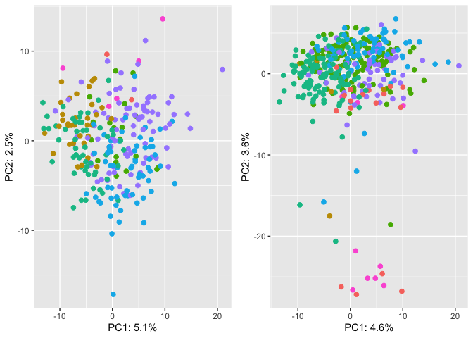<!-- -->

``` r
# PCR
(HGDP_pcrfree <- PCA(HGDP_all, HGDP_pcr))
```

    ## Rows: 828 Columns: 46289
    ## ── Column specification ────────────────────────────────────────────────────────
    ## Delimiter: ","
    ## chr     (1): ID
    ## dbl (46288): HERV9_te_78A, HERV9_te_78T, HERV9_te_78C, HERV9_te_78G, HERV9_t...
    ## 
    ## ℹ Use `spec()` to retrieve the full column specification for this data.
    ## ℹ Specify the column types or set `show_col_types = FALSE` to quiet this message.

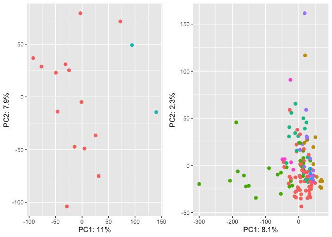<!-- -->

``` r
(HGDP_nobias_pcr <- PCA(HGDP_noGCbias, HGDP_pcr))                               # no GC biased SNPs
```

    ## Rows: 828 Columns: 1993
    ## ── Column specification ────────────────────────────────────────────────────────
    ## Delimiter: ","
    ## chr    (1): ID
    ## dbl (1992): HERV9_te_2585A, HERV9_te_2585T, HERV9_te_2585C, HERV9_te_2585G, ...
    ## 
    ## ℹ Use `spec()` to retrieve the full column specification for this data.
    ## ℹ Specify the column types or set `show_col_types = FALSE` to quiet this message.

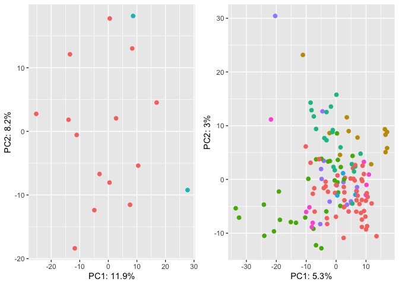<!-- -->

``` r
(HGDP_45to55_pcr <- PCA(HGDP_45_55, HGDP_pcr))                                  # no GC biased TEs
```

    ## Rows: 828 Columns: 19717
    ## ── Column specification ────────────────────────────────────────────────────────
    ## Delimiter: ","
    ## chr     (1): ID
    ## dbl (19716): HERV9_te_78A, HERV9_te_78T, HERV9_te_78C, HERV9_te_78G, HERV9_t...
    ## 
    ## ℹ Use `spec()` to retrieve the full column specification for this data.
    ## ℹ Specify the column types or set `show_col_types = FALSE` to quiet this message.

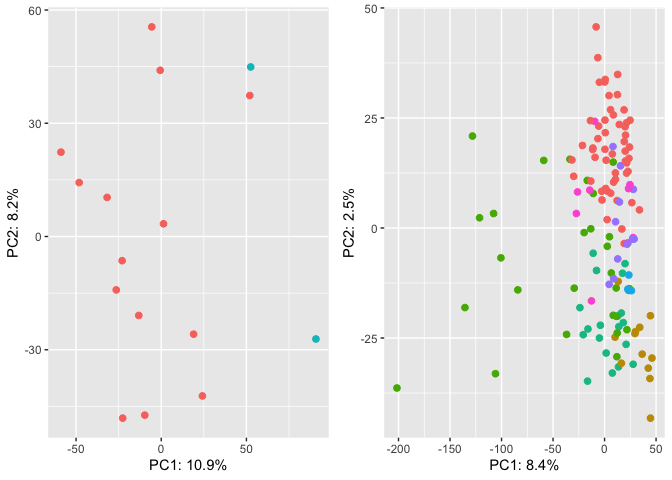<!-- -->

``` r
(HGDP_nobiasSNPs_45to55_pcr <- PCA(HGDP_noGCbias_45_55, HGDP_pcr))              # no GC biased SNPs and TEs
```

    ## Rows: 828 Columns: 837
    ## ── Column specification ────────────────────────────────────────────────────────
    ## Delimiter: ","
    ## chr   (1): ID
    ## dbl (836): HERV9_te_2585A, HERV9_te_2585T, HERV9_te_2585C, HERV9_te_2585G, H...
    ## 
    ## ℹ Use `spec()` to retrieve the full column specification for this data.
    ## ℹ Specify the column types or set `show_col_types = FALSE` to quiet this message.

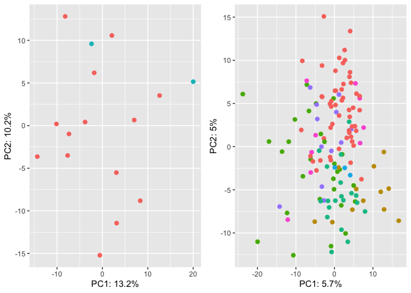<!-- -->

``` r
# PCR-free and not GC biased samples
(HGDP_GC <- PCA(HGDP_all, HGDP_nobiasedID_pcrfree))
```

    ## Rows: 828 Columns: 46289
    ## ── Column specification ────────────────────────────────────────────────────────
    ## Delimiter: ","
    ## chr     (1): ID
    ## dbl (46288): HERV9_te_78A, HERV9_te_78T, HERV9_te_78C, HERV9_te_78G, HERV9_t...
    ## 
    ## ℹ Use `spec()` to retrieve the full column specification for this data.
    ## ℹ Specify the column types or set `show_col_types = FALSE` to quiet this message.

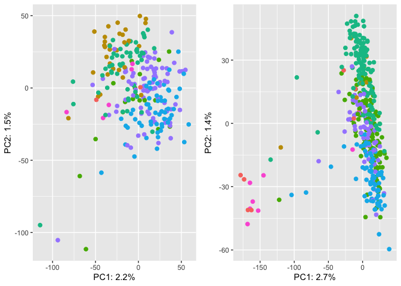<!-- -->

``` r
(HGDP_nobias_GC <- PCA(HGDP_noGCbias, HGDP_nobiasedID_pcrfree))                         # no GC biased SNPs
```

    ## Rows: 828 Columns: 1993
    ## ── Column specification ────────────────────────────────────────────────────────
    ## Delimiter: ","
    ## chr    (1): ID
    ## dbl (1992): HERV9_te_2585A, HERV9_te_2585T, HERV9_te_2585C, HERV9_te_2585G, ...
    ## 
    ## ℹ Use `spec()` to retrieve the full column specification for this data.
    ## ℹ Specify the column types or set `show_col_types = FALSE` to quiet this message.

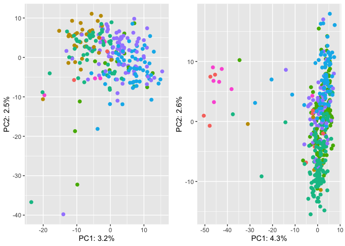<!-- -->

``` r
(HGDP_45to55_GC <- PCA(HGDP_45_55, HGDP_nobiasedID_pcrfree))                            # no GC biased TEs
```

    ## Rows: 828 Columns: 19717
    ## ── Column specification ────────────────────────────────────────────────────────
    ## Delimiter: ","
    ## chr     (1): ID
    ## dbl (19716): HERV9_te_78A, HERV9_te_78T, HERV9_te_78C, HERV9_te_78G, HERV9_t...
    ## 
    ## ℹ Use `spec()` to retrieve the full column specification for this data.
    ## ℹ Specify the column types or set `show_col_types = FALSE` to quiet this message.

<!-- -->

``` r
(HGDP_nobiasSNPs_45to55_GC <- PCA(HGDP_noGCbias_45_55, HGDP_nobiasedID_pcrfree))        # no GC biased SNPs and TEs
```

    ## Rows: 828 Columns: 837
    ## ── Column specification ────────────────────────────────────────────────────────
    ## Delimiter: ","
    ## chr   (1): ID
    ## dbl (836): HERV9_te_2585A, HERV9_te_2585T, HERV9_te_2585C, HERV9_te_2585G, H...
    ## 
    ## ℹ Use `spec()` to retrieve the full column specification for this data.
    ## ℹ Specify the column types or set `show_col_types = FALSE` to quiet this message.

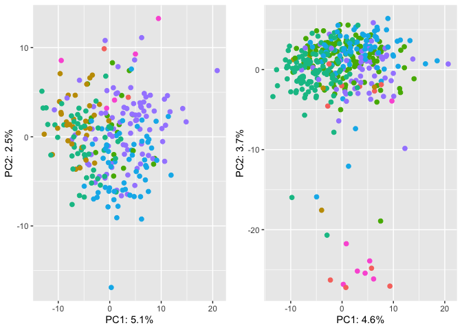<!-- -->

``` r
# All samples
(SGDP_ <- PCA_SGDP(SGDP_all, SGDP, order))
```

    ## Rows: 276 Columns: 44137
    ## ── Column specification ────────────────────────────────────────────────────────
    ## Delimiter: ","
    ## chr     (1): ID
    ## dbl (44136): HERV9_te_79A, HERV9_te_79T, HERV9_te_79C, HERV9_te_79G, HERV9_t...
    ## 
    ## ℹ Use `spec()` to retrieve the full column specification for this data.
    ## ℹ Specify the column types or set `show_col_types = FALSE` to quiet this message.

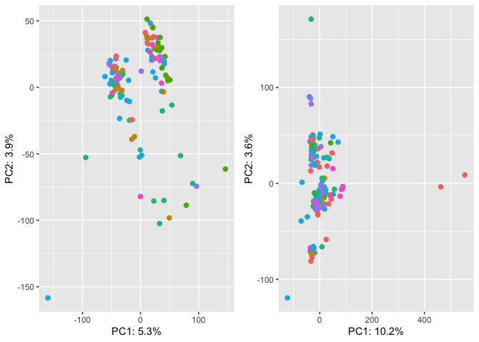<!-- -->

``` r
(SGDP_nobiasSNPs <- PCA_SGDP(SGDP_noGCbias, SGDP, order))                                   # no GC biased SNPs
```

    ## Rows: 276 Columns: 1949
    ## ── Column specification ────────────────────────────────────────────────────────
    ## Delimiter: ","
    ## chr    (1): ID
    ## dbl (1948): HERV9_te_2585A, HERV9_te_2585T, HERV9_te_2585C, HERV9_te_2585G, ...
    ## 
    ## ℹ Use `spec()` to retrieve the full column specification for this data.
    ## ℹ Specify the column types or set `show_col_types = FALSE` to quiet this message.

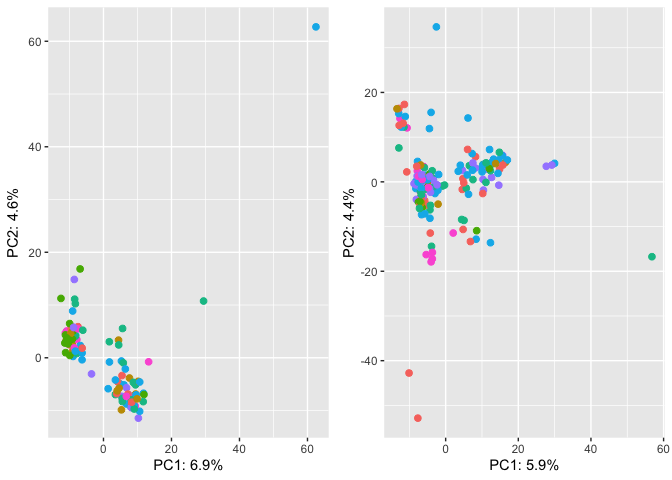<!-- -->

``` r
(SGDP_45to55 <- PCA_SGDP(SGDP_45_55, SGDP, order))                                          # no GC biased TEs
```

    ## Rows: 276 Columns: 18829
    ## ── Column specification ────────────────────────────────────────────────────────
    ## Delimiter: ","
    ## chr     (1): ID
    ## dbl (18828): HERV9_te_79A, HERV9_te_79T, HERV9_te_79C, HERV9_te_79G, HERV9_t...
    ## 
    ## ℹ Use `spec()` to retrieve the full column specification for this data.
    ## ℹ Specify the column types or set `show_col_types = FALSE` to quiet this message.

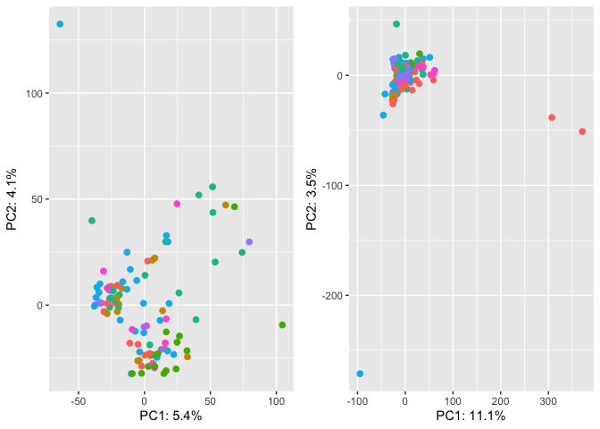<!-- -->

``` r
(SGDP_nobiasSNPs_45to55 <- PCA_SGDP(SGDP_noGCbias_45_55, SGDP, order))                      # no GC biased SNPs and TEs
```

    ## Rows: 276 Columns: 789
    ## ── Column specification ────────────────────────────────────────────────────────
    ## Delimiter: ","
    ## chr   (1): ID
    ## dbl (788): HERV9_te_2585A, HERV9_te_2585T, HERV9_te_2585C, HERV9_te_2585G, H...
    ## 
    ## ℹ Use `spec()` to retrieve the full column specification for this data.
    ## ℹ Specify the column types or set `show_col_types = FALSE` to quiet this message.

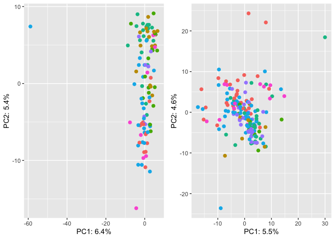<!-- -->

``` r
# PCR-free
(SGDP_ <- PCA_SGDP(SGDP_all, SGDP_pcr_free, order))
```

    ## Rows: 276 Columns: 44137
    ## ── Column specification ────────────────────────────────────────────────────────
    ## Delimiter: ","
    ## chr     (1): ID
    ## dbl (44136): HERV9_te_79A, HERV9_te_79T, HERV9_te_79C, HERV9_te_79G, HERV9_t...
    ## 
    ## ℹ Use `spec()` to retrieve the full column specification for this data.
    ## ℹ Specify the column types or set `show_col_types = FALSE` to quiet this message.

<!-- -->

``` r
(SGDP_nobiasSNPs_pcrfree <- PCA_SGDP(SGDP_noGCbias, SGDP_pcr_free, order))                  # no GC biased SNPs
```

    ## Rows: 276 Columns: 1949
    ## ── Column specification ────────────────────────────────────────────────────────
    ## Delimiter: ","
    ## chr    (1): ID
    ## dbl (1948): HERV9_te_2585A, HERV9_te_2585T, HERV9_te_2585C, HERV9_te_2585G, ...
    ## 
    ## ℹ Use `spec()` to retrieve the full column specification for this data.
    ## ℹ Specify the column types or set `show_col_types = FALSE` to quiet this message.

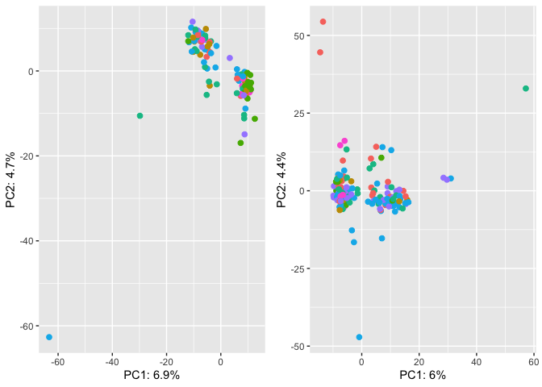<!-- -->

``` r
(SGDP_45to55_pcrfree <- PCA_SGDP(SGDP_45_55, SGDP_pcr_free, order))                         # no GC biased TEs
```

    ## Rows: 276 Columns: 18829
    ## ── Column specification ────────────────────────────────────────────────────────
    ## Delimiter: ","
    ## chr     (1): ID
    ## dbl (18828): HERV9_te_79A, HERV9_te_79T, HERV9_te_79C, HERV9_te_79G, HERV9_t...
    ## 
    ## ℹ Use `spec()` to retrieve the full column specification for this data.
    ## ℹ Specify the column types or set `show_col_types = FALSE` to quiet this message.

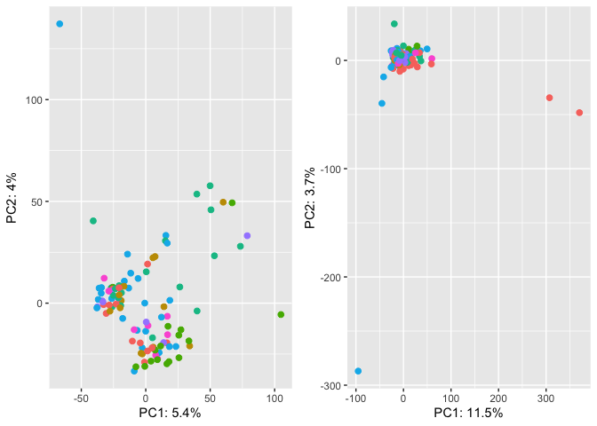<!-- -->

``` r
(SGDP_nobiasSNPs_45to55_pcrfree <- PCA_SGDP(SGDP_noGCbias_45_55, SGDP_pcr_free, order))     # no GC biased SNPs and TEs
```

    ## Rows: 276 Columns: 789
    ## ── Column specification ────────────────────────────────────────────────────────
    ## Delimiter: ","
    ## chr   (1): ID
    ## dbl (788): HERV9_te_2585A, HERV9_te_2585T, HERV9_te_2585C, HERV9_te_2585G, H...
    ## 
    ## ℹ Use `spec()` to retrieve the full column specification for this data.
    ## ℹ Specify the column types or set `show_col_types = FALSE` to quiet this message.

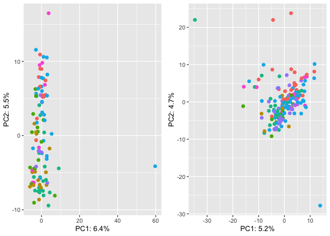<!-- -->

``` r
# PCR-free and not GC biased
(SGDP_GC <- PCA(SGDP_all, SGDP_nobiasedID_pcrfree))
```

    ## Rows: 276 Columns: 44137
    ## ── Column specification ────────────────────────────────────────────────────────
    ## Delimiter: ","
    ## chr     (1): ID
    ## dbl (44136): HERV9_te_79A, HERV9_te_79T, HERV9_te_79C, HERV9_te_79G, HERV9_t...
    ## 
    ## ℹ Use `spec()` to retrieve the full column specification for this data.
    ## ℹ Specify the column types or set `show_col_types = FALSE` to quiet this message.

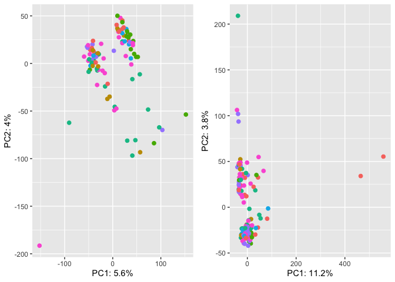<!-- -->

``` r
(SGDP_nobias_GC <- PCA(SGDP_noGCbias, SGDP_nobiasedID_pcrfree))                         # no GC biased SNPs
```

    ## Rows: 276 Columns: 1949
    ## ── Column specification ────────────────────────────────────────────────────────
    ## Delimiter: ","
    ## chr    (1): ID
    ## dbl (1948): HERV9_te_2585A, HERV9_te_2585T, HERV9_te_2585C, HERV9_te_2585G, ...
    ## 
    ## ℹ Use `spec()` to retrieve the full column specification for this data.
    ## ℹ Specify the column types or set `show_col_types = FALSE` to quiet this message.

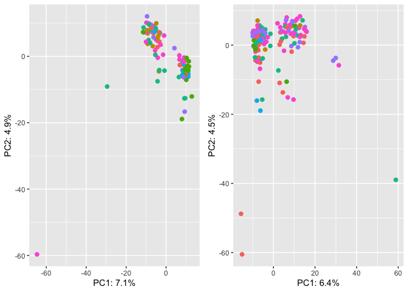<!-- -->

``` r
(SGDP_45to55_GC <- PCA(SGDP_45_55, SGDP_nobiasedID_pcrfree))                            # no GC biased TEs
```

    ## Rows: 276 Columns: 18829
    ## ── Column specification ────────────────────────────────────────────────────────
    ## Delimiter: ","
    ## chr     (1): ID
    ## dbl (18828): HERV9_te_79A, HERV9_te_79T, HERV9_te_79C, HERV9_te_79G, HERV9_t...
    ## 
    ## ℹ Use `spec()` to retrieve the full column specification for this data.
    ## ℹ Specify the column types or set `show_col_types = FALSE` to quiet this message.

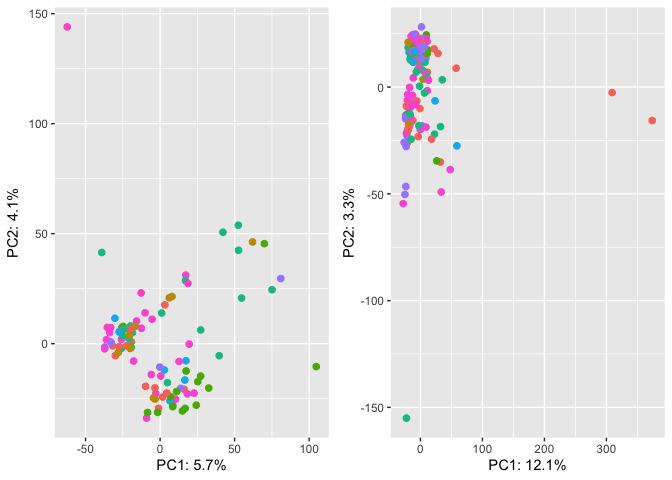<!-- -->

``` r
(SGDP_nobiasSNPs_45to55_GC <- PCA(SGDP_noGCbias_45_55, SGDP_nobiasedID_pcrfree))        # no GC biased SNPs and TEs
```

    ## Rows: 276 Columns: 789
    ## ── Column specification ────────────────────────────────────────────────────────
    ## Delimiter: ","
    ## chr   (1): ID
    ## dbl (788): HERV9_te_2585A, HERV9_te_2585T, HERV9_te_2585C, HERV9_te_2585G, H...
    ## 
    ## ℹ Use `spec()` to retrieve the full column specification for this data.
    ## ℹ Specify the column types or set `show_col_types = FALSE` to quiet this message.

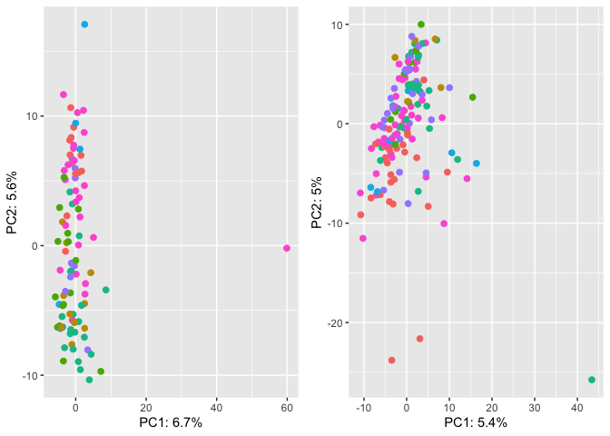<!-- -->
