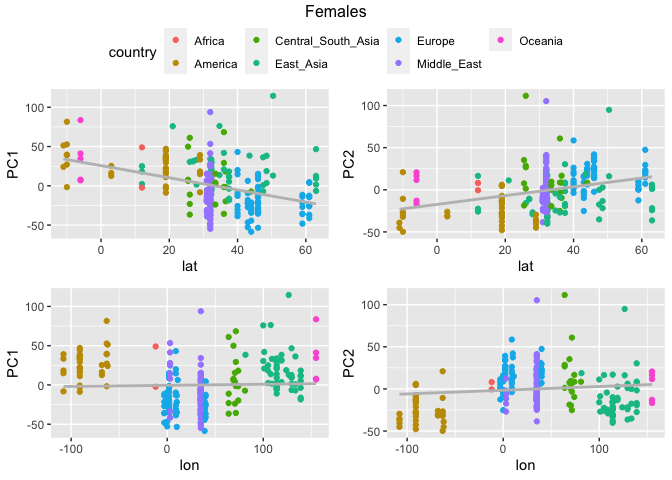
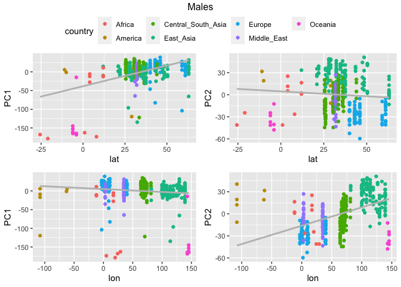

SNPs PCAs - Correlation with geographic coordinates
================

## Setting the environment

``` r
library(tidyverse)
```

    ## ── Attaching packages ─────────────────────────────────────── tidyverse 1.3.2 ──
    ## ✔ ggplot2 3.4.0      ✔ purrr   0.3.4 
    ## ✔ tibble  3.1.8      ✔ dplyr   1.0.10
    ## ✔ tidyr   1.2.1      ✔ stringr 1.4.1 
    ## ✔ readr   2.1.2      ✔ forcats 0.5.2 
    ## ── Conflicts ────────────────────────────────────────── tidyverse_conflicts() ──
    ## ✖ dplyr::filter() masks stats::filter()
    ## ✖ dplyr::lag()    masks stats::lag()

``` r
library(ggpubr)
```

# Preparing the filtered HGDP file

## Read HGDP summary file

``` r
HGDP <- read_delim("/Volumes/Temp1/rpianezza/0.old/summary-HGDP/USEME_HGDP_complete_reflib6.2_mq10_batchinfo_cutoff0.01.txt")
```

    ## Rows: 1394352 Columns: 10
    ## ── Column specification ────────────────────────────────────────────────────────
    ## Delimiter: ","
    ## chr (7): ID, Pop, sex, Country, type, familyname, batch
    ## dbl (3): length, reads, copynumber
    ## 
    ## ℹ Use `spec()` to retrieve the full column specification for this data.
    ## ℹ Specify the column types or set `show_col_types = FALSE` to quiet this message.

``` r
names(HGDP) <- c("ID","pop","sex","country","type","familyname","length","reads","copynumber","batch")

HGDP_pcr_free_samples <- read_tsv("/Volumes/Temp1/rpianezza/investigation/HGDP-no-PCR/HGDP-only-pcr-free-samples.tsv", col_names = "ID")
```

    ## Rows: 676 Columns: 1
    ## ── Column specification ────────────────────────────────────────────────────────
    ## Delimiter: "\t"
    ## chr (1): ID
    ## 
    ## ℹ Use `spec()` to retrieve the full column specification for this data.
    ## ℹ Specify the column types or set `show_col_types = FALSE` to quiet this message.

``` r
HGDP_pcr_free <- HGDP %>% filter(ID %in% HGDP_pcr_free_samples$ID)

a_HGDP <- read_tsv("/Volumes/Temp1/rpianezza/PCA-copynumber-all-analysis/a_HGDP.tsv")
```

    ## Rows: 828 Columns: 2
    ## ── Column specification ────────────────────────────────────────────────────────
    ## Delimiter: "\t"
    ## chr (1): ID
    ## dbl (1): a
    ## 
    ## ℹ Use `spec()` to retrieve the full column specification for this data.
    ## ℹ Specify the column types or set `show_col_types = FALSE` to quiet this message.

``` r
HGDP_nobiased_samples <- filter(a_HGDP, (a > (-0.5)) & (a<0.5)) %>% select(ID) %>% pull()
HGDP_final <- filter(HGDP_pcr_free, ID %in% HGDP_nobiased_samples)
```

## Read coordinates file

``` r
coordinates <- read_tsv("/Users/rpianezza/TE/summary-HGDP/HGDP_populationcoordinates.txt", col_names = c("pop", "region", "latitude", "longitude")) %>% select(pop, latitude, longitude)
```

    ## Rows: 54 Columns: 4
    ## ── Column specification ────────────────────────────────────────────────────────
    ## Delimiter: "\t"
    ## chr (2): pop, region
    ## dbl (2): latitude, longitude
    ## 
    ## ℹ Use `spec()` to retrieve the full column specification for this data.
    ## ℹ Specify the column types or set `show_col_types = FALSE` to quiet this message.

``` r
data <- inner_join(coordinates, HGDP_final, by = "pop")
```

# PCA on the filtered dataset

## Read the SNPs matrix

``` r
matrix <- "/Volumes/Temp1/rpianezza/0.old/SNP/mod.08.5000.matrix_processed_processed"
```

## Function for PCA plotting

``` r
PCA_SNPs <- function(freq_matrix, metadata, s, title){

matrix <- read_csv(freq_matrix)
  
metadata <- metadata %>% filter(sex==s) %>% select(ID, country, pop, latitude, longitude) %>% distinct()
(matrix <- inner_join(metadata, matrix, by="ID"))

pca_data <- matrix %>%  select_if(~ !all(. == .[1]))
pca_result <- prcomp(pca_data[, -c(1:5)], center = TRUE, scale = TRUE)
var_explained <- pca_result$sdev^2/sum(pca_result$sdev^2)
 
processed <- pca_result$x %>% as_tibble() %>% select(c(PC1, PC2)) %>% mutate(ID = metadata$ID, lat=metadata$latitude, lon=metadata$longitude, country=metadata$country) %>% relocate(ID, .before = PC1)
 
PC1_lat <- processed %>% ggplot(aes(lat, PC1)) + geom_point(aes(color=country)) + geom_smooth(method = "lm", se = FALSE, color = "grey")
PC2_lat <- processed %>% ggplot(aes(lat, PC2)) + geom_point(aes(color=country)) + geom_smooth(method = "lm", se = FALSE, color = "grey")
PC1_lon <- processed %>% ggplot(aes(lon, PC1)) + geom_point(aes(color=country)) + geom_smooth(method = "lm", se = FALSE, color = "grey")
PC2_lon <- processed %>% ggplot(aes(lon, PC2)) + geom_point(aes(color=country)) + geom_smooth(method = "lm", se = FALSE, color = "grey")
 
figure <- ggarrange(PC1_lat, PC2_lat, PC1_lon, PC2_lon, ncol = 2, nrow = 2, common.legend = TRUE)
annotate_figure(figure, top = title)
}

PCA_SNPs(matrix, data, "female", "Females")
```

    ## Rows: 828 Columns: 46321
    ## ── Column specification ────────────────────────────────────────────────────────
    ## Delimiter: ","
    ## chr     (1): ID
    ## dbl (46320): HERV9_te_78A, HERV9_te_78T, HERV9_te_78C, HERV9_te_78G, HERV9_t...
    ## 
    ## ℹ Use `spec()` to retrieve the full column specification for this data.
    ## ℹ Specify the column types or set `show_col_types = FALSE` to quiet this message.
    ## `geom_smooth()` using formula = 'y ~ x'
    ## `geom_smooth()` using formula = 'y ~ x'
    ## `geom_smooth()` using formula = 'y ~ x'
    ## `geom_smooth()` using formula = 'y ~ x'
    ## `geom_smooth()` using formula = 'y ~ x'

<!-- -->

``` r
PCA_SNPs(matrix, data, "male", "Males")
```

    ## Rows: 828 Columns: 46321
    ## ── Column specification ────────────────────────────────────────────────────────
    ## Delimiter: ","
    ## chr     (1): ID
    ## dbl (46320): HERV9_te_78A, HERV9_te_78T, HERV9_te_78C, HERV9_te_78G, HERV9_t...
    ## 
    ## ℹ Use `spec()` to retrieve the full column specification for this data.
    ## ℹ Specify the column types or set `show_col_types = FALSE` to quiet this message.
    ## `geom_smooth()` using formula = 'y ~ x'
    ## `geom_smooth()` using formula = 'y ~ x'
    ## `geom_smooth()` using formula = 'y ~ x'
    ## `geom_smooth()` using formula = 'y ~ x'
    ## `geom_smooth()` using formula = 'y ~ x'

<!-- -->

``` r
PCA_SNPs_spear <- function(freq_matrix, metadata, s, title){

matrix <- read_csv(freq_matrix)
  
metadata <- metadata %>% filter(sex==s) %>% select(ID, country, pop, latitude, longitude) %>% distinct()
(matrix <- inner_join(metadata, matrix, by="ID"))

pca_data <- matrix %>%  select_if(~ !all(. == .[1]))
pca_result <- prcomp(pca_data[, -c(1:5)], center = TRUE, scale = TRUE)
var_explained <- pca_result$sdev^2/sum(pca_result$sdev^2)
 
processed <- pca_result$x %>% as_tibble() %>% select(c(PC1, PC2)) %>% mutate(ID = metadata$ID, lat=metadata$latitude, lon=metadata$longitude, country=metadata$country) %>% relocate(ID, .before = PC1)
PC1_lat <- cor(processed$lat, processed$PC1, method = "spearman")
PC2_lat <- cor(processed$lat, processed$PC2, method = "spearman")
PC1_lon <- cor(processed$lon, processed$PC1, method = "spearman")
PC2_lon <- cor(processed$lon, processed$PC2, method = "spearman")

PC1_tibble <- tibble(sex = s, PC = 1, lat = PC1_lat, lon = PC1_lon)
PC2_tibble <- tibble(sex = s, PC = 2, lat = PC2_lat, lon = PC2_lon)
(result_tibble <- bind_rows(PC1_tibble, PC2_tibble))
}

PCA_SNPs_spear(matrix, data, "female", "Females")
```

    ## Rows: 828 Columns: 46321
    ## ── Column specification ────────────────────────────────────────────────────────
    ## Delimiter: ","
    ## chr     (1): ID
    ## dbl (46320): HERV9_te_78A, HERV9_te_78T, HERV9_te_78C, HERV9_te_78G, HERV9_t...
    ## 
    ## ℹ Use `spec()` to retrieve the full column specification for this data.
    ## ℹ Specify the column types or set `show_col_types = FALSE` to quiet this message.

    ## # A tibble: 2 × 4
    ##   sex       PC    lat    lon
    ##   <chr>  <dbl>  <dbl>  <dbl>
    ## 1 female     1 -0.339 0.0880
    ## 2 female     2  0.373 0.0386

``` r
PCA_SNPs_spear(matrix, data, "male", "Males")
```

    ## Rows: 828 Columns: 46321
    ## ── Column specification ────────────────────────────────────────────────────────
    ## Delimiter: ","
    ## chr     (1): ID
    ## dbl (46320): HERV9_te_78A, HERV9_te_78T, HERV9_te_78C, HERV9_te_78G, HERV9_t...
    ## 
    ## ℹ Use `spec()` to retrieve the full column specification for this data.
    ## ℹ Specify the column types or set `show_col_types = FALSE` to quiet this message.

    ## # A tibble: 2 × 4
    ##   sex      PC    lat    lon
    ##   <chr> <dbl>  <dbl>  <dbl>
    ## 1 male      1  0.157 -0.237
    ## 2 male      2 -0.108  0.582
