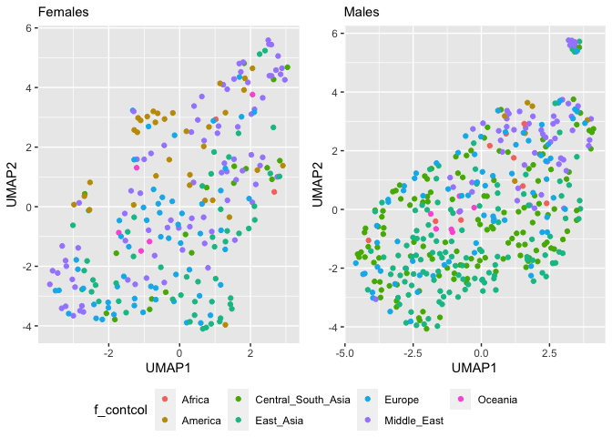
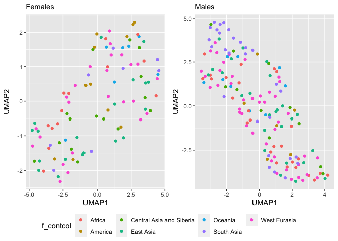

UMAP - Copynumber
================

``` r
library(tidyverse)
```

    ## ── Attaching packages ─────────────────────────────────────── tidyverse 1.3.2 ──
    ## ✔ ggplot2 3.4.0      ✔ purrr   0.3.4 
    ## ✔ tibble  3.1.8      ✔ dplyr   1.0.10
    ## ✔ tidyr   1.2.1      ✔ stringr 1.4.1 
    ## ✔ readr   2.1.2      ✔ forcats 0.5.2 
    ## ── Conflicts ────────────────────────────────────────── tidyverse_conflicts() ──
    ## ✖ dplyr::filter() masks stats::filter()
    ## ✖ dplyr::lag()    masks stats::lag()

``` r
library(ggpubr)
library(umap)
HGDP <- read_delim("/Volumes/Temp1/rpianezza/TE/summary-HGDP/USEME_HGDP_complete_reflib6.2_mq10_batchinfo_cutoff0.01.txt")
```

    ## Rows: 1394352 Columns: 10
    ## ── Column specification ────────────────────────────────────────────────────────
    ## Delimiter: ","
    ## chr (7): ID, Pop, sex, Country, type, familyname, batch
    ## dbl (3): length, reads, copynumber
    ## 
    ## ℹ Use `spec()` to retrieve the full column specification for this data.
    ## ℹ Specify the column types or set `show_col_types = FALSE` to quiet this message.

``` r
names(HGDP) <- c("ID","pop","sex","country","type","familyname","length","reads","copynumber","batch")

SGDP <- read_tsv("/Volumes/Temp2/rpianezza/SGDP/summary/USEME_SGDP_cutoff") %>% dplyr::rename(ID=biosample)
```

    ## Rows: 470028 Columns: 10
    ## ── Column specification ────────────────────────────────────────────────────────
    ## Delimiter: "\t"
    ## chr (7): biosample, sex, pop, country, type, familyname, batch
    ## dbl (3): length, reads, copynumber
    ## 
    ## ℹ Use `spec()` to retrieve the full column specification for this data.
    ## ℹ Specify the column types or set `show_col_types = FALSE` to quiet this message.

``` r
HGDP_pcr_free_samples <- read_tsv("/Volumes/Temp1/rpianezza/investigation/HGDP-no-PCR/HGDP-only-pcr-free-samples.tsv", col_names = "ID")
```

    ## Rows: 676 Columns: 1
    ## ── Column specification ────────────────────────────────────────────────────────
    ## Delimiter: "\t"
    ## chr (1): ID
    ## 
    ## ℹ Use `spec()` to retrieve the full column specification for this data.
    ## ℹ Specify the column types or set `show_col_types = FALSE` to quiet this message.

``` r
HGDP_pcr_free <- HGDP %>% filter(ID %in% HGDP_pcr_free_samples$ID)
HGDP_pcr <- HGDP %>% filter(!(ID %in% HGDP_pcr_free_samples$ID))

SGDP_pcr_free_samples <- read_tsv("/Volumes/Temp1/rpianezza/SGDP/ric-documentation/SGDP-no-PCR.tsv")
```

    ## Rows: 261 Columns: 1
    ## ── Column specification ────────────────────────────────────────────────────────
    ## Delimiter: "\t"
    ## chr (1): ID
    ## 
    ## ℹ Use `spec()` to retrieve the full column specification for this data.
    ## ℹ Specify the column types or set `show_col_types = FALSE` to quiet this message.

``` r
SGDP_pcr_free <- SGDP %>% filter(ID %in% SGDP_pcr_free_samples$ID)

HvariableTEs <- filter(HGDP_pcr_free, type == "te") %>% group_by(familyname) %>% summarise(variance = var(copynumber)) %>% filter(variance>0.5) %>% select(familyname) %>% pull()
```

# Function for UMAP

``` r
UMAP_copynumber <- function(raw_data, title){
data <- filter(raw_data, type=="te")
m <- filter(data, sex=='male')
f <- filter(data, sex=='female')
len <- length(unique(data$familyname))
males <- length(unique(m$ID))
females <- length(unique(f$ID))

f_matrix <- matrix(as.vector(f$copynumber),nrow=females,ncol=len,byrow=T)
f_fram <- data.frame(f_matrix)
names(f_fram) <- unique(f$familyname)
f_fram <- f_fram %>% select_if(negate(function(col) sd(col)==0))
f_matrixcont <- matrix(as.vector(f$country),nrow=females,ncol=len,byrow=T)
f_framcont <- data.frame(f_matrixcont)
f_contcol<-c(f_framcont$X1)

m_matrix <- matrix(as.vector(m$copynumber),nrow=males,ncol=len,byrow=T)
m_fram <- data.frame(m_matrix)
names(m_fram)<-unique(m$familyname)
m_fram <- m_fram %>% select_if(negate(function(col) sd(col)==0))
m_matrixcont <- matrix(as.vector(m$country),nrow=males,ncol=len,byrow=T)
m_framcont <- data.frame(m_matrixcont)
m_contcol<-c(m_framcont$X1)

f_umap_result <- umap(f_fram, n_neighbors = 15, min_dist = 0.3)
m_umap_result <- umap(m_fram, n_neighbors = 15, min_dist = 0.3)

f_umap <- f_umap_result$layout %>% as.data.frame() %>% rename(UMAP1="V1",UMAP2="V2")
m_umap <- m_umap_result$layout %>% as.data.frame() %>% rename(UMAP1="V1",UMAP2="V2")

f <- f_umap %>% ggplot(aes(x = UMAP1, y = UMAP2, color = f_contcol))+
  geom_point()+ labs(x = "UMAP1", y = "UMAP2", subtitle = "Females")

m <- m_umap %>% ggplot(aes(x = UMAP1, y = UMAP2, color = m_contcol))+
  geom_point()+ labs(x = "UMAP1", y = "UMAP2", subtitle = "Males")

plot <- ggarrange(f, m, ncol = 2, nrow = 1, common.legend = TRUE, legend = "bottom", align = "hv", font.label = list(size = 10, color = "black", face = "bold", family = NULL, position = "top"))
}
```

# PCA

PCA excluding biased samples (PCR samples + GC biased samples PCR free)
and excluding non-variable TEs.

## HGDP

``` r
a_HGDP <- read_tsv("/Volumes/Temp1/rpianezza/PCA-copynumber-all-analysis/a_HGDP.tsv")
```

    ## Rows: 828 Columns: 2
    ## ── Column specification ────────────────────────────────────────────────────────
    ## Delimiter: "\t"
    ## chr (1): ID
    ## dbl (1): a
    ## 
    ## ℹ Use `spec()` to retrieve the full column specification for this data.
    ## ℹ Specify the column types or set `show_col_types = FALSE` to quiet this message.

``` r
HGDP_nobiased_samples <- filter(a_HGDP, (a > (-0.5)) & (a<0.5)) %>% select(ID) %>% pull()
HGDP_nobiasedID <- filter(HGDP, ID %in% HGDP_nobiased_samples)
HGDP_nobiasedID_pcrfree <- filter(HGDP_pcr_free, ID %in% HGDP_nobiased_samples)
HGDP_nobiasedID_pcrfree_varTE <- filter(HGDP_nobiasedID_pcrfree, familyname %in% HvariableTEs)

(UMAP_HGDP <- UMAP_copynumber(HGDP_nobiasedID_pcrfree_varTE, "HGDP - GC biased samples excluded - Variable TEs"))
```

<!-- -->

## SGDP

``` r
SvariableTEs <- filter(SGDP_pcr_free, type == "te") %>% group_by(familyname) %>% summarise(variance = var(copynumber)) %>% filter(variance>0.5) %>% select(familyname) %>% pull()

a_SGDP <- read_tsv("/Volumes/Temp1/rpianezza/PCA-copynumber-all-analysis/a_SGDP.tsv")
```

    ## Rows: 276 Columns: 2
    ## ── Column specification ────────────────────────────────────────────────────────
    ## Delimiter: "\t"
    ## chr (1): ID
    ## dbl (1): a
    ## 
    ## ℹ Use `spec()` to retrieve the full column specification for this data.
    ## ℹ Specify the column types or set `show_col_types = FALSE` to quiet this message.

``` r
SGDP_nobiased_samples <- filter(a_SGDP, (a > (-0.5)) & (a<0.5)) %>% select(ID) %>% pull()
SGDP_nobiasedID <- filter(SGDP, ID %in% SGDP_nobiased_samples)
SGDP_nobiasedID_pcrfree <- filter(SGDP_pcr_free, ID %in% SGDP_nobiased_samples)
SGDP_nobiasedID_pcrfree_varTE <- filter(SGDP_nobiasedID_pcrfree, familyname %in% SvariableTEs)

(UMAP_SGDP <- UMAP_copynumber(SGDP_nobiasedID_pcrfree_varTE, "SGDP - GC biased samples excluded - Variable TEs"))
```

<!-- -->
