UMAP - SNPs - HGDP - Different TE MRCAs
================

## Prepare the environment

``` r
library(tidyverse)
```

    ## ── Attaching packages ─────────────────────────────────────── tidyverse 1.3.2 ──
    ## ✔ ggplot2 3.4.0      ✔ purrr   0.3.4 
    ## ✔ tibble  3.1.8      ✔ dplyr   1.0.10
    ## ✔ tidyr   1.2.1      ✔ stringr 1.4.1 
    ## ✔ readr   2.1.2      ✔ forcats 0.5.2 
    ## ── Conflicts ────────────────────────────────────────── tidyverse_conflicts() ──
    ## ✖ dplyr::filter() masks stats::filter()
    ## ✖ dplyr::lag()    masks stats::lag()

``` r
library(ggpubr)
library(umap)
```

## Select samples with no GC-bias

``` r
HGDP <- read_delim("/Volumes/Temp1/rpianezza/0.old/summary-HGDP/HGDP_cutoff_classified.tsv")
```

    ## Rows: 1394352 Columns: 12
    ## ── Column specification ────────────────────────────────────────────────────────
    ## Delimiter: "\t"
    ## chr (9): ID, pop, sex, country, type, familyname, batch, superfamily, shared...
    ## dbl (3): length, reads, copynumber
    ## 
    ## ℹ Use `spec()` to retrieve the full column specification for this data.
    ## ℹ Specify the column types or set `show_col_types = FALSE` to quiet this message.

## Read the SNPs matrixes

``` r
sapiens_k10SNPs <- "/Volumes/Temp1/rpianezza/PCA-SNPs-all-analysis/matrixes/MRCAs/sapiens-cov15-10000SNPs.matrix.tsv"
homo_k10SNPs <- "/Volumes/Temp1/rpianezza/PCA-SNPs-all-analysis/matrixes/MRCAs/hominidae-cov15-10000SNPs.matrix.tsv"
primates_k10SNPs <- "/Volumes/Temp1/rpianezza/PCA-SNPs-all-analysis/matrixes/MRCAs/primates-cov15-10000SNPs.matrix.tsv"
mammalia_k10SNPs <- "/Volumes/Temp1/rpianezza/PCA-SNPs-all-analysis/matrixes/MRCAs/mammalia-cov15-10000SNPs.matrix.tsv"
theria_k10SNPs <- "/Volumes/Temp1/rpianezza/PCA-SNPs-all-analysis/matrixes/MRCAs/theria-cov15-10000SNPs.matrix.tsv"
eutheria_k10SNPs <- "/Volumes/Temp1/rpianezza/PCA-SNPs-all-analysis/matrixes/MRCAs/eutheria-cov15-10000SNPs.matrix.tsv"
vertebrata_k10SNPs <- "/Volumes/Temp1/rpianezza/PCA-SNPs-all-analysis/matrixes/MRCAs/vertebrata-cov15-10000SNPs.matrix.tsv"
```

## Create the function for UMAP plotting

``` r
UMAP_split <- function(freq_matrix, metadata, titlee){

matrix <- read_csv(freq_matrix)
  
f_metadata <- metadata %>% filter(sex=="female") %>% select(ID, sex, country, pop) %>% distinct()
m_metadata <- metadata %>% filter(sex=="male") %>% select(ID, sex, country, pop) %>% distinct()
males_matrix <- inner_join(m_metadata, matrix, by="ID")
females_matrix <- inner_join(f_metadata, matrix, by="ID")

f_pca_data <- females_matrix %>% select_if(~ !all(. == .[1]))
m_pca_data <- males_matrix %>% select_if(~ !all(. == .[1]))
f_matrix <- as.matrix(f_pca_data[, -c(1,2,3)])
m_matrix <- as.matrix(m_pca_data[, -c(1,2,3)])

f_umap_result <- umap(f_matrix, n_neighbors = 15, min_dist = 0.3)
m_umap_result <- umap(m_matrix, n_neighbors = 15, min_dist = 0.3)

f_umap <- f_umap_result$layout %>% as.data.frame() %>% rename(UMAP1="V1",UMAP2="V2")
m_umap <- m_umap_result$layout %>% as.data.frame() %>% rename(UMAP1="V1",UMAP2="V2")

f <- f_umap %>% ggplot(aes(x = UMAP1, y = UMAP2, color = f_metadata$country))+
  geom_point()+ labs(x = "UMAP1", y = "UMAP2", subtitle = "Females", color = "Region") + theme(plot.subtitle = element_text(hjust = 0.5), legend.title = element_text(face = "bold"))

m <- m_umap %>% ggplot(aes(x = UMAP1, y = UMAP2, color = m_metadata$country))+
  geom_point()+ labs(x = "UMAP1", y = "UMAP2", subtitle = "Males", color = "Region") + theme(plot.subtitle = element_text(hjust = 0.5), legend.title = element_text(face = "bold"))

plot <- ggarrange(f, m, ncol = 2, nrow = 1, common.legend = TRUE, legend = "bottom", align = "hv", font.label = list(size = 10, color = "black", face = "bold", family = NULL, position = "top"))
figure <- annotate_figure(plot, top = text_grob(titlee, face = "bold", size = 14))
}
```

``` r
UMAP <- function(freq_matrix, metadata, titlee){

matrix <- read_csv(freq_matrix)
metadata <- metadata %>% select(ID, sex, country, pop) %>% distinct()
matrix <- inner_join(metadata, matrix, by="ID")

pca_data <- matrix %>% select_if(~ !all(. == .[1]))
matrix <- as.matrix(pca_data[, -c(1,2,3,4)])

umap_result <- umap(matrix, n_neighbors = 15, min_dist = 0.3)
umap <- umap_result$layout %>% as.data.frame() %>% rename(UMAP1="V1",UMAP2="V2")

plot <- umap %>% ggplot(aes(x = UMAP1, y = UMAP2, color = metadata$country, shape = metadata$sex))+
  geom_point()+ labs(x = "UMAP1", y = "UMAP2", title = titlee, subtitle = "Females and males", color = "Region", shape = "Sex") + theme(plot.title = element_text(hjust = 0.5, face = "bold"), plot.subtitle = element_text(hjust = 0.5), legend.title = element_text(face = "bold"))
}
```

``` r
(UMAP_sapiens_k10SNPs <- UMAP_split(sapiens_k10SNPs, HGDP, "HGDP - 10.000 SNPs in RepSeq shared with Homo sapiens"))
```

    ## Rows: 828 Columns: 40001
    ## ── Column specification ────────────────────────────────────────────────────────
    ## Delimiter: ","
    ## chr     (1): ID
    ## dbl (40000): LTR65_te_8A, LTR65_te_8T, LTR65_te_8C, LTR65_te_8G, LTR65_te_10...
    ## 
    ## ℹ Use `spec()` to retrieve the full column specification for this data.
    ## ℹ Specify the column types or set `show_col_types = FALSE` to quiet this message.

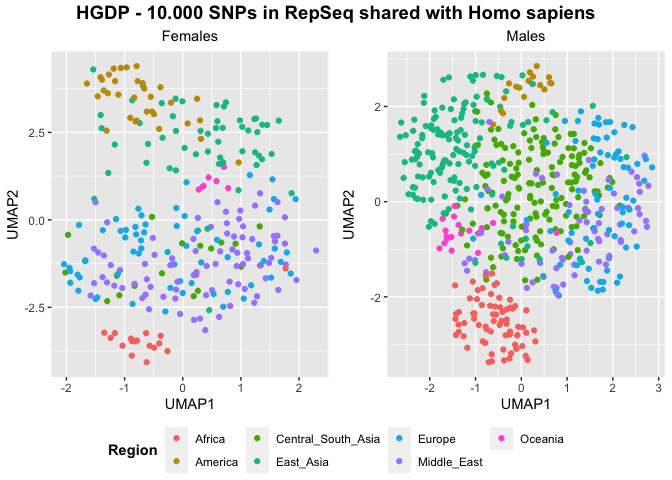<!-- -->

``` r
(UMAP_sapiens_10k <- UMAP(sapiens_k10SNPs, HGDP, "HGDP - 10.000 SNPs in RepSeq shared with Homo sapiens"))
```

    ## Rows: 828 Columns: 40001
    ## ── Column specification ────────────────────────────────────────────────────────
    ## Delimiter: ","
    ## chr     (1): ID
    ## dbl (40000): LTR65_te_8A, LTR65_te_8T, LTR65_te_8C, LTR65_te_8G, LTR65_te_10...
    ## 
    ## ℹ Use `spec()` to retrieve the full column specification for this data.
    ## ℹ Specify the column types or set `show_col_types = FALSE` to quiet this message.

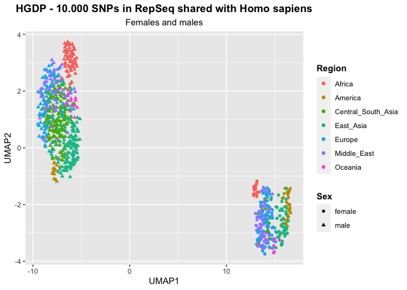<!-- -->

``` r
(UMAP_homo_k10SNPs <- UMAP_split(homo_k10SNPs, HGDP, "HGDP - 10.000 SNPs in RepSeq shared with Hominidae"))
```

    ## Rows: 828 Columns: 1457
    ## ── Column specification ────────────────────────────────────────────────────────
    ## Delimiter: ","
    ## chr    (1): ID
    ## dbl (1456): THE1B_te_1A, THE1B_te_1T, THE1B_te_1C, THE1B_te_1G, THE1B_te_2A,...
    ## 
    ## ℹ Use `spec()` to retrieve the full column specification for this data.
    ## ℹ Specify the column types or set `show_col_types = FALSE` to quiet this message.

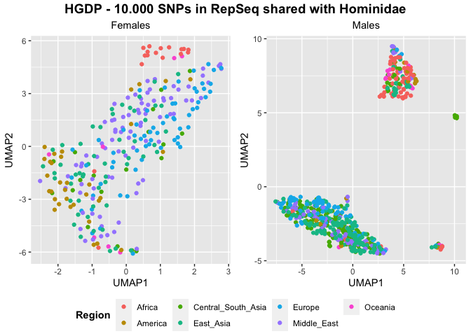<!-- -->

``` r
(UMAP_homo_10k <- UMAP(homo_k10SNPs, HGDP, "HGDP - 10.000 SNPs in RepSeq shared with Hominidae"))
```

    ## Rows: 828 Columns: 1457
    ## ── Column specification ────────────────────────────────────────────────────────
    ## Delimiter: ","
    ## chr    (1): ID
    ## dbl (1456): THE1B_te_1A, THE1B_te_1T, THE1B_te_1C, THE1B_te_1G, THE1B_te_2A,...
    ## 
    ## ℹ Use `spec()` to retrieve the full column specification for this data.
    ## ℹ Specify the column types or set `show_col_types = FALSE` to quiet this message.

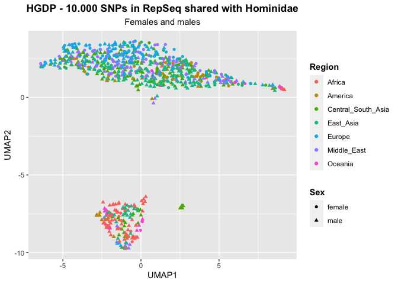<!-- -->

``` r
(UMAP_primates_k10SNPs <- UMAP_split(primates_k10SNPs, HGDP, "HGDP - 10.000 SNPs in RepSeq shared with primates"))
```

    ## Rows: 828 Columns: 40001
    ## ── Column specification ────────────────────────────────────────────────────────
    ## Delimiter: ","
    ## chr     (1): ID
    ## dbl (40000): MER6A_te_182A, MER6A_te_182T, MER6A_te_182C, MER6A_te_182G, MER...
    ## 
    ## ℹ Use `spec()` to retrieve the full column specification for this data.
    ## ℹ Specify the column types or set `show_col_types = FALSE` to quiet this message.

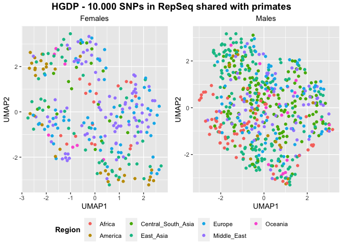<!-- -->

``` r
(UMAP_primates_10k <- UMAP(primates_k10SNPs, HGDP, "HGDP - 10.000 SNPs in RepSeq shared with primates"))
```

    ## Rows: 828 Columns: 40001
    ## ── Column specification ────────────────────────────────────────────────────────
    ## Delimiter: ","
    ## chr     (1): ID
    ## dbl (40000): MER6A_te_182A, MER6A_te_182T, MER6A_te_182C, MER6A_te_182G, MER...
    ## 
    ## ℹ Use `spec()` to retrieve the full column specification for this data.
    ## ℹ Specify the column types or set `show_col_types = FALSE` to quiet this message.

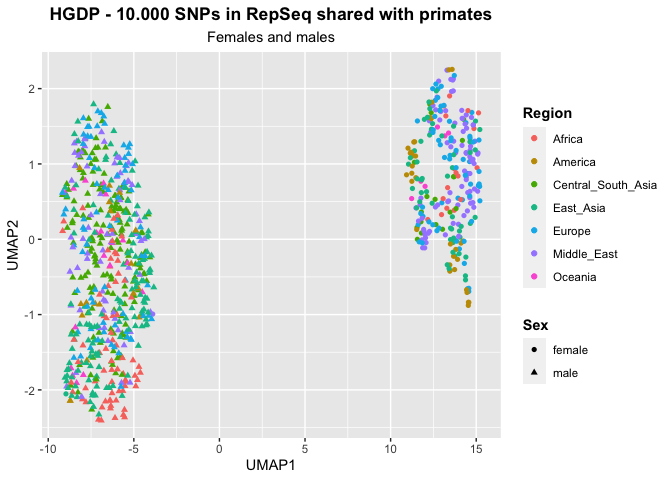<!-- -->

``` r
(UMAP_mammalia_k10SNPs <- UMAP_split(mammalia_k10SNPs, HGDP, "HGDP - 10.000 SNPs in RepSeq shared with mammals"))
```

    ## Rows: 828 Columns: 40001
    ## ── Column specification ────────────────────────────────────────────────────────
    ## Delimiter: ","
    ## chr     (1): ID
    ## dbl (40000): Tigger16a_te_717A, Tigger16a_te_717T, Tigger16a_te_717C, Tigger...
    ## 
    ## ℹ Use `spec()` to retrieve the full column specification for this data.
    ## ℹ Specify the column types or set `show_col_types = FALSE` to quiet this message.

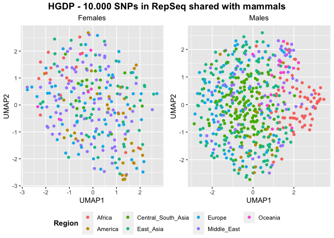<!-- -->

``` r
(UMAP_mammalia_10k <- UMAP(mammalia_k10SNPs, HGDP, "HGDP - 10.000 SNPs in RepSeq shared with mammals"))
```

    ## Rows: 828 Columns: 40001
    ## ── Column specification ────────────────────────────────────────────────────────
    ## Delimiter: ","
    ## chr     (1): ID
    ## dbl (40000): Tigger16a_te_717A, Tigger16a_te_717T, Tigger16a_te_717C, Tigger...
    ## 
    ## ℹ Use `spec()` to retrieve the full column specification for this data.
    ## ℹ Specify the column types or set `show_col_types = FALSE` to quiet this message.

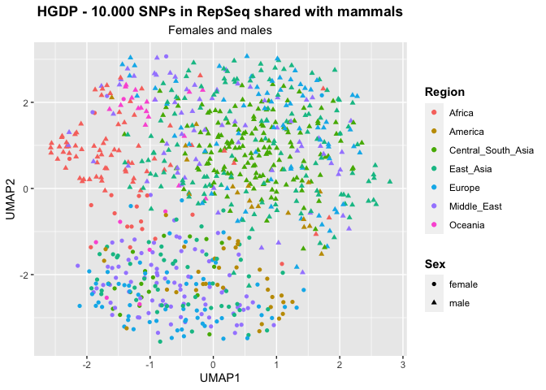<!-- -->

``` r
(UMAP_theria_k10SNPs <- UMAP_split(theria_k10SNPs, HGDP, "HGDP - 10.000 SNPs in RepSeq shared with theria"))
```

    ## Rows: 828 Columns: 25473
    ## ── Column specification ────────────────────────────────────────────────────────
    ## Delimiter: ","
    ## chr     (1): ID
    ## dbl (25472): Kanga1_te_191A, Kanga1_te_191T, Kanga1_te_191C, Kanga1_te_191G,...
    ## 
    ## ℹ Use `spec()` to retrieve the full column specification for this data.
    ## ℹ Specify the column types or set `show_col_types = FALSE` to quiet this message.

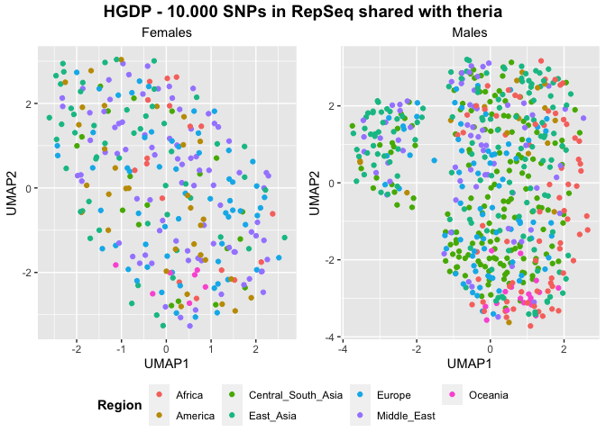<!-- -->

``` r
(UMAP_theria_10k <- UMAP(theria_k10SNPs, HGDP, "HGDP - 10.000 SNPs in RepSeq shared with theria"))
```

    ## Rows: 828 Columns: 25473
    ## ── Column specification ────────────────────────────────────────────────────────
    ## Delimiter: ","
    ## chr     (1): ID
    ## dbl (25472): Kanga1_te_191A, Kanga1_te_191T, Kanga1_te_191C, Kanga1_te_191G,...
    ## 
    ## ℹ Use `spec()` to retrieve the full column specification for this data.
    ## ℹ Specify the column types or set `show_col_types = FALSE` to quiet this message.

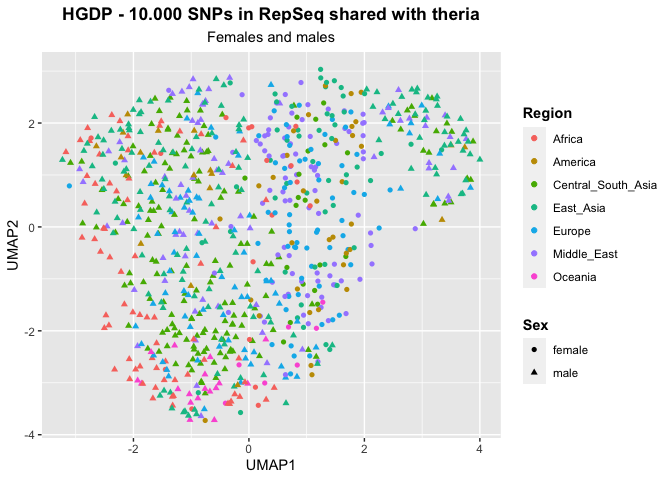<!-- -->

``` r
(UMAP_eutheria_k10SNPs <- UMAP_split(eutheria_k10SNPs, HGDP, "HGDP - 10.000 SNPs in RepSeq shared with eutheria"))
```

    ## Rows: 828 Columns: 40001
    ## ── Column specification ────────────────────────────────────────────────────────
    ## Delimiter: ","
    ## chr     (1): ID
    ## dbl (40000): MER58B_te_18A, MER58B_te_18T, MER58B_te_18C, MER58B_te_18G, MER...
    ## 
    ## ℹ Use `spec()` to retrieve the full column specification for this data.
    ## ℹ Specify the column types or set `show_col_types = FALSE` to quiet this message.

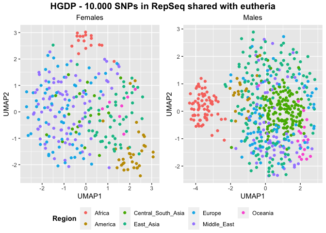<!-- -->

``` r
(UMAP_eutheria_10k <- UMAP(eutheria_k10SNPs, HGDP, "HGDP - 10.000 SNPs in RepSeq shared with eutheria"))
```

    ## Rows: 828 Columns: 40001
    ## ── Column specification ────────────────────────────────────────────────────────
    ## Delimiter: ","
    ## chr     (1): ID
    ## dbl (40000): MER58B_te_18A, MER58B_te_18T, MER58B_te_18C, MER58B_te_18G, MER...
    ## 
    ## ℹ Use `spec()` to retrieve the full column specification for this data.
    ## ℹ Specify the column types or set `show_col_types = FALSE` to quiet this message.

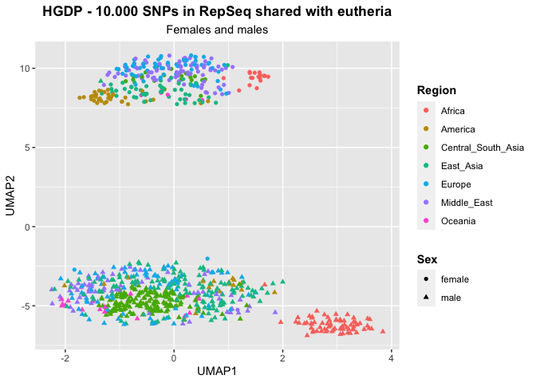<!-- -->

``` r
(UMAP_vertebrata_k10SNPs <- UMAP_split(vertebrata_k10SNPs, HGDP, "HGDP - 10.000 SNPs in RepSeq shared with vertebrata"))
```

    ## Rows: 828 Columns: 921
    ## ── Column specification ────────────────────────────────────────────────────────
    ## Delimiter: ","
    ## chr   (1): ID
    ## dbl (920): MER30_te_1A, MER30_te_1T, MER30_te_1C, MER30_te_1G, MER30_te_2A, ...
    ## 
    ## ℹ Use `spec()` to retrieve the full column specification for this data.
    ## ℹ Specify the column types or set `show_col_types = FALSE` to quiet this message.

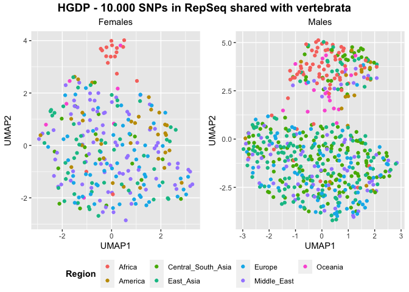<!-- -->

``` r
(UMAP_vertebrata_10k <- UMAP(vertebrata_k10SNPs, HGDP, "HGDP - 10.000 SNPs in RepSeq shared with vertebrata"))
```

    ## Rows: 828 Columns: 921
    ## ── Column specification ────────────────────────────────────────────────────────
    ## Delimiter: ","
    ## chr   (1): ID
    ## dbl (920): MER30_te_1A, MER30_te_1T, MER30_te_1C, MER30_te_1G, MER30_te_2A, ...
    ## 
    ## ℹ Use `spec()` to retrieve the full column specification for this data.
    ## ℹ Specify the column types or set `show_col_types = FALSE` to quiet this message.

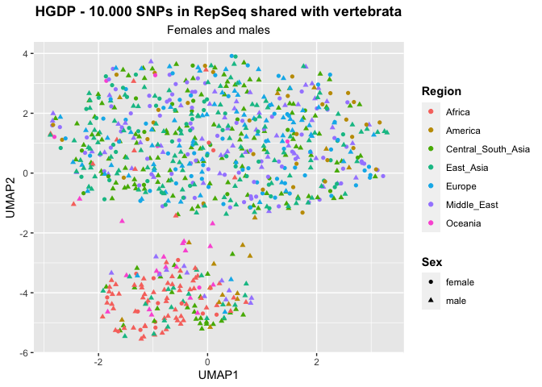<!-- -->
