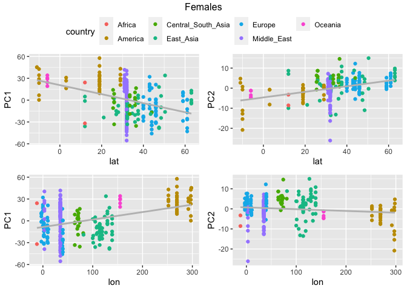
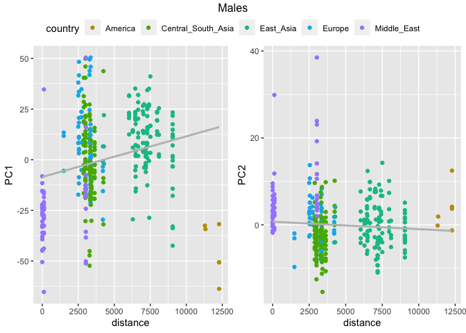
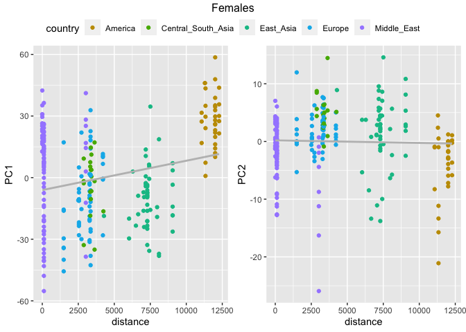

Copynumber PCAs - Correlation with geographic coordinates
================

## Setting the environment

``` r
library(tidyverse)
```

    ## ── Attaching packages ─────────────────────────────────────── tidyverse 1.3.2 ──
    ## ✔ ggplot2 3.4.0      ✔ purrr   0.3.4 
    ## ✔ tibble  3.1.8      ✔ dplyr   1.0.10
    ## ✔ tidyr   1.2.1      ✔ stringr 1.4.1 
    ## ✔ readr   2.1.2      ✔ forcats 0.5.2 
    ## ── Conflicts ────────────────────────────────────────── tidyverse_conflicts() ──
    ## ✖ dplyr::filter() masks stats::filter()
    ## ✖ dplyr::lag()    masks stats::lag()

``` r
library(ggpubr)
```

# Preparing the filtered HGDP file

## Read HGDP summary file

``` r
HGDP <- read_delim("/Volumes/Temp1/rpianezza/0.old/summary-HGDP/USEME_HGDP_complete_reflib6.2_mq10_batchinfo_cutoff0.01.txt")
```

    ## Rows: 1394352 Columns: 10
    ## ── Column specification ────────────────────────────────────────────────────────
    ## Delimiter: ","
    ## chr (7): ID, Pop, sex, Country, type, familyname, batch
    ## dbl (3): length, reads, copynumber
    ## 
    ## ℹ Use `spec()` to retrieve the full column specification for this data.
    ## ℹ Specify the column types or set `show_col_types = FALSE` to quiet this message.

``` r
names(HGDP) <- c("ID","pop","sex","country","type","familyname","length","reads","copynumber","batch")

HGDP_pcr_free_samples <- read_tsv("/Volumes/Temp1/rpianezza/investigation/HGDP-no-PCR/HGDP-only-pcr-free-samples.tsv", col_names = "ID")
```

    ## Rows: 676 Columns: 1
    ## ── Column specification ────────────────────────────────────────────────────────
    ## Delimiter: "\t"
    ## chr (1): ID
    ## 
    ## ℹ Use `spec()` to retrieve the full column specification for this data.
    ## ℹ Specify the column types or set `show_col_types = FALSE` to quiet this message.

``` r
HGDP_pcr_free <- HGDP %>% filter(ID %in% HGDP_pcr_free_samples$ID)

a_HGDP <- read_tsv("/Volumes/Temp1/rpianezza/PCA-copynumber-all-analysis/a_HGDP.tsv")
```

    ## Rows: 828 Columns: 2
    ## ── Column specification ────────────────────────────────────────────────────────
    ## Delimiter: "\t"
    ## chr (1): ID
    ## dbl (1): a
    ## 
    ## ℹ Use `spec()` to retrieve the full column specification for this data.
    ## ℹ Specify the column types or set `show_col_types = FALSE` to quiet this message.

``` r
HGDP_nobiased_samples <- filter(a_HGDP, (a > (-0.5)) & (a<0.5)) %>% select(ID) %>% pull()
HGDP_final <- filter(HGDP_pcr_free, ID %in% HGDP_nobiased_samples)
```

## Read coordinates file

``` r
coordinates <- read_tsv("/Volumes/Temp1/rpianezza/PCA-copynumber-all-analysis/american-to-east.tsv", col_names = c("pop", "region", "latitude", "longitude")) %>% select(pop, latitude, longitude)
```

    ## Rows: 54 Columns: 4
    ## ── Column specification ────────────────────────────────────────────────────────
    ## Delimiter: "\t"
    ## chr (2): pop, region
    ## dbl (2): latitude, longitude
    ## 
    ## ℹ Use `spec()` to retrieve the full column specification for this data.
    ## ℹ Specify the column types or set `show_col_types = FALSE` to quiet this message.

``` r
data <- inner_join(coordinates, HGDP_final, by = "pop")

distance_from_ooa <- read_tsv("/Volumes/Temp1/rpianezza/PCA-copynumber-all-analysis/dist-from-ooa.tsv", col_names = c("pop", "region", "distance")) %>% select(pop, distance)
```

    ## Rows: 54 Columns: 3
    ## ── Column specification ────────────────────────────────────────────────────────
    ## Delimiter: "\t"
    ## chr (2): pop, region
    ## dbl (1): distance
    ## 
    ## ℹ Use `spec()` to retrieve the full column specification for this data.
    ## ℹ Specify the column types or set `show_col_types = FALSE` to quiet this message.

``` r
data_distance <- inner_join(distance_from_ooa, HGDP_final, by = "pop")
```

# PCA on the filtered dataset

## Correlation between PCs and coordinates

``` r
PCA_coord <- function(raw_data, s, title){
data <- filter(raw_data, type=="te")
m <- filter(data, sex==s)
m_ID <- select(m, ID, country, latitude, longitude) %>% distinct()
fam <- length(unique(data$familyname))
males <- length(unique(m$ID))

m_matrix <- matrix(as.vector(m$copynumber),nrow=males,ncol=fam,byrow=T)
m_fram <- data.frame(m_matrix)
names(m_fram)<-unique(m$familyname)
m_fram <- m_fram %>% select_if(negate(function(col) sd(col)==0))
m_matrixcont <- matrix(as.vector(m$country),nrow=males,ncol=fam,byrow=T)
m_framcont <- data.frame(m_matrixcont)
m_contcol<-c(m_framcont$X1)

mHGDP.pca <- prcomp(m_fram, center = TRUE, scale = TRUE)
m_var1 <- summary(mHGDP.pca)$importance[2,1]
m_var2 <- summary(mHGDP.pca)$importance[2,2]

m_processed <- mHGDP.pca$x %>% as_tibble() %>% select(c(PC1, PC2)) %>% mutate(ID = m_ID$ID, lat=m_ID$latitude, lon=m_ID$longitude, country=m_ID$country) %>% relocate(ID, .before = PC1)

m_PC1_lat <- cor.test(m_processed$lat, m_processed$PC1, method = "kendall")
m_PC2_lat <- cor.test(m_processed$lat, m_processed$PC2, method = "kendall")
m_PC1_lon <- cor.test(m_processed$lon, m_processed$PC1, method = "kendall")
m_PC2_lon <- cor.test(m_processed$lon, m_processed$PC2, method = "kendall")

PC1_tibble <- tibble(sex = s, PC = 1, lat = m_PC1_lat$estimate, lon = m_PC1_lon$estimate, p_value = m_PC1_lat$p.value)
PC2_tibble <- tibble(sex = s, PC = 2, lat = m_PC2_lat$estimate, lon = m_PC2_lon$estimate, p_value = m_PC2_lat$p.value)

result_tibble <- bind_rows(PC1_tibble, PC2_tibble)

m_PC1_lat <- m_processed %>% ggplot(aes(lat, PC1)) + geom_point(aes(color=country)) + geom_smooth(method = "lm", se = FALSE, color = "grey")
m_PC2_lat <- m_processed %>% ggplot(aes(lat, PC2)) + geom_point(aes(color=country)) + geom_smooth(method = "lm", se = FALSE, color = "grey")
m_PC1_lon <- m_processed %>% ggplot(aes(lon, PC1)) + geom_point(aes(color=country)) + geom_smooth(method = "lm", se = FALSE, color = "grey")
m_PC2_lon <- m_processed %>% ggplot(aes(lon, PC2)) + geom_point(aes(color=country)) + geom_smooth(method = "lm", se = FALSE, color = "grey")

figure <- ggarrange(m_PC1_lat, m_PC2_lat, m_PC1_lon, m_PC2_lon, ncol = 2, nrow = 2, common.legend = TRUE)
image <- annotate_figure(figure, top = title)

list(plot = image, tibble = result_tibble)
}
```

``` r
male_coord <- PCA_coord(data, "male", "Males")
```

    ## `geom_smooth()` using formula = 'y ~ x'
    ## `geom_smooth()` using formula = 'y ~ x'
    ## `geom_smooth()` using formula = 'y ~ x'
    ## `geom_smooth()` using formula = 'y ~ x'
    ## `geom_smooth()` using formula = 'y ~ x'

``` r
female_coord <- PCA_coord(data, "female", "Females")
```

    ## `geom_smooth()` using formula = 'y ~ x'
    ## `geom_smooth()` using formula = 'y ~ x'
    ## `geom_smooth()` using formula = 'y ~ x'
    ## `geom_smooth()` using formula = 'y ~ x'
    ## `geom_smooth()` using formula = 'y ~ x'

``` r
male_coord$plot
```

<!-- -->

``` r
male_coord$tibble
```

    ## # A tibble: 2 × 5
    ##   sex      PC    lat     lon   p_value
    ##   <chr> <dbl>  <dbl>   <dbl>     <dbl>
    ## 1 male      1  0.113  0.141  0.000953 
    ## 2 male      2 -0.133 -0.0847 0.0000986

``` r
female_coord$plot
```

<!-- -->

``` r
female_coord$tibble
```

    ## # A tibble: 2 × 5
    ##   sex       PC    lat      lon  p_value
    ##   <chr>  <dbl>  <dbl>    <dbl>    <dbl>
    ## 1 female     1 -0.340  0.136   9.68e-15
    ## 2 female     2  0.282 -0.00226 1.31e-10

## Correlation between PCs and distance from the OOA

``` r
PCA_distance <- function(raw_data, s, title){
data <- filter(raw_data, type=="te")
m <- filter(data, sex==s, !(country %in% c("Africa","Oceania")))
m_ID <- select(m, ID, country, distance) %>% distinct()
fam <- length(unique(data$familyname))
males <- length(unique(m$ID))

m_matrix <- matrix(as.vector(m$copynumber),nrow=males,ncol=fam,byrow=T)
m_fram <- data.frame(m_matrix)
names(m_fram)<-unique(m$familyname)
m_fram <- m_fram %>% select_if(negate(function(col) sd(col)==0))
m_matrixcont <- matrix(as.vector(m$country),nrow=males,ncol=fam,byrow=T)
m_framcont <- data.frame(m_matrixcont)
m_contcol<-c(m_framcont$X1)

mHGDP.pca <- prcomp(m_fram, center = TRUE, scale = TRUE)
m_var1 <- summary(mHGDP.pca)$importance[2,1]
m_var2 <- summary(mHGDP.pca)$importance[2,2]

m_processed <- mHGDP.pca$x %>% as_tibble() %>% select(c(PC1, PC2)) %>% mutate(ID=m_ID$ID, distance=m_ID$distance, country=m_ID$country) %>% relocate(ID, .before = PC1)

m_PC1 <- cor.test(m_processed$distance, m_processed$PC1, method = "kendall")
m_PC2 <- cor.test(m_processed$distance, m_processed$PC2, method = "kendall")
  
  PC1_tibble <- tibble(sex = s, PC = 1, coeff = m_PC1$estimate, p_value = m_PC1$p.value)
  PC2_tibble <- tibble(sex = s, PC = 2, coeff = m_PC2$estimate, p_value = m_PC2$p.value)
  
  result_tibble <- bind_rows(PC1_tibble, PC2_tibble)
  
  m_PC1 <- m_processed %>% ggplot(aes(distance, PC1)) + 
    geom_point(aes(color=country)) + 
    geom_smooth(method = "lm", se = FALSE, color = "grey") + 
    scale_color_manual(values=c("America"="#C49A00", "Central_South_Asia"="#53B400", 
                                "East_Asia"="#00C094", "Europe"="#00B6EB", 
                                "Middle_East"="#A58AFF"))
  
  m_PC2 <- m_processed %>% ggplot(aes(distance, PC2)) + 
    geom_point(aes(color=country)) + 
    geom_smooth(method = "lm", se = FALSE, color = "grey") + 
    scale_color_manual(values=c("America"="#C49A00", "Central_South_Asia"="#53B400", 
                                "East_Asia"="#00C094", "Europe"="#00B6EB", 
                                "Middle_East"="#A58AFF"))
  
  figure <- ggarrange(m_PC1, m_PC2, ncol = 2, common.legend = TRUE)
  image <- annotate_figure(figure, top = title)
  
  list(plot = image, tibble = result_tibble)
  }
```

``` r
dist_males <- PCA_distance(data_distance, "male", "Males")
```

    ## `geom_smooth()` using formula = 'y ~ x'
    ## `geom_smooth()` using formula = 'y ~ x'
    ## `geom_smooth()` using formula = 'y ~ x'

``` r
dist_females <- PCA_distance(data_distance, "female", "Females")
```

    ## `geom_smooth()` using formula = 'y ~ x'
    ## `geom_smooth()` using formula = 'y ~ x'
    ## `geom_smooth()` using formula = 'y ~ x'

``` r
dist_males$plot
```

<!-- -->

``` r
dist_males$tibble
```

    ## # A tibble: 2 × 4
    ##   sex      PC   coeff     p_value
    ##   <chr> <dbl>   <dbl>       <dbl>
    ## 1 male      1  0.179  0.000000240
    ## 2 male      2 -0.0855 0.0139

``` r
dist_females$plot
```

<!-- -->

``` r
dist_females$tibble
```

    ## # A tibble: 2 × 4
    ##   sex       PC  coeff p_value
    ##   <chr>  <dbl>  <dbl>   <dbl>
    ## 1 female     1 0.0586  0.186 
    ## 2 female     2 0.0779  0.0787
