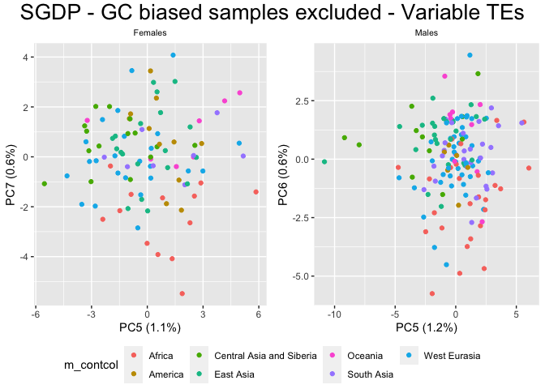

Copynumber PCAs - ANOVA
================

``` r
library(tidyverse)
```

    ## ── Attaching packages ─────────────────────────────────────── tidyverse 1.3.2 ──
    ## ✔ ggplot2 3.4.0      ✔ purrr   0.3.4 
    ## ✔ tibble  3.1.8      ✔ dplyr   1.0.10
    ## ✔ tidyr   1.2.1      ✔ stringr 1.4.1 
    ## ✔ readr   2.1.2      ✔ forcats 0.5.2 
    ## ── Conflicts ────────────────────────────────────────── tidyverse_conflicts() ──
    ## ✖ dplyr::filter() masks stats::filter()
    ## ✖ dplyr::lag()    masks stats::lag()

``` r
library(ggpubr)
HGDP <- read_delim("/Volumes/Temp1/rpianezza/TE/summary-HGDP/USEME_HGDP_complete_reflib6.2_mq10_batchinfo_cutoff0.01.txt")
```

    ## Rows: 1394352 Columns: 10
    ## ── Column specification ────────────────────────────────────────────────────────
    ## Delimiter: ","
    ## chr (7): ID, Pop, sex, Country, type, familyname, batch
    ## dbl (3): length, reads, copynumber
    ## 
    ## ℹ Use `spec()` to retrieve the full column specification for this data.
    ## ℹ Specify the column types or set `show_col_types = FALSE` to quiet this message.

``` r
names(HGDP) <- c("ID","pop","sex","country","type","familyname","length","reads","copynumber","batch")

SGDP <- read_tsv("/Volumes/Temp2/rpianezza/SGDP/summary/USEME_SGDP_cutoff") %>% dplyr::rename(ID=biosample)
```

    ## Rows: 470028 Columns: 10
    ## ── Column specification ────────────────────────────────────────────────────────
    ## Delimiter: "\t"
    ## chr (7): biosample, sex, pop, country, type, familyname, batch
    ## dbl (3): length, reads, copynumber
    ## 
    ## ℹ Use `spec()` to retrieve the full column specification for this data.
    ## ℹ Specify the column types or set `show_col_types = FALSE` to quiet this message.

``` r
HGDP_pcr_free_samples <- read_tsv("/Volumes/Temp1/rpianezza/investigation/HGDP-no-PCR/HGDP-only-pcr-free-samples.tsv", col_names = "ID")
```

    ## Rows: 676 Columns: 1
    ## ── Column specification ────────────────────────────────────────────────────────
    ## Delimiter: "\t"
    ## chr (1): ID
    ## 
    ## ℹ Use `spec()` to retrieve the full column specification for this data.
    ## ℹ Specify the column types or set `show_col_types = FALSE` to quiet this message.

``` r
HGDP_pcr_free <- HGDP %>% filter(ID %in% HGDP_pcr_free_samples$ID)
HGDP_pcr <- HGDP %>% filter(!(ID %in% HGDP_pcr_free_samples$ID))

SGDP_pcr_free_samples <- read_tsv("/Volumes/Temp1/rpianezza/SGDP/ric-documentation/SGDP-no-PCR.tsv")
```

    ## Rows: 261 Columns: 1
    ## ── Column specification ────────────────────────────────────────────────────────
    ## Delimiter: "\t"
    ## chr (1): ID
    ## 
    ## ℹ Use `spec()` to retrieve the full column specification for this data.
    ## ℹ Specify the column types or set `show_col_types = FALSE` to quiet this message.

``` r
SGDP_pcr_free <- SGDP %>% filter(ID %in% SGDP_pcr_free_samples$ID)

HvariableTEs <- filter(HGDP_pcr_free, type == "te") %>% group_by(familyname) %>% summarise(variance = var(copynumber)) %>% filter(variance>0.5) %>% select(familyname) %>% pull()
```

# Function for PCA + ANOVA test

``` r
ANOVA_PCA_copynumber <- function(raw_data, title){
data <- filter(raw_data, type=="te")
m <- filter(data, sex=='male')
f <- filter(data, sex=='female')
len <- length(unique(data$familyname))
males <- length(unique(m$ID))
females <- length(unique(f$ID))

f_matrix <- matrix(as.vector(f$copynumber),nrow=females,ncol=len,byrow=T)
f_fram <- data.frame(f_matrix)
names(f_fram) <- unique(f$familyname)
f_fram <- f_fram %>% select_if(negate(function(col) sd(col)==0))
f_matrixcont <- matrix(as.vector(f$country),nrow=females,ncol=len,byrow=T)
f_framcont <- data.frame(f_matrixcont)
f_contcol<-c(f_framcont$X1)

m_matrix <- matrix(as.vector(m$copynumber),nrow=males,ncol=len,byrow=T)
m_fram <- data.frame(m_matrix)
names(m_fram)<-unique(m$familyname)
m_fram <- m_fram %>% select_if(negate(function(col) sd(col)==0))
m_matrixcont <- matrix(as.vector(m$country),nrow=males,ncol=len,byrow=T)
m_framcont <- data.frame(m_matrixcont)
m_contcol<-c(m_framcont$X1)

fHGDP.pca <- prcomp(f_fram, center = TRUE, scale = TRUE)
mHGDP.pca <- prcomp(m_fram, center = TRUE, scale = TRUE)

# Create an empty tibble to store the results
results <- tibble()

# Perform ANOVA on PC1 and PC2 for the female samples
for (i in c(1:10)) {
  model <- aov(fHGDP.pca$x[,i] ~ f_contcol)
  summary_res <- summary(model)
  
  # Extract the F value and p-value from the summary and the explained variability
  f_value <- summary_res[[1]]$F[1]
  p_value <- summary_res[[1]]$`Pr(>F)`[1]
  explained_var <- (fHGDP.pca$sdev[i]^2/sum(fHGDP.pca$sdev^2))*100
  
  if (p_value < 0.001) {
significance <- "strong"
} else if (p_value >= 0.001 & p_value < 0.01) {
significance <- "moderate"
} else if (p_value >= 0.01 & p_value < 0.05) {
significance <- "weak"
} else if (p_value >= 0.05 & p_value < 0.1) {
significance <- "little"
} else {
significance <- "no-evidence"
}
  
  # Store the results in the tibble
  results <- results %>% bind_rows(tibble(PC = paste0("PC", i), Sex = "Female", F = f_value, p = p_value, Explained_Variability = explained_var, Significance = significance))
}

# Repeat the ANOVA analysis for the male samples
for (i in c(1:10)) {
  model <- aov(mHGDP.pca$x[,i] ~ m_contcol)
  summary_res <- summary(model)
  
  # Extract the F value and p-value from the summary and the explained variability
  f_value <- summary_res[[1]]$F[1]
  p_value <- summary_res[[1]]$`Pr(>F)`[1]
  explained_var <- (mHGDP.pca$sdev[i]^2/sum(mHGDP.pca$sdev^2))*100
  
  if (p_value < 0.001) {
significance <- "strong"
} else if (p_value >= 0.001 & p_value < 0.01) {
significance <- "moderate"
} else if (p_value >= 0.01 & p_value < 0.05) {
significance <- "weak"
} else if (p_value >= 0.05 & p_value < 0.1) {
significance <- "little"
} else {
significance <- "no-evidence"
}
  
  # Store the results in the tibble
  results <- results %>% bind_rows(tibble(PC = paste0("PC", i), Sex = "Male", F = f_value, p = p_value, Explained_Variability = explained_var, Significance = significance))
}

# Print the results
print(results)
}
```

# PCA

PCA excluding biased samples (PCR samples + GC biased samples PCR free)
and excluding non-variable TEs.

## HGDP

``` r
a_HGDP <- read_tsv("/Volumes/Temp1/rpianezza/PCA-copynumber-all-analysis/a_HGDP.tsv")
```

    ## Rows: 828 Columns: 2
    ## ── Column specification ────────────────────────────────────────────────────────
    ## Delimiter: "\t"
    ## chr (1): ID
    ## dbl (1): a
    ## 
    ## ℹ Use `spec()` to retrieve the full column specification for this data.
    ## ℹ Specify the column types or set `show_col_types = FALSE` to quiet this message.

``` r
HGDP_nobiased_samples <- filter(a_HGDP, (a > (-0.5)) & (a<0.5)) %>% select(ID) %>% pull()
HGDP_nobiasedID <- filter(HGDP, ID %in% HGDP_nobiased_samples)
HGDP_nobiasedID_pcrfree <- filter(HGDP_pcr_free, ID %in% HGDP_nobiased_samples)
HGDP_nobiasedID_pcrfree_varTE <- filter(HGDP_nobiasedID_pcrfree, familyname %in% HvariableTEs)

ANOVA_PCA_copynumber(HGDP_nobiasedID_pcrfree_varTE, "HGDP - GC biased samples excluded - Variable TEs")
```

    ## # A tibble: 20 × 6
    ##    PC    Sex        F        p Explained_Variability Significance
    ##    <chr> <chr>  <dbl>    <dbl>                 <dbl> <chr>       
    ##  1 PC1   Female 20.2  3.49e-19                78.1   strong      
    ##  2 PC2   Female 13.6  2.54e-13                 4.74  strong      
    ##  3 PC3   Female 14.9  1.66e-14                 1.93  strong      
    ##  4 PC4   Female  3.84 1.11e- 3                 1.21  moderate    
    ##  5 PC5   Female 13.6  2.58e-13                 0.962 strong      
    ##  6 PC6   Female  2.88 9.90e- 3                 0.662 moderate    
    ##  7 PC7   Female 12.5  2.74e-12                 0.621 strong      
    ##  8 PC8   Female  2.88 9.92e- 3                 0.460 moderate    
    ##  9 PC9   Female  6.41 2.75e- 6                 0.340 strong      
    ## 10 PC10  Female  1.35 2.36e- 1                 0.316 no-evidence 
    ## 11 PC1   Male   33.3  1.88e-32                71.4   strong      
    ## 12 PC2   Male   33.4  1.52e-32                 6.06  strong      
    ## 13 PC3   Male   38.0  2.10e-36                 2.46  strong      
    ## 14 PC4   Male   32.1  1.79e-31                 1.64  strong      
    ## 15 PC5   Male   26.3  2.27e-26                 1.21  strong      
    ## 16 PC6   Male    4.23 3.84e- 4                 1.09  strong      
    ## 17 PC7   Male   28.2  4.76e-28                 0.645 strong      
    ## 18 PC8   Male   14.9  2.22e-15                 0.493 strong      
    ## 19 PC9   Male    3.31 3.47e- 3                 0.401 moderate    
    ## 20 PC10  Male    8.79 5.28e- 9                 0.340 strong

## SGDP

``` r
SvariableTEs <- filter(SGDP_pcr_free, type == "te") %>% group_by(familyname) %>% summarise(variance = var(copynumber)) %>% filter(variance>0.5) %>% select(familyname) %>% pull()

a_SGDP <- read_tsv("/Volumes/Temp1/rpianezza/PCA-copynumber-all-analysis/a_SGDP.tsv")
```

    ## Rows: 276 Columns: 2
    ## ── Column specification ────────────────────────────────────────────────────────
    ## Delimiter: "\t"
    ## chr (1): ID
    ## dbl (1): a
    ## 
    ## ℹ Use `spec()` to retrieve the full column specification for this data.
    ## ℹ Specify the column types or set `show_col_types = FALSE` to quiet this message.

``` r
SGDP_nobiased_samples <- filter(a_SGDP, (a > (-0.5)) & (a<0.5)) %>% select(ID) %>% pull()
SGDP_nobiasedID <- filter(SGDP, ID %in% SGDP_nobiased_samples)
SGDP_nobiasedID_pcrfree <- filter(SGDP_pcr_free, ID %in% SGDP_nobiased_samples)
SGDP_nobiasedID_pcrfree_varTE <- filter(SGDP_nobiasedID_pcrfree, familyname %in% SvariableTEs)

ANOVA_PCA_copynumber(SGDP_nobiasedID_pcrfree_varTE, "SGDP - GC biased samples excluded - Variable TEs")
```

    ## # A tibble: 20 × 6
    ##    PC    Sex        F           p Explained_Variability Significance
    ##    <chr> <chr>  <dbl>       <dbl>                 <dbl> <chr>       
    ##  1 PC1   Female  2.25 0.0456                     76.2   weak        
    ##  2 PC2   Female  1.59 0.160                       6.33  no-evidence 
    ##  3 PC3   Female  2.60 0.0227                      2.42  weak        
    ##  4 PC4   Female  2.87 0.0133                      1.30  weak        
    ##  5 PC5   Female  4.61 0.000398                    1.08  strong      
    ##  6 PC6   Female  1.19 0.317                       0.762 no-evidence 
    ##  7 PC7   Female  7.96 0.000000678                 0.630 strong      
    ##  8 PC8   Female  2.42 0.0323                      0.555 weak        
    ##  9 PC9   Female  1.07 0.387                       0.524 no-evidence 
    ## 10 PC10  Female  1.12 0.354                       0.439 no-evidence 
    ## 11 PC1   Male    2.34 0.0349                     74.0   weak        
    ## 12 PC2   Male    1.97 0.0743                      8.45  little      
    ## 13 PC3   Male    1.91 0.0837                      2.09  little      
    ## 14 PC4   Male    1.91 0.0834                      1.35  little      
    ## 15 PC5   Male    6.63 0.00000340                  1.20  strong      
    ## 16 PC6   Male    8.02 0.000000186                 0.625 strong      
    ## 17 PC7   Male    1.69 0.129                       0.519 no-evidence 
    ## 18 PC8   Male    5.11 0.0000890                   0.499 strong      
    ## 19 PC9   Male    2.11 0.0562                      0.484 little      
    ## 20 PC10  Male    1.91 0.0828                      0.452 little

## Test different PCs for SGDP based on the ANOVA test results

``` r
PCA_copynumber <- function(raw_data, title, colors){
  
color_palette <- colors
    
data <- filter(raw_data, type=="te")
m <- filter(data, sex=='male')
f <- filter(data, sex=='female')
len <- length(unique(data$familyname))
males <- length(unique(m$ID))
females <- length(unique(f$ID))

f_matrix <- matrix(as.vector(f$copynumber),nrow=females,ncol=len,byrow=T)
f_fram <- data.frame(f_matrix)
names(f_fram) <- unique(f$familyname)
f_fram <- f_fram %>% select_if(negate(function(col) sd(col)==0))
f_matrixcont <- matrix(as.vector(f$country),nrow=females,ncol=len,byrow=T)
f_framcont <- data.frame(f_matrixcont)
f_contcol<-c(f_framcont$X1)

m_matrix <- matrix(as.vector(m$copynumber),nrow=males,ncol=len,byrow=T)
m_fram <- data.frame(m_matrix)
names(m_fram)<-unique(m$familyname)
m_fram <- m_fram %>% select_if(negate(function(col) sd(col)==0))
m_matrixcont <- matrix(as.vector(m$country),nrow=males,ncol=len,byrow=T)
m_framcont <- data.frame(m_matrixcont)
m_contcol<-c(m_framcont$X1)
  
fHGDP.pca <- prcomp(f_fram, center = TRUE, scale = TRUE)
f_var <- summary(fHGDP.pca)$importance[2,1]

fHGDP.pca <- prcomp(f_fram, center = TRUE, scale = TRUE)
f_var1 <- summary(fHGDP.pca)$importance[2,5]
f_var2 <- summary(fHGDP.pca)$importance[2,7]

f_PCA <- ggplot(data=f_fram, aes(x=fHGDP.pca$x[,5], y=fHGDP.pca$x[,7], color = f_contcol)) + 
geom_point() + 
ggtitle("Females") + 
xlab(paste0("PC5 (", round(f_var1,3)*100,"%)")) + 
ylab(paste0("PC7 (",round(f_var2,3)*100,"%)")) + 
theme(plot.title = element_text(size = 8, hjust = 0.5))+ 
guides(col = guide_colourbar(title = ""))+ 
scale_color_manual(values = color_palette)

mHGDP.pca <- prcomp(m_fram, center = TRUE, scale = TRUE)
m_var1 <- summary(mHGDP.pca)$importance[2,5]
m_var2 <- summary(mHGDP.pca)$importance[2,6]

m_PCA <- ggplot(data=m_fram, aes(x=mHGDP.pca$x[,5], y=mHGDP.pca$x[,6], color = m_contcol)) +
geom_point() +
ggtitle("Males") +
xlab(paste0("PC5 (", round(m_var1,3)*100,"%)")) +
ylab(paste0("PC6 (",round(m_var2,3)*100,"%)")) +
theme(plot.title = element_text(size = 8, hjust = 0.5))+ 
scale_color_manual(values = color_palette)

figure <- ggarrange(f_PCA, m_PCA, ncol = 2, nrow = 1, common.legend = TRUE, legend = "bottom", font.label = list(size = 10, color = "black", face = "bold", family = NULL, position = "top"))
annotate_figure(figure, top = text_grob(title, color = "black", size = 20), fig.lab = "")
}

SGDP_colors <- c("Africa" = "#F8766D", "America" = "#C49A00", "Central Asia and Siberia" = "#53B400", "East Asia" = "#00C094", "West Eurasia" = "#00B6EB", "South Asia" = "#A58AFF", "Oceania" = "#FB61D7")

PCA_copynumber(SGDP_nobiasedID_pcrfree_varTE, "SGDP - GC biased samples excluded - Variable TEs", SGDP_colors)
```

    ## Warning: colourbar guide needs continuous scales.

<!-- -->
