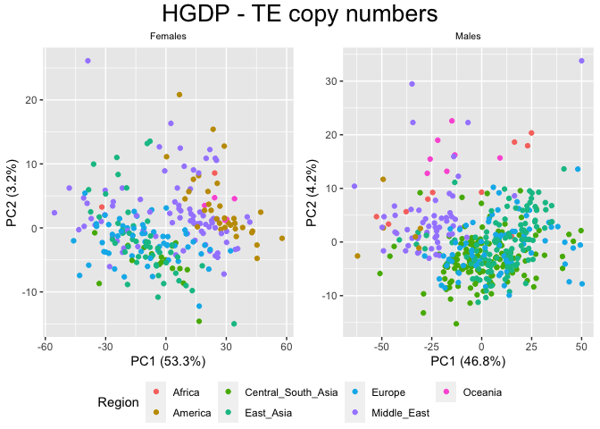

Copynumber PCAs - Summary
================

In this document I want to summarize the results we got on the
copynumber PCAs in the HGDP. We decided to leave apart the SGDP, cause
even if we were able to clean a bit the data, they still look confusing
and of poor quality for our analysis.

In the previous scripts, we tried different filters for the dataset
(HGDP) to clean it and refine our findings:

- **Filter on the samples**: \*\* Only **PCR-free** samples: the PCR
  samples are showing a different clustering in the PCA \*\* Only
  **GC-bias-free** samples: mostly overlapping with the PCR-free
  samples, cause most of the PCR-samples are also showing a GC-bias, as
  expected \*\* Only **PCR-free** samples *and* **GC-bias-free**
  samples: a few PCR samples does not show GC-bias, but here we exclude
  them anyway to avoid considering possible outliers of the PCR samples.
  This is the final filtering step of the dataset based on the samples.

- **Filter on the TEs families**: \*\* Only TEs with GC content 45-55%:
  the idea was that removing GC-biased TEs we were able to “save” the
  PCR samples, making them clustering around the PCR-free samples. This
  was not the case. \*\* Only variable TEs

Since we were not able to save the PCR-samples in any way, we decided in
the end to consider **only samples PCR-free and GC-bias-free**, but to
not further filter for TEs families.

## Setting the environment

``` r
library(tidyverse)
```

    ## ── Attaching packages ─────────────────────────────────────── tidyverse 1.3.2 ──
    ## ✔ ggplot2 3.4.0      ✔ purrr   0.3.4 
    ## ✔ tibble  3.1.8      ✔ dplyr   1.0.10
    ## ✔ tidyr   1.2.1      ✔ stringr 1.4.1 
    ## ✔ readr   2.1.2      ✔ forcats 0.5.2 
    ## ── Conflicts ────────────────────────────────────────── tidyverse_conflicts() ──
    ## ✖ dplyr::filter() masks stats::filter()
    ## ✖ dplyr::lag()    masks stats::lag()

``` r
library(ggpubr)
```

# Preparing the filtered HGDP file

## Read HGDP summary file

``` r
HGDP <- read_delim("/Volumes/Temp1/rpianezza/0.old/summary-HGDP/USEME_HGDP_complete_reflib6.2_mq10_batchinfo_cutoff0.01.txt")
```

    ## Rows: 1394352 Columns: 10
    ## ── Column specification ────────────────────────────────────────────────────────
    ## Delimiter: ","
    ## chr (7): ID, Pop, sex, Country, type, familyname, batch
    ## dbl (3): length, reads, copynumber
    ## 
    ## ℹ Use `spec()` to retrieve the full column specification for this data.
    ## ℹ Specify the column types or set `show_col_types = FALSE` to quiet this message.

``` r
names(HGDP) <- c("ID","pop","sex","country","type","familyname","length","reads","copynumber","batch")
```

## Filter out the PCR samples

From the initial 828 samples, we remain with 676 after removing the PCR
samples.

``` r
HGDP_pcr_free_samples <- read_tsv("/Volumes/Temp1/rpianezza/investigation/HGDP-no-PCR/HGDP-only-pcr-free-samples.tsv", col_names = "ID")
```

    ## Rows: 676 Columns: 1
    ## ── Column specification ────────────────────────────────────────────────────────
    ## Delimiter: "\t"
    ## chr (1): ID
    ## 
    ## ℹ Use `spec()` to retrieve the full column specification for this data.
    ## ℹ Specify the column types or set `show_col_types = FALSE` to quiet this message.

``` r
HGDP_pcr_free <- HGDP %>% filter(ID %in% HGDP_pcr_free_samples$ID)
```

## Filter out the GC-biased samples

From the 676 PCR-free samples, removing the GC-biased samples leads to a
dataset with **655 samples** in total.

- 402 males
- 253 females

Note that **“a”** is the parabola quadratic coefficient which represent
the GC-bias in every samples. If it’s between -0.5 and 0.5, we assume
that the GC-bias is not relevant in the sample. This procedure is better
explained in the GC-bias script in “other documentation”.

``` r
a_HGDP <- read_tsv("/Volumes/Temp1/rpianezza/PCA-copynumber-all-analysis/a_HGDP.tsv")
```

    ## Rows: 828 Columns: 2
    ## ── Column specification ────────────────────────────────────────────────────────
    ## Delimiter: "\t"
    ## chr (1): ID
    ## dbl (1): a
    ## 
    ## ℹ Use `spec()` to retrieve the full column specification for this data.
    ## ℹ Specify the column types or set `show_col_types = FALSE` to quiet this message.

``` r
HGDP_nobiased_samples <- filter(a_HGDP, (a > (-0.5)) & (a<0.5)) %>% select(ID) %>% pull()
HGDP_final <- filter(HGDP_pcr_free, ID %in% HGDP_nobiased_samples)
```

# PCA on the filtered dataset

## Function for PCA plotting

``` r
PCA_copynumber <- function(raw_data, title){
data <- filter(raw_data, type=="te")
m <- filter(data, sex=='male')
f <- filter(data, sex=='female')
len <- length(unique(data$familyname))
males <- length(unique(m$ID))
females <- length(unique(f$ID))

f_matrix <- matrix(as.vector(f$copynumber),nrow=females,ncol=len,byrow=T)
f_fram <- data.frame(f_matrix)
names(f_fram) <- unique(f$familyname)
f_fram <- f_fram %>% select_if(negate(function(col) sd(col)==0))
f_matrixcont <- matrix(as.vector(f$country),nrow=females,ncol=len,byrow=T)
f_framcont <- data.frame(f_matrixcont)
f_contcol<-c(f_framcont$X1)

m_matrix <- matrix(as.vector(m$copynumber),nrow=males,ncol=len,byrow=T)
m_fram <- data.frame(m_matrix)
names(m_fram)<-unique(m$familyname)
m_fram <- m_fram %>% select_if(negate(function(col) sd(col)==0))
m_matrixcont <- matrix(as.vector(m$country),nrow=males,ncol=len,byrow=T)
m_framcont <- data.frame(m_matrixcont)
m_contcol<-c(m_framcont$X1)
  
fHGDP.pca <- prcomp(f_fram, center = TRUE, scale = TRUE)
f_var <- summary(fHGDP.pca)$importance[2,1]

fHGDP.pca <- prcomp(f_fram, center = TRUE, scale = TRUE)
f_var1 <- summary(fHGDP.pca)$importance[2,1]
f_var2 <- summary(fHGDP.pca)$importance[2,2]

f_PCA <- ggplot(data=f_fram, aes(x=fHGDP.pca$x[,1], y=fHGDP.pca$x[,2], color = f_contcol)) + 
geom_point() + 
ggtitle("Females") + 
xlab(paste0("PC1 (", round(f_var1,3)*100,"%)")) + 
ylab(paste0("PC2 (",round(f_var2,3)*100,"%)")) + 
theme(plot.title = element_text(size = 8, hjust = 0.5))+ guides(color=guide_legend(title="Region"))

mHGDP.pca <- prcomp(m_fram, center = TRUE, scale = TRUE)
m_var1 <- summary(mHGDP.pca)$importance[2,1]
m_var2 <- summary(mHGDP.pca)$importance[2,2]

m_PCA <- ggplot(data=m_fram, aes(x=mHGDP.pca$x[,1], y=mHGDP.pca$x[,2], color = m_contcol)) +
geom_point() +
ggtitle("Males") +
xlab(paste0("PC1 (", round(m_var1,3)*100,"%)")) +
ylab(paste0("PC2 (",round(m_var2,3)*100,"%)")) +
theme(plot.title = element_text(size = 8, hjust = 0.5))

figure <- ggarrange(f_PCA, m_PCA, ncol = 2, nrow = 1, common.legend = TRUE, legend = "bottom", font.label = list(size = 10, color = "black", face = "bold", family = NULL, position = "top"))
annotate_figure(figure, top = text_grob(title, color = "black", size = 20), fig.lab = "")
}
```

## PCA

``` r
PCA_copynumber(HGDP_final, "HGDP - TE copy numbers")
```

<!-- -->

### ANOVA

We perform an **ANOVA model** to test the null hypothesis that the group
(regions) means are equal. This can be done by calculating an
F-statistic and its associated p-value, which measures the significance
of the difference in means between the groups.

``` r
ANOVA_PCA_copynumber <- function(raw_data){
data <- filter(raw_data, type=="te")
m <- filter(data, sex=='male')
f <- filter(data, sex=='female')
len <- length(unique(data$familyname))
males <- length(unique(m$ID))
females <- length(unique(f$ID))

f_matrix <- matrix(as.vector(f$copynumber),nrow=females,ncol=len,byrow=T)
f_fram <- data.frame(f_matrix)
names(f_fram) <- unique(f$familyname)
f_fram <- f_fram %>% select_if(negate(function(col) sd(col)==0))
f_matrixcont <- matrix(as.vector(f$country),nrow=females,ncol=len,byrow=T)
f_framcont <- data.frame(f_matrixcont)
f_contcol<-c(f_framcont$X1)

m_matrix <- matrix(as.vector(m$copynumber),nrow=males,ncol=len,byrow=T)
m_fram <- data.frame(m_matrix)
names(m_fram)<-unique(m$familyname)
m_fram <- m_fram %>% select_if(negate(function(col) sd(col)==0))
m_matrixcont <- matrix(as.vector(m$country),nrow=males,ncol=len,byrow=T)
m_framcont <- data.frame(m_matrixcont)
m_contcol<-c(m_framcont$X1)

fHGDP.pca <- prcomp(f_fram, center = TRUE, scale = TRUE)
mHGDP.pca <- prcomp(m_fram, center = TRUE, scale = TRUE)

# Create an empty tibble to store the results
results <- tibble()

# Perform ANOVA on PC1 and PC2 for the female samples
for (i in c(1:5)) {
  model <- aov(fHGDP.pca$x[,i] ~ f_contcol)
  summary_res <- summary(model)
  
# Extract the F value and p-value from the summary and the explained variability
f_value <- summary_res[[1]]$F[1]
p_value <- summary_res[[1]]$`Pr(>F)`[1]
explained_var <- (fHGDP.pca$sdev[i]^2/sum(fHGDP.pca$sdev^2))*100
  
  if (p_value < 0.001) {
significance <- "strong"
} else if (p_value >= 0.001 & p_value < 0.01) {
significance <- "moderate"
} else if (p_value >= 0.01 & p_value < 0.05) {
significance <- "weak"
} else if (p_value >= 0.05 & p_value < 0.1) {
significance <- "little"
} else {
significance <- "no-evidence"
}
  
# Store the results in the tibble
results <- results %>% bind_rows(tibble(PC = paste0("PC", i), Sex = "Female", F = f_value, p = p_value, Explained_Variability = explained_var, Significance = significance))
}

# Repeat the ANOVA analysis for the male samples
for (i in c(1:5)) {
  model <- aov(mHGDP.pca$x[,i] ~ m_contcol)
  summary_res <- summary(model)
  
  # Extract the F value and p-value from the summary and the explained variability
  f_value <- summary_res[[1]]$F[1]
  p_value <- summary_res[[1]]$`Pr(>F)`[1]
  explained_var <- (mHGDP.pca$sdev[i]^2/sum(mHGDP.pca$sdev^2))*100
  
  if (p_value < 0.001) {
significance <- "strong"
} else if (p_value >= 0.001 & p_value < 0.01) {
significance <- "moderate"
} else if (p_value >= 0.01 & p_value < 0.05) {
significance <- "weak"
} else if (p_value >= 0.05 & p_value < 0.1) {
significance <- "little"
} else {
significance <- "no-evidence"
}
  
# Store the results in the tibble
results <- results %>% bind_rows(tibble(PC = paste0("PC", i), Sex = "Male", F = f_value, p = p_value, Explained_Variability = explained_var, Significance = significance))
}

# Print the results
print(results)
}
```

We can see that for all the firsts 5 PCs, the significance is high
(p-value \< 0.001).

``` r
ANOVA_PCA_copynumber(HGDP_final)
```

    ## # A tibble: 10 × 6
    ##    PC    Sex        F        p Explained_Variability Significance
    ##    <chr> <chr>  <dbl>    <dbl>                 <dbl> <chr>       
    ##  1 PC1   Female 20.6  1.69e-19                53.3   strong      
    ##  2 PC2   Female 12.7  1.78e-12                 3.17  strong      
    ##  3 PC3   Female 11.4  3.12e-11                 1.55  strong      
    ##  4 PC4   Female  6.66 1.52e- 6                 1.05  strong      
    ##  5 PC5   Female  6.91 8.55e- 7                 0.884 strong      
    ##  6 PC1   Male   34.7  1.26e-33                46.8   strong      
    ##  7 PC2   Male   33.9  5.20e-33                 4.16  strong      
    ##  8 PC3   Male   29.2  6.63e-29                 1.73  strong      
    ##  9 PC4   Male   23.0  2.68e-23                 1.18  strong      
    ## 10 PC5   Male   47.0  2.04e-43                 0.908 strong

### Driving TEs

``` r
loadings_PCA_copynumber <- function(raw_data){
data <- filter(raw_data, type=="te")
m <- filter(data, sex=='male')
f <- filter(data, sex=='female')
len <- length(unique(data$familyname))
males <- length(unique(m$ID))
females <- length(unique(f$ID))

f_matrix <- matrix(as.vector(f$copynumber),nrow=females,ncol=len,byrow=T)
f_fram <- data.frame(f_matrix)
names(f_fram) <- unique(f$familyname)
f_fram <- f_fram %>% select_if(negate(function(col) sd(col)==0))
f_matrixcont <- matrix(as.vector(f$country),nrow=females,ncol=len,byrow=T)
f_framcont <- data.frame(f_matrixcont)
f_contcol<-c(f_framcont$X1)

m_matrix <- matrix(as.vector(m$copynumber),nrow=males,ncol=len,byrow=T)
m_fram <- data.frame(m_matrix)
names(m_fram)<-unique(m$familyname)
m_fram <- m_fram %>% select_if(negate(function(col) sd(col)==0))
m_matrixcont <- matrix(as.vector(m$country),nrow=males,ncol=len,byrow=T)
m_framcont <- data.frame(m_matrixcont)
m_contcol<-c(m_framcont$X1)

fHGDP.pca <- prcomp(f_fram, center = TRUE, scale = TRUE)
mHGDP.pca <- prcomp(m_fram, center = TRUE, scale = TRUE)

n_pcs <- 2
loadings_df <- data.frame(familyname = unique(f$familyname))
colnames(loadings_df) <- c("familyname")
for (i in 1:n_pcs) {
  fHGDP.loadings <- fHGDP.pca$rotation[,i]
  mHGDP.loadings <- mHGDP.pca$rotation[,i]
  loadings_df[paste0("females_PC", i)] <- fHGDP.loadings
  loadings_df[paste0("males_PC", i)] <- mHGDP.loadings
}
loadings_tibble <- as_tibble(loadings_df)
}

loadings <- loadings_PCA_copynumber(HGDP_final)
```

``` r
(femalePC1_loadings <- select(loadings, c(familyname, females_PC1)) %>% arrange(desc(abs(females_PC1))))
```

    ## # A tibble: 965 × 2
    ##    familyname females_PC1
    ##    <chr>            <dbl>
    ##  1 MLT1B          -0.0437
    ##  2 MLT1A1         -0.0437
    ##  3 L1PA16         -0.0437
    ##  4 TIGGER2        -0.0437
    ##  5 MER4D1         -0.0436
    ##  6 TIGGER1        -0.0436
    ##  7 MSTA           -0.0436
    ##  8 L1PA10         -0.0436
    ##  9 MLT1D          -0.0436
    ## 10 L1MC1          -0.0435
    ## # … with 955 more rows

``` r
(malePC1_loadings <- select(loadings, c(familyname, males_PC1)) %>% arrange(desc(abs(males_PC1))))
```

    ## # A tibble: 965 × 2
    ##    familyname males_PC1
    ##    <chr>          <dbl>
    ##  1 MLT1A1        0.0463
    ##  2 TIGGER1       0.0463
    ##  3 MLT1B         0.0463
    ##  4 MLT1D         0.0462
    ##  5 TIGGER2       0.0462
    ##  6 MSTD          0.0462
    ##  7 MSTA          0.0461
    ##  8 MER4D1        0.0461
    ##  9 L1MC1         0.0461
    ## 10 MLT1A0        0.0461
    ## # … with 955 more rows

``` r
(femalePC2_loadings <- select(loadings, c(familyname, females_PC2)) %>% arrange(desc(abs(females_PC2))))
```

    ## # A tibble: 965 × 2
    ##    familyname females_PC2
    ##    <chr>            <dbl>
    ##  1 LTR12C           0.159
    ##  2 MER52D           0.153
    ##  3 MER52B           0.153
    ##  4 MER52A           0.152
    ##  5 LTR2752          0.142
    ##  6 LTR12E           0.139
    ##  7 MER52C           0.135
    ##  8 LTR12D           0.131
    ##  9 LTR1B1           0.125
    ## 10 HERV18           0.125
    ## # … with 955 more rows

``` r
(malePC2_loadings <- select(loadings, c(familyname, males_PC2)) %>% arrange(desc(abs(males_PC2))))
```

    ## # A tibble: 965 × 2
    ##    familyname males_PC2
    ##    <chr>          <dbl>
    ##  1 LTR12C         0.130
    ##  2 MER52D         0.123
    ##  3 MER52A         0.122
    ##  4 MER52B         0.118
    ##  5 HERV18         0.116
    ##  6 LTR2752        0.113
    ##  7 LTR12D         0.111
    ##  8 MER52C         0.108
    ##  9 LTR1B1         0.107
    ## 10 LTR12E         0.103
    ## # … with 955 more rows
