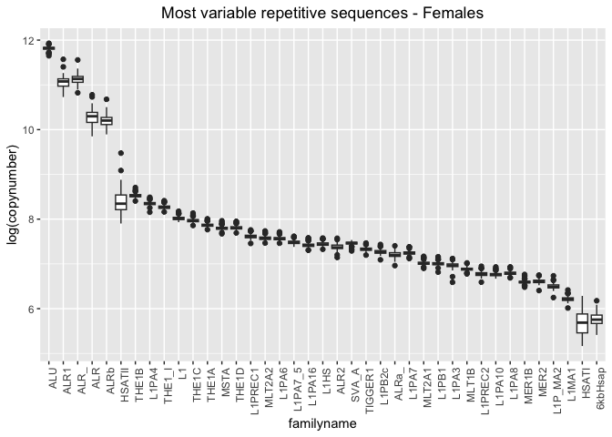
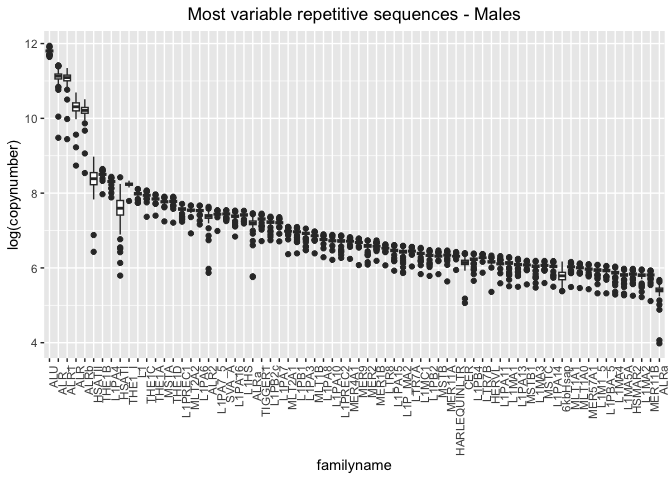
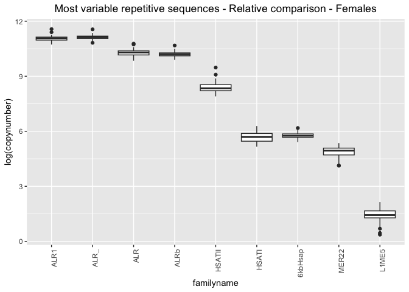
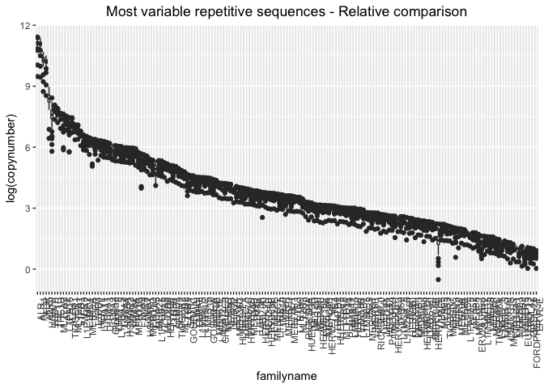

SGDP - Analyzing the TEs with the highest variance
================

``` r
library(tidyverse)
```

    ## ── Attaching packages ─────────────────────────────────────── tidyverse 1.3.2 ──
    ## ✔ ggplot2 3.4.0      ✔ purrr   0.3.4 
    ## ✔ tibble  3.1.8      ✔ dplyr   1.0.10
    ## ✔ tidyr   1.2.1      ✔ stringr 1.4.1 
    ## ✔ readr   2.1.2      ✔ forcats 0.5.2 
    ## ── Conflicts ────────────────────────────────────────── tidyverse_conflicts() ──
    ## ✖ dplyr::filter() masks stats::filter()
    ## ✖ dplyr::lag()    masks stats::lag()

``` r
library(ggpubr)

pcr_free <- read_tsv("/Volumes/Temp1/rpianezza/SGDP/ric-documentation/SGDP-no-PCR.tsv")
```

    ## Rows: 261 Columns: 1
    ## ── Column specification ────────────────────────────────────────────────────────
    ## Delimiter: "\t"
    ## chr (1): ID
    ## 
    ## ℹ Use `spec()` to retrieve the full column specification for this data.
    ## ℹ Specify the column types or set `show_col_types = FALSE` to quiet this message.

``` r
SGDP <- read_tsv("/Volumes/Temp2/rpianezza/SGDP/summary/USEME_SGDP_cutoff") %>% filter(biosample %in% pcr_free$ID)
```

    ## Rows: 470028 Columns: 10
    ## ── Column specification ────────────────────────────────────────────────────────
    ## Delimiter: "\t"
    ## chr (7): biosample, sex, pop, country, type, familyname, batch
    ## dbl (3): length, reads, copynumber
    ## 
    ## ℹ Use `spec()` to retrieve the full column specification for this data.
    ## ℹ Specify the column types or set `show_col_types = FALSE` to quiet this message.

## Absolute comparison

``` r
f_MMM <- filter(SGDP, type == "te", sex == "female") %>% group_by(familyname) %>% dplyr::summarise(min = min(copynumber), mean = mean(copynumber), max = max(copynumber))

m_MMM <- filter(SGDP, type == "te", sex == "male") %>% group_by(familyname) %>% dplyr::summarise(min = min(copynumber), mean = mean(copynumber), max = max(copynumber))
```

### Females

``` r
f_outliers_names <- dplyr::mutate(f_MMM, diff = max-min) %>% filter(diff>200 & diff<Inf)

f_outliers <- filter(SGDP, familyname %in% f_outliers_names$familyname, type == "te", sex == "female")
f_outliers <- f_outliers[order(f_outliers$copynumber,decreasing=T),]
f_outliers$familyname<-factor(f_outliers$familyname,levels=unique(f_outliers$familyname))

ggplot(f_outliers, aes(x=familyname, y=log(copynumber))) + geom_boxplot(notch=F) +
  theme(axis.text.x = element_text(angle = 90, hjust = 1)) +
  ggtitle("Most variable repetitive sequences - Females") + theme(plot.title = element_text(hjust = 0.5))
```

<!-- -->

### Males

``` r
m_outliers_names <- mutate(m_MMM, diff = max-min) %>% filter(diff>200 & diff<Inf)

m_outliers <- filter(SGDP, familyname %in% m_outliers_names$familyname, type == "te", sex == "male")
m_outliers <- m_outliers[order(m_outliers$copynumber,decreasing=T),]
m_outliers$familyname<-factor(m_outliers$familyname,levels=unique(m_outliers$familyname))

ggplot(m_outliers, aes(x=familyname, y=log(copynumber))) + geom_boxplot(notch=F) +
  theme(axis.text.x = element_text(angle = 90, hjust = 1))+
ggtitle("Most variable repetitive sequences - Males") + theme(plot.title = element_text(hjust = 0.5))
```

<!-- -->

## Relative comparison

### Females

``` r
f_outliers_names <- mutate(f_MMM, ratio = max/min) %>% filter(ratio>2 & ratio<Inf & max>2.5)

f_outliers <- filter(SGDP, familyname %in% f_outliers_names$familyname, type == "te", sex == "female")
f_outliers <- f_outliers[order(f_outliers$copynumber,decreasing=T),]
f_outliers$familyname<-factor(f_outliers$familyname,levels=unique(f_outliers$familyname))

ggplot(f_outliers, aes(x=familyname, y=log(copynumber))) + geom_boxplot(notch=F) +
  theme(axis.text.x = element_text(angle = 90, hjust = 1))+
  ggtitle("Most variable repetitive sequences - Relative comparison - Females") + theme(plot.title = element_text(hjust = 0.5))
```

<!-- -->

Now we have a dataset containing only the TEs with the highest
differences in abundance between minimum and maximum value.

### Males

``` r
m_outliers_names <- mutate(m_MMM, ratio = max/min) %>% filter(ratio>2 & ratio<Inf & max>2.5)

m_outliers <- filter(SGDP, familyname %in% m_outliers_names$familyname, type == "te", sex == "male")
m_outliers <- m_outliers[order(m_outliers$copynumber,decreasing=T),]
m_outliers$familyname<-factor(m_outliers$familyname,levels=unique(m_outliers$familyname))

ggplot(m_outliers, aes(x=familyname, y=log(copynumber))) + geom_boxplot(notch=F) +
  theme(axis.text.x = element_text(angle = 90, hjust = 1)) +
  ggtitle("Most variable repetitive sequences - Relative comparison") + theme(plot.title = element_text(hjust = 0.5))
```

<!-- -->
