SGDP - Geographic distribution by population for the most interesting
TEs
================

``` r
library(tidyverse)
```

    ## ── Attaching packages ─────────────────────────────────────── tidyverse 1.3.2 ──
    ## ✔ ggplot2 3.4.0      ✔ purrr   0.3.4 
    ## ✔ tibble  3.1.8      ✔ dplyr   1.0.10
    ## ✔ tidyr   1.2.1      ✔ stringr 1.4.1 
    ## ✔ readr   2.1.2      ✔ forcats 0.5.2 
    ## ── Conflicts ────────────────────────────────────────── tidyverse_conflicts() ──
    ## ✖ dplyr::filter() masks stats::filter()
    ## ✖ dplyr::lag()    masks stats::lag()

``` r
library(ggpubr)
library(forcats)

pcr_free <- read_tsv("/Volumes/Temp1/rpianezza/SGDP/ric-documentation/SGDP-no-PCR.tsv")
```

    ## Rows: 261 Columns: 1
    ## ── Column specification ────────────────────────────────────────────────────────
    ## Delimiter: "\t"
    ## chr (1): ID
    ## 
    ## ℹ Use `spec()` to retrieve the full column specification for this data.
    ## ℹ Specify the column types or set `show_col_types = FALSE` to quiet this message.

``` r
SGDP <- read_tsv("/Volumes/Temp2/rpianezza/SGDP/summary/USEME_SGDP_cutoff") %>% filter(biosample %in% pcr_free$ID)
```

    ## Rows: 470028 Columns: 10
    ## ── Column specification ────────────────────────────────────────────────────────
    ## Delimiter: "\t"
    ## chr (7): biosample, sex, pop, country, type, familyname, batch
    ## dbl (3): length, reads, copynumber
    ## 
    ## ℹ Use `spec()` to retrieve the full column specification for this data.
    ## ℹ Specify the column types or set `show_col_types = FALSE` to quiet this message.

# Geographical distribution of interesting TE by population

## Preparatory work

``` r
coordinates <- read_tsv("/Volumes/Temp1/rpianezza/SGDP/metadata/SGDP_metadata.tsv") %>% select(c(pop, latitude, longitude)) %>% distinct()
```

    ## Rows: 276 Columns: 7
    ## ── Column specification ────────────────────────────────────────────────────────
    ## Delimiter: "\t"
    ## chr (5): sample, biosample, sex, pop, country
    ## dbl (2): latitude, longitude
    ## 
    ## ℹ Use `spec()` to retrieve the full column specification for this data.
    ## ℹ Specify the column types or set `show_col_types = FALSE` to quiet this message.

``` r
TE <- filter(SGDP, type=='te')
```

``` r
by_pop <- group_by(TE, pop, country, familyname, sex) %>% dplyr::summarise(sd=sd(copynumber), copynumber = mean(copynumber), count=n())
```

    ## `summarise()` has grouped output by 'pop', 'country', 'familyname'. You can
    ## override using the `.groups` argument.

``` r
data <- inner_join(x = coordinates, y = by_pop, by = "pop")
data
```

    ## # A tibble: 194,832 × 9
    ##    pop       latitude longitude country      famil…¹ sex        sd copyn…² count
    ##    <chr>        <dbl>     <dbl> <chr>        <chr>   <chr>   <dbl>   <dbl> <int>
    ##  1 Abkhasian       43        41 West Eurasia 6kbHsap male  7.08e+0 3.53e+2     2
    ##  2 Abkhasian       43        41 West Eurasia ALINE   male  1.22e-2 1.40e-1     2
    ##  3 Abkhasian       43        41 West Eurasia ALR     male  1.86e+3 3.19e+4     2
    ##  4 Abkhasian       43        41 West Eurasia ALR_    male  2.19e+2 7.21e+4     2
    ##  5 Abkhasian       43        41 West Eurasia ALR1    male  1.75e+3 7.13e+4     2
    ##  6 Abkhasian       43        41 West Eurasia ALR2    male  6.37e+1 1.62e+3     2
    ##  7 Abkhasian       43        41 West Eurasia ALRa    male  5.15e+0 2.33e+2     2
    ##  8 Abkhasian       43        41 West Eurasia ALRa_   male  2.39e+1 1.40e+3     2
    ##  9 Abkhasian       43        41 West Eurasia ALRb    male  2.52e+3 2.99e+4     2
    ## 10 Abkhasian       43        41 West Eurasia ALU     male  1.79e+2 1.37e+5     2
    ## # … with 194,822 more rows, and abbreviated variable names ¹​familyname,
    ## #   ²​copynumber

We are now ready to analyze the geographic distribution of the most
interesting TE. I first create a function which I will use to plot each
TE family.

``` r
plot_map <- function(data, famname){
TE <- filter(data, familyname == famname)
world_map = map_data("world")

ggplot() +
  geom_map(
    data = world_map, map = world_map,
    aes(long, lat, map_id = region),
    color = "white", fill = "lightgray", size = 0) +
  geom_point(
    data = TE, aes(longitude, latitude, color = copynumber, size = count)
  ) + geom_errorbar() + theme(legend.position="top") + scale_colour_gradient(low = "green", high = "red") + theme(plot.title = element_text(hjust = 0.5)) +
  facet_wrap(~sex) + ggtitle(famname)}
```

## Details for every interesting TE

### LINEs

``` r
plot_map(data, "L1PB1")
```

    ## Warning: Using `size` aesthetic for lines was deprecated in ggplot2 3.4.0.
    ## ℹ Please use `linewidth` instead.

    ## Warning in geom_map(data = world_map, map = world_map, aes(long, lat, map_id =
    ## region), : Ignoring unknown aesthetics: x and y

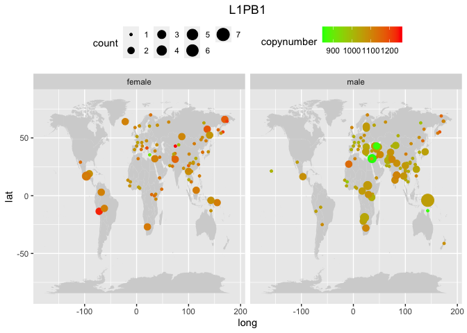<!-- -->

``` r
plot_map(data, "L1PA3")
```

    ## Warning in geom_map(data = world_map, map = world_map, aes(long, lat, map_id =
    ## region), : Ignoring unknown aesthetics: x and y

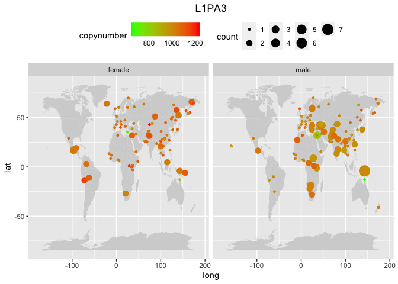<!-- -->

``` r
plot_map(data, "L1PA7_5")
```

    ## Warning in geom_map(data = world_map, map = world_map, aes(long, lat, map_id =
    ## region), : Ignoring unknown aesthetics: x and y

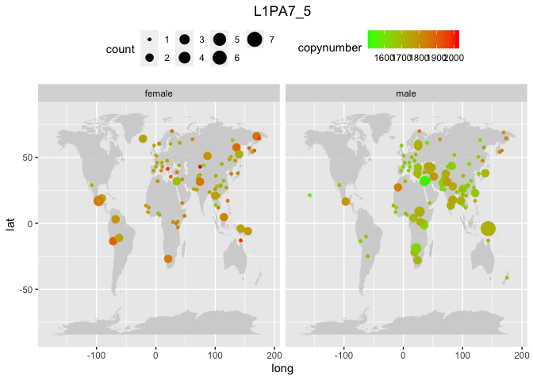<!-- -->

``` r
plot_map(data, "L1PA4")
```

    ## Warning in geom_map(data = world_map, map = world_map, aes(long, lat, map_id =
    ## region), : Ignoring unknown aesthetics: x and y

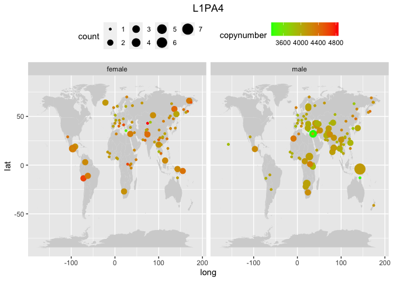<!-- -->

``` r
plot_map(data, "L1")
```

    ## Warning in geom_map(data = world_map, map = world_map, aes(long, lat, map_id =
    ## region), : Ignoring unknown aesthetics: x and y

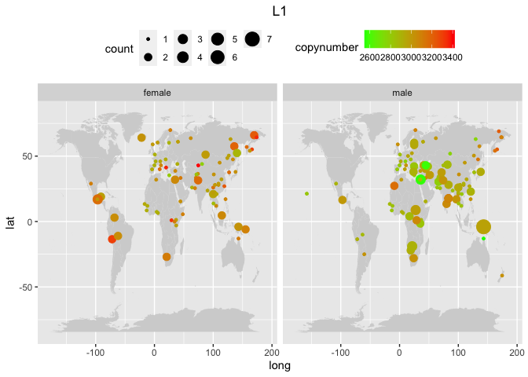<!-- -->

``` r
plot_map(data, "L1PREC1")
```

    ## Warning in geom_map(data = world_map, map = world_map, aes(long, lat, map_id =
    ## region), : Ignoring unknown aesthetics: x and y

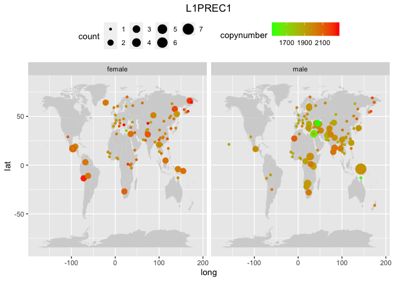<!-- -->

``` r
plot_map(data, "L1PA16")
```

    ## Warning in geom_map(data = world_map, map = world_map, aes(long, lat, map_id =
    ## region), : Ignoring unknown aesthetics: x and y

<!-- -->

``` r
plot_map(data, "L1PA6")
```

    ## Warning in geom_map(data = world_map, map = world_map, aes(long, lat, map_id =
    ## region), : Ignoring unknown aesthetics: x and y

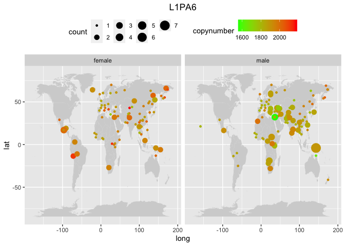<!-- -->

``` r
plot_map(data, "L1HS")
```

    ## Warning in geom_map(data = world_map, map = world_map, aes(long, lat, map_id =
    ## region), : Ignoring unknown aesthetics: x and y

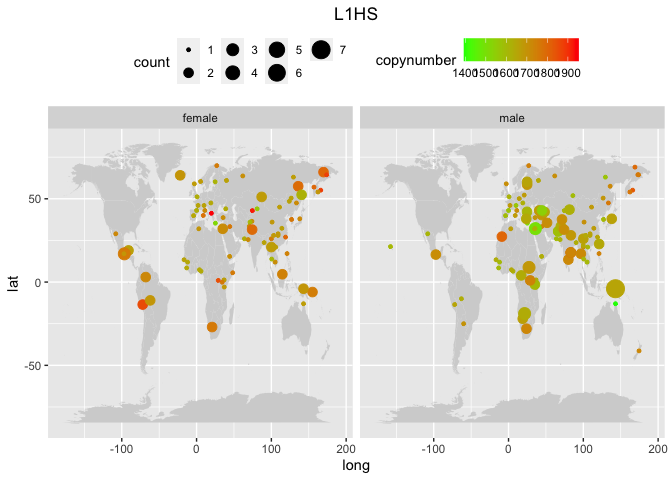<!-- -->

``` r
plot_map(data, "L1PA7")
```

    ## Warning in geom_map(data = world_map, map = world_map, aes(long, lat, map_id =
    ## region), : Ignoring unknown aesthetics: x and y

<!-- -->

``` r
#plot_map(data, "L1PB2c")
#plot_map(data, "L1PA10")
##plot_map(data, "L1PA8")
#plot_map(data, "L1PREC2")
#plot_map(data, "L1PA15")
#plot_map(data, "L1P_MA2")
#plot_map(data, "L1MC1")
#plot_map(data, "L1PB2")
#plot_map(data, "L1PB4")
```

### SINEs

``` r
plot_map(data, "ALU")
```

    ## Warning in geom_map(data = world_map, map = world_map, aes(long, lat, map_id =
    ## region), : Ignoring unknown aesthetics: x and y

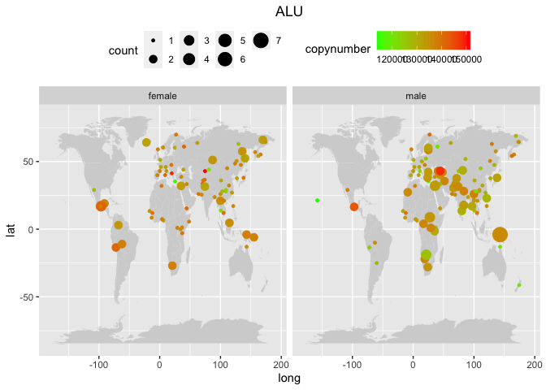<!-- -->

``` r
plot_map(data, "SVA_A")
```

    ## Warning in geom_map(data = world_map, map = world_map, aes(long, lat, map_id =
    ## region), : Ignoring unknown aesthetics: x and y

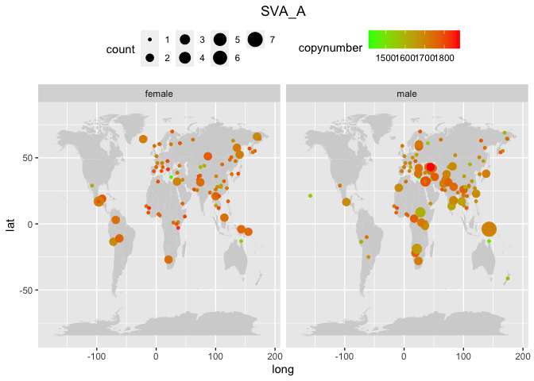<!-- -->

### DNA transposons

``` r
plot_map(data, "MER2")
```

    ## Warning in geom_map(data = world_map, map = world_map, aes(long, lat, map_id =
    ## region), : Ignoring unknown aesthetics: x and y

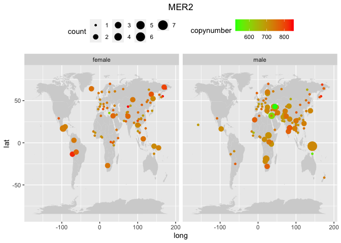<!-- -->

### Endogenous retroviruses

``` r
plot_map(data, "MLT2A1")
```

    ## Warning in geom_map(data = world_map, map = world_map, aes(long, lat, map_id =
    ## region), : Ignoring unknown aesthetics: x and y

<!-- -->

### Satellites

``` r
plot_map(data, "GSATII")
```

    ## Warning in geom_map(data = world_map, map = world_map, aes(long, lat, map_id =
    ## region), : Ignoring unknown aesthetics: x and y

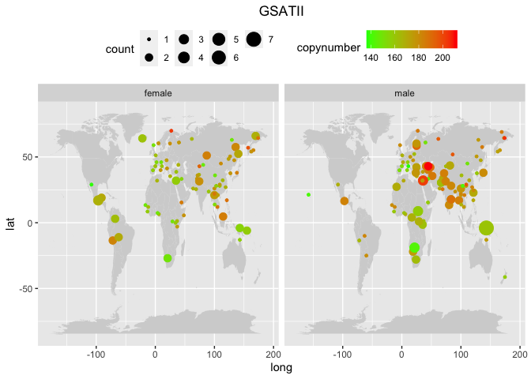<!-- -->

## Copynumber standard deviation by population

``` r
plot_cn_sd <- function(data, TE, ylimits){
  
m <- filter(data, sex=="male")
f <- filter(data, sex=="female")

m_singleTE <- filter(m, familyname==TE) %>% mutate(pop = fct_reorder(pop, copynumber))
m_singleTE$country <- factor(m_singleTE$country, levels = c("Africa", "America", "Central Asia and Siberia", "East Asia", "South Asia", "West Eurasia", "Oceania"))
m_plo <- ggplot(m_singleTE, aes(pop, copynumber, fill=country))+
  geom_bar(stat = "identity")+
  geom_errorbar(aes(ymin=copynumber-sd, ymax=copynumber+sd), alpha=0.5)+
  ggtitle("male") + ylab("Mean copynumber") + xlab("Population") +
  theme(axis.text.x = element_text(angle = 90, hjust = 1, size=4), axis.title.y = element_blank()) + coord_cartesian(ylim=ylimits) + scale_color_manual(values=c("red", "d", "#56B4E9")) +
  theme(plot.title = element_text(hjust = 0.5))

f_singleTE <- filter(f, familyname==TE) %>% mutate(pop = fct_reorder(pop, copynumber))
f_singleTE$country <- factor(f_singleTE$country, levels = c("Africa", "America", "Central Asia and Siberia", "East Asia", "South Asia", "West Eurasia", "Oceania"))
f_plo <- ggplot(f_singleTE, aes(pop, copynumber, fill=country))+
  geom_bar(stat = "identity")+
  geom_errorbar(aes(ymin=copynumber-sd, ymax=copynumber+sd), alpha=0.5)+
  ggtitle("female") + ylab("Mean copynumber") + xlab("Population") +
  theme(axis.text.x = element_text(angle = 90, hjust = 1, size=4)) + coord_cartesian(ylim=ylimits) +
  theme(plot.title = element_text(hjust = 0.5))

f_plot <- f_plo + scale_color_manual(values=c("F8766", "C49A00", "A58AFF", "00C094", "FB61D7", "53B400", "00B6"))
m_plot <- m_plo + scale_color_manual(values=c("F8766", "C49A00", "A58AFF", "00C094", "FB61D7", "53B400", "00B6"))

figure <- ggarrange(f_plot, m_plot, common.legend = TRUE)
(figure_final <- annotate_figure(figure, top=text_grob(TE)))
}

plot_cn_sd(data, "L1PA16", c(1400, 1900))
```

    ## Scale for colour is already present.
    ## Adding another scale for colour, which will replace the existing scale.

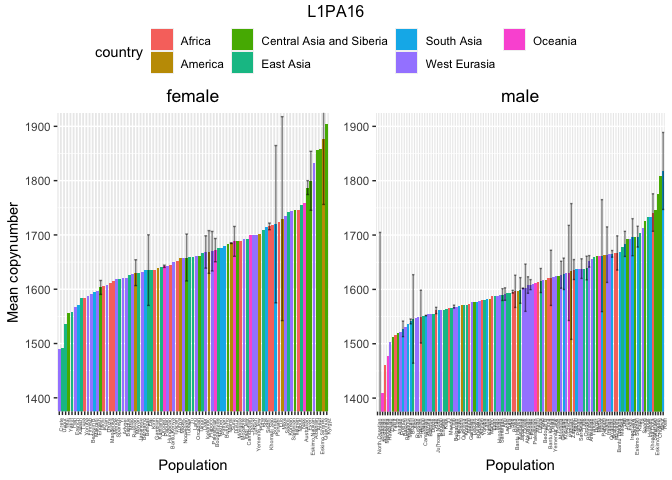<!-- -->

``` r
plot_cn_sd(data, "L1PA3", c(670, 1300))
```

    ## Scale for colour is already present.
    ## Adding another scale for colour, which will replace the existing scale.

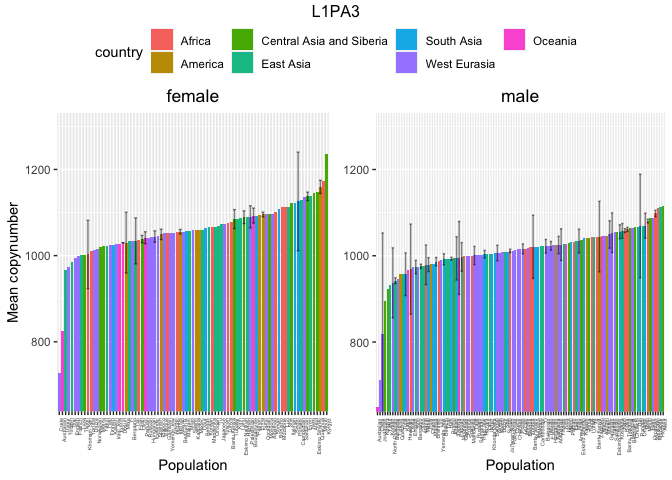<!-- -->

``` r
plot_cn_sd(data, "L1PB1", c(950, 1300))
```

    ## Scale for colour is already present.
    ## Adding another scale for colour, which will replace the existing scale.

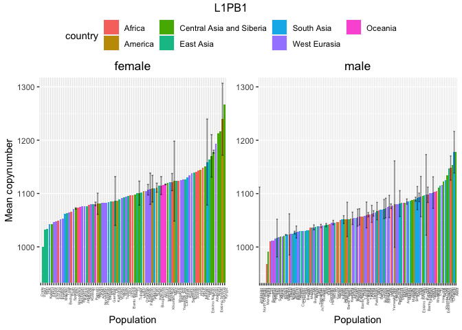<!-- -->

``` r
plot_cn_sd(data, "L1PA7_5", c(1500, 2100))
```

    ## Scale for colour is already present.
    ## Adding another scale for colour, which will replace the existing scale.

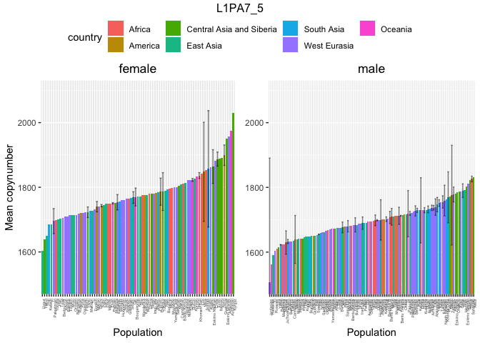<!-- -->

``` r
plot_cn_sd(data, "ALU", c(120000, 160000))
```

    ## Scale for colour is already present.
    ## Adding another scale for colour, which will replace the existing scale.

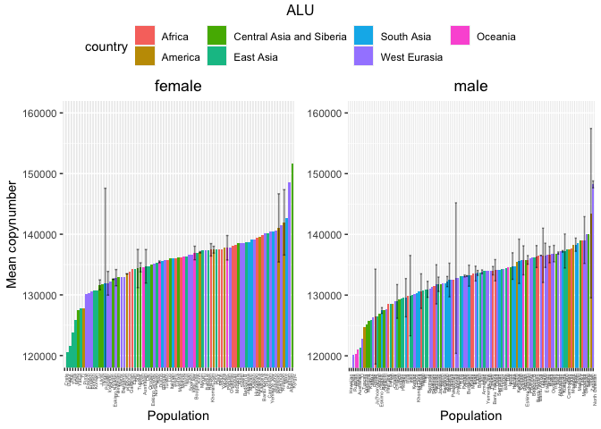<!-- -->

``` r
plot_cn_sd(data, "SVA_A", c(1600, 1900))
```

    ## Scale for colour is already present.
    ## Adding another scale for colour, which will replace the existing scale.

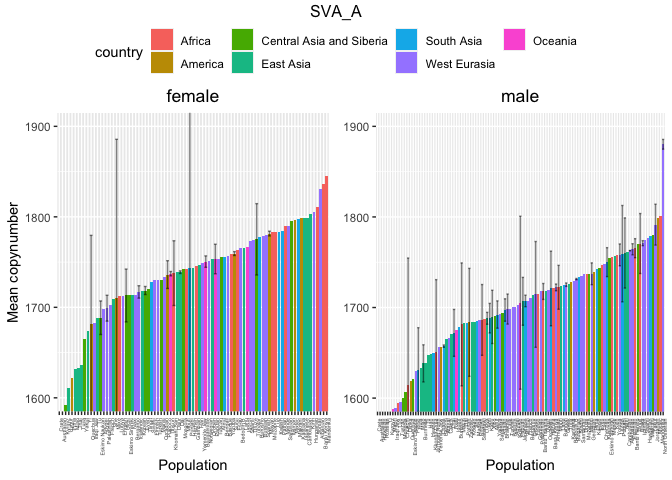<!-- -->

``` r
plot_cn_sd(data, "MER2", c(500, 875))
```

    ## Scale for colour is already present.
    ## Adding another scale for colour, which will replace the existing scale.

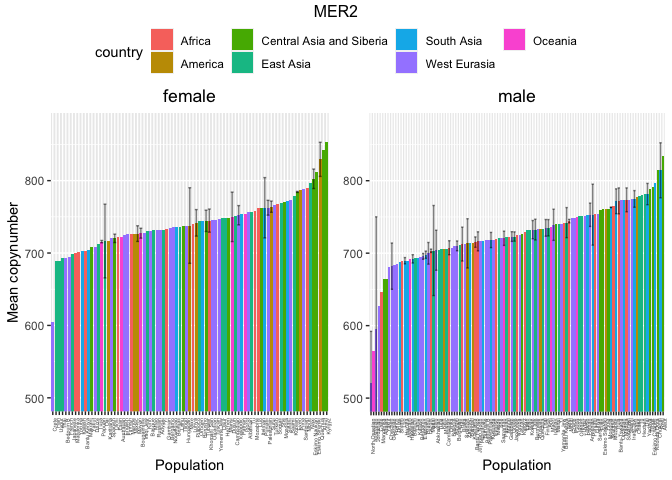<!-- -->

``` r
plot_cn_sd(data, "MLT2A1", c(900, 1300))
```

    ## Scale for colour is already present.
    ## Adding another scale for colour, which will replace the existing scale.

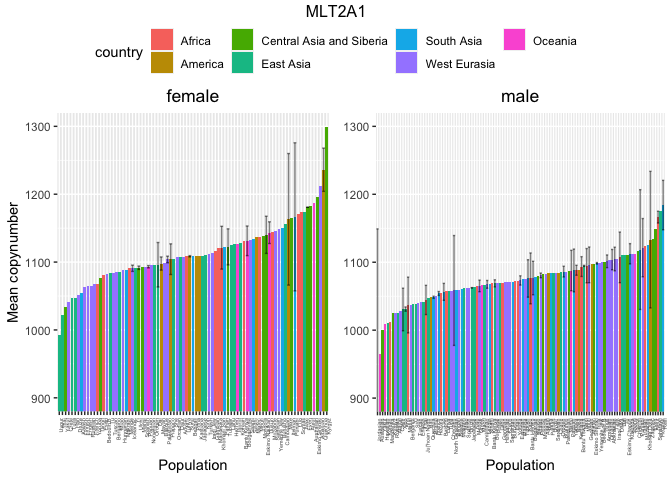<!-- -->

``` r
plot_cn_sd(data, "L2", c(6, 10))
```

    ## Scale for colour is already present.
    ## Adding another scale for colour, which will replace the existing scale.

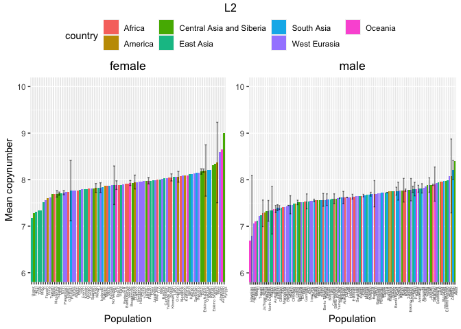<!-- -->
