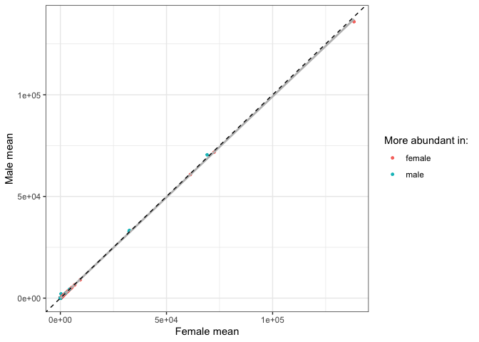
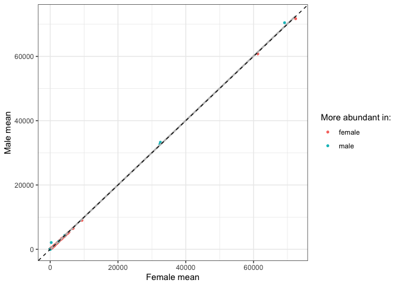
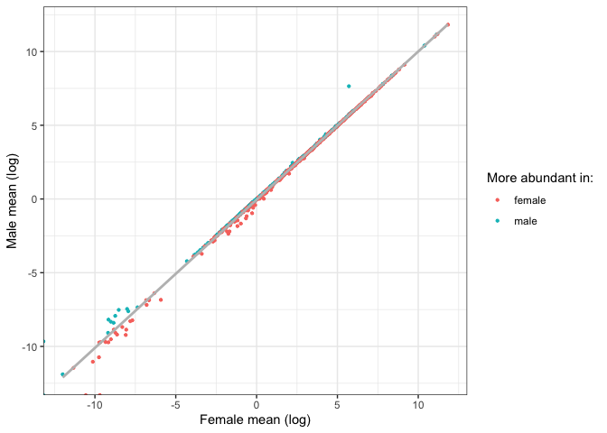
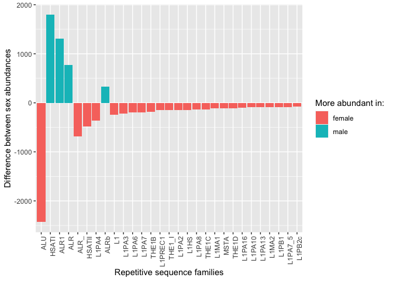
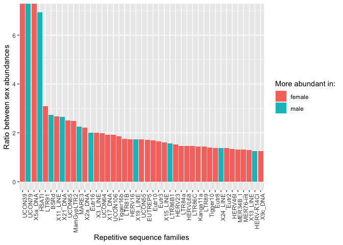
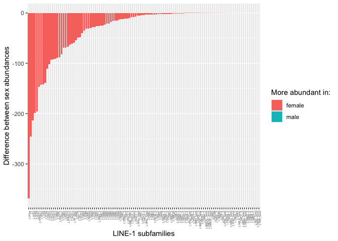
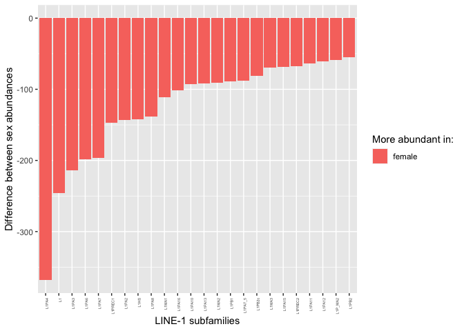
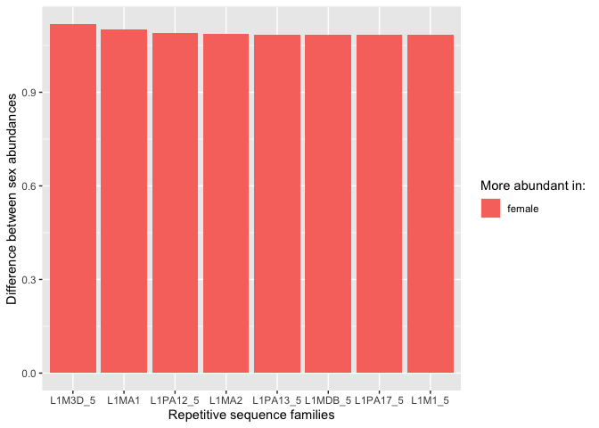

Comparing the mean TE copy numbers in males and females
================

In this script I re-wrote Florian’s script 5 and added some new
analysis. The topic is the comparison of TE abundances between the two
sexes.

``` r
library(tidyverse)
```

    ## ── Attaching packages ─────────────────────────────────────── tidyverse 1.3.2 ──
    ## ✔ ggplot2 3.4.0      ✔ purrr   0.3.4 
    ## ✔ tibble  3.1.8      ✔ dplyr   1.0.10
    ## ✔ tidyr   1.2.1      ✔ stringr 1.4.1 
    ## ✔ readr   2.1.2      ✔ forcats 0.5.2 
    ## ── Conflicts ────────────────────────────────────────── tidyverse_conflicts() ──
    ## ✖ dplyr::filter() masks stats::filter()
    ## ✖ dplyr::lag()    masks stats::lag()

``` r
library(ggpubr)

pcr_free <- read_tsv("/Volumes/Temp1/rpianezza/SGDP/ric-documentation/SGDP-no-PCR.tsv")
```

    ## Rows: 261 Columns: 1
    ## ── Column specification ────────────────────────────────────────────────────────
    ## Delimiter: "\t"
    ## chr (1): ID
    ## 
    ## ℹ Use `spec()` to retrieve the full column specification for this data.
    ## ℹ Specify the column types or set `show_col_types = FALSE` to quiet this message.

``` r
SGDP <- read_tsv("/Volumes/Temp2/rpianezza/SGDP/summary/USEME_SGDP_cutoff_mq0") %>% filter(biosample %in% pcr_free$ID)
```

    ## Rows: 470028 Columns: 10
    ## ── Column specification ────────────────────────────────────────────────────────
    ## Delimiter: "\t"
    ## chr (7): biosample, sex, pop, country, type, familyname, batch
    ## dbl (3): length, reads, copynumber
    ## 
    ## ℹ Use `spec()` to retrieve the full column specification for this data.
    ## ℹ Specify the column types or set `show_col_types = FALSE` to quiet this message.

## Calculating mean abundance for males and females

``` r
data <- filter(SGDP, type=="te") %>% group_by(familyname, sex) %>% dplyr::summarise(sd=sd(copynumber), mean=mean(copynumber))
```

    ## `summarise()` has grouped output by 'familyname'. You can override using the
    ## `.groups` argument.

``` r
f<-filter(data, sex=="female") %>% dplyr::rename(f_mean = mean, f_sd = sd)
m<-filter(data, sex=="male") %>% dplyr::rename(m_mean = mean, m_sd = sd)

(final_data <- inner_join(f, m, by = "familyname") %>% select(familyname, f_mean, m_mean, f_sd, m_sd) %>% mutate(f_mean_log=log(f_mean), m_mean_log=log(m_mean), diff=m_mean-f_mean, abs_diff=abs(diff), ratio=case_when(diff>=0 ~ m_mean/f_mean, diff<0 ~ f_mean/m_mean), more_in=case_when(diff>=0 ~ "male", diff<0 ~ "female")) %>% arrange(desc(ratio)) %>% mutate(familyname=fct_reorder(familyname,ratio)))
```

    ## # A tibble: 984 × 11
    ## # Groups:   familyname [984]
    ##    familyname    f_mean  m_mean    f_sd    m_sd f_mea…¹ m_mea…²     diff abs_d…³
    ##    <fct>          <dbl>   <dbl>   <dbl>   <dbl>   <dbl>   <dbl>    <dbl>   <dbl>
    ##  1 UCON39       6.13e-5 0       6.22e-4 0         -9.70 -Inf    -6.13e-5 6.13e-5
    ##  2 UCON79       0       6.41e-5 0       8.06e-4 -Inf      -9.65  6.41e-5 6.41e-5
    ##  3 X5a_DNA      2.58e-5 0       2.62e-4 0        -10.6  -Inf    -2.58e-5 2.58e-5
    ##  4 HSATI        3.03e+2 2.10e+3 7.97e+1 7.28e+2    5.71    7.65  1.80e+3 1.80e+3
    ##  5 LTR91        3.06e-4 9.85e-5 1.15e-3 6.26e-4   -8.09   -9.23 -2.07e-4 2.07e-4
    ##  6 BSRd         1.98e-4 5.41e-4 1.17e-3 2.10e-3   -8.53   -7.52  3.43e-4 3.43e-4
    ##  7 X11_LINE     5.82e-5 2.18e-5 4.19e-4 2.73e-4   -9.75  -10.7  -3.65e-5 3.65e-5
    ##  8 X21_DNA      1.05e-4 2.79e-4 1.06e-3 1.47e-3   -9.16   -8.18  1.74e-4 1.74e-4
    ##  9 UCON65       2.68e-3 1.07e-3 1.56e-2 3.14e-3   -5.92   -6.84 -1.61e-3 1.61e-3
    ## 10 MamGypLTR2   3.99e-5 1.61e-5 2.36e-4 1.09e-4  -10.1   -11.0  -2.38e-5 2.38e-5
    ## # … with 974 more rows, 2 more variables: ratio <dbl>, more_in <chr>, and
    ## #   abbreviated variable names ¹​f_mean_log, ²​m_mean_log, ³​abs_diff

## Comparing mean abundance between males and females

``` r
(all <- ggplot(final_data, aes(x=f_mean, y=m_mean, color=more_in))+ labs(color = "More abundant in:") +
  geom_point(size=1)+
  geom_smooth(method="lm",color="grey", se=F)+ 
  ylab("Male mean")+ xlab("Female mean")+geom_abline(slope=1,linetype='dashed')+theme_bw())
```

    ## `geom_smooth()` using formula = 'y ~ x'

<!-- -->

``` r
noALU <- final_data_noALU <- filter(final_data, !(familyname=="ALU"))#, !(familyname=="ALR1"), !(familyname=="HSATI"))
(ggplot(final_data_noALU, aes(x=f_mean, y=m_mean, color=more_in))+ labs(color = "More abundant in:") +
  geom_point(size=1)+
  geom_smooth(method="lm",color="grey", se=F)+ ylab("Male mean")+ xlab("Female mean")+geom_abline(slope=1,linetype='dashed')+theme_bw())
```

    ## `geom_smooth()` using formula = 'y ~ x'

<!-- -->

``` r
(log <- ggplot(final_data, aes(f_mean_log, m_mean_log, color=more_in))+ labs(color = "More abundant in:") +
  geom_point(size=0.8)+
  geom_smooth(method="lm",color="grey",se=F)+theme_bw()+ ylab("Male mean (log)")+ xlab("Female mean (log)"))
```

    ## `geom_smooth()` using formula = 'y ~ x'

    ## Warning: Removed 4 rows containing non-finite values (`stat_smooth()`).

<!-- -->

## Relative and absolute mean differences between the sexes

### Absolute differences

``` r
abs_subset <- filter(final_data, abs_diff>75) # This number is arbitrary, feel free to look at more/less TEs in the plot

(abs <- ggplot(abs_subset, aes(reorder(familyname, -abs(diff)), diff, fill=more_in)) + labs(fill = "More abundant in:") +
  geom_bar(stat="identity") + ylab("Difference between sex abundances") + xlab("Repetitive sequence families") +
  theme(axis.text.x = element_text(angle = 90, hjust = 1)))
```

<!-- -->

### Relative differences

``` r
rel_all <- ggplot(final_data, aes(reorder(familyname, -ratio), ratio, fill=more_in)) + labs(fill = "More abundant in:")+geom_bar(stat="identity") + ylab("Ratio between sex abundances") + xlab("Repetitive sequence families") + theme(axis.text.x=element_blank())

rel_subset<- filter(final_data, ratio>1.25) # This number is arbitrary, feel free to look at more/less TEs in the plot

(rel <- ggplot(rel_subset, aes(reorder(familyname, -ratio), ratio, fill=more_in)) + labs(fill = "More abundant in:") +
  geom_bar(stat="identity") + ylab("Ratio between sex abundances") + xlab("Repetitive sequence families") +
  theme(axis.text.x = element_text(angle = 90, hjust = 1)))
```

<!-- -->

## L1 family differences between the two sexes

``` r
L1<-final_data %>% filter(str_detect(familyname, "^L1"))
(L1plot <- ggplot(L1, aes(reorder(familyname, -abs(diff)), diff, fill=more_in)) + labs(fill = "More abundant in:") +
  geom_bar(stat="identity") + ylab("Difference between sex abundances") + xlab("LINE-1 subfamilies") +
  theme(axis.text.x = element_text(angle = 90, hjust = 1, size=4)))
```

<!-- -->

``` r
L1_50<-final_data %>% filter(str_detect(familyname, "^L1"), abs_diff>50)
(L1_50plot <- ggplot(L1_50, aes(reorder(familyname, -abs(diff)), diff, fill=more_in)) + labs(fill = "More abundant in:") +
  geom_bar(stat="identity") + ylab("Difference between sex abundances") + xlab("LINE-1 subfamilies") +
  theme(axis.text.x = element_text(angle = 90, hjust = 1, size=4)))
```

<!-- -->

``` r
(L1_male <- filter(L1, more_in == "male"))
```

    ## # A tibble: 1 × 11
    ## # Groups:   familyname [1]
    ##   familyname f_mean m_mean   f_sd   m_sd f_mean_…¹ m_mea…²    diff abs_d…³ ratio
    ##   <fct>       <dbl>  <dbl>  <dbl>  <dbl>     <dbl>   <dbl>   <dbl>   <dbl> <dbl>
    ## 1 L1M6B_5end  0.132  0.134 0.0250 0.0248     -2.03   -2.01 0.00234 0.00234  1.02
    ## # … with 1 more variable: more_in <chr>, and abbreviated variable names
    ## #   ¹​f_mean_log, ²​m_mean_log, ³​abs_diff

``` r
nrow(L1_male)
```

    ## [1] 1

``` r
nrow(L1)
```

    ## [1] 113

``` r
L1_rel <- filter(L1, ratio>1.08)

ggplot(L1_rel, aes(reorder(familyname, -abs(ratio)), ratio, fill=more_in)) + labs(fill = "More abundant in:") +
  geom_bar(stat="identity") + ylab("Difference between sex abundances") + xlab("Repetitive sequence families")
```

<!-- -->
