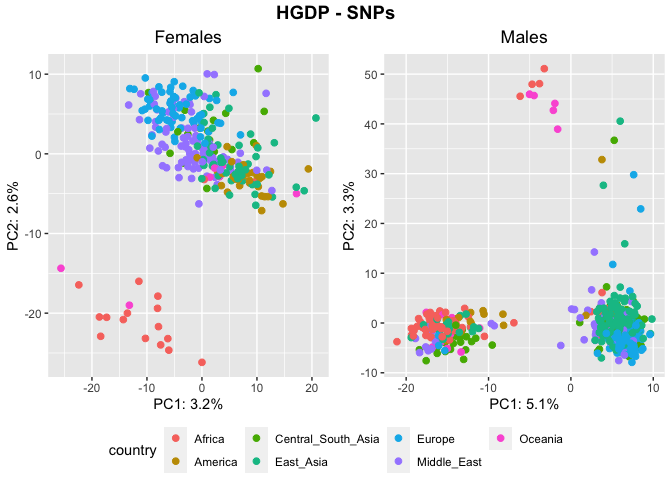
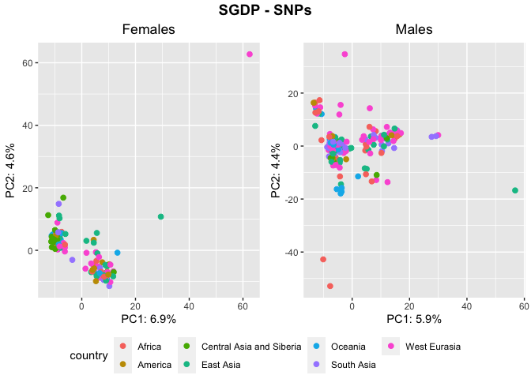
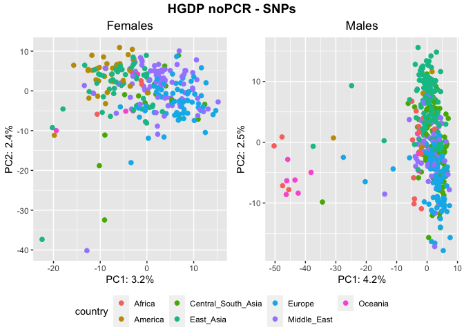
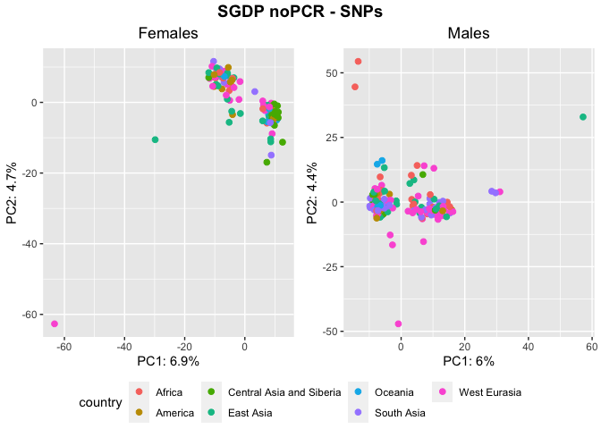
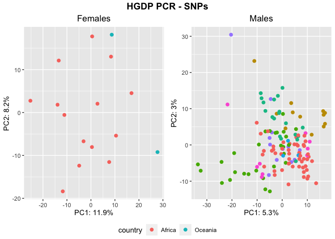

SNPs - PCRfree vs PCR
================

In this document I would like to summarize the analysis that I have done
on repetitive sequences SNPs in the HGDP and in the SGDP. The goal is to
better organize and compare the analysis, while using a unique R code
for all the plots to avoid errors.

## Prepare the environment

``` r
library(tidyverse)
```

    ## ── Attaching packages ─────────────────────────────────────── tidyverse 1.3.2 ──
    ## ✔ ggplot2 3.4.0      ✔ purrr   0.3.4 
    ## ✔ tibble  3.1.8      ✔ dplyr   1.0.10
    ## ✔ tidyr   1.2.1      ✔ stringr 1.4.1 
    ## ✔ readr   2.1.2      ✔ forcats 0.5.2 
    ## ── Conflicts ────────────────────────────────────────── tidyverse_conflicts() ──
    ## ✖ dplyr::filter() masks stats::filter()
    ## ✖ dplyr::lag()    masks stats::lag()

``` r
library(ggpubr)
```

## Read the summary files

Here we create 6 R objects containing the summary files (sample names
and metadata) for:

- **HGDP**: all the HGDP samples
- **SGDP**: all the SGDP samples
- **HGDP_pcr_free**: the pcr-free HGDP samples
- **SGDP_pcr_free**: the pcr-free SGDP samples
- **HGDP_pcr**: the pcr HGDP samples
- **SGDP_pcr**: the pcr SGDP samples

``` r
HGDP<-read_delim("/Volumes/Temp1/rpianezza/TE/summary-HGDP/USEME_HGDP_complete_reflib6.2_mq10_batchinfo_cutoff0.01.txt")
```

    ## Rows: 1394352 Columns: 10
    ## ── Column specification ────────────────────────────────────────────────────────
    ## Delimiter: ","
    ## chr (7): ID, Pop, sex, Country, type, familyname, batch
    ## dbl (3): length, reads, copynumber
    ## 
    ## ℹ Use `spec()` to retrieve the full column specification for this data.
    ## ℹ Specify the column types or set `show_col_types = FALSE` to quiet this message.

``` r
names(HGDP)<-c("ID","pop","sex","country","type","familyname","length","reads","copynumber","batch")

SGDP <- read_tsv("/Volumes/Temp2/rpianezza/SGDP/summary/USEME_SGDP_cutoff") %>% dplyr::rename(ID=biosample)
```

    ## Rows: 470028 Columns: 10
    ## ── Column specification ────────────────────────────────────────────────────────
    ## Delimiter: "\t"
    ## chr (7): biosample, sex, pop, country, type, familyname, batch
    ## dbl (3): length, reads, copynumber
    ## 
    ## ℹ Use `spec()` to retrieve the full column specification for this data.
    ## ℹ Specify the column types or set `show_col_types = FALSE` to quiet this message.

``` r
HGDP_pcr_free_samples <- read_tsv("/Volumes/Temp1/rpianezza/investigation/HGDP-no-PCR/HGDP-only-pcr-free-samples.tsv", col_names = "ID")
```

    ## Rows: 676 Columns: 1
    ## ── Column specification ────────────────────────────────────────────────────────
    ## Delimiter: "\t"
    ## chr (1): ID
    ## 
    ## ℹ Use `spec()` to retrieve the full column specification for this data.
    ## ℹ Specify the column types or set `show_col_types = FALSE` to quiet this message.

``` r
HGDP_pcr_free <- HGDP %>% filter(ID %in% HGDP_pcr_free_samples$ID)
HGDP_pcr <- HGDP %>% filter(!(ID %in% HGDP_pcr_free_samples$ID))

SGDP_pcr_free_samples <- read_tsv("/Volumes/Temp1/rpianezza/SGDP/ric-documentation/SGDP-no-PCR.tsv")
```

    ## Rows: 261 Columns: 1
    ## ── Column specification ────────────────────────────────────────────────────────
    ## Delimiter: "\t"
    ## chr (1): ID
    ## 
    ## ℹ Use `spec()` to retrieve the full column specification for this data.
    ## ℹ Specify the column types or set `show_col_types = FALSE` to quiet this message.

``` r
SGDP_pcr_free <- SGDP %>% filter(ID %in% SGDP_pcr_free_samples$ID)
SGDP_pcr <- SGDP %>% filter(!(ID %in% SGDP_pcr_free_samples$ID))
```

## Read the SNPs matrixes

The SNPs matrixes are created using the script
**frequency_matrix_v2.py** with arguments **–max_freq 0.8 –min_cov 5000
–transv n**. The last argument make the script only considering SNPs
which do not create transversions, to avoid GC-bias (only A-T or G-C
SNPs are retained).

``` r
HGDP_notrasnv = "/Volumes/Temp1/rpianezza/SNPs-all-analysis/matrixes/HGDP.notransv.08.5000.matrix_processed"
SGDP_notrasnv = "/Volumes/Temp1/rpianezza/SNPs-all-analysis/matrixes/SGDP.notransv.08.5000.matrix_processed"
```

## Create the function for PCA plotting

``` r
PCA <- function(freq_matrix, metadata, titlee){

matrix <- read_csv(freq_matrix)
  
f_metadata <- metadata %>% filter(sex=="female") %>% select(ID, sex, country, pop) %>% distinct()
m_metadata <- metadata %>% filter(sex=="male") %>% select(ID, sex, country, pop) %>% distinct()
males_matrix <- inner_join(m_metadata, matrix, by="ID")
females_matrix <- inner_join(f_metadata, matrix, by="ID")

f_pca_data <- females_matrix %>%  select_if(~ !all(. == .[1]))
m_pca_data <- males_matrix %>%  select_if(~ !all(. == .[1]))
f_pca_result <- prcomp(f_pca_data[, -c(1:3)], center = TRUE, scale = TRUE)
m_pca_result <- prcomp(m_pca_data[, -c(1:3)], center = TRUE, scale = TRUE)
      
f_var_explained <- f_pca_result$sdev^2/sum(f_pca_result$sdev^2)
m_var_explained <- m_pca_result$sdev^2/sum(m_pca_result$sdev^2)
      
f <- ggplot(data.frame(f_pca_result$x, country=females_matrix$country), aes(x=PC1,y=PC2, color=country)) + geom_point(size=2) + labs(x=paste0("PC1: ",round(f_var_explained[1]*100,1),"%"), y=paste0("PC2: ",round(f_var_explained[2]*100,1),"%")) + ggtitle("Females") + theme(plot.title = element_text(hjust = 0.5))
   
m <- ggplot(data.frame(m_pca_result$x, country=males_matrix$country), aes(x=PC1,y=PC2, color=country)) + geom_point(size=2) + labs(x=paste0("PC1: ",round(m_var_explained[1]*100,1),"%"), y=paste0("PC2: ",round(m_var_explained[2]*100,1),"%")) + ggtitle("Males") + theme(plot.title = element_text(hjust = 0.5)) 
     
plot <- ggarrange(f, m, ncol = 2, nrow = 1, common.legend = TRUE, legend = "bottom", align = "hv", font.label = list(size = 10, color = "black", face = "bold", family = NULL, position = "top"))
    
annotate_figure(plot, top = text_grob(titlee, face = "bold", size = 14))
}
```

``` r
PCA(HGDP_notrasnv, HGDP, "HGDP - SNPs")
```

    ## Rows: 828 Columns: 1993
    ## ── Column specification ────────────────────────────────────────────────────────
    ## Delimiter: ","
    ## chr    (1): ID
    ## dbl (1992): HERV9_te_2585A, HERV9_te_2585T, HERV9_te_2585C, HERV9_te_2585G, ...
    ## 
    ## ℹ Use `spec()` to retrieve the full column specification for this data.
    ## ℹ Specify the column types or set `show_col_types = FALSE` to quiet this message.

<!-- -->

``` r
PCA(SGDP_notrasnv, SGDP, "SGDP - SNPs")
```

    ## Rows: 276 Columns: 1949
    ## ── Column specification ────────────────────────────────────────────────────────
    ## Delimiter: ","
    ## chr    (1): ID
    ## dbl (1948): HERV9_te_2585A, HERV9_te_2585T, HERV9_te_2585C, HERV9_te_2585G, ...
    ## 
    ## ℹ Use `spec()` to retrieve the full column specification for this data.
    ## ℹ Specify the column types or set `show_col_types = FALSE` to quiet this message.

<!-- -->

``` r
PCA(HGDP_notrasnv, HGDP_pcr_free, "HGDP noPCR - SNPs")
```

    ## Rows: 828 Columns: 1993
    ## ── Column specification ────────────────────────────────────────────────────────
    ## Delimiter: ","
    ## chr    (1): ID
    ## dbl (1992): HERV9_te_2585A, HERV9_te_2585T, HERV9_te_2585C, HERV9_te_2585G, ...
    ## 
    ## ℹ Use `spec()` to retrieve the full column specification for this data.
    ## ℹ Specify the column types or set `show_col_types = FALSE` to quiet this message.

<!-- -->

``` r
PCA(SGDP_notrasnv, SGDP_pcr_free, "SGDP noPCR - SNPs")
```

    ## Rows: 276 Columns: 1949
    ## ── Column specification ────────────────────────────────────────────────────────
    ## Delimiter: ","
    ## chr    (1): ID
    ## dbl (1948): HERV9_te_2585A, HERV9_te_2585T, HERV9_te_2585C, HERV9_te_2585G, ...
    ## 
    ## ℹ Use `spec()` to retrieve the full column specification for this data.
    ## ℹ Specify the column types or set `show_col_types = FALSE` to quiet this message.

<!-- -->

``` r
PCA(HGDP_notrasnv, HGDP_pcr, "HGDP PCR - SNPs")
```

    ## Rows: 828 Columns: 1993
    ## ── Column specification ────────────────────────────────────────────────────────
    ## Delimiter: ","
    ## chr    (1): ID
    ## dbl (1992): HERV9_te_2585A, HERV9_te_2585T, HERV9_te_2585C, HERV9_te_2585G, ...
    ## 
    ## ℹ Use `spec()` to retrieve the full column specification for this data.
    ## ℹ Specify the column types or set `show_col_types = FALSE` to quiet this message.

<!-- -->
