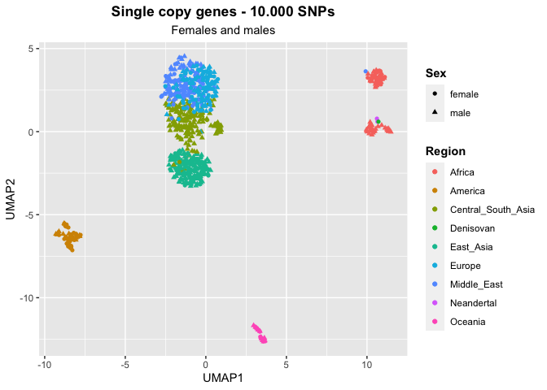
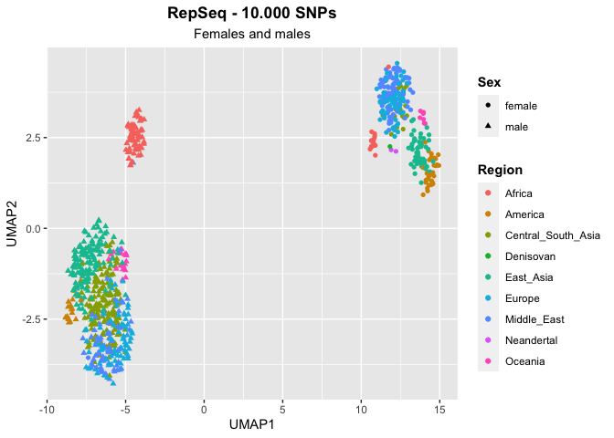
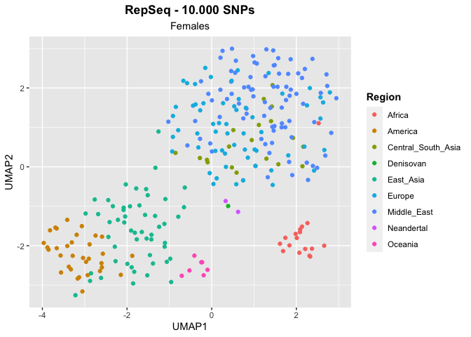

Archaic humans - SNPs found in the HGDP
================

In this script we create UMAPs with SNPs data from the HGDP and the 3
high-coverage archaic genomes (Vindija Neandertal, Altai Neandertal,
Denisovan).

The script *archaic-introgression.py* takes as input the HGDP SNPs
matrix and an archaic sync file. I ran it 3 times, one for each archaic
genome.

NAs are non-imputed from the script. In this code I convert them to -9
to treat them as a complete different type of data. I don’t want to
remove the NAs to not loose lot of potentially useful information. Thus,
also the SNPs matrix for the HGDP used in this script was created
running the *frequency-matrix* script with the option to avoid
imputation to keep the NAs in the final output.

The script *archaic-introgression.py* filter the sync file keeping only
the positions and familyname that are present in the SNPs matrix. In
other words, we select in the archaic genome the variants that were
selected across the HGDP samples.

We expect the archaic genomes to cluster close to the Africans, because
of shared ancestral variants.

## Setting the environment

``` r
library(tidyverse)
```

    ## ── Attaching core tidyverse packages ──────────────────────── tidyverse 2.0.0 ──
    ## ✔ dplyr     1.1.0     ✔ readr     2.1.4
    ## ✔ forcats   1.0.0     ✔ stringr   1.5.0
    ## ✔ ggplot2   3.4.1     ✔ tibble    3.2.0
    ## ✔ lubridate 1.9.2     ✔ tidyr     1.3.0
    ## ✔ purrr     1.0.1     
    ## ── Conflicts ────────────────────────────────────────── tidyverse_conflicts() ──
    ## ✖ dplyr::filter() masks stats::filter()
    ## ✖ dplyr::lag()    masks stats::lag()
    ## ℹ Use the ]8;;http://conflicted.r-lib.org/conflicted package]8;; to force all conflicts to become errors

``` r
library(umap )
```

## Create metadata file

``` r
HGDP <- read_delim("/Volumes/Temp1/rpianezza/0.old/summary-HGDP/HGDP_cutoff_classified.tsv") %>% select(ID, sex, country, pop) %>% distinct()
```

    ## Rows: 1394352 Columns: 12
    ## ── Column specification ────────────────────────────────────────────────────────
    ## Delimiter: "\t"
    ## chr (9): ID, pop, sex, country, type, familyname, batch, superfamily, shared...
    ## dbl (3): length, reads, copynumber
    ## 
    ## ℹ Use `spec()` to retrieve the full column specification for this data.
    ## ℹ Specify the column types or set `show_col_types = FALSE` to quiet this message.

``` r
archaic <- tibble(
  ID = c("Vindija", "Altai", "Denisovan"),
  pop = c("Vindija", "Altai", "Denisova"),
  country = c("Neandertal", "Neandertal", "Denisovan"),
  sex = c("female", "female", "female")
)

HGDP_arch <- bind_rows(HGDP, archaic)
```

# Functions for UMAP

This function creates a unique UMAP plot for females and males together,
which are expected to cluster separately in the repetitive sequences
UMAP but together in the SCGs UMAP.

``` r
UMAP <- function(freq_matrix, metadata, titlee){

matrix <- inner_join(metadata, freq_matrix, by="ID")
metadata <- metadata %>% filter(ID %in% matrix$ID)

pca_data <- matrix %>% select_if(~ !all(. == .[1]))
matrix <- as.matrix(pca_data[, -c(1,2,3,4)])
matrix[is.na(matrix)] <- -9
matrix <- matrix[, colSums(is.na(matrix)) == 0]

umap_result <- umap(matrix, n_neighbors = 15, min_dist = 0.3, dimnames = list(c("UMAP1", "UMAP2")))
umap <- umap_result$layout %>% as.data.frame()
colnames(umap) <- c("UMAP1", "UMAP2")

plot <- umap %>% ggplot(aes(x = UMAP1, y = UMAP2, color = metadata$country, shape = metadata$sex))+
  geom_point()+ labs(x = "UMAP1", y = "UMAP2", title = titlee, subtitle = "Females and males", color = "Region", shape = "Sex") + theme(plot.title = element_text(hjust = 0.5, face = "bold"), plot.subtitle = element_text(hjust = 0.5), legend.title = element_text(face = "bold"))
}
```

This function creates two different plots for the two sexes, useful for
repetitive sequences.

``` r
UMAP_split <- function(freq_matrix, metadata, titlee){

f_metadata <- metadata %>% filter(sex=="female", ID %in% freq_matrix$ID) %>% select(ID, sex, country, pop) %>% distinct()
females_matrix <- inner_join(f_metadata, freq_matrix, by="ID")

f_pca_data <- females_matrix %>% select_if(~ !all(. == .[1]))
f_matrix <- as.matrix(f_pca_data[, -c(1,2,3)])
f_matrix[is.na(f_matrix)] <- -9
f_matrix <- f_matrix[, colSums(is.na(f_matrix)) == 0]

f_umap_result <- umap(f_matrix, n_neighbors = 15, min_dist = 0.3, dimnames = list(c("UMAP1", "UMAP2")))

f_umap <- f_umap_result$layout %>% as.data.frame()
colnames(f_umap) <- c("UMAP1", "UMAP2")

f <- f_umap %>% ggplot(aes(x = UMAP1, y = UMAP2, color = f_metadata$country))+
  geom_point()+ labs(x = "UMAP1", y = "UMAP2", subtitle = "Females", color = "Region", title = titlee) + theme(plot.subtitle = element_text(hjust = 0.5), legend.title = element_text(face = "bold"), plot.title = element_text(hjust = 0.5, face = "bold"))
}
```

## Single copy genes

Here I read the SNP matrix from the HGDP and the 3 SNP matrixes created
with the *archaic-introgression.py* script. Then I join them into a
single matrix to use as input in a UMAP.

``` r
scg_10k <- read_csv("/Volumes/Temp1/rpianezza/PCA-SNPs-all-analysis/matrixes/NA/scg-cov15-10000SNPs.matrix.tsv")
```

    ## Rows: 828 Columns: 40001
    ## ── Column specification ────────────────────────────────────────────────────────
    ## Delimiter: ","
    ## chr     (1): ID
    ## dbl (40000): chr1:916864-921016_scg_95A, chr1:916864-921016_scg_95T, chr1:91...
    ## 
    ## ℹ Use `spec()` to retrieve the full column specification for this data.
    ## ℹ Specify the column types or set `show_col_types = FALSE` to quiet this message.

``` r
scg_vindija <- read_csv("/Volumes/Temp1/rpianezza/ancient_humans/archaic-humans/analysis/scg-vindija-10k.txt") %>% mutate(ID = "Vindija")
```

    ## Rows: 1 Columns: 40000
    ## ── Column specification ────────────────────────────────────────────────────────
    ## Delimiter: ","
    ## dbl (39776): chr1:916864-921016_scg_95A, chr1:916864-921016_scg_95T, chr1:91...
    ## lgl   (224): chr1:960583-965719_scg_3965A, chr1:960583-965719_scg_3965T, chr...
    ## 
    ## ℹ Use `spec()` to retrieve the full column specification for this data.
    ## ℹ Specify the column types or set `show_col_types = FALSE` to quiet this message.

``` r
scg_altai <- read_csv("/Volumes/Temp1/rpianezza/ancient_humans/archaic-humans/analysis/scg-altai-10k.txt") %>% mutate(ID = "Altai")
```

    ## Rows: 1 Columns: 39980
    ## ── Column specification ────────────────────────────────────────────────────────
    ## Delimiter: ","
    ## dbl (39868): chr1:916864-921016_scg_95A, chr1:916864-921016_scg_95T, chr1:91...
    ## lgl   (112): chr1:960583-965719_scg_3974A, chr1:960583-965719_scg_3974T, chr...
    ## 
    ## ℹ Use `spec()` to retrieve the full column specification for this data.
    ## ℹ Specify the column types or set `show_col_types = FALSE` to quiet this message.

``` r
scg_denisovan <- read_csv("/Volumes/Temp1/rpianezza/ancient_humans/archaic-humans/analysis/scg-denisovan-10k.txt") %>% mutate(ID = "Denisovan")
```

    ## Rows: 1 Columns: 39980
    ## ── Column specification ────────────────────────────────────────────────────────
    ## Delimiter: ","
    ## dbl (39564): chr1:916864-921016_scg_95A, chr1:916864-921016_scg_95T, chr1:91...
    ## lgl   (416): chr1:960583-965719_scg_3974A, chr1:960583-965719_scg_3974T, chr...
    ## 
    ## ℹ Use `spec()` to retrieve the full column specification for this data.
    ## ℹ Specify the column types or set `show_col_types = FALSE` to quiet this message.

``` r
joined_scg <- bind_rows(scg_10k, scg_vindija, scg_altai, scg_denisovan)
```

``` r
(scg_umap <- UMAP(joined_scg, HGDP_arch, "Single copy genes - 10.000 SNPs"))
```

<!-- -->

## Repetitive sequences

``` r
HGDP_te_matrix <- read_csv("/Volumes/Temp1/rpianezza/PCA-SNPs-all-analysis/matrixes/NA/no_imputation/te-10k.matrix.tsv")
```

    ## Rows: 828 Columns: 40001
    ## ── Column specification ────────────────────────────────────────────────────────
    ## Delimiter: ","
    ## chr     (1): ID
    ## dbl (40000): LTR65_te_116A, LTR65_te_116T, LTR65_te_116C, LTR65_te_116G, LTR...
    ## 
    ## ℹ Use `spec()` to retrieve the full column specification for this data.
    ## ℹ Specify the column types or set `show_col_types = FALSE` to quiet this message.

``` r
vindija_te <- read_csv("/Volumes/Temp1/rpianezza/ancient_humans/archaic-humans/analysis/vindija-10k.txt") %>% mutate(ID = "Vindija")
```

    ## Rows: 1 Columns: 31312
    ## ── Column specification ────────────────────────────────────────────────────────
    ## Delimiter: ","
    ## dbl (20452): LTR65_te_116A, LTR65_te_116T, LTR65_te_116C, LTR65_te_116G, LTR...
    ## lgl (10860): LTR65_te_582A, LTR65_te_582T, LTR65_te_582C, LTR65_te_582G, LTR...
    ## 
    ## ℹ Use `spec()` to retrieve the full column specification for this data.
    ## ℹ Specify the column types or set `show_col_types = FALSE` to quiet this message.

``` r
altai_te <- read_csv("/Volumes/Temp1/rpianezza/ancient_humans/archaic-humans/analysis/altai-10k.txt") %>% mutate(ID = "Altai")
```

    ## Rows: 1 Columns: 39384
    ## ── Column specification ────────────────────────────────────────────────────────
    ## Delimiter: ","
    ## dbl (32852): LTR65_te_116A, LTR65_te_116T, LTR65_te_116C, LTR65_te_116G, LTR...
    ## lgl  (6532): LTR27C_te_577A, LTR27C_te_577T, LTR27C_te_577C, LTR27C_te_577G,...
    ## 
    ## ℹ Use `spec()` to retrieve the full column specification for this data.
    ## ℹ Specify the column types or set `show_col_types = FALSE` to quiet this message.

``` r
denisova_te <- read_csv("/Volumes/Temp1/rpianezza/ancient_humans/archaic-humans/analysis/denisova-10k.txt") %>% mutate(ID = "Denisovan")
```

    ## Rows: 1 Columns: 37144
    ## ── Column specification ────────────────────────────────────────────────────────
    ## Delimiter: ","
    ## dbl (31216): LTR65_te_116A, LTR65_te_116T, LTR65_te_116C, LTR65_te_116G, LTR...
    ## lgl  (5928): LTR65_te_128A, LTR65_te_128T, LTR65_te_128C, LTR65_te_128G, L1M...
    ## 
    ## ℹ Use `spec()` to retrieve the full column specification for this data.
    ## ℹ Specify the column types or set `show_col_types = FALSE` to quiet this message.

``` r
joined_te <- bind_rows(HGDP_te_matrix, vindija_te, altai_te, denisova_te)
```

``` r
(archaic_umap <- UMAP(joined_te, HGDP_arch, "RepSeq - 10.000 SNPs"))
```

<!-- -->

``` r
(archaic_umap_split <- UMAP_split(joined_te, HGDP_arch, "RepSeq - 10.000 SNPs"))
```

<!-- -->
