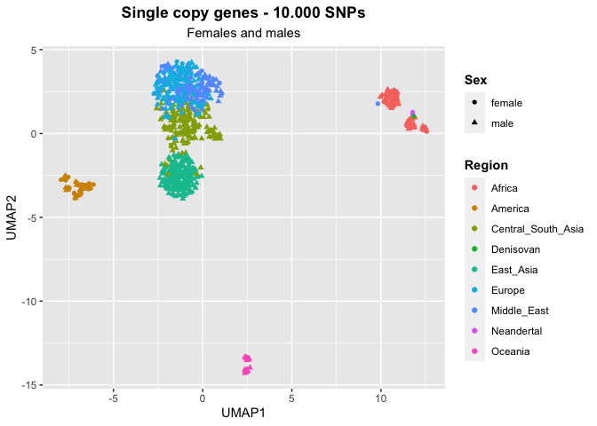
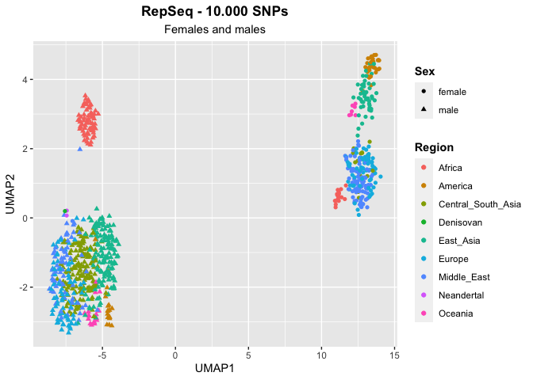
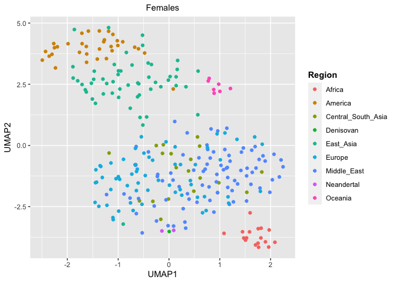

Archaic humans
================

``` r
library(tidyverse)
```

    ## ── Attaching core tidyverse packages ──────────────────────── tidyverse 2.0.0 ──
    ## ✔ dplyr     1.1.0     ✔ readr     2.1.4
    ## ✔ forcats   1.0.0     ✔ stringr   1.5.0
    ## ✔ ggplot2   3.4.1     ✔ tibble    3.2.0
    ## ✔ lubridate 1.9.2     ✔ tidyr     1.3.0
    ## ✔ purrr     1.0.1     
    ## ── Conflicts ────────────────────────────────────────── tidyverse_conflicts() ──
    ## ✖ dplyr::filter() masks stats::filter()
    ## ✖ dplyr::lag()    masks stats::lag()
    ## ℹ Use the ]8;;http://conflicted.r-lib.org/conflicted package]8;; to force all conflicts to become errors

``` r
library(umap)

HGDP <- read_delim("/Volumes/Temp1/rpianezza/0.old/summary-HGDP/HGDP_cutoff_classified.tsv") %>% select(ID, sex, country, pop) %>% distinct()
```

    ## Rows: 1394352 Columns: 12
    ## ── Column specification ────────────────────────────────────────────────────────
    ## Delimiter: "\t"
    ## chr (9): ID, pop, sex, country, type, familyname, batch, superfamily, shared...
    ## dbl (3): length, reads, copynumber
    ## 
    ## ℹ Use `spec()` to retrieve the full column specification for this data.
    ## ℹ Specify the column types or set `show_col_types = FALSE` to quiet this message.

``` r
archaic <- tibble(
  ID = c("Vindija", "Altai", "Denisovan"),
  pop = c("Vindija", "Altai", "Denisova"),
  country = c("Neandertal", "Neandertal", "Denisovan"),
  sex = c("female", "female", "female")
)

(HGDP_arch <- bind_rows(HGDP, archaic))
```

    ## # A tibble: 831 × 4
    ##    ID        sex   country            pop   
    ##    <chr>     <chr> <chr>              <chr> 
    ##  1 HGDP00001 male  Central_South_Asia Brahui
    ##  2 HGDP00003 male  Central_South_Asia Brahui
    ##  3 HGDP00005 male  Central_South_Asia Brahui
    ##  4 HGDP00007 male  Central_South_Asia Brahui
    ##  5 HGDP00009 male  Central_South_Asia Brahui
    ##  6 HGDP00011 male  Central_South_Asia Brahui
    ##  7 HGDP00013 male  Central_South_Asia Brahui
    ##  8 HGDP00015 male  Central_South_Asia Brahui
    ##  9 HGDP00017 male  Central_South_Asia Brahui
    ## 10 HGDP00021 male  Central_South_Asia Brahui
    ## # … with 821 more rows

``` r
UMAP <- function(freq_matrix, metadata, titlee){

matrix <- inner_join(metadata, freq_matrix, by="ID")
metadata <- metadata %>% filter(ID %in% matrix$ID)

pca_data <- matrix %>% select_if(~ !all(. == .[1]))
matrix <- as.matrix(pca_data[, -c(1,2,3,4)])
matrix[is.na(matrix)] <- -9
matrix <- matrix[, colSums(is.na(matrix)) == 0]

umap_result <- umap(matrix, n_neighbors = 15, min_dist = 0.3, dimnames = list(c("UMAP1", "UMAP2")))
umap <- umap_result$layout %>% as.data.frame()
colnames(umap) <- c("UMAP1", "UMAP2")

plot <- umap %>% ggplot(aes(x = UMAP1, y = UMAP2, color = metadata$country, shape = metadata$sex))+
  geom_point()+ labs(x = "UMAP1", y = "UMAP2", title = titlee, subtitle = "Females and males", color = "Region", shape = "Sex") + theme(plot.title = element_text(hjust = 0.5, face = "bold"), plot.subtitle = element_text(hjust = 0.5), legend.title = element_text(face = "bold"))
}
```

``` r
UMAP_split <- function(freq_matrix, metadata, titlee){

f_metadata <- metadata %>% filter(sex=="female", ID %in% freq_matrix$ID) %>% select(ID, sex, country, pop) %>% distinct()
m_metadata <- metadata %>% filter(sex=="male", ID %in% freq_matrix$ID) %>% select(ID, sex, country, pop) %>% distinct()
males_matrix <- inner_join(m_metadata, freq_matrix, by="ID")
females_matrix <- inner_join(f_metadata, freq_matrix, by="ID")

f_pca_data <- females_matrix %>% select_if(~ !all(. == .[1]))
m_pca_data <- males_matrix %>% select_if(~ !all(. == .[1]))
f_matrix <- as.matrix(f_pca_data[, -c(1,2,3)])
m_matrix <- as.matrix(m_pca_data[, -c(1,2,3)])
f_matrix[is.na(f_matrix)] <- -9
m_matrix[is.na(m_matrix)] <- -9
f_matrix <- f_matrix[, colSums(is.na(f_matrix)) == 0]
m_matrix <- m_matrix[, colSums(is.na(m_matrix)) == 0]

f_umap_result <- umap(f_matrix, n_neighbors = 15, min_dist = 0.3, dimnames = list(c("UMAP1", "UMAP2")))
m_umap_result <- umap(m_matrix, n_neighbors = 15, min_dist = 0.3, dimnames = list(c("UMAP1", "UMAP2")))

f_umap <- f_umap_result$layout %>% as.data.frame()
m_umap <- m_umap_result$layout %>% as.data.frame()
colnames(f_umap) <- c("UMAP1", "UMAP2")
colnames(m_umap) <- c("UMAP1", "UMAP2")

f <- f_umap %>% ggplot(aes(x = UMAP1, y = UMAP2, color = f_metadata$country))+
  geom_point()+ labs(x = "UMAP1", y = "UMAP2", subtitle = "Females", color = "Region") + theme(plot.subtitle = element_text(hjust = 0.5), legend.title = element_text(face = "bold"))

m <- m_umap %>% ggplot(aes(x = UMAP1, y = UMAP2, color = m_metadata$country))+
  geom_point()+ labs(x = "UMAP1", y = "UMAP2", subtitle = "Males", color = "Region") + theme(plot.subtitle = element_text(hjust = 0.5), legend.title = element_text(face = "bold"))

f
#plot <- ggarrange(f, m, ncol = 2, nrow = 1, common.legend = TRUE, legend = "bottom", align = "hv", font.label = list(size = 10, color = "black", face = "bold", family = NULL, position = "top"))
#figure <- annotate_figure(plot, top = text_grob(titlee, face = "bold", size = 14))
}
```

``` r
scg_10k <- read_csv("/Volumes/Temp1/rpianezza/PCA-SNPs-all-analysis/matrixes/NA/scg-cov15-10000SNPs.matrix.tsv")
```

    ## Rows: 828 Columns: 40001
    ## ── Column specification ────────────────────────────────────────────────────────
    ## Delimiter: ","
    ## chr     (1): ID
    ## dbl (40000): chr1:916864-921016_scg_95A, chr1:916864-921016_scg_95T, chr1:91...
    ## 
    ## ℹ Use `spec()` to retrieve the full column specification for this data.
    ## ℹ Specify the column types or set `show_col_types = FALSE` to quiet this message.

``` r
scg_vindija <- read_csv("/Volumes/Temp1/rpianezza/ancient_humans/archaic-humans/analysis/scg-vindija-10k.txt") %>% mutate(ID = "Vindija")
```

    ## Rows: 1 Columns: 40000
    ## ── Column specification ────────────────────────────────────────────────────────
    ## Delimiter: ","
    ## dbl (39776): chr1:916864-921016_scg_95A, chr1:916864-921016_scg_95T, chr1:91...
    ## lgl   (224): chr1:960583-965719_scg_3965A, chr1:960583-965719_scg_3965T, chr...
    ## 
    ## ℹ Use `spec()` to retrieve the full column specification for this data.
    ## ℹ Specify the column types or set `show_col_types = FALSE` to quiet this message.

``` r
scg_altai <- read_csv("/Volumes/Temp1/rpianezza/ancient_humans/archaic-humans/analysis/scg-altai-10k.txt") %>% mutate(ID = "Altai")
```

    ## Rows: 1 Columns: 39980
    ## ── Column specification ────────────────────────────────────────────────────────
    ## Delimiter: ","
    ## dbl (39868): chr1:916864-921016_scg_95A, chr1:916864-921016_scg_95T, chr1:91...
    ## lgl   (112): chr1:960583-965719_scg_3974A, chr1:960583-965719_scg_3974T, chr...
    ## 
    ## ℹ Use `spec()` to retrieve the full column specification for this data.
    ## ℹ Specify the column types or set `show_col_types = FALSE` to quiet this message.

``` r
scg_denisovan <- read_csv("/Volumes/Temp1/rpianezza/ancient_humans/archaic-humans/analysis/scg-denisovan-10k.txt") %>% mutate(ID = "Denisovan")
```

    ## Rows: 1 Columns: 39980
    ## ── Column specification ────────────────────────────────────────────────────────
    ## Delimiter: ","
    ## dbl (39564): chr1:916864-921016_scg_95A, chr1:916864-921016_scg_95T, chr1:91...
    ## lgl   (416): chr1:960583-965719_scg_3974A, chr1:960583-965719_scg_3974T, chr...
    ## 
    ## ℹ Use `spec()` to retrieve the full column specification for this data.
    ## ℹ Specify the column types or set `show_col_types = FALSE` to quiet this message.

``` r
(joined_scg <- bind_rows(scg_10k, scg_vindija, scg_altai, scg_denisovan))
```

    ## # A tibble: 831 × 40,001
    ##    ID    chr1:…¹ chr1:…² chr1:…³ chr1:…⁴ chr1:…⁵ chr1:…⁶ chr1:…⁷ chr1:…⁸ chr1:…⁹
    ##    <chr>   <dbl>   <dbl>   <dbl>   <dbl>   <dbl>   <dbl>   <dbl>   <dbl>   <dbl>
    ##  1 HGDP…       0       0       1       0       1       0       0       0       0
    ##  2 HGDP…       0       0       1       0       1       0       0       0       0
    ##  3 HGDP…       0       0       1       0       1       0       0       0       0
    ##  4 HGDP…       0       0       1       0       1       0       0       0       0
    ##  5 HGDP…       0       0       1       0       1       0       0       0       0
    ##  6 HGDP…       0       0       1       0       1       0       0       0       0
    ##  7 HGDP…       0       0       1       0       1       0       0       0       0
    ##  8 HGDP…       0       0       1       0       1       0       0       0       0
    ##  9 HGDP…       0       0       1       0       1       0       0       0       0
    ## 10 HGDP…       0       0       1       0       1       0       0       0       0
    ## # … with 821 more rows, 39,991 more variables:
    ## #   `chr1:916864-921016_scg_258T` <dbl>, `chr1:916864-921016_scg_258C` <dbl>,
    ## #   `chr1:916864-921016_scg_258G` <dbl>, `chr1:916864-921016_scg_273A` <dbl>,
    ## #   `chr1:916864-921016_scg_273T` <dbl>, `chr1:916864-921016_scg_273C` <dbl>,
    ## #   `chr1:916864-921016_scg_273G` <dbl>, `chr1:916864-921016_scg_406A` <dbl>,
    ## #   `chr1:916864-921016_scg_406T` <dbl>, `chr1:916864-921016_scg_406C` <dbl>,
    ## #   `chr1:916864-921016_scg_406G` <dbl>, `chr1:916864-921016_scg_420A` <dbl>, …

``` r
(scg_umap <- UMAP(joined_scg, HGDP_arch, "Single copy genes - 10.000 SNPs"))
```

<!-- -->

``` r
HGDP_te_matrix <- read_csv("/Volumes/Temp1/rpianezza/PCA-SNPs-all-analysis/matrixes/NA/no_imputation/te-10k.matrix.tsv")
```

    ## Rows: 828 Columns: 40001
    ## ── Column specification ────────────────────────────────────────────────────────
    ## Delimiter: ","
    ## chr     (1): ID
    ## dbl (40000): LTR65_te_116A, LTR65_te_116T, LTR65_te_116C, LTR65_te_116G, LTR...
    ## 
    ## ℹ Use `spec()` to retrieve the full column specification for this data.
    ## ℹ Specify the column types or set `show_col_types = FALSE` to quiet this message.

``` r
vindija_te <- read_csv("/Volumes/Temp1/rpianezza/ancient_humans/archaic-humans/analysis/scg-vindija-10k.txt") %>% mutate(ID = "Vindija")
```

    ## Rows: 1 Columns: 40000
    ## ── Column specification ────────────────────────────────────────────────────────
    ## Delimiter: ","
    ## dbl (39776): chr1:916864-921016_scg_95A, chr1:916864-921016_scg_95T, chr1:91...
    ## lgl   (224): chr1:960583-965719_scg_3965A, chr1:960583-965719_scg_3965T, chr...
    ## 
    ## ℹ Use `spec()` to retrieve the full column specification for this data.
    ## ℹ Specify the column types or set `show_col_types = FALSE` to quiet this message.

``` r
altai_te <- read_csv("/Volumes/Temp1/rpianezza/ancient_humans/archaic-humans/analysis/scg-altai-10k.txt") %>% mutate(ID = "Altai")
```

    ## Rows: 1 Columns: 39980
    ## ── Column specification ────────────────────────────────────────────────────────
    ## Delimiter: ","
    ## dbl (39868): chr1:916864-921016_scg_95A, chr1:916864-921016_scg_95T, chr1:91...
    ## lgl   (112): chr1:960583-965719_scg_3974A, chr1:960583-965719_scg_3974T, chr...
    ## 
    ## ℹ Use `spec()` to retrieve the full column specification for this data.
    ## ℹ Specify the column types or set `show_col_types = FALSE` to quiet this message.

``` r
denisova_te <- read_csv("/Volumes/Temp1/rpianezza/ancient_humans/archaic-humans/analysis/scg-denisovan-10k.txt") %>% mutate(ID = "Denisovan")
```

    ## Rows: 1 Columns: 39980
    ## ── Column specification ────────────────────────────────────────────────────────
    ## Delimiter: ","
    ## dbl (39564): chr1:916864-921016_scg_95A, chr1:916864-921016_scg_95T, chr1:91...
    ## lgl   (416): chr1:960583-965719_scg_3974A, chr1:960583-965719_scg_3974T, chr...
    ## 
    ## ℹ Use `spec()` to retrieve the full column specification for this data.
    ## ℹ Specify the column types or set `show_col_types = FALSE` to quiet this message.

``` r
(joined_te <- bind_rows(HGDP_te_matrix, vindija_te, altai_te, denisova_te))
```

    ## # A tibble: 831 × 80,001
    ##    ID    LTR65…¹ LTR65…² LTR65…³ LTR65…⁴ LTR65…⁵ LTR65…⁶ LTR65…⁷ LTR65…⁸ LTR65…⁹
    ##    <chr>   <dbl>   <dbl>   <dbl>   <dbl>   <dbl>   <dbl>   <dbl>   <dbl>   <dbl>
    ##  1 HGDP…   0.364       0   0.614   0.023       0   0.5     0.5         0   0    
    ##  2 HGDP…   0.443       0   0.541   0.016       0   0.531   0.469       0   0.035
    ##  3 HGDP…   0.385       0   0.564   0.051       0   0.651   0.349       0   0.044
    ##  4 HGDP…   0.436       0   0.527   0.036       0   0.6     0.4         0   0    
    ##  5 HGDP…   0.405       0   0.595   0           0   0.578   0.422       0   0    
    ##  6 HGDP…   0.235       0   0.765   0           0   0.571   0.429       0   0    
    ##  7 HGDP…   0.519       0   0.463   0.019       0   0.5     0.5         0   0.023
    ##  8 HGDP…   0.476       0   0.524   0           0   0.658   0.342       0   0.019
    ##  9 HGDP…   0.581       0   0.395   0.023       0   0.511   0.489       0   0    
    ## 10 HGDP…   0.652       0   0.348   0           0   0.758   0.242       0   0    
    ## # … with 821 more rows, 79,991 more variables: LTR65_te_582T <dbl>,
    ## #   LTR65_te_582C <dbl>, LTR65_te_582G <dbl>, LTR65_te_592A <dbl>,
    ## #   LTR65_te_592T <dbl>, LTR65_te_592C <dbl>, LTR65_te_592G <dbl>,
    ## #   LTR65_te_598A <dbl>, LTR65_te_598T <dbl>, LTR65_te_598C <dbl>,
    ## #   LTR65_te_598G <dbl>, HERVK3I_te_8A <dbl>, HERVK3I_te_8T <dbl>,
    ## #   HERVK3I_te_8C <dbl>, HERVK3I_te_8G <dbl>, HERVK3I_te_3958A <dbl>,
    ## #   HERVK3I_te_3958T <dbl>, HERVK3I_te_3958C <dbl>, HERVK3I_te_3958G <dbl>, …

``` r
(test_umap <- UMAP(joined_te, HGDP_arch, "RepSeq - 10.000 SNPs"))
```

<!-- -->

``` r
(test_umap_split <- UMAP_split(joined_te, HGDP_arch, "RepSeq - 10.000 SNPs"))
```

<!-- -->
