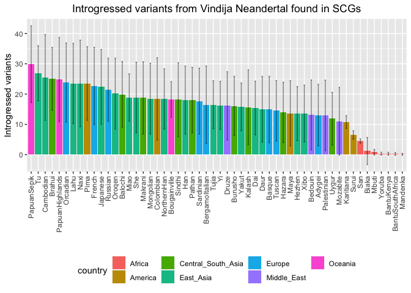
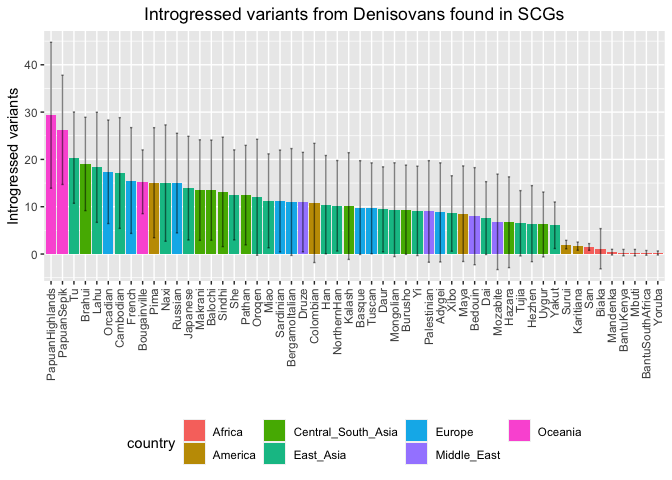
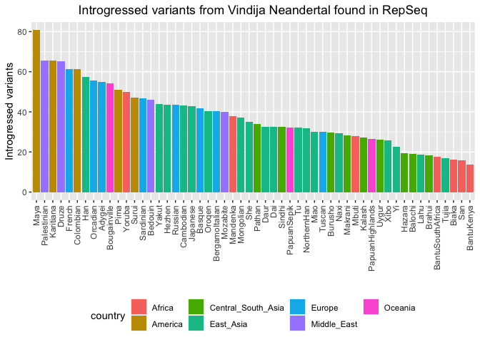
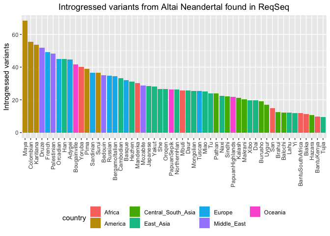
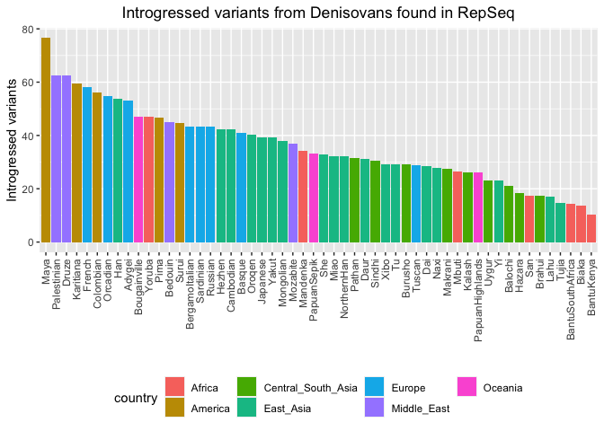
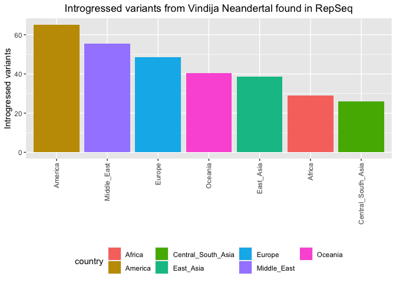
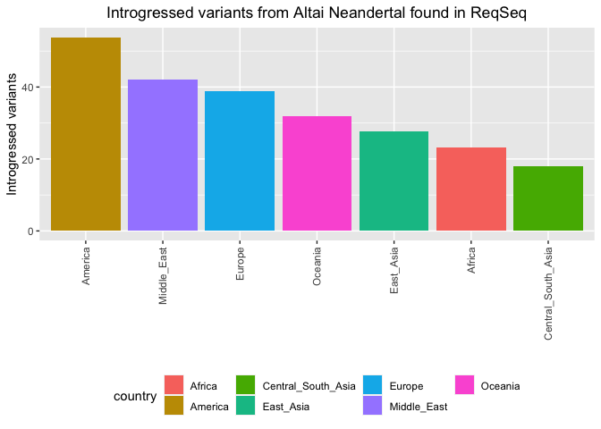
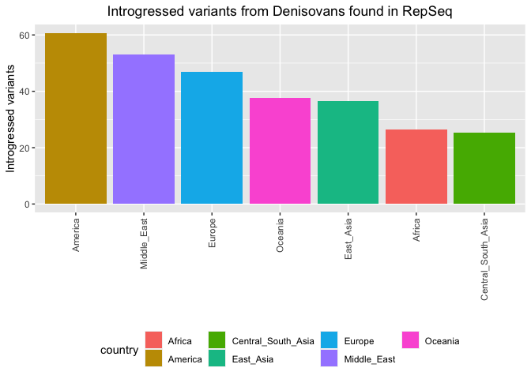

Archaic humans - SNPs found in NH and DH
================

Set the environment and creating metadata file.

``` r
library(tidyverse)
```

    ## ── Attaching core tidyverse packages ──────────────────────── tidyverse 2.0.0 ──
    ## ✔ dplyr     1.1.0     ✔ readr     2.1.4
    ## ✔ forcats   1.0.0     ✔ stringr   1.5.0
    ## ✔ ggplot2   3.4.1     ✔ tibble    3.2.0
    ## ✔ lubridate 1.9.2     ✔ tidyr     1.3.0
    ## ✔ purrr     1.0.1     
    ## ── Conflicts ────────────────────────────────────────── tidyverse_conflicts() ──
    ## ✖ dplyr::filter() masks stats::filter()
    ## ✖ dplyr::lag()    masks stats::lag()
    ## ℹ Use the ]8;;http://conflicted.r-lib.org/conflicted package]8;; to force all conflicts to become errors

``` r
library(umap)

HGDP <- read_delim("/Volumes/Temp1/rpianezza/0.old/summary-HGDP/HGDP_cutoff_classified.tsv") %>% select(ID, sex, country, pop) %>% distinct()
```

    ## Rows: 1394352 Columns: 12
    ## ── Column specification ────────────────────────────────────────────────────────
    ## Delimiter: "\t"
    ## chr (9): ID, pop, sex, country, type, familyname, batch, superfamily, shared...
    ## dbl (3): length, reads, copynumber
    ## 
    ## ℹ Use `spec()` to retrieve the full column specification for this data.
    ## ℹ Specify the column types or set `show_col_types = FALSE` to quiet this message.

``` r
archaic <- tibble(
  ID = c("Vindija", "Altai", "Denisovan"),
  pop = c("Vindija", "Altai", "Denisova"),
  country = c("Neandertal", "Neandertal", "Denisovan"),
  sex = c("female", "female", "female")
)

HGDP_arch <- bind_rows(HGDP, archaic)
```

``` r
afr <- HGDP %>% filter(country == "Africa") %>% select(ID)
#write_tsv(afr, "/Volumes/Temp1/rpianezza/ancient_humans/archaic-humans/analysis/ID-Afr")
```

## SCGs

Reading the matrixes for the archaic variants in SCGs in the HGDP. 1
file for each archaic genome.

``` r
scg_vindija_all <- read_tsv("/Volumes/Temp1/rpianezza/ancient_humans/archaic-humans/analysis/archaic-variants/scg/1k/vindija1k")
```

    ## Rows: 1000 Columns: 830
    ## ── Column specification ────────────────────────────────────────────────────────
    ## Delimiter: "\t"
    ## chr   (1): familyname
    ## dbl (829): position, HGDP00001-Brahui, HGDP00003-Brahui, HGDP00005-Brahui, H...
    ## 
    ## ℹ Use `spec()` to retrieve the full column specification for this data.
    ## ℹ Specify the column types or set `show_col_types = FALSE` to quiet this message.

``` r
scg_altai_all <- read_tsv("/Volumes/Temp1/rpianezza/ancient_humans/archaic-humans/analysis/archaic-variants/scg/1k/altai1k")
```

    ## Rows: 1000 Columns: 830
    ## ── Column specification ────────────────────────────────────────────────────────
    ## Delimiter: "\t"
    ## chr   (1): familyname
    ## dbl (829): position, HGDP00001-Brahui, HGDP00003-Brahui, HGDP00005-Brahui, H...
    ## 
    ## ℹ Use `spec()` to retrieve the full column specification for this data.
    ## ℹ Specify the column types or set `show_col_types = FALSE` to quiet this message.

``` r
scg_denisova_all <- read_tsv("/Volumes/Temp1/rpianezza/ancient_humans/archaic-humans/analysis/archaic-variants/scg/1k/denisova1k")
```

    ## Rows: 1000 Columns: 830
    ## ── Column specification ────────────────────────────────────────────────────────
    ## Delimiter: "\t"
    ## chr   (1): familyname
    ## dbl (829): position, HGDP00001-Brahui, HGDP00003-Brahui, HGDP00005-Brahui, H...
    ## 
    ## ℹ Use `spec()` to retrieve the full column specification for this data.
    ## ℹ Specify the column types or set `show_col_types = FALSE` to quiet this message.

Read the files containing info about the variants called in the archaic
genome. Is important the “total_diff” column, which is an indicator of
the distance between the allele frequencies in the Africans and in the
archaic genome.

Is comprised between 0 (same allele frequencies for that position) and 2
(complete non-overlapping allele frequencies for that position).

``` r
scg_diff_vindija <- read_tsv("/Volumes/Temp1/rpianezza/ancient_humans/archaic-humans/analysis/archaic-variants/scg/1k/vindija1k_afr-arch") %>% select(familyname, position, total_diff)
```

    ## Rows: 1000 Columns: 15
    ## ── Column specification ────────────────────────────────────────────────────────
    ## Delimiter: "\t"
    ## chr  (1): familyname
    ## dbl (14): position, A_x, T_x, C_x, G_x, A_y, T_y, C_y, G_y, A_diff, T_diff, ...
    ## 
    ## ℹ Use `spec()` to retrieve the full column specification for this data.
    ## ℹ Specify the column types or set `show_col_types = FALSE` to quiet this message.

``` r
scg_diff_altai <- read_tsv("/Volumes/Temp1/rpianezza/ancient_humans/archaic-humans/analysis/archaic-variants/scg/1k/altai1k_afr-arch") %>% select(familyname, position, total_diff)
```

    ## Rows: 1000 Columns: 15
    ## ── Column specification ────────────────────────────────────────────────────────
    ## Delimiter: "\t"
    ## chr  (1): familyname
    ## dbl (14): position, A_x, T_x, C_x, G_x, A_y, T_y, C_y, G_y, A_diff, T_diff, ...
    ## 
    ## ℹ Use `spec()` to retrieve the full column specification for this data.
    ## ℹ Specify the column types or set `show_col_types = FALSE` to quiet this message.

``` r
scg_diff_denisova <- read_tsv("/Volumes/Temp1/rpianezza/ancient_humans/archaic-humans/analysis/archaic-variants/scg/1k/denisova1k_afr-arch") %>% select(familyname, position, total_diff)
```

    ## Rows: 1000 Columns: 15
    ## ── Column specification ────────────────────────────────────────────────────────
    ## Delimiter: "\t"
    ## chr  (1): familyname
    ## dbl (14): position, A_x, T_x, C_x, G_x, A_y, T_y, C_y, G_y, A_diff, T_diff, ...
    ## 
    ## ℹ Use `spec()` to retrieve the full column specification for this data.
    ## ℹ Specify the column types or set `show_col_types = FALSE` to quiet this message.

Merge the two files read above for each of the three genome and select
only the variance with a **total_diff** \> a certain threshold. In this
case, I use 1.75. This means that, for single copy genes, both the
alleles must be different between archaic and africans to keep the
variant in this code. Ideally, this will result in a total_diff = 2, but
due to sequencing error and aDNA bias I use a lower threshold (1.75).

``` r
(scg_vindija <- inner_join(scg_vindija_all, scg_diff_vindija, by=c("familyname", "position")) %>% filter(total_diff>1.75) %>% relocate(total_diff) %>% arrange(desc(total_diff)))
```

    ## # A tibble: 765 × 831
    ##    total_diff familyname posit…¹ HGDP0…² HGDP0…³ HGDP0…⁴ HGDP0…⁵ HGDP0…⁶ HGDP0…⁷
    ##         <dbl> <chr>        <dbl>   <dbl>   <dbl>   <dbl>   <dbl>   <dbl>   <dbl>
    ##  1          2 chr1:9168…     845       2       2       2       2       2       2
    ##  2          2 chr1:9168…    1352       2       2       2       2       2       2
    ##  3          2 chr1:9168…    2549       2       2       2       2       2       2
    ##  4          2 chr1:9605…     626       2       2       2       2       2       2
    ##  5          2 chr1:9605…    4587       2       2       2       2       2       2
    ##  6          2 chr1:1203…    2999       2       2       2       2       2       2
    ##  7          2 chr1:1324…     955       2       2       2       2       2       2
    ##  8          2 chr1:1324…    1231       2       2       2       2       2       2
    ##  9          2 chr1:1324…    3021       2       2       2       2       2       2
    ## 10          2 chr1:1324…    3026       2       2       2       2       2       2
    ## # … with 755 more rows, 822 more variables: `HGDP00013-Brahui` <dbl>,
    ## #   `HGDP00015-Brahui` <dbl>, `HGDP00017-Brahui` <dbl>,
    ## #   `HGDP00021-Brahui` <dbl>, `HGDP00023-Brahui` <dbl>,
    ## #   `HGDP00025-Brahui` <dbl>, `HGDP00029-Brahui` <dbl>,
    ## #   `HGDP00031-Brahui` <dbl>, `HGDP00033-Brahui` <dbl>,
    ## #   `HGDP00035-Brahui` <dbl>, `HGDP00037-Brahui` <dbl>,
    ## #   `HGDP00039-Brahui` <dbl>, `HGDP00041-Brahui` <dbl>, …

``` r
scg_altai <- inner_join(scg_altai_all, scg_diff_altai, by=c("familyname", "position")) %>% filter(total_diff>1.75) %>% relocate(total_diff) %>% arrange(desc(total_diff))
scg_denisova <- inner_join(scg_denisova_all, scg_diff_denisova, by=c("familyname", "position")) %>% filter(total_diff>1.75) %>% relocate(total_diff) %>% arrange(desc(total_diff))
```

With the selected variants, I then look for potentially introgressed
variants in all the HGDP samples: the variants which are very different
between archaic and africans (total_diff very high) but that in a genome
are not that different. I use a threshold of **total_diff** of 1.25 to
select those variant which are supposed to be introgressed in one copy
in a genome (ideally 1).

``` r
intro_vindija <- scg_vindija %>% select(-familyname, -position, -total_diff) %>% summarise_all(~sum(. <1.25, na.rm=TRUE)) %>% t() %>% as.data.frame() %>% rownames_to_column(var = "ID") %>% dplyr::rename("introgressed" = "V1") %>% as_tibble() %>% separate(ID, into=c("ID", "pop"), sep="-", remove=FALSE) %>% select(-pop) %>% inner_join(HGDP, by="ID")
intro_altai <- scg_altai %>% select(-familyname, -position, -total_diff) %>% summarise_all(~sum(. <1.25, na.rm=TRUE)) %>% t() %>% as.data.frame() %>% rownames_to_column(var = "ID") %>% dplyr::rename("introgressed" = "V1") %>% as_tibble() %>% separate(ID, into=c("ID", "pop"), sep="-", remove=FALSE) %>% select(-pop) %>% inner_join(HGDP, by="ID")
(intro_denisova <- scg_denisova %>% select(-familyname, -position, -total_diff) %>% summarise_all(~sum(. <1.25, na.rm=TRUE)) %>% t() %>% as.data.frame() %>% rownames_to_column(var = "ID") %>% dplyr::rename("introgressed" = "V1") %>% as_tibble() %>% separate(ID, into=c("ID", "pop"), sep="-", remove=FALSE) %>% select(-pop) %>% inner_join(HGDP, by="ID"))
```

    ## # A tibble: 828 × 5
    ##    ID        introgressed sex   country            pop   
    ##    <chr>            <int> <chr> <chr>              <chr> 
    ##  1 HGDP00001           22 male  Central_South_Asia Brahui
    ##  2 HGDP00003           43 male  Central_South_Asia Brahui
    ##  3 HGDP00005           50 male  Central_South_Asia Brahui
    ##  4 HGDP00007           52 male  Central_South_Asia Brahui
    ##  5 HGDP00009           43 male  Central_South_Asia Brahui
    ##  6 HGDP00011           34 male  Central_South_Asia Brahui
    ##  7 HGDP00013           10 male  Central_South_Asia Brahui
    ##  8 HGDP00015           41 male  Central_South_Asia Brahui
    ##  9 HGDP00017           47 male  Central_South_Asia Brahui
    ## 10 HGDP00021           46 male  Central_South_Asia Brahui
    ## # … with 818 more rows

From the info above, I produce these plots averaging the number of
introgressed variants for each population.

``` r
(scg_v_plot <- intro_vindija %>% group_by(pop, country) %>% dplyr::summarise(mean_intro = mean(introgressed)) %>% ggplot(aes(x = reorder(pop, -mean_intro), y=mean_intro, fill=country))+
  geom_col()+
  labs(x = "", y = "Introgressed variants", title = element_text(face = "bold", size = 14, "Introgressed variants from Vindija Neandertal found in SCGs")) + theme(axis.text.x = element_text(angle = 90, vjust = 0.5, hjust=1), legend.position = "bottom", plot.title = element_text(hjust = 0.5)))
```

    ## `summarise()` has grouped output by 'pop'. You can override using the `.groups`
    ## argument.

<!-- -->

``` r
(scg_a_plot <- intro_altai %>% group_by(pop, country) %>% dplyr::summarise(mean_intro = mean(introgressed)) %>% ggplot(aes(x = reorder(pop, -mean_intro), y=mean_intro, fill=country))+
  geom_col()+
  labs(x = "", y = "Introgressed variants", title = element_text(face = "bold", size = 14, "Introgressed variants from Altai Neandertal found in SCGs")) + theme(axis.text.x = element_text(angle = 90, vjust = 0.5, hjust=1), legend.position = "bottom", plot.title = element_text(hjust = 0.5)))
```

    ## `summarise()` has grouped output by 'pop'. You can override using the `.groups`
    ## argument.

<!-- -->

``` r
(scg_d_plot <- intro_denisova %>% group_by(pop, country) %>% dplyr::summarise(mean_intro = mean(introgressed)) %>% ggplot(aes(x = reorder(pop, -mean_intro), y=mean_intro, fill=country))+
  geom_col()+
  labs(x = "", y = "Introgressed variants", title = element_text(face = "bold", size = 14, "Introgressed variants from Denisovans found in SCGs")) + theme(axis.text.x = element_text(angle = 90, vjust = 0.5, hjust=1), legend.position = "bottom", plot.title = element_text(hjust = 0.5)))
```

    ## `summarise()` has grouped output by 'pop'. You can override using the `.groups`
    ## argument.

<!-- -->

Here I do the same for each region (“country”).

``` r
(scg_v_plot_cou <- intro_vindija %>% group_by(country) %>% dplyr::summarise(mean_intro = mean(introgressed)) %>% ggplot(aes(x = reorder(country, -mean_intro), y=mean_intro, fill=country))+
  geom_col()+
  labs(x = "", y = "Introgressed variants", title = element_text(face = "bold", size = 14, "Introgressed variants from Vindija Neandertal found in SCGs")) + theme(axis.text.x = element_text(angle = 90, vjust = 0.5, hjust=1), legend.position = "bottom", plot.title = element_text(hjust = 0.5)))
```

<!-- -->

``` r
(scg_a_plot_cou <- intro_altai %>% group_by(country) %>% dplyr::summarise(mean_intro = mean(introgressed)) %>% ggplot(aes(x = reorder(country, -mean_intro), y=mean_intro, fill=country))+
  geom_col()+
  labs(x = "", y = "Introgressed variants", title = element_text(face = "bold", size = 14, "Introgressed variants from Altai Neandertal found in SCGs")) + theme(axis.text.x = element_text(angle = 90, vjust = 0.5, hjust=1), legend.position = "bottom", plot.title = element_text(hjust = 0.5)))
```

<!-- -->

``` r
(scg_d_plot_cou <- intro_denisova %>% group_by(country) %>% dplyr::summarise(mean_intro = mean(introgressed)) %>% ggplot(aes(x = reorder(country, -mean_intro), y=mean_intro, fill=country))+
  geom_col()+
  labs(x = "", y = "Introgressed variants", title = element_text(face = "bold", size = 14, "Introgressed variants from Denisovans found in SCGs")) + theme(axis.text.x = element_text(angle = 90, vjust = 0.5, hjust=1), legend.position = "bottom", plot.title = element_text(hjust = 0.5)))
```

<!-- -->

# TEs

Here I try to produce similar plot using the archaic variants called in
the repetitive sequences.

``` r
te_vindija_all <- read_tsv("/Volumes/Temp1/rpianezza/ancient_humans/archaic-humans/analysis/archaic-variants/te/10k/vindija10k")
```

    ## Rows: 10000 Columns: 830
    ## ── Column specification ────────────────────────────────────────────────────────
    ## Delimiter: "\t"
    ## chr   (1): familyname
    ## dbl (829): position, HGDP00001-Brahui, HGDP00003-Brahui, HGDP00005-Brahui, H...
    ## 
    ## ℹ Use `spec()` to retrieve the full column specification for this data.
    ## ℹ Specify the column types or set `show_col_types = FALSE` to quiet this message.

``` r
te_altai_all <- read_tsv("/Volumes/Temp1/rpianezza/ancient_humans/archaic-humans/analysis/archaic-variants/te/10k/altai10k")
```

    ## Rows: 10000 Columns: 830
    ## ── Column specification ────────────────────────────────────────────────────────
    ## Delimiter: "\t"
    ## chr   (1): familyname
    ## dbl (829): position, HGDP00001-Brahui, HGDP00003-Brahui, HGDP00005-Brahui, H...
    ## 
    ## ℹ Use `spec()` to retrieve the full column specification for this data.
    ## ℹ Specify the column types or set `show_col_types = FALSE` to quiet this message.

``` r
te_denisova_all <- read_tsv("/Volumes/Temp1/rpianezza/ancient_humans/archaic-humans/analysis/archaic-variants/te/10k/denisova10k")
```

    ## Rows: 10000 Columns: 830
    ## ── Column specification ────────────────────────────────────────────────────────
    ## Delimiter: "\t"
    ## chr   (1): familyname
    ## dbl (829): position, HGDP00001-Brahui, HGDP00003-Brahui, HGDP00005-Brahui, H...
    ## 
    ## ℹ Use `spec()` to retrieve the full column specification for this data.
    ## ℹ Specify the column types or set `show_col_types = FALSE` to quiet this message.

``` r
te_diff_vindija <- read_tsv("/Volumes/Temp1/rpianezza/ancient_humans/archaic-humans/analysis/archaic-variants/te/10k/vindija10k_afr-arch") %>% select(familyname, position, total_diff)
```

    ## Rows: 10000 Columns: 15
    ## ── Column specification ────────────────────────────────────────────────────────
    ## Delimiter: "\t"
    ## chr  (1): familyname
    ## dbl (14): position, A_x, T_x, C_x, G_x, A_y, T_y, C_y, G_y, A_diff, T_diff, ...
    ## 
    ## ℹ Use `spec()` to retrieve the full column specification for this data.
    ## ℹ Specify the column types or set `show_col_types = FALSE` to quiet this message.

``` r
te_diff_altai <- read_tsv("/Volumes/Temp1/rpianezza/ancient_humans/archaic-humans/analysis/archaic-variants/te/10k/altai10k_afr-arch") %>% select(familyname, position, total_diff)
```

    ## Rows: 10000 Columns: 15
    ## ── Column specification ────────────────────────────────────────────────────────
    ## Delimiter: "\t"
    ## chr  (1): familyname
    ## dbl (14): position, A_x, T_x, C_x, G_x, A_y, T_y, C_y, G_y, A_diff, T_diff, ...
    ## 
    ## ℹ Use `spec()` to retrieve the full column specification for this data.
    ## ℹ Specify the column types or set `show_col_types = FALSE` to quiet this message.

``` r
te_diff_denisova <- read_tsv("/Volumes/Temp1/rpianezza/ancient_humans/archaic-humans/analysis/archaic-variants/te/10k/denisova10k_afr-arch") %>% select(familyname, position, total_diff)
```

    ## Rows: 10000 Columns: 15
    ## ── Column specification ────────────────────────────────────────────────────────
    ## Delimiter: "\t"
    ## chr  (1): familyname
    ## dbl (14): position, A_x, T_x, C_x, G_x, A_y, T_y, C_y, G_y, A_diff, T_diff, ...
    ## 
    ## ℹ Use `spec()` to retrieve the full column specification for this data.
    ## ℹ Specify the column types or set `show_col_types = FALSE` to quiet this message.

``` r
te_vindija <- inner_join(te_vindija_all, te_diff_vindija, by=c("familyname", "position")) %>% filter(total_diff>1.00) %>% relocate(total_diff) %>% arrange(desc(total_diff))

te_altai <- inner_join(te_altai_all, te_diff_altai, by=c("familyname", "position")) %>% filter(total_diff>1.00) %>% relocate(total_diff) %>% arrange(desc(total_diff))

te_denisova <- inner_join(te_denisova_all, te_diff_denisova, by=c("familyname", "position")) %>% filter(total_diff>1.00) %>% relocate(total_diff) %>% arrange(desc(total_diff))
```

Instead of just putting a cutoff to the **total_diff** to select the
introgressed variants, I try to select the variants that differed the
most from the **total_diff** found between archaic and africans. This
makes more sense to me.

``` r
te_intro_vindija <- te_vindija %>% summarise(across(where(is.numeric) & !contains("total_diff"), ~ sum(total_diff - . > 0.5, na.rm = TRUE))) %>% t() %>% as.data.frame() %>% rownames_to_column(var = "ID") %>% dplyr::rename("introgressed" = "V1") %>% as_tibble() %>% separate(ID, into=c("ID", "pop"), sep="-", remove=FALSE) %>% select(-pop) %>% inner_join(HGDP, by="ID")
```

    ## Warning: Expected 2 pieces. Missing pieces filled with `NA` in 1 rows [1].

``` r
te_intro_altai <- te_altai %>% summarise(across(where(is.numeric) & !contains("total_diff"), ~ sum(total_diff - . > 0.5, na.rm = TRUE))) %>% t() %>% as.data.frame() %>% rownames_to_column(var = "ID") %>% dplyr::rename("introgressed" = "V1") %>% as_tibble() %>% separate(ID, into=c("ID", "pop"), sep="-", remove=FALSE) %>% select(-pop) %>% inner_join(HGDP, by="ID")
```

    ## Warning: Expected 2 pieces. Missing pieces filled with `NA` in 1 rows [1].

``` r
te_intro_denisova <- te_denisova %>% summarise(across(where(is.numeric) & !contains("total_diff"), ~ sum(total_diff - . > 0.5, na.rm = TRUE))) %>% t() %>% as.data.frame() %>% rownames_to_column(var = "ID") %>% dplyr::rename("introgressed" = "V1") %>% as_tibble() %>% separate(ID, into=c("ID", "pop"), sep="-", remove=FALSE) %>% select(-pop) %>% inner_join(HGDP, by="ID")
```

    ## Warning: Expected 2 pieces. Missing pieces filled with `NA` in 1 rows [1].

``` r
(te_v_plot <- te_intro_vindija %>% group_by(pop, country) %>% dplyr::summarise(mean_intro = mean(introgressed)) %>% ggplot(aes(x = reorder(pop, -mean_intro), y=mean_intro, fill=country))+
  geom_col()+
  labs(x = "", y = "Introgressed variants", title = element_text(face = "bold", size = 14, "Introgressed variants from Vindija Neandertal found in RepSeq")) + theme(axis.text.x = element_text(angle = 90, vjust = 0.5, hjust=1), legend.position = "bottom", plot.title = element_text(hjust = 0.5)))
```

    ## `summarise()` has grouped output by 'pop'. You can override using the `.groups`
    ## argument.

<!-- -->

``` r
(te_a_plot <- te_intro_altai %>% group_by(pop, country) %>% dplyr::summarise(mean_intro = mean(introgressed)) %>% ggplot(aes(x = reorder(pop, -mean_intro), y=mean_intro, fill=country))+
  geom_col()+
  labs(x = "", y = "Introgressed variants", title = element_text(face = "bold", size = 14, "Introgressed variants from Altai Neandertal found in ReqSeq")) + theme(axis.text.x = element_text(angle = 90, vjust = 0.5, hjust=1), legend.position = "bottom", plot.title = element_text(hjust = 0.5)))
```

    ## `summarise()` has grouped output by 'pop'. You can override using the `.groups`
    ## argument.

<!-- -->

``` r
(te_d_plot <- te_intro_denisova %>% group_by(pop, country) %>% dplyr::summarise(mean_intro = mean(introgressed)) %>% ggplot(aes(x = reorder(pop, -mean_intro), y=mean_intro, fill=country))+
  geom_col()+
  labs(x = "", y = "Introgressed variants", title = element_text(face = "bold", size = 14, "Introgressed variants from Denisovans found in RepSeq")) + theme(axis.text.x = element_text(angle = 90, vjust = 0.5, hjust=1), legend.position = "bottom", plot.title = element_text(hjust = 0.5)))
```

    ## `summarise()` has grouped output by 'pop'. You can override using the `.groups`
    ## argument.

<!-- -->

``` r
(te_v_plot_cou <- te_intro_vindija %>% group_by(country) %>% dplyr::summarise(mean_intro = mean(introgressed)) %>% ggplot(aes(x = reorder(country, -mean_intro), y=mean_intro, fill=country))+
  geom_col()+
  labs(x = "", y = "Introgressed variants", title = element_text(face = "bold", size = 14, "Introgressed variants from Vindija Neandertal found in RepSeq")) + theme(axis.text.x = element_text(angle = 90, vjust = 0.5, hjust=1), legend.position = "bottom", plot.title = element_text(hjust = 0.5)))
```

<!-- -->

``` r
(te_a_plot_cou <- te_intro_altai %>% group_by(country) %>% dplyr::summarise(mean_intro = mean(introgressed)) %>% ggplot(aes(x = reorder(country, -mean_intro), y=mean_intro, fill=country))+
  geom_col()+
  labs(x = "", y = "Introgressed variants", title = element_text(face = "bold", size = 14, "Introgressed variants from Altai Neandertal found in ReqSeq")) + theme(axis.text.x = element_text(angle = 90, vjust = 0.5, hjust=1), legend.position = "bottom", plot.title = element_text(hjust = 0.5)))
```

<!-- -->

``` r
(te_d_plot_cou <- te_intro_denisova %>% group_by(country) %>% dplyr::summarise(mean_intro = mean(introgressed)) %>% ggplot(aes(x = reorder(country, -mean_intro), y=mean_intro, fill=country))+
  geom_col()+
  labs(x = "", y = "Introgressed variants", title = element_text(face = "bold", size = 14, "Introgressed variants from Denisovans found in RepSeq")) + theme(axis.text.x = element_text(angle = 90, vjust = 0.5, hjust=1), legend.position = "bottom", plot.title = element_text(hjust = 0.5)))
```

<!-- -->
