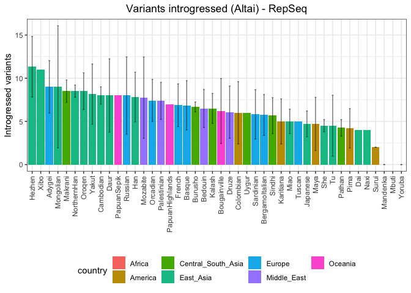

Archaic humans - SNPs found in NH and DH
================

Set the environment and creating metadata file.

``` r
library(tidyverse)
```

    ## ── Attaching core tidyverse packages ──────────────────────── tidyverse 2.0.0 ──
    ## ✔ dplyr     1.1.0     ✔ readr     2.1.4
    ## ✔ forcats   1.0.0     ✔ stringr   1.5.0
    ## ✔ ggplot2   3.4.1     ✔ tibble    3.2.0
    ## ✔ lubridate 1.9.2     ✔ tidyr     1.3.0
    ## ✔ purrr     1.0.1     
    ## ── Conflicts ────────────────────────────────────────── tidyverse_conflicts() ──
    ## ✖ dplyr::filter() masks stats::filter()
    ## ✖ dplyr::lag()    masks stats::lag()
    ## ℹ Use the ]8;;http://conflicted.r-lib.org/conflicted package]8;; to force all conflicts to become errors

``` r
library(umap)

HGDP <- read_delim("/Volumes/Temp1/rpianezza/0.old/summary-HGDP/HGDP_cutoff_classified.tsv") %>% select(ID, sex, country, pop) %>% distinct()
```

    ## Rows: 1394352 Columns: 12
    ## ── Column specification ────────────────────────────────────────────────────────
    ## Delimiter: "\t"
    ## chr (9): ID, pop, sex, country, type, familyname, batch, superfamily, shared...
    ## dbl (3): length, reads, copynumber
    ## 
    ## ℹ Use `spec()` to retrieve the full column specification for this data.
    ## ℹ Specify the column types or set `show_col_types = FALSE` to quiet this message.

``` r
archaic <- tibble(
  ID = c("Vindija", "Altai", "Denisovan"),
  pop = c("Vindija", "Altai", "Denisova"),
  country = c("Neandertal", "Neandertal", "Denisovan"),
  sex = c("female", "female", "female")
)

HGDP_arch <- bind_rows(HGDP, archaic)

HGDP_fem <- HGDP_arch %>% filter(sex=="female")

coordinates <- read_tsv("/Users/rpianezza/TE/summary-HGDP/HGDP_populationcoordinates.txt", col_names = c("pop", "region", "latitude", "longitude")) %>% select(pop, latitude, longitude)
```

    ## Rows: 54 Columns: 4
    ## ── Column specification ────────────────────────────────────────────────────────
    ## Delimiter: "\t"
    ## chr (2): pop, region
    ## dbl (2): latitude, longitude
    ## 
    ## ℹ Use `spec()` to retrieve the full column specification for this data.
    ## ℹ Specify the column types or set `show_col_types = FALSE` to quiet this message.

## TEs

Base order: A T C G

``` r
vindija <- "/Volumes/Temp1/rpianezza/ancient_humans/archaic-humans/analysis/diagnostic-variants/vindija"
vindija_diag <- "/Volumes/Temp1/rpianezza/ancient_humans/archaic-humans/analysis/diagnostic-variants/vindija_afr-arch"

altai <- "/Volumes/Temp1/rpianezza/ancient_humans/archaic-humans/analysis/diagnostic-variants/altai"
altai_diag <- "/Volumes/Temp1/rpianezza/ancient_humans/archaic-humans/analysis/diagnostic-variants/altai_afr-arch"

denisova <- "/Volumes/Temp1/rpianezza/ancient_humans/archaic-humans/analysis/diagnostic-variants/denisova"
denisova_diag <- "/Volumes/Temp1/rpianezza/ancient_humans/archaic-humans/analysis/diagnostic-variants/denisova_afr-arch"
```

``` r
plot_introgression <- function(data, titlee){
  
 plot <- data %>% group_by(pop, country) %>% dplyr::summarise(mean_intro = mean(introgressed), sd_intro = sd(introgressed)) %>% ggplot(aes(x = reorder(pop, -mean_intro), y=mean_intro, fill=country))+
  geom_col()+
  geom_errorbar(aes(ymin = mean_intro - sd_intro, ymax = mean_intro + sd_intro), 
                width = 0.2, position = position_dodge(0.9), alpha = 0.5)+
  labs(x = "", y = "Introgressed variants", title = element_text(face = "bold", size = 14, titlee)) + theme(axis.text.x = element_text(angle = 90, vjust = 0.5, hjust=1), legend.position = "bottom", plot.title = element_text(hjust = 0.5))
}

introgression_diagnostic <- function(matrix, diagnostic_bases, titlee){
  
archaic <- read_tsv(matrix) %>% select(-diagnostic, -afr_copynumber)
diag <- read_tsv(diagnostic_bases) %>% select(familyname, position, afr_copynumber, diagnostic)

merged <- inner_join(archaic, diag, by=c("familyname", "position")) %>% relocate(diagnostic, afr_copynumber) %>% mutate_at(vars(starts_with("HGDP")), ~. * afr_copynumber) %>% filter(afr_copynumber<250) %>% select(-c(diagnostic, afr_copynumber, familyname, position)) %>% dplyr::summarise_all(~sum(. >1, na.rm=TRUE)) %>% t %>% as.data.frame() %>% rownames_to_column(var = "ID") %>% as_tibble() %>% dplyr::rename("introgressed" = "V1") %>% separate(ID, into=c("ID", "pop"), sep="-", remove=FALSE) %>% select(-pop) %>% inner_join(HGDP_fem, by="ID")

(plot_introgression(merged, titlee))
}
```

``` r
introgression_diagnostic(vindija, vindija_diag, "Variants introgressed (Vindija) - RepSeq")
```

    ## Warning: One or more parsing issues, call `problems()` on your data frame for details,
    ## e.g.:
    ##   dat <- vroom(...)
    ##   problems(dat)

    ## Rows: 3326 Columns: 832
    ## ── Column specification ────────────────────────────────────────────────────────
    ## Delimiter: "\t"
    ## chr   (1): familyname
    ## dbl (829): position, HGDP00001-Brahui, HGDP00003-Brahui, HGDP00005-Brahui, H...
    ## lgl   (2): afr_copynumber, diagnostic
    ## 
    ## ℹ Use `spec()` to retrieve the full column specification for this data.
    ## ℹ Specify the column types or set `show_col_types = FALSE` to quiet this message.
    ## Rows: 3266 Columns: 13
    ## ── Column specification ────────────────────────────────────────────────────────
    ## Delimiter: "\t"
    ## chr  (2): familyname, diagnostic
    ## dbl (11): position, A_x, T_x, C_x, G_x, A_y, T_y, C_y, G_y, afr_copynumber, ...
    ## 
    ## ℹ Use `spec()` to retrieve the full column specification for this data.
    ## ℹ Specify the column types or set `show_col_types = FALSE` to quiet this message.

    ## Warning in inner_join(archaic, diag, by = c("familyname", "position")): Each row in `x` is expected to match at most 1 row in `y`.
    ## ℹ Row 116 of `x` matches multiple rows.
    ## ℹ If multiple matches are expected, set `multiple = "all"` to silence this
    ##   warning.

    ## `summarise()` has grouped output by 'pop'. You can override using the `.groups`
    ## argument.

<!-- -->

``` r
introgression_diagnostic(altai, altai_diag, "Variants introgressed (Altai) - RepSeq")
```

    ## Warning: One or more parsing issues, call `problems()` on your data frame for details,
    ## e.g.:
    ##   dat <- vroom(...)
    ##   problems(dat)

    ## Rows: 1059 Columns: 832
    ## ── Column specification ────────────────────────────────────────────────────────
    ## Delimiter: "\t"
    ## chr   (1): familyname
    ## dbl (829): position, HGDP00001-Brahui, HGDP00003-Brahui, HGDP00005-Brahui, H...
    ## lgl   (2): afr_copynumber, diagnostic
    ## 
    ## ℹ Use `spec()` to retrieve the full column specification for this data.
    ## ℹ Specify the column types or set `show_col_types = FALSE` to quiet this message.
    ## Rows: 999 Columns: 13
    ## ── Column specification ────────────────────────────────────────────────────────
    ## Delimiter: "\t"
    ## chr  (2): familyname, diagnostic
    ## dbl (11): position, A_x, T_x, C_x, G_x, A_y, T_y, C_y, G_y, afr_copynumber, ...
    ## 
    ## ℹ Use `spec()` to retrieve the full column specification for this data.
    ## ℹ Specify the column types or set `show_col_types = FALSE` to quiet this message.

    ## Warning in inner_join(archaic, diag, by = c("familyname", "position")): Each row in `x` is expected to match at most 1 row in `y`.
    ## ℹ Row 38 of `x` matches multiple rows.
    ## ℹ If multiple matches are expected, set `multiple = "all"` to silence this
    ##   warning.

    ## `summarise()` has grouped output by 'pop'. You can override using the `.groups`
    ## argument.

<!-- -->

``` r
introgression_diagnostic(denisova, denisova_diag, "Variants introgressed (Denisovans) - RepSeq")
```

    ## Warning: One or more parsing issues, call `problems()` on your data frame for details,
    ## e.g.:
    ##   dat <- vroom(...)
    ##   problems(dat)

    ## Rows: 958 Columns: 832
    ## ── Column specification ────────────────────────────────────────────────────────
    ## Delimiter: "\t"
    ## chr   (1): familyname
    ## dbl (829): position, HGDP00001-Brahui, HGDP00003-Brahui, HGDP00005-Brahui, H...
    ## lgl   (2): afr_copynumber, diagnostic
    ## 
    ## ℹ Use `spec()` to retrieve the full column specification for this data.
    ## ℹ Specify the column types or set `show_col_types = FALSE` to quiet this message.
    ## Rows: 912 Columns: 13
    ## ── Column specification ────────────────────────────────────────────────────────
    ## Delimiter: "\t"
    ## chr  (2): familyname, diagnostic
    ## dbl (11): position, A_x, T_x, C_x, G_x, A_y, T_y, C_y, G_y, afr_copynumber, ...
    ## 
    ## ℹ Use `spec()` to retrieve the full column specification for this data.
    ## ℹ Specify the column types or set `show_col_types = FALSE` to quiet this message.

    ## Warning in inner_join(archaic, diag, by = c("familyname", "position")): Each row in `x` is expected to match at most 1 row in `y`.
    ## ℹ Row 42 of `x` matches multiple rows.
    ## ℹ If multiple matches are expected, set `multiple = "all"` to silence this
    ##   warning.

    ## `summarise()` has grouped output by 'pop'. You can override using the `.groups`
    ## argument.

<!-- -->

``` r
introgression_diagnostic_sum <- function(matrix, diagnostic_bases, titlee){
  
archaic <- read_tsv(matrix) %>% select(-diagnostic, -afr_copynumber)
diag <- read_tsv(diagnostic_bases) %>% select(familyname, position, afr_copynumber, diagnostic)

merged <- inner_join(archaic, diag, by=c("familyname", "position")) %>% relocate(diagnostic, afr_copynumber) %>% mutate_at(vars(starts_with("HGDP")), ~. * afr_copynumber) %>% select(-c(diagnostic, afr_copynumber, familyname, position)) %>% dplyr::summarise_all(sum, na.rm = TRUE) %>% t %>% as.data.frame() %>% rownames_to_column(var = "ID") %>% as_tibble() %>% dplyr::rename("introgressed" = "V1") %>% separate(ID, into=c("ID", "pop"), sep="-", remove=FALSE) %>% select(-pop) %>% inner_join(HGDP_fem, by="ID")

(plot_introgression(merged, titlee))
}

#introgression_diagnostic_sum(vindija, vindija_diag, "Variants introgressed (Vindija) - RepSeq")
#introgression_diagnostic_sum(altai, altai_diag, "Variants introgressed (Altai) - RepSeq")
#introgression_diagnostic_sum(denisova, denisova_diag, "Variants introgressed (Denisovans) - RepSeq")
```
