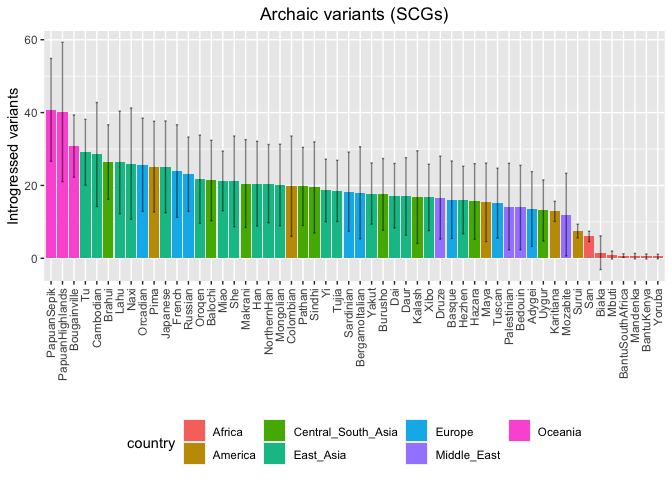
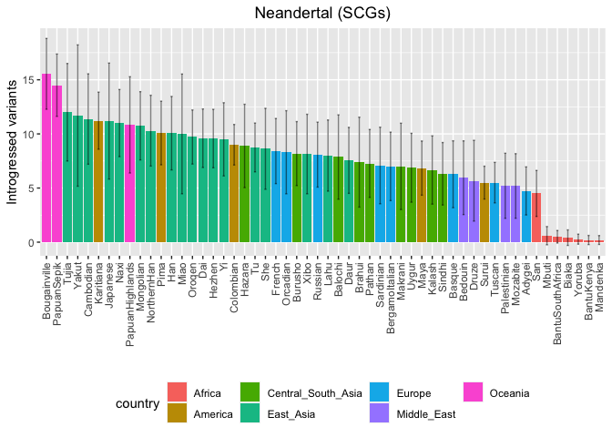
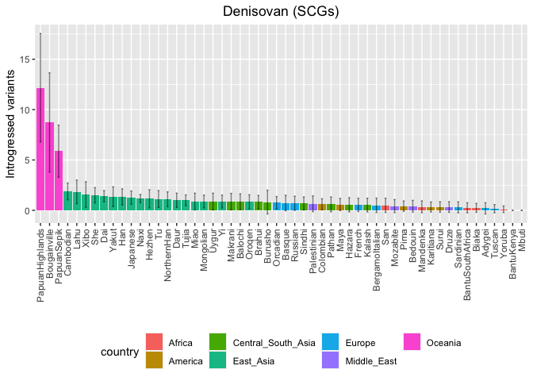

Archaic humans - SNPs found in NH and DH
================

Set the environment and creating metadata file.

``` r
library(tidyverse)
```

    ## ── Attaching core tidyverse packages ──────────────────────── tidyverse 2.0.0 ──
    ## ✔ dplyr     1.1.1     ✔ readr     2.1.4
    ## ✔ forcats   1.0.0     ✔ stringr   1.5.0
    ## ✔ ggplot2   3.4.2     ✔ tibble    3.2.1
    ## ✔ lubridate 1.9.2     ✔ tidyr     1.3.0
    ## ✔ purrr     1.0.1     
    ## ── Conflicts ────────────────────────────────────────── tidyverse_conflicts() ──
    ## ✖ dplyr::filter() masks stats::filter()
    ## ✖ dplyr::lag()    masks stats::lag()
    ## ℹ Use the conflicted package (<http://conflicted.r-lib.org/>) to force all conflicts to become errors

``` r
library(umap)

HGDP <- read_delim("/Volumes/Temp1/rpianezza/0.old/summary-HGDP/HGDP_cutoff_classified.tsv") %>% select(ID, sex, country, pop) %>% distinct()
```

    ## Rows: 1394352 Columns: 12
    ## ── Column specification ────────────────────────────────────────────────────────
    ## Delimiter: "\t"
    ## chr (9): ID, pop, sex, country, type, familyname, batch, superfamily, shared...
    ## dbl (3): length, reads, copynumber
    ## 
    ## ℹ Use `spec()` to retrieve the full column specification for this data.
    ## ℹ Specify the column types or set `show_col_types = FALSE` to quiet this message.

``` r
archaic <- tibble(
  ID = c("Vindija", "Altai", "Denisovan"),
  pop = c("Vindija", "Altai", "Denisova"),
  country = c("Neandertal", "Neandertal", "Denisovan"),
  sex = c("female", "female", "female")
)

HGDP_arch <- bind_rows(HGDP, archaic)

coordinates <- read_tsv("/Users/rpianezza/TE/summary-HGDP/HGDP_populationcoordinates.txt", col_names = c("pop", "region", "latitude", "longitude")) %>% select(pop, latitude, longitude)
```

    ## Rows: 54 Columns: 4
    ## ── Column specification ────────────────────────────────────────────────────────
    ## Delimiter: "\t"
    ## chr (2): pop, region
    ## dbl (2): latitude, longitude
    ## 
    ## ℹ Use `spec()` to retrieve the full column specification for this data.
    ## ℹ Specify the column types or set `show_col_types = FALSE` to quiet this message.

``` r
afr <- HGDP %>% filter(country=="Africa", sex=="female") %>% select(ID)
#write_tsv(afr, "/Volumes/Temp1/rpianezza/ancient_humans/archaic-humans/analysis/ID-Afr-females")

fem <- HGDP %>% filter(sex=="female") %>% select(ID)
#write_tsv(fem, "/Volumes/Temp1/rpianezza/PCA-SNPs-all-analysis/matrixes/females/females.IDs")

mal <- HGDP %>% filter(sex=="male") %>% select(ID)
#write_tsv(mal, "/Volumes/Temp1/rpianezza/PCA-SNPs-all-analysis/matrixes/females/males.IDs")
```

## SCGs

Reading the matrixes for the archaic variants in SCGs in the HGDP. 1
file for each archaic genome.

``` r
scg_vindija_all <- read_tsv("/Volumes/Temp1/rpianezza/ancient_humans/archaic-humans/analysis/archaic-variants/scg/1k/vindija1k")
```

    ## Rows: 1000 Columns: 830
    ## ── Column specification ────────────────────────────────────────────────────────
    ## Delimiter: "\t"
    ## chr   (1): familyname
    ## dbl (829): position, HGDP00001-Brahui, HGDP00003-Brahui, HGDP00005-Brahui, H...
    ## 
    ## ℹ Use `spec()` to retrieve the full column specification for this data.
    ## ℹ Specify the column types or set `show_col_types = FALSE` to quiet this message.

``` r
scg_altai_all <- read_tsv("/Volumes/Temp1/rpianezza/ancient_humans/archaic-humans/analysis/archaic-variants/scg/1k/altai1k")
```

    ## Rows: 1000 Columns: 830
    ## ── Column specification ────────────────────────────────────────────────────────
    ## Delimiter: "\t"
    ## chr   (1): familyname
    ## dbl (829): position, HGDP00001-Brahui, HGDP00003-Brahui, HGDP00005-Brahui, H...
    ## 
    ## ℹ Use `spec()` to retrieve the full column specification for this data.
    ## ℹ Specify the column types or set `show_col_types = FALSE` to quiet this message.

``` r
scg_denisova_all <- read_tsv("/Volumes/Temp1/rpianezza/ancient_humans/archaic-humans/analysis/archaic-variants/scg/1k/denisova1k")
```

    ## Rows: 1000 Columns: 830
    ## ── Column specification ────────────────────────────────────────────────────────
    ## Delimiter: "\t"
    ## chr   (1): familyname
    ## dbl (829): position, HGDP00001-Brahui, HGDP00003-Brahui, HGDP00005-Brahui, H...
    ## 
    ## ℹ Use `spec()` to retrieve the full column specification for this data.
    ## ℹ Specify the column types or set `show_col_types = FALSE` to quiet this message.

Read the files containing info about the variants called in the archaic
genome. Is important the “total_diff” column, which is an indicator of
the distance between the allele frequencies in the Africans and in the
archaic genome.

Is comprised between 0 (same allele frequencies for that position) and 2
(complete non-overlapping allele frequencies for that position).

``` r
scg_diff_vindija <- read_tsv("/Volumes/Temp1/rpianezza/ancient_humans/archaic-humans/analysis/archaic-variants/scg/1k/vindija1k_afr-arch") %>% select(familyname, position, total_diff)
```

    ## Rows: 1000 Columns: 15
    ## ── Column specification ────────────────────────────────────────────────────────
    ## Delimiter: "\t"
    ## chr  (1): familyname
    ## dbl (14): position, A_x, T_x, C_x, G_x, A_y, T_y, C_y, G_y, A_diff, T_diff, ...
    ## 
    ## ℹ Use `spec()` to retrieve the full column specification for this data.
    ## ℹ Specify the column types or set `show_col_types = FALSE` to quiet this message.

``` r
scg_diff_altai <- read_tsv("/Volumes/Temp1/rpianezza/ancient_humans/archaic-humans/analysis/archaic-variants/scg/1k/altai1k_afr-arch") %>% select(familyname, position, total_diff)
```

    ## Rows: 1000 Columns: 15
    ## ── Column specification ────────────────────────────────────────────────────────
    ## Delimiter: "\t"
    ## chr  (1): familyname
    ## dbl (14): position, A_x, T_x, C_x, G_x, A_y, T_y, C_y, G_y, A_diff, T_diff, ...
    ## 
    ## ℹ Use `spec()` to retrieve the full column specification for this data.
    ## ℹ Specify the column types or set `show_col_types = FALSE` to quiet this message.

``` r
scg_diff_denisova <- read_tsv("/Volumes/Temp1/rpianezza/ancient_humans/archaic-humans/analysis/archaic-variants/scg/1k/denisova1k_afr-arch") %>% select(familyname, position, total_diff)
```

    ## Rows: 1000 Columns: 15
    ## ── Column specification ────────────────────────────────────────────────────────
    ## Delimiter: "\t"
    ## chr  (1): familyname
    ## dbl (14): position, A_x, T_x, C_x, G_x, A_y, T_y, C_y, G_y, A_diff, T_diff, ...
    ## 
    ## ℹ Use `spec()` to retrieve the full column specification for this data.
    ## ℹ Specify the column types or set `show_col_types = FALSE` to quiet this message.

Merge the two files read above for each of the three genome and select
only the variance with a **total_diff** \> a certain threshold. In this
case, I use 1.75. This means that, for single copy genes, both the
alleles must be different between archaic and africans to keep the
variant in this code. Ideally, this will result in a total_diff = 2, but
due to sequencing error and aDNA bias I use a lower threshold (1.97).

``` r
scg_vindija <- inner_join(scg_vindija_all, scg_diff_vindija, by=c("familyname", "position")) %>% filter(total_diff>1.97) %>% relocate(total_diff) %>% arrange(desc(total_diff))
scg_altai <- inner_join(scg_altai_all, scg_diff_altai, by=c("familyname", "position")) %>% filter(total_diff>1.97) %>% relocate(total_diff) %>% arrange(desc(total_diff))
scg_denisova <- inner_join(scg_denisova_all, scg_diff_denisova, by=c("familyname", "position")) %>% filter(total_diff>1.97) %>% relocate(total_diff) %>% arrange(desc(total_diff))
```

With the selected variants, I then look for potentially introgressed
variants in all the HGDP samples: the variants which are very different
between archaic and africans (total_diff very high) but that in a genome
are not that different. I use a threshold of **total_diff** of 1.25 to
select those variant which are supposed to be introgressed in one copy
in a genome (ideally 1).

From the info above, I produce these plots averaging the number of
introgressed variants for each population.

``` r
plot_map <- function(intro, coord, title){
  
full <- inner_join(intro, coord, by="pop") %>% group_by(pop, longitude, latitude) %>% dplyr::summarise(introgressed = mean(introgressed), count = n())
world_map = map_data("world")

ggplot() +
  geom_map(
    data = world_map, map = world_map,
    aes(long, lat, map_id = region),
    color = "white", fill = "lightgray", size = 0) +
  geom_point(data = full, aes(x=longitude, y=latitude, color = introgressed, size = count)) + geom_errorbar() + scale_colour_gradient(low = "green", high = "red") + theme(legend.position="top") + theme(plot.title = element_text(hjust = 0.5)) + ggtitle(title)
}


#plot_map(intro_vindija, coordinates, "Variants introgressed from Vindija NH found in SCGs")
#plot_map(intro_altai, coordinates, "Variants introgressed from Altai NH found in SCGs")
#plot_map(intro_denisova, coordinates, "Variants introgressed from Denisovans found in SCGs")
```

## Round 2

``` r
IDs <- colnames(scg_vindija)[4:ncol(scg_vindija)]

complete_introgression <- tibble()
colnames(complete_introgression) <- c("ID", "archaic", "neandertal", "denisovan")
```

``` r
for (id in IDs) {
  
names_v <- scg_vindija %>% select(familyname, position, id) %>% rename(sample_ID=id) %>% filter(sample_ID<1.25, na.rm=TRUE) %>% mutate(SNP = paste0(familyname, "_", position)) %>% select(SNP)
names_a <- scg_altai %>% select(familyname, position, id) %>% rename(sample_ID=id) %>% filter(sample_ID<1.25, na.rm=TRUE) %>% mutate(SNP = paste0(familyname, "_", position)) %>% select(SNP)

d_SNPs <- scg_denisova %>% select(familyname, position, id) %>% rename(sample_ID=id) %>% filter(sample_ID<1.25, na.rm=TRUE) %>% mutate(SNP = paste0(familyname, "_", position)) %>% select(SNP)
n_SNPs <- names_v %>% bind_rows(names_a) %>% distinct()

archaic_SNPs <- bind_rows(d_SNPs, n_SNPs)  %>% distinct() %>% summarise(archaic=n())
denisovan_SNPs <- d_SNPs %>% filter(!(SNP %in% n_SNPs$SNP)) %>% summarise(denisovan=n())
neandertal_SNPs <- n_SNPs %>% filter(!(SNP %in% d_SNPs$SNP)) %>% summarise(neandertal=n())

(sample <- bind_cols(archaic_SNPs, neandertal_SNPs, denisovan_SNPs) %>% mutate("ID" = id))

complete_introgression <- bind_rows(complete_introgression, sample)
}
```

    ## Warning: Using an external vector in selections was deprecated in tidyselect 1.1.0.
    ## ℹ Please use `all_of()` or `any_of()` instead.
    ##   # Was:
    ##   data %>% select(id)
    ## 
    ##   # Now:
    ##   data %>% select(all_of(id))
    ## 
    ## See <https://tidyselect.r-lib.org/reference/faq-external-vector.html>.
    ## This warning is displayed once every 8 hours.
    ## Call `lifecycle::last_lifecycle_warnings()` to see where this warning was
    ## generated.

``` r
complete_introgression
```

    ## # A tibble: 828 × 4
    ##    archaic neandertal denisovan ID              
    ##      <int>      <int>     <int> <chr>           
    ##  1      13          7         2 HGDP00001-Brahui
    ##  2      28          7         0 HGDP00003-Brahui
    ##  3      37         12         1 HGDP00005-Brahui
    ##  4      41         11         1 HGDP00007-Brahui
    ##  5      24          5         1 HGDP00009-Brahui
    ##  6      27          4         0 HGDP00011-Brahui
    ##  7       8          6         2 HGDP00013-Brahui
    ##  8      30          5         0 HGDP00015-Brahui
    ##  9      40         15         1 HGDP00017-Brahui
    ## 10      27          2         1 HGDP00021-Brahui
    ## # ℹ 818 more rows

``` r
(data_introgression <- complete_introgression %>% separate(ID, into=c("ID","pop"), sep="\\-") %>% select(-pop) %>% inner_join(HGDP, by="ID"))
```

    ## # A tibble: 828 × 7
    ##    archaic neandertal denisovan ID        sex   country            pop   
    ##      <int>      <int>     <int> <chr>     <chr> <chr>              <chr> 
    ##  1      13          7         2 HGDP00001 male  Central_South_Asia Brahui
    ##  2      28          7         0 HGDP00003 male  Central_South_Asia Brahui
    ##  3      37         12         1 HGDP00005 male  Central_South_Asia Brahui
    ##  4      41         11         1 HGDP00007 male  Central_South_Asia Brahui
    ##  5      24          5         1 HGDP00009 male  Central_South_Asia Brahui
    ##  6      27          4         0 HGDP00011 male  Central_South_Asia Brahui
    ##  7       8          6         2 HGDP00013 male  Central_South_Asia Brahui
    ##  8      30          5         0 HGDP00015 male  Central_South_Asia Brahui
    ##  9      40         15         1 HGDP00017 male  Central_South_Asia Brahui
    ## 10      27          2         1 HGDP00021 male  Central_South_Asia Brahui
    ## # ℹ 818 more rows

``` r
(archaic_introgression <- data_introgression %>% select(ID, pop, country, archaic) %>% group_by(pop, country) %>% dplyr::summarise(mean_intro = mean(archaic), sd_intro = sd(archaic)) %>% ggplot(aes(x = reorder(pop, -mean_intro), y=mean_intro, fill=country))+
 geom_col()+
  geom_errorbar(aes(ymin = mean_intro - sd_intro, ymax = mean_intro + sd_intro),         width = 0.2, position = position_dodge(0.9), alpha = 0.5)+
  labs(x = "", y = "Introgressed variants", title = element_text(face = "bold", size = 14, "Archaic variants (SCGs)")) + theme(axis.text.x = element_text(angle = 90, vjust = 0.5, hjust=1), legend.position = "bottom", plot.title = element_text(hjust = 0.5)))
```

    ## `summarise()` has grouped output by 'pop'. You can override using the `.groups`
    ## argument.

<!-- -->

``` r
(neandertal_introgression <- data_introgression %>% select(ID, pop, country, neandertal) %>% group_by(pop, country) %>% dplyr::summarise(mean_intro = mean(neandertal), sd_intro = sd(neandertal)) %>% ggplot(aes(x = reorder(pop, -mean_intro), y=mean_intro, fill=country))+
 geom_col()+
  geom_errorbar(aes(ymin = mean_intro - sd_intro, ymax = mean_intro + sd_intro),         width = 0.2, position = position_dodge(0.9), alpha = 0.5)+
  labs(x = "", y = "Introgressed variants", title = element_text(face = "bold", size = 14, "Neandertal (SCGs)")) + theme(axis.text.x = element_text(angle = 90, vjust = 0.5, hjust=1), legend.position = "bottom", plot.title = element_text(hjust = 0.5)))
```

    ## `summarise()` has grouped output by 'pop'. You can override using the `.groups`
    ## argument.

<!-- -->

``` r
(denisovan_introgression <- data_introgression %>% select(ID, pop, country, denisovan) %>% group_by(pop, country) %>% dplyr::summarise(mean_intro = mean(denisovan), sd_intro = sd(denisovan)) %>% ggplot(aes(x = reorder(pop, -mean_intro), y=mean_intro, fill=country))+
 geom_col()+
  geom_errorbar(aes(ymin = mean_intro - sd_intro, ymax = mean_intro + sd_intro),         width = 0.2, position = position_dodge(0.9), alpha = 0.5)+
  labs(x = "", y = "Introgressed variants", title = element_text(face = "bold", size = 14, "Denisovan (SCGs)")) + theme(axis.text.x = element_text(angle = 90, vjust = 0.5, hjust=1), legend.position = "bottom", plot.title = element_text(hjust = 0.5)))
```

    ## `summarise()` has grouped output by 'pop'. You can override using the `.groups`
    ## argument.

<!-- -->
