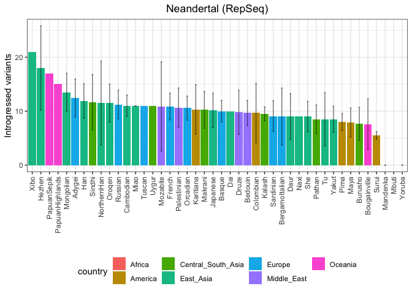
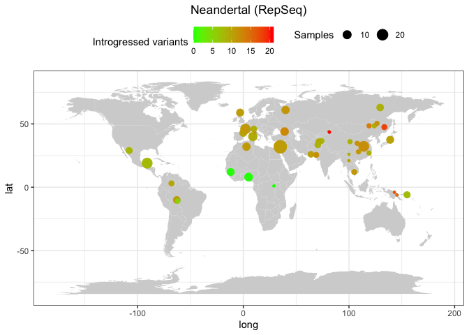
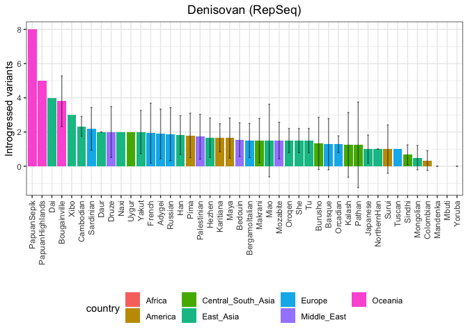
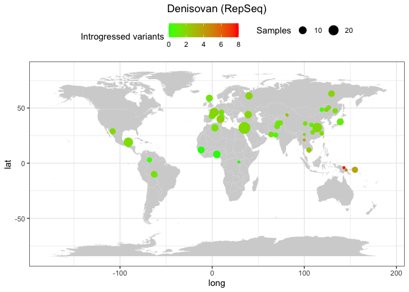

Archaic humans - SNPs found in NH and DH
================

Set the environment and creating metadata file.

``` r
library(tidyverse)
```

    ## ── Attaching core tidyverse packages ──────────────────────── tidyverse 2.0.0 ──
    ## ✔ dplyr     1.1.1     ✔ readr     2.1.4
    ## ✔ forcats   1.0.0     ✔ stringr   1.5.0
    ## ✔ ggplot2   3.4.2     ✔ tibble    3.2.1
    ## ✔ lubridate 1.9.2     ✔ tidyr     1.3.0
    ## ✔ purrr     1.0.1     
    ## ── Conflicts ────────────────────────────────────────── tidyverse_conflicts() ──
    ## ✖ dplyr::filter() masks stats::filter()
    ## ✖ dplyr::lag()    masks stats::lag()
    ## ℹ Use the conflicted package (<http://conflicted.r-lib.org/>) to force all conflicts to become errors

``` r
library(umap)

theme_set(theme_bw())

HGDP <- read_delim("/Volumes/Temp1/rpianezza/0.old/summary-HGDP/HGDP_cutoff_classified.tsv") %>% select(ID, sex, country, pop) %>% distinct()
```

    ## Rows: 1394352 Columns: 12
    ## ── Column specification ────────────────────────────────────────────────────────
    ## Delimiter: "\t"
    ## chr (9): ID, pop, sex, country, type, familyname, batch, superfamily, shared...
    ## dbl (3): length, reads, copynumber
    ## 
    ## ℹ Use `spec()` to retrieve the full column specification for this data.
    ## ℹ Specify the column types or set `show_col_types = FALSE` to quiet this message.

``` r
archaic <- tibble(
  ID = c("Vindija", "Altai", "Denisovan"),
  pop = c("Vindija", "Altai", "Denisova"),
  country = c("Neandertal", "Neandertal", "Denisovan"),
  sex = c("female", "female", "female")
)

HGDP_arch <- bind_rows(HGDP, archaic)

HGDP_fem <- HGDP_arch %>% filter(sex=="female")

coordinates <- read_tsv("/Users/rpianezza/TE/summary-HGDP/HGDP_populationcoordinates.txt", col_names = c("pop", "region", "latitude", "longitude")) %>% select(pop, latitude, longitude)
```

    ## Rows: 54 Columns: 4
    ## ── Column specification ────────────────────────────────────────────────────────
    ## Delimiter: "\t"
    ## chr (2): pop, region
    ## dbl (2): latitude, longitude
    ## 
    ## ℹ Use `spec()` to retrieve the full column specification for this data.
    ## ℹ Specify the column types or set `show_col_types = FALSE` to quiet this message.

## TEs

Base order: A T C G

``` r
vindija <- "/Volumes/Temp1/rpianezza/ancient_humans/archaic-humans/analysis/diagnostic-variants/vindija"
vindija_diag <- "/Volumes/Temp1/rpianezza/ancient_humans/archaic-humans/analysis/diagnostic-variants/vindija_afr-arch"

altai <- "/Volumes/Temp1/rpianezza/ancient_humans/archaic-humans/analysis/diagnostic-variants/altai"
altai_diag <- "/Volumes/Temp1/rpianezza/ancient_humans/archaic-humans/analysis/diagnostic-variants/altai_afr-arch"

denisova <- "/Volumes/Temp1/rpianezza/ancient_humans/archaic-humans/analysis/diagnostic-variants/denisova"
denisova_diag <- "/Volumes/Temp1/rpianezza/ancient_humans/archaic-humans/analysis/diagnostic-variants/denisova_afr-arch"
```

``` r
plot_introgression <- function(data, titlee){
  
 plot <- data %>% group_by(pop, country) %>% dplyr::summarise(mean_intro = mean(introgressed), sd_intro = sd(introgressed)) %>% ggplot(aes(x = reorder(pop, -mean_intro), y=mean_intro, fill=country))+
  geom_col()+
  geom_errorbar(aes(ymin = mean_intro - sd_intro, ymax = mean_intro + sd_intro), 
                width = 0.2, position = position_dodge(0.9), alpha = 0.5)+
  labs(x = "", y = "Introgressed variants", title = element_text(face = "bold", size = 14, titlee)) + theme(axis.text.x = element_text(angle = 90, vjust = 0.5, hjust=1), legend.position = "bottom", plot.title = element_text(hjust = 0.5))
}


plot_map <- function(intro, coord, title){
  
full <- inner_join(intro, coord, by="pop") %>% group_by(pop, longitude, latitude) %>% dplyr::summarise(introgressed = mean(introgressed), count = n())
world_map = map_data("world")

ggplot() +
  geom_map(
    data = world_map, map = world_map,
    aes(long, lat, map_id = region),
    color = "white", fill = "lightgray", size = 0) +
  geom_point(data = full, aes(x=longitude, y=latitude, color = introgressed, size = count)) + geom_errorbar() + scale_colour_gradient(low = "green", high = "red") + theme(legend.position="top") + theme(plot.title = element_text(hjust = 0.5)) + ggtitle(title) + labs(colour = "Introgressed variants", size = "Samples")
}
```

``` r
denny <- read_tsv(denisova) %>% select(-diagnostic, -afr_copynumber)
```

    ## Warning: One or more parsing issues, call `problems()` on your data frame for details,
    ## e.g.:
    ##   dat <- vroom(...)
    ##   problems(dat)

    ## Rows: 958 Columns: 832
    ## ── Column specification ────────────────────────────────────────────────────────
    ## Delimiter: "\t"
    ## chr   (1): familyname
    ## dbl (829): position, HGDP00001-Brahui, HGDP00003-Brahui, HGDP00005-Brahui, H...
    ## lgl   (2): afr_copynumber, diagnostic
    ## 
    ## ℹ Use `spec()` to retrieve the full column specification for this data.
    ## ℹ Specify the column types or set `show_col_types = FALSE` to quiet this message.

``` r
vindy <- read_tsv(vindija) %>% select(-diagnostic, -afr_copynumber)
```

    ## Warning: One or more parsing issues, call `problems()` on your data frame for details,
    ## e.g.:
    ##   dat <- vroom(...)
    ##   problems(dat)

    ## Rows: 3326 Columns: 832
    ## ── Column specification ────────────────────────────────────────────────────────
    ## Delimiter: "\t"
    ## chr   (1): familyname
    ## dbl (829): position, HGDP00001-Brahui, HGDP00003-Brahui, HGDP00005-Brahui, H...
    ## lgl   (2): afr_copynumber, diagnostic
    ## 
    ## ℹ Use `spec()` to retrieve the full column specification for this data.
    ## ℹ Specify the column types or set `show_col_types = FALSE` to quiet this message.

``` r
altay <- read_tsv(altai) %>% select(-diagnostic, -afr_copynumber)
```

    ## Warning: One or more parsing issues, call `problems()` on your data frame for details,
    ## e.g.:
    ##   dat <- vroom(...)
    ##   problems(dat)

    ## Rows: 1059 Columns: 832
    ## ── Column specification ────────────────────────────────────────────────────────
    ## Delimiter: "\t"
    ## chr   (1): familyname
    ## dbl (829): position, HGDP00001-Brahui, HGDP00003-Brahui, HGDP00005-Brahui, H...
    ## lgl   (2): afr_copynumber, diagnostic
    ## 
    ## ℹ Use `spec()` to retrieve the full column specification for this data.
    ## ℹ Specify the column types or set `show_col_types = FALSE` to quiet this message.

``` r
denny_diag <- read_tsv(denisova_diag) %>% select(familyname, position, afr_copynumber, diagnostic)
```

    ## Rows: 912 Columns: 13
    ## ── Column specification ────────────────────────────────────────────────────────
    ## Delimiter: "\t"
    ## chr  (2): familyname, diagnostic
    ## dbl (11): position, A_x, T_x, C_x, G_x, A_y, T_y, C_y, G_y, afr_copynumber, ...
    ## 
    ## ℹ Use `spec()` to retrieve the full column specification for this data.
    ## ℹ Specify the column types or set `show_col_types = FALSE` to quiet this message.

``` r
altay_diag <- read_tsv(altai_diag) %>% select(familyname, position, afr_copynumber, diagnostic)
```

    ## Rows: 999 Columns: 13
    ## ── Column specification ────────────────────────────────────────────────────────
    ## Delimiter: "\t"
    ## chr  (2): familyname, diagnostic
    ## dbl (11): position, A_x, T_x, C_x, G_x, A_y, T_y, C_y, G_y, afr_copynumber, ...
    ## 
    ## ℹ Use `spec()` to retrieve the full column specification for this data.
    ## ℹ Specify the column types or set `show_col_types = FALSE` to quiet this message.

``` r
vindy_diag <- read_tsv(vindija_diag) %>% select(familyname, position, afr_copynumber, diagnostic)
```

    ## Rows: 3266 Columns: 13
    ## ── Column specification ────────────────────────────────────────────────────────
    ## Delimiter: "\t"
    ## chr  (2): familyname, diagnostic
    ## dbl (11): position, A_x, T_x, C_x, G_x, A_y, T_y, C_y, G_y, afr_copynumber, ...
    ## 
    ## ℹ Use `spec()` to retrieve the full column specification for this data.
    ## ℹ Specify the column types or set `show_col_types = FALSE` to quiet this message.

``` r
d <- inner_join(denny, denny_diag, by=c("familyname", "position")) %>% mutate(SNP = paste0(familyname, "_", position)) %>% distinct()
```

    ## Warning in inner_join(denny, denny_diag, by = c("familyname", "position")): Detected an unexpected many-to-many relationship between `x` and `y`.
    ## ℹ Row 42 of `x` matches multiple rows in `y`.
    ## ℹ Row 277 of `y` matches multiple rows in `x`.
    ## ℹ If a many-to-many relationship is expected, set `relationship =
    ##   "many-to-many"` to silence this warning.

``` r
a <- inner_join(altay, altay_diag, by=c("familyname", "position")) %>% mutate(SNP = paste0(familyname, "_", position)) %>% distinct()
```

    ## Warning in inner_join(altay, altay_diag, by = c("familyname", "position")): Detected an unexpected many-to-many relationship between `x` and `y`.
    ## ℹ Row 38 of `x` matches multiple rows in `y`.
    ## ℹ Row 283 of `y` matches multiple rows in `x`.
    ## ℹ If a many-to-many relationship is expected, set `relationship =
    ##   "many-to-many"` to silence this warning.

``` r
v <- inner_join(vindy, vindy_diag, by=c("familyname", "position")) %>% mutate(SNP = paste0(familyname, "_", position)) %>% distinct()
```

    ## Warning in inner_join(vindy, vindy_diag, by = c("familyname", "position")): Detected an unexpected many-to-many relationship between `x` and `y`.
    ## ℹ Row 116 of `x` matches multiple rows in `y`.
    ## ℹ Row 51 of `y` matches multiple rows in `x`.
    ## ℹ If a many-to-many relationship is expected, set `relationship =
    ##   "many-to-many"` to silence this warning.

``` r
names_denis <- d %>% mutate(SNP = paste0(familyname, "_", position)) %>% select(SNP)
names_vindi <- v %>% mutate(SNP = paste0(familyname, "_", position)) %>% select(SNP)
names_altai <- a %>% mutate(SNP = paste0(familyname, "_", position)) %>% select(SNP)

specific_v <- names_vindi %>% filter(!(SNP %in% names_altai$SNP)) %>% inner_join(v, by="SNP")
```

    ## Warning in inner_join(., v, by = "SNP"): Detected an unexpected many-to-many relationship between `x` and `y`.
    ## ℹ Row 109 of `x` matches multiple rows in `y`.
    ## ℹ Row 116 of `y` matches multiple rows in `x`.
    ## ℹ If a many-to-many relationship is expected, set `relationship =
    ##   "many-to-many"` to silence this warning.

``` r
two_n <- bind_rows(a, specific_v)

names_nea <- two_n %>% select(SNP)
(specific_d <- names_denis %>% filter(!(SNP %in% names_nea$SNP)) %>% inner_join(d, by="SNP") %>% distinct())
```

    ## Warning in inner_join(., d, by = "SNP"): Detected an unexpected many-to-many relationship between `x` and `y`.
    ## ℹ Row 144 of `x` matches multiple rows in `y`.
    ## ℹ Row 203 of `y` matches multiple rows in `x`.
    ## ℹ If a many-to-many relationship is expected, set `relationship =
    ##   "many-to-many"` to silence this warning.

    ## # A tibble: 596 × 833
    ##    SNP            familyname position `HGDP00001-Brahui` `HGDP00003-Brahui`
    ##    <chr>          <chr>         <dbl>              <dbl>              <dbl>
    ##  1 HERVK3I_te_149 HERVK3I_te      149             0                       0
    ##  2 HERV9_te_5870  HERV9_te       5870             0                       0
    ##  3 HERV9_te_6860  HERV9_te       6860             0                       0
    ##  4 LTR27C_te_619  LTR27C_te       619             0.0417                  0
    ##  5 LOR1I_te_41    LOR1I_te         41             0                       0
    ##  6 LOR1I_te_7542  LOR1I_te       7542             0                       0
    ##  7 LOR1I_te_8079  LOR1I_te       8079             0                       0
    ##  8 L1MA2_te_11    L1MA2_te         11             0                       0
    ##  9 L1MA2_te_17    L1MA2_te         17             0                       0
    ## 10 L1MA2_te_97    L1MA2_te         97             0                       0
    ## # ℹ 586 more rows
    ## # ℹ 828 more variables: `HGDP00005-Brahui` <dbl>, `HGDP00007-Brahui` <dbl>,
    ## #   `HGDP00009-Brahui` <dbl>, `HGDP00011-Brahui` <dbl>,
    ## #   `HGDP00013-Brahui` <dbl>, `HGDP00015-Brahui` <dbl>,
    ## #   `HGDP00017-Brahui` <dbl>, `HGDP00021-Brahui` <dbl>,
    ## #   `HGDP00023-Brahui` <dbl>, `HGDP00025-Brahui` <dbl>,
    ## #   `HGDP00029-Brahui` <dbl>, `HGDP00031-Brahui` <dbl>, …

``` r
(specific_n <- names_nea %>% filter(!(SNP %in% names_denis$SNP)) %>% inner_join(two_n, by="SNP") %>% distinct())
```

    ## Warning in inner_join(., two_n, by = "SNP"): Detected an unexpected many-to-many relationship between `x` and `y`.
    ## ℹ Row 334 of `x` matches multiple rows in `y`.
    ## ℹ Row 427 of `y` matches multiple rows in `x`.
    ## ℹ If a many-to-many relationship is expected, set `relationship =
    ##   "many-to-many"` to silence this warning.

    ## # A tibble: 3,653 × 833
    ##    SNP              familyname  position `HGDP00001-Brahui` `HGDP00003-Brahui`
    ##    <chr>            <chr>          <dbl>              <dbl>              <dbl>
    ##  1 LTR65_te_79      LTR65_te          79             0                 0      
    ##  2 HERVK3I_te_5706  HERVK3I_te      5706             0                 0.0537 
    ##  3 HERVK3I_te_6199  HERVK3I_te      6199             0                 0      
    ##  4 HERVK3I_te_6716  HERVK3I_te      6716             0                 0.00107
    ##  5 HERV9_te_6744    HERV9_te        6744             0.0088            0.00691
    ##  6 L1PA12_5_te_910  L1PA12_5_te      910             0                 0      
    ##  7 L1PA12_5_te_1036 L1PA12_5_te     1036             0                 0      
    ##  8 L1PA12_5_te_1037 L1PA12_5_te     1037             0                 0      
    ##  9 L1PA12_5_te_1039 L1PA12_5_te     1039             0                 0      
    ## 10 L1PA12_5_te_1138 L1PA12_5_te     1138             0                 0      
    ## # ℹ 3,643 more rows
    ## # ℹ 828 more variables: `HGDP00005-Brahui` <dbl>, `HGDP00007-Brahui` <dbl>,
    ## #   `HGDP00009-Brahui` <dbl>, `HGDP00011-Brahui` <dbl>,
    ## #   `HGDP00013-Brahui` <dbl>, `HGDP00015-Brahui` <dbl>,
    ## #   `HGDP00017-Brahui` <dbl>, `HGDP00021-Brahui` <dbl>,
    ## #   `HGDP00023-Brahui` <dbl>, `HGDP00025-Brahui` <dbl>,
    ## #   `HGDP00029-Brahui` <dbl>, `HGDP00031-Brahui` <dbl>, …

``` r
n_variants <- specific_n %>% mutate_at(vars(starts_with("HGDP")), ~. * afr_copynumber) %>% filter(afr_copynumber<100) %>% select(-c(diagnostic, afr_copynumber, familyname, position)) %>% dplyr::summarise_all(~sum(. >1, na.rm=TRUE)) %>% t %>% as.data.frame() %>% rownames_to_column(var = "ID") %>% as_tibble() %>% dplyr::rename("introgressed" = "V1") %>% separate(ID, into=c("ID", "pop"), sep="-", remove=FALSE) %>% select(-pop) %>% inner_join(HGDP_fem, by="ID")
```

    ## Warning: Expected 2 pieces. Missing pieces filled with `NA` in 1 rows [1].

``` r
(bar <- plot_introgression(n_variants, "Neandertal (RepSeq)"))
```

    ## `summarise()` has grouped output by 'pop'. You can override using the `.groups`
    ## argument.

<!-- -->

``` r
(mappa <- plot_map(n_variants, coordinates, "Neandertal (RepSeq)"))
```

    ## `summarise()` has grouped output by 'pop', 'longitude'. You can override using
    ## the `.groups` argument.

    ## Warning: Using `size` aesthetic for lines was deprecated in ggplot2 3.4.0.
    ## ℹ Please use `linewidth` instead.
    ## This warning is displayed once every 8 hours.
    ## Call `lifecycle::last_lifecycle_warnings()` to see where this warning was
    ## generated.

    ## Warning in geom_map(data = world_map, map = world_map, aes(long, lat, map_id =
    ## region), : Ignoring unknown aesthetics: x and y

<!-- -->

``` r
d_variants <- specific_d %>% mutate_at(vars(starts_with("HGDP")), ~. * afr_copynumber) %>% filter(afr_copynumber<100) %>% select(-c(diagnostic, afr_copynumber, familyname, position)) %>% dplyr::summarise_all(~sum(. >1, na.rm=TRUE)) %>% t %>% as.data.frame() %>% rownames_to_column(var = "ID") %>% as_tibble() %>% dplyr::rename("introgressed" = "V1") %>% separate(ID, into=c("ID", "pop"), sep="-", remove=FALSE) %>% select(-pop) %>% inner_join(HGDP_fem, by="ID")
```

    ## Warning: Expected 2 pieces. Missing pieces filled with `NA` in 1 rows [1].

``` r
(bar <- plot_introgression(d_variants, "Denisovan (RepSeq)"))
```

    ## `summarise()` has grouped output by 'pop'. You can override using the `.groups`
    ## argument.

<!-- -->

``` r
(mappa <- plot_map(d_variants, coordinates, "Denisovan (RepSeq)"))
```

    ## `summarise()` has grouped output by 'pop', 'longitude'. You can override using
    ## the `.groups` argument.

    ## Warning in geom_map(data = world_map, map = world_map, aes(long, lat, map_id =
    ## region), : Ignoring unknown aesthetics: x and y

<!-- -->
