GC bias investigation
================

## Preparatory work for the analysis

``` r
library(tidyverse)
```

    ## ── Attaching packages ─────────────────────────────────────── tidyverse 1.3.2 ──
    ## ✔ ggplot2 3.4.0      ✔ purrr   0.3.4 
    ## ✔ tibble  3.1.8      ✔ dplyr   1.0.10
    ## ✔ tidyr   1.2.1      ✔ stringr 1.4.1 
    ## ✔ readr   2.1.2      ✔ forcats 0.5.2 
    ## ── Conflicts ────────────────────────────────────────── tidyverse_conflicts() ──
    ## ✖ dplyr::filter() masks stats::filter()
    ## ✖ dplyr::lag()    masks stats::lag()

``` r
library(ggpubr)
library(cowplot)
```

    ## 
    ## Attaching package: 'cowplot'
    ## 
    ## The following object is masked from 'package:ggpubr':
    ## 
    ##     get_legend

After we discovered the presence of the GC bias in the data sets due to
the PCR samples present in both, we tried to go more in details here to
better understand its implication also within PCR-free samples.

First I read the two data sets summary files.

``` r
HGDP<-read_delim("/Volumes/Temp1/rpianezza/TE/summary-HGDP/USEME_HGDP_complete_reflib6.2_mq10_batchinfo_cutoff0.01.txt")
```

    ## Rows: 1394352 Columns: 10
    ## ── Column specification ────────────────────────────────────────────────────────
    ## Delimiter: ","
    ## chr (7): ID, Pop, sex, Country, type, familyname, batch
    ## dbl (3): length, reads, copynumber
    ## 
    ## ℹ Use `spec()` to retrieve the full column specification for this data.
    ## ℹ Specify the column types or set `show_col_types = FALSE` to quiet this message.

``` r
names(HGDP)<-c("ID","pop","sex","country","type","familyname","length","reads","copynumber","batch")

SGDP <- read_tsv("/Volumes/Temp2/rpianezza/SGDP/summary/USEME_SGDP_cutoff") %>% dplyr::rename(ID=biosample)
```

    ## Rows: 470028 Columns: 10
    ## ── Column specification ────────────────────────────────────────────────────────
    ## Delimiter: "\t"
    ## chr (7): biosample, sex, pop, country, type, familyname, batch
    ## dbl (3): length, reads, copynumber
    ## 
    ## ℹ Use `spec()` to retrieve the full column specification for this data.
    ## ℹ Specify the column types or set `show_col_types = FALSE` to quiet this message.

Here I create a tibble containing all the elements in our reference
library associated with their GC content %.

``` r
repbase <- read_tsv("/Volumes/Temp1/rpianezza/GC-content/repbase_full_classification.txt", col_names = c("familyname", "superfamily", "shared_with", "class"))
```

    ## Rows: 1387 Columns: 4
    ## ── Column specification ────────────────────────────────────────────────────────
    ## Delimiter: "\t"
    ## chr (4): familyname, superfamily, shared_with, class
    ## 
    ## ℹ Use `spec()` to retrieve the full column specification for this data.
    ## ℹ Specify the column types or set `show_col_types = FALSE` to quiet this message.

``` r
gc <- read_tsv("/Volumes/Temp1/rpianezza/GC-content/gc-content.tsv")
```

    ## Rows: 1703 Columns: 4
    ## ── Column specification ────────────────────────────────────────────────────────
    ## Delimiter: "\t"
    ## chr (2): familyname, type
    ## dbl (2): GC_content, length
    ## 
    ## ℹ Use `spec()` to retrieve the full column specification for this data.
    ## ℹ Specify the column types or set `show_col_types = FALSE` to quiet this message.

``` r
repbase_gc <- inner_join(repbase, gc, by="familyname")
```

Here I subset the two data sets in **PCR-free** samples and in
**PCR-only** samples for further investigations.

``` r
HGDP_pcr_free_samples <- read_tsv("/Volumes/Temp1/rpianezza/investigation/HGDP-no-PCR/HGDP-only-pcr-free-samples.tsv", col_names = "ID")
```

    ## Rows: 676 Columns: 1
    ## ── Column specification ────────────────────────────────────────────────────────
    ## Delimiter: "\t"
    ## chr (1): ID
    ## 
    ## ℹ Use `spec()` to retrieve the full column specification for this data.
    ## ℹ Specify the column types or set `show_col_types = FALSE` to quiet this message.

``` r
HGDP_pcr_free <- HGDP %>% filter(ID %in% HGDP_pcr_free_samples$ID)
HGDP_pcr <- HGDP %>% filter(!(ID %in% HGDP_pcr_free_samples$ID))

SGDP_pcr_free_samples <- read_tsv("/Volumes/Temp1/rpianezza/SGDP/ric-documentation/SGDP-no-PCR.tsv")
```

    ## Rows: 261 Columns: 1
    ## ── Column specification ────────────────────────────────────────────────────────
    ## Delimiter: "\t"
    ## chr (1): ID
    ## 
    ## ℹ Use `spec()` to retrieve the full column specification for this data.
    ## ℹ Specify the column types or set `show_col_types = FALSE` to quiet this message.

``` r
SGDP_pcr_free <- SGDP %>% filter(ID %in% SGDP_pcr_free_samples$ID)
SGDP_pcr <- SGDP %>% filter(!(ID %in% SGDP_pcr_free_samples$ID))
```

## Defining the GC-bias

Here we report the same figure shown in “investigation” when we
discovered the GC bias. The figure below shows the mean copy number
estimate for each SCG within the PCR-free samples and the PCR samples.

``` r
HGDP_pcr_free_scg <- HGDP %>% filter(ID %in% HGDP_pcr_free_samples$ID, type=="scg")
HGDP_pcr_scg <- HGDP %>% filter(!(ID %in% HGDP_pcr_free_samples$ID), type=="scg")

HGDP_pcr_free_mean_scg <- HGDP_pcr_free_scg %>% group_by(familyname) %>% dplyr::summarise(mean_pcr_free = mean(copynumber))
HGDP_pcr_mean_scg <- HGDP_pcr_scg %>% group_by(familyname) %>% dplyr::summarise(mean_pcr = mean(copynumber))

gc_scg_pcr_free <- HGDP_pcr_free_mean_scg %>% inner_join(gc, by="familyname") %>% ggplot(aes(GC_content, mean_pcr_free)) +
  geom_point(size=1)+geom_smooth(method = "loess", color="grey", se=T) + ylab("Copynumber") + xlab("GC %") + ggtitle("PCR-free samples") + theme(plot.title = element_text(hjust = 0.5))

gc_scg_pcr <- HGDP_pcr_mean_scg %>% inner_join(gc, by="familyname") %>% ggplot(aes(GC_content, mean_pcr)) +
  geom_point(size=1)+geom_smooth(method = "loess", color="grey", se=T) + ylab("") + xlab("GC %") + ggtitle("PCR samples") + theme(plot.title = element_text(hjust = 0.5))

plot_grid(gc_scg_pcr_free, gc_scg_pcr, align = "v", axis = "tb")
```

    ## `geom_smooth()` using formula = 'y ~ x'
    ## `geom_smooth()` using formula = 'y ~ x'

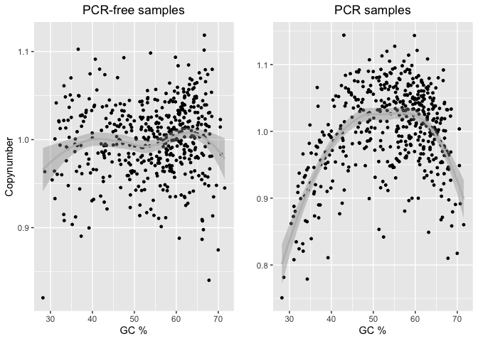<!-- --> The PCR-free
samples are showing a linear correlation (more or less) with the GC
content, meaning that the GC content is not having a great impact on the
copynumber estimates of SCGs. On the other hand, PCR based samples are
showing a strong GC bias, with SGCs with high or low GC content being
underepresented. The fit of this biased samples in more like an inverted
parabola.

## Explore the GC bias in PCR-free samples

But are we sure that all the PCR-free samples do not show the GC bias?
Can the PCA run an TE copy number being influenced by this bias? Here I
investigate the GC bias for 3 samples from the “African-Papuan” cluster
and 3 samples from the “Eurasian-American” cluster, the two main cluster
in our PCA.

``` r
scg <- function(data, id){
  data %>% filter(type=="scg", ID==id) %>% inner_join(gc, by="familyname") %>% ggplot(aes(GC_content, copynumber)) +
  geom_point(size=1)+geom_smooth(method = "loess", color="grey", se=T) + ylab("") + xlab("GC %") + ggtitle(paste0("Single copy genes - ", id)) + theme(plot.title = element_text(hjust = 0.5))
}

scg_parabola <- function(data, id){
  data %>% filter(type=="scg", ID==id) %>% inner_join(gc, by="familyname") %>% ggplot(aes(GC_content, copynumber)) +
  geom_point(size=1)+geom_smooth(method = "lm", color="grey", se=T, formula = y~poly(x,2)) + ylab("") + xlab("GC %") + ggtitle(paste0("Single copy genes - ", id)) + theme(plot.title = element_text(hjust = 0.5))
}

scg_parabola(HGDP, "HGDP00465")
```

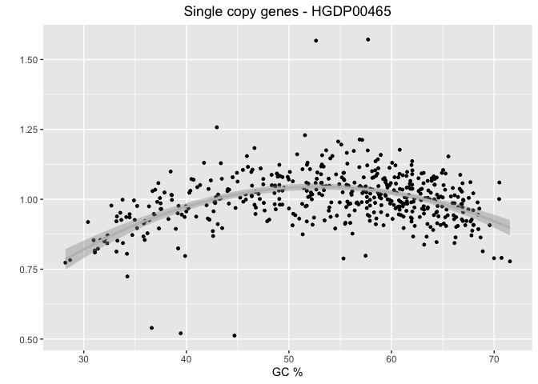<!-- -->

``` r
scg_parabola(HGDP, "HGDP00981")
```

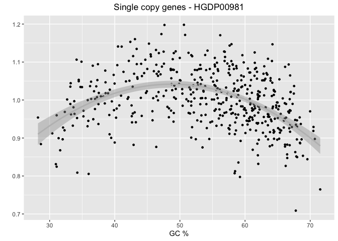<!-- -->

``` r
scg_parabola(HGDP, "HGDP01097")
```

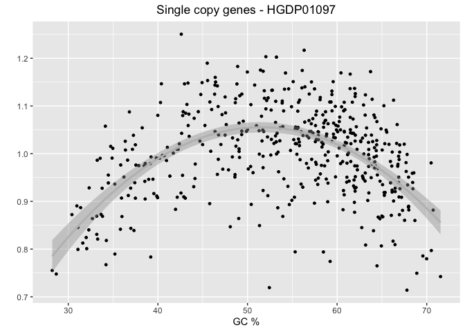<!-- -->

``` r
scg_parabola(HGDP, "HGDP00023")
```

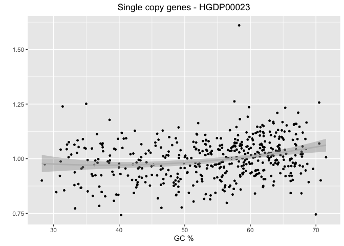<!-- -->

``` r
scg_parabola(HGDP, "HGDP00197")
```

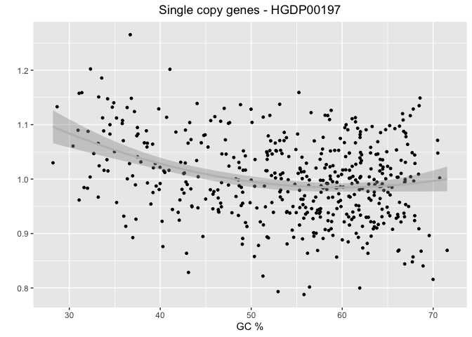<!-- -->

``` r
scg_parabola(HGDP, "HGDP01403")
```

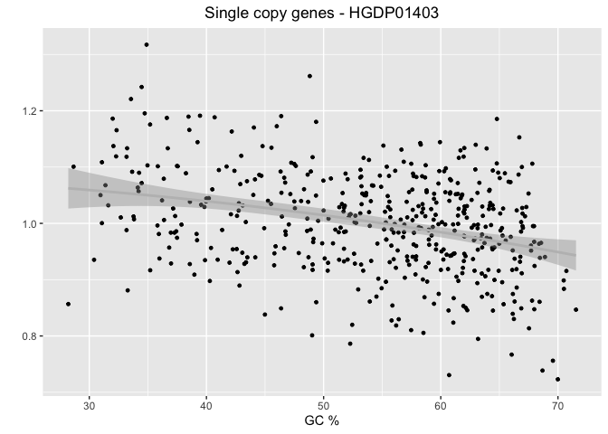<!-- -->

Interestingly, the “African-Papuan” cluster shows the GC bias, the other
cluster does not.

To confirm this observation and to wide the analysis to all the samples,
I do the following steps:

- Create a scatter plot that shows the correlation between the
  **GC-content (x)** and the **copy number estimate (y)** for all the
  **SCGs** in a sample
- Fit the scatter plot with a parabola with function:
  $copynumber = a + b * GC_content + c * (GC_content)^2$ The **“a”**
  parameter controls the direction and the width of the parabola. When
  “a” is positive, the parabola opens upwards. When “a” is negative, the
  parabola opens downwards. The greater the absolute value of “a”, the
  narrower the parabola. The **“b”** parameter controls the horizontal
  shift of the parabola. When “b” is positive, the parabola shifts to
  the right. When “b” is negative, the parabola shifts to the left. The
  **“c”** parameter controls the vertical shift of the parabola. When
  “c” is positive, the parabola shifts upward. When “c” is negative, the
  parabola shifts downward.
- We are interested in the **a** parameter, because its value can
  distinguish between a **narrow parabola** (high a value) and a very
  **wide parabola** (low a value). Thus, **if a is low, the sample is
  not showing a strong GC bias. If a is high, the GC bias is present and
  stronger as a increases**.

``` r
all_parabolas <- function(data){
  quadratic_coef_tibble <- tibble()
  data_subset <- data %>% filter(type=="scg") %>% inner_join(gc, by="familyname") %>% select(ID, familyname, copynumber, GC_content)
  for (id in unique(data_subset$ID)) {
    fit <- lm(copynumber ~ poly(GC_content, 2), data = data_subset %>% filter(ID == id))
    quadratic_coef <- summary(fit)$coefficients[3,1]
    quadratic_coef_tibble <- rbind(quadratic_coef_tibble, tibble(ID = id, a = quadratic_coef))
  }
  return(quadratic_coef_tibble)
}

a_HGDP <- all_parabolas(HGDP)
a_SGDP <- all_parabolas(SGDP)

(joined_HGDP <- inner_join(HGDP, a_HGDP, by="ID") %>% filter(type=="te"))
```

    ## # A tibble: 799,020 × 11
    ##    ID       pop   sex   country type  famil…¹ length  reads copyn…² batch      a
    ##    <chr>    <chr> <chr> <chr>   <chr> <chr>    <dbl>  <dbl>   <dbl> <chr>  <dbl>
    ##  1 HGDP000… Brah… male  Centra… te    LTR65      669 1.10e3 6.57e+0 ro    -0.830
    ##  2 HGDP000… Brah… male  Centra… te    HERVK3I   7242 3.89e4 2.15e+1 ro    -0.830
    ##  3 HGDP000… Brah… male  Centra… te    HERV9     8399 3.12e5 1.49e+2 ro    -0.830
    ##  4 HGDP000… Brah… male  Centra… te    L1PA12…   3072 6.41e4 8.36e+1 ro    -0.830
    ##  5 HGDP000… Brah… male  Centra… te    LTR27C     767 3.13e3 1.63e+1 ro    -0.830
    ##  6 HGDP000… Brah… male  Centra… te    LTR16A1    457 4.14e2 3.63e+0 ro    -0.830
    ##  7 HGDP000… Brah… male  Centra… te    Tigger…    933 9.32e0 4.01e-2 ro    -0.830
    ##  8 HGDP000… Brah… male  Centra… te    LTR23      437 7.70e3 7.06e+1 ro    -0.830
    ##  9 HGDP000… Brah… male  Centra… te    X32_DNA    336 4.38e1 5.22e-1 ro    -0.830
    ## 10 HGDP000… Brah… male  Centra… te    LTR53      519 1.36e3 1.05e+1 ro    -0.830
    ## # … with 799,010 more rows, and abbreviated variable names ¹​familyname,
    ## #   ²​copynumber

``` r
joined_SGDP <- inner_join(SGDP, a_SGDP, by="ID") %>% filter(type=="te")

joined_HGDP_nopcr <- inner_join(HGDP_pcr_free, a_HGDP, by="ID") %>% filter(type=="te") 
joined_SGDP_nopcr <- inner_join(SGDP_pcr_free, a_SGDP, by="ID") %>% filter(type=="te")
```

We create our PCA on TE copy number but coloring the data for the value
of “a” that we use to quantify the GC bias.

``` r
PCA_GC_parabolas <- function(data, title){
  m <- filter(data, sex=='male')
  f <- filter(data, sex=='female')
  len <- length(unique(data$familyname))
  males <- length(unique(m$ID))
  females <- length(unique(f$ID))

  f_matrix<-matrix(as.vector(f$copynumber),nrow=females,ncol=len,byrow=T)
  f_fram <-data.frame(f_matrix)
  names(f_fram)<-unique(f$familyname)
  f_fram <- f_fram %>% select_if(negate(function(col) sd(col)==0))
  f_matrixcont<-matrix(as.vector(f$country),nrow=females,ncol=len,byrow=T)
  f_framcont<-data.frame(f_matrixcont)
  f_rsqrcol<-unique(f$a)

   m_matrix<-matrix(as.vector(m$copynumber),nrow=males,ncol=len,byrow=T)
   m_fram<-data.frame(m_matrix)
   names(m_fram)<-unique(m$familyname)
   m_fram <- m_fram %>% select_if(negate(function(col) sd(col)==0))
   m_matrixcont<-matrix(as.vector(m$country),nrow=males,ncol=len,byrow=T)
   m_framcont<-data.frame(m_matrixcont)
   m_rsqrcol<-unique(m$a)
  
    fHGDP.pca <- prcomp(f_fram, center = TRUE, scale = TRUE)
    f_var <- summary(fHGDP.pca)$importance[2,1]

fHGDP.pca <- prcomp(f_fram, center = TRUE, scale = TRUE)
f_var1 <- summary(fHGDP.pca)$importance[2,1]
f_var2 <- summary(fHGDP.pca)$importance[2,2]

f_PCA <- ggplot(data=f_fram, aes(x=fHGDP.pca$x[,1], y=fHGDP.pca$x[,2], color = f_rsqrcol)) + 
  geom_point() + 
  ggtitle("Females") + 
  xlab(paste0("PC1 (", round(f_var1,3)*100,"%)")) + 
  ylab(paste0("PC2 (",round(f_var2,3)*100,"%)")) + 
  theme(plot.title = element_text(size = 8, hjust = 0.5)) + 
  guides(col = guide_colourbar(title = "Parabola quadratic coefficient"))

mHGDP.pca <- prcomp(m_fram, center = TRUE, scale = TRUE)
m_var1 <- summary(mHGDP.pca)$importance[2,1]
m_var2 <- summary(mHGDP.pca)$importance[2,2]

m_PCA <- ggplot(data=m_fram, aes(x=mHGDP.pca$x[,1], y=mHGDP.pca$x[,2], color = m_rsqrcol)) +
geom_point() +
ggtitle("Males") +
xlab(paste0("PC1 (", round(m_var1,3)*100,"%)")) +
ylab(paste0("PC2 (",round(m_var2,3)*100,"%)")) +
theme(plot.title = element_text(size = 8, hjust = 0.5)) +
guides(col = guide_colourbar(title = "Parabola quadratic coefficient"))

      figure <- ggarrange(f_PCA, m_PCA, ncol = 2, nrow = 1, common.legend = FALSE, legend = "bottom", font.label = list(size = 10, color = "black", face = "bold", family = NULL, position = "top"))
   
    annotate_figure(figure, top = text_grob(title, color = "black", size = 20), fig.lab = "")
}

PCA_GC_parabolas(joined_HGDP, "HGDP - all samples")
```

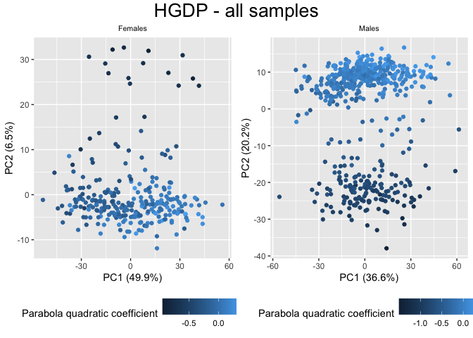<!-- -->

``` r
PCA_GC_parabolas(joined_SGDP, "SGDP - all samples")
```

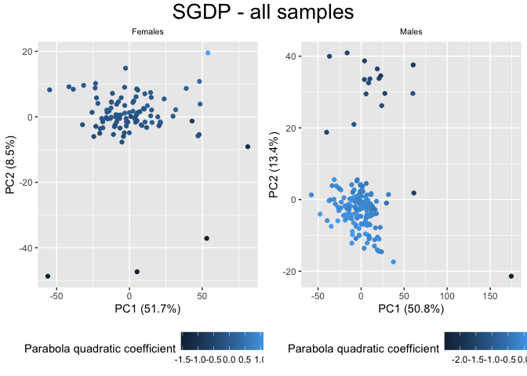<!-- -->

The above PCAs are considering **all the samples**, thus not excluding
the PCR samples from the data sets. As expected, the clustering is
strongly dependent on the GC bias. But does this bias remaing when we
only consider PCR-free samples?

``` r
PCA_GC_parabolas(joined_HGDP_nopcr, "HGDP - PCR free")
```

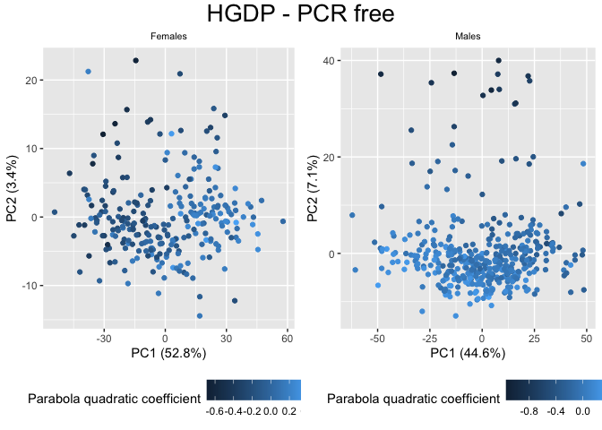<!-- -->

``` r
PCA_GC_parabolas(joined_SGDP_nopcr, "SGDP - PCR free")
```

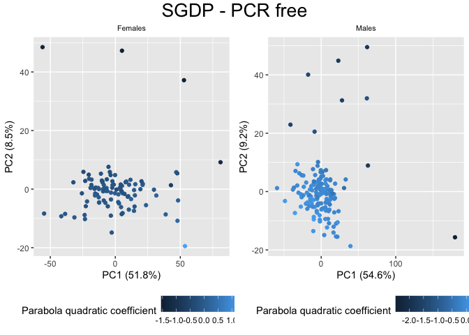<!-- -->

Yes!

### Exploring other PCs

``` r
PCA_otherPC_GC <- function(data, title, PCx, PCy){
  m <- filter(data, sex=='male')
  f <- filter(data, sex=='female')
  len <- length(unique(data$familyname))
  males <- length(unique(m$ID))
  females <- length(unique(f$ID))

  f_matrix<-matrix(as.vector(f$copynumber),nrow=females,ncol=len,byrow=T)
  f_fram <-data.frame(f_matrix)
  names(f_fram)<-unique(f$familyname)
  f_fram <- f_fram %>% select_if(negate(function(col) sd(col)==0))
  f_matrixcont<-matrix(as.vector(f$country),nrow=females,ncol=len,byrow=T)
  f_framcont<-data.frame(f_matrixcont)
  f_rsqrcol<-unique(f$a)
  
   m_matrix<-matrix(as.vector(m$copynumber),nrow=males,ncol=len,byrow=T)
   m_fram<-data.frame(m_matrix)
   names(m_fram)<-unique(m$familyname)
   m_fram <- m_fram %>% select_if(negate(function(col) sd(col)==0))
   m_matrixcont<-matrix(as.vector(m$country),nrow=males,ncol=len,byrow=T)
   m_framcont<-data.frame(m_matrixcont)
   m_rsqrcol<-unique(m$a)

fHGDP.pca <- prcomp(f_fram, center = TRUE, scale = TRUE)
f_var1 <- summary(fHGDP.pca)$importance[2,PCx]
f_var2 <- summary(fHGDP.pca)$importance[2,PCy]

f_PCA <- ggplot(data=f_fram, aes(x=fHGDP.pca$x[,PCx], y=fHGDP.pca$x[,PCy], color = f_rsqrcol)) + 
  geom_point() + 
  ggtitle("Females") + 
  xlab(paste0("PC", PCx, " (", round(f_var1,3)*100,"%)")) + 
  ylab(paste0("PC", PCy, " (",round(f_var2,3)*100,"%)")) + 
  theme(plot.title = element_text(size = 8, hjust = 0.5)) +
guides(col = guide_colourbar(title = "Parabola quadratic coefficient")) 

mHGDP.pca <- prcomp(m_fram, center = TRUE, scale = TRUE)
m_var1 <- summary(mHGDP.pca)$importance[2,PCx]
m_var2 <- summary(mHGDP.pca)$importance[2,PCy]

m_PCA <- ggplot(data=m_fram, aes(x=mHGDP.pca$x[,PCx], y=mHGDP.pca$x[,PCy], color = m_rsqrcol)) +
geom_point() +
ggtitle("Males") +
xlab(paste0("PC", PCx, " (", round(f_var1,3)*100,"%)")) + 
ylab(paste0("PC", PCy, " (",round(f_var2,3)*100,"%)")) + 
theme(plot.title = element_text(size = 8, hjust = 0.5))  +
guides(col = guide_colourbar(title = "Parabola quadratic coefficient")) 

figure <- ggarrange(f_PCA, m_PCA, ncol = 2, nrow = 1, common.legend = TRUE, legend = "bottom", font.label = list(size = 10, color = "black", face = "bold", family = NULL, position = "top"))
   
annotate_figure(figure, top = text_grob(title, color = "black", size = 20), fig.lab = "")
}

PCA_otherPC_GC(joined_HGDP, "HGDP - all samples", 1, 3)
```

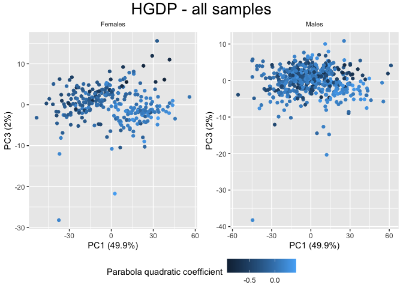<!-- -->

``` r
PCA_otherPC_GC(joined_SGDP, "SGDP - all samples", 1, 3)
```

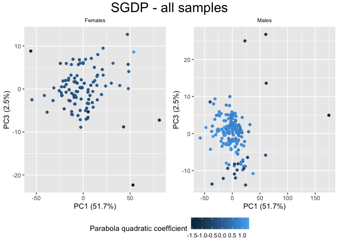<!-- --> \## SNPs

``` r
SNP_GC <- function(freq_matrix, metadata, title){

matrix <- read_csv(freq_matrix)
  
f_metadata <- metadata %>% filter(sex=="female") %>% select(ID, sex, country, pop, a) %>% distinct()
m_metadata <- metadata %>% filter(sex=="male") %>% select(ID, sex, country, pop, a) %>% distinct()
males_matrix <- filter(matrix, ID %in% m_metadata$ID) %>% select(!(ID))
females_matrix <- filter(matrix, ID %in% f_metadata$ID) %>% select(!(ID))

f_pca_data <- females_matrix %>% select_if(negate(function(col) sd(col)==0))
m_pca_data <- males_matrix %>% select_if(negate(function(col) sd(col)==0))

f_pca_result <- prcomp(f_pca_data, center = TRUE, scale = TRUE)
m_pca_result <- prcomp(m_pca_data, center = TRUE, scale = TRUE)
  
f_var_explained <- f_pca_result$sdev^2/sum(f_pca_result$sdev^2)
m_var_explained <- m_pca_result$sdev^2/sum(m_pca_result$sdev^2)
   
f <- f_pca_result$x %>% as_tibble() %>% add_column(.before = 1, ID=f_metadata$ID, sex=f_metadata$sex, pop=f_metadata$pop, country=f_metadata$country, a=f_metadata$a) %>% as.data.frame() %>%
 ggplot(aes(x=PC1,y=PC2, color=a)) + geom_point(size=2) +
labs(x=paste0("PC1: ",round(f_var_explained[1]*100,1),"%"),
        y=paste0("PC2: ",round(f_var_explained[2]*100,1),"%")) + ggtitle(title) +
 theme(plot.title = element_text(hjust = 0.5)) +
guides(col = guide_colourbar(title = "Parabola quadratic coefficient")) 
   
  m <- m_pca_result$x %>% as_tibble() %>% add_column(.before = 1, ID=m_metadata$ID, sex=m_metadata$sex, pop=m_metadata$pop, country=m_metadata$country, a=m_metadata$a) %>% as.data.frame() %>%
  ggplot(aes(x=PC1,y=PC2, color=a)) + geom_point(size=2) +
   labs(x=paste0("PC1: ",round(m_var_explained[1]*100,1),"%"),
        y=paste0("PC2: ",round(m_var_explained[2]*100,1),"%")) + ggtitle(title) +
 theme(plot.title = element_text(hjust = 0.5)) +
guides(col = guide_colourbar(title = "Parabola quadratic coefficient")) 
 
ggarrange(f, m, ncol = 2, nrow = 1, common.legend = TRUE, legend = "bottom", align = "hv", font.label = list(size = 10, color = "black", face = "bold", family = NULL, position = "top"))
  }
```

``` r
SNP_GC("/Volumes/Temp1/rpianezza/TE/SNP/try04/separed.all.08.5000x.matrix.tsv", joined_HGDP, "HGDP - all samples")
```

    ## Rows: 828 Columns: 69481
    ## ── Column specification ────────────────────────────────────────────────────────
    ## Delimiter: ","
    ## chr     (1): ID
    ## dbl (69480): HERV9_te_78A, HERV9_te_78T, HERV9_te_78C, HERV9_te_78G, HERV9_t...
    ## 
    ## ℹ Use `spec()` to retrieve the full column specification for this data.
    ## ℹ Specify the column types or set `show_col_types = FALSE` to quiet this message.

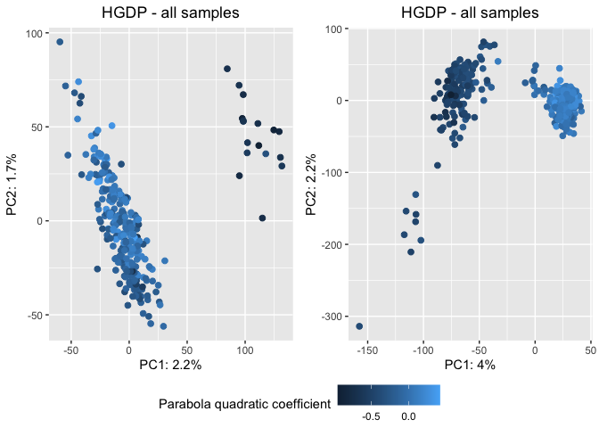<!-- -->

``` r
SNP_GC("/Volumes/Temp1/rpianezza/TE/SNP/try04/separed.all.08.5000x.matrix.tsv", joined_HGDP_nopcr, "HGDP - pcr-free samples")
```

    ## Rows: 828 Columns: 69481
    ## ── Column specification ────────────────────────────────────────────────────────
    ## Delimiter: ","
    ## chr     (1): ID
    ## dbl (69480): HERV9_te_78A, HERV9_te_78T, HERV9_te_78C, HERV9_te_78G, HERV9_t...
    ## 
    ## ℹ Use `spec()` to retrieve the full column specification for this data.
    ## ℹ Specify the column types or set `show_col_types = FALSE` to quiet this message.

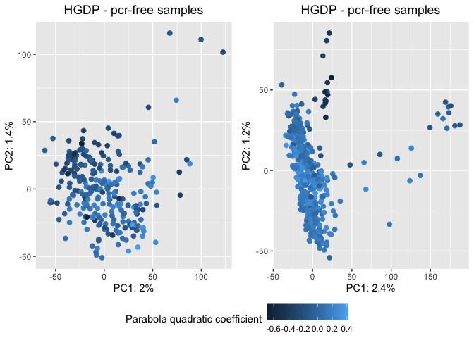<!-- -->

``` r
SNP_GC("/Volumes/Temp1/rpianezza/SGDP/SNP/separed.all.08.5000x.matrix.tsv", joined_SGDP, "SGDP - all samples")
```

    ## Rows: 276 Columns: 66289
    ## ── Column specification ────────────────────────────────────────────────────────
    ## Delimiter: ","
    ## chr     (1): ID
    ## dbl (66288): HERV9_te_79A, HERV9_te_79T, HERV9_te_79C, HERV9_te_79G, HERV9_t...
    ## 
    ## ℹ Use `spec()` to retrieve the full column specification for this data.
    ## ℹ Specify the column types or set `show_col_types = FALSE` to quiet this message.

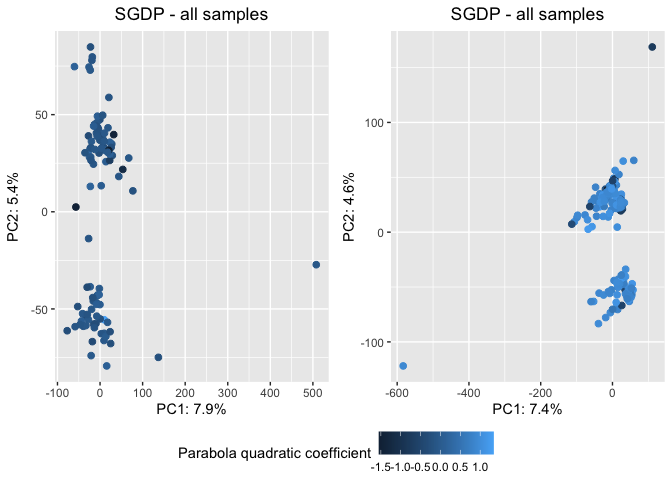<!-- -->

``` r
SNP_GC("/Volumes/Temp1/rpianezza/SGDP/SNP/separed.all.08.5000x.matrix.tsv", joined_SGDP_nopcr, "SGDP - pcr-free samples")
```

    ## Rows: 276 Columns: 66289
    ## ── Column specification ────────────────────────────────────────────────────────
    ## Delimiter: ","
    ## chr     (1): ID
    ## dbl (66288): HERV9_te_79A, HERV9_te_79T, HERV9_te_79C, HERV9_te_79G, HERV9_t...
    ## 
    ## ℹ Use `spec()` to retrieve the full column specification for this data.
    ## ℹ Specify the column types or set `show_col_types = FALSE` to quiet this message.

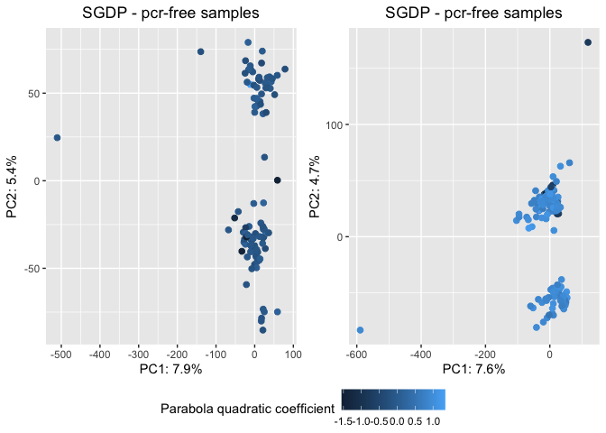<!-- -->
