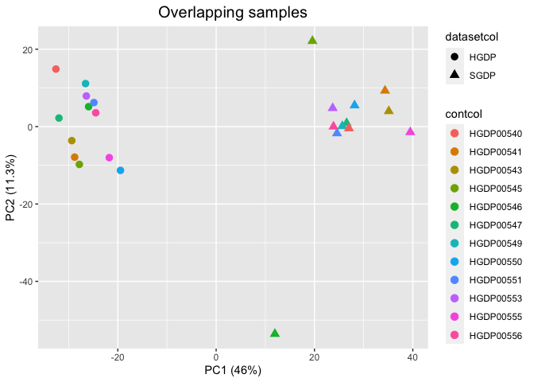

Copynumber PCA for the overlapping samples (HGDP and SGDP)
================

``` r
library(tidyverse)
```

    ## ── Attaching packages ─────────────────────────────────────── tidyverse 1.3.2 ──
    ## ✔ ggplot2 3.4.0      ✔ purrr   0.3.4 
    ## ✔ tibble  3.1.8      ✔ dplyr   1.0.10
    ## ✔ tidyr   1.2.1      ✔ stringr 1.4.1 
    ## ✔ readr   2.1.2      ✔ forcats 0.5.2 
    ## ── Conflicts ────────────────────────────────────────── tidyverse_conflicts() ──
    ## ✖ dplyr::filter() masks stats::filter()
    ## ✖ dplyr::lag()    masks stats::lag()

``` r
HGDP<-read_delim("/Volumes/Temp1/rpianezza/TE/summary-HGDP/USEME_HGDP_complete_reflib6.2_mq10_batchinfo_cutoff0.01.txt")
```

    ## Rows: 1394352 Columns: 10
    ## ── Column specification ────────────────────────────────────────────────────────
    ## Delimiter: ","
    ## chr (7): ID, Pop, sex, Country, type, familyname, batch
    ## dbl (3): length, reads, copynumber
    ## 
    ## ℹ Use `spec()` to retrieve the full column specification for this data.
    ## ℹ Specify the column types or set `show_col_types = FALSE` to quiet this message.

``` r
names(HGDP)<-c("ID","pop","sex","country","type","familyname","length","reads","copynumber","batch")

SGDP <- read_tsv("/Volumes/Temp2/rpianezza/SGDP/summary/USEME_SGDP_cutoff") %>% dplyr::rename(ID=biosample)
```

    ## Rows: 470028 Columns: 10
    ## ── Column specification ────────────────────────────────────────────────────────
    ## Delimiter: "\t"
    ## chr (7): biosample, sex, pop, country, type, familyname, batch
    ## dbl (3): length, reads, copynumber
    ## 
    ## ℹ Use `spec()` to retrieve the full column specification for this data.
    ## ℹ Specify the column types or set `show_col_types = FALSE` to quiet this message.

``` r
HGDP_samples <- HGDP %>% select(ID) %>% distinct()
SGDP_samples <- read_tsv("/Volumes/Temp1/rpianezza/SGDP/metadata/SGDP_metadata.tsv") %>% select(sample) %>% dplyr::rename(ID=sample) %>% distinct()
```

    ## Rows: 276 Columns: 7
    ## ── Column specification ────────────────────────────────────────────────────────
    ## Delimiter: "\t"
    ## chr (5): sample, biosample, sex, pop, country
    ## dbl (2): latitude, longitude
    ## 
    ## ℹ Use `spec()` to retrieve the full column specification for this data.
    ## ℹ Specify the column types or set `show_col_types = FALSE` to quiet this message.

``` r
SGDP_samples_all <- read_tsv("/Volumes/Temp1/rpianezza/SGDP/metadata/SGDP_metadata.tsv") %>% select(c(biosample, sample)) %>% dplyr::rename(ID=biosample)
```

    ## Rows: 276 Columns: 7
    ## ── Column specification ────────────────────────────────────────────────────────
    ## Delimiter: "\t"
    ## chr (5): sample, biosample, sex, pop, country
    ## dbl (2): latitude, longitude
    ## 
    ## ℹ Use `spec()` to retrieve the full column specification for this data.
    ## ℹ Specify the column types or set `show_col_types = FALSE` to quiet this message.

``` r
SGDP_correct <- inner_join(SGDP_samples_all, SGDP, by="ID") %>% dplyr::rename(biosample=ID, ID=sample)

overlap_samples <- inner_join(SGDP_samples, HGDP_samples, by="ID")
overlap_HGDP <- HGDP %>% inner_join(overlap_samples, by="ID")
overlap_HGDP$dataset <- "HGDP"
overlap_SGDP <- SGDP_correct %>% inner_join(overlap_samples, by="ID")
overlap_SGDP$dataset <- "SGDP"

HGDP_fam <- HGDP %>% select(familyname) %>% distinct()
SGDP_fam <- SGDP %>% select(familyname) %>% distinct()
overlap_familyname <- inner_join(HGDP_fam, SGDP_fam, by="familyname") %>% distinct() %>% pull()
overlappableHGDP <- overlap_HGDP %>% filter(familyname %in% overlap_familyname)
overlappableSGDP <- overlap_SGDP %>% filter(familyname %in% overlap_familyname)

overlap <- bind_rows(overlappableHGDP, overlappableSGDP) %>% select(c(ID, sex, country, pop, familyname, copynumber, dataset))
```

``` r
PCA <- function(data, title){
  len <- length(unique(data$familyname))
  ind <- length(unique(data$ID))*2

  matrix<-matrix(as.vector(data$copynumber),nrow=ind,ncol=len,byrow=T)
  fram <-data.frame(matrix)
  names(fram)<-unique(data$familyname)
  fram <- fram %>% select_if(negate(function(col) sd(col)==0))
  matrixcont<-matrix(as.vector(data$ID),nrow=ind,ncol=len,byrow=T)
  framcont<-data.frame(matrixcont)
  matrixdataset<-matrix(as.vector(data$dataset),nrow=ind,ncol=len,byrow=T)
  framdataset<-data.frame(matrixdataset)
  contcol<-c(framcont$X1)
  datasetcol<-c(framdataset$X1)
  
data.pca <- prcomp(fram, center = TRUE, scale = TRUE)
   var1 <- summary(data.pca)$importance[2,1]
   var2 <- summary(data.pca)$importance[2,2]
 
 (PCAplot <- ggplot(data=fram, aes(x=data.pca$x[,1], y=data.pca$x[,2], shape = datasetcol, color = contcol)) + 
   geom_point(size=3) + 
   ggtitle(title) + 
   xlab(paste0("PC1 (", round(var1,3)*100,"%)")) + 
   ylab(paste0("PC2 (",round(var2,3)*100,"%)")) +
    theme(plot.title = element_text(size = 15, hjust = 0.5)))
}
```

``` r
PCA(overlap, "Overlapping samples")
```

<!-- -->
