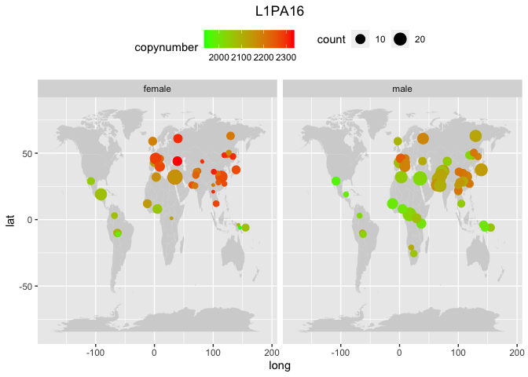
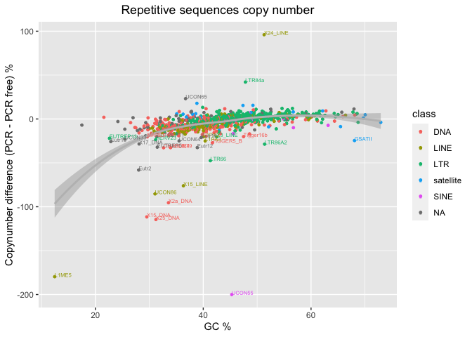

Why the results in the two datasets are that different?
================

After processing the SGDP data set, the results were ambiguous. While
the most variable TEs are confirmed in both the datasets as well as the
most divergent among sexes, the geographical pattern disappeared both in
the world maps and in the copynumbers PCA. Let’s try to understand why.

``` r
library(tidyverse)
```

    ## ── Attaching packages ─────────────────────────────────────── tidyverse 1.3.2 ──
    ## ✔ ggplot2 3.4.0      ✔ purrr   0.3.4 
    ## ✔ tibble  3.1.8      ✔ dplyr   1.0.10
    ## ✔ tidyr   1.2.1      ✔ stringr 1.4.1 
    ## ✔ readr   2.1.2      ✔ forcats 0.5.2 
    ## ── Conflicts ────────────────────────────────────────── tidyverse_conflicts() ──
    ## ✖ dplyr::filter() masks stats::filter()
    ## ✖ dplyr::lag()    masks stats::lag()

## Check the amount of unmapped reads in both the datasets

We expect the amount of unmapped reads in the two datasets to be
slightly different due to different sequencing methods and read length.
If the differences are huge, it’s not expected. We downloaded 3 samples
for each dataset.

This command subset the full cram file into a file containing only the
unmapped reads.

    samtools view -f 4 /Volumes/Temp2/rpianezza/testing_unmapped_reads/HGDP01303.alt_bwamem_GRCh38DH.20181023.Uygur.cram >> /Volumes/Temp2/rpianezza/testing_unmapped_reads/unmapped_HGDP_HGDP01303

This create an output file with the number of reads of each cram file.

    find /Volumes/Temp2/rpianezza/testing_unmapped_reads -name '*.cram' -exec sh -c 'echo $(samtools view -c {}) $(basename {}) >> /Volumes/Temp2/rpianezza/testing_unmapped_reads/wc.tsv' \; 

I manually conclude the file that I read here:

``` r
(unmapped <- read_tsv("/Volumes/Temp2/rpianezza/testing_unmapped_reads/wc.tsv") %>% mutate(unmapped = all-mapped) %>% mutate(freq_unmapped = unmapped/all))
```

    ## Rows: 6 Columns: 3
    ## ── Column specification ────────────────────────────────────────────────────────
    ## Delimiter: "\t"
    ## chr (1): sample
    ## dbl (2): all, mapped
    ## 
    ## ℹ Use `spec()` to retrieve the full column specification for this data.
    ## ℹ Specify the column types or set `show_col_types = FALSE` to quiet this message.

    ## # A tibble: 6 × 5
    ##          all     mapped sample       unmapped freq_unmapped
    ##        <dbl>      <dbl> <chr>           <dbl>         <dbl>
    ## 1  828828382  818263959 HGDP00205    10564423        0.0127
    ## 2  811561168  801569430 HGDP00462     9991738        0.0123
    ## 3  789336456  780923746 HGDP01303     8412710        0.0107
    ## 4 1274426418 1255193501 SAMEA3302647 19232917        0.0151
    ## 5 2460287722 2428879697 SAMEA3302685 31408025        0.0128
    ## 6 1313167612 1265895791 SAMEA3302706 47271821        0.0360

The differences are small, and probably explainable from the different
rl.

## Sequencing libraries bias

In the HGDP supplement, it’s reported that some samples are produced
using PCR, while the vast majority is PCR-free. Let’s see if it has an
impact.

``` r
HGDP<-read_delim("/Volumes/Temp1/rpianezza/TE/summary-HGDP/USEME_HGDP_complete_reflib6.2_mq10_batchinfo_cutoff0.01.txt")
```

    ## Rows: 1394352 Columns: 10
    ## ── Column specification ────────────────────────────────────────────────────────
    ## Delimiter: ","
    ## chr (7): ID, Pop, sex, Country, type, familyname, batch
    ## dbl (3): length, reads, copynumber
    ## 
    ## ℹ Use `spec()` to retrieve the full column specification for this data.
    ## ℹ Specify the column types or set `show_col_types = FALSE` to quiet this message.

``` r
names(HGDP)<-c("ID","pop","sex","country","type","familyname","length","reads","copynumber","batch")

(libraries <- read_tsv("/Volumes/Temp1/rpianezza/investigation/libraries_HGDP_by_pop.tsv", col_names = c("pop", "country", "latitude", "longitude", "PCR_free", "PCR"), skip=1) %>% select(c(pop, latitude, longitude, PCR_free, PCR)))
```

    ## Rows: 54 Columns: 6
    ## ── Column specification ────────────────────────────────────────────────────────
    ## Delimiter: "\t"
    ## chr (2): pop, country
    ## dbl (4): latitude, longitude, PCR_free, PCR
    ## 
    ## ℹ Use `spec()` to retrieve the full column specification for this data.
    ## ℹ Specify the column types or set `show_col_types = FALSE` to quiet this message.

    ## # A tibble: 54 × 5
    ##    pop              latitude longitude PCR_free   PCR
    ##    <chr>               <dbl>     <dbl>    <dbl> <dbl>
    ##  1 Adygei               44        39         11     3
    ##  2 Balochi              30.5      66.5       19     3
    ##  3 BantuKenya           -3        37          0     9
    ##  4 BantuSouthAfrica    -25.6      24.2        1     3
    ##  5 Basque               43         0         21     0
    ##  6 Bedouin              31        35         41     3
    ##  7 BergamoItalian       46        10         10     0
    ##  8 Biaka                 4        17          3    17
    ##  9 Bougainville         -6       155          5     4
    ## 10 Brahui               30.5      66.5       20     3
    ## # … with 44 more rows

``` r
by_pop <- filter(HGDP, type=='te') %>% group_by(pop, country, familyname, sex) %>% dplyr::summarise(sd=sd(copynumber), copynumber = mean(copynumber), count=n())
```

    ## `summarise()` has grouped output by 'pop', 'country', 'familyname'. You can
    ## override using the `.groups` argument.

``` r
data <- inner_join(libraries, by_pop, by = "pop") %>% type_convert()
```

    ## 
    ## ── Column specification ────────────────────────────────────────────────────────
    ## cols(
    ##   pop = col_character(),
    ##   country = col_character(),
    ##   familyname = col_character(),
    ##   sex = col_character()
    ## )

``` r
(somma <- summarise(libraries, PCR_free=sum(PCR_free), PCR=sum(PCR)))
```

    ## # A tibble: 1 × 2
    ##   PCR_free   PCR
    ##      <dbl> <dbl>
    ## 1      649   152

``` r
plot_map <- function(data, famname){
TE <- filter(data, familyname == famname)
world_map = map_data("world")

ggplot() +
  geom_map(
    data = world_map, map = world_map,
    aes(long, lat, map_id = region),
    color = "white", fill = "lightgray", size = 0) +
  geom_point(
    data = TE, aes(x=longitude, y=latitude, color = copynumber, size = count)
  ) + geom_errorbar() + theme(legend.position="top") + scale_colour_gradient(low = "green", high = "red") + theme(plot.title = element_text(hjust = 0.5)) +
  facet_wrap(~sex) + ggtitle(famname)}

plot_libraries <- function(data, famname){
TE <- data %>% select(c(pop, latitude, longitude, PCR_free, PCR, sex, count)) %>% mutate(pcr_freq = PCR/(PCR_free+PCR))
world_map = map_data("world")

ggplot() +
  geom_map(
    data = world_map, map = world_map,
    aes(long, lat, map_id = region),
    color = "white", fill = "lightgray", size = 0) +
  geom_point(
    data = TE, aes(x=longitude, y=latitude, color = pcr_freq, size = count)
  ) + geom_errorbar() + theme(legend.position="top") + scale_colour_gradient(low = "green", high = "red") + theme(plot.title = element_text(hjust = 0.5)) +
  facet_wrap(~sex) + ggtitle(famname)}
```

``` r
plot_map(data, "L1PA16")
```

    ## Warning: Using `size` aesthetic for lines was deprecated in ggplot2 3.4.0.
    ## ℹ Please use `linewidth` instead.

    ## Warning in geom_map(data = world_map, map = world_map, aes(long, lat, map_id =
    ## region), : Ignoring unknown aesthetics: x and y

<!-- -->

``` r
plot_libraries(data, "PCR-libraries")
```

    ## Warning in geom_map(data = world_map, map = world_map, aes(long, lat, map_id =
    ## region), : Ignoring unknown aesthetics: x and y

<!-- -->

Wow. We can conclude that at, least partially, our geographic pattern IS
influenced by this. I can filter the PCR samples from both the data sets
(152 in HGDP, 16 in SGDP).

``` r
no_pcr <- read_tsv("/Volumes/Temp1/rpianezza/investigation/SGDP_no_PCR.tsv", col_names = c("url",   "md5",  "Data_collection", "Data_type", "Analysis_group", "Sample", "Population", "Data reuse policy")) %>% select(Sample)
```

    ## Rows: 262 Columns: 8
    ## ── Column specification ────────────────────────────────────────────────────────
    ## Delimiter: "\t"
    ## chr (8): url, md5, Data_collection, Data_type, Analysis_group, Sample, Popul...
    ## 
    ## ℹ Use `spec()` to retrieve the full column specification for this data.
    ## ℹ Specify the column types or set `show_col_types = FALSE` to quiet this message.

``` r
#write_tsv(no_pcr, "/Volumes/Temp1/rpianezza/investigation/SGDP-only-pcr-free-samples.tsv")
```

``` r
sgdp_pcr_free <- read_tsv("/Volumes/Temp1/rpianezza/investigation/SGDP-only-pcr-free-samples.tsv", col_names = "sample")
```

    ## Rows: 263 Columns: 1
    ## ── Column specification ────────────────────────────────────────────────────────
    ## Delimiter: "\t"
    ## chr (1): sample
    ## 
    ## ℹ Use `spec()` to retrieve the full column specification for this data.
    ## ℹ Specify the column types or set `show_col_types = FALSE` to quiet this message.

``` r
sgdp_metadata <- read_tsv("/Volumes/Temp1/rpianezza/SGDP/metadata/SGDP_metadata.tsv") %>% select(sample, biosample)
```

    ## Rows: 276 Columns: 7
    ## ── Column specification ────────────────────────────────────────────────────────
    ## Delimiter: "\t"
    ## chr (5): sample, biosample, sex, pop, country
    ## dbl (2): latitude, longitude
    ## 
    ## ℹ Use `spec()` to retrieve the full column specification for this data.
    ## ℹ Specify the column types or set `show_col_types = FALSE` to quiet this message.

``` r
sgdp_pcr_free_samples <- inner_join(sgdp_pcr_free, sgdp_metadata, by="sample") %>% select(biosample) %>% dplyr::rename(ID=biosample)

#write_tsv(sgdp_pcr_free_samples, "/Volumes/Temp1/rpianezza/investigation/SGDP-no-PCR/SGDP-no-PCR.tsv")
```

### Check the effect of the GC bias

    python /Volumes/Temp1/rpianezza/GC-content/gc-content.py /Volumes/Temp1/rpianezza/GC-content/reflibrary_humans_v6.2.fasta -o /Volumes/Temp1/rpianezza/GC-content/gc-content.tsv

``` r
repbase <- read_tsv("/Volumes/Temp1/rpianezza/GC-content/repbase_full_classification.txt", col_names = c("familyname", "superfamily", "shared_with", "class"))
```

    ## Rows: 1387 Columns: 4
    ## ── Column specification ────────────────────────────────────────────────────────
    ## Delimiter: "\t"
    ## chr (4): familyname, superfamily, shared_with, class
    ## 
    ## ℹ Use `spec()` to retrieve the full column specification for this data.
    ## ℹ Specify the column types or set `show_col_types = FALSE` to quiet this message.

``` r
(gc <- read_tsv("/Volumes/Temp1/rpianezza/GC-content/gc-content.tsv"))
```

    ## Rows: 1703 Columns: 4
    ## ── Column specification ────────────────────────────────────────────────────────
    ## Delimiter: "\t"
    ## chr (2): familyname, type
    ## dbl (2): GC_content, length
    ## 
    ## ℹ Use `spec()` to retrieve the full column specification for this data.
    ## ℹ Specify the column types or set `show_col_types = FALSE` to quiet this message.

    ## # A tibble: 1,703 × 4
    ##    familyname type  GC_content length
    ##    <chr>      <chr>      <dbl>  <dbl>
    ##  1 LTR65      te          42.4    669
    ##  2 HERVK3I    te          42.4   7242
    ##  3 HERV9      te          45.5   8399
    ##  4 L1PA12_5   te          56.4   3072
    ##  5 LTR27C     te          54.0    767
    ##  6 LTR16A1    te          54.0    457
    ##  7 Tigger16a  te          46.8    933
    ##  8 LTR23      te          38.9    437
    ##  9 X32_DNA    te          29.8    336
    ## 10 LTR53      te          51.2    519
    ## # … with 1,693 more rows

``` r
repbase_gc <- inner_join(repbase, gc, by="familyname")

(class_gc <- repbase_gc %>% group_by(class) %>% dplyr::summarise(GC = mean(GC_content)) %>% arrange(desc(GC)))
```

    ## # A tibble: 6 × 2
    ##   class        GC
    ##   <chr>     <dbl>
    ## 1 satellite  50.1
    ## 2 SINE       48.9
    ## 3 LTR        47.8
    ## 4 LINE       41.4
    ## 5 DNA        39.8
    ## 6 <NA>       38.2

``` r
superfamily_gc <- repbase_gc %>% group_by(superfamily) %>% dplyr::summarise(GC = mean(GC_content), len=mean(length)) %>% arrange(desc(GC))
family_gc <- repbase_gc %>% group_by(familyname) %>% dplyr::summarise(GC = mean(GC_content), len=mean(length)) %>% arrange(desc(GC))

#(L1PA7_5 <- repbase_gc %>% filter(familyname=="L1PA7_5"))
```

``` r
classification <- read_tsv("/Volumes/Temp1/rpianezza/GC-content/repbase_full_classification.txt")
```

    ## Rows: 1386 Columns: 4
    ## ── Column specification ────────────────────────────────────────────────────────
    ## Delimiter: "\t"
    ## chr (4): familyname, superfamily, shared_with, class
    ## 
    ## ℹ Use `spec()` to retrieve the full column specification for this data.
    ## ℹ Specify the column types or set `show_col_types = FALSE` to quiet this message.

``` r
HGDP_pcr_free_samples <- read_tsv("/Volumes/Temp1/rpianezza/investigation/HGDP-no-PCR/HGDP-only-pcr-free-samples.tsv", col_names = "ID")
```

    ## Rows: 676 Columns: 1
    ## ── Column specification ────────────────────────────────────────────────────────
    ## Delimiter: "\t"
    ## chr (1): ID
    ## 
    ## ℹ Use `spec()` to retrieve the full column specification for this data.
    ## ℹ Specify the column types or set `show_col_types = FALSE` to quiet this message.

``` r
HGDP_pcr_free <- HGDP %>% filter(ID %in% HGDP_pcr_free_samples$ID) %>% inner_join(classification)
```

    ## Joining, by = "familyname"

``` r
HGDP_pcr <- HGDP %>% filter(!(ID %in% HGDP_pcr_free_samples$ID)) %>% inner_join(classification)
```

    ## Joining, by = "familyname"

``` r
HGDP_pcr_free_mean_fam <- HGDP_pcr_free %>% group_by(familyname, superfamily, class) %>% dplyr::summarise(mean_pcr_free = mean(copynumber))
```

    ## `summarise()` has grouped output by 'familyname', 'superfamily'. You can
    ## override using the `.groups` argument.

``` r
HGDP_pcr_mean_fam <- HGDP_pcr %>% group_by(familyname) %>% dplyr::summarise(mean_pcr = mean(copynumber))

HGDP_mean_family <- inner_join(HGDP_pcr_free_mean_fam, HGDP_pcr_mean_fam, by="familyname") %>% inner_join(family_gc, by="familyname") %>% arrange(desc(GC)) %>% mutate(diff_perc = (mean_pcr-mean_pcr_free)/((mean_pcr_free+mean_pcr)/2)*100)

(gc_te <- ggplot(HGDP_mean_family, aes(GC, diff_perc, color=class))+
  geom_point(size=1)+geom_smooth(method = "loess", color="grey", se=T) + geom_text(aes(label = ifelse(diff_perc > 20 | diff_perc < (-20), familyname, "")), hjust = 0, vjust = 0, size=2)+ ylab("Copynumber difference (PCR - PCR free) %") + xlab("GC %") + ggtitle("Repetitive sequences copy number") + theme(plot.title = element_text(hjust = 0.5)))
```

    ## `geom_smooth()` using formula = 'y ~ x'

<!-- -->

``` r
HGDP_pcr_free_scg <- HGDP %>% filter(ID %in% HGDP_pcr_free_samples$ID, type=="scg")
HGDP_pcr_scg <- HGDP %>% filter(!(ID %in% HGDP_pcr_free_samples$ID), type=="scg")

HGDP_pcr_free_mean_scg <- HGDP_pcr_free_scg %>% group_by(familyname) %>% dplyr::summarise(mean_pcr_free = mean(copynumber))
HGDP_pcr_mean_scg <- HGDP_pcr_scg %>% group_by(familyname) %>% dplyr::summarise(mean_pcr = mean(copynumber))

HGDP_mean_scg <- inner_join(HGDP_pcr_free_mean_scg, HGDP_pcr_mean_scg, by="familyname") %>% inner_join(gc, by="familyname") %>% arrange(desc(GC_content)) %>% mutate(diff = (mean_pcr-mean_pcr_free))

(gc_scg <- ggplot(HGDP_mean_scg, aes(GC_content, diff))+
  geom_point(size=1)+geom_smooth(method = "loess", color="grey", se=T) + ylab("Copynumber (PCR - PCR free)") + xlab("GC %") + ggtitle("Single copy genes copy number") + theme(plot.title = element_text(hjust = 0.5)))
```

    ## `geom_smooth()` using formula = 'y ~ x'

<!-- -->

## Check the quality of sequencing in the two dataset

By calculating variance of scg copynumbers in each sample, we can
estimate the precision of the sequencing method used.

``` r
SGDP <- read_tsv("/Volumes/Temp2/rpianezza/SGDP/summary/USEME_SGDP_cutoff")
```

    ## Rows: 470028 Columns: 10
    ## ── Column specification ────────────────────────────────────────────────────────
    ## Delimiter: "\t"
    ## chr (7): biosample, sex, pop, country, type, familyname, batch
    ## dbl (3): length, reads, copynumber
    ## 
    ## ℹ Use `spec()` to retrieve the full column specification for this data.
    ## ℹ Specify the column types or set `show_col_types = FALSE` to quiet this message.

``` r
HGDP <- read_delim("/Volumes/Temp1/rpianezza/TE/summary-HGDP/USEME_HGDP_complete_reflib6.2_mq10_batchinfo_cutoff0.01.txt")
```

    ## Rows: 1394352 Columns: 10
    ## ── Column specification ────────────────────────────────────────────────────────
    ## Delimiter: ","
    ## chr (7): ID, Pop, sex, Country, type, familyname, batch
    ## dbl (3): length, reads, copynumber
    ## 
    ## ℹ Use `spec()` to retrieve the full column specification for this data.
    ## ℹ Specify the column types or set `show_col_types = FALSE` to quiet this message.

``` r
names(HGDP) <- c("ID","pop","sex","country","type","familyname","length","reads","copynumber","batch")
HGDP <- HGDP %>% mutate(country = recode(country, "Oceania_(SGDP),Oceania"="Oceania"))
```

``` r
(SGDP_scg <- SGDP %>% filter(type=="scg") %>% group_by(biosample, pop, country, sex) %>% dplyr::summarise(var = var(copynumber)) %>% arrange(desc(var)))# %>% filter(var<0.025))
```

    ## `summarise()` has grouped output by 'biosample', 'pop', 'country'. You can
    ## override using the `.groups` argument.

    ## # A tibble: 276 × 5
    ## # Groups:   biosample, pop, country [276]
    ##    biosample    pop        country                  sex       var
    ##    <chr>        <chr>      <chr>                    <chr>   <dbl>
    ##  1 SAMEA3302887 Jordanian  West Eurasia             male   0.0609
    ##  2 SAMEA3302765 Crete      West Eurasia             female 0.0475
    ##  3 SAMEA3302697 Mixe       America                  female 0.0462
    ##  4 SAMEA3302833 Mbuti      Africa                   male   0.0453
    ##  5 SAMEA3302625 Crete      West Eurasia             male   0.0444
    ##  6 SAMEA3302719 Australian Oceania                  female 0.0444
    ##  7 SAMEA3302709 Quechua    America                  female 0.0442
    ##  8 SAMEA3302768 Kyrgyz     Central Asia and Siberia female 0.0438
    ##  9 SAMEA3302733 Dinka      Africa                   male   0.0413
    ## 10 SAMEA3302712 French     West Eurasia             male   0.0394
    ## # … with 266 more rows

``` r
(HGDP_scg <- HGDP %>% filter(type=="scg") %>% group_by(ID, pop, country, sex) %>% dplyr::summarise(var = var(copynumber)) %>% arrange(desc(var)))# %>% filter(var<0.025))
```

    ## `summarise()` has grouped output by 'ID', 'pop', 'country'. You can override
    ## using the `.groups` argument.

    ## # A tibble: 828 × 5
    ## # Groups:   ID, pop, country [828]
    ##    ID        pop         country            sex       var
    ##    <chr>     <chr>       <chr>              <chr>   <dbl>
    ##  1 HGDP01024 Han         East_Asia          female 0.0380
    ##  2 HGDP01263 Mozabite    Middle_East        male   0.0254
    ##  3 HGDP01381 Adygei      Europe             female 0.0180
    ##  4 HGDP00690 Palestinian Middle_East        female 0.0165
    ##  5 HGDP00468 Mbuti       Africa             male   0.0148
    ##  6 HGDP00452 Biaka       Africa             male   0.0145
    ##  7 HGDP00763 Japanese    East_Asia          male   0.0144
    ##  8 HGDP01254 Mozabite    Middle_East        female 0.0139
    ##  9 HGDP00854 Maya        America            female 0.0136
    ## 10 HGDP00119 Hazara      Central_South_Asia male   0.0127
    ## # … with 818 more rows

``` r
tot_scg_SGDP <- SGDP %>% filter(type=="scg") %>% group_by(type) %>% dplyr::summarise(var_SGDP = var(copynumber))
(tot_scg <- HGDP %>% filter(type=="scg") %>% group_by(type) %>% dplyr::summarise(var_HGDP = var(copynumber)) %>% inner_join(tot_scg_SGDP, by="type") %>% select(!(type)))
```

    ## # A tibble: 1 × 2
    ##   var_HGDP var_SGDP
    ##      <dbl>    <dbl>
    ## 1  0.00673   0.0129

We conclude that the HGDP samples have on average higher quality, since
only 2 samples have a variability in SCGs copy number \> 0.2, compared
to the SGDP where there are 26 samples over this threshold! In fact, the
**overall variability of scg copy number** is:

- HGDP = 0.067 %
- SGDP = 0.129 %

### The 27 missing samples

On the IGSR website there are 828 cram files. 152 are “whole-genome
sequencing”, thus PCR based. 676 are “PCR-free”. On the other hand, when
summing up the libraries indicated in the HGDP supplement, we have 152
**HGDP PCR** (right) but only 649 **HGDP PCR-free**. Where are the 27
missing samples?

``` r
(count <- HGDP %>% select(c(ID, pop)) %>% distinct() %>% group_by(pop) %>% dplyr::summarise(count=n()) %>% inner_join(libraries, by="pop") %>% mutate(libraries=PCR_free+PCR, missing=count-libraries))
```

    ## # A tibble: 54 × 8
    ##    pop              count latitude longitude PCR_free   PCR libraries missing
    ##    <chr>            <int>    <dbl>     <dbl>    <dbl> <dbl>     <dbl>   <dbl>
    ##  1 Adygei              15     44        39         11     3        14       1
    ##  2 Balochi             22     30.5      66.5       19     3        22       0
    ##  3 BantuKenya          10     -3        37          0     9         9       1
    ##  4 BantuSouthAfrica     4    -25.6      24.2        1     3         4       0
    ##  5 Basque              22     43         0         21     0        21       1
    ##  6 Bedouin             44     31        35         41     3        44       0
    ##  7 BergamoItalian      10     46        10         10     0        10       0
    ##  8 Biaka               24      4        17          3    17        20       4
    ##  9 Bougainville        11     -6       155          5     4         9       2
    ## 10 Brahui              23     30.5      66.5       20     3        23       0
    ## # … with 44 more rows

The 27 missing samples are distributed across different populations.
Let’s put this on the map.

``` r
plot_missing <- function(data, famname){
TE <- data %>% select(c(pop, latitude, longitude, count, missing)) %>% mutate(missing_freq = missing/count)
world_map = map_data("world")

ggplot() +
  geom_map(
    data = world_map, map = world_map,
    aes(long, lat, map_id = region),
    color = "white", fill = "lightgray", size = 0) +
  geom_point(
    data = TE, aes(x=longitude, y=latitude, color = missing_freq, size = count)
  ) + geom_errorbar() + theme(legend.position="top") + scale_colour_gradient(low = "green", high = "red") + theme(plot.title = element_text(hjust = 0.5)) + ggtitle(famname)}

plot_missing(count, "Missing samples")
```

    ## Warning in geom_map(data = world_map, map = world_map, aes(long, lat, map_id =
    ## region), : Ignoring unknown aesthetics: x and y

<!-- -->

Why there is this discrepancy is still a mistery. We downloaded the
files from the IGSR website where the alignment files are stored. Here I
check if the files stored in the ENA website, the official website for
data accession indicated in the HGDP paper, correspond to the IGSR
samples.

``` r
report_ENA <- read_tsv("/Volumes/Temp1/rpianezza/investigation/filereport_read_run_PRJEB6463_tsv.txt") %>% select(sample_title) %>% dplyr::rename(ID=sample_title) %>% distinct() %>% arrange(ID)
```

    ## Rows: 7942 Columns: 5
    ## ── Column specification ────────────────────────────────────────────────────────
    ## Delimiter: "\t"
    ## chr (3): run_accession, sample_accession, sample_title
    ## dbl (2): read_count, base_count
    ## 
    ## ℹ Use `spec()` to retrieve the full column specification for this data.
    ## ℹ Specify the column types or set `show_col_types = FALSE` to quiet this message.

``` r
HGDP_samples <- HGDP %>% select(ID) %>% distinct()

all_equal(report_ENA, HGDP_samples)
```

    ## [1] TRUE

The two websites contains 828 samples, with the same names. So it’s not
a discrepancy due to the different websites.

Could it be that 27 samples from the SGDP were included in those
repository? We know that the read length is the same in all the samples
in this repository, so we do not expect that cause the SGDP read length
is 100 and not 150 as in the HGDP samples.

``` r
SGDP_samples <- read_tsv("/Volumes/Temp1/rpianezza/SGDP/metadata/SGDP_metadata.tsv") %>% select(sample) %>% dplyr::rename(ID=sample)
```

    ## Rows: 276 Columns: 7
    ## ── Column specification ────────────────────────────────────────────────────────
    ## Delimiter: "\t"
    ## chr (5): sample, biosample, sex, pop, country
    ## dbl (2): latitude, longitude
    ## 
    ## ℹ Use `spec()` to retrieve the full column specification for this data.
    ## ℹ Specify the column types or set `show_col_types = FALSE` to quiet this message.

``` r
overlap <- inner_join(SGDP_samples, HGDP_samples, by="ID")

HGDP %>% select(ID, sex, country, pop) %>% distinct() %>% inner_join(overlap, by="ID")
```

    ## # A tibble: 12 × 4
    ##    ID        sex    country pop            
    ##    <chr>     <chr>  <chr>   <chr>          
    ##  1 HGDP00540 male   Oceania PapuanSepik    
    ##  2 HGDP00541 male   Oceania PapuanSepik    
    ##  3 HGDP00543 male   Oceania PapuanSepik    
    ##  4 HGDP00545 male   Oceania PapuanSepik    
    ##  5 HGDP00546 male   Oceania PapuanSepik    
    ##  6 HGDP00547 male   Oceania PapuanSepik    
    ##  7 HGDP00549 male   Oceania PapuanHighlands
    ##  8 HGDP00550 female Oceania PapuanHighlands
    ##  9 HGDP00551 male   Oceania PapuanHighlands
    ## 10 HGDP00553 male   Oceania PapuanHighlands
    ## 11 HGDP00555 male   Oceania PapuanHighlands
    ## 12 HGDP00556 male   Oceania PapuanHighlands

So, 12/27 of the missing samples are in fact overlapping with the SGDP.
They are all the Papuans that we have in the data set. Anyway, they have
been re-sequenced for the HGDP with the rigth read length (150).

What about the last 15 samples? Where are they from?

#### The last 15

9 samples were found to be overlapping with the SGDP, even if they are
not included in the IGSR SGDP repository. Thus, these samples have been
processed only from the HGDP repository.

``` r
(other_SGDP_overlap <- c("HGDP00857", "HGDP00855", "HGDP00449", "HGDP00476", "HGDP00713", "HGDP01274", "HGDP00232", "HGDP00987", "HGDP01036") %>% as_tibble())
```

    ## # A tibble: 9 × 1
    ##   value    
    ##   <chr>    
    ## 1 HGDP00857
    ## 2 HGDP00855
    ## 3 HGDP00449
    ## 4 HGDP00476
    ## 5 HGDP00713
    ## 6 HGDP01274
    ## 7 HGDP00232
    ## 8 HGDP00987
    ## 9 HGDP01036

The last 6?

## 17 samples in the HGDP have not been assigned with a Y haplotype. Why?

First, I check if this 17 samples are from the SGDP.

``` r
(y_hap_non <- read_csv("/Volumes/Temp1/rpianezza/TE/Y-chromosome/males-Y-chromosome.txt") %>% filter(haplotype=="non-assigned") %>% select(ID))
```

    ## Rows: 553 Columns: 3
    ## ── Column specification ────────────────────────────────────────────────────────
    ## Delimiter: ","
    ## chr (3): ID, haplotype, hap_group
    ## 
    ## ℹ Use `spec()` to retrieve the full column specification for this data.
    ## ℹ Specify the column types or set `show_col_types = FALSE` to quiet this message.

    ## # A tibble: 17 × 1
    ##    ID       
    ##    <chr>    
    ##  1 HGDP00119
    ##  2 HGDP00321
    ##  3 HGDP00465
    ##  4 HGDP00468
    ##  5 HGDP00490
    ##  6 HGDP00763
    ##  7 HGDP00768
    ##  8 HGDP00823
    ##  9 HGDP00919
    ## 10 HGDP00981
    ## 11 HGDP00983
    ## 12 HGDP01087
    ## 13 HGDP01092
    ## 14 HGDP01097
    ## 15 HGDP01226
    ## 16 HGDP01371
    ## 17 HGDP01413

``` r
inner_join(y_hap_non, overlap, by="ID")
```

    ## # A tibble: 0 × 1
    ## # … with 1 variable: ID <chr>

The answer is no, none of them is in the SGDP overlap.

``` r
(y_hap_non_meta <- HGDP %>% select(ID, sex, country, pop) %>% distinct() %>% inner_join(y_hap_non, by="ID"))
```

    ## # A tibble: 17 × 4
    ##    ID        sex   country            pop         
    ##    <chr>     <chr> <chr>              <chr>       
    ##  1 HGDP00119 male  Central_South_Asia Hazara      
    ##  2 HGDP00321 male  Central_South_Asia Kalash      
    ##  3 HGDP00465 male  Africa             Biaka       
    ##  4 HGDP00468 male  Africa             Mbuti       
    ##  5 HGDP00490 male  Oceania            Bougainville
    ##  6 HGDP00763 male  East_Asia          Japanese    
    ##  7 HGDP00768 male  East_Asia          Japanese    
    ##  8 HGDP00823 male  Oceania            Bougainville
    ##  9 HGDP00919 male  Africa             Mandenka    
    ## 10 HGDP00981 male  Africa             Biaka       
    ## 11 HGDP00983 male  Africa             Mbuti       
    ## 12 HGDP01087 male  Africa             Biaka       
    ## 13 HGDP01092 male  Africa             Biaka       
    ## 14 HGDP01097 male  East_Asia          Tujia       
    ## 15 HGDP01226 male  East_Asia          Mongolian   
    ## 16 HGDP01371 male  Europe             Basque      
    ## 17 HGDP01413 male  Africa             BantuKenya
