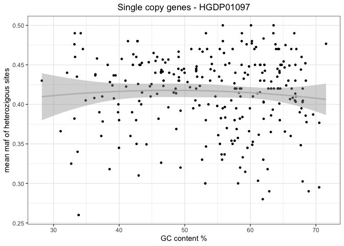
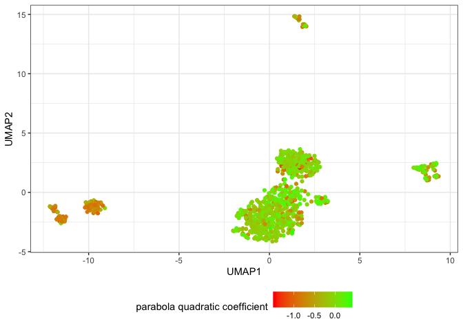

GC bias influence on SNPs
================

## Preparatory work for the analysis

``` r
suppressPackageStartupMessages(library(tidyverse))
suppressPackageStartupMessages(library(umap))

theme_set(theme_bw())
```

``` r
maf <- read_tsv("/Volumes/Temp1/rpianezza/GC-content/biased-unbiased-samples.tsv", show_col_types = FALSE)
gc <- read_tsv("/Volumes/Temp1/rpianezza/GC-content/gc-content.tsv", show_col_types = FALSE)
```

``` r
biased_sample_SNPs <- maf %>% select(-"HGDP00007-Brahui") %>% rename(biased = "HGDP01097-Tujia") %>% filter(biased > 0.25)
unbiased_sample_SNPs <- maf %>% select(-"HGDP01097-Tujia") %>% rename(unbiased = "HGDP00007-Brahui") %>% filter(unbiased > 0.25)

biased_sample_genes <- biased_sample_SNPs %>% group_by(familyname) %>% summarise(mean_maf = mean(biased)) %>% mutate(familyname = gsub("_scg", "", familyname))
unbiased_sample_genes <- unbiased_sample_SNPs %>% group_by(familyname) %>% summarise(mean_maf = mean(unbiased)) %>% mutate(familyname = gsub("_scg", "", familyname))
```

``` r
gc_biased <- biased_sample_genes %>% inner_join(gc, by="familyname")
gc_unbiased <- unbiased_sample_genes %>% inner_join(gc, by="familyname")
```

``` r
(plot_biased <-ggplot(gc_biased, aes(GC_content, mean_maf)) +
  geom_point(size=1)+geom_smooth(method = "lm", color="grey", se=T, formula = y~poly(x,2)) + ylab("mean maf of heterozigous sites") + xlab("GC content %") + ggtitle("Single copy genes - HGDP01097") + theme(plot.title = element_text(hjust = 0.5)))
```

<!-- -->

``` r
(plot_unbiased <- ggplot(gc_unbiased, aes(GC_content, mean_maf)) +
  geom_point(size=1)+geom_smooth(method = "lm", color="grey", se=T, formula = y~poly(x,2)) + ylab("mean maf of heterozigous sites") + xlab("GC content %") + ggtitle("Single copy genes - HGDP00007") + theme(plot.title = element_text(hjust = 0.5)))
```

<!-- -->

``` r
k10SNPs <- "/Volumes/Temp1/rpianezza/PCA-SNPs-all-analysis/matrixes/NA/scg-cov15-10000SNPs.matrix.tsv"
a_HGDP <- read_tsv("/Volumes/Temp1/rpianezza/PCA-copynumber-all-analysis/a_HGDP.tsv")
```

    ## Rows: 828 Columns: 2
    ## ── Column specification ────────────────────────────────────────────────────────
    ## Delimiter: "\t"
    ## chr (1): ID
    ## dbl (1): a
    ## 
    ## ℹ Use `spec()` to retrieve the full column specification for this data.
    ## ℹ Specify the column types or set `show_col_types = FALSE` to quiet this message.

``` r
UMAP <- function(freq_matrix, metadata){

matrix <- read_csv(freq_matrix)
matrix <- inner_join(metadata, matrix, by="ID")

pca_data <- matrix %>% select_if(~ !all(. == .[1]))
matrix <- as.matrix(pca_data[, -c(1,2)])

umap_result <- umap(matrix, n_neighbors = 15, min_dist = 0.3)

umap <- umap_result$layout %>% as.data.frame() %>% rename(UMAP1="V1",UMAP2="V2")

plot <- umap %>% ggplot(aes(x = UMAP1, y = UMAP2, color = metadata$a, shape=metadata$sex))+
  geom_point()+ labs(x = "UMAP1", y = "UMAP2") + theme(legend.position = "bottom") +
guides(col = guide_colourbar(title = "parabola quadratic coefficient"))+
  scale_color_gradient(low = "red", high = "green")
}

(UMAP_10kSNPs <- UMAP(k10SNPs, a_HGDP))
```

    ## Rows: 828 Columns: 40001
    ## ── Column specification ────────────────────────────────────────────────────────
    ## Delimiter: ","
    ## chr     (1): ID
    ## dbl (40000): chr1:916864-921016_scg_95A, chr1:916864-921016_scg_95T, chr1:91...
    ## 
    ## ℹ Use `spec()` to retrieve the full column specification for this data.
    ## ℹ Specify the column types or set `show_col_types = FALSE` to quiet this message.

    ## Warning: Unknown or uninitialised column: `sex`.
    ## Unknown or uninitialised column: `sex`.

<!-- -->

``` r
ggsave(plot_biased, file="/Volumes/Temp1/rpianezza/paper/figures-v2.0/gc-SNPs/biased.png", dpi=1000)
```

    ## Saving 7 x 5 in image

``` r
ggsave(plot_unbiased, file="/Volumes/Temp1/rpianezza/paper/figures-v2.0/gc-SNPs/unbiased.png", dpi=1000)
```

    ## Saving 7 x 5 in image

``` r
ggsave(UMAP_10kSNPs, file="/Volumes/Temp1/rpianezza/paper/figures-v2.0/gc-SNPs/umap.png", dpi=1000, height = 10, width = 8)
```

    ## Warning: Unknown or uninitialised column: `sex`.
    ## Unknown or uninitialised column: `sex`.
