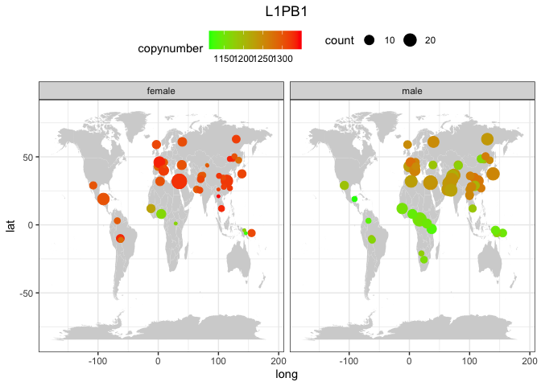
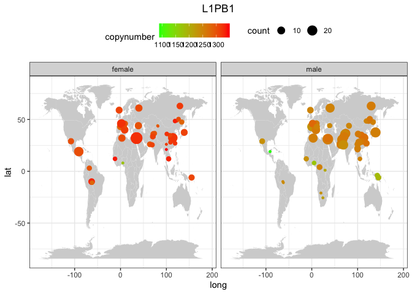
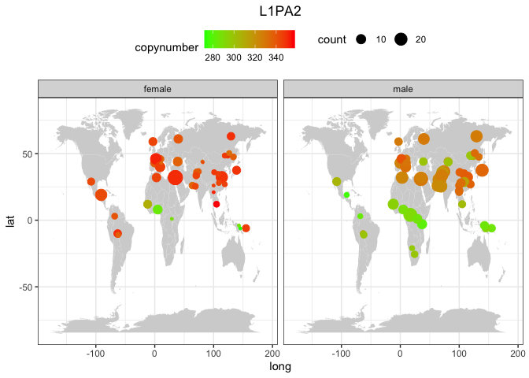
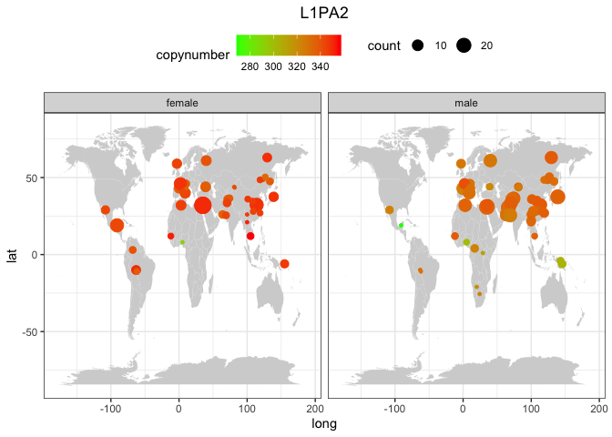
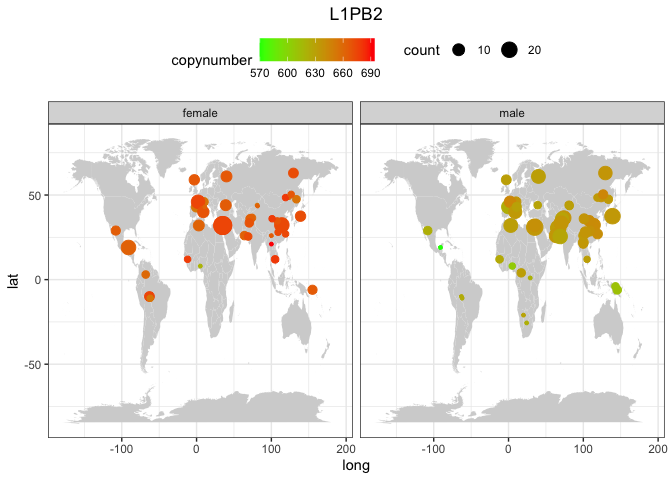

Geographic distribution by population for the most interesting TEs
================

``` r
library(tidyverse)
```

    ## ── Attaching core tidyverse packages ──────────────────────── tidyverse 2.0.0 ──
    ## ✔ dplyr     1.1.1     ✔ readr     2.1.4
    ## ✔ forcats   1.0.0     ✔ stringr   1.5.0
    ## ✔ ggplot2   3.4.2     ✔ tibble    3.2.1
    ## ✔ lubridate 1.9.2     ✔ tidyr     1.3.0
    ## ✔ purrr     1.0.1     
    ## ── Conflicts ────────────────────────────────────────── tidyverse_conflicts() ──
    ## ✖ dplyr::filter() masks stats::filter()
    ## ✖ dplyr::lag()    masks stats::lag()
    ## ℹ Use the conflicted package (<http://conflicted.r-lib.org/>) to force all conflicts to become errors

``` r
library(ggpubr)

theme_set(theme_bw())

HGDP <- read_delim("/Volumes/Temp1/rpianezza/GC-content/HGDP-final-dataset.tsv")
```

    ## Rows: 799020 Columns: 18
    ## ── Column specification ────────────────────────────────────────────────────────
    ## Delimiter: "\t"
    ## chr (9): ID, pop, sex, country, familyname, superfamily, shared_with, class,...
    ## dbl (9): length, reads, copynumber, lat, long, GC_content, expected_1_copy, ...
    ## 
    ## ℹ Use `spec()` to retrieve the full column specification for this data.
    ## ℹ Specify the column types or set `show_col_types = FALSE` to quiet this message.

``` r
a_HGDP <- read_tsv("/Volumes/Temp1/rpianezza/PCA-copynumber-all-analysis/a_HGDP.tsv")
```

    ## Rows: 828 Columns: 2
    ## ── Column specification ────────────────────────────────────────────────────────
    ## Delimiter: "\t"
    ## chr (1): ID
    ## dbl (1): a
    ## 
    ## ℹ Use `spec()` to retrieve the full column specification for this data.
    ## ℹ Specify the column types or set `show_col_types = FALSE` to quiet this message.

``` r
HGDP_nobiased_samples <- filter(a_HGDP, (a > (-0.5)) & (a<0.5)) %>% select(ID) %>% pull()
HGDP_clean <- filter(HGDP, ID %in% HGDP_nobiased_samples)
```

``` r
(by_pop <- group_by(HGDP, pop, country, familyname, sex, lat, long) %>% dplyr::summarise(sd=sd(gc_copynumber), copynumber = mean(gc_copynumber), count=n()))
```

    ## `summarise()` has grouped output by 'pop', 'country', 'familyname', 'sex',
    ## 'lat'. You can override using the `.groups` argument.

    ## # A tibble: 94,570 × 9
    ## # Groups:   pop, country, familyname, sex, lat [94,570]
    ##    pop    country familyname sex      lat  long        sd copynumber count
    ##    <chr>  <chr>   <chr>      <chr>  <dbl> <dbl>     <dbl>      <dbl> <int>
    ##  1 Adygei Europe  6kbHsap    female    44    39   35.3       315.        9
    ##  2 Adygei Europe  6kbHsap    male      44    39   50.5       319.        6
    ##  3 Adygei Europe  ALINE      female    44    39    0.0220      0.141     9
    ##  4 Adygei Europe  ALINE      male      44    39    0.0160      0.118     6
    ##  5 Adygei Europe  ALR        female    44    39 2507.      31855.        9
    ##  6 Adygei Europe  ALR        male      44    39 5683.      31197.        6
    ##  7 Adygei Europe  ALR1       female    44    39 3958.      70715.        9
    ##  8 Adygei Europe  ALR1       male      44    39 9852.      70352.        6
    ##  9 Adygei Europe  ALR2       female    44    39   77.8      2081.        9
    ## 10 Adygei Europe  ALR2       male      44    39  157.       2085.        6
    ## # ℹ 94,560 more rows

``` r
(by_pop_unbiased <- group_by(HGDP_clean, pop, country, familyname, sex, lat, long) %>% dplyr::summarise(sd=sd(gc_copynumber), copynumber = mean(gc_copynumber), count=n()))
```

    ## `summarise()` has grouped output by 'pop', 'country', 'familyname', 'sex',
    ## 'lat'. You can override using the `.groups` argument.

    ## # A tibble: 88,780 × 9
    ## # Groups:   pop, country, familyname, sex, lat [88,780]
    ##    pop    country familyname sex      lat  long        sd copynumber count
    ##    <chr>  <chr>   <chr>      <chr>  <dbl> <dbl>     <dbl>      <dbl> <int>
    ##  1 Adygei Europe  6kbHsap    female    44    39   37.1       317.        8
    ##  2 Adygei Europe  6kbHsap    male      44    39   68.9       330.        3
    ##  3 Adygei Europe  ALINE      female    44    39    0.0236      0.141     8
    ##  4 Adygei Europe  ALINE      male      44    39    0           0.13      3
    ##  5 Adygei Europe  ALR        female    44    39 2680.      31859.        8
    ##  6 Adygei Europe  ALR        male      44    39 4915.      29955.        3
    ##  7 Adygei Europe  ALR1       female    44    39 4228.      70661.        8
    ##  8 Adygei Europe  ALR1       male      44    39 6804.      67942.        3
    ##  9 Adygei Europe  ALR2       female    44    39   71.5      2094.        8
    ## 10 Adygei Europe  ALR2       male      44    39   91.6      1965.        3
    ## # ℹ 88,770 more rows

``` r
plot_map <- function(data, famname){
TE <- filter(data, familyname == famname)
world_map = map_data("world")

ggplot() +
  geom_map(
    data = world_map, map = world_map,
    aes(long, lat, map_id = region),
    color = "white", fill = "lightgray", size = 0) +
  geom_point(
    data = TE, aes(long, lat, color = copynumber, size = count)
  ) + geom_errorbar() + scale_colour_gradient(low = "green", high = "red") + theme(legend.position="top") + theme(plot.title = element_text(hjust = 0.5)) +
  facet_wrap(~sex) + ggtitle(famname)}
```

``` r
plot_map(by_pop, "L1PB1")
```

    ## Warning: Using `size` aesthetic for lines was deprecated in ggplot2 3.4.0.
    ## ℹ Please use `linewidth` instead.
    ## This warning is displayed once every 8 hours.
    ## Call `lifecycle::last_lifecycle_warnings()` to see where this warning was
    ## generated.

    ## Warning in geom_map(data = world_map, map = world_map, aes(long, lat, map_id =
    ## region), : Ignoring unknown aesthetics: x and y

<!-- -->

``` r
plot_map(by_pop_unbiased, "L1PB1")
```

    ## Warning in geom_map(data = world_map, map = world_map, aes(long, lat, map_id =
    ## region), : Ignoring unknown aesthetics: x and y

<!-- -->

``` r
plot_map(by_pop, "L1PA2")
```

    ## Warning in geom_map(data = world_map, map = world_map, aes(long, lat, map_id =
    ## region), : Ignoring unknown aesthetics: x and y

<!-- -->

``` r
plot_map(by_pop_unbiased, "L1PA2")
```

    ## Warning in geom_map(data = world_map, map = world_map, aes(long, lat, map_id =
    ## region), : Ignoring unknown aesthetics: x and y

<!-- -->

``` r
plot_map(by_pop, "L1PB2")
```

    ## Warning in geom_map(data = world_map, map = world_map, aes(long, lat, map_id =
    ## region), : Ignoring unknown aesthetics: x and y

<!-- -->

``` r
plot_map(by_pop_unbiased, "L1PB2")
```

    ## Warning in geom_map(data = world_map, map = world_map, aes(long, lat, map_id =
    ## region), : Ignoring unknown aesthetics: x and y

<!-- -->
