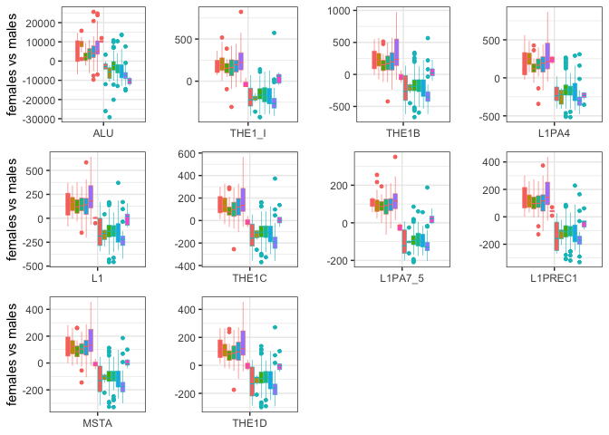

HGDP - Analyzing the TE abundance in the two sexes
================

``` r
library(tidyverse)
```

    ## ── Attaching core tidyverse packages ──────────────────────── tidyverse 2.0.0 ──
    ## ✔ dplyr     1.1.1     ✔ readr     2.1.4
    ## ✔ forcats   1.0.0     ✔ stringr   1.5.0
    ## ✔ ggplot2   3.4.2     ✔ tibble    3.2.1
    ## ✔ lubridate 1.9.2     ✔ tidyr     1.3.0
    ## ✔ purrr     1.0.1     
    ## ── Conflicts ────────────────────────────────────────── tidyverse_conflicts() ──
    ## ✖ dplyr::filter() masks stats::filter()
    ## ✖ dplyr::lag()    masks stats::lag()
    ## ℹ Use the conflicted package (<http://conflicted.r-lib.org/>) to force all conflicts to become errors

``` r
library(ggpubr)
library(cowplot)
```

    ## 
    ## Attaching package: 'cowplot'
    ## 
    ## The following object is masked from 'package:ggpubr':
    ## 
    ##     get_legend
    ## 
    ## The following object is masked from 'package:lubridate':
    ## 
    ##     stamp

``` r
theme_set(theme_bw())

HGDP <- read_delim("/Volumes/Temp1/rpianezza/0.old/summary-HGDP/HGDP_cutoff_classified.tsv")
```

    ## Rows: 1394352 Columns: 12
    ## ── Column specification ────────────────────────────────────────────────────────
    ## Delimiter: "\t"
    ## chr (9): ID, pop, sex, country, type, familyname, batch, superfamily, shared...
    ## dbl (3): length, reads, copynumber
    ## 
    ## ℹ Use `spec()` to retrieve the full column specification for this data.
    ## ℹ Specify the column types or set `show_col_types = FALSE` to quiet this message.

``` r
a_HGDP <- read_tsv("/Volumes/Temp1/rpianezza/PCA-copynumber-all-analysis/a_HGDP.tsv")
```

    ## Rows: 828 Columns: 2
    ## ── Column specification ────────────────────────────────────────────────────────
    ## Delimiter: "\t"
    ## chr (1): ID
    ## dbl (1): a
    ## 
    ## ℹ Use `spec()` to retrieve the full column specification for this data.
    ## ℹ Specify the column types or set `show_col_types = FALSE` to quiet this message.

``` r
HGDP_nobiased_samples <- filter(a_HGDP, (a > (-0.5)) & (a<0.5)) %>% select(ID) %>% pull()
HGDP_clean <- filter(HGDP, ID %in% HGDP_nobiased_samples)

DNA_names <- c("Crypton", "hAT", "Helitron", "Kolobok", "Mariner/Tc1", "Merlin", "MuDR", "piggyBac", "DNA transposon")
LINE_names <- c("L1", "CR1", "L2", "Crack", "RTE", "RTEX", "R4", "Vingi", "Tx1", "Penelope")
SINE_names <- c("SINE1/7SL", "SINE2/tRNA", "SINE3/5S", "SINE")
LTR_names <- c("ERV1", "ERV2", "ERV3", "Gypsy", "Endogenous Retrovirus", "LTR Retrotransposon", "Long terminal repeat", "Non-LTR Retrotransposon")
satellites_names <- c("Satellite", "satellite", "SAT")

classification <- HGDP_clean %>% mutate(class = case_when(superfamily %in% DNA_names ~ "DNA", superfamily %in% LINE_names ~ "LINE", superfamily %in% SINE_names ~ "SINE", superfamily %in% LTR_names ~ "LTR", superfamily %in% satellites_names ~ "satellite"))

coordinates <- read_tsv("/Volumes/Temp1/rpianezza/0.old/summary-HGDP/HGDP_populationcoordinates.txt", col_names = c("population","country","lat","long")) %>% select(-country)
```

    ## Rows: 54 Columns: 4
    ## ── Column specification ────────────────────────────────────────────────────────
    ## Delimiter: "\t"
    ## chr (2): population, country
    ## dbl (2): lat, long
    ## 
    ## ℹ Use `spec()` to retrieve the full column specification for this data.
    ## ℹ Specify the column types or set `show_col_types = FALSE` to quiet this message.

``` r
cn <- classification %>% filter(type=="te", class!="satellite", class!="NA") %>% select(familyname, ID, country, sex, copynumber)

(most_diff <- cn %>% group_by(familyname, sex) %>% summarise(avg = mean(copynumber)) %>% pivot_wider(names_from = sex, values_from = avg) %>% mutate(diff = abs(female-male)) %>% arrange(desc(diff)) %>% ungroup() %>% slice(1:10))
```

    ## `summarise()` has grouped output by 'familyname'. You can override using the
    ## `.groups` argument.

    ## # A tibble: 10 × 4
    ##    familyname  female    male   diff
    ##    <chr>        <dbl>   <dbl>  <dbl>
    ##  1 ALU        196091. 192089. 4002. 
    ##  2 THE1_I       4436.   4273.  164. 
    ##  3 THE1B        6287.   6134.  153. 
    ##  4 L1PA4        4347.   4195.  152. 
    ##  5 L1           3661.   3551.  110. 
    ##  6 THE1C        3423.   3330.   93.7
    ##  7 L1PA7_5      1945.   1853.   91.4
    ##  8 L1PREC1      2216.   2129.   86.6
    ##  9 MSTA         2989.   2904.   84.1
    ## 10 THE1D        2753.   2676.   76.7

``` r
subset_TE <- filter(cn, familyname %in% most_diff$familyname)
```

``` r
sex_diff_country <- function(data, fam){
  
  te <- data %>% filter(familyname==fam)
  te_avg <- data %>% filter(familyname==fam) %>% group_by(familyname, country, sex) %>% summarise(avg = mean(copynumber)) %>% pivot_wider(names_from = sex, values_from = avg)
  
  (te_all <- inner_join(te, te_avg, by=c("familyname","country")) %>% mutate(diff = ifelse(sex=="male", copynumber-female, copynumber-male)))
  
  ggplot(te_all, aes(x = familyname, y = diff, color = sex, fill = country)) +
  geom_boxplot(notch = FALSE, width = 0.8, lwd = 0.2, outlier.size = 1) +
  ylab(ifelse(fam %in% c("ALU","L1","MSTA"), "females vs males", "")) +
  xlab(NULL) +
  theme(legend.position = "none")
}

plots_vector <- list()
for (te in most_diff$familyname){
  boxplot <- sex_diff_country(cn, te)
  plots_vector[[te]] <- boxplot
}
```

    ## `summarise()` has grouped output by 'familyname', 'country'. You can override
    ## using the `.groups` argument.
    ## `summarise()` has grouped output by 'familyname', 'country'. You can override
    ## using the `.groups` argument.
    ## `summarise()` has grouped output by 'familyname', 'country'. You can override
    ## using the `.groups` argument.
    ## `summarise()` has grouped output by 'familyname', 'country'. You can override
    ## using the `.groups` argument.
    ## `summarise()` has grouped output by 'familyname', 'country'. You can override
    ## using the `.groups` argument.
    ## `summarise()` has grouped output by 'familyname', 'country'. You can override
    ## using the `.groups` argument.
    ## `summarise()` has grouped output by 'familyname', 'country'. You can override
    ## using the `.groups` argument.
    ## `summarise()` has grouped output by 'familyname', 'country'. You can override
    ## using the `.groups` argument.
    ## `summarise()` has grouped output by 'familyname', 'country'. You can override
    ## using the `.groups` argument.
    ## `summarise()` has grouped output by 'familyname', 'country'. You can override
    ## using the `.groups` argument.

``` r
(arranged_plots <- plot_grid(plotlist = plots_vector))
```

<!-- -->

``` r
ggsave(arranged_plots, file="/Volumes/Temp1/rpianezza/paper/figures/sex-2/sexdiff-country.png", dpi=800, width = 10, height = 5)
```
