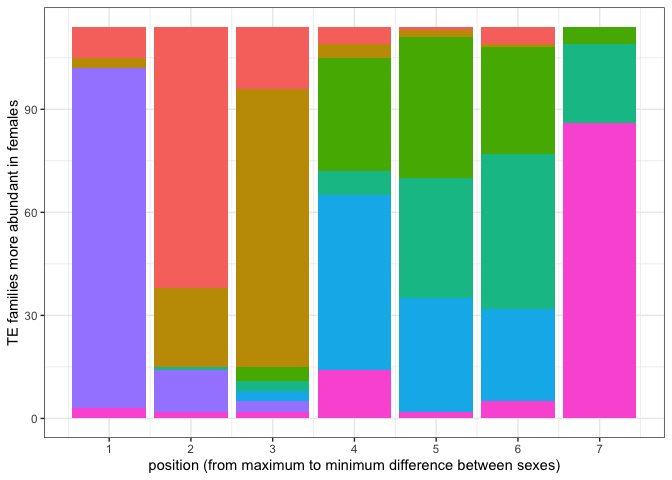
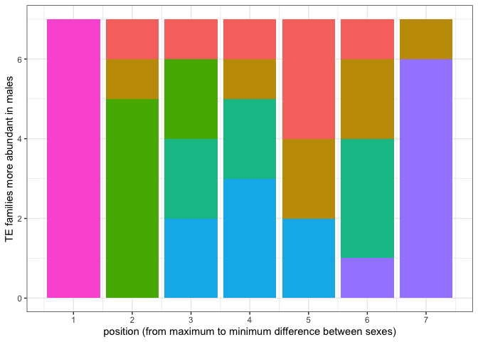
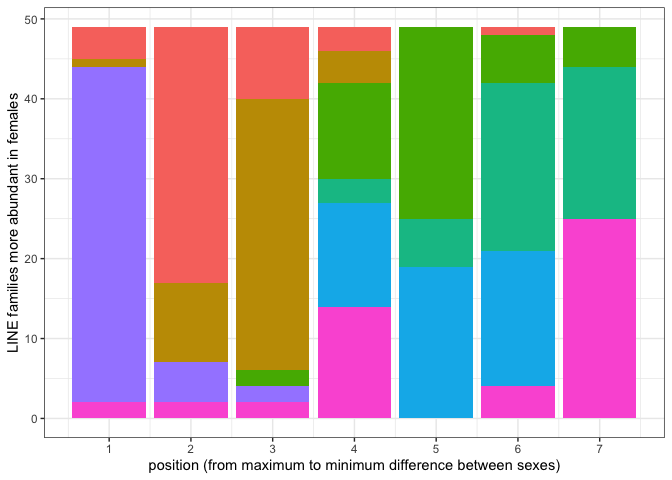

HGDP - Analyzing the TE abundance in the two sexes
================

``` r
library(tidyverse)
```

    ## ── Attaching core tidyverse packages ──────────────────────── tidyverse 2.0.0 ──
    ## ✔ dplyr     1.1.1     ✔ readr     2.1.4
    ## ✔ forcats   1.0.0     ✔ stringr   1.5.0
    ## ✔ ggplot2   3.4.2     ✔ tibble    3.2.1
    ## ✔ lubridate 1.9.2     ✔ tidyr     1.3.0
    ## ✔ purrr     1.0.1     
    ## ── Conflicts ────────────────────────────────────────── tidyverse_conflicts() ──
    ## ✖ dplyr::filter() masks stats::filter()
    ## ✖ dplyr::lag()    masks stats::lag()
    ## ℹ Use the conflicted package (<http://conflicted.r-lib.org/>) to force all conflicts to become errors

``` r
library(ggpubr)

theme_set(theme_bw())

HGDP <- read_delim("/Volumes/Temp1/rpianezza/0.old/summary-HGDP/HGDP_cutoff_classified.tsv")
```

    ## Rows: 1394352 Columns: 12
    ## ── Column specification ────────────────────────────────────────────────────────
    ## Delimiter: "\t"
    ## chr (9): ID, pop, sex, country, type, familyname, batch, superfamily, shared...
    ## dbl (3): length, reads, copynumber
    ## 
    ## ℹ Use `spec()` to retrieve the full column specification for this data.
    ## ℹ Specify the column types or set `show_col_types = FALSE` to quiet this message.

``` r
a_HGDP <- read_tsv("/Volumes/Temp1/rpianezza/PCA-copynumber-all-analysis/a_HGDP.tsv")
```

    ## Rows: 828 Columns: 2
    ## ── Column specification ────────────────────────────────────────────────────────
    ## Delimiter: "\t"
    ## chr (1): ID
    ## dbl (1): a
    ## 
    ## ℹ Use `spec()` to retrieve the full column specification for this data.
    ## ℹ Specify the column types or set `show_col_types = FALSE` to quiet this message.

``` r
HGDP_nobiased_samples <- filter(a_HGDP, (a > (-0.5)) & (a<0.5)) %>% select(ID) %>% pull()
HGDP_clean <- filter(HGDP, ID %in% HGDP_nobiased_samples)

DNA_names <- c("Crypton", "hAT", "Helitron", "Kolobok", "Mariner/Tc1", "Merlin", "MuDR", "piggyBac", "DNA transposon")
LINE_names <- c("L1", "CR1", "L2", "Crack", "RTE", "RTEX", "R4", "Vingi", "Tx1", "Penelope")
SINE_names <- c("SINE1/7SL", "SINE2/tRNA", "SINE3/5S", "SINE")
LTR_names <- c("ERV1", "ERV2", "ERV3", "Gypsy", "Endogenous Retrovirus", "LTR Retrotransposon", "Long terminal repeat", "Non-LTR Retrotransposon")
satellites_names <- c("Satellite", "satellite", "SAT")

classification <- HGDP_clean %>% mutate(class = case_when(superfamily %in% DNA_names ~ "DNA", superfamily %in% LINE_names ~ "LINE", superfamily %in% SINE_names ~ "SINE", superfamily %in% LTR_names ~ "LTR", superfamily %in% satellites_names ~ "satellite"))

coordinates <- read_tsv("/Volumes/Temp1/rpianezza/0.old/summary-HGDP/HGDP_populationcoordinates.txt", col_names = c("population","country","lat","long")) %>% select(-country)
```

    ## Rows: 54 Columns: 4
    ## ── Column specification ────────────────────────────────────────────────────────
    ## Delimiter: "\t"
    ## chr (2): population, country
    ## dbl (2): lat, long
    ## 
    ## ℹ Use `spec()` to retrieve the full column specification for this data.
    ## ℹ Specify the column types or set `show_col_types = FALSE` to quiet this message.

# Sex differences

Male genome length = 6,045,293,052 bp Female genome length =
5,948,152,252 bp

``` r
f = 6045293052
m = 5948152252

diff_mf = f-m
diff_perc = (diff_mf/mean(f, m))*100

diff_perc
```

    ## [1] 1.606883

We expect a slight increase in females copynumber due to the bigger
genome they have: **1.6%** bigger than males (Y chromosome is shorter
than the X).

We chose a conservative threshold of **3.2%** to state that a TE
copynumber is significantly different between the sexes despite the
genome length difference.

``` r
cn <- classification %>% filter(type=="te") %>% group_by(familyname, sex, class, superfamily) %>% summarise(mean = mean(copynumber)) %>% filter(mean>1)
```

    ## `summarise()` has grouped output by 'familyname', 'sex', 'class'. You can
    ## override using the `.groups` argument.

``` r
new_tibble <- tidyr::spread(cn, key = sex, value = mean)
colnames(new_tibble) <- c("familyname", "class", "superfamily", "female_cn", "male_cn")

(different_fem <- new_tibble %>% mutate(diff = abs(female_cn-male_cn)) %>% filter(diff > ((female_cn/100)*3.2), diff>1) %>% arrange(desc(diff)))
```

    ## # A tibble: 125 × 6
    ## # Groups:   familyname, class [125]
    ##    familyname class     superfamily female_cn male_cn   diff
    ##    <chr>      <chr>     <chr>           <dbl>   <dbl>  <dbl>
    ##  1 HSATI      satellite SAT              341.   2122. 1781. 
    ##  2 HSATII     satellite SAT            28262.  27132. 1130. 
    ##  3 THE1_I     LTR       ERV3            4436.   4273.  164. 
    ##  4 L1PA4      LINE      L1              4347.   4195.  152. 
    ##  5 L1PA7_5    LINE      L1              1945.   1853.   91.4
    ##  6 L1PREC1    LINE      L1              2216.   2129.   86.6
    ##  7 L1PA16     LINE      L1              2205.   2131.   73.9
    ##  8 L1PB2c     LINE      L1              1487.   1424.   62.3
    ##  9 L1PA7      LINE      L1              1806.   1747.   58.8
    ## 10 L1PB1      LINE      L1              1303.   1251.   52.7
    ## # ℹ 115 more rows

``` r
(different_mal <- new_tibble %>% mutate(diff = abs(female_cn-male_cn)) %>% filter(diff > ((male_cn/100)*1.6), diff>1) %>% arrange(desc(diff)))
```

    ## # A tibble: 256 × 6
    ## # Groups:   familyname, class [256]
    ##    familyname class     superfamily female_cn male_cn   diff
    ##    <chr>      <chr>     <chr>           <dbl>   <dbl>  <dbl>
    ##  1 ALU        SINE      SINE1/7SL     196091. 192089. 4002. 
    ##  2 HSATI      satellite SAT              341.   2122. 1781. 
    ##  3 HSATII     satellite SAT            28262.  27132. 1130. 
    ##  4 THE1_I     LTR       ERV3            4436.   4273.  164. 
    ##  5 THE1B      LTR       ERV3            6287.   6134.  153. 
    ##  6 L1PA4      LINE      L1              4347.   4195.  152. 
    ##  7 L1         LINE      L1              3661.   3551.  110. 
    ##  8 THE1C      LTR       ERV3            3423.   3330.   93.7
    ##  9 L1PA7_5    LINE      L1              1945.   1853.   91.4
    ## 10 L1PREC1    LINE      L1              2216.   2129.   86.6
    ## # ℹ 246 more rows

``` r
(more_in_males <- different_mal %>% filter(male_cn>female_cn) %>% ungroup())
```

    ## # A tibble: 9 × 6
    ##   familyname class     superfamily           female_cn male_cn    diff
    ##   <chr>      <chr>     <chr>                     <dbl>   <dbl>   <dbl>
    ## 1 HSATI      satellite SAT                      341.    2122.  1781.  
    ## 2 LTR14C     LTR       ERV2                      67.1     76.1    8.93
    ## 3 HERV9      LTR       ERV1                     134.     142.     7.35
    ## 4 LTR22      LTR       ERV2                      47.5     53.5    6.07
    ## 5 MER22      <NA>      MER22                    160.     163.     3.11
    ## 6 LTR6A      LTR       ERV1                      68.7     71.3    2.67
    ## 7 HERV-K14CI LTR       ERV2                       8.63    10.9    2.28
    ## 8 LTR22B     LTR       ERV2                      41.6     43.6    2.00
    ## 9 HERV30I    LTR       Endogenous Retrovirus      9.77    10.9    1.09

``` r
(more_in_females <- different_fem %>% filter(male_cn<female_cn) %>% ungroup())
```

    ## # A tibble: 117 × 6
    ##    familyname class     superfamily female_cn male_cn   diff
    ##    <chr>      <chr>     <chr>           <dbl>   <dbl>  <dbl>
    ##  1 HSATII     satellite SAT            28262.  27132. 1130. 
    ##  2 THE1_I     LTR       ERV3            4436.   4273.  164. 
    ##  3 L1PA4      LINE      L1              4347.   4195.  152. 
    ##  4 L1PA7_5    LINE      L1              1945.   1853.   91.4
    ##  5 L1PREC1    LINE      L1              2216.   2129.   86.6
    ##  6 L1PA16     LINE      L1              2205.   2131.   73.9
    ##  7 L1PB2c     LINE      L1              1487.   1424.   62.3
    ##  8 L1PA7      LINE      L1              1806.   1747.   58.8
    ##  9 L1PB1      LINE      L1              1303.   1251.   52.7
    ## 10 L1PREC2    LINE      L1              1007.    956.   51.2
    ## # ℹ 107 more rows

``` r
mim_names <- more_in_males %>% select(familyname) %>% pull()
mif_names <- more_in_females %>% select(familyname) %>% pull()

mim <- classification %>% filter(type=="te", familyname %in% mim_names) %>% group_by(familyname, sex, class, country) %>% summarise(mean = mean(copynumber)) %>% filter(mean>1, class!="satellite")
```

    ## `summarise()` has grouped output by 'familyname', 'sex', 'class'. You can
    ## override using the `.groups` argument.

``` r
mif <- classification %>% filter(type=="te", familyname %in% mif_names) %>% group_by(familyname, sex, class, country) %>% summarise(mean = mean(copynumber)) %>% filter(mean>1, class!="satellite")
```

    ## `summarise()` has grouped output by 'familyname', 'sex', 'class'. You can
    ## override using the `.groups` argument.

``` r
continents <- c("Africa", "Middle_East", "Central_South_Asia", "East_Asia", "Europe", "America", "Oceania")
latitudes <- c(0, 30, 20, 35, 50, -10, -25)
longitudes <- c(20, 45, 70, 105, 15, -60, 135)
coordinates_con <- tibble(country = continents, lat = latitudes, long = longitudes)

spreaded_m <- tidyr::spread(mim, key = sex, value = mean) %>% na.omit()
colnames(spreaded_m) <- c("familyname", "class", "country", "female_cn", "male_cn")
(diff_m <- spreaded_m %>% mutate(avg_cn=(male_cn+female_cn)/2, diff=male_cn-female_cn, fold_diff=diff/avg_cn) %>% select(-female_cn, -male_cn) %>% arrange(desc(fold_diff)) %>% inner_join(coordinates_con, by="country"))
```

    ## # A tibble: 49 × 8
    ## # Groups:   familyname, class [7]
    ##    familyname class country            avg_cn  diff fold_diff   lat  long
    ##    <chr>      <chr> <chr>               <dbl> <dbl>     <dbl> <dbl> <dbl>
    ##  1 HERV-K14CI LTR   Oceania              9.60  2.68     0.279   -25   135
    ##  2 HERV-K14CI LTR   America              9.29  2.19     0.236   -10   -60
    ##  3 HERV-K14CI LTR   Central_South_Asia   9.75  2.27     0.233    20    70
    ##  4 HERV-K14CI LTR   Africa               9.69  2.21     0.228     0    20
    ##  5 HERV-K14CI LTR   Europe               9.97  2.26     0.227    50    15
    ##  6 HERV-K14CI LTR   East_Asia            9.88  2.20     0.222    35   105
    ##  7 HERV-K14CI LTR   Middle_East          9.59  2.02     0.211    30    45
    ##  8 LTR22      LTR   Oceania             49.0   8.20     0.167   -25   135
    ##  9 LTR14C     LTR   Oceania             70.9  10.9      0.154   -25   135
    ## 10 HERV30I    LTR   Oceania             10.3   1.49     0.145   -25   135
    ## # ℹ 39 more rows

``` r
spreaded_f <- tidyr::spread(mif, key = sex, value = mean) %>% na.omit()
(diff_f <- spreaded_f %>% mutate(avg_cn=(male+female)/2, diff=female-male, fold_diff=diff/avg_cn) %>% select(-female, -male) %>% arrange(desc(fold_diff)) %>% inner_join(coordinates_con, by="country"))
```

    ## # A tibble: 798 × 8
    ## # Groups:   familyname, class [114]
    ##    familyname class country            avg_cn  diff fold_diff   lat  long
    ##    <chr>      <chr> <chr>               <dbl> <dbl>     <dbl> <dbl> <dbl>
    ##  1 HERV46I    LTR   Middle_East          6.77  1.91     0.282    30    45
    ##  2 HERV46I    LTR   Africa               6.87  1.90     0.277     0    20
    ##  3 HERV46I    LTR   America              6.51  1.77     0.272   -10   -60
    ##  4 HERV46I    LTR   Central_South_Asia   6.86  1.80     0.262    20    70
    ##  5 HERV46I    LTR   East_Asia            6.98  1.83     0.262    35   105
    ##  6 HERV46I    LTR   Europe               6.90  1.73     0.251    50    15
    ##  7 HERV46I    LTR   Oceania              6.67  1.42     0.213   -25   135
    ##  8 LTR25      LTR   Middle_East         19.5   3.98     0.204    30    45
    ##  9 LTR25      LTR   Africa              19.9   3.88     0.195     0    20
    ## 10 LTR25      LTR   America             19.0   3.69     0.194   -10   -60
    ## # ℹ 788 more rows

``` r
plot_map <- function(data, famname){
TE <- filter(data, familyname == famname)
world_map = map_data("world")

ggplot() +
  geom_map(
    data = world_map, map = world_map,
    aes(long, lat, map_id = region),
    color = "white", fill = "lightgray", size = 0) +
  geom_point(
    data = TE, aes(long, lat, color = diff), size = 12
  ) + geom_errorbar() + scale_colour_gradient(low = "green", high = "red") + theme(legend.position="top") + theme(plot.title = element_text(hjust = 0.5)) + ggtitle(famname) + labs(size = "samples") + theme(legend.position = "left")}

#plot_map(diff_m, "LTR14C")
```

``` r
selected_f <- diff_f %>% group_by(familyname) %>% summarise(avg_fold_diff = mean(fold_diff)) %>% arrange(desc(avg_fold_diff)) %>% filter(avg_fold_diff>0.087)

selected_m <- diff_m %>% group_by(familyname) %>% summarise(avg_fold_diff = mean(fold_diff)) %>% arrange(desc(avg_fold_diff))

plot_sex_country <- function(data, fam){
  
different <- classification %>% filter(familyname==fam)

(plots <- ggplot(different, aes(x = familyname, y = copynumber, shape = sex, color = country)) + geom_boxplot(notch = FALSE, width = 0.8, lwd = 0.2, outlier.size = 1))
}

#plot_sex_country(selected_f, "HERV46I")
#plot_sex_country(selected_f, "LTR25")
#plot_sex_country(selected_f, "MER4BI")
#plot_sex_country(selected_f, "HERVFH19I")
#plot_sex_country(selected_f, "L1MA1")
#plot_sex_country(selected_f, "LTR21A")
#plot_sex_country(selected_f, "L1MA2")
#plot_sex_country(selected_f, "L1MDB_5")
#plot_sex_country(selected_f, "LTR46")
#plot_sex_country(selected_f, "L1PA13_5")

#plot_sex_country(selected_m, "HERV-K14CI")
#plot_sex_country(selected_m, "LTR14C")
#plot_sex_country(selected_m, "LTR22")
#plot_sex_country(selected_m, "HERV30I")
#plot_sex_country(selected_m, "HERV9")
#plot_sex_country(selected_m, "LTR22B")
#plot_sex_country(selected_m, "LTR6A")
```

``` r
max_values <- diff_f %>% group_by(familyname) %>% arrange(desc(fold_diff)) %>% slice(1) %>% ungroup() %>% group_by(country) %>% summarise(count=n()) %>% mutate(position = 1)
second_max_values <- diff_f %>% group_by(familyname) %>% arrange(desc(fold_diff)) %>% slice(2) %>% ungroup() %>% group_by(country) %>% summarise(count=n()) %>% mutate(position = 2)
third_max_values <- diff_f %>% group_by(familyname) %>% arrange(desc(fold_diff)) %>% slice(3) %>% ungroup() %>% group_by(country) %>% summarise(count=n()) %>% mutate(position = 3)
fourth_max_values <- diff_f %>% group_by(familyname) %>% arrange(desc(fold_diff)) %>% slice(4) %>% ungroup() %>% group_by(country) %>% summarise(count=n()) %>% mutate(position = 4)
fifth_max_values <- diff_f %>% group_by(familyname) %>% arrange(desc(fold_diff)) %>% slice(5) %>% ungroup() %>% group_by(country) %>% summarise(count=n()) %>% mutate(position = 5)
sixth_max_values <- diff_f %>% group_by(familyname) %>% arrange(desc(fold_diff)) %>% slice(6) %>% ungroup() %>% group_by(country) %>% summarise(count=n()) %>% mutate(position = 6)
min_values <- diff_f %>% group_by(familyname) %>% arrange(desc(fold_diff)) %>% slice(7) %>% ungroup() %>% group_by(country) %>% summarise(count=n()) %>% mutate(position = 7)

pos_f <- bind_rows(max_values, second_max_values, third_max_values, fourth_max_values, fifth_max_values, sixth_max_values, min_values)

(pos_f_plot <- ggplot(pos_f, aes(position, count, fill=country))+
  geom_bar(stat = "identity")+
  scale_x_continuous(breaks = 1:7)+
  ylab("TE families more abundant in females")+
  xlab("position (from maximum to minimum difference between sexes)")+
  theme(legend.position = "none"))
```

<!-- -->

``` r
max_values <- diff_m %>% group_by(familyname) %>% arrange(desc(fold_diff)) %>% slice(1) %>% ungroup() %>% group_by(country) %>% summarise(count=n()) %>% mutate(position = 1)
second_max_values <- diff_m %>% group_by(familyname) %>% arrange(desc(fold_diff)) %>% slice(2) %>% ungroup() %>% group_by(country) %>% summarise(count=n()) %>% mutate(position = 2)
third_max_values <- diff_m %>% group_by(familyname) %>% arrange(desc(fold_diff)) %>% slice(3) %>% ungroup() %>% group_by(country) %>% summarise(count=n()) %>% mutate(position = 3)
fourth_max_values <- diff_m %>% group_by(familyname) %>% arrange(desc(fold_diff)) %>% slice(4) %>% ungroup() %>% group_by(country) %>% summarise(count=n()) %>% mutate(position = 4)
fifth_max_values <- diff_m %>% group_by(familyname) %>% arrange(desc(fold_diff)) %>% slice(5) %>% ungroup() %>% group_by(country) %>% summarise(count=n()) %>% mutate(position = 5)
sixth_max_values <- diff_m %>% group_by(familyname) %>% arrange(desc(fold_diff)) %>% slice(6) %>% ungroup() %>% group_by(country) %>% summarise(count=n()) %>% mutate(position = 6)
min_values <- diff_m %>% group_by(familyname) %>% arrange(desc(fold_diff)) %>% slice(7) %>% ungroup() %>% group_by(country) %>% summarise(count=n()) %>% mutate(position = 7)

pos_m <- bind_rows(max_values, second_max_values, third_max_values, fourth_max_values, fifth_max_values, sixth_max_values, min_values)

(pos_m_plot <- ggplot(pos_m, aes(position, count, fill=country))+
  geom_bar(stat = "identity")+
  scale_x_continuous(breaks = 1:7)+
  ylab("TE families more abundant in males")+
  xlab("position (from maximum to minimum difference between sexes)")+
  theme(legend.position = "none"))
```

<!-- -->

``` r
f_L1 <- diff_f %>% filter(class=="LINE")

max_values <- f_L1 %>% group_by(familyname) %>% arrange(desc(fold_diff)) %>% slice(1) %>% ungroup() %>% group_by(country) %>% summarise(count=n()) %>% mutate(position = 1)
second_max_values <- f_L1 %>% group_by(familyname) %>% arrange(desc(fold_diff)) %>% slice(2) %>% ungroup() %>% group_by(country) %>% summarise(count=n()) %>% mutate(position = 2)
third_max_values <- f_L1 %>% group_by(familyname) %>% arrange(desc(fold_diff)) %>% slice(3) %>% ungroup() %>% group_by(country) %>% summarise(count=n()) %>% mutate(position = 3)
fourth_max_values <- f_L1 %>% group_by(familyname) %>% arrange(desc(fold_diff)) %>% slice(4) %>% ungroup() %>% group_by(country) %>% summarise(count=n()) %>% mutate(position = 4)
fifth_max_values <- f_L1 %>% group_by(familyname) %>% arrange(desc(fold_diff)) %>% slice(5) %>% ungroup() %>% group_by(country) %>% summarise(count=n()) %>% mutate(position = 5)
sixth_max_values <- f_L1 %>% group_by(familyname) %>% arrange(desc(fold_diff)) %>% slice(6) %>% ungroup() %>% group_by(country) %>% summarise(count=n()) %>% mutate(position = 6)
min_values <- f_L1 %>% group_by(familyname) %>% arrange(desc(fold_diff)) %>% slice(7) %>% ungroup() %>% group_by(country) %>% summarise(count=n()) %>% mutate(position = 7)

pos_f_l1 <- bind_rows(max_values, second_max_values, third_max_values, fourth_max_values, fifth_max_values, sixth_max_values, min_values)

(pos_f_l1_plot <- ggplot(pos_f_l1, aes(position, count, fill=country))+
  geom_bar(stat = "identity")+
  scale_x_continuous(breaks = 1:7)+
  ylab("LINE families more abundant in females")+
  xlab("position (from maximum to minimum difference between sexes)")+
  theme(legend.position = "none"))
```

<!-- -->

``` r
ggsave(pos_f_plot, file="/Volumes/Temp1/rpianezza/paper/figures/sex-2/position-f.png", dpi=800, width = 8, height = 5)
ggsave(pos_m_plot, file="/Volumes/Temp1/rpianezza/paper/figures/sex-2/position-m.png", dpi=800, width = 8, height = 5)
```
