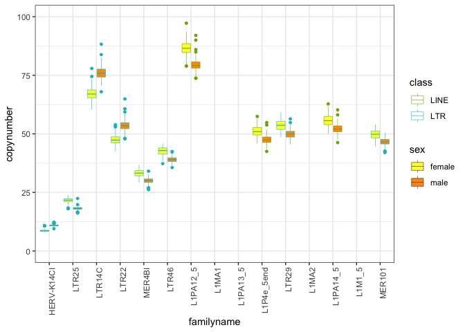
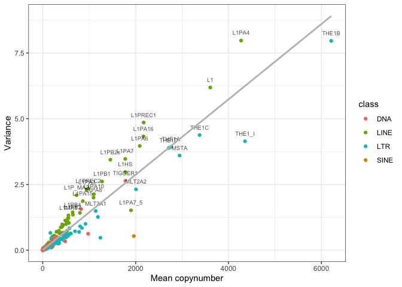
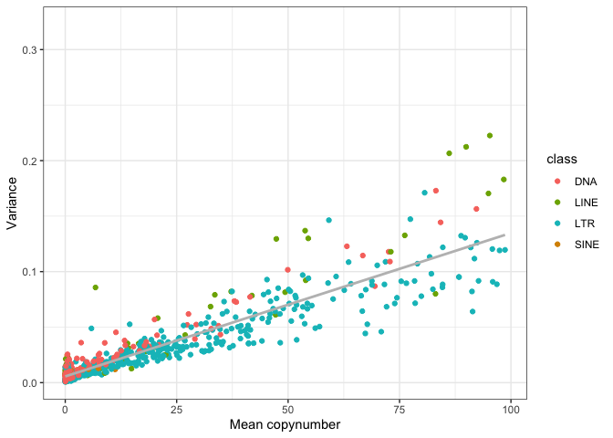

HGDP - Analyzing the TE abundance in the two sexes
================

``` r
library(tidyverse)
```

    ## ── Attaching core tidyverse packages ──────────────────────── tidyverse 2.0.0 ──
    ## ✔ dplyr     1.1.1     ✔ readr     2.1.4
    ## ✔ forcats   1.0.0     ✔ stringr   1.5.0
    ## ✔ ggplot2   3.4.2     ✔ tibble    3.2.1
    ## ✔ lubridate 1.9.2     ✔ tidyr     1.3.0
    ## ✔ purrr     1.0.1     
    ## ── Conflicts ────────────────────────────────────────── tidyverse_conflicts() ──
    ## ✖ dplyr::filter() masks stats::filter()
    ## ✖ dplyr::lag()    masks stats::lag()
    ## ℹ Use the conflicted package (<http://conflicted.r-lib.org/>) to force all conflicts to become errors

``` r
library(ggpubr)

theme_set(theme_bw())

HGDP <- read_delim("/Volumes/Temp1/rpianezza/0.old/summary-HGDP/HGDP_cutoff_classified.tsv")
```

    ## Rows: 1394352 Columns: 12
    ## ── Column specification ────────────────────────────────────────────────────────
    ## Delimiter: "\t"
    ## chr (9): ID, pop, sex, country, type, familyname, batch, superfamily, shared...
    ## dbl (3): length, reads, copynumber
    ## 
    ## ℹ Use `spec()` to retrieve the full column specification for this data.
    ## ℹ Specify the column types or set `show_col_types = FALSE` to quiet this message.

``` r
a_HGDP <- read_tsv("/Volumes/Temp1/rpianezza/PCA-copynumber-all-analysis/a_HGDP.tsv")
```

    ## Rows: 828 Columns: 2
    ## ── Column specification ────────────────────────────────────────────────────────
    ## Delimiter: "\t"
    ## chr (1): ID
    ## dbl (1): a
    ## 
    ## ℹ Use `spec()` to retrieve the full column specification for this data.
    ## ℹ Specify the column types or set `show_col_types = FALSE` to quiet this message.

``` r
HGDP_nobiased_samples <- filter(a_HGDP, (a > (-0.5)) & (a<0.5)) %>% select(ID) %>% pull()
HGDP_clean <- filter(HGDP, ID %in% HGDP_nobiased_samples)

DNA_names <- c("Crypton", "hAT", "Helitron", "Kolobok", "Mariner/Tc1", "Merlin", "MuDR", "piggyBac", "DNA transposon")
LINE_names <- c("L1", "CR1", "L2", "Crack", "RTE", "RTEX", "R4", "Vingi", "Tx1", "Penelope")
SINE_names <- c("SINE1/7SL", "SINE2/tRNA", "SINE3/5S", "SINE")
LTR_names <- c("ERV1", "ERV2", "ERV3", "Gypsy", "Endogenous Retrovirus", "LTR Retrotransposon", "Long terminal repeat", "Non-LTR Retrotransposon")
satellites_names <- c("Satellite", "satellite", "SAT")

classification <- HGDP_clean %>% mutate(class = case_when(superfamily %in% DNA_names ~ "DNA", superfamily %in% LINE_names ~ "LINE", superfamily %in% SINE_names ~ "SINE", superfamily %in% LTR_names ~ "LTR", superfamily %in% satellites_names ~ "satellite"))
```

# Sex differences

Male genome length = 6,045,293,052 bp Female genome length =
5,948,152,252 bp

``` r
f = 6045293052
m = 5948152252

diff_mf = f-m
diff_perc = (diff_mf/mean(f, m))*100

diff_perc
```

    ## [1] 1.606883

We expect a slight increase in females copynumber due to the bigger
genome they have: **1.6%** bigger than males (Y chromosome is shorter
than the X).

We chose a conservative threshold of **3.2%** to state that a TE
copynumber is significantly different between the sexes despite the
genome length difference.

``` r
cn <- classification %>% filter(type=="te") %>% group_by(familyname, sex, class, superfamily) %>% summarise(mean = mean(copynumber)) %>% filter(mean>1) #%>% filter(mean < 1000)
```

    ## `summarise()` has grouped output by 'familyname', 'sex', 'class'. You can
    ## override using the `.groups` argument.

``` r
(new_tibble <- tidyr::spread(cn, key = sex, value = mean))
```

    ## # A tibble: 714 × 5
    ## # Groups:   familyname, class [714]
    ##    familyname class     superfamily    female      male
    ##    <chr>      <chr>     <chr>           <dbl>     <dbl>
    ##  1 6kbHsap    satellite satellite      299.      302.  
    ##  2 ALR        satellite SAT          31525.    31812.  
    ##  3 ALR_       satellite SAT          77235.    76912.  
    ##  4 ALR1       satellite SAT          70870.    71586.  
    ##  5 ALR2       satellite SAT           2087.     2057.  
    ##  6 ALRa       satellite SAT            371.      361.  
    ##  7 ALRa_      satellite SAT           1776.     1750.  
    ##  8 ALRb       satellite SAT          28610.    28660.  
    ##  9 ALU        SINE      SINE1/7SL   196091.   192089.  
    ## 10 BLACKJACK  DNA       hAT              2.00      1.92
    ## # ℹ 704 more rows

``` r
colnames(new_tibble) <- c("familyname", "class", "superfamily", "female_cn", "male_cn")

(different_fem <- new_tibble %>% mutate(mean_cn = (female_cn+male_cn)/2, diff = abs(female_cn-male_cn)) %>% filter(diff > ((mean_cn/100)*3.2), diff>1) %>% arrange(desc(diff)))
```

    ## # A tibble: 128 × 7
    ## # Groups:   familyname, class [128]
    ##    familyname class     superfamily female_cn male_cn mean_cn   diff
    ##    <chr>      <chr>     <chr>           <dbl>   <dbl>   <dbl>  <dbl>
    ##  1 HSATI      satellite SAT              341.   2122.   1232. 1781. 
    ##  2 HSATII     satellite SAT            28262.  27132.  27697. 1130. 
    ##  3 THE1_I     LTR       ERV3            4436.   4273.   4355.  164. 
    ##  4 L1PA4      LINE      L1              4347.   4195.   4271.  152. 
    ##  5 L1PA7_5    LINE      L1              1945.   1853.   1899.   91.4
    ##  6 L1PREC1    LINE      L1              2216.   2129.   2172.   86.6
    ##  7 L1PA16     LINE      L1              2205.   2131.   2168.   73.9
    ##  8 L1PB2c     LINE      L1              1487.   1424.   1456.   62.3
    ##  9 L1PA7      LINE      L1              1806.   1747.   1777.   58.8
    ## 10 L1PB1      LINE      L1              1303.   1251.   1277.   52.7
    ## # ℹ 118 more rows

``` r
(different_mal <- new_tibble %>% mutate(mean_cn = (female_cn+male_cn)/2, diff = abs(female_cn-male_cn)) %>% filter(diff>1) %>% arrange(desc(diff)))
```

    ## # A tibble: 291 × 7
    ## # Groups:   familyname, class [291]
    ##    familyname class     superfamily female_cn male_cn mean_cn  diff
    ##    <chr>      <chr>     <chr>           <dbl>   <dbl>   <dbl> <dbl>
    ##  1 ALU        SINE      SINE1/7SL     196091. 192089. 194090. 4002.
    ##  2 HSATI      satellite SAT              341.   2122.   1232. 1781.
    ##  3 HSATII     satellite SAT            28262.  27132.  27697. 1130.
    ##  4 ALR1       satellite SAT            70870.  71586.  71228.  716.
    ##  5 ALR_       satellite SAT            77235.  76912.  77073.  324.
    ##  6 ALR        satellite SAT            31525.  31812.  31669.  286.
    ##  7 THE1_I     LTR       ERV3            4436.   4273.   4355.  164.
    ##  8 THE1B      LTR       ERV3            6287.   6134.   6211.  153.
    ##  9 L1PA4      LINE      L1              4347.   4195.   4271.  152.
    ## 10 L1         LINE      L1              3661.   3551.   3606.  110.
    ## # ℹ 281 more rows

``` r
(more_in_males <- different_mal %>% filter(male_cn>female_cn))
```

    ## # A tibble: 16 × 7
    ## # Groups:   familyname, class [16]
    ##    familyname class     superfamily           female_cn male_cn  mean_cn    diff
    ##    <chr>      <chr>     <chr>                     <dbl>   <dbl>    <dbl>   <dbl>
    ##  1 HSATI      satellite SAT                      341.    2122.   1232.   1781.  
    ##  2 ALR1       satellite SAT                    70870.   71586.  71228.    716.  
    ##  3 ALR        satellite SAT                    31525.   31812.  31669.    286.  
    ##  4 ALRb       satellite SAT                    28610.   28660.  28635.     49.6 
    ##  5 LTR14C     LTR       ERV2                      67.1     76.1    71.6     8.93
    ##  6 HERV9      LTR       ERV1                     134.     142.    138.      7.35
    ##  7 LTR22      LTR       ERV2                      47.5     53.5    50.5     6.07
    ##  8 6kbHsap    satellite satellite                299.     302.    300.      3.17
    ##  9 MER22      <NA>      MER22                    160.     163.    161.      3.11
    ## 10 LTR6A      LTR       ERV1                      68.7     71.3    70.0     2.67
    ## 11 LTR12D     LTR       ERV1                     205.     208.    207.      2.46
    ## 12 HERV-K14CI LTR       ERV2                       8.63    10.9     9.76    2.28
    ## 13 HERVK9I    LTR       ERV2                     147.     149.    148.      2.09
    ## 14 LTR22B     LTR       ERV2                      41.6     43.6    42.6     2.00
    ## 15 LTR15      LTR       ERV1                     121.     123.    122.      1.11
    ## 16 HERV30I    LTR       Endogenous Retrovirus      9.77    10.9    10.3     1.09

``` r
(more_in_females <- different_fem %>% filter(male_cn<female_cn))
```

    ## # A tibble: 120 × 7
    ## # Groups:   familyname, class [120]
    ##    familyname class     superfamily female_cn male_cn mean_cn   diff
    ##    <chr>      <chr>     <chr>           <dbl>   <dbl>   <dbl>  <dbl>
    ##  1 HSATII     satellite SAT            28262.  27132.  27697. 1130. 
    ##  2 THE1_I     LTR       ERV3            4436.   4273.   4355.  164. 
    ##  3 L1PA4      LINE      L1              4347.   4195.   4271.  152. 
    ##  4 L1PA7_5    LINE      L1              1945.   1853.   1899.   91.4
    ##  5 L1PREC1    LINE      L1              2216.   2129.   2172.   86.6
    ##  6 L1PA16     LINE      L1              2205.   2131.   2168.   73.9
    ##  7 L1PB2c     LINE      L1              1487.   1424.   1456.   62.3
    ##  8 L1PA7      LINE      L1              1806.   1747.   1777.   58.8
    ##  9 L1PB1      LINE      L1              1303.   1251.   1277.   52.7
    ## 10 L1PREC2    LINE      L1              1007.    956.    982.   51.2
    ## # ℹ 110 more rows

``` r
m_count <- more_in_males %>% ungroup() %>% summarise(count = n()) %>% pull()
f_count <- more_in_females %>% ungroup() %>% summarise(count = n()) %>% pull()
tot_count <- classification %>% filter(type=="te") %>% select(familyname) %>% distinct() %>% summarise(count = n()-(m_count+f_count)) %>% pull()
names <- c("More in males", "More in females", "No difference")

pie_tibble <- tibble(m_count, f_count, tot_count) %>% t() %>% as_tibble() %>% bind_cols(names) %>% rename("count" = "V1", "condition" = "...2") %>% relocate(condition, before = NULL)
```

    ## Warning: The `x` argument of `as_tibble.matrix()` must have unique column names if
    ## `.name_repair` is omitted as of tibble 2.0.0.
    ## ℹ Using compatibility `.name_repair`.
    ## This warning is displayed once every 8 hours.
    ## Call `lifecycle::last_lifecycle_warnings()` to see where this warning was
    ## generated.

    ## New names:
    ## • `` -> `...2`

``` r
pie_tibble <- pie_tibble %>% mutate(percent = count/sum(pie_tibble$count)*100)

(pie <- ggplot(pie_tibble, aes(x="", y=count, fill=condition))+
  geom_col(width = 1) + labs(fill='') +
  coord_polar(theta="y", start = pi/2)+
  theme_void()+
  geom_text(aes(label = count), 
            position = position_stack(vjust = 0.5), 
            size = 5))+
  theme(legend.position = "left")+
  scale_fill_manual(values=c("#FFFF33", "#FF9900", "#999999"))
```

<!-- -->

``` r
ggsave("/Volumes/Temp1/rpianezza/paper/figures/sex-diff-pie.png", pie, dpi = 300, width = 6, height = 6)
```

``` r
females <- more_in_females %>% group_by(class) %>% summarise(count = n()) 

females <- females %>% mutate(percent = count/sum(females$count)*100)

sum_satellite_na <- females %>%
  filter(class %in% c("satellite", NA)) %>%
  summarise(count = sum(count),
            percent = sum(percent, na.rm = TRUE)) %>% mutate(class = "Other")

(females_mod <- females %>% filter(!(class %in% c("satellite", NA))) %>% bind_rows(sum_satellite_na))
```

    ## # A tibble: 4 × 3
    ##   class count percent
    ##   <chr> <int>   <dbl>
    ## 1 DNA       5    4.17
    ## 2 LINE     49   40.8 
    ## 3 LTR      63   52.5 
    ## 4 Other     3    2.5

``` r
x_values <- ifelse(females_mod$class == "Other", 1.3, 1.3)

(f_pie <- ggplot(females_mod, aes(x="", y=count, fill=class))+
  geom_col(width = 1) + labs(fill='') +
  coord_polar(theta="y")+
  theme_void()+
  geom_text(aes(x = 1.3, label = count), 
            position = position_stack(vjust = 0.5), 
            size = 5)+
  scale_color_manual(values=c("#F8766D", "#7CAE00", "#00BFC4", "#C77CFF")))
```

<!-- -->

``` r
males <- more_in_males %>% group_by(class) %>% summarise(count = n()) 

males <- males %>% mutate(percent = count/sum(males$count)*100)

sum_satellite_na <- males %>%
  filter(class %in% c("satellite", NA)) %>%
  summarise(count = sum(count),
            percent = sum(percent, na.rm = TRUE)) %>% mutate(class = "Other")

(males_mod <- males %>% filter(!(class %in% c("satellite", NA))) %>% bind_rows(sum_satellite_na))
```

    ## # A tibble: 2 × 3
    ##   class count percent
    ##   <chr> <int>   <dbl>
    ## 1 LTR      10    62.5
    ## 2 Other     6    37.5

``` r
x_values <- ifelse(males_mod$class == "Other", 1.3, 1.3)

(m_pie <- ggplot(males_mod, aes(x="", y=count, fill=class))+
  geom_col(width = 1) + labs(fill='') +
  coord_polar(theta="y")+
  theme_void()+
  geom_text(aes(x = x_values, label = count), 
            position = position_stack(vjust = 0.5), 
            size = 5)+
  scale_fill_manual(values=c("#00BFC4", "#C77CFF")))
```

<!-- -->

``` r
ggsave("/Volumes/Temp1/rpianezza/paper/figures/male-diff-pie.png", m_pie, dpi = 300, width = 8, height = 6)
ggsave("/Volumes/Temp1/rpianezza/paper/figures/female-diff-pie.png", f_pie, dpi = 300, width = 8, height = 6)
```

``` r
(sex_diff <- new_tibble %>% mutate(mean_cn = (female_cn+male_cn)/2, diff = abs(female_cn-male_cn), diff_normalized = diff/mean_cn) %>% filter(diff > 2, !(class %in% c("satellite", NA))) %>% arrange(desc(diff_normalized)) %>% filter(diff_normalized > 0.06))
```

    ## # A tibble: 15 × 8
    ## # Groups:   familyname, class [15]
    ##    familyname class superfamily  female_cn male_cn mean_cn  diff diff_normalized
    ##    <chr>      <chr> <chr>            <dbl>   <dbl>   <dbl> <dbl>           <dbl>
    ##  1 HERV-K14CI LTR   ERV2              8.63    10.9    9.76  2.28          0.233 
    ##  2 LTR25      LTR   ERV1             21.6     18.2   19.9   3.45          0.173 
    ##  3 LTR14C     LTR   ERV2             67.1     76.1   71.6   8.93          0.125 
    ##  4 LTR22      LTR   ERV2             47.5     53.5   50.5   6.07          0.120 
    ##  5 MER4BI     LTR   Endogenous …     33.2     29.9   31.6   3.25          0.103 
    ##  6 LTR46      LTR   ERV1             42.7     39.0   40.8   3.66          0.0897
    ##  7 L1PA12_5   LINE  L1               86.6     79.5   83.1   7.11          0.0855
    ##  8 L1MA1      LINE  L1              576.     529.   552.   46.8           0.0847
    ##  9 L1PA13_5   LINE  L1              151.     140.   145.   11.3           0.0776
    ## 10 L1P4e_5end LINE  L1               51.2     47.5   49.3   3.66          0.0741
    ## 11 LTR29      LTR   ERV1             53.7     49.8   51.8   3.82          0.0739
    ## 12 L1MA2      LINE  L1              452.     422.   437.   30.3           0.0694
    ## 13 L1PA14_5   LINE  L1               55.8     52.1   54.0   3.71          0.0688
    ## 14 L1M1_5     LINE  L1              518.     486.   502.   32.6           0.0650
    ## 15 MER101     LTR   ERV1             49.7     46.6   48.2   3.11          0.0645

``` r
outliers <- HGDP_clean %>% filter(type=="te", familyname %in% sex_diff$familyname) %>% inner_join(sex_diff, by="familyname")
outliers <- outliers[order(outliers$diff_normalized,decreasing=T),]
outliers$familyname<-factor(outliers$familyname,levels=unique(outliers$familyname))

#(scatter <- ggplot(outliers, aes(x = familyname, y = copynumber, fill = sex, color = class)) + geom_boxplot(notch = FALSE, width = 0.8, lwd = 0.2, outlier.size = 1.2) +
#theme(axis.text.x = element_text(angle = 90, hjust = 1)) +
#scale_fill_manual(values = c("#FFFF33", "#FF9900")))

(scatter <- ggplot(outliers, aes(x = familyname, y = copynumber, fill = sex, color = class)) + geom_boxplot(notch = FALSE, width = 0.8, lwd = 0.2, outlier.size = 1) +
theme(axis.text.x = element_text(angle = 90, hjust = 1)) +
scale_fill_manual(values = c("#FFFF33", "#FF9900")) +
scale_color_manual(values = c("#7CAE00", "#00BFC4")) +
ylim(0, 100))
```

    ## Warning: Removed 2640 rows containing non-finite values (`stat_boxplot()`).

<!-- -->

``` r
(scatter <- ggplot(outliers, aes(x = familyname, y = copynumber, fill = sex, color = class)) + geom_boxplot(notch = FALSE, width = 0.8, lwd = 0.2, outlier.size = 1) +
theme(axis.text.x = element_text(angle = 90, hjust = 1)) +
scale_fill_manual(values = c("#FFFF33", "#FF9900")) +
scale_color_manual(values = c("#7CAE00", "#00BFC4")) +
ylim(140, 620))
```

    ## Warning: Removed 7498 rows containing non-finite values (`stat_boxplot()`).

<!-- -->

``` r
m <- classification %>% filter(sex=="male") %>% select(ID) %>% summarise(individuals = n()) %>% pull()

f <- classification %>% filter(sex=="female") %>% select(ID) %>% summarise(individuals = n()) %>% pull()

(thanos <- classification %>% filter(type=="te") %>% group_by(sex) %>% summarise(total_te_sum = sum(copynumber), normalized_te_sum = if_else(sex=="female", total_te_sum/f, total_te_sum/m), kb=if_else(sex=="female", sum(copynumber*length)/f, sum(copynumber*length)/m)) %>% distinct())
```

    ## Warning: Returning more (or less) than 1 row per `summarise()` group was deprecated in
    ## dplyr 1.1.0.
    ## ℹ Please use `reframe()` instead.
    ## ℹ When switching from `summarise()` to `reframe()`, remember that `reframe()`
    ##   always returns an ungrouped data frame and adjust accordingly.
    ## Call `lifecycle::last_lifecycle_warnings()` to see where this warning was
    ## generated.

    ## `summarise()` has grouped output by 'sex'. You can override using the `.groups`
    ## argument.

    ## # A tibble: 2 × 4
    ## # Groups:   sex [2]
    ##   sex    total_te_sum normalized_te_sum      kb
    ##   <chr>         <dbl>             <dbl>   <dbl>
    ## 1 female   141764828.              331. 168182.
    ## 2 male     224098901.              328. 164618.

``` r
te_sum_m <- thanos %>% filter(sex=="male") %>% select(normalized_te_sum) %>% pull()
```

    ## Adding missing grouping variables: `sex`

``` r
te_sum_f <- thanos %>% filter(sex=="female") %>% select(normalized_te_sum) %>% pull()
```

    ## Adding missing grouping variables: `sex`

``` r
(percentage_diff <- ((te_sum_m - te_sum_f)/te_sum_f)*100)
```

    ## [1] -1.103957

# CV

``` r
cn <- classification %>% filter(type=="te") %>% group_by(familyname, class, superfamily) %>% summarise(mean = mean(copynumber), var = var(copynumber), cv = var/mean) %>% arrange(desc(cv)) %>% filter(!(class %in% c("satellite", NA)), mean>1) %>% filter(cv > 1.58)
```

    ## `summarise()` has grouped output by 'familyname', 'class'. You can override
    ## using the `.groups` argument.

``` r
outliers <- HGDP_clean %>% filter(type=="te", familyname %in% cn$familyname) %>% inner_join(cn, by="familyname")
outliers <- outliers[order(outliers$cv,decreasing=T),]
outliers$familyname<-factor(outliers$familyname,levels=unique(outliers$familyname))

(box <- ggplot(outliers, aes(x=familyname, y=copynumber)) + geom_boxplot(notch=F, aes(color=class)) +
  theme(axis.text.x = element_text(angle = 90, hjust = 1)) +
    ylim(0,7000)+
 scale_color_manual(values=c("#F8766D", "#7CAE00", "#00BFC4", "#C77CFF")))
```

    ## Warning: Removed 660 rows containing non-finite values (`stat_boxplot()`).

<!-- -->

``` r
ggsave("/Volumes/Temp1/rpianezza/paper/figures/cn.png", box, dpi = 300, width = 8, height = 6)
```

    ## Warning: Removed 660 rows containing non-finite values (`stat_boxplot()`).

``` r
(correlation <- classification %>% filter(type=="te", class!="satellite") %>% group_by(familyname, sex, class) %>% summarise(mean = mean(copynumber), cv = (var(copynumber))/mean, var = var(copynumber)) %>% ungroup() %>% group_by(familyname, class) %>% summarise(cn = mean(mean), cv = mean(cv), var=mean(var)))
```

    ## `summarise()` has grouped output by 'familyname', 'sex'. You can override using
    ## the `.groups` argument.
    ## `summarise()` has grouped output by 'familyname'. You can override using the
    ## `.groups` argument.

    ## # A tibble: 879 × 5
    ## # Groups:   familyname [879]
    ##    familyname  class         cn        cv     var
    ##    <chr>       <chr>      <dbl>     <dbl>   <dbl>
    ##  1 ALINE       LINE       0.134   0.00385 5.17e-4
    ##  2 ALU         SINE  194090.    145.      2.81e+7
    ##  3 AmnSINE1_HS SINE       0.438   0.0248  1.09e-2
    ##  4 BLACKJACK   DNA        1.96    0.00610 1.20e-2
    ##  5 CHARLIE1    DNA       15.3     0.0325  4.97e-1
    ##  6 CHARLIE10   DNA        2.03    0.00598 1.21e-2
    ##  7 CHARLIE1A   DNA        9.29    0.0167  1.56e-1
    ##  8 CHARLIE1B   DNA        3.50    0.0133  4.66e-2
    ##  9 CHARLIE2    DNA        0.212   0.00147 3.12e-4
    ## 10 CHARLIE2A   DNA        0.564   0.00244 1.38e-3
    ## # ℹ 869 more rows

``` r
fam <- cn %>% select(familyname) %>% pull()
```

    ## Adding missing grouping variables: `class`

``` r
cn10k <- correlation %>% filter(cn < 10000)
cn1k <- correlation %>% filter(cn < 1000)
cn100 <- correlation %>% filter(cn < 100)

(vplot1 <- ggplot(cn10k, aes(x = cn, y = cv, color = class)) +
  geom_point() +
  geom_text(aes(label=ifelse(familyname %in% fam, as.character(familyname), "")), color = "black", size=2.5, alpha = 0.7, nudge_y = 0.3) +
  geom_smooth(method = "lm", se = FALSE, color = "grey") +
  labs(x = "Mean copynumber", y = "Variance")+
 scale_color_manual(values=c("#F8766D", "#7CAE00", "#00BFC4", "#D89000")))
```

    ## `geom_smooth()` using formula = 'y ~ x'

<!-- -->

``` r
(vplot2 <- ggplot(cn1k, aes(x = cn, y = cv, color = class)) +
  geom_point() +
  geom_text(aes(label=ifelse(familyname %in% fam, as.character(familyname), "")), color = "black", size=2.5, alpha = 0.7, nudge_y = 0.06) +
  geom_smooth(method = "lm", se = FALSE, color = "grey") +
  labs(x = "Mean copynumber", y = "Variance")+
 scale_color_manual(values=c("#F8766D", "#7CAE00", "#00BFC4", "#D89000")))
```

    ## `geom_smooth()` using formula = 'y ~ x'

<!-- -->

``` r
(vplot3 <- ggplot(cn100, aes(x = cn, y = cv, color = class)) +
  geom_point() +
  geom_text(aes(label=ifelse(familyname %in% fam, as.character(familyname), "")), color = "black", size=2.5, alpha = 0.7, nudge_y = 0.1) +
  geom_smooth(method = "lm", se = FALSE, color = "grey") +
  labs(x = "Mean copynumber", y = "Variance")+
 scale_color_manual(values=c("#F8766D", "#7CAE00", "#00BFC4", "#D89000")))
```

    ## `geom_smooth()` using formula = 'y ~ x'

<!-- -->

``` r
ggsave("/Volumes/Temp1/rpianezza/paper/figures/var-cn.png", vplot2, dpi = 300, width = 8, height = 6)
```

    ## `geom_smooth()` using formula = 'y ~ x'

``` r
#(f_cn <- classification %>% filter(type=="te", sex=="female") %>% group_by(familyname, class, superfamily) %>% summarise(mean = mean(copynumber), var = var(copynumber), cv = var/mean) %>% arrange(desc(cv)) %>% filter(!(class %in% c("satellite", NA)), mean>1) %>% filter(cv > 1.62))

#f_outliers <- HGDP_clean %>% filter(type=="te", sex=="female", familyname %in% f_cn$familyname) %>% inner_join(f_cn, by="familyname")
#f_outliers <- f_outliers[order(f_outliers$copynumber,decreasing=T),]
#f_outliers$familyname<-factor(f_outliers$familyname,levels=unique(f_outliers$familyname))

#(box <- ggplot(f_outliers, aes(x=familyname, y=copynumber)) + geom_boxplot(notch=F, aes(color=class)) +
 # theme(axis.text.x = element_text(angle = 90, hjust = 1)) +
    #ylim(0,7000)+
 #scale_color_manual(values=c("#F8766D", "#7CAE00", "#00BFC4", "#C77CFF")))


#(m_cn <- classification %>% filter(type=="te", sex=="male") %>% group_by(familyname, class, superfamily) %>% summarise(mean = mean(copynumber), var = var(copynumber), cv = var/mean) %>% arrange(desc(cv)) %>% filter(!(class %in% c("satellite", NA)), mean>1) %>% filter(cv > 1.05))

#m_outliers <- HGDP_clean %>% filter(type=="te", sex=="male", familyname %in% m_cn$familyname) %>% inner_join(m_cn, by="familyname")
#m_outliers <- m_outliers[order(m_outliers$copynumber,decreasing=T),]
#m_outliers$familyname<-factor(m_outliers$familyname,levels=unique(m_outliers$familyname))

#(box <- ggplot(m_outliers, aes(x=familyname, y=copynumber)) + geom_boxplot(notch=F, aes(color=class)) +
  #theme(axis.text.x = element_text(angle = 90, hjust = 1)) +
   # ylim(0,7000)+
 #scale_color_manual(values=c("#F8766D", "#7CAE00", "#00BFC4", "#C77CFF")))
```

``` r
(box_ALU <- ggplot(outliers, aes(x=familyname, y=copynumber)) + geom_boxplot(notch=F, aes(color=class)) +
  theme(axis.text.x = element_text(angle = 90, hjust = 1)) +
    ylim(10000,220000)+
 scale_color_manual(values=c("#D89000")))
```

    ## Warning: Removed 18480 rows containing non-finite values (`stat_boxplot()`).

<!-- -->

``` r
#(m_box_ALU <- ggplot(m_outliers, aes(x=familyname, y=copynumber)) + geom_boxplot(notch=F, aes(color=class)) +
  #theme(axis.text.x = element_text(angle = 90, hjust = 1)) +
    #ylim(150000,220000)+
 #scale_color_manual(values=c("#D89000")))


#(f_box_ALU <- ggplot(f_outliers, aes(x=familyname, y=copynumber)) + geom_boxplot(notch=F, aes(color=class)) +
  #theme(axis.text.x = element_text(angle = 90, hjust = 1)) +
    #ylim(150000,220000)+
 #scale_color_manual(values=c("#D89000")))

ggsave("/Volumes/Temp1/rpianezza/paper/figures/var-cn-alu.png", box_ALU, dpi = 300, width = 8, height = 6)
```

    ## Warning: Removed 18480 rows containing non-finite values (`stat_boxplot()`).

``` r
cn <- classification %>% filter(type=="te") %>% group_by(familyname, class, superfamily) %>% summarise(mean = mean(copynumber), var = var(copynumber), cv = var/mean) %>% arrange(desc(cv)) %>% filter(!(class %in% c("satellite", NA)), mean>1) %>% filter(cv > 1.58)
```

    ## `summarise()` has grouped output by 'familyname', 'class'. You can override
    ## using the `.groups` argument.

``` r
outliers <- HGDP_clean %>% filter(type=="te", familyname %in% cn$familyname) %>% inner_join(cn, by="familyname")
outliers <- outliers[order(outliers$copynumber,decreasing=T),]
outliers$familyname<-factor(outliers$familyname,levels=unique(outliers$familyname))

(box <- ggplot(outliers, aes(x=familyname, y=copynumber)) + geom_boxplot(notch=F, aes(color=class)) +
  theme(axis.text.x = element_text(angle = 90, hjust = 1)) +
 scale_color_manual(values=c("#F8766D", "#7CAE00", "#00BFC4", "#D89000")))
```

<!-- -->

# Most abundant

``` r
(most_ab <- classification %>% filter(type=="te") %>% group_by(familyname, class, superfamily) %>% summarise(mean = mean(copynumber)) %>% filter(!(class %in% c("satellite", NA)), mean>1) %>% filter(mean > 850) %>% arrange(desc(mean)))
```

    ## `summarise()` has grouped output by 'familyname', 'class'. You can override
    ## using the `.groups` argument.

    ## # A tibble: 30 × 4
    ## # Groups:   familyname, class [30]
    ##    familyname class superfamily    mean
    ##    <chr>      <chr> <chr>         <dbl>
    ##  1 ALU        SINE  SINE1/7SL   193629.
    ##  2 THE1B      LTR   ERV3          6193.
    ##  3 THE1_I     LTR   ERV3          4336.
    ##  4 L1PA4      LINE  L1            4254.
    ##  5 L1         LINE  L1            3594.
    ##  6 THE1C      LTR   ERV3          3366.
    ##  7 MSTA       LTR   ERV3          2937.
    ##  8 THE1A      LTR   ERV3          2756.
    ##  9 THE1D      LTR   ERV3          2706.
    ## 10 L1PREC1    LINE  L1            2162.
    ## # ℹ 20 more rows

``` r
outliers <- HGDP_clean %>% filter(type=="te", familyname %in% most_ab$familyname) %>% inner_join(cn, by="familyname")
outliers <- outliers[order(outliers$mean,decreasing=T),]
outliers$familyname<-factor(outliers$familyname,levels=unique(outliers$familyname))

(box <- ggplot(outliers, aes(x=familyname, y=copynumber)) + geom_boxplot(notch=F, aes(color=class)) +
  theme(axis.text.x = element_text(angle = 90, hjust = 1)) +
    ylim(0,6500)+
 scale_color_manual(values=c("#F8766D", "#7CAE00", "#00BFC4", "#C77CFF")))
```

    ## Warning: Removed 729 rows containing non-finite values (`stat_boxplot()`).

<!-- -->

``` r
(box_alu <- ggplot(outliers, aes(x=familyname, y=copynumber)) + geom_boxplot(notch=F, aes(color=class)) +
  theme(axis.text.x = element_text(angle = 90, hjust = 1)) +
    ylim(100000,220000)+
 scale_color_manual(values=c("#D89000")))
```

    ## Warning: Removed 15840 rows containing non-finite values (`stat_boxplot()`).

<!-- -->

# Other stuff

``` r
library(scales)
```

    ## 
    ## Attaching package: 'scales'

    ## The following object is masked from 'package:purrr':
    ## 
    ##     discard

    ## The following object is masked from 'package:readr':
    ## 
    ##     col_factor

``` r
#extract hex color codes for a plot with three elements in ggplot2 
hex <- hue_pal()(10)

#overlay hex color codes on actual colors
show_col(hex)
```

<!-- -->
