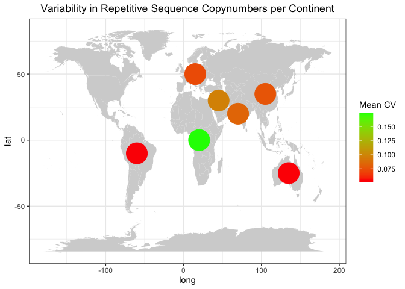

HGDP - Analyzing the TEs with the highest variance
================

``` r
library(tidyverse)
```

    ## ── Attaching core tidyverse packages ──────────────────────── tidyverse 2.0.0 ──
    ## ✔ dplyr     1.1.1     ✔ readr     2.1.4
    ## ✔ forcats   1.0.0     ✔ stringr   1.5.0
    ## ✔ ggplot2   3.4.2     ✔ tibble    3.2.1
    ## ✔ lubridate 1.9.2     ✔ tidyr     1.3.0
    ## ✔ purrr     1.0.1     
    ## ── Conflicts ────────────────────────────────────────── tidyverse_conflicts() ──
    ## ✖ dplyr::filter() masks stats::filter()
    ## ✖ dplyr::lag()    masks stats::lag()
    ## ℹ Use the conflicted package (<http://conflicted.r-lib.org/>) to force all conflicts to become errors

``` r
library(ggpubr)

theme_set(theme_bw())

HGDP <- read_delim("/Volumes/Temp1/rpianezza/0.old/summary-HGDP/HGDP_cutoff_classified.tsv")
```

    ## Rows: 1394352 Columns: 12
    ## ── Column specification ────────────────────────────────────────────────────────
    ## Delimiter: "\t"
    ## chr (9): ID, pop, sex, country, type, familyname, batch, superfamily, shared...
    ## dbl (3): length, reads, copynumber
    ## 
    ## ℹ Use `spec()` to retrieve the full column specification for this data.
    ## ℹ Specify the column types or set `show_col_types = FALSE` to quiet this message.

``` r
a_HGDP <- read_tsv("/Volumes/Temp1/rpianezza/PCA-copynumber-all-analysis/a_HGDP.tsv")
```

    ## Rows: 828 Columns: 2
    ## ── Column specification ────────────────────────────────────────────────────────
    ## Delimiter: "\t"
    ## chr (1): ID
    ## dbl (1): a
    ## 
    ## ℹ Use `spec()` to retrieve the full column specification for this data.
    ## ℹ Specify the column types or set `show_col_types = FALSE` to quiet this message.

``` r
HGDP_nobiased_samples <- filter(a_HGDP, (a > (-0.5)) & (a<0.5)) %>% select(ID) %>% pull()
HGDP_clean <- filter(HGDP, ID %in% HGDP_nobiased_samples)

DNA_names <- c("Crypton", "hAT", "Helitron", "Kolobok", "Mariner/Tc1", "Merlin", "MuDR", "piggyBac", "DNA transposon")
LINE_names <- c("L1", "CR1", "L2", "Crack", "RTE", "RTEX", "R4", "Vingi", "Tx1", "Penelope")
SINE_names <- c("SINE1/7SL", "SINE2/tRNA", "SINE3/5S", "SINE")
LTR_names <- c("ERV1", "ERV2", "ERV3", "Gypsy", "Endogenous Retrovirus", "LTR Retrotransposon", "Long terminal repeat", "Non-LTR Retrotransposon")
satellites_names <- c("Satellite", "satellite", "SAT")

(classification <- HGDP_clean %>% mutate(class = case_when(superfamily %in% DNA_names ~ "DNA", superfamily %in% LINE_names ~ "LINE", superfamily %in% SINE_names ~ "SINE", superfamily %in% LTR_names ~ "LTR", superfamily %in% satellites_names ~ "satellite")))
```

    ## # A tibble: 1,111,440 × 13
    ##    ID        pop    sex   country type  familyname length reads copynumber batch
    ##    <chr>     <chr>  <chr> <chr>   <chr> <chr>       <dbl> <dbl>      <dbl> <chr>
    ##  1 HGDP00003 Brahui male  Centra… scg   chr1:9168…   4152 1279.      0.989 ro   
    ##  2 HGDP00003 Brahui male  Centra… scg   chr1:9605…   5136 1700.      1.06  ro   
    ##  3 HGDP00003 Brahui male  Centra… scg   chr1:1203…   3064 1051.      1.10  ro   
    ##  4 HGDP00003 Brahui male  Centra… scg   chr1:1324…   3239 1096.      1.09  ro   
    ##  5 HGDP00003 Brahui male  Centra… scg   chr1:1331…   4035 1445.      1.15  ro   
    ##  6 HGDP00003 Brahui male  Centra… scg   chr1:1399…   2500  924.      1.19  ro   
    ##  7 HGDP00003 Brahui male  Centra… scg   chr1:1434…   2599  779.      0.963 ro   
    ##  8 HGDP00003 Brahui male  Centra… scg   chr1:1598…   2124  613.      0.926 ro   
    ##  9 HGDP00003 Brahui male  Centra… scg   chr1:2315…   6284 2020.      1.03  ro   
    ## 10 HGDP00003 Brahui male  Centra… scg   chr1:2629…   3222 1044.      1.04  ro   
    ## # ℹ 1,111,430 more rows
    ## # ℹ 3 more variables: superfamily <chr>, shared_with <chr>, class <chr>

``` r
cn <- HGDP_clean %>% filter(type=="te") %>% group_by(familyname) %>% summarise(mean = mean(copynumber)) %>% filter(mean < 1000) %>% select(familyname) %>% pull()
```

``` r
variability <- HGDP_clean %>% filter(familyname %in% cn) %>% group_by(pop, sex, familyname, country) %>% summarise(mean_cn = mean(copynumber), variance = var(copynumber), coeff_var = variance/mean_cn, individuals = n()) %>% ungroup()
```

    ## `summarise()` has grouped output by 'pop', 'sex', 'familyname'. You can
    ## override using the `.groups` argument.

``` r
(pop <- variability %>% group_by(pop, sex, country, individuals) %>% summarise(mean_cv = mean(coeff_var, na.rm=TRUE), normalized_cv = mean_cv/individuals) %>% arrange(desc(mean_cv)) %>% distinct())
```

    ## Warning: Returning more (or less) than 1 row per `summarise()` group was deprecated in
    ## dplyr 1.1.0.
    ## ℹ Please use `reframe()` instead.
    ## ℹ When switching from `summarise()` to `reframe()`, remember that `reframe()`
    ##   always returns an ungrouped data frame and adjust accordingly.
    ## Call `lifecycle::last_lifecycle_warnings()` to see where this warning was
    ## generated.

    ## `summarise()` has grouped output by 'pop', 'sex', 'country', 'individuals'. You
    ## can override using the `.groups` argument.

    ## # A tibble: 92 × 6
    ## # Groups:   pop, sex, country, individuals [92]
    ##    pop       sex    country            individuals mean_cv normalized_cv
    ##    <chr>     <chr>  <chr>                    <int>   <dbl>         <dbl>
    ##  1 Mandenka  female Africa                       2   0.398       0.199  
    ##  2 Oroqen    female East_Asia                    2   0.327       0.163  
    ##  3 Hezhen    female East_Asia                    3   0.240       0.0800 
    ##  4 Uygur     male   Central_South_Asia           4   0.197       0.0493 
    ##  5 Mozabite  female Middle_East                  8   0.179       0.0224 
    ##  6 Burusho   female Central_South_Asia           3   0.174       0.0579 
    ##  7 Biaka     male   Africa                       4   0.172       0.0431 
    ##  8 Cambodian male   East_Asia                    2   0.155       0.0775 
    ##  9 Druze     male   Middle_East                  8   0.151       0.0188 
    ## 10 Mozabite  male   Middle_East                 15   0.142       0.00948
    ## # ℹ 82 more rows

``` r
(country <- pop %>% group_by(country) %>% summarise(mean_cv = mean(mean_cv, na.rm = TRUE)) %>% arrange(desc(mean_cv)))
```

    ## # A tibble: 7 × 2
    ##   country            mean_cv
    ##   <chr>                <dbl>
    ## 1 Africa              0.175 
    ## 2 Middle_East         0.0971
    ## 3 Central_South_Asia  0.0833
    ## 4 East_Asia           0.0760
    ## 5 Europe              0.0719
    ## 6 America             0.0545
    ## 7 Oceania             0.0510

``` r
#(females <- cn %>% filter(sex=="female"))
#(males <- cn %>% filter(sex=="male"))
```

``` r
continents <- c("Africa", "Middle_East", "Central_South_Asia", "East_Asia", "Europe", "America", "Oceania")

latitudes <- c(0, 30, 20, 35, 50, -10, -25)
longitudes <- c(20, 45, 70, 105, 15, -60, 135)

coordinates_con <- tibble(country = continents, latitude = latitudes, longitude = longitudes)

coordinates_pop <- read_tsv("/Users/rpianezza/TE/summary-HGDP/HGDP_populationcoordinates.txt", col_names = c("pop", "region", "latitude", "longitude")) %>% select(pop, latitude, longitude)
```

    ## Rows: 54 Columns: 4
    ## ── Column specification ────────────────────────────────────────────────────────
    ## Delimiter: "\t"
    ## chr (2): pop, region
    ## dbl (2): latitude, longitude
    ## 
    ## ℹ Use `spec()` to retrieve the full column specification for this data.
    ## ℹ Specify the column types or set `show_col_types = FALSE` to quiet this message.

``` r
plot_map_country <- function(data, coord, title){
  
full <- inner_join(data, coord, by="country")
world_map = map_data("world")

ggplot() +
  geom_map(
    data = world_map, map = world_map,
    aes(long, lat, map_id = region),
    color = "white", fill = "lightgray", size = 0) +
  geom_point(data = full, aes(x=longitude, y=latitude, color = mean_cv), size = 12) + 
  geom_errorbar() + 
  scale_colour_gradient(low = "red", high = "green") + 
  theme(legend.position="right", legend.direction = "vertical") + 
  labs(color = "Mean CV") + 
  theme(plot.title = element_text(hjust = 0.5)) + 
  ggtitle(title)
}

plot_map_pop <- function(data, coord, title){
  
full <- inner_join(data, coord, by="pop")
world_map = map_data("world")

ggplot() +
  geom_map(
    data = world_map, map = world_map,
    aes(long, lat, map_id = region),
    color = "white", fill = "lightgray", size = 0) +
  geom_point(data = full, aes(x=longitude, y=latitude, color = mean_cv), size = 4) + 
  geom_errorbar() + 
  scale_colour_gradient(low = "red", high = "green") + 
  theme(legend.position="right", legend.direction = "vertical") + 
  labs(color = "Mean CV") + 
  theme(plot.title = element_text(hjust = 0.5)) + 
  ggtitle(title)
}


plot_map_country(country, coordinates_con, "Variability in Repetitive Sequence Copynumbers per Continent")
```

    ## Warning: Using `size` aesthetic for lines was deprecated in ggplot2 3.4.0.
    ## ℹ Please use `linewidth` instead.
    ## This warning is displayed once every 8 hours.
    ## Call `lifecycle::last_lifecycle_warnings()` to see where this warning was
    ## generated.

    ## Warning in geom_map(data = world_map, map = world_map, aes(long, lat, map_id =
    ## region), : Ignoring unknown aesthetics: x and y

<!-- -->

``` r
#plot_map_pop(pop, coordinates_pop, "Variability in Repetitive Sequence Copynumbers per Population")
```

``` r
cv_by_class <- function(data, c){
  
selected <- data %>% filter(class==c) %>% select(familyname) %>% pull()
variability <- data %>% filter(familyname %in% selected, familyname %in% cn) %>% group_by(pop, sex, familyname, country) %>% summarise(mean_cn = mean(copynumber), variance = var(copynumber), coeff_var = variance/mean_cn, individuals = n()) %>% ungroup()
pop <- variability %>% group_by(pop, sex, country, individuals) %>% summarise(mean_cv = mean(coeff_var, na.rm=TRUE), normalized_cv = mean_cv/individuals) %>% arrange(desc(mean_cv)) %>% distinct()

(country <- pop %>% group_by(country) %>% summarise(mean_cv = mean(mean_cv, na.rm = TRUE)) %>% arrange(desc(mean_cv)))
}
```

``` r
(LINE_cv <- cv_by_class(classification, "LINE"))
```

    ## `summarise()` has grouped output by 'pop', 'sex', 'familyname'. You can
    ## override using the `.groups` argument.

    ## Warning: Returning more (or less) than 1 row per `summarise()` group was deprecated in
    ## dplyr 1.1.0.
    ## ℹ Please use `reframe()` instead.
    ## ℹ When switching from `summarise()` to `reframe()`, remember that `reframe()`
    ##   always returns an ungrouped data frame and adjust accordingly.
    ## Call `lifecycle::last_lifecycle_warnings()` to see where this warning was
    ## generated.

    ## `summarise()` has grouped output by 'pop', 'sex', 'country', 'individuals'. You
    ## can override using the `.groups` argument.

    ## # A tibble: 7 × 2
    ##   country            mean_cv
    ##   <chr>                <dbl>
    ## 1 Africa              0.355 
    ## 2 Middle_East         0.231 
    ## 3 Central_South_Asia  0.182 
    ## 4 East_Asia           0.154 
    ## 5 Europe              0.140 
    ## 6 America             0.0986
    ## 7 Oceania             0.0675

``` r
(LTR_cv <- cv_by_class(classification, "LTR"))
```

    ## `summarise()` has grouped output by 'pop', 'sex', 'familyname'. You can
    ## override using the `.groups` argument.

    ## Warning: Returning more (or less) than 1 row per `summarise()` group was deprecated in
    ## dplyr 1.1.0.
    ## ℹ Please use `reframe()` instead.
    ## ℹ When switching from `summarise()` to `reframe()`, remember that `reframe()`
    ##   always returns an ungrouped data frame and adjust accordingly.
    ## Call `lifecycle::last_lifecycle_warnings()` to see where this warning was
    ## generated.

    ## `summarise()` has grouped output by 'pop', 'sex', 'country', 'individuals'. You
    ## can override using the `.groups` argument.

    ## # A tibble: 7 × 2
    ##   country            mean_cv
    ##   <chr>                <dbl>
    ## 1 Africa              0.0896
    ## 2 Middle_East         0.0610
    ## 3 Central_South_Asia  0.0503
    ## 4 East_Asia           0.0470
    ## 5 Europe              0.0438
    ## 6 America             0.0302
    ## 7 Oceania             0.0215

``` r
(DNA_cv <- cv_by_class(classification, "DNA"))
```

    ## `summarise()` has grouped output by 'pop', 'sex', 'familyname'. You can
    ## override using the `.groups` argument.

    ## Warning: Returning more (or less) than 1 row per `summarise()` group was deprecated in
    ## dplyr 1.1.0.
    ## ℹ Please use `reframe()` instead.
    ## ℹ When switching from `summarise()` to `reframe()`, remember that `reframe()`
    ##   always returns an ungrouped data frame and adjust accordingly.
    ## Call `lifecycle::last_lifecycle_warnings()` to see where this warning was
    ## generated.

    ## `summarise()` has grouped output by 'pop', 'sex', 'country', 'individuals'. You
    ## can override using the `.groups` argument.

    ## # A tibble: 7 × 2
    ##   country            mean_cv
    ##   <chr>                <dbl>
    ## 1 Africa              0.0652
    ## 2 Middle_East         0.0407
    ## 3 Central_South_Asia  0.0350
    ## 4 Europe              0.0313
    ## 5 East_Asia           0.0302
    ## 6 America             0.0192
    ## 7 Oceania             0.0144

``` r
#outliers <- c("L1PA10", "MLT2A2", "TIGGER1")
#box <- classification %>% filter(type=="te", familyname %in% outliers)

#(scatter <- ggplot(box, aes(x = familyname, y = copynumber, fill = country)) + geom_boxplot(notch = FALSE, width = 0.8, lwd = 0.2, outlier.size = 1.2) +
#theme(axis.text.x = element_text(angle = 90, hjust = 1)))# +
#scale_fill_manual(values = c("#FFFF33", "#FF9900")))
```

``` r
#(tot_TE <- classification %>% filter(type == "te", !(class %in% c("satellite", NA))) %>% group_by(ID, pop, country, sex) %>% summarise(total = sum(copynumber)) %>% arrange(desc(total)))

#(box <- ggplot(tot_TE, aes(x = country, y = total, fill = country)) +
  #geom_boxplot(notch = FALSE) +
#theme(axis.text.x = element_text(angle = 90, hjust = 1)))
```
