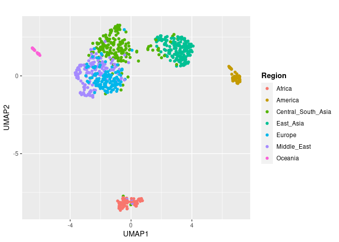

UMAP - HGDP - SNPs - SCGs
================

## Prepare the environment

``` r
library(tidyverse)
```

    ## ── Attaching core tidyverse packages ──────────────────────── tidyverse 2.0.0 ──
    ## ✔ dplyr     1.1.0     ✔ readr     2.1.4
    ## ✔ forcats   1.0.0     ✔ stringr   1.5.0
    ## ✔ ggplot2   3.4.1     ✔ tibble    3.1.8
    ## ✔ lubridate 1.9.2     ✔ tidyr     1.3.0
    ## ✔ purrr     1.0.1     
    ## ── Conflicts ────────────────────────────────────────── tidyverse_conflicts() ──
    ## ✖ dplyr::filter() masks stats::filter()
    ## ✖ dplyr::lag()    masks stats::lag()
    ## ℹ Use the ]8;;http://conflicted.r-lib.org/conflicted package]8;; to force all conflicts to become errors

``` r
library(ggpubr)
library(umap)
```

## Select samples with no GC-bias

``` r
HGDP <- read_delim("/home/riccardo/Desktop/human-te/HGDP_cutoff_classified.tsv")
```

    ## Rows: 1394352 Columns: 12
    ## ── Column specification ────────────────────────────────────────────────────────
    ## Delimiter: "\t"
    ## chr (9): ID, pop, sex, country, type, familyname, batch, superfamily, shared...
    ## dbl (3): length, reads, copynumber
    ## 
    ## ℹ Use `spec()` to retrieve the full column specification for this data.
    ## ℹ Specify the column types or set `show_col_types = FALSE` to quiet this message.

``` r
(HGDP_metadata <- HGDP %>% select(ID, sex, pop, country) %>% distinct())
```

    ## # A tibble: 828 × 4
    ##    ID        sex   pop    country           
    ##    <chr>     <chr> <chr>  <chr>             
    ##  1 HGDP00001 male  Brahui Central_South_Asia
    ##  2 HGDP00003 male  Brahui Central_South_Asia
    ##  3 HGDP00005 male  Brahui Central_South_Asia
    ##  4 HGDP00007 male  Brahui Central_South_Asia
    ##  5 HGDP00009 male  Brahui Central_South_Asia
    ##  6 HGDP00011 male  Brahui Central_South_Asia
    ##  7 HGDP00013 male  Brahui Central_South_Asia
    ##  8 HGDP00015 male  Brahui Central_South_Asia
    ##  9 HGDP00017 male  Brahui Central_South_Asia
    ## 10 HGDP00021 male  Brahui Central_South_Asia
    ## # … with 818 more rows

``` r
big <- read_tsv("/home/riccardo/Desktop/human-te/merged.vcf_variants")
```

    ## Rows: 12062 Columns: 931
    ## ── Column specification ────────────────────────────────────────────────────────
    ## Delimiter: "\t"
    ## chr   (1): familyname
    ## dbl (930): position, HGDP00780.vcf, HGDP00313.vcf, HGDP01161.vcf, HGDP00054....
    ## 
    ## ℹ Use `spec()` to retrieve the full column specification for this data.
    ## ℹ Specify the column types or set `show_col_types = FALSE` to quiet this message.

``` r
big# %>% select(position, HGDP00942.vcf, HGDP00151.vcf)
```

    ## # A tibble: 12,062 × 931
    ##    familyname position HGDP007…¹ HGDP0…² HGDP0…³ HGDP0…⁴ HGDP0…⁵ HGDP0…⁶ HGDP0…⁷
    ##    <chr>         <dbl>     <dbl>   <dbl>   <dbl>   <dbl>   <dbl>   <dbl>   <dbl>
    ##  1 chr1        1130902       0.5     0.5     1       0.5     0.5     1       0.5
    ##  2 chr1        2035575       1       1       1       0.5     1       0.5     0.5
    ##  3 chr1        2036515       1       1       1       0.5     1       0.5     0.5
    ##  4 chr1        4303912       0.5     1       1       0.5     0.5     1       0.5
    ##  5 chr1        4304010       0.5     1       1       0.5     0.5     1       0.5
    ##  6 chr1        4304166       0.5     1       1       0.5     0.5     1       0.5
    ##  7 chr1        4308759       0.5     1       0.5     0.5     0.5     1       1  
    ##  8 chr1        4951322       1       0.5     1       1       1       0.5     0.5
    ##  9 chr1        4951978       1       0.5     1       1       1       0.5     0.5
    ## 10 chr1        5219562       0.5     1       0.5     0.5     0.5     0.5     1  
    ## # … with 12,052 more rows, 922 more variables: HGDP01299.vcf <dbl>,
    ## #   HGDP01304.vcf <dbl>, HGDP00938.vcf <dbl>, HGDP00868.vcf <dbl>,
    ## #   HGDP00970.vcf <dbl>, HGDP00563.vcf <dbl>, HGDP00612.vcf <dbl>,
    ## #   HGDP00613.vcf <dbl>, HGDP00947.vcf <dbl>, HGDP00208.vcf <dbl>,
    ## #   HGDP00926.vcf <dbl>, HGDP00588.vcf <dbl>, HGDP01323.vcf <dbl>,
    ## #   HGDP00950.vcf <dbl>, HGDP00784.vcf <dbl>, HGDP00576.vcf <dbl>,
    ## #   HGDP00471.vcf <dbl>, HGDP00106.vcf <dbl>, HGDP00627.vcf <dbl>, …

``` r
#(sample <- big %>% sample_n(50000))
```

``` r
revertable <- big %>% mutate(SNP = paste0(familyname, "_", position)) %>% select(-familyname, -position) %>% relocate(SNP, before = NULL)

columns <- revertable %>% select(-SNP)
samples <- colnames(columns)
```

``` r
reverted_raw <- revertable %>%
  t() %>%
  as_tibble()
```

    ## Warning: The `x` argument of `as_tibble.matrix()` must have unique column names if
    ## `.name_repair` is omitted as of tibble 2.0.0.
    ## ℹ Using compatibility `.name_repair`.

``` r
colnames(reverted_raw) <- reverted_raw[1, ]
reverted <- slice(reverted_raw, -1)

samp <- samples %>% as_tibble %>% rename("ID" = "value")
pca_matrix <- samp %>% cbind(reverted) %>% as_tibble()
pca_matrix$ID <- str_remove(pca_matrix$ID, "\\.vcf$")
(pca_data <- HGDP_metadata %>% inner_join(pca_matrix, by="ID") %>% distinct())
```

    ## # A tibble: 802 × 12,066
    ##    ID        sex   pop   country chr1_…¹ chr1_…² chr1_…³ chr1_…⁴ chr1_…⁵ chr1_…⁶
    ##    <chr>     <chr> <chr> <chr>   <chr>   <chr>   <chr>   <chr>   <chr>   <chr>  
    ##  1 HGDP00001 male  Brah… Centra… 1.0     1.0     1.0     1.0     1.0     1.0    
    ##  2 HGDP00003 male  Brah… Centra… 1.0     1.0     1.0     0.5     0.5     0.5    
    ##  3 HGDP00005 male  Brah… Centra… 0.5     1.0     1.0     0.5     0.5     0.5    
    ##  4 HGDP00007 male  Brah… Centra… 1.0     0.5     0.5     0.5     0.5     0.5    
    ##  5 HGDP00009 male  Brah… Centra… 0.5     1.0     1.0     1.0     1.0     1.0    
    ##  6 HGDP00011 male  Brah… Centra… 0.5     0.5     0.5     0.5     0.5     0.5    
    ##  7 HGDP00013 male  Brah… Centra… 1.0     0.5     0.5     0.5     0.5     0.5    
    ##  8 HGDP00015 male  Brah… Centra… 1.0     1.0     1.0     0.5     0.5     0.5    
    ##  9 HGDP00017 male  Brah… Centra… 0.5     1.0     1.0     1.0     1.0     1.0    
    ## 10 HGDP00021 male  Brah… Centra… 1.0     0.5     0.5     1.0     1.0     1.0    
    ## # … with 792 more rows, 12,056 more variables: chr1_4308759 <chr>,
    ## #   chr1_4951322 <chr>, chr1_4951978 <chr>, chr1_5219562 <chr>,
    ## #   chr1_5228316 <chr>, chr1_5499189 <chr>, chr1_5583698 <chr>,
    ## #   chr1_5694059 <chr>, chr1_5695433 <chr>, chr1_5695591 <chr>,
    ## #   chr1_5696896 <chr>, chr1_5822519 <chr>, chr1_6252371 <chr>,
    ## #   chr1_6259995 <chr>, chr1_6724404 <chr>, chr1_7476683 <chr>,
    ## #   chr1_8953037 <chr>, chr1_9146333 <chr>, chr1_9295413 <chr>, …

``` r
all <- HGDP_metadata
pcaable <- pca_data %>% select(ID)

#(missing <- all %>% filter(!(ID %in% pcaable$ID)))
```

``` r
write_tsv(pca_data, "/home/riccardo/Desktop/human-te/PCAble")
```

## Read the SNPs matrix

``` r
data <- "/home/riccardo/Desktop/human-te/PCAble"
```

## Create the function for UMAP plotting

``` r
UMAP <- function(freq_matrix, titlee){

file <- read_tsv(freq_matrix)
matrix <- as.matrix(file[, -c(1,2,3,4)])

umap_result <- umap(matrix, n_neighbors = 15, min_dist = 0.1)

umap <- umap_result$layout %>% as.data.frame() %>% rename(UMAP1="V1",UMAP2="V2")

plot <- umap %>% ggplot(aes(x = UMAP1, y = UMAP2, color = file$country))+
  geom_point()+ labs(x = "UMAP1", y = "UMAP2", title = titlee, color = "Region") + theme(plot.title = element_text(hjust = 0.5, face = "bold"), legend.title = element_text(face = "bold"))
}
```

``` r
(results <- UMAP(data, ""))
```

    ## Rows: 802 Columns: 12066
    ## ── Column specification ────────────────────────────────────────────────────────
    ## Delimiter: "\t"
    ## chr     (4): ID, sex, pop, country
    ## dbl (12062): chr1_1130902, chr1_2035575, chr1_2036515, chr1_4303912, chr1_43...
    ## 
    ## ℹ Use `spec()` to retrieve the full column specification for this data.
    ## ℹ Specify the column types or set `show_col_types = FALSE` to quiet this message.

<!-- -->
