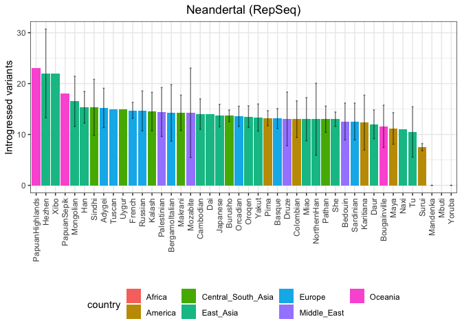
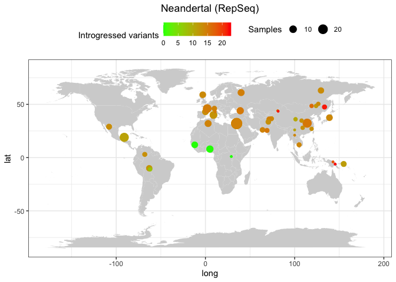
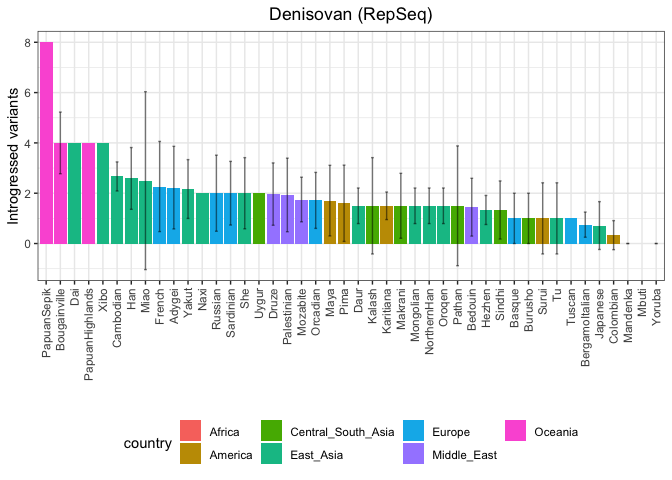
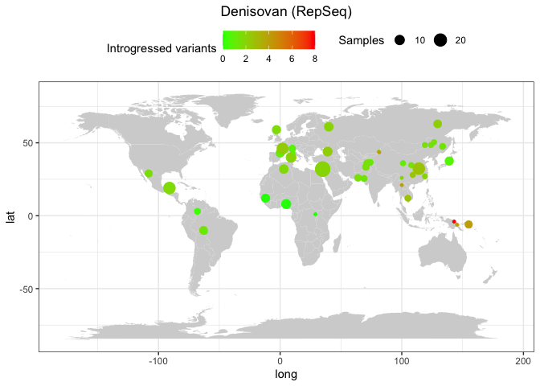
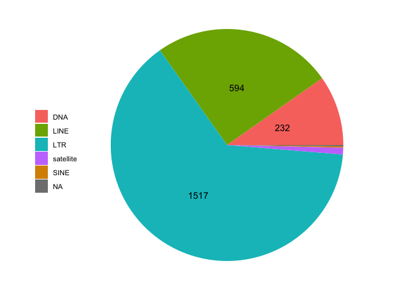
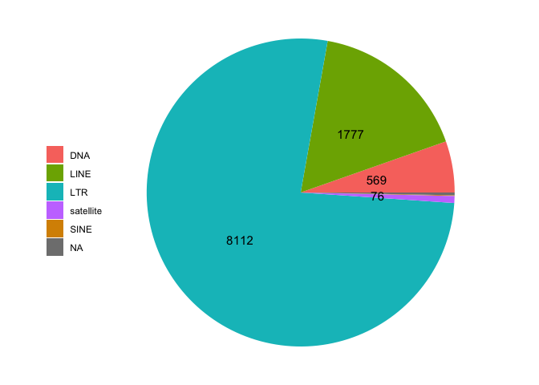

Archaic humans - SNPs found in NH and DH
================

Set the environment and creating metadata file.

``` r
library(tidyverse)
```

    ## ── Attaching core tidyverse packages ──────────────────────── tidyverse 2.0.0 ──
    ## ✔ dplyr     1.1.1     ✔ readr     2.1.4
    ## ✔ forcats   1.0.0     ✔ stringr   1.5.0
    ## ✔ ggplot2   3.4.2     ✔ tibble    3.2.1
    ## ✔ lubridate 1.9.2     ✔ tidyr     1.3.0
    ## ✔ purrr     1.0.1     
    ## ── Conflicts ────────────────────────────────────────── tidyverse_conflicts() ──
    ## ✖ dplyr::filter() masks stats::filter()
    ## ✖ dplyr::lag()    masks stats::lag()
    ## ℹ Use the conflicted package (<http://conflicted.r-lib.org/>) to force all conflicts to become errors

``` r
library(umap)

theme_set(theme_bw())

HGDP <- read_delim("/Volumes/Temp1/rpianezza/0.old/summary-HGDP/HGDP_cutoff_classified.tsv") %>% select(ID, sex, country, pop) %>% distinct()
```

    ## Rows: 1394352 Columns: 12
    ## ── Column specification ────────────────────────────────────────────────────────
    ## Delimiter: "\t"
    ## chr (9): ID, pop, sex, country, type, familyname, batch, superfamily, shared...
    ## dbl (3): length, reads, copynumber
    ## 
    ## ℹ Use `spec()` to retrieve the full column specification for this data.
    ## ℹ Specify the column types or set `show_col_types = FALSE` to quiet this message.

``` r
HGDP_afr_fem <- HGDP %>% filter(sex=="female", country=="Africa") %>% select(ID) %>% distinct()
HGDP_fem <- HGDP %>% filter(sex=="female") %>% select(ID, pop, country) %>% distinct()

coordinates <- read_tsv("/Users/rpianezza/TE/summary-HGDP/HGDP_populationcoordinates.txt", col_names = c("pop", "region", "latitude", "longitude")) %>% select(pop, latitude, longitude)
```

    ## Rows: 54 Columns: 4
    ## ── Column specification ────────────────────────────────────────────────────────
    ## Delimiter: "\t"
    ## chr (2): pop, region
    ## dbl (2): latitude, longitude
    ## 
    ## ℹ Use `spec()` to retrieve the full column specification for this data.
    ## ℹ Specify the column types or set `show_col_types = FALSE` to quiet this message.

``` r
#write_tsv(HGDP_afr_fem, file="/Volumes/Temp1/rpianezza/archaic-introgression/ID-afr-females.txt")
```

``` r
HGDP_full <- read_delim("/Volumes/Temp1/rpianezza/0.old/summary-HGDP/HGDP_cutoff_classified.tsv")
```

    ## Rows: 1394352 Columns: 12
    ## ── Column specification ────────────────────────────────────────────────────────
    ## Delimiter: "\t"
    ## chr (9): ID, pop, sex, country, type, familyname, batch, superfamily, shared...
    ## dbl (3): length, reads, copynumber
    ## 
    ## ℹ Use `spec()` to retrieve the full column specification for this data.
    ## ℹ Specify the column types or set `show_col_types = FALSE` to quiet this message.

``` r
a_HGDP <- read_tsv("/Volumes/Temp1/rpianezza/PCA-copynumber-all-analysis/a_HGDP.tsv")
```

    ## Rows: 828 Columns: 2
    ## ── Column specification ────────────────────────────────────────────────────────
    ## Delimiter: "\t"
    ## chr (1): ID
    ## dbl (1): a
    ## 
    ## ℹ Use `spec()` to retrieve the full column specification for this data.
    ## ℹ Specify the column types or set `show_col_types = FALSE` to quiet this message.

``` r
HGDP_nobiased_samples <- filter(a_HGDP, (a > (-0.5)) & (a<0.5)) %>% select(ID) %>% pull()
HGDP_clean <- filter(HGDP_full, ID %in% HGDP_nobiased_samples, sex=="female") %>% group_by(familyname) %>% summarise(mean_cn = mean(copynumber)) %>% mutate(familyname = paste0(familyname, "_te"))

#write_tsv(HGDP_clean, file = "/Volumes/Temp1/rpianezza/archaic-introgression/female-copynumber.tsv")
```

## TEs

Base order: A T C G

``` r
vindija <- "/Volumes/Temp1/rpianezza/archaic-introgression/output/vindija.tsv"
altai <- "/Volumes/Temp1/rpianezza/archaic-introgression/output/test/altai.tsv"
denisova <- "/Volumes/Temp1/rpianezza/archaic-introgression/output/test/denisovan.tsv"
```

``` r
plot_introgression <- function(data, titlee){
  
 plot <- data %>% group_by(pop, country) %>% dplyr::summarise(mean_intro = mean(introgressed), sd_intro = sd(introgressed)) %>% ggplot(aes(x = reorder(pop, -mean_intro), y=mean_intro, fill=country))+
  geom_col()+
  geom_errorbar(aes(ymin = mean_intro - sd_intro, ymax = mean_intro + sd_intro), 
                width = 0.2, position = position_dodge(0.9), alpha = 0.5)+
  labs(x = "", y = "Introgressed variants", title = element_text(face = "bold", size = 14, titlee)) + theme(axis.text.x = element_text(angle = 90, vjust = 0.5, hjust=1), legend.position = "bottom", plot.title = element_text(hjust = 0.5))
}


plot_map <- function(intro, coord, title){
  
full <- inner_join(intro, coord, by="pop") %>% group_by(pop, longitude, latitude) %>% dplyr::summarise(introgressed = mean(introgressed), count = n())
world_map = map_data("world")

ggplot() +
  geom_map(
    data = world_map, map = world_map,
    aes(long, lat, map_id = region),
    color = "white", fill = "lightgray", size = 0) +
  geom_point(data = full, aes(x=longitude, y=latitude, color = introgressed, size = count)) + geom_errorbar() + scale_colour_gradient(low = "green", high = "red") + theme(legend.position="top") + theme(plot.title = element_text(hjust = 0.5)) + ggtitle(title) + labs(colour = "Introgressed variants", size = "Samples")
}
```

``` r
d <- read_tsv(denisova) %>% inner_join(HGDP_clean, by="familyname") %>% mutate(SNP = paste0(familyname, "_", position)) %>% select(-familyname, -position) %>% relocate(mean_cn) %>% relocate(SNP)
```

    ## Rows: 896 Columns: 278
    ## ── Column specification ────────────────────────────────────────────────────────
    ## Delimiter: "\t"
    ## chr   (2): familyname, diagnostic
    ## dbl (276): position, HGDP00151-Makrani, HGDP00153-Makrani, HGDP00154-Makrani...
    ## 
    ## ℹ Use `spec()` to retrieve the full column specification for this data.
    ## ℹ Specify the column types or set `show_col_types = FALSE` to quiet this message.

``` r
v <- read_tsv(vindija) %>% inner_join(HGDP_clean, by="familyname") %>% mutate(SNP = paste0(familyname, "_", position)) %>% select(-familyname, -position) %>% relocate(mean_cn) %>% relocate(SNP)
```

    ## Rows: 3253 Columns: 278
    ## ── Column specification ────────────────────────────────────────────────────────
    ## Delimiter: "\t"
    ## chr   (2): familyname, diagnostic
    ## dbl (276): position, HGDP00151-Makrani, HGDP00153-Makrani, HGDP00154-Makrani...
    ## 
    ## ℹ Use `spec()` to retrieve the full column specification for this data.
    ## ℹ Specify the column types or set `show_col_types = FALSE` to quiet this message.

``` r
a <- read_tsv(altai) %>% inner_join(HGDP_clean, by="familyname") %>% mutate(SNP = paste0(familyname, "_", position)) %>% select(-familyname, -position) %>% relocate(mean_cn) %>% relocate(SNP)
```

    ## Rows: 956 Columns: 278
    ## ── Column specification ────────────────────────────────────────────────────────
    ## Delimiter: "\t"
    ## chr   (2): familyname, diagnostic
    ## dbl (276): position, HGDP00151-Makrani, HGDP00153-Makrani, HGDP00154-Makrani...
    ## 
    ## ℹ Use `spec()` to retrieve the full column specification for this data.
    ## ℹ Specify the column types or set `show_col_types = FALSE` to quiet this message.

``` r
specific_v <- v %>% filter(!(SNP %in% a$SNP))
two_n <- bind_rows(a, specific_v)

(specific_d <- d %>% filter(!(SNP %in% two_n$SNP)))
```

    ## # A tibble: 601 × 278
    ##    SNP            mean_cn diagnostic `HGDP00151-Makrani` `HGDP00153-Makrani`
    ##    <chr>            <dbl> <chr>                    <dbl>               <dbl>
    ##  1 HERVK3I_te_149    20.9 G                         0                      0
    ##  2 HERV9_te_5870    134.  A                         0                      0
    ##  3 HERV9_te_6860    134.  A                         0                      0
    ##  4 HERV9_te_6989    134.  C                         0                      0
    ##  5 LTR27C_te_619     16.5 A                         0.03                   0
    ##  6 LOR1I_te_41       37.7 A                         0                      0
    ##  7 LOR1I_te_6801     37.7 A                         0                      0
    ##  8 LOR1I_te_7542     37.7 G                         0                      0
    ##  9 LOR1I_te_8079     37.7 C                         0                      0
    ## 10 L1MA2_te_11      452.  T                         0                      0
    ## # ℹ 591 more rows
    ## # ℹ 273 more variables: `HGDP00154-Makrani` <dbl>, `HGDP00155-Makrani` <dbl>,
    ## #   `HGDP00192-Sindhi` <dbl>, `HGDP00206-Sindhi` <dbl>,
    ## #   `HGDP00210-Sindhi` <dbl>, `HGDP00237-Pathan` <dbl>,
    ## #   `HGDP00239-Pathan` <dbl>, `HGDP00244-Pathan` <dbl>,
    ## #   `HGDP00247-Pathan` <dbl>, `HGDP00274-Kalash` <dbl>,
    ## #   `HGDP00298-Kalash` <dbl>, `HGDP00304-Kalash` <dbl>, …

``` r
(specific_n <- two_n %>% filter(!(SNP %in% d$SNP)))
```

    ## # A tibble: 3,600 × 278
    ##    SNP              mean_cn diagnostic `HGDP00151-Makrani` `HGDP00153-Makrani`
    ##    <chr>              <dbl> <chr>                    <dbl>               <dbl>
    ##  1 LTR65_te_79         7.02 C                            0                   0
    ##  2 HERVK3I_te_5706    20.9  G                            0                   0
    ##  3 HERVK3I_te_6199    20.9  G                            0                   0
    ##  4 HERVK3I_te_6716    20.9  A                            0                   0
    ##  5 HERV9_te_6744     134.   G                            0                   0
    ##  6 L1PA12_5_te_910    86.6  T                            0                   0
    ##  7 L1PA12_5_te_1036   86.6  C                            0                   0
    ##  8 L1PA12_5_te_1037   86.6  A                            0                   0
    ##  9 L1PA12_5_te_1039   86.6  G                            0                   0
    ## 10 L1PA12_5_te_1138   86.6  T                            0                   0
    ## # ℹ 3,590 more rows
    ## # ℹ 273 more variables: `HGDP00154-Makrani` <dbl>, `HGDP00155-Makrani` <dbl>,
    ## #   `HGDP00192-Sindhi` <dbl>, `HGDP00206-Sindhi` <dbl>,
    ## #   `HGDP00210-Sindhi` <dbl>, `HGDP00237-Pathan` <dbl>,
    ## #   `HGDP00239-Pathan` <dbl>, `HGDP00244-Pathan` <dbl>,
    ## #   `HGDP00247-Pathan` <dbl>, `HGDP00274-Kalash` <dbl>,
    ## #   `HGDP00298-Kalash` <dbl>, `HGDP00304-Kalash` <dbl>, …

``` r
n_variants <- specific_n %>% mutate_at(vars(starts_with("HGDP")), ~. * mean_cn) %>% filter(mean_cn<10000) %>% select(-c(diagnostic, mean_cn, SNP)) %>% dplyr::summarise_all(~sum(. >1, na.rm=TRUE)) %>% t %>% as.data.frame() %>% rownames_to_column(var = "ID") %>% as_tibble() %>% dplyr::rename("introgressed" = "V1") %>% separate(ID, into=c("ID", "pop"), sep="-", remove=FALSE) %>% select(-pop) %>% inner_join(HGDP_fem, by="ID")

(bar <- plot_introgression(n_variants, "Neandertal (RepSeq)"))
```

    ## `summarise()` has grouped output by 'pop'. You can override using the `.groups`
    ## argument.

<!-- -->

``` r
(mappa <- plot_map(n_variants, coordinates, "Neandertal (RepSeq)"))
```

    ## `summarise()` has grouped output by 'pop', 'longitude'. You can override using
    ## the `.groups` argument.

    ## Warning: Using `size` aesthetic for lines was deprecated in ggplot2 3.4.0.
    ## ℹ Please use `linewidth` instead.
    ## This warning is displayed once every 8 hours.
    ## Call `lifecycle::last_lifecycle_warnings()` to see where this warning was
    ## generated.

    ## Warning in geom_map(data = world_map, map = world_map, aes(long, lat, map_id =
    ## region), : Ignoring unknown aesthetics: x and y

<!-- -->

``` r
(d_variants <- specific_d %>% mutate_at(vars(starts_with("HGDP")), ~. * mean_cn) %>% filter(mean_cn<100) %>% select(-c(diagnostic, mean_cn, SNP)) %>% dplyr::summarise_all(~sum(. >1, na.rm=TRUE)) %>% t %>% as.data.frame() %>% rownames_to_column(var = "ID") %>% as_tibble() %>% dplyr::rename("introgressed" = "V1") %>% separate(ID, into=c("ID", "pop"), sep="-", remove=FALSE) %>% select(-pop) %>% inner_join(HGDP_fem, by="ID"))
```

    ## # A tibble: 275 × 4
    ##    ID        introgressed pop     country           
    ##    <chr>            <int> <chr>   <chr>             
    ##  1 HGDP00151            0 Makrani Central_South_Asia
    ##  2 HGDP00153            2 Makrani Central_South_Asia
    ##  3 HGDP00154            3 Makrani Central_South_Asia
    ##  4 HGDP00155            1 Makrani Central_South_Asia
    ##  5 HGDP00192            2 Sindhi  Central_South_Asia
    ##  6 HGDP00206            0 Sindhi  Central_South_Asia
    ##  7 HGDP00210            2 Sindhi  Central_South_Asia
    ##  8 HGDP00237            0 Pathan  Central_South_Asia
    ##  9 HGDP00239            5 Pathan  Central_South_Asia
    ## 10 HGDP00244            1 Pathan  Central_South_Asia
    ## # ℹ 265 more rows

``` r
(bar <- plot_introgression(d_variants, "Denisovan (RepSeq)"))
```

    ## `summarise()` has grouped output by 'pop'. You can override using the `.groups`
    ## argument.

<!-- -->

``` r
(mappa <- plot_map(d_variants, coordinates, "Denisovan (RepSeq)"))
```

    ## `summarise()` has grouped output by 'pop', 'longitude'. You can override using
    ## the `.groups` argument.

    ## Warning in geom_map(data = world_map, map = world_map, aes(long, lat, map_id =
    ## region), : Ignoring unknown aesthetics: x and y

<!-- -->

``` r
DNA_names <- c("Crypton", "hAT", "Helitron", "Kolobok", "Mariner/Tc1", "Merlin", "MuDR", "piggyBac", "DNA transposon")
LINE_names <- c("L1", "CR1", "L2", "Crack", "RTE", "RTEX", "R4", "Vingi", "Tx1", "Penelope")
SINE_names <- c("SINE1/7SL", "SINE2/tRNA", "SINE3/5S", "SINE")
LTR_names <- c("ERV1", "ERV2", "ERV3", "Gypsy", "Endogenous Retrovirus", "LTR Retrotransposon", "Long terminal repeat", "Non-LTR Retrotransposon")
satellites_names <- c("Satellite", "satellite", "SAT")

classification <- HGDP_full %>% filter(type=="te") %>% mutate(class = case_when(superfamily %in% DNA_names ~ "DNA", superfamily %in% LINE_names ~ "LINE", superfamily %in% SINE_names ~ "SINE", superfamily %in% LTR_names ~ "LTR", superfamily %in% satellites_names ~ "satellite"))

class <- classification %>% select(familyname, class, length) %>% distinct() %>% group_by(class) %>% summarise(families = n())
  
(bases <- classification %>% filter(sex=="female") %>% group_by(familyname, class, length) %>% summarise(copynumber = mean(copynumber)) %>% group_by(class) %>% summarise(bases = sum(length)) %>% inner_join(class,  by="class"))
```

    ## `summarise()` has grouped output by 'familyname', 'class'. You can override
    ## using the `.groups` argument.

    ## # A tibble: 6 × 3
    ##   class      bases families
    ##   <chr>      <dbl>    <int>
    ## 1 DNA       179926      219
    ## 2 LINE      233752      137
    ## 3 LTR       831221      511
    ## 4 SINE        4620       12
    ## 5 satellite  17469       22
    ## 6 <NA>       21644       64

``` r
pies <- function(data, class_bases){
  
count <- data %>% mutate_at(vars(starts_with("HGDP")), ~. * mean_cn) %>% filter(mean_cn<10000) %>% select(-mean_cn) %>% mutate(variants = rowSums(. > 1)) %>% select(SNP, variants) %>% separate(SNP, into=c("familyname","position"), sep="_te_")
  
(c <- classification %>% select(familyname, class, length) %>% distinct() %>% inner_join(count, by="familyname"))
  
introgressed_class <- c %>%
  group_by(class) %>%
  summarise(variants = sum(variants, na.rm = TRUE))

pie_tib <- introgressed_class %>% inner_join(class_bases, by="class") %>% mutate(var_per_base = variants/bases)


pie <- ggplot(pie_tib, aes(x="", y=variants, fill=class))+
  geom_col(width = 1) + labs(fill='') +
  coord_polar(theta="y", start = pi/2)+
  theme_void()+
  geom_text(aes(label = ifelse(variants>50, variants, "")), 
            position = position_stack(vjust = 0.5), 
            size = 4)+
  theme(legend.position = "left")+
 scale_fill_manual(values=c("#F8766D", "#7CAE00", "#00BFC4", "#C77CFF", "#D89000"))

pie_norm <- ggplot(pie_tib, aes(x="", y=var_per_base, fill=class))+
  geom_col(width = 1) + labs(fill='') +
  coord_polar(theta="y", start = pi/2)+
  theme_void()+
  geom_text(aes(label = class), 
            position = position_stack(vjust = 0.5), 
            size = 4)+
  theme(legend.position = "none")+
 scale_fill_manual(values=c("#F8766D", "#7CAE00", "#00BFC4", "#C77CFF", "#D89000"))

list(raw = pie, introgressed_per_position = pie_norm)
}
```

``` r
d_class <- pies(specific_d, bases)
d_class$raw
```

<!-- -->

``` r
d_introgressed_per_site <- d_class$introgressed_per_position

n_class <- pies(specific_n, bases)
n_class$raw
```

<!-- -->

``` r
n_introgressed_per_site <- n_class$introgressed_per_position
```

``` r
ggsave(n_introgressed_per_site, file="/Volumes/Temp1/rpianezza/paper/figures-v2.0/ai/NH-introgressed-per-site.png", dpi=1000)
```

    ## Saving 7 x 5 in image

    ## Warning: Removed 1 rows containing missing values (`geom_text()`).

``` r
ggsave(d_introgressed_per_site, file="/Volumes/Temp1/rpianezza/paper/figures-v2.0/ai/DH-introgressed-per-site.png", dpi=1000)
```

    ## Saving 7 x 5 in image

    ## Warning: Removed 1 rows containing missing values (`geom_text()`).
