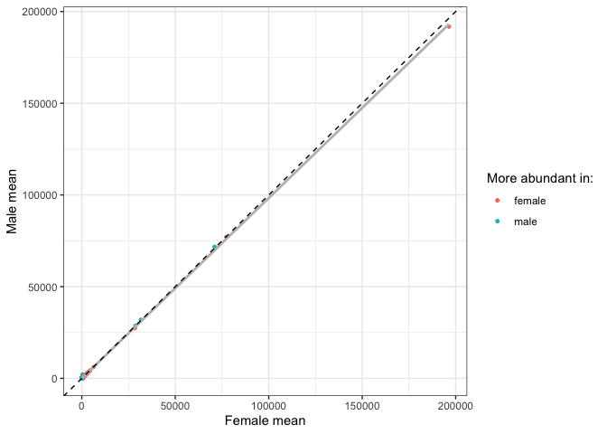
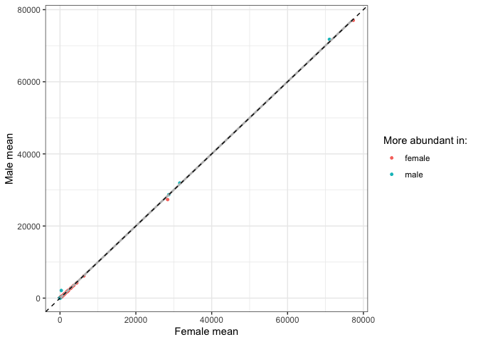
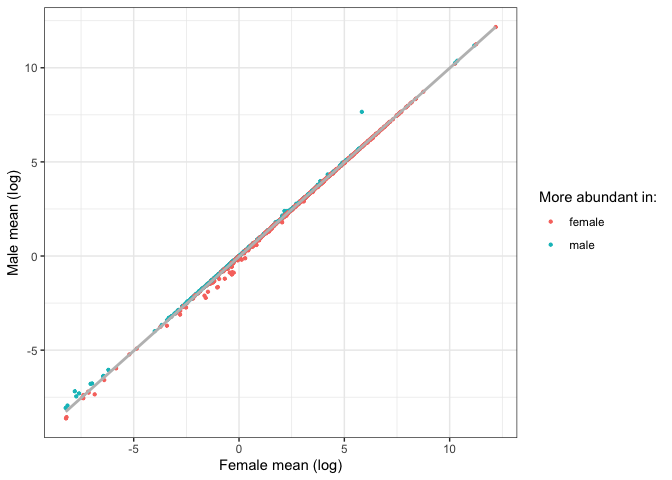
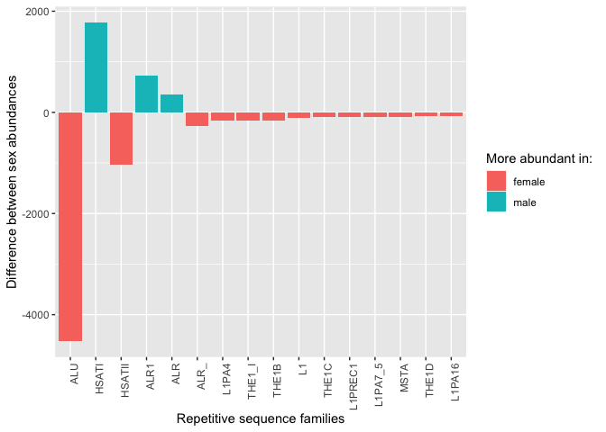
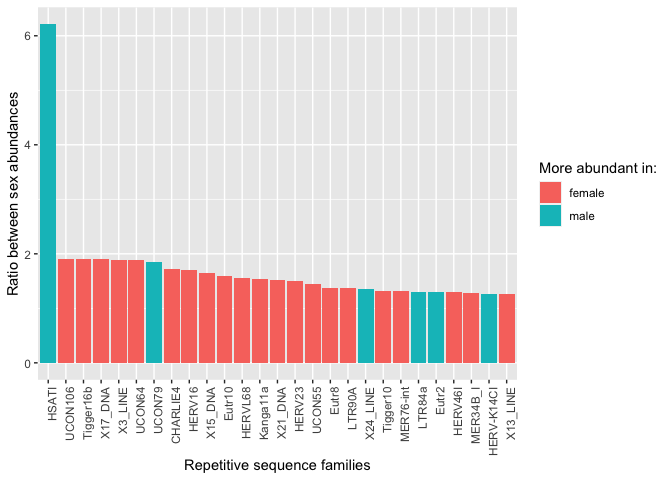
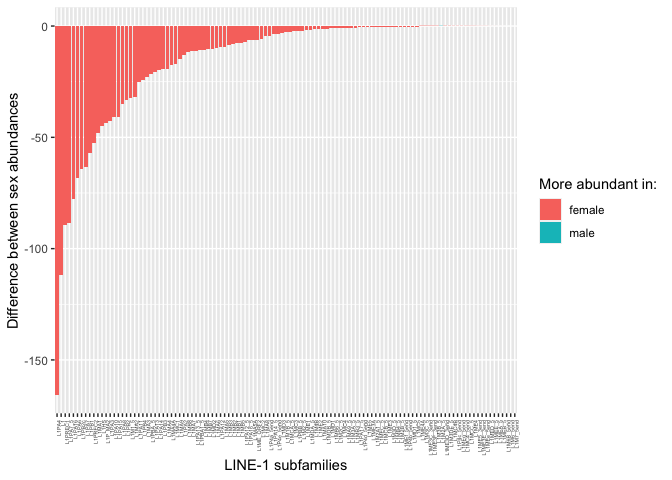
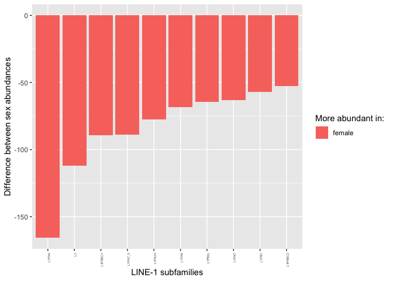
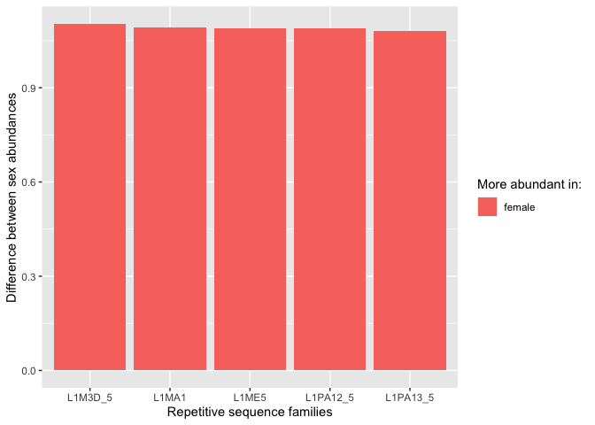

Comparing the mean TE copy numbers in males and females
================

In this script I re-wrote Florian’s script 5 and added some new
analysis. The topic is the comparison of TE abundances between the two
sexes.

``` r
library(tidyverse)
```

    ## ── Attaching packages ─────────────────────────────────────── tidyverse 1.3.2 ──
    ## ✔ ggplot2 3.4.0      ✔ purrr   0.3.4 
    ## ✔ tibble  3.1.8      ✔ dplyr   1.0.10
    ## ✔ tidyr   1.2.1      ✔ stringr 1.4.1 
    ## ✔ readr   2.1.2      ✔ forcats 0.5.2 
    ## ── Conflicts ────────────────────────────────────────── tidyverse_conflicts() ──
    ## ✖ dplyr::filter() masks stats::filter()
    ## ✖ dplyr::lag()    masks stats::lag()

``` r
library(ggpubr)

no_pcr_samples <- read_tsv("/Volumes/Temp1/rpianezza/investigation/HGDP-no-PCR/HGDP-only-pcr-free-samples.tsv", col_names = ("ID"))
```

    ## Rows: 676 Columns: 1
    ## ── Column specification ────────────────────────────────────────────────────────
    ## Delimiter: "\t"
    ## chr (1): ID
    ## 
    ## ℹ Use `spec()` to retrieve the full column specification for this data.
    ## ℹ Specify the column types or set `show_col_types = FALSE` to quiet this message.

``` r
HGDP <- read_csv("/Volumes/Temp1/rpianezza/TE/summary-HGDP/USEME_HGDP_complete_reflib6.2_mq10_batchinfo_cutoff0.01.txt", col_names = c("ID","pop","sex","country","type","familyname","length","reads","copynumber","batch"), skip=1) %>% type_convert() %>% filter(ID %in% no_pcr_samples$ID)
```

    ## Rows: 1394352 Columns: 10
    ## ── Column specification ────────────────────────────────────────────────────────
    ## Delimiter: ","
    ## chr (7): ID, pop, sex, country, type, familyname, batch
    ## dbl (3): length, reads, copynumber
    ## 
    ## ℹ Use `spec()` to retrieve the full column specification for this data.
    ## ℹ Specify the column types or set `show_col_types = FALSE` to quiet this message.
    ## 
    ## ── Column specification ────────────────────────────────────────────────────────
    ## cols(
    ##   ID = col_character(),
    ##   pop = col_character(),
    ##   sex = col_character(),
    ##   country = col_character(),
    ##   type = col_character(),
    ##   familyname = col_character(),
    ##   batch = col_character()
    ## )

## Calculating mean abundance for males and females

``` r
data <- filter(HGDP, type=="te") %>% group_by(familyname, sex) %>% dplyr::summarise(sd=sd(copynumber), mean=mean(copynumber))
```

    ## `summarise()` has grouped output by 'familyname'. You can override using the
    ## `.groups` argument.

``` r
f<-filter(data, sex=="female") %>% dplyr::rename(f_mean = mean, f_sd = sd)
m<-filter(data, sex=="male") %>% dplyr::rename(m_mean = mean, m_sd = sd)

(final_data <- inner_join(f, m, by = "familyname") %>% select(familyname, f_mean, m_mean, f_sd, m_sd) %>% mutate(f_mean_log=log(f_mean), m_mean_log=log(m_mean), diff=m_mean-f_mean, abs_diff=abs(diff), ratio=case_when(diff>=0 ~ m_mean/f_mean, diff<0 ~ f_mean/m_mean), more_in=case_when(diff>=0 ~ "male", diff<0 ~ "female")) %>% arrange(desc(ratio)) %>% mutate(familyname=fct_reorder(familyname,ratio)))
```

    ## # A tibble: 965 × 11
    ## # Groups:   familyname [965]
    ##    familyname    f_mean  m_mean    f_sd    m_sd f_mea…¹ m_mea…²     diff abs_d…³
    ##    <fct>          <dbl>   <dbl>   <dbl>   <dbl>   <dbl>   <dbl>    <dbl>   <dbl>
    ##  1 HSATI        3.41e+2 2.12e+3 1.85e+2 5.16e+2   5.83    7.66   1.78e+3 1.78e+3
    ##  2 UCON106      3.67e-1 1.92e-1 8.26e-2 6.20e-2  -1.00   -1.65  -1.75e-1 1.75e-1
    ##  3 Tigger16b    2.06e-1 1.08e-1 4.72e-2 3.18e-2  -1.58   -2.22  -9.79e-2 9.79e-2
    ##  4 X17_DNA      7.12e-1 3.74e-1 1.15e-1 7.79e-2  -0.339  -0.983 -3.38e-1 3.38e-1
    ##  5 X3_LINE      3.56e-1 1.88e-1 7.55e-2 5.00e-2  -1.03   -1.67  -1.67e-1 1.67e-1
    ##  6 UCON64       7.77e-1 4.13e-1 1.28e-1 9.62e-2  -0.252  -0.884 -3.64e-1 3.64e-1
    ##  7 UCON79       4.11e-4 7.58e-4 2.38e-3 3.40e-3  -7.80   -7.19   3.47e-4 3.47e-4
    ##  8 CHARLIE4     7.25e-1 4.23e-1 7.62e-2 4.62e-2  -0.321  -0.861 -3.02e-1 3.02e-1
    ##  9 HERV16       5.09e-1 3.00e-1 4.26e-2 2.40e-2  -0.676  -1.20  -2.09e-1 2.09e-1
    ## 10 X15_DNA      1.06e-3 6.43e-4 4.01e-3 2.25e-3  -6.85   -7.35  -4.13e-4 4.13e-4
    ## # … with 955 more rows, 2 more variables: ratio <dbl>, more_in <chr>, and
    ## #   abbreviated variable names ¹​f_mean_log, ²​m_mean_log, ³​abs_diff

## Comparing mean abundance between males and females

``` r
(all <- ggplot(final_data, aes(x=f_mean, y=m_mean, color=more_in))+ labs(color = "More abundant in:") +
  geom_point(size=1)+
  geom_smooth(method="lm",color="grey", se=F)+ 
  ylab("Male mean")+ xlab("Female mean")+geom_abline(slope=1,linetype='dashed')+theme_bw())
```

    ## `geom_smooth()` using formula = 'y ~ x'

<!-- -->

``` r
noALU <- final_data_noALU <- filter(final_data, !(familyname=="ALU"))#, !(familyname=="ALR1"), !(familyname=="HSATI"))
(ggplot(final_data_noALU, aes(x=f_mean, y=m_mean, color=more_in))+ labs(color = "More abundant in:") +
  geom_point(size=1)+
  geom_smooth(method="lm",color="grey", se=F)+ ylab("Male mean")+ xlab("Female mean")+geom_abline(slope=1,linetype='dashed')+theme_bw())
```

    ## `geom_smooth()` using formula = 'y ~ x'

<!-- -->

``` r
(log <- ggplot(final_data, aes(f_mean_log, m_mean_log, color=more_in))+ labs(color = "More abundant in:") +
  geom_point(size=0.8)+
  geom_smooth(method="lm",color="grey",se=F)+theme_bw()+ ylab("Male mean (log)")+ xlab("Female mean (log)"))
```

    ## `geom_smooth()` using formula = 'y ~ x'

<!-- -->

## Relative and absolute mean differences between the sexes

### Absolute differences

``` r
abs_subset <- filter(final_data, abs_diff>75) # This number is arbitrary, feel free to look at more/less TEs in the plot

(abs <- ggplot(abs_subset, aes(reorder(familyname, -abs(diff)), diff, fill=more_in)) + labs(fill = "More abundant in:") +
  geom_bar(stat="identity") + ylab("Difference between sex abundances") + xlab("Repetitive sequence families") +
  theme(axis.text.x = element_text(angle = 90, hjust = 1)))
```

<!-- -->

### Relative differences

``` r
rel_all <- ggplot(final_data, aes(reorder(familyname, -ratio), ratio, fill=more_in)) + labs(fill = "More abundant in:")+geom_bar(stat="identity") + ylab("Ratio between sex abundances") + xlab("Repetitive sequence families") + theme(axis.text.x=element_blank())

rel_subset<- filter(final_data, ratio>1.25) # This number is arbitrary, feel free to look at more/less TEs in the plot

(rel <- ggplot(rel_subset, aes(reorder(familyname, -ratio), ratio, fill=more_in)) + labs(fill = "More abundant in:") +
  geom_bar(stat="identity") + ylab("Ratio between sex abundances") + xlab("Repetitive sequence families") +
  theme(axis.text.x = element_text(angle = 90, hjust = 1)))
```

<!-- -->

## L1 family differences between the two sexes

``` r
L1<-final_data %>% filter(str_detect(familyname, "^L1"))
(L1plot <- ggplot(L1, aes(reorder(familyname, -abs(diff)), diff, fill=more_in)) + labs(fill = "More abundant in:") +
  geom_bar(stat="identity") + ylab("Difference between sex abundances") + xlab("LINE-1 subfamilies") +
  theme(axis.text.x = element_text(angle = 90, hjust = 1, size=4)))
```

<!-- -->

``` r
L1_50<-final_data %>% filter(str_detect(familyname, "^L1"), abs_diff>50)
(L1_50plot <- ggplot(L1_50, aes(reorder(familyname, -abs(diff)), diff, fill=more_in)) + labs(fill = "More abundant in:") +
  geom_bar(stat="identity") + ylab("Difference between sex abundances") + xlab("LINE-1 subfamilies") +
  theme(axis.text.x = element_text(angle = 90, hjust = 1, size=4)))
```

<!-- -->

``` r
(L1_male <- filter(L1, more_in == "male"))
```

    ## # A tibble: 4 × 11
    ## # Groups:   familyname [4]
    ##   family…¹  f_mean  m_mean    f_sd    m_sd f_mea…² m_mea…³    diff abs_d…⁴ ratio
    ##   <fct>      <dbl>   <dbl>   <dbl>   <dbl>   <dbl>   <dbl>   <dbl>   <dbl> <dbl>
    ## 1 L1M6B_5…  0.128   0.132  0.0248  0.0282    -2.06   -2.03 3.83e-3 3.83e-3  1.03
    ## 2 L1M6_5e…  0.0825  0.0831 0.00981 0.00949   -2.50   -2.49 6.07e-4 6.07e-4  1.01
    ## 3 L1M2A_5  22.5    22.6    0.784   0.735      3.11    3.12 1.28e-1 1.28e-1  1.01
    ## 4 L1M7_5e…  0.215   0.215  0.0163  0.0167    -1.54   -1.54 2.55e-4 2.55e-4  1.00
    ## # … with 1 more variable: more_in <chr>, and abbreviated variable names
    ## #   ¹​familyname, ²​f_mean_log, ³​m_mean_log, ⁴​abs_diff

``` r
nrow(L1_male)
```

    ## [1] 4

``` r
nrow(L1)
```

    ## [1] 113

``` r
L1_rel <- filter(L1, ratio>1.08)

ggplot(L1_rel, aes(reorder(familyname, -abs(ratio)), ratio, fill=more_in)) + labs(fill = "More abundant in:") +
  geom_bar(stat="identity") + ylab("Difference between sex abundances") + xlab("Repetitive sequence families")
```

<!-- -->
