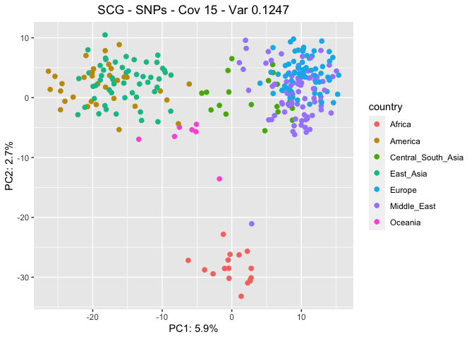
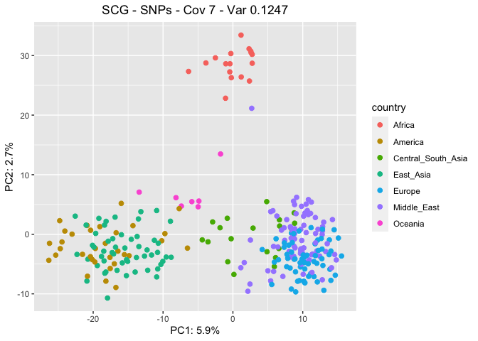
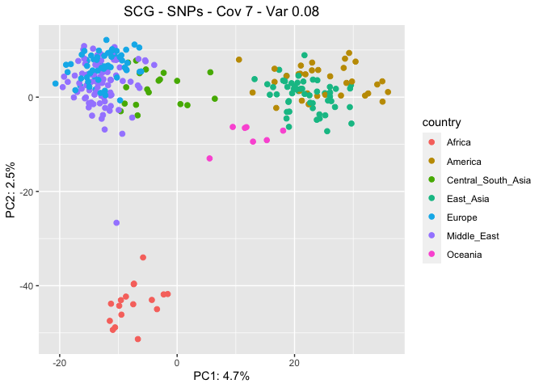
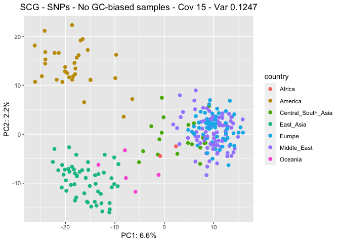
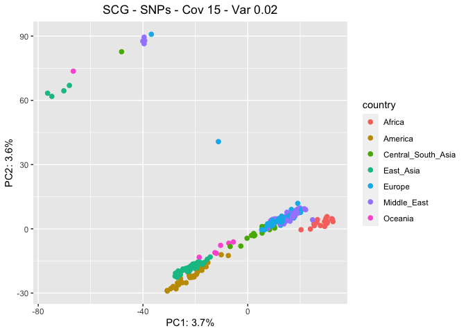
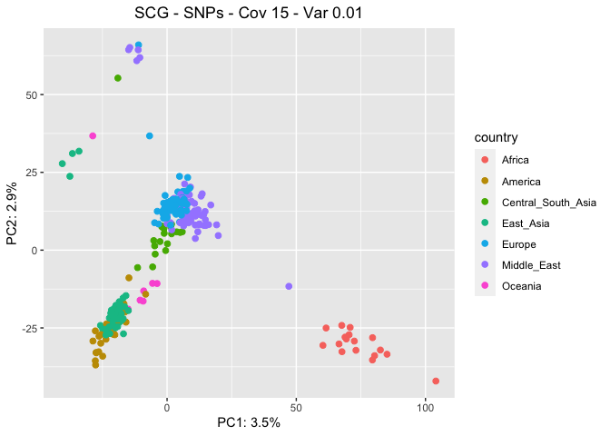

SNPs - SCGs
================

This script has the goal to understand the genetic distance across the
samples in the HGDP using the single copy genes (scg) present in our
library. From the output files “.sync.gz”, we first run the script
*sync2matrix.py* to create a single file containing all the information,
then the script *frequency_matrix_scgs.py* to call the SNPs only in the
scg and in the scg on the x chromosome (scgx).

Example on how to call the *frequency_matrix_scgs.py* script:

    python /Volumes/Temp1/rpianezza/PCA-SNPs-all-analysis/scgs/frequency_matrix_scgs.py /Volumes/Temp1/rpianezza/0.old/SNP/allte.matrix /Volumes/Temp1/rpianezza/PCA-SNPs-all-analysis/scgs/scg.cov7.var008.frequency.matrix.tsv --perc_var 0.08 --min_cov 7

## Prepare the environment

``` r
library(tidyverse)
```

    ## ── Attaching packages ─────────────────────────────────────── tidyverse 1.3.2 ──
    ## ✔ ggplot2 3.4.0      ✔ purrr   0.3.4 
    ## ✔ tibble  3.1.8      ✔ dplyr   1.0.10
    ## ✔ tidyr   1.2.1      ✔ stringr 1.4.1 
    ## ✔ readr   2.1.2      ✔ forcats 0.5.2 
    ## ── Conflicts ────────────────────────────────────────── tidyverse_conflicts() ──
    ## ✖ dplyr::filter() masks stats::filter()
    ## ✖ dplyr::lag()    masks stats::lag()

``` r
library(ggpubr)
```

## Read the summary files

Summary files:

- **HGDP** = main HGDP summary file
- **HGDP_pcr_free** = only the PCR free samples in the HGDP
- **HGDP_final** = only the GC-bias free samples in the HGDP, defined as
  the samples for which the parabolic quadratic coefficient **a** is
  neither \>0.5 or \<0.5, meaning that the estimated copy number for the
  sequence is not strongly influenced by the GC-bias (check the script
  *other-documentation/GC-bias* for more).

``` r
HGDP <- read_delim("/Volumes/Temp1/rpianezza/0.old/summary-HGDP/HGDP_cutoff_classified.tsv")
```

    ## Rows: 1394352 Columns: 12
    ## ── Column specification ────────────────────────────────────────────────────────
    ## Delimiter: "\t"
    ## chr (9): ID, pop, sex, country, type, familyname, batch, superfamily, shared...
    ## dbl (3): length, reads, copynumber
    ## 
    ## ℹ Use `spec()` to retrieve the full column specification for this data.
    ## ℹ Specify the column types or set `show_col_types = FALSE` to quiet this message.

``` r
HGDP_pcr_free_samples <- read_tsv("/Volumes/Temp1/rpianezza/investigation/HGDP-no-PCR/HGDP-only-pcr-free-samples.tsv", col_names = "ID")
```

    ## Rows: 676 Columns: 1
    ## ── Column specification ────────────────────────────────────────────────────────
    ## Delimiter: "\t"
    ## chr (1): ID
    ## 
    ## ℹ Use `spec()` to retrieve the full column specification for this data.
    ## ℹ Specify the column types or set `show_col_types = FALSE` to quiet this message.

``` r
HGDP_pcr_free <- HGDP %>% filter(ID %in% HGDP_pcr_free_samples$ID)

a_HGDP <- read_tsv("/Volumes/Temp1/rpianezza/PCA-copynumber-all-analysis/a_HGDP.tsv")
```

    ## Rows: 828 Columns: 2
    ## ── Column specification ────────────────────────────────────────────────────────
    ## Delimiter: "\t"
    ## chr (1): ID
    ## dbl (1): a
    ## 
    ## ℹ Use `spec()` to retrieve the full column specification for this data.
    ## ℹ Specify the column types or set `show_col_types = FALSE` to quiet this message.

``` r
HGDP_nobiased_samples <- filter(a_HGDP, (a>(-0.5)) & (a<0.5)) %>% select(ID) %>% pull()
HGDP_final <- filter(HGDP_pcr_free, ID %in% HGDP_nobiased_samples)
```

## Read coordinates files

Coordinates files:

- **coordinates** = lat and lon for each population in the dataset.
- **distances** = chilometric distance from the out of Africa (Egypt)
  for all the population in the dataset.

``` r
coordinates <- read_tsv("/Volumes/Temp1/rpianezza/PCA-copynumber-all-analysis/american-to-east.tsv", col_names = c("pop", "region", "latitude", "longitude")) %>% select(pop, latitude, longitude)
```

    ## Rows: 54 Columns: 4
    ## ── Column specification ────────────────────────────────────────────────────────
    ## Delimiter: "\t"
    ## chr (2): pop, region
    ## dbl (2): latitude, longitude
    ## 
    ## ℹ Use `spec()` to retrieve the full column specification for this data.
    ## ℹ Specify the column types or set `show_col_types = FALSE` to quiet this message.

``` r
data <- inner_join(coordinates, HGDP, by = "pop")

distances <- read_tsv("/Volumes/Temp1/rpianezza/PCA-copynumber-all-analysis/dist-from-ooa.tsv", col_names = c("pop", "region", "distance")) %>% select(pop, distance)
```

    ## Rows: 54 Columns: 3
    ## ── Column specification ────────────────────────────────────────────────────────
    ## Delimiter: "\t"
    ## chr (2): pop, region
    ## dbl (1): distance
    ## 
    ## ℹ Use `spec()` to retrieve the full column specification for this data.
    ## ℹ Specify the column types or set `show_col_types = FALSE` to quiet this message.

``` r
data_distance <- inner_join(distances, HGDP, by = "pop")
```

# PCA on the filtered dataset

## Read the SNPs matrixes

Different matrixes have been created using different parameters in the
script *frequency_matrix_scgs.py*. In particular:

- **min_cov** = the minimum coverage of a position to be considered for
  SNP calling. Given that the average coverage of the HGDP samples is
  30, I tried **15** and **7** (half and quarter of the avg).
- **perc_var** = the minimum variance of the major allele frequency
  across the samples for a single position to be called as SNP. I tried:
  \*\* **0.1247** = should include the firsts 1000 more variant SNPs
  (shown in *variance/01-all-variance*) \*\* **0.08** = should include
  the firsts 2000 more variant SNPs \*\* **0.02** = should include the
  firsts 4000 more variant SNPs \*\* **0.1219** = should include the
  firsts 1000 more variant SNPs only considering the non GC-biased
  samples

I created a matrix for all the tested parameters combinations, plus the
matrix considering only the non GC-biased samples (cov 15).

``` r
cov15_var01247 <- "/Volumes/Temp1/rpianezza/PCA-SNPs-all-analysis/scgs/scg.cov15.var01247.frequency.matrix.tsv_processed"
cov15_var008 <- "/Volumes/Temp1/rpianezza/PCA-SNPs-all-analysis/scgs/scg.cov15.var008.frequency.matrix.tsv_processed"
cov7_var01247 <- "/Volumes/Temp1/rpianezza/PCA-SNPs-all-analysis/scgs/scg.cov7.var01247.frequency.matrix.tsv_processed"
cov7_var008 <- "/Volumes/Temp1/rpianezza/PCA-SNPs-all-analysis/scgs/scg.cov7.var008.frequency.matrix.tsv_processed"
cov15_var002 <- "/Volumes/Temp1/rpianezza/PCA-SNPs-all-analysis/scgs/scg.cov15.var002.frequency.matrix.tsv_processed"
cov15_var001 <- "/Volumes/Temp1/rpianezza/PCA-SNPs-all-analysis/scgs/scg.cov15.var001.frequency.matrix.tsv_processed"
nogc_cov15_var01219 <- "/Volumes/Temp1/rpianezza/PCA-SNPs-all-analysis/scgs/scg.nogcbias-cov15.var01219.frequency.matrix.tsv_processed"
```

## Function for PCA plotting

This function takes as input the SNP matrix, the summary file containing
the metadata info, and the plot title and returns both the **PCA plot**
visualized in ggplot2 and a tibble containing the results of an **ANOVA
test** to check if the differences across groups (in this case “country”
of the populations) are significant.

``` r
PCA_SNPs <- function(freq_matrix, metadata, title){

matrix <- read_csv(freq_matrix)
  
metadata <- metadata %>% filter(sex=="female") %>% select(ID, sex, country, pop) %>% distinct()
matrix <- inner_join(metadata, matrix, by="ID")

pca_data <- matrix %>%  select_if(~ !all(. == .[1]))
pca_result <- prcomp(pca_data[, -c(1:3)], center = TRUE, scale = TRUE)

var_explained <- pca_result$sdev^2/sum(pca_result$sdev^2)
      
figure <- ggplot(data.frame(pca_result$x, country=matrix$country), aes(x=PC1,y=PC2, color=country)) + geom_point(size=2, show.legend = TRUE) + labs(x=paste0("PC1: ",round(var_explained[1]*100,1),"%"), y=paste0("PC2: ",round(var_explained[2]*100,1),"%")) + ggtitle(title) + theme(plot.title = element_text(hjust = 0.5))


# Create an empty tibble to store the results
results <- tibble()

# Perform ANOVA on PC1 and PC2 for the female samples
for (i in c(1:10)) {
  model <- aov(pca_result$x[,i] ~ matrix$country)
  summary_res <- summary(model)
  
# Extract the F value and p-value from the summary and the explained variability
f_value <- summary_res[[1]]$F[1]
p_value <- summary_res[[1]]$`Pr(>F)`[1]
explained_var <- (pca_result$sdev[i]^2/sum(pca_result$sdev^2))*100
  
  if (p_value < 0.001) {
significance <- "strong"
} else if (p_value >= 0.001 & p_value < 0.01) {
significance <- "moderate"
} else if (p_value >= 0.01 & p_value < 0.05) {
significance <- "weak"
} else if (p_value >= 0.05 & p_value < 0.1) {
significance <- "little"
} else {
significance <- "no-evidence"
}
  
# Store the results in the tibble
results <- results %>% bind_rows(tibble(PC = paste0("PC", i), F = f_value, p = p_value, Explained_Variability = explained_var, Significance = significance))
}

list(plot = figure, anova = results)
}
```

## PCA

1)  **Coverage 15 - Variance 0.127**: this plot should be the reference
    plot to compare with the others to see if the PCA is robust to
    parameter changes.

``` r
pca_cov15_var01247 <- PCA_SNPs(cov15_var01247, HGDP, "SCG - SNPs - Cov 15 - Var 0.1247")
```

    ## Rows: 828 Columns: 2889
    ## ── Column specification ────────────────────────────────────────────────────────
    ## Delimiter: ","
    ## chr    (1): ID
    ## dbl (2888): chr1:916864-921016_scg_631A, chr1:916864-921016_scg_631T, chr1:9...
    ## 
    ## ℹ Use `spec()` to retrieve the full column specification for this data.
    ## ℹ Specify the column types or set `show_col_types = FALSE` to quiet this message.

``` r
pca_cov15_var01247$plot
```

<!-- -->

``` r
pca_cov15_var01247$anova
```

    ## # A tibble: 10 × 5
    ##    PC         F         p Explained_Variability Significance
    ##    <chr>  <dbl>     <dbl>                 <dbl> <chr>       
    ##  1 PC1   525.   5.69e-145                 5.95  strong      
    ##  2 PC2   210.   3.28e- 98                 2.74  strong      
    ##  3 PC3   190.   1.59e- 93                 2.10  strong      
    ##  4 PC4    16.5  3.27e- 16                 1.42  strong      
    ##  5 PC5     4.21 4.62e-  4                 1.38  strong      
    ##  6 PC6     5.52 2.07e-  5                 1.15  strong      
    ##  7 PC7     7.41 2.36e-  7                 1.12  strong      
    ##  8 PC8     2.04 6.09e-  2                 1.07  little      
    ##  9 PC9     6.15 4.70e-  6                 1.05  strong      
    ## 10 PC10    2.24 3.95e-  2                 0.995 weak

2)  **Coverage 15 - Variance 0.08**: increasing the SNPs included by
    decreasing minimum variance, the analysis remains similar.

``` r
pca_cov15_var008 <- PCA_SNPs(cov15_var008, HGDP, "SCG - SNPs - Cov 15 - Var 0.08")
```

    ## Rows: 828 Columns: 6701
    ## ── Column specification ────────────────────────────────────────────────────────
    ## Delimiter: ","
    ## chr    (1): ID
    ## dbl (6700): chr1:916864-921016_scg_631A, chr1:916864-921016_scg_631T, chr1:9...
    ## 
    ## ℹ Use `spec()` to retrieve the full column specification for this data.
    ## ℹ Specify the column types or set `show_col_types = FALSE` to quiet this message.

``` r
pca_cov15_var008$plot
```

<!-- -->

``` r
pca_cov15_var008$anova
```

    ## # A tibble: 10 × 5
    ##    PC         F         p Explained_Variability Significance
    ##    <chr>  <dbl>     <dbl>                 <dbl> <chr>       
    ##  1 PC1   756.   8.23e-165                 4.69  strong      
    ##  2 PC2   377.   1.61e-127                 2.51  strong      
    ##  3 PC3   294.   9.15e-115                 1.88  strong      
    ##  4 PC4    33.2  7.95e- 30                 1.16  strong      
    ##  5 PC5     5.94 7.71e-  6                 1.05  strong      
    ##  6 PC6     1.82 9.54e-  2                 1.01  little      
    ##  7 PC7     5.07 6.03e-  5                 0.944 strong      
    ##  8 PC8     9.73 1.08e-  9                 0.930 strong      
    ##  9 PC9     1.32 2.50e-  1                 0.881 no-evidence 
    ## 10 PC10    1.46 1.91e-  1                 0.840 no-evidence

3)  **Coverage 7 - Variance 0.1247**: increasing the SNPs included by
    decreasing minimum coverage, the analysis remains similar.

``` r
pca_cov7_var01247 <- PCA_SNPs(cov7_var01247, HGDP, "SCG - SNPs - Cov 7 - Var 0.1247")
```

    ## Rows: 828 Columns: 2937
    ## ── Column specification ────────────────────────────────────────────────────────
    ## Delimiter: ","
    ## chr    (1): ID
    ## dbl (2936): chr1:916864-921016_scg_631A, chr1:916864-921016_scg_631T, chr1:9...
    ## 
    ## ℹ Use `spec()` to retrieve the full column specification for this data.
    ## ℹ Specify the column types or set `show_col_types = FALSE` to quiet this message.

``` r
pca_cov7_var01247$plot
```

<!-- -->

``` r
pca_cov7_var01247$anova
```

    ## # A tibble: 10 × 5
    ##    PC         F         p Explained_Variability Significance
    ##    <chr>  <dbl>     <dbl>                 <dbl> <chr>       
    ##  1 PC1   532.   1.10e-145                 5.89  strong      
    ##  2 PC2   211.   2.08e- 98                 2.70  strong      
    ##  3 PC3   189.   3.22e- 93                 2.07  strong      
    ##  4 PC4    17.7  2.98e- 17                 1.40  strong      
    ##  5 PC5     4.13 5.48e-  4                 1.36  strong      
    ##  6 PC6     6.03 6.24e-  6                 1.14  strong      
    ##  7 PC7     7.69 1.22e-  7                 1.11  strong      
    ##  8 PC8     3.72 1.44e-  3                 1.06  moderate    
    ##  9 PC9     3.93 8.88e-  4                 1.05  strong      
    ## 10 PC10    2.61 1.79e-  2                 0.987 weak

4)  **Coverage 7 - Variance 0.08**: increasing the SNPs included by
    decreasing minimum coverage and minimum variance, the analysis
    remains similar.

``` r
pca_cov7_var008 <- PCA_SNPs(cov7_var008, HGDP, "SCG - SNPs - Cov 7 - Var 0.08")
```

    ## Rows: 828 Columns: 6781
    ## ── Column specification ────────────────────────────────────────────────────────
    ## Delimiter: ","
    ## chr    (1): ID
    ## dbl (6780): chr1:916864-921016_scg_631A, chr1:916864-921016_scg_631T, chr1:9...
    ## 
    ## ℹ Use `spec()` to retrieve the full column specification for this data.
    ## ℹ Specify the column types or set `show_col_types = FALSE` to quiet this message.

``` r
pca_cov7_var008$plot
```

<!-- -->

``` r
pca_cov7_var008$anova
```

    ## # A tibble: 10 × 5
    ##    PC         F         p Explained_Variability Significance
    ##    <chr>  <dbl>     <dbl>                 <dbl> <chr>       
    ##  1 PC1   760.   4.86e-165                 4.66  strong      
    ##  2 PC2   386.   9.89e-129                 2.52  strong      
    ##  3 PC3   291.   3.25e-114                 1.86  strong      
    ##  4 PC4    33.9  2.28e- 30                 1.15  strong      
    ##  5 PC5     6.37 2.74e-  6                 1.04  strong      
    ##  6 PC6     1.85 8.99e-  2                 1.00  little      
    ##  7 PC7     7.09 5.04e-  7                 0.940 strong      
    ##  8 PC8     7.71 1.17e-  7                 0.926 strong      
    ##  9 PC9     1.06 3.85e-  1                 0.876 no-evidence 
    ## 10 PC10    1.86 8.86e-  2                 0.838 little

5)  **No GC-biased samples - Coverage 15 - Variance 0.1219**:
    considering only the samples without a significant GC-bias, the
    analysis obviously changes because almost all the African samples
    are removed from the analysis. I think that the PC2 is not separing
    anymore the African samples from the other, but the Americans from
    the East Asians. The rest of the analysis is very similar and I
    think it confirms the robustness of our approach.

``` r
pca_nogc_cov15_var01219 <- PCA_SNPs(nogc_cov15_var01219, HGDP_final, "SCG - SNPs - No GC-biased samples - Cov 15 - Var 0.1247")
```

    ## Rows: 655 Columns: 2913
    ## ── Column specification ────────────────────────────────────────────────────────
    ## Delimiter: ","
    ## chr    (1): ID
    ## dbl (2912): chr1:916864-921016_scg_631A, chr1:916864-921016_scg_631T, chr1:9...
    ## 
    ## ℹ Use `spec()` to retrieve the full column specification for this data.
    ## ℹ Specify the column types or set `show_col_types = FALSE` to quiet this message.

``` r
pca_nogc_cov15_var01219$plot
```

<!-- -->

``` r
pca_nogc_cov15_var01219$anova
```

    ## # A tibble: 10 × 5
    ##    PC         F         p Explained_Variability Significance
    ##    <chr>  <dbl>     <dbl>                 <dbl> <chr>       
    ##  1 PC1   523.   6.70e-137                  6.60 strong      
    ##  2 PC2   166.   1.72e- 83                  2.24 strong      
    ##  3 PC3    16.4  6.96e- 16                  1.66 strong      
    ##  4 PC4     2.95 8.47e-  3                  1.44 moderate    
    ##  5 PC5     4.00 7.66e-  4                  1.26 strong      
    ##  6 PC6     4.56 2.10e-  4                  1.18 strong      
    ##  7 PC7     1.31 2.51e-  1                  1.16 no-evidence 
    ##  8 PC8     7.42 2.60e-  7                  1.11 strong      
    ##  9 PC9     1.06 3.89e-  1                  1.02 no-evidence 
    ## 10 PC10    1.38 2.22e-  1                  1.01 no-evidence

6)  **Coverage 15 - Variance 0.02** and **Variance 0.01**: considering
    more SNPs lowering the variance threshold (around 4k SNPs for 0.02).

``` r
pca_cov15_var002 <- PCA_SNPs(cov15_var002, HGDP, "SCG - SNPs - Cov 15 - Var 0.02")
```

    ## Rows: 828 Columns: 13717
    ## ── Column specification ────────────────────────────────────────────────────────
    ## Delimiter: ","
    ## chr     (1): ID
    ## dbl (13716): chr1:916864-921016_scg_406A, chr1:916864-921016_scg_406T, chr1:...
    ## 
    ## ℹ Use `spec()` to retrieve the full column specification for this data.
    ## ℹ Specify the column types or set `show_col_types = FALSE` to quiet this message.

``` r
pca_cov15_var002$plot
```

<!-- -->

``` r
pca_cov15_var002$anova
```

    ## # A tibble: 10 × 5
    ##    PC         F         p Explained_Variability Significance
    ##    <chr>  <dbl>     <dbl>                 <dbl> <chr>       
    ##  1 PC1   108.   1.44e- 68                 3.72  strong      
    ##  2 PC2    19.8  4.06e- 19                 3.55  strong      
    ##  3 PC3   505.   6.57e-143                 2.73  strong      
    ##  4 PC4   367.   4.79e-126                 1.53  strong      
    ##  5 PC5   101.   6.77e- 66                 0.907 strong      
    ##  6 PC6     7.52 1.84e-  7                 0.794 strong      
    ##  7 PC7     3.95 8.38e-  4                 0.744 strong      
    ##  8 PC8     5.68 1.44e-  5                 0.737 strong      
    ##  9 PC9     1.73 1.13e-  1                 0.727 no-evidence 
    ## 10 PC10    1.06 3.88e-  1                 0.684 no-evidence

``` r
pca_cov15_var001 <- PCA_SNPs(cov15_var001, HGDP, "SCG - SNPs - Cov 15 - Var 0.01")
```

    ## Rows: 828 Columns: 18125
    ## ── Column specification ────────────────────────────────────────────────────────
    ## Delimiter: ","
    ## chr     (1): ID
    ## dbl (18124): chr1:916864-921016_scg_199A, chr1:916864-921016_scg_199T, chr1:...
    ## 
    ## ℹ Use `spec()` to retrieve the full column specification for this data.
    ## ℹ Specify the column types or set `show_col_types = FALSE` to quiet this message.

``` r
pca_cov15_var001$plot
```

<!-- -->

``` r
pca_cov15_var001$anova
```

    ## # A tibble: 10 × 5
    ##    PC          F         p Explained_Variability Significance
    ##    <chr>   <dbl>     <dbl>                 <dbl> <chr>       
    ##  1 PC1   563.    9.42e-149                 3.51  strong      
    ##  2 PC2   117.    7.08e- 72                 2.88  strong      
    ##  3 PC3    19.0   2.03e- 18                 2.78  strong      
    ##  4 PC4   356.    1.44e-124                 1.40  strong      
    ##  5 PC5     1.39  2.19e-  1                 1.02  no-evidence 
    ##  6 PC6   163.    1.61e- 86                 0.910 strong      
    ##  7 PC7     0.429 8.59e-  1                 0.807 no-evidence 
    ##  8 PC8     6.46  2.25e-  6                 0.743 strong      
    ##  9 PC9     1.51  1.74e-  1                 0.722 no-evidence 
    ## 10 PC10    2.64  1.66e-  2                 0.719 weak
