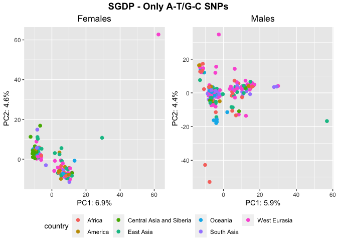
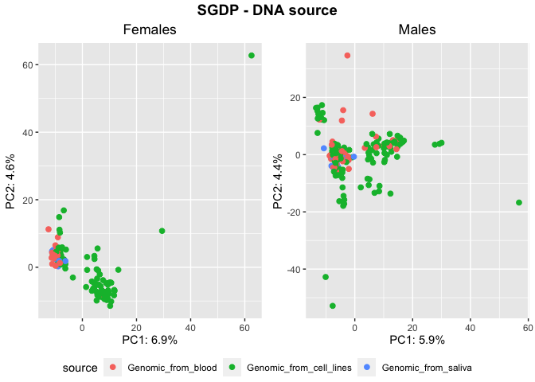
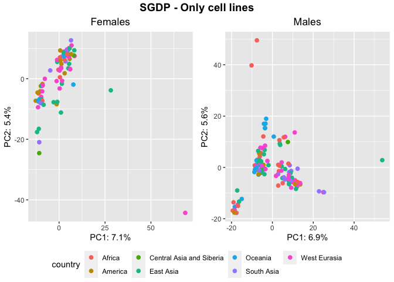
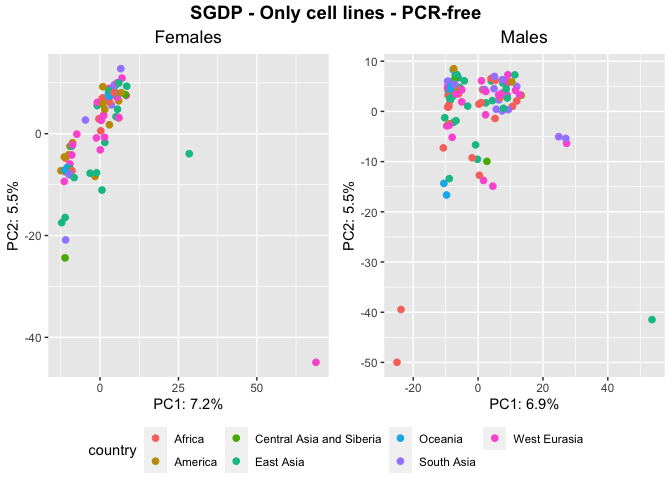
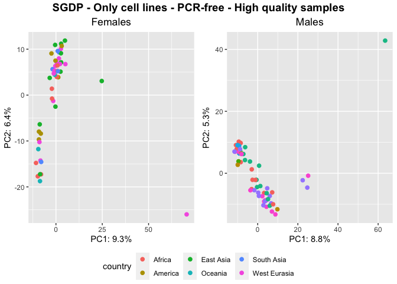
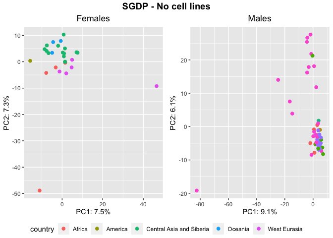
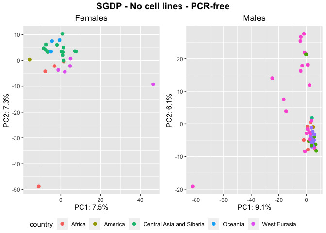
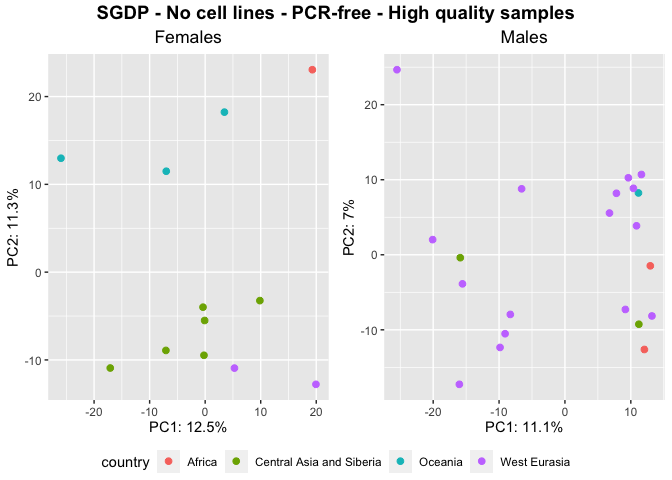

SNPs - Transversions excluded
================

## Preparatory work for the analysis

``` r
library(tidyverse)
```

    ## ── Attaching packages ─────────────────────────────────────── tidyverse 1.3.2 ──
    ## ✔ ggplot2 3.4.0      ✔ purrr   0.3.4 
    ## ✔ tibble  3.1.8      ✔ dplyr   1.0.10
    ## ✔ tidyr   1.2.1      ✔ stringr 1.4.1 
    ## ✔ readr   2.1.2      ✔ forcats 0.5.2 
    ## ── Conflicts ────────────────────────────────────────── tidyverse_conflicts() ──
    ## ✖ dplyr::filter() masks stats::filter()
    ## ✖ dplyr::lag()    masks stats::lag()

``` r
library(ggpubr)
```

After we discovered the presence of the GC bias in the data sets due to
the PCR samples present in both, we tried to go more in details here to
better understand its implication also within PCR-free samples.

First I read the two data sets summary files.

``` r
HGDP<-read_delim("/Volumes/Temp1/rpianezza/TE/summary-HGDP/USEME_HGDP_complete_reflib6.2_mq10_batchinfo_cutoff0.01.txt")
```

    ## Rows: 1394352 Columns: 10
    ## ── Column specification ────────────────────────────────────────────────────────
    ## Delimiter: ","
    ## chr (7): ID, Pop, sex, Country, type, familyname, batch
    ## dbl (3): length, reads, copynumber
    ## 
    ## ℹ Use `spec()` to retrieve the full column specification for this data.
    ## ℹ Specify the column types or set `show_col_types = FALSE` to quiet this message.

``` r
names(HGDP)<-c("ID","pop","sex","country","type","familyname","length","reads","copynumber","batch")

SGDP <- read_tsv("/Volumes/Temp2/rpianezza/SGDP/summary/USEME_SGDP_cutoff") %>% dplyr::rename(ID=biosample)
```

    ## Rows: 470028 Columns: 10
    ## ── Column specification ────────────────────────────────────────────────────────
    ## Delimiter: "\t"
    ## chr (7): biosample, sex, pop, country, type, familyname, batch
    ## dbl (3): length, reads, copynumber
    ## 
    ## ℹ Use `spec()` to retrieve the full column specification for this data.
    ## ℹ Specify the column types or set `show_col_types = FALSE` to quiet this message.

``` r
HGDP_pcr_free_samples <- read_tsv("/Volumes/Temp1/rpianezza/investigation/HGDP-no-PCR/HGDP-only-pcr-free-samples.tsv", col_names = "ID")
```

    ## Rows: 676 Columns: 1
    ## ── Column specification ────────────────────────────────────────────────────────
    ## Delimiter: "\t"
    ## chr (1): ID
    ## 
    ## ℹ Use `spec()` to retrieve the full column specification for this data.
    ## ℹ Specify the column types or set `show_col_types = FALSE` to quiet this message.

``` r
HGDP_pcr_free <- HGDP %>% filter(ID %in% HGDP_pcr_free_samples$ID)
HGDP_pcr <- HGDP %>% filter(!(ID %in% HGDP_pcr_free_samples$ID))

SGDP_pcr_free_samples <- read_tsv("/Volumes/Temp1/rpianezza/SGDP/ric-documentation/SGDP-no-PCR.tsv")
```

    ## Rows: 261 Columns: 1
    ## ── Column specification ────────────────────────────────────────────────────────
    ## Delimiter: "\t"
    ## chr (1): ID
    ## 
    ## ℹ Use `spec()` to retrieve the full column specification for this data.
    ## ℹ Specify the column types or set `show_col_types = FALSE` to quiet this message.

``` r
SGDP_pcr_free <- SGDP %>% filter(ID %in% SGDP_pcr_free_samples$ID)
SGDP_pcr <- SGDP %>% filter(!(ID %in% SGDP_pcr_free_samples$ID))
```

## SNPs

``` r
PCA <- function(freq_matrix, metadata, titlee){

matrix <- read_csv(freq_matrix)
  
f_metadata <- metadata %>% filter(sex=="female") %>% select(ID, sex, country, pop) %>% distinct()
m_metadata <- metadata %>% filter(sex=="male") %>% select(ID, sex, country, pop) %>% distinct()
males_matrix <- inner_join(m_metadata, matrix, by="ID")
females_matrix <- inner_join(f_metadata, matrix, by="ID")

f_pca_data <- females_matrix %>%  select_if(~ !all(. == .[1]))
m_pca_data <- males_matrix %>%  select_if(~ !all(. == .[1]))
f_pca_result <- prcomp(f_pca_data[, -c(1:3)], center = TRUE, scale = TRUE)
m_pca_result <- prcomp(m_pca_data[, -c(1:3)], center = TRUE, scale = TRUE)
      
f_var_explained <- f_pca_result$sdev^2/sum(f_pca_result$sdev^2)
m_var_explained <- m_pca_result$sdev^2/sum(m_pca_result$sdev^2)
      
f <- ggplot(data.frame(f_pca_result$x, country=females_matrix$country), aes(x=PC1,y=PC2, color=country)) + geom_point(size=2) + labs(x=paste0("PC1: ",round(f_var_explained[1]*100,1),"%"), y=paste0("PC2: ",round(f_var_explained[2]*100,1),"%")) + ggtitle("Females") + theme(plot.title = element_text(hjust = 0.5))
   
m <- ggplot(data.frame(m_pca_result$x, country=males_matrix$country), aes(x=PC1,y=PC2, color=country)) + geom_point(size=2) + labs(x=paste0("PC1: ",round(m_var_explained[1]*100,1),"%"), y=paste0("PC2: ",round(m_var_explained[2]*100,1),"%")) + ggtitle("Males") + theme(plot.title = element_text(hjust = 0.5)) 
     
plot <- ggarrange(f, m, ncol = 2, nrow = 1, common.legend = TRUE, legend = "bottom", align = "hv", font.label = list(size = 10, color = "black", face = "bold", family = NULL, position = "top"))
annotate_figure(plot, top = text_grob(titlee, face = "bold", size = 14))
}
```

``` r
#PCA("/Volumes/Temp1/rpianezza/SNPs-all-analysis/matrixes/HGDP.notransv.08.5000.matrix_processed", HGDP, "HGDP - Only A-T/G-C SNPs")
PCA("/Volumes/Temp1/rpianezza/SNPs-all-analysis/matrixes/SGDP.notransv.08.5000.matrix_processed", SGDP, "SGDP - Only A-T/G-C SNPs")
```

    ## Rows: 276 Columns: 1949
    ## ── Column specification ────────────────────────────────────────────────────────
    ## Delimiter: ","
    ## chr    (1): ID
    ## dbl (1948): HERV9_te_2585A, HERV9_te_2585T, HERV9_te_2585C, HERV9_te_2585G, ...
    ## 
    ## ℹ Use `spec()` to retrieve the full column specification for this data.
    ## ℹ Specify the column types or set `show_col_types = FALSE` to quiet this message.

<!-- -->

``` r
SGDP_samples <- read_tsv("/Volumes/Temp1/rpianezza/SGDP/metadata/SGDP_metadata.tsv") %>% dplyr::rename(ID=biosample) %>% select(ID, sample)
```

    ## Rows: 276 Columns: 7
    ## ── Column specification ────────────────────────────────────────────────────────
    ## Delimiter: "\t"
    ## chr (5): sample, biosample, sex, pop, country
    ## dbl (2): latitude, longitude
    ## 
    ## ℹ Use `spec()` to retrieve the full column specification for this data.
    ## ℹ Specify the column types or set `show_col_types = FALSE` to quiet this message.

``` r
source <- read_tsv("/Volumes/Temp1/rpianezza/SGDP/metadata/DNA_source.txt")
```

    ## Rows: 301 Columns: 3
    ## ── Column specification ────────────────────────────────────────────────────────
    ## Delimiter: "\t"
    ## chr (3): sample, other_sample, source
    ## 
    ## ℹ Use `spec()` to retrieve the full column specification for this data.
    ## ℹ Specify the column types or set `show_col_types = FALSE` to quiet this message.

``` r
SGDP_source <- SGDP %>% inner_join(SGDP_samples, by="ID") %>% inner_join(source, by="sample")

SNP_source <- function(freq_matrix, metadata, titlee){

matrix <- read_csv(freq_matrix)
  
f_metadata <- metadata %>% filter(sex=="female") %>% select(ID, sex, country, pop, source) %>% distinct()
m_metadata <- metadata %>% filter(sex=="male") %>% select(ID, sex, country, pop, source) %>% distinct()
males_matrix <- inner_join(m_metadata, matrix, by="ID")
females_matrix <- inner_join(f_metadata, matrix, by="ID")

f_pca_data <- females_matrix %>%  select_if(~ !all(. == .[1]))
m_pca_data <- males_matrix %>%  select_if(~ !all(. == .[1]))

f_pca_result <- prcomp(f_pca_data[, -c(1:4)], center = TRUE, scale = TRUE)
m_pca_result <- prcomp(m_pca_data[, -c(1:4)], center = TRUE, scale = TRUE)
  
f_var_explained <- f_pca_result$sdev^2/sum(f_pca_result$sdev^2)
m_var_explained <- m_pca_result$sdev^2/sum(m_pca_result$sdev^2)
      
f <- ggplot(data.frame(f_pca_result$x, source=females_matrix$source), aes(x=PC1,y=PC2, color=source)) + geom_point(size=2) + labs(x=paste0("PC1: ",round(f_var_explained[1]*100,1),"%"), y=paste0("PC2: ",round(f_var_explained[2]*100,1),"%")) + ggtitle("Females") + theme(plot.title = element_text(hjust = 0.5))
   
m <- ggplot(data.frame(m_pca_result$x, source=males_matrix$source), aes(x=PC1,y=PC2, color=source)) + geom_point(size=2) + labs(x=paste0("PC1: ",round(m_var_explained[1]*100,1),"%"), y=paste0("PC2: ",round(m_var_explained[2]*100,1),"%")) + ggtitle("Males") + theme(plot.title = element_text(hjust = 0.5)) 
     
plot <- ggarrange(f, m, ncol = 2, nrow = 1, common.legend = TRUE, legend = "bottom", align = "hv", font.label = list(size = 10, color = "black", face = "bold", family = NULL, position = "top"))
annotate_figure(plot, top = text_grob(titlee, face = "bold", size = 14))
}

SNP_source("/Volumes/Temp1/rpianezza/SNPs-all-analysis/matrixes/SGDP.notransv.08.5000.matrix_processed", SGDP_source, "SGDP - DNA source")
```

    ## Rows: 276 Columns: 1949
    ## ── Column specification ────────────────────────────────────────────────────────
    ## Delimiter: ","
    ## chr    (1): ID
    ## dbl (1948): HERV9_te_2585A, HERV9_te_2585T, HERV9_te_2585C, HERV9_te_2585G, ...
    ## 
    ## ℹ Use `spec()` to retrieve the full column specification for this data.
    ## ℹ Specify the column types or set `show_col_types = FALSE` to quiet this message.

<!-- -->

``` r
SGDP_cell <- filter(SGDP_source, source=="Genomic_from_cell_lines")
PCA("/Volumes/Temp1/rpianezza/SNPs-all-analysis/matrixes/SGDP.notransv.08.5000.matrix_processed", SGDP_cell, "SGDP - Only cell lines")
```

    ## Rows: 276 Columns: 1949
    ## ── Column specification ────────────────────────────────────────────────────────
    ## Delimiter: ","
    ## chr    (1): ID
    ## dbl (1948): HERV9_te_2585A, HERV9_te_2585T, HERV9_te_2585C, HERV9_te_2585G, ...
    ## 
    ## ℹ Use `spec()` to retrieve the full column specification for this data.
    ## ℹ Specify the column types or set `show_col_types = FALSE` to quiet this message.

<!-- -->

``` r
SGDP_cell_PCRfree <- filter(SGDP_cell, ID %in% SGDP_pcr_free$ID)
PCA("/Volumes/Temp1/rpianezza/SNPs-all-analysis/matrixes/SGDP.notransv.08.5000.matrix_processed", SGDP_cell_PCRfree, "SGDP - Only cell lines - PCR-free")
```

    ## Rows: 276 Columns: 1949
    ## ── Column specification ────────────────────────────────────────────────────────
    ## Delimiter: ","
    ## chr    (1): ID
    ## dbl (1948): HERV9_te_2585A, HERV9_te_2585T, HERV9_te_2585C, HERV9_te_2585G, ...
    ## 
    ## ℹ Use `spec()` to retrieve the full column specification for this data.
    ## ℹ Specify the column types or set `show_col_types = FALSE` to quiet this message.

<!-- -->

``` r
SGDP_stable_names <- SGDP %>% filter(type=="scg") %>% group_by(ID, pop, country, sex) %>% dplyr::summarise(var = var(copynumber)) %>% arrange(desc(var)) %>% filter(var<0.01) %>% ungroup() %>% distinct(ID) %>% pull()
```

    ## `summarise()` has grouped output by 'ID', 'pop', 'country'. You can override
    ## using the `.groups` argument.

``` r
SGDP_stable_cell_PCRfree <- SGDP_cell_PCRfree %>% filter(ID %in% SGDP_stable_names)
PCA("/Volumes/Temp1/rpianezza/SNPs-all-analysis/matrixes/SGDP.notransv.08.5000.matrix_processed", SGDP_stable_cell_PCRfree, "SGDP - Only cell lines - PCR-free - High quality samples")
```

    ## Rows: 276 Columns: 1949
    ## ── Column specification ────────────────────────────────────────────────────────
    ## Delimiter: ","
    ## chr    (1): ID
    ## dbl (1948): HERV9_te_2585A, HERV9_te_2585T, HERV9_te_2585C, HERV9_te_2585G, ...
    ## 
    ## ℹ Use `spec()` to retrieve the full column specification for this data.
    ## ℹ Specify the column types or set `show_col_types = FALSE` to quiet this message.

<!-- -->

``` r
SGDP_nocell <- filter(SGDP_source, !(source=="Genomic_from_cell_lines"))
PCA("/Volumes/Temp1/rpianezza/SNPs-all-analysis/matrixes/SGDP.notransv.08.5000.matrix_processed", SGDP_nocell, "SGDP - No cell lines")
```

    ## Rows: 276 Columns: 1949
    ## ── Column specification ────────────────────────────────────────────────────────
    ## Delimiter: ","
    ## chr    (1): ID
    ## dbl (1948): HERV9_te_2585A, HERV9_te_2585T, HERV9_te_2585C, HERV9_te_2585G, ...
    ## 
    ## ℹ Use `spec()` to retrieve the full column specification for this data.
    ## ℹ Specify the column types or set `show_col_types = FALSE` to quiet this message.

<!-- -->

``` r
SGDP_nocell_PCRfree <- filter(SGDP_nocell, ID %in% SGDP_pcr_free$ID)
PCA("/Volumes/Temp1/rpianezza/SNPs-all-analysis/matrixes/SGDP.notransv.08.5000.matrix_processed", SGDP_nocell_PCRfree, "SGDP - No cell lines - PCR-free")
```

    ## Rows: 276 Columns: 1949
    ## ── Column specification ────────────────────────────────────────────────────────
    ## Delimiter: ","
    ## chr    (1): ID
    ## dbl (1948): HERV9_te_2585A, HERV9_te_2585T, HERV9_te_2585C, HERV9_te_2585G, ...
    ## 
    ## ℹ Use `spec()` to retrieve the full column specification for this data.
    ## ℹ Specify the column types or set `show_col_types = FALSE` to quiet this message.

<!-- -->

``` r
SGDP_stable_names <- SGDP %>% filter(type=="scg") %>% group_by(ID, pop, country, sex) %>% dplyr::summarise(var = var(copynumber)) %>% arrange(desc(var)) %>% filter(var<0.01) %>% ungroup() %>% distinct(ID) %>% pull()
```

    ## `summarise()` has grouped output by 'ID', 'pop', 'country'. You can override
    ## using the `.groups` argument.

``` r
SGDP_stable_nocell_PCRfree <- SGDP_nocell_PCRfree %>% filter(ID %in% SGDP_stable_names)
PCA("/Volumes/Temp1/rpianezza/SNPs-all-analysis/matrixes/SGDP.notransv.08.5000.matrix_processed", SGDP_stable_nocell_PCRfree, "SGDP - No cell lines - PCR-free - High quality samples")
```

    ## Rows: 276 Columns: 1949
    ## ── Column specification ────────────────────────────────────────────────────────
    ## Delimiter: ","
    ## chr    (1): ID
    ## dbl (1948): HERV9_te_2585A, HERV9_te_2585T, HERV9_te_2585C, HERV9_te_2585G, ...
    ## 
    ## ℹ Use `spec()` to retrieve the full column specification for this data.
    ## ℹ Specify the column types or set `show_col_types = FALSE` to quiet this message.

<!-- -->
