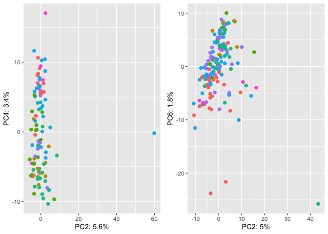

SNPs - ANOVA
================

The SNPs PCA chosen after all the filtering steps shown in script 05
are:

- Only GC-bias-free samples
- Only PCR-free samples
- Only TEs within 45-55% range of GC
- Only GC-bias-free SNPs

## Prepare the environment

``` r
library(tidyverse)
```

    ## ── Attaching packages ─────────────────────────────────────── tidyverse 1.3.2 ──
    ## ✔ ggplot2 3.4.0      ✔ purrr   0.3.4 
    ## ✔ tibble  3.1.8      ✔ dplyr   1.0.10
    ## ✔ tidyr   1.2.1      ✔ stringr 1.4.1 
    ## ✔ readr   2.1.2      ✔ forcats 0.5.2 
    ## ── Conflicts ────────────────────────────────────────── tidyverse_conflicts() ──
    ## ✖ dplyr::filter() masks stats::filter()
    ## ✖ dplyr::lag()    masks stats::lag()

``` r
library(ggpubr)
```

## Create list of non-variable TEs and other files

``` r
HGDP<-read_delim("/Volumes/Temp1/rpianezza/TE/summary-HGDP/USEME_HGDP_complete_reflib6.2_mq10_batchinfo_cutoff0.01.txt")
```

    ## Rows: 1394352 Columns: 10
    ## ── Column specification ────────────────────────────────────────────────────────
    ## Delimiter: ","
    ## chr (7): ID, Pop, sex, Country, type, familyname, batch
    ## dbl (3): length, reads, copynumber
    ## 
    ## ℹ Use `spec()` to retrieve the full column specification for this data.
    ## ℹ Specify the column types or set `show_col_types = FALSE` to quiet this message.

``` r
names(HGDP)<-c("ID","pop","sex","country","type","familyname","length","reads","copynumber","batch")
SGDP <- read_tsv("/Volumes/Temp2/rpianezza/SGDP/summary/USEME_SGDP_cutoff") %>% dplyr::rename(ID=biosample)
```

    ## Rows: 470028 Columns: 10
    ## ── Column specification ────────────────────────────────────────────────────────
    ## Delimiter: "\t"
    ## chr (7): biosample, sex, pop, country, type, familyname, batch
    ## dbl (3): length, reads, copynumber
    ## 
    ## ℹ Use `spec()` to retrieve the full column specification for this data.
    ## ℹ Specify the column types or set `show_col_types = FALSE` to quiet this message.

``` r
order <- c("Africa","America","Central Asia and Siberia","East Asia","West Eurasia","South Asia","Oceania")

HGDP_pcr_free_samples <- read_tsv("/Volumes/Temp1/rpianezza/investigation/HGDP-no-PCR/HGDP-only-pcr-free-samples.tsv", col_names = "ID")
```

    ## Rows: 676 Columns: 1
    ## ── Column specification ────────────────────────────────────────────────────────
    ## Delimiter: "\t"
    ## chr (1): ID
    ## 
    ## ℹ Use `spec()` to retrieve the full column specification for this data.
    ## ℹ Specify the column types or set `show_col_types = FALSE` to quiet this message.

``` r
HGDP_pcr_free <- HGDP %>% filter(ID %in% HGDP_pcr_free_samples$ID)
SGDP_pcr_free_samples <- read_tsv("/Volumes/Temp1/rpianezza/SGDP/ric-documentation/SGDP-no-PCR.tsv")
```

    ## Rows: 261 Columns: 1
    ## ── Column specification ────────────────────────────────────────────────────────
    ## Delimiter: "\t"
    ## chr (1): ID
    ## 
    ## ℹ Use `spec()` to retrieve the full column specification for this data.
    ## ℹ Specify the column types or set `show_col_types = FALSE` to quiet this message.

``` r
SGDP_pcr_free <- SGDP %>% filter(ID %in% SGDP_pcr_free_samples$ID)

a_HGDP <- read_tsv("/Volumes/Temp1/rpianezza/PCA-copynumber-all-analysis/a_HGDP.tsv")
```

    ## Rows: 828 Columns: 2
    ## ── Column specification ────────────────────────────────────────────────────────
    ## Delimiter: "\t"
    ## chr (1): ID
    ## dbl (1): a
    ## 
    ## ℹ Use `spec()` to retrieve the full column specification for this data.
    ## ℹ Specify the column types or set `show_col_types = FALSE` to quiet this message.

``` r
HGDP_nobiased_samples <- filter(a_HGDP, (a > (-0.5)) & (a<0.5)) %>% select(ID) %>% pull()
HGDP_nobiasedID_pcrfree <- filter(HGDP_pcr_free, ID %in% HGDP_nobiased_samples)
a_SGDP <- read_tsv("/Volumes/Temp1/rpianezza/PCA-copynumber-all-analysis/a_SGDP.tsv")
```

    ## Rows: 276 Columns: 2
    ## ── Column specification ────────────────────────────────────────────────────────
    ## Delimiter: "\t"
    ## chr (1): ID
    ## dbl (1): a
    ## 
    ## ℹ Use `spec()` to retrieve the full column specification for this data.
    ## ℹ Specify the column types or set `show_col_types = FALSE` to quiet this message.

``` r
SGDP_nobiased_samples <- filter(a_SGDP, (a > (-0.5)) & (a<0.5)) %>% select(ID) %>% pull()
SGDP_nobiasedID_pcrfree <- filter(SGDP_pcr_free, ID %in% SGDP_nobiased_samples)
```

## Read the SNPs matrixes

The SNPs matrixes are created using the script
**frequency_matrix_v7.py**. This version of the script filters
automatically the non-variable TEs in copynumber.

``` r
HGDP_noGCbias_45_55 = "/Volumes/Temp1/rpianezza/PCA-SNPs-all-analysis/matrixes/only-variableTEs/HGDP.noGCbias.45-55.matrix_processed"
SGDP_noGCbias_45_55 = "/Volumes/Temp1/rpianezza/PCA-SNPs-all-analysis/matrixes/only-variableTEs/SGDP.noGCbias.45-55.matrix_processed"
```

## Create the function for PCA plotting

``` r
PCA_ANOVA <- function(freq_matrix, metadata){

matrix <- read_csv(freq_matrix)
  
f_metadata <- metadata %>% filter(sex=="female") %>% select(ID, sex, country, pop) %>% distinct()
m_metadata <- metadata %>% filter(sex=="male") %>% select(ID, sex, country, pop) %>% distinct()
males_matrix <- inner_join(m_metadata, matrix, by="ID")
females_matrix <- inner_join(f_metadata, matrix, by="ID")

f_pca_data <- females_matrix %>%  select_if(~ !all(. == .[1]))
m_pca_data <- males_matrix %>%  select_if(~ !all(. == .[1]))
f_pca_result <- prcomp(f_pca_data[, -c(1:3)], center = TRUE, scale = TRUE)
m_pca_result <- prcomp(m_pca_data[, -c(1:3)], center = TRUE, scale = TRUE)
      
f_var_explained <- f_pca_result$sdev^2/sum(f_pca_result$sdev^2)
m_var_explained <- m_pca_result$sdev^2/sum(m_pca_result$sdev^2)
      
# Create an empty tibble to store the results
results <- tibble()

# Perform ANOVA on PC1 and PC2 for the female samples
for (i in c(1:10)) {
  model <- aov(f_pca_result$x[,i] ~ females_matrix$country)
  summary_res <- summary(model)
  
# Extract the F value and p-value from the summary and the explained variability
f_value <- summary_res[[1]]$F[1]
p_value <- summary_res[[1]]$`Pr(>F)`[1]
explained_var <- (f_pca_result$sdev[i]^2/sum(f_pca_result$sdev^2))*100
  
  if (p_value < 0.001) {
significance <- "strong"
} else if (p_value >= 0.001 & p_value < 0.01) {
significance <- "moderate"
} else if (p_value >= 0.01 & p_value < 0.05) {
significance <- "weak"
} else if (p_value >= 0.05 & p_value < 0.1) {
significance <- "little"
} else {
significance <- "no-evidence"
}
  
# Store the results in the tibble
results <- results %>% bind_rows(tibble(PC = paste0("PC", i), Sex = "Female", F = f_value, p = p_value, Explained_Variability = explained_var, Significance = significance))
}

# Repeat the ANOVA analysis for the male samples
for (i in c(1:10)) {
  model <- aov(m_pca_result$x[,i] ~ males_matrix$country)
  summary_res <- summary(model)
  
# Extract the F value and p-value from the summary and the explained variability
f_value <- summary_res[[1]]$F[1]
p_value <- summary_res[[1]]$`Pr(>F)`[1]
explained_var <- (m_pca_result$sdev[i]^2/sum(m_pca_result$sdev^2))*100
  
  if (p_value < 0.001) {
significance <- "strong"
} else if (p_value >= 0.001 & p_value < 0.01) {
significance <- "moderate"
} else if (p_value >= 0.01 & p_value < 0.05) {
significance <- "weak"
} else if (p_value >= 0.05 & p_value < 0.1) {
significance <- "little"
} else {
significance <- "no-evidence"
}
  
# Store the results in the tibble
results <- results %>% bind_rows(tibble(PC = paste0("PC", i), Sex = "Male", F = f_value, p = p_value, Explained_Variability = explained_var, Significance = significance))
}

# Print the results
print(results)
}
```

``` r
HGDP_nobiasSNPs_45to55_GC <- PCA_ANOVA(HGDP_noGCbias_45_55, HGDP_nobiasedID_pcrfree)
```

    ## Rows: 828 Columns: 837
    ## ── Column specification ────────────────────────────────────────────────────────
    ## Delimiter: ","
    ## chr   (1): ID
    ## dbl (836): HERV9_te_2585A, HERV9_te_2585T, HERV9_te_2585C, HERV9_te_2585G, H...
    ## 
    ## ℹ Use `spec()` to retrieve the full column specification for this data.
    ## ℹ Specify the column types or set `show_col_types = FALSE` to quiet this message.

    ## # A tibble: 20 × 6
    ##    PC    Sex         F        p Explained_Variability Significance
    ##    <chr> <chr>   <dbl>    <dbl>                 <dbl> <chr>       
    ##  1 PC1   Female 36.1   3.23e-31                 5.09  strong      
    ##  2 PC2   Female 15.9   2.11e-15                 2.48  strong      
    ##  3 PC3   Female  8.30  3.36e- 8                 2.29  strong      
    ##  4 PC4   Female 16.6   4.25e-16                 1.50  strong      
    ##  5 PC5   Female  3.80  1.22e- 3                 1.34  moderate    
    ##  6 PC6   Female  7.81  1.05e- 7                 1.28  strong      
    ##  7 PC7   Female  1.16  3.29e- 1                 1.20  no-evidence 
    ##  8 PC8   Female  2.67  1.56e- 2                 1.10  weak        
    ##  9 PC9   Female  5.05  6.68e- 5                 1.07  strong      
    ## 10 PC10  Female  1.92  7.75e- 2                 1.01  little      
    ## 11 PC1   Male   37.2   9.31e-36                 4.62  strong      
    ## 12 PC2   Male   62.9   1.47e-54                 3.72  strong      
    ## 13 PC3   Male   27.6   1.67e-27                 1.95  strong      
    ## 14 PC4   Male   23.6   8.11e-24                 1.18  strong      
    ## 15 PC5   Male    5.47  1.89e- 5                 1.10  strong      
    ## 16 PC6   Male    1.61  1.44e- 1                 1.03  no-evidence 
    ## 17 PC7   Male    6.77  7.58e- 7                 0.951 strong      
    ## 18 PC8   Male    8.53  9.93e- 9                 0.913 strong      
    ## 19 PC9   Male    1.19  3.13e- 1                 0.816 no-evidence 
    ## 20 PC10  Male    0.232 9.66e- 1                 0.808 no-evidence

``` r
SGDP_nobiasSNPs_45to55_GC <- PCA_ANOVA(SGDP_noGCbias_45_55, SGDP_nobiasedID_pcrfree)
```

    ## Rows: 276 Columns: 789
    ## ── Column specification ────────────────────────────────────────────────────────
    ## Delimiter: ","
    ## chr   (1): ID
    ## dbl (788): HERV9_te_2585A, HERV9_te_2585T, HERV9_te_2585C, HERV9_te_2585G, H...
    ## 
    ## ℹ Use `spec()` to retrieve the full column specification for this data.
    ## ℹ Specify the column types or set `show_col_types = FALSE` to quiet this message.

    ## # A tibble: 20 × 6
    ##    PC    Sex         F        p Explained_Variability Significance
    ##    <chr> <chr>   <dbl>    <dbl>                 <dbl> <chr>       
    ##  1 PC1   Female  1.02  4.19e- 1                  6.66 no-evidence 
    ##  2 PC2   Female 12.1   6.24e-10                  5.60 strong      
    ##  3 PC3   Female  0.888 5.07e- 1                  4.43 no-evidence 
    ##  4 PC4   Female  5.37  8.88e- 5                  3.37 strong      
    ##  5 PC5   Female  0.913 4.90e- 1                  1.97 no-evidence 
    ##  6 PC6   Female  1.22  3.04e- 1                  1.90 no-evidence 
    ##  7 PC7   Female  4.27  7.89e- 4                  1.81 strong      
    ##  8 PC8   Female  3.32  5.38e- 3                  1.77 moderate    
    ##  9 PC9   Female  2.50  2.77e- 2                  1.68 weak        
    ## 10 PC10  Female  1.80  1.08e- 1                  1.64 no-evidence 
    ## 11 PC1   Male    3.10  6.99e- 3                  5.42 moderate    
    ## 12 PC2   Male    7.89  2.45e- 7                  4.96 strong      
    ## 13 PC3   Male    1.75  1.14e- 1                  4.21 no-evidence 
    ## 14 PC4   Male    1.07  3.85e- 1                  2.85 no-evidence 
    ## 15 PC5   Male    1.62  1.45e- 1                  2.40 no-evidence 
    ## 16 PC6   Male    6.00  1.29e- 5                  1.83 strong      
    ## 17 PC7   Male    3.48  3.10e- 3                  1.64 moderate    
    ## 18 PC8   Male    4.08  8.29e- 4                  1.55 strong      
    ## 19 PC9   Male    1.35  2.40e- 1                  1.39 no-evidence 
    ## 20 PC10  Male    1.92  8.12e- 2                  1.30 little

## Explore other PCs in SGDP based on ANOVA test results

``` r
PCA_SGDP <- function(freq_matrix, metadata, order){

matrix <- read_csv(freq_matrix)
  
f_metadata <- metadata %>% filter(sex=="female") %>% select(ID, sex, country, pop) %>% distinct()
m_metadata <- metadata %>% filter(sex=="male") %>% select(ID, sex, country, pop) %>% distinct()
f_metadata$country_reordered <- factor(f_metadata$country, levels=order)
m_metadata$country_reordered <- factor(m_metadata$country, levels=order)
males_matrix <- inner_join(m_metadata, matrix, by="ID")
females_matrix <- inner_join(f_metadata, matrix, by="ID")

f_pca_data <- females_matrix %>%  select_if(~ !all(. == .[1]))
m_pca_data <- males_matrix %>%  select_if(~ !all(. == .[1]))
f_pca_result <- prcomp(f_pca_data[, -c(1:4)], center = TRUE, scale = TRUE)
m_pca_result <- prcomp(m_pca_data[, -c(1:4)], center = TRUE, scale = TRUE)
     
f_var_explained <- f_pca_result$sdev^2/sum(f_pca_result$sdev^2)
m_var_explained <- m_pca_result$sdev^2/sum(m_pca_result$sdev^2)
        
f <- ggplot(data.frame(f_pca_result$x, country=females_matrix$country), aes(x=PC1,y=PC2, color=females_matrix$country_reordered)) + geom_point(size=2, show.legend = FALSE) + labs(x=paste0("PC2: ",round(f_var_explained[2]*100,1),"%"), y=paste0("PC4: ",round(f_var_explained[4]*100,1),"%"))
m <- ggplot(data.frame(m_pca_result$x, country=males_matrix$country), aes(x=PC1,y=PC2, color=males_matrix$country_reordered)) + geom_point(size=2, show.legend = FALSE) + labs(x=paste0("PC2: ",round(m_var_explained[2]*100,1),"%"), y=paste0("PC6: ",round(m_var_explained[6]*100,1),"%"))
       
plot <- ggarrange(f, m, ncol = 2, nrow = 1, common.legend = TRUE, legend = "bottom", align = "hv", font.label = list(size = 10, color = "black", face = "bold", family = NULL, position = "top"))
}

(PCA_SGDP(SGDP_noGCbias_45_55, SGDP_nobiasedID_pcrfree, order))
```

    ## Rows: 276 Columns: 789
    ## ── Column specification ────────────────────────────────────────────────────────
    ## Delimiter: ","
    ## chr   (1): ID
    ## dbl (788): HERV9_te_2585A, HERV9_te_2585T, HERV9_te_2585C, HERV9_te_2585G, H...
    ## 
    ## ℹ Use `spec()` to retrieve the full column specification for this data.
    ## ℹ Specify the column types or set `show_col_types = FALSE` to quiet this message.

<!-- -->
