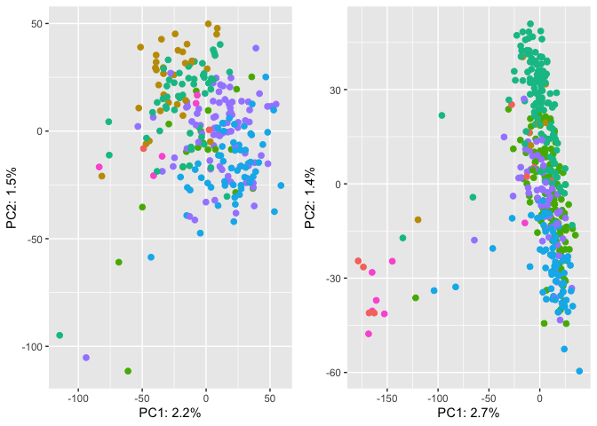

SNPs PCAs - Summary
================

In this document I want to summarize the results we got on the SNPs PCAs
in the HGDP. We decided to leave apart the SGDP, cause even if we were
able to clean a bit the data, they still look confusing and of poor
quality for our analysis.

In the previous scripts, we tried different filters for the dataset
(HGDP) to clean it and refine our findings:

- **Filter on the samples**: \*\* Only **PCR-free** samples: the PCR
  samples are showing a different clustering in the PCA \*\* Only
  **GC-bias-free** samples: mostly overlapping with the PCR-free
  samples, cause most of the PCR-samples are also showing a GC-bias, as
  expected \*\* Only **PCR-free** samples *and* **GC-bias-free**
  samples: a few PCR samples does not show GC-bias, but here we exclude
  them anyway to avoid considering possible outliers of the PCR samples.
  This is the final filtering step of the dataset based on the samples.

- **Filter on the TEs families**: \*\* Only TEs with GC content 45-55%:
  the idea was that removing GC-biased TEs we were able to “save” the
  PCR samples, making them clustering around the PCR-free samples. This
  was not the case. \*\* Only variable TEs

- **Filter on SNPs type**: \*\* Only SNPs not involved in changes in GC
  content

Since we were not able to save the PCR-samples in any way, we decided in
the end to consider **only samples PCR-free and GC-bias-free**, but to
not further filter for TEs families or SNPs.

## Setting the environment

``` r
library(tidyverse)
```

    ## ── Attaching packages ─────────────────────────────────────── tidyverse 1.3.2 ──
    ## ✔ ggplot2 3.4.0      ✔ purrr   0.3.4 
    ## ✔ tibble  3.1.8      ✔ dplyr   1.0.10
    ## ✔ tidyr   1.2.1      ✔ stringr 1.4.1 
    ## ✔ readr   2.1.2      ✔ forcats 0.5.2 
    ## ── Conflicts ────────────────────────────────────────── tidyverse_conflicts() ──
    ## ✖ dplyr::filter() masks stats::filter()
    ## ✖ dplyr::lag()    masks stats::lag()

``` r
library(ggpubr)
```

# Preparing the filtered HGDP file

## Read HGDP summary file

``` r
HGDP <- read_delim("/Volumes/Temp1/rpianezza/0.old/summary-HGDP/USEME_HGDP_complete_reflib6.2_mq10_batchinfo_cutoff0.01.txt")
```

    ## Rows: 1394352 Columns: 10
    ## ── Column specification ────────────────────────────────────────────────────────
    ## Delimiter: ","
    ## chr (7): ID, Pop, sex, Country, type, familyname, batch
    ## dbl (3): length, reads, copynumber
    ## 
    ## ℹ Use `spec()` to retrieve the full column specification for this data.
    ## ℹ Specify the column types or set `show_col_types = FALSE` to quiet this message.

``` r
names(HGDP) <- c("ID","pop","sex","country","type","familyname","length","reads","copynumber","batch")
```

## Filter out the PCR samples

From the initial 828 samples, we remain with 676 after removing the PCR
samples.

``` r
HGDP_pcr_free_samples <- read_tsv("/Volumes/Temp1/rpianezza/investigation/HGDP-no-PCR/HGDP-only-pcr-free-samples.tsv", col_names = "ID")
```

    ## Rows: 676 Columns: 1
    ## ── Column specification ────────────────────────────────────────────────────────
    ## Delimiter: "\t"
    ## chr (1): ID
    ## 
    ## ℹ Use `spec()` to retrieve the full column specification for this data.
    ## ℹ Specify the column types or set `show_col_types = FALSE` to quiet this message.

``` r
HGDP_pcr_free <- HGDP %>% filter(ID %in% HGDP_pcr_free_samples$ID)
```

## Filter out the GC-biased samples

From the 676 PCR-free samples, removing the GC-biased samples leads to a
dataset with **655 samples** in total.

- 402 males
- 253 females

Note that **“a”** is the parabola quadratic coefficient which represent
the GC-bias in every samples. If it’s between -0.5 and 0.5, we assume
that the GC-bias is not relevant in the sample. This procedure is better
explained in the GC-bias script in “other documentation”.

``` r
a_HGDP <- read_tsv("/Volumes/Temp1/rpianezza/PCA-copynumber-all-analysis/a_HGDP.tsv")
```

    ## Rows: 828 Columns: 2
    ## ── Column specification ────────────────────────────────────────────────────────
    ## Delimiter: "\t"
    ## chr (1): ID
    ## dbl (1): a
    ## 
    ## ℹ Use `spec()` to retrieve the full column specification for this data.
    ## ℹ Specify the column types or set `show_col_types = FALSE` to quiet this message.

``` r
HGDP_nobiased_samples <- filter(a_HGDP, (a > (-0.5)) & (a<0.5)) %>% select(ID) %>% pull()
HGDP_final <- filter(HGDP_pcr_free, ID %in% HGDP_nobiased_samples)
```

# PCA on the filtered dataset

## Read the SNPs matrix

``` r
matrix <- "/Volumes/Temp1/rpianezza/0.old/SNP/mod.08.5000.matrix_processed_processed"
```

## Function for PCA plotting

``` r
PCA_SNPs <- function(freq_matrix, metadata){

matrix <- read_csv(freq_matrix)
  
f_metadata <- metadata %>% filter(sex=="female") %>% select(ID, sex, country, pop) %>% distinct()
m_metadata <- metadata %>% filter(sex=="male") %>% select(ID, sex, country, pop) %>% distinct()
males_matrix <- inner_join(m_metadata, matrix, by="ID")
females_matrix <- inner_join(f_metadata, matrix, by="ID")

f_pca_data <- females_matrix %>%  select_if(~ !all(. == .[1]))
m_pca_data <- males_matrix %>%  select_if(~ !all(. == .[1]))
f_pca_result <- prcomp(f_pca_data[, -c(1:3)], center = TRUE, scale = TRUE)
m_pca_result <- prcomp(m_pca_data[, -c(1:3)], center = TRUE, scale = TRUE)

f_var_explained <- f_pca_result$sdev^2/sum(f_pca_result$sdev^2)
m_var_explained <- m_pca_result$sdev^2/sum(m_pca_result$sdev^2)
      
f <- ggplot(data.frame(f_pca_result$x, country=females_matrix$country), aes(x=PC1,y=PC2, color=country)) + geom_point(size=2, show.legend = FALSE) + labs(x=paste0("PC1: ",round(f_var_explained[1]*100,1),"%"), y=paste0("PC2: ",round(f_var_explained[2]*100,1),"%"))
   
m <- ggplot(data.frame(m_pca_result$x, country=males_matrix$country), aes(x=PC1,y=PC2, color=country)) + geom_point(size=2, show.legend = FALSE) + labs(x=paste0("PC1: ",round(m_var_explained[1]*100,1),"%"), y=paste0("PC2: ",round(m_var_explained[2]*100,1),"%"))
     
(plot <- ggarrange(f, m, ncol = 2, nrow = 1, common.legend = TRUE, legend = "bottom", align = "hv", font.label = list(size = 10, color = "black", face = "bold", family = NULL, position = "top")))
}
```

## PCA

``` r
PCA_SNPs(matrix, HGDP_final)
```

    ## Rows: 828 Columns: 46321
    ## ── Column specification ────────────────────────────────────────────────────────
    ## Delimiter: ","
    ## chr     (1): ID
    ## dbl (46320): HERV9_te_78A, HERV9_te_78T, HERV9_te_78C, HERV9_te_78G, HERV9_t...
    ## 
    ## ℹ Use `spec()` to retrieve the full column specification for this data.
    ## ℹ Specify the column types or set `show_col_types = FALSE` to quiet this message.

<!-- -->

### ANOVA

``` r
PCA_SNPs_ANOVA <- function(freq_matrix, metadata){

matrix <- read_csv(freq_matrix)
  
f_metadata <- metadata %>% filter(sex=="female") %>% select(ID, sex, country, pop) %>% distinct()
m_metadata <- metadata %>% filter(sex=="male") %>% select(ID, sex, country, pop) %>% distinct()
males_matrix <- inner_join(m_metadata, matrix, by="ID")
females_matrix <- inner_join(f_metadata, matrix, by="ID")

f_pca_data <- females_matrix %>%  select_if(~ !all(. == .[1]))
m_pca_data <- males_matrix %>%  select_if(~ !all(. == .[1]))
f_pca_result <- prcomp(f_pca_data[, -c(1:3)], center = TRUE, scale = TRUE)
m_pca_result <- prcomp(m_pca_data[, -c(1:3)], center = TRUE, scale = TRUE)
      
f_var_explained <- f_pca_result$sdev^2/sum(f_pca_result$sdev^2)
m_var_explained <- m_pca_result$sdev^2/sum(m_pca_result$sdev^2)
      
# Create an empty tibble to store the results
results <- tibble()

# Perform ANOVA on PC1 and PC2 for the female samples
for (i in c(1:10)) {
  model <- aov(f_pca_result$x[,i] ~ females_matrix$country)
  summary_res <- summary(model)
  
# Extract the F value and p-value from the summary and the explained variability
f_value <- summary_res[[1]]$F[1]
p_value <- summary_res[[1]]$`Pr(>F)`[1]
explained_var <- (f_pca_result$sdev[i]^2/sum(f_pca_result$sdev^2))*100
  
  if (p_value < 0.001) {
significance <- "strong"
} else if (p_value >= 0.001 & p_value < 0.01) {
significance <- "moderate"
} else if (p_value >= 0.01 & p_value < 0.05) {
significance <- "weak"
} else if (p_value >= 0.05 & p_value < 0.1) {
significance <- "little"
} else {
significance <- "no-evidence"
}
  
# Store the results in the tibble
results <- results %>% bind_rows(tibble(PC = paste0("PC", i), Sex = "Female", F = f_value, p = p_value, Explained_Variability = explained_var, Significance = significance))
}

# Repeat the ANOVA analysis for the male samples
for (i in c(1:10)) {
  model <- aov(m_pca_result$x[,i] ~ males_matrix$country)
  summary_res <- summary(model)
  
# Extract the F value and p-value from the summary and the explained variability
f_value <- summary_res[[1]]$F[1]
p_value <- summary_res[[1]]$`Pr(>F)`[1]
explained_var <- (m_pca_result$sdev[i]^2/sum(m_pca_result$sdev^2))*100
  
  if (p_value < 0.001) {
significance <- "strong"
} else if (p_value >= 0.001 & p_value < 0.01) {
significance <- "moderate"
} else if (p_value >= 0.01 & p_value < 0.05) {
significance <- "weak"
} else if (p_value >= 0.05 & p_value < 0.1) {
significance <- "little"
} else {
significance <- "no-evidence"
}
  
# Store the results in the tibble
results <- results %>% bind_rows(tibble(PC = paste0("PC", i), Sex = "Male", F = f_value, p = p_value, Explained_Variability = explained_var, Significance = significance))
}

# Print the results
print(results)
}
```

``` r
PCA_SNPs_ANOVA(matrix, HGDP_final)
```

    ## Rows: 828 Columns: 46321
    ## ── Column specification ────────────────────────────────────────────────────────
    ## Delimiter: ","
    ## chr     (1): ID
    ## dbl (46320): HERV9_te_78A, HERV9_te_78T, HERV9_te_78C, HERV9_te_78G, HERV9_t...
    ## 
    ## ℹ Use `spec()` to retrieve the full column specification for this data.
    ## ℹ Specify the column types or set `show_col_types = FALSE` to quiet this message.

    ## # A tibble: 20 × 6
    ##    PC    Sex         F        p Explained_Variability Significance
    ##    <chr> <chr>   <dbl>    <dbl>                 <dbl> <chr>       
    ##  1 PC1   Female  25.3  2.51e-23                 2.17  strong      
    ##  2 PC2   Female  18.7  7.21e-18                 1.50  strong      
    ##  3 PC3   Female  79.2  1.21e-54                 1.18  strong      
    ##  4 PC4   Female   7.54 1.97e- 7                 1.00  strong      
    ##  5 PC5   Female   1.72 1.18e- 1                 0.905 no-evidence 
    ##  6 PC6   Female   6.81 1.07e- 6                 0.839 strong      
    ##  7 PC7   Female   8.81 1.04e- 8                 0.810 strong      
    ##  8 PC8   Female   5.78 1.20e- 5                 0.781 strong      
    ##  9 PC9   Female   2.52 2.19e- 2                 0.708 weak        
    ## 10 PC10  Female   3.96 8.34e- 4                 0.696 strong      
    ## 11 PC1   Male    61.5  1.22e-53                 2.71  strong      
    ## 12 PC2   Male   105.   1.00e-78                 1.41  strong      
    ## 13 PC3   Male    40.7  1.47e-38                 0.937 strong      
    ## 14 PC4   Male    11.1  2.12e-11                 0.871 strong      
    ## 15 PC5   Male    14.7  3.36e-15                 0.710 strong      
    ## 16 PC6   Male    18.8  2.87e-19                 0.704 strong      
    ## 17 PC7   Male     8.40 1.36e- 8                 0.541 strong      
    ## 18 PC8   Male    14.2  1.07e-14                 0.522 strong      
    ## 19 PC9   Male     5.99 5.22e- 6                 0.476 strong      
    ## 20 PC10  Male     5.93 6.06e- 6                 0.461 strong
