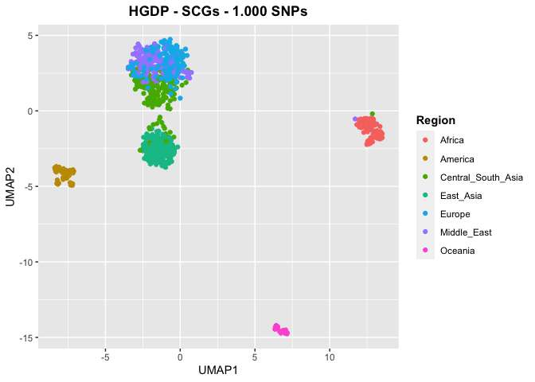
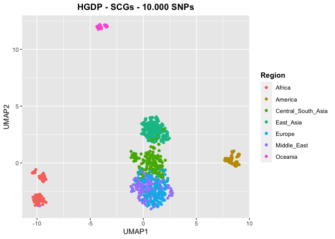

UMAP - HGDP - SNPs - SCGs
================

## Prepare the environment

``` r
library(tidyverse)
```

    ## ── Attaching packages ─────────────────────────────────────── tidyverse 1.3.2 ──
    ## ✔ ggplot2 3.4.0      ✔ purrr   0.3.4 
    ## ✔ tibble  3.1.8      ✔ dplyr   1.0.10
    ## ✔ tidyr   1.2.1      ✔ stringr 1.4.1 
    ## ✔ readr   2.1.2      ✔ forcats 0.5.2 
    ## ── Conflicts ────────────────────────────────────────── tidyverse_conflicts() ──
    ## ✖ dplyr::filter() masks stats::filter()
    ## ✖ dplyr::lag()    masks stats::lag()

``` r
library(ggpubr)
library(umap)
```

## Select samples with no GC-bias

``` r
HGDP <- read_delim("/Volumes/Temp1/rpianezza/0.old/summary-HGDP/HGDP_cutoff_classified.tsv")
```

    ## Rows: 1394352 Columns: 12
    ## ── Column specification ────────────────────────────────────────────────────────
    ## Delimiter: "\t"
    ## chr (9): ID, pop, sex, country, type, familyname, batch, superfamily, shared...
    ## dbl (3): length, reads, copynumber
    ## 
    ## ℹ Use `spec()` to retrieve the full column specification for this data.
    ## ℹ Specify the column types or set `show_col_types = FALSE` to quiet this message.

## Read the SNPs matrixes

The SNPs matrixes are created using the script **frequency_matrix.py**.

``` r
kSNPs <- "/Volumes/Temp1/rpianezza/PCA-SNPs-all-analysis/matrixes/NA/scg-cov15-1000SNPs.matrix.tsv"
k10SNPs <- "/Volumes/Temp1/rpianezza/PCA-SNPs-all-analysis/matrixes/NA/scg-cov15-10000SNPs.matrix.tsv"
k100SNPs <- "/Volumes/Temp1/rpianezza/PCA-SNPs-all-analysis/matrixes/NA/scgs-cov15-100000SNPs.matrix.tsv"
```

## Create the function for UMAP plotting

``` r
UMAP <- function(freq_matrix, metadata, titlee){

matrix <- read_csv(freq_matrix)
metadata <- metadata %>% select(ID, sex, country, pop) %>% distinct()
matrix <- inner_join(metadata, matrix, by="ID")

pca_data <- matrix %>% select_if(~ !all(. == .[1]))
matrix <- as.matrix(pca_data[, -c(1,2,3,4)])

umap_result <- umap(matrix, n_neighbors = 15, min_dist = 0.3)

umap <- umap_result$layout %>% as.data.frame() %>% rename(UMAP1="V1",UMAP2="V2")

plot <- umap %>% ggplot(aes(x = UMAP1, y = UMAP2, color = metadata$country))+
  geom_point()+ labs(x = "UMAP1", y = "UMAP2", title = titlee, color = "Region") + theme(plot.title = element_text(hjust = 0.5, face = "bold"), legend.title = element_text(face = "bold"))
}
```

``` r
(UMAP_1kSNPs <- UMAP(kSNPs, HGDP, "HGDP - SCGs - 1.000 SNPs"))
```

    ## Rows: 828 Columns: 4001
    ## ── Column specification ────────────────────────────────────────────────────────
    ## Delimiter: ","
    ## chr    (1): ID
    ## dbl (4000): chr1:916864-921016_scg_631A, chr1:916864-921016_scg_631T, chr1:9...
    ## 
    ## ℹ Use `spec()` to retrieve the full column specification for this data.
    ## ℹ Specify the column types or set `show_col_types = FALSE` to quiet this message.

<!-- -->

``` r
(UMAP_10kSNPs <- UMAP(k10SNPs, HGDP, "HGDP - SCGs - 10.000 SNPs"))
```

    ## Rows: 828 Columns: 40001
    ## ── Column specification ────────────────────────────────────────────────────────
    ## Delimiter: ","
    ## chr     (1): ID
    ## dbl (40000): chr1:916864-921016_scg_95A, chr1:916864-921016_scg_95T, chr1:91...
    ## 
    ## ℹ Use `spec()` to retrieve the full column specification for this data.
    ## ℹ Specify the column types or set `show_col_types = FALSE` to quiet this message.

<!-- -->

``` r
#(UMAP_100kSNPs <- UMAP(k100SNPs, HGDP, "HGDP - SCGs - 100.000 SNPs"))
```
