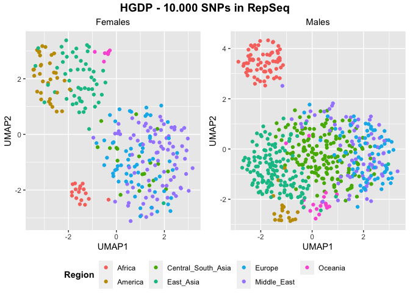
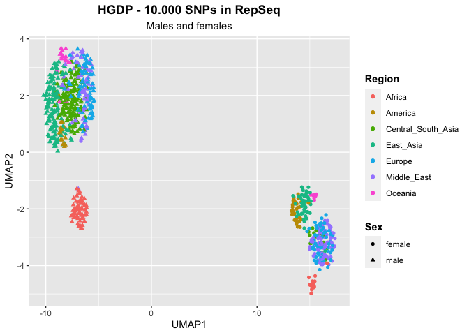
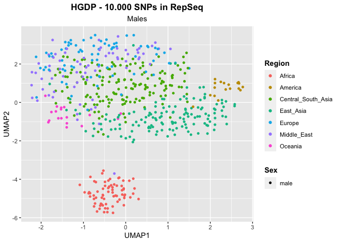
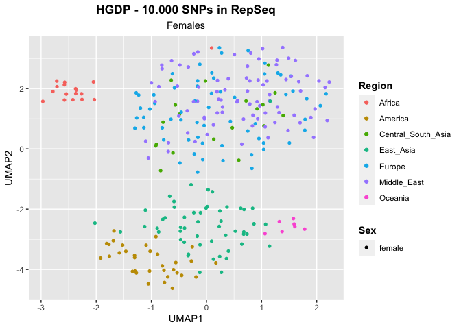

UMAP - SNPs - HGDP - Select variants specific for each sex
================

## Prepare the environment

``` r
library(tidyverse)
```

    ## ── Attaching core tidyverse packages ──────────────────────── tidyverse 2.0.0 ──
    ## ✔ dplyr     1.1.0     ✔ readr     2.1.4
    ## ✔ forcats   1.0.0     ✔ stringr   1.5.0
    ## ✔ ggplot2   3.4.1     ✔ tibble    3.2.0
    ## ✔ lubridate 1.9.2     ✔ tidyr     1.3.0
    ## ✔ purrr     1.0.1     
    ## ── Conflicts ────────────────────────────────────────── tidyverse_conflicts() ──
    ## ✖ dplyr::filter() masks stats::filter()
    ## ✖ dplyr::lag()    masks stats::lag()
    ## ℹ Use the ]8;;http://conflicted.r-lib.org/conflicted package]8;; to force all conflicts to become errors

``` r
library(ggpubr)
library(umap)
```

## Select samples

``` r
HGDP <- read_delim("/Volumes/Temp1/rpianezza/0.old/summary-HGDP/HGDP_cutoff_classified.tsv")
```

    ## Rows: 1394352 Columns: 12
    ## ── Column specification ────────────────────────────────────────────────────────
    ## Delimiter: "\t"
    ## chr (9): ID, pop, sex, country, type, familyname, batch, superfamily, shared...
    ## dbl (3): length, reads, copynumber
    ## 
    ## ℹ Use `spec()` to retrieve the full column specification for this data.
    ## ℹ Specify the column types or set `show_col_types = FALSE` to quiet this message.

``` r
HGDP_f <- HGDP %>% filter(sex=="female")
HGDP_m <- HGDP %>% filter(sex=="male")
```

## Read the SNPs matrixes

The SNPs matrixes are created using the script
**frequency_matrix_v7.py**. This version of the script filters
automatically the non-variable TEs in copynumber.

``` r
females <- "/Volumes/Temp1/rpianezza/PCA-SNPs-all-analysis/matrixes/females/females.10k-SNPs"
males <- "/Volumes/Temp1/rpianezza/PCA-SNPs-all-analysis/matrixes/females/males.10k-SNPs"
together <- "/Volumes/Temp1/rpianezza/PCA-SNPs-all-analysis/matrixes/NA/te-cov15-10000SNPs.matrix.tsv"
```

## Create the function for UMAP plotting

``` r
UMAP_split <- function(freq_matrix, metadata, titlee){

matrix <- read_csv(freq_matrix)
  
f_metadata <- metadata %>% filter(sex=="female") %>% select(ID, sex, country, pop) %>% distinct()
m_metadata <- metadata %>% filter(sex=="male") %>% select(ID, sex, country, pop) %>% distinct()
males_matrix <- inner_join(m_metadata, matrix, by="ID")
females_matrix <- inner_join(f_metadata, matrix, by="ID")

f_pca_data <- females_matrix %>% select_if(~ !all(. == .[1]))
m_pca_data <- males_matrix %>% select_if(~ !all(. == .[1]))
f_matrix <- as.matrix(f_pca_data[, -c(1,2,3)])
m_matrix <- as.matrix(m_pca_data[, -c(1,2,3)])

f_umap_result <- umap(f_matrix, n_neighbors = 15, min_dist = 0.3)
m_umap_result <- umap(m_matrix, n_neighbors = 15, min_dist = 0.3)

f_umap <- f_umap_result$layout %>% as.data.frame() %>% rename(UMAP1="V1",UMAP2="V2")
m_umap <- m_umap_result$layout %>% as.data.frame() %>% rename(UMAP1="V1",UMAP2="V2")

f <- f_umap %>% ggplot(aes(x = UMAP1, y = UMAP2, color = f_metadata$country))+
  geom_point()+ labs(x = "UMAP1", y = "UMAP2", subtitle = "Females", color = "Region") + theme(plot.subtitle = element_text(hjust = 0.5), legend.title = element_text(face = "bold"))

m <- m_umap %>% ggplot(aes(x = UMAP1, y = UMAP2, color = m_metadata$country))+
  geom_point()+ labs(x = "UMAP1", y = "UMAP2", subtitle = "Males", color = "Region") + theme(plot.subtitle = element_text(hjust = 0.5), legend.title = element_text(face = "bold"))

plot <- ggarrange(f, m, ncol = 2, nrow = 1, common.legend = TRUE, legend = "bottom", align = "hv", font.label = list(size = 10, color = "black", face = "bold", family = NULL, position = "top"))
figure <- annotate_figure(plot, top = text_grob(titlee, face = "bold", size = 14))
}
```

``` r
UMAP <- function(freq_matrix, metadata, sex, titlee){

matrix <- read_csv(freq_matrix)
metadata <- metadata %>% select(ID, sex, country, pop) %>% distinct()
matrix <- inner_join(metadata, matrix, by="ID")

pca_data <- matrix %>% select_if(~ !all(. == .[1]))
matrix <- as.matrix(pca_data[, -c(1,2,3,4)])

umap_result <- umap(matrix, n_neighbors = 15, min_dist = 0.3)
umap <- umap_result$layout %>% as.data.frame() %>% rename(UMAP1="V1",UMAP2="V2")

plot <- umap %>% ggplot(aes(x = UMAP1, y = UMAP2, color = metadata$country, shape = metadata$sex))+
  geom_point()+ labs(x = "UMAP1", y = "UMAP2", title = titlee, subtitle = sex, color = "Region", shape = "Sex") + theme(plot.title = element_text(hjust = 0.5, face = "bold"), plot.subtitle = element_text(hjust = 0.5), legend.title = element_text(face = "bold"))
}
```

``` r
(UMAP_all_split <- UMAP_split(together, HGDP, "HGDP - 10.000 SNPs in RepSeq"))
```

    ## Rows: 828 Columns: 40001
    ## ── Column specification ────────────────────────────────────────────────────────
    ## Delimiter: ","
    ## chr     (1): ID
    ## dbl (40000): LTR65_te_116A, LTR65_te_116T, LTR65_te_116C, LTR65_te_116G, LTR...
    ## 
    ## ℹ Use `spec()` to retrieve the full column specification for this data.
    ## ℹ Specify the column types or set `show_col_types = FALSE` to quiet this message.

<!-- -->

``` r
(UMAP_all <- UMAP(together, HGDP, "Males and females", "HGDP - 10.000 SNPs in RepSeq"))
```

    ## Rows: 828 Columns: 40001
    ## ── Column specification ────────────────────────────────────────────────────────
    ## Delimiter: ","
    ## chr     (1): ID
    ## dbl (40000): LTR65_te_116A, LTR65_te_116T, LTR65_te_116C, LTR65_te_116G, LTR...
    ## 
    ## ℹ Use `spec()` to retrieve the full column specification for this data.
    ## ℹ Specify the column types or set `show_col_types = FALSE` to quiet this message.

<!-- -->

``` r
(UMAP_males <- UMAP(males, HGDP_m, "Males", "HGDP - 10.000 SNPs in RepSeq"))
```

    ## Rows: 553 Columns: 40001
    ## ── Column specification ────────────────────────────────────────────────────────
    ## Delimiter: ","
    ## chr     (1): ID
    ## dbl (40000): LTR65_te_116A, LTR65_te_116T, LTR65_te_116C, LTR65_te_116G, LTR...
    ## 
    ## ℹ Use `spec()` to retrieve the full column specification for this data.
    ## ℹ Specify the column types or set `show_col_types = FALSE` to quiet this message.

<!-- -->

``` r
(UMAP_females <- UMAP(females, HGDP_f, "Females", "HGDP - 10.000 SNPs in RepSeq"))
```

    ## Rows: 275 Columns: 40001
    ## ── Column specification ────────────────────────────────────────────────────────
    ## Delimiter: ","
    ## chr     (1): ID
    ## dbl (40000): LTR65_te_116A, LTR65_te_116T, LTR65_te_116C, LTR65_te_116G, LTR...
    ## 
    ## ℹ Use `spec()` to retrieve the full column specification for this data.
    ## ℹ Specify the column types or set `show_col_types = FALSE` to quiet this message.

<!-- -->
