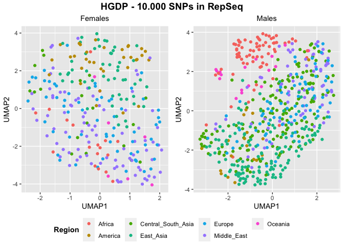
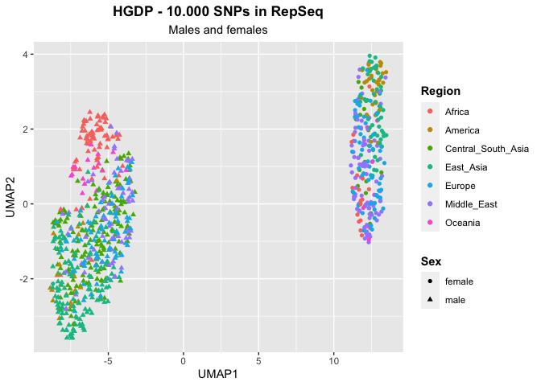
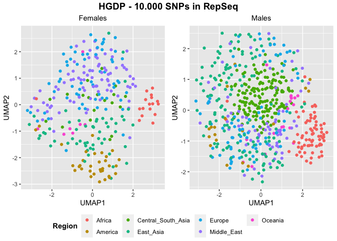
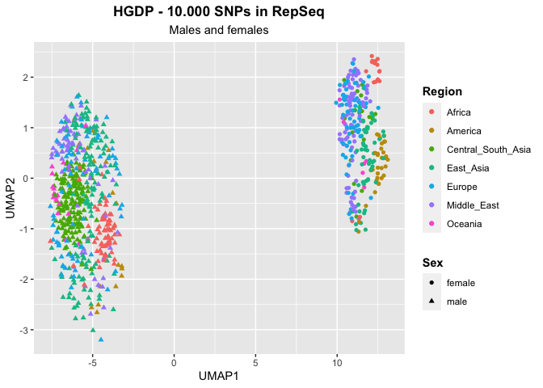
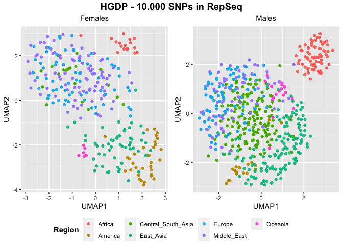
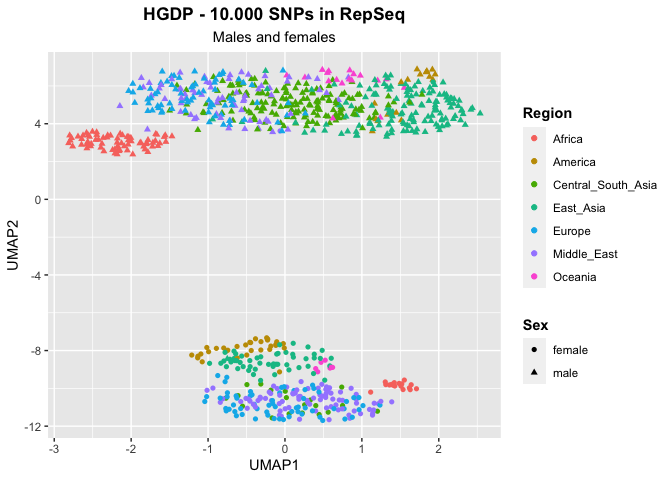

UMAP - SNPs - HGDP - Select variants specific for each copynumber bin
================

## Prepare the environment

``` r
library(tidyverse)
```

    ## ── Attaching core tidyverse packages ──────────────────────── tidyverse 2.0.0 ──
    ## ✔ dplyr     1.1.0     ✔ readr     2.1.4
    ## ✔ forcats   1.0.0     ✔ stringr   1.5.0
    ## ✔ ggplot2   3.4.1     ✔ tibble    3.2.0
    ## ✔ lubridate 1.9.2     ✔ tidyr     1.3.0
    ## ✔ purrr     1.0.1     
    ## ── Conflicts ────────────────────────────────────────── tidyverse_conflicts() ──
    ## ✖ dplyr::filter() masks stats::filter()
    ## ✖ dplyr::lag()    masks stats::lag()
    ## ℹ Use the ]8;;http://conflicted.r-lib.org/conflicted package]8;; to force all conflicts to become errors

``` r
library(ggpubr)
library(umap)
```

## Select samples

``` r
HGDP <- read_delim("/Volumes/Temp1/rpianezza/0.old/summary-HGDP/HGDP_cutoff_classified.tsv")
```

    ## Rows: 1394352 Columns: 12
    ## ── Column specification ────────────────────────────────────────────────────────
    ## Delimiter: "\t"
    ## chr (9): ID, pop, sex, country, type, familyname, batch, superfamily, shared...
    ## dbl (3): length, reads, copynumber
    ## 
    ## ℹ Use `spec()` to retrieve the full column specification for this data.
    ## ℹ Specify the column types or set `show_col_types = FALSE` to quiet this message.

``` r
HGDP_f <- HGDP %>% filter(sex=="female")
HGDP_m <- HGDP %>% filter(sex=="male")

HGDP_pcr_free_samples <- read_tsv("/Volumes/Temp1/rpianezza/investigation/HGDP-no-PCR/HGDP-only-pcr-free-samples.tsv", col_names = "ID")
```

    ## Rows: 676 Columns: 1
    ## ── Column specification ────────────────────────────────────────────────────────
    ## Delimiter: "\t"
    ## chr (1): ID
    ## 
    ## ℹ Use `spec()` to retrieve the full column specification for this data.
    ## ℹ Specify the column types or set `show_col_types = FALSE` to quiet this message.

``` r
HGDP_pcr_free <- HGDP %>% filter(ID %in% HGDP_pcr_free_samples$ID)

a_HGDP <- read_tsv("/Volumes/Temp1/rpianezza/PCA-copynumber-all-analysis/a_HGDP.tsv")
```

    ## Rows: 828 Columns: 2
    ## ── Column specification ────────────────────────────────────────────────────────
    ## Delimiter: "\t"
    ## chr (1): ID
    ## dbl (1): a
    ## 
    ## ℹ Use `spec()` to retrieve the full column specification for this data.
    ## ℹ Specify the column types or set `show_col_types = FALSE` to quiet this message.

``` r
HGDP_nobiased_samples <- filter(a_HGDP, (a > (-0.5)) & (a<0.5)) %>% select(ID) %>% pull()
HGDP_nobiasedID <- filter(HGDP, ID %in% HGDP_nobiased_samples)
(HGDP_clean <- filter(HGDP_pcr_free, ID %in% HGDP_nobiased_samples, type=="te"))
```

    ## # A tibble: 632,075 × 12
    ##    ID      pop   sex   country type  famil…¹ length  reads copyn…² batch super…³
    ##    <chr>   <chr> <chr> <chr>   <chr> <chr>    <dbl>  <dbl>   <dbl> <chr> <chr>  
    ##  1 HGDP00… Brah… male  Centra… te    LTR65      669 1.37e3 6.57e+0 ro    ERV1   
    ##  2 HGDP00… Brah… male  Centra… te    HERVK3I   7242 4.56e4 2.02e+1 ro    ERV2   
    ##  3 HGDP00… Brah… male  Centra… te    HERV9     8399 3.60e5 1.38e+2 ro    ERV1   
    ##  4 HGDP00… Brah… male  Centra… te    L1PA12…   3072 7.44e4 7.77e+1 ro    L1     
    ##  5 HGDP00… Brah… male  Centra… te    LTR27C     767 3.78e3 1.58e+1 ro    ERV1   
    ##  6 HGDP00… Brah… male  Centra… te    LTR16A1    457 4.76e2 3.35e+0 ro    ERV3   
    ##  7 HGDP00… Brah… male  Centra… te    Tigger…    933 1.38e1 4.76e-2 ro    Marine…
    ##  8 HGDP00… Brah… male  Centra… te    LTR23      437 1.03e4 7.54e+1 ro    ERV1   
    ##  9 HGDP00… Brah… male  Centra… te    X32_DNA    336 3.93e1 3.76e-1 ro    Marine…
    ## 10 HGDP00… Brah… male  Centra… te    LTR53      519 1.72e3 1.06e+1 ro    ERV3   
    ## # … with 632,065 more rows, 1 more variable: shared_with <chr>, and abbreviated
    ## #   variable names ¹​familyname, ²​copynumber, ³​superfamily

## Read the SNPs matrixes

The SNPs matrixes are created using the script
**frequency_matrix_v7.py**. This version of the script filters
automatically the non-variable TEs in copynumber.

``` r
bins <- HGDP_clean %>% group_by(familyname) %>% summarise(mean = mean(copynumber)) %>% mutate(class = case_when(
    mean < 10 ~ "low",
    mean > 10 & mean < 100 ~ "mid",
    mean > 100 ~ "high"
  ))

classification <- read_tsv("/Volumes/Temp1/rpianezza/GC-content/repbase_full_classification.txt") %>% select(-class) %>% inner_join(bins, by="familyname") %>% select(-mean)
```

    ## Rows: 1386 Columns: 4
    ## ── Column specification ────────────────────────────────────────────────────────
    ## Delimiter: "\t"
    ## chr (4): familyname, superfamily, shared_with, class
    ## 
    ## ℹ Use `spec()` to retrieve the full column specification for this data.
    ## ℹ Specify the column types or set `show_col_types = FALSE` to quiet this message.

``` r
#write_tsv(classification, "/Volumes/Temp1/rpianezza/PCA-SNPs-all-analysis/matrixes/copynumber-bins/classification_copynumber_bins")
```

``` r
females <- ""
males <- ""
together_high <- "/Volumes/Temp1/rpianezza/PCA-SNPs-all-analysis/matrixes/copynumber-bins/high-10k"
together_mid <- "/Volumes/Temp1/rpianezza/PCA-SNPs-all-analysis/matrixes/copynumber-bins/mid-10k"
together_low <- "/Volumes/Temp1/rpianezza/PCA-SNPs-all-analysis/matrixes/copynumber-bins/low-10k"
```

## Create the function for UMAP plotting

``` r
UMAP_split <- function(freq_matrix, metadata, titlee){

matrix <- read_csv(freq_matrix)
  
f_metadata <- metadata %>% filter(sex=="female") %>% select(ID, sex, country, pop) %>% distinct()
m_metadata <- metadata %>% filter(sex=="male") %>% select(ID, sex, country, pop) %>% distinct()
males_matrix <- inner_join(m_metadata, matrix, by="ID")
females_matrix <- inner_join(f_metadata, matrix, by="ID")

f_pca_data <- females_matrix %>% select_if(~ !all(. == .[1]))
m_pca_data <- males_matrix %>% select_if(~ !all(. == .[1]))
f_matrix <- as.matrix(f_pca_data[, -c(1,2,3)])
m_matrix <- as.matrix(m_pca_data[, -c(1,2,3)])

f_umap_result <- umap(f_matrix, n_neighbors = 15, min_dist = 0.3)
m_umap_result <- umap(m_matrix, n_neighbors = 15, min_dist = 0.3)

f_umap <- f_umap_result$layout %>% as.data.frame() %>% rename(UMAP1="V1",UMAP2="V2")
m_umap <- m_umap_result$layout %>% as.data.frame() %>% rename(UMAP1="V1",UMAP2="V2")

f <- f_umap %>% ggplot(aes(x = UMAP1, y = UMAP2, color = f_metadata$country))+
  geom_point()+ labs(x = "UMAP1", y = "UMAP2", subtitle = "Females", color = "Region") + theme(plot.subtitle = element_text(hjust = 0.5), legend.title = element_text(face = "bold"))

m <- m_umap %>% ggplot(aes(x = UMAP1, y = UMAP2, color = m_metadata$country))+
  geom_point()+ labs(x = "UMAP1", y = "UMAP2", subtitle = "Males", color = "Region") + theme(plot.subtitle = element_text(hjust = 0.5), legend.title = element_text(face = "bold"))

plot <- ggarrange(f, m, ncol = 2, nrow = 1, common.legend = TRUE, legend = "bottom", align = "hv", font.label = list(size = 10, color = "black", face = "bold", family = NULL, position = "top"))
figure <- annotate_figure(plot, top = text_grob(titlee, face = "bold", size = 14))
}
```

``` r
UMAP <- function(freq_matrix, metadata, sex, titlee){

matrix <- read_csv(freq_matrix)
metadata <- metadata %>% select(ID, sex, country, pop) %>% distinct()
matrix <- inner_join(metadata, matrix, by="ID")

pca_data <- matrix %>% select_if(~ !all(. == .[1]))
matrix <- as.matrix(pca_data[, -c(1,2,3,4)])

umap_result <- umap(matrix, n_neighbors = 15, min_dist = 0.3)
umap <- umap_result$layout %>% as.data.frame() %>% rename(UMAP1="V1",UMAP2="V2")

plot <- umap %>% ggplot(aes(x = UMAP1, y = UMAP2, color = metadata$country, shape = metadata$sex))+
  geom_point()+ labs(x = "UMAP1", y = "UMAP2", title = titlee, subtitle = sex, color = "Region", shape = "Sex") + theme(plot.title = element_text(hjust = 0.5, face = "bold"), plot.subtitle = element_text(hjust = 0.5), legend.title = element_text(face = "bold"))
}
```

``` r
(UMAP_high_split <- UMAP_split(together_high, HGDP, "HGDP - 10.000 SNPs in RepSeq"))
```

    ## Rows: 828 Columns: 40001
    ## ── Column specification ────────────────────────────────────────────────────────
    ## Delimiter: ","
    ## chr     (1): ID
    ## dbl (40000): HERV9_te_8A, HERV9_te_8T, HERV9_te_8C, HERV9_te_8G, HERV9_te_12...
    ## 
    ## ℹ Use `spec()` to retrieve the full column specification for this data.
    ## ℹ Specify the column types or set `show_col_types = FALSE` to quiet this message.

<!-- -->

``` r
(UMAP_high <- UMAP(together_high, HGDP, "Males and females", "HGDP - 10.000 SNPs in RepSeq"))
```

    ## Rows: 828 Columns: 40001
    ## ── Column specification ────────────────────────────────────────────────────────
    ## Delimiter: ","
    ## chr     (1): ID
    ## dbl (40000): HERV9_te_8A, HERV9_te_8T, HERV9_te_8C, HERV9_te_8G, HERV9_te_12...
    ## 
    ## ℹ Use `spec()` to retrieve the full column specification for this data.
    ## ℹ Specify the column types or set `show_col_types = FALSE` to quiet this message.

<!-- -->

``` r
(UMAP_mid_split <- UMAP_split(together_mid, HGDP, "HGDP - 10.000 SNPs in RepSeq"))
```

    ## Rows: 828 Columns: 40001
    ## ── Column specification ────────────────────────────────────────────────────────
    ## Delimiter: ","
    ## chr     (1): ID
    ## dbl (40000): HERVK3I_te_7A, HERVK3I_te_7T, HERVK3I_te_7C, HERVK3I_te_7G, HER...
    ## 
    ## ℹ Use `spec()` to retrieve the full column specification for this data.
    ## ℹ Specify the column types or set `show_col_types = FALSE` to quiet this message.

<!-- -->

``` r
(UMAP_mid <- UMAP(together_mid, HGDP, "Males and females", "HGDP - 10.000 SNPs in RepSeq"))
```

    ## Rows: 828 Columns: 40001
    ## ── Column specification ────────────────────────────────────────────────────────
    ## Delimiter: ","
    ## chr     (1): ID
    ## dbl (40000): HERVK3I_te_7A, HERVK3I_te_7T, HERVK3I_te_7C, HERVK3I_te_7G, HER...
    ## 
    ## ℹ Use `spec()` to retrieve the full column specification for this data.
    ## ℹ Specify the column types or set `show_col_types = FALSE` to quiet this message.

<!-- -->

``` r
(UMAP_low_split <- UMAP_split(together_low, HGDP, "HGDP - 10.000 SNPs in RepSeq"))
```

    ## Rows: 828 Columns: 40001
    ## ── Column specification ────────────────────────────────────────────────────────
    ## Delimiter: ","
    ## chr     (1): ID
    ## dbl (40000): LTR65_te_104A, LTR65_te_104T, LTR65_te_104C, LTR65_te_104G, LTR...
    ## 
    ## ℹ Use `spec()` to retrieve the full column specification for this data.
    ## ℹ Specify the column types or set `show_col_types = FALSE` to quiet this message.

<!-- -->

``` r
(UMAP_low <- UMAP(together_low, HGDP, "Males and females", "HGDP - 10.000 SNPs in RepSeq"))
```

    ## Rows: 828 Columns: 40001
    ## ── Column specification ────────────────────────────────────────────────────────
    ## Delimiter: ","
    ## chr     (1): ID
    ## dbl (40000): LTR65_te_104A, LTR65_te_104T, LTR65_te_104C, LTR65_te_104G, LTR...
    ## 
    ## ℹ Use `spec()` to retrieve the full column specification for this data.
    ## ℹ Specify the column types or set `show_col_types = FALSE` to quiet this message.

<!-- -->
