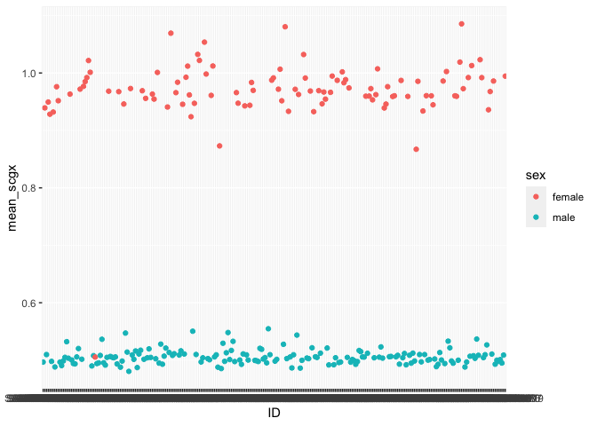
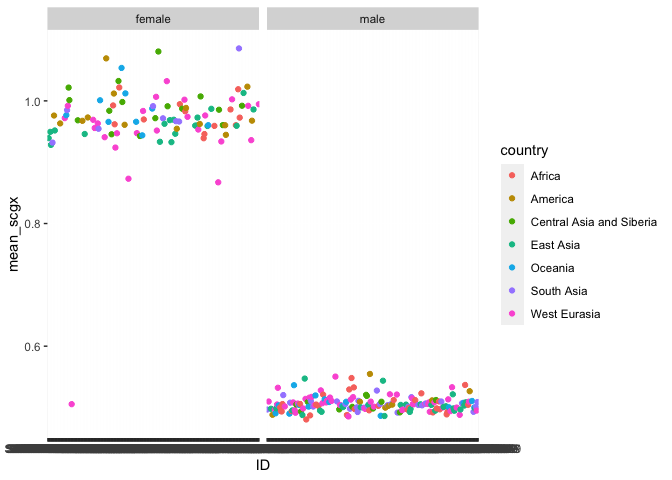

HGDP - Controls
================

Script 5. This scripts contains some controls on the data quality.

``` r
library(tidyverse)
```

    ## ── Attaching packages ─────────────────────────────────────── tidyverse 1.3.2 ──
    ## ✔ ggplot2 3.4.0      ✔ purrr   0.3.4 
    ## ✔ tibble  3.1.8      ✔ dplyr   1.0.10
    ## ✔ tidyr   1.2.1      ✔ stringr 1.4.1 
    ## ✔ readr   2.1.2      ✔ forcats 0.5.2 
    ## ── Conflicts ────────────────────────────────────────── tidyverse_conflicts() ──
    ## ✖ dplyr::filter() masks stats::filter()
    ## ✖ dplyr::lag()    masks stats::lag()

``` r
library(ggpubr)

SGDP <- read_tsv("/Volumes/Temp2/rpianezza/SGDP/summary/USEME_SGDP_cutoff")
```

    ## Rows: 470028 Columns: 10
    ## ── Column specification ────────────────────────────────────────────────────────
    ## Delimiter: "\t"
    ## chr (7): biosample, sex, pop, country, type, familyname, batch
    ## dbl (3): length, reads, copynumber
    ## 
    ## ℹ Use `spec()` to retrieve the full column specification for this data.
    ## ℹ Specify the column types or set `show_col_types = FALSE` to quiet this message.

## Read length

``` r
SGDP_report <- read_tsv('/Volumes/Temp1/rpianezza/SGDP/filereport_read_run_PRJEB9586_tsv.txt') %>% mutate(read_length = base_count/read_count)
```

    ## Rows: 397 Columns: 5
    ## ── Column specification ────────────────────────────────────────────────────────
    ## Delimiter: "\t"
    ## chr (3): run_accession, sample_accession, sample_alias
    ## dbl (2): read_count, base_count
    ## 
    ## ℹ Use `spec()` to retrieve the full column specification for this data.
    ## ℹ Specify the column types or set `show_col_types = FALSE` to quiet this message.

First I wanted to check if the dataset used for my data analysis was
still complete respect to the original one, so I compared the number of
individuals in the two datasets.

The total number of samples in the ENA repository is 279, against the
276 that are present in the IGSR repository.

``` r
length(unique(SGDP_report$sample_accession))
```

    ## [1] 279

``` r
length(unique(SGDP$biosample))
```

    ## [1] 276

Then I checked for the mean of read lenghts among all the samples.
Surprisingly it is not `151`, as I was expecting looking at the dataset,
but a bit lower.

``` r
(mean_rl = mean(SGDP_report$read_length))
```

    ## [1] 200

All the samples have read length 200.

## Are there unmapped reads in the .cram file?

Another important thing to check is if **unmapped reads** are present in
the initial **.cram file**. If this is not the case, many reads with
potentially interesting information would just be lost just because they
do not align on the reference genome.

To check for this, we can use this UNIX command giving the .cram file
path.

    samtools view HGDP00001-Brahui.cram | cut -f 3

In our dataset, the unmapped reads (identified with a `*` instead of the
number of chromosome) are present.

## Check scgx coverage

``` r
scgx <- filter(SGDP, type=="scgx") %>% dplyr::rename(ID=biosample) %>% group_by(ID, sex, country) %>% dplyr::summarise(mean_scgx = mean(copynumber))
```

    ## `summarise()` has grouped output by 'ID', 'sex'. You can override using the
    ## `.groups` argument.

``` r
ggplot(scgx, aes(ID, mean_scgx, color=sex))+
  geom_point()
```

<!-- -->

``` r
ggplot(scgx, aes(ID, mean_scgx, color=country))+
  geom_point() + facet_grid(~ sex)
```

<!-- -->

Few outliers are present in both sexes, but in general the expected
coverage (0.5 for males, 1 for females) is matched.
