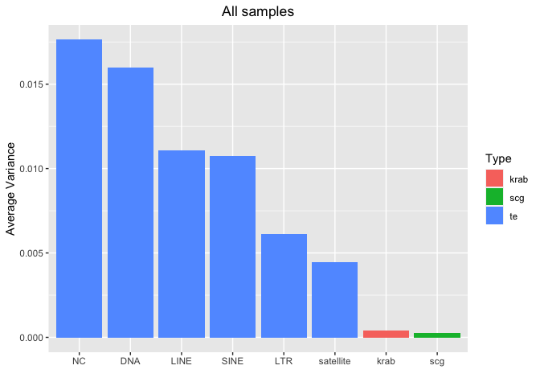
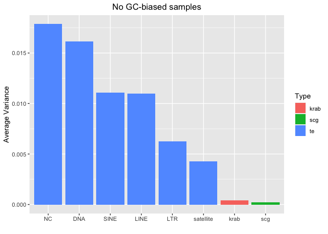
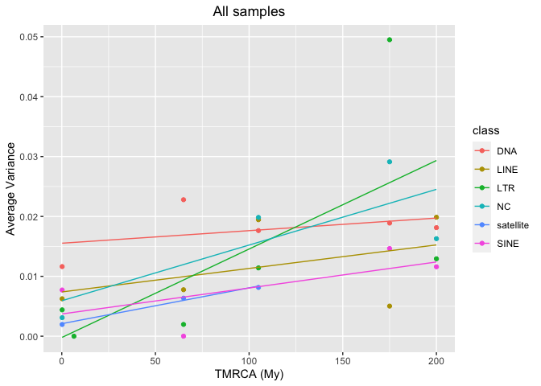
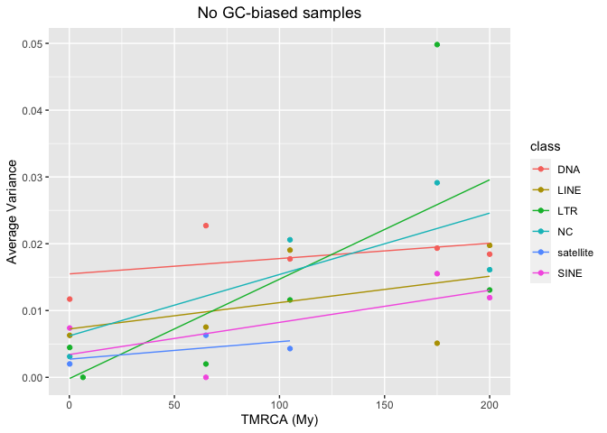

SNPs - Analysis of variance of each sequence
================

## Setting the environment

``` r
library(tidyverse)
```

    ## ── Attaching packages ─────────────────────────────────────── tidyverse 1.3.2 ──
    ## ✔ ggplot2 3.4.0      ✔ purrr   0.3.4 
    ## ✔ tibble  3.1.8      ✔ dplyr   1.0.10
    ## ✔ tidyr   1.2.1      ✔ stringr 1.4.1 
    ## ✔ readr   2.1.2      ✔ forcats 0.5.2 
    ## ── Conflicts ────────────────────────────────────────── tidyverse_conflicts() ──
    ## ✖ dplyr::filter() masks stats::filter()
    ## ✖ dplyr::lag()    masks stats::lag()

# Preparing the files

## Read HGDP summary file

``` r
HGDP <- read_delim("/Volumes/Temp1/rpianezza/0.old/summary-HGDP/HGDP_cutoff_classified.tsv")
```

    ## Rows: 1394352 Columns: 12
    ## ── Column specification ────────────────────────────────────────────────────────
    ## Delimiter: "\t"
    ## chr (9): ID, pop, sex, country, type, familyname, batch, superfamily, shared...
    ## dbl (3): length, reads, copynumber
    ## 
    ## ℹ Use `spec()` to retrieve the full column specification for this data.
    ## ℹ Specify the column types or set `show_col_types = FALSE` to quiet this message.

``` r
HGDP_pcr_free_samples <- read_tsv("/Volumes/Temp1/rpianezza/investigation/HGDP-no-PCR/HGDP-only-pcr-free-samples.tsv", col_names = "ID")
```

    ## Rows: 676 Columns: 1
    ## ── Column specification ────────────────────────────────────────────────────────
    ## Delimiter: "\t"
    ## chr (1): ID
    ## 
    ## ℹ Use `spec()` to retrieve the full column specification for this data.
    ## ℹ Specify the column types or set `show_col_types = FALSE` to quiet this message.

``` r
HGDP_pcr_free <- HGDP %>% filter(ID %in% HGDP_pcr_free_samples$ID)

a_HGDP <- read_tsv("/Volumes/Temp1/rpianezza/PCA-copynumber-all-analysis/a_HGDP.tsv")
```

    ## Rows: 828 Columns: 2
    ## ── Column specification ────────────────────────────────────────────────────────
    ## Delimiter: "\t"
    ## chr (1): ID
    ## dbl (1): a
    ## 
    ## ℹ Use `spec()` to retrieve the full column specification for this data.
    ## ℹ Specify the column types or set `show_col_types = FALSE` to quiet this message.

``` r
HGDP_nobiased_samples <- filter(a_HGDP, (a>(-0.5)) & (a<0.5)) %>% select(ID) %>% pull()
HGDP_final <- filter(HGDP_pcr_free, ID %in% HGDP_nobiased_samples)
```

## Read coordinates file

``` r
coordinates <- read_tsv("/Volumes/Temp1/rpianezza/PCA-copynumber-all-analysis/american-to-east.tsv", col_names = c("pop", "region", "latitude", "longitude")) %>% select(pop, latitude, longitude)
```

    ## Rows: 54 Columns: 4
    ## ── Column specification ────────────────────────────────────────────────────────
    ## Delimiter: "\t"
    ## chr (2): pop, region
    ## dbl (2): latitude, longitude
    ## 
    ## ℹ Use `spec()` to retrieve the full column specification for this data.
    ## ℹ Specify the column types or set `show_col_types = FALSE` to quiet this message.

``` r
data <- inner_join(coordinates, HGDP_final, by = "pop")

distances <- read_tsv("/Volumes/Temp1/rpianezza/PCA-copynumber-all-analysis/dist-from-ooa.tsv", col_names = c("pop", "region", "distance")) %>% select(pop, distance)
```

    ## Rows: 54 Columns: 3
    ## ── Column specification ────────────────────────────────────────────────────────
    ## Delimiter: "\t"
    ## chr (2): pop, region
    ## dbl (1): distance
    ## 
    ## ℹ Use `spec()` to retrieve the full column specification for this data.
    ## ℹ Specify the column types or set `show_col_types = FALSE` to quiet this message.

``` r
data_distance <- inner_join(distances, HGDP_final, by = "pop")
```

## Read the variance matrix

The variance matrix is created starting from the overall matrix (sync
file) containing all the counts of each base for each position of each
sequence in the reference library. The python3 script
*variance_matrix_v1.py* takes as input the overall matrix and gives as
output the matrix read below.

For each row of the matrix it:

- Identify the major allele across all the samples in the matrix
- Calculate the major allele frequency in all the samples
- Calculate the variance of the major allele across all the samples in
  the matrix

The output has 6 columns:

- **familyname** = the sequence name
- **type** = the sequence type (scg, scgx, krab, te)
- **position** = position in the sequence
- **main** = the base of the major allele
- **avg** = the average frequency of the major allele across the samples
- **var** = the variance of the major allele frequency across the
  samples

``` r
(matrix <- read_tsv("/Volumes/Temp1/rpianezza/PCA-SNPs-all-analysis/matrixes/filter_variance/variance_matrix_final"))
```

    ## Rows: 3331470 Columns: 6
    ## ── Column specification ────────────────────────────────────────────────────────
    ## Delimiter: "\t"
    ## chr (3): familyname, type, main
    ## dbl (3): position, avg, var
    ## 
    ## ℹ Use `spec()` to retrieve the full column specification for this data.
    ## ℹ Specify the column types or set `show_col_types = FALSE` to quiet this message.

    ## # A tibble: 3,331,470 × 6
    ##    familyname type  position main    avg    var
    ##    <chr>      <chr>    <dbl> <chr> <dbl>  <dbl>
    ##  1 LTR65      te           1 T     1.00  0     
    ##  2 LTR65      te           2 G     1.00  0     
    ##  3 LTR65      te           3 A     1     0     
    ##  4 LTR65      te           4 G     1.00  0     
    ##  5 LTR65      te           5 A     1.00  0     
    ##  6 LTR65      te           6 A     1     0     
    ##  7 LTR65      te           7 A     1     0     
    ##  8 LTR65      te           8 A     0.621 0.0065
    ##  9 LTR65      te           9 T     1     0     
    ## 10 LTR65      te          10 A     0.994 0.0003
    ## # … with 3,331,460 more rows

``` r
matrix_nogc <- read_tsv("/Volumes/Temp1/rpianezza/variance/matrixes/nogcbias-variance.matrix.tsv")
```

    ## Rows: 3331470 Columns: 6
    ## ── Column specification ────────────────────────────────────────────────────────
    ## Delimiter: "\t"
    ## chr (3): familyname, type, main
    ## dbl (3): position, avg, var
    ## 
    ## ℹ Use `spec()` to retrieve the full column specification for this data.
    ## ℹ Specify the column types or set `show_col_types = FALSE` to quiet this message.

## Analysis of variance

I did the analysis first for all the samples, then subsetting only the
non GC-biased samples to check if the GC-bias has a real impact on the
SNPs calling.

``` r
# All samples

avg_var <- matrix %>% group_by(familyname, type) %>% dplyr::summarise(avg_var=mean(var)) %>% arrange(desc(avg_var))
```

    ## `summarise()` has grouped output by 'familyname'. You can override using the
    ## `.groups` argument.

``` r
(avg_var_type <- avg_var %>% group_by(type) %>% dplyr::summarise(avg_var=mean(avg_var)))
```

    ## # A tibble: 4 × 2
    ##   type   avg_var
    ##   <chr>    <dbl>
    ## 1 krab  0.000406
    ## 2 scg   0.000261
    ## 3 scgx  0.000221
    ## 4 te    0.00974

``` r
# No-GC biased samples

avg_var_nogc <- matrix_nogc %>% group_by(familyname, type) %>% dplyr::summarise(avg_var=mean(var)) %>% arrange(desc(avg_var))
```

    ## `summarise()` has grouped output by 'familyname'. You can override using the
    ## `.groups` argument.

``` r
avg_var_nogc_type <- avg_var_nogc %>% group_by(type) %>% dplyr::summarise(avg_var=mean(avg_var))
```

The average variance of TE is much higher then krab, scg and scgx. This
is expected due to the higher TE copynumber.

``` r
DNA_names <- c("Crypton", "hAT", "Helitron", "Kolobok", "Mariner/Tc1", "Merlin", "MuDR", "piggyBac", "DNA transposon")
LINE_names <- c("L1", "CR1", "L2", "Crack", "RTE", "RTEX", "R4", "Vingi", "Tx1", "Penelope")
SINE_names <- c("SINE1/7SL", "SINE2/tRNA", "SINE3/5S", "SINE")
LTR_names <- c("ERV1", "ERV2", "ERV3", "Gypsy", "Endogenous Retrovirus", "LTR Retrotransposon", "Long terminal repeat", "Non-LTR Retrotransposon")
satellites_names <- c("Satellite", "satellite", "SAT")

classification <- HGDP %>% 
  select(familyname, superfamily, shared_with) %>% 
  mutate(class = case_when(
    superfamily %in% DNA_names ~ "DNA",
    superfamily %in% LINE_names ~ "LINE",
    superfamily %in% SINE_names ~ "SINE",
    superfamily %in% LTR_names ~ "LTR",
    superfamily %in% satellites_names ~ "satellite",
    TRUE ~ "NC"))
type <- c("te", "te", "te", "te", "te", "te", "krab", "scg")

# All samples
(avg_var_class <- avg_var %>% inner_join(classification, by="familyname") %>% group_by(class) %>% mutate(class = case_when(type=="krab" ~ "krab", type %in% c("scg", "scgx") ~ "scg", TRUE ~ class)) %>% dplyr::summarise(avg_var=mean(avg_var)) %>% arrange(desc(avg_var)) %>% mutate(type=type) %>% mutate(class = reorder(class, avg_var, FUN = desc)) %>% ggplot(aes(class, avg_var, fill=type), fill=type) + geom_bar(stat="identity") + labs(x = "", y = "Average Variance", fill = "Type") + ggtitle("All samples") + theme(plot.title = element_text(hjust = 0.5)))
```

<!-- -->

``` r
# No GC-biased samples
(avg_var_nogc_class <- avg_var_nogc %>% inner_join(classification, by="familyname") %>% group_by(class) %>% mutate(class = case_when(type=="krab" ~ "krab", type %in% c("scg", "scgx") ~ "scg", TRUE ~ class)) %>% dplyr::summarise(avg_var=mean(avg_var)) %>% arrange(desc(avg_var)) %>% mutate(type=type) %>% mutate(class = reorder(class, avg_var, FUN = desc)) %>% ggplot(aes(class, avg_var, fill=type), fill=type) + geom_bar(stat="identity") + labs(x = "", y = "Average Variance", fill = "Type") + ggtitle("No GC-biased samples") + theme(plot.title = element_text(hjust = 0.5)))
```

<!-- -->

Among the different families of TE, we see:

- **NC** (non-classified): are very old TE for which was not possible a
  classification. High variance is expected due to long time to mutate.
- **DNA** TE: old and inactive, high variance expected
- **LINE** and **SINE**: the higher copynumber TEs (ALU, ALU variants,
  L1s). Slight difference if not considering GC-biased sample.
- **LTR**: low variance (weird?)
- **satellite**: more impacted by GC-bias, as expected. Prone to errors
  due to PCR polymerase slippage.

``` r
# All samples

avg_var_shared_with <- avg_var %>% filter(type=="te") %>% inner_join(classification, by="familyname") %>% group_by(familyname, shared_with, class) %>% dplyr::summarise(avg_var=mean(avg_var)) %>% arrange(desc(avg_var)) %>% ungroup() %>% 
  mutate(TMRCA = case_when(
    shared_with == "Vertebrata" ~ "550",
    shared_with == "Mammalia" ~ "200",
    shared_with == "Theria" ~ "175",
    shared_with == "Eutheria" ~ "105",
    shared_with == "Primates" ~ "65",
    shared_with == "Hominidae" ~ "6.5",
    shared_with == "Homo sapiens" ~ "0.2",
    )) %>% type_convert() %>% group_by(class, TMRCA) %>% summarise(avg_var=mean(avg_var)) %>% filter(TMRCA<500)
```

    ## `summarise()` has grouped output by 'familyname', 'shared_with'. You can
    ## override using the `.groups` argument.
    ## ── Column specification
    ## ──────────────────────────────────────────────────────── cols( familyname =
    ## col_character(), shared_with = col_character(), class = col_character(), TMRCA
    ## = col_double() )
    ## `summarise()` has grouped output by 'class'. You can override using the
    ## `.groups` argument.

``` r
avg_var_shared_with %>% ggplot(aes(TMRCA, avg_var, color=class)) + geom_point() + geom_smooth(method = "lm", se = FALSE, alpha = 0.5, size = 0.5) + labs(x = "TMRCA (My)", y = "Average Variance", fill = "Class") + ggtitle("All samples") + theme(plot.title = element_text(hjust = 0.5))
```

    ## Warning: Using `size` aesthetic for lines was deprecated in ggplot2 3.4.0.
    ## ℹ Please use `linewidth` instead.

    ## `geom_smooth()` using formula = 'y ~ x'

<!-- -->

``` r
# No GC-biased samples

avg_var_nogc_shared_with <- avg_var_nogc %>% filter(type=="te") %>% inner_join(classification, by="familyname") %>% group_by(familyname, shared_with, class) %>% dplyr::summarise(avg_var=mean(avg_var)) %>% arrange(desc(avg_var)) %>% ungroup() %>% 
  mutate(TMRCA = case_when(
    shared_with == "Vertebrata" ~ "550",
    shared_with == "Mammalia" ~ "200",
    shared_with == "Theria" ~ "175",
    shared_with == "Eutheria" ~ "105",
    shared_with == "Primates" ~ "65",
    shared_with == "Hominidae" ~ "6.5",
    shared_with == "Homo sapiens" ~ "0.2",
    )) %>% type_convert() %>% group_by(class, TMRCA) %>% summarise(avg_var=mean(avg_var)) %>% filter(TMRCA<500)
```

    ## `summarise()` has grouped output by 'familyname', 'shared_with'. You can
    ## override using the `.groups` argument.
    ## ── Column specification
    ## ──────────────────────────────────────────────────────── cols( familyname =
    ## col_character(), shared_with = col_character(), class = col_character(), TMRCA
    ## = col_double() )
    ## `summarise()` has grouped output by 'class'. You can override using the
    ## `.groups` argument.

``` r
avg_var_nogc_shared_with %>% ggplot(aes(TMRCA, avg_var, color=class)) + geom_point() + geom_smooth(method = "lm", se = FALSE, alpha = 0.5, size = 0.5) + labs(x = "TMRCA (My)", y = "Average Variance", fill = "Class") + ggtitle("No GC-biased samples") + theme(plot.title = element_text(hjust = 0.5))
```

    ## `geom_smooth()` using formula = 'y ~ x'

<!-- -->

From RepBase, we know the taxonomic group in which every TE family is
shared. I converted this into TMRCA and looked for a correlation between
the average variance of the sequence across the samples and the TMRCA.
This is expected due to higher time to mutate. Wee see that there is a
positive correlation for all the TE families.

## SCGs variance

``` r
(scg <- matrix %>% filter(type %in% c("scg","scgx")) %>% group_by(familyname) %>% dplyr::summarise(avg_var = mean(var)) %>% arrange(desc(avg_var)))
```

    ## # A tibble: 507 × 2
    ##    familyname                avg_var
    ##    <chr>                       <dbl>
    ##  1 chr16:765731-768798      0.0159  
    ##  2 chr7:55342315-55344958   0.00254 
    ##  3 chr1:960583-965719       0.00247 
    ##  4 chr16:792523-795720      0.00182 
    ##  5 chr6:31114824-31117299   0.00139 
    ##  6 chr16:722624-724635      0.00133 
    ##  7 chr16:89883393-89886130  0.00120 
    ##  8 chr9:137452464-137454492 0.00109 
    ##  9 chr16:88742820-88745464  0.000994
    ## 10 chr19:2338759-2341187    0.000967
    ## # … with 497 more rows

``` r
scg_nogc <- matrix_nogc %>% filter(type %in% c("scg","scgx")) %>% group_by(familyname) %>% dplyr::summarise(avg_var = mean(var)) %>% arrange(desc(avg_var))

(scg_SNPs <- matrix %>% filter(type %in% c("scg","scgx")) %>% arrange(desc(var)))
```

    ## # A tibble: 1,673,584 × 6
    ##    familyname                type  position main    avg   var
    ##    <chr>                     <chr>    <dbl> <chr> <dbl> <dbl>
    ##  1 chr19:17402938-17405630   scg          1 T     0.497 0.250
    ##  2 chr10:133272737-133276856 scg          1 A     0.521 0.250
    ##  3 chr16:765731-768798       scg       1924 G     0.477 0.250
    ##  4 chr16:765731-768798       scg       1983 G     0.476 0.250
    ##  5 chr16:765731-768798       scg       1986 G     0.526 0.250
    ##  6 chr16:765731-768798       scg       1985 G     0.532 0.249
    ##  7 chr16:765731-768798       scg       1990 A     0.508 0.249
    ##  8 chr16:765731-768798       scg       1981 G     0.468 0.249
    ##  9 chr16:765731-768798       scg       1926 G     0.462 0.249
    ## 10 chr16:765731-768798       scg       1993 A     0.488 0.249
    ## # … with 1,673,574 more rows

``` r
(scg_nogc_SNPs <- matrix_nogc %>% filter(type %in% c("scg","scgx")) %>% arrange(desc(var)))
```

    ## # A tibble: 1,673,584 × 6
    ##    familyname                type  position main    avg   var
    ##    <chr>                     <chr>    <dbl> <chr> <dbl> <dbl>
    ##  1 chr16:765731-768798       scg       1983 G     0.501 0.250
    ##  2 chr10:133272737-133276856 scg          2 C     0.508 0.250
    ##  3 chr19:17402938-17405630   scg          1 T     0.484 0.250
    ##  4 chr16:765731-768798       scg       1981 G     0.498 0.25 
    ##  5 chr16:765731-768798       scg       1924 G     0.475 0.250
    ##  6 chr10:133272737-133276856 scg          1 A     0.472 0.250
    ##  7 chr16:765731-768798       scg       1976 G     0.467 0.249
    ##  8 chr16:765731-768798       scg       1978 G     0.465 0.249
    ##  9 chr16:765731-768798       scg       1926 G     0.461 0.249
    ## 10 chr16:765731-768798       scg       1977 G     0.459 0.249
    ## # … with 1,673,574 more rows

How many SNPs are there in every gene? SNPs selected with a var
threshold of 0.1247 \| 0.1219 that comprehend the most variable 1000
SNPs across all samples \| no gc-biased samples.

``` r
(snps <- scg_SNPs %>% filter(var > 0.1247) %>% dplyr::summarise(count = n()))
```

    ## # A tibble: 1 × 1
    ##   count
    ##   <int>
    ## 1   998

``` r
(snps_per_gene <- scg_SNPs %>% filter(var > 0.1247) %>% group_by(familyname) %>% dplyr::summarise(count = n()) %>% arrange(desc(count)))
```

    ## # A tibble: 299 × 2
    ##    familyname                count
    ##    <chr>                     <int>
    ##  1 chr16:765731-768798         185
    ##  2 chr1:960583-965719           49
    ##  3 chr22:19971227-19987093      17
    ##  4 chr12:53962307-53974956      15
    ##  5 chr16:88742820-88745464      15
    ##  6 chr16:722624-724635          14
    ##  7 chr14:105475310-105478776    12
    ##  8 chr10:120899837-120903175    11
    ##  9 chr6:93409653-93419547       11
    ## 10 chr3:49805208-49813953        8
    ## # … with 289 more rows

``` r
(snps_nogc <- scg_nogc_SNPs %>% filter(var > 0.1219) %>% dplyr::summarise(count = n()))
```

    ## # A tibble: 1 × 1
    ##   count
    ##   <int>
    ## 1   998

``` r
(snps_per_gene_nogc <- scg_nogc_SNPs %>% filter(var > 0.1219) %>% group_by(familyname) %>% dplyr::summarise(count = n()) %>% arrange(desc(count)))
```

    ## # A tibble: 290 × 2
    ##    familyname                count
    ##    <chr>                     <int>
    ##  1 chr16:765731-768798         184
    ##  2 chr1:960583-965719           40
    ##  3 chr12:53962307-53974956      15
    ##  4 chr16:88742820-88745464      15
    ##  5 chr16:722624-724635          14
    ##  6 chr22:19971227-19987093      14
    ##  7 chr14:105475310-105478776    12
    ##  8 chr10:120899837-120903175    11
    ##  9 chr6:93409653-93419547       11
    ## 10 chr11:2140500-2148339         9
    ## # … with 280 more rows

``` r
#min var = 0.08 -> 2k SNPs
#min var = 0.02 -> 4k SNPs
```

We note that the gene **chr16:765731-768798** is a big outlier with 185
SNPs within the 1000 most variable SNPs, followed by
**chr1:960583-965719** with 49. In the filtered dataset for GC-bias the
situation is very similar.

Overall, the most variable 1K SNPs are well distributed across 299 SCGs.

### Check heterozigosity and homozigosity

Here we use a custom script (*variance_matrix_scg.py*) to process the
sync file into a matrix containing:

- familyname, type, position
- **average** = the average error for that specific position and
  sequence across all the samples.

The **error** is a measure of the distance between the observed allele
frequency and the expected allele frequency (0.5 or 1). If the **major
allele frequency** (maf) for that specific cell is \>0.75, the position
is considered **homozigotic** for that sample (error = 1-maf).
Otherwise, it’s called as an **heterozygotic** position (abs(0.5-maf)).

The matrix is then ordered in descending order of average error to show
the most problematic **positions**.

``` r
(errors_pos <- read_tsv("/Volumes/Temp1/rpianezza/variance/matrixes/error2.tsv-position.tsv") %>% arrange(desc(average)) %>% separate(familyname, into = c("familyname", "type"), sep = "_"))
```

    ## Rows: 1673584 Columns: 3
    ## ── Column specification ────────────────────────────────────────────────────────
    ## Delimiter: "\t"
    ## chr (1): familyname
    ## dbl (2): position, average
    ## 
    ## ℹ Use `spec()` to retrieve the full column specification for this data.
    ## ℹ Specify the column types or set `show_col_types = FALSE` to quiet this message.

    ## # A tibble: 1,673,584 × 4
    ##    familyname              type  position average
    ##    <chr>                   <chr>    <dbl>   <dbl>
    ##  1 chr8:52938430-52941117  scg       2390   0.209
    ##  2 chr8:24912164-24914717  scg       1953   0.207
    ##  3 chr15:82041777-82046018 scg       3865   0.207
    ##  4 chr8:24912164-24914717  scg       1950   0.206
    ##  5 chr15:52785724-52789396 scg       3099   0.206
    ##  6 chr15:82041777-82046018 scg       2583   0.206
    ##  7 chr8:52938430-52941117  scg       2398   0.205
    ##  8 chr15:52785724-52789396 scg       3131   0.203
    ##  9 chr8:52938430-52941117  scg       2375   0.202
    ## 10 chr1:2629757-2632979    scg        744   0.2  
    ## # … with 1,673,574 more rows

Here we show the average error for each **gene**, considering the
averaged error for each position. Again, we show the most problematic
genes at the top.

``` r
(errors_gene <- errors_pos %>% group_by(familyname) %>% dplyr::summarise(average = mean(average)) %>% arrange(desc(average)))
```

    ## # A tibble: 507 × 2
    ##    familyname               average
    ##    <chr>                      <dbl>
    ##  1 chr16:89905008-89909174  0.00389
    ##  2 chr7:55342315-55344958   0.00238
    ##  3 chr8:52938430-52941117   0.00220
    ##  4 chr1:212624283-212626771 0.00206
    ##  5 chr15:52785724-52789396  0.00191
    ##  6 chr15:82041777-82046018  0.00190
    ##  7 chr9:137299630-137302271 0.00188
    ##  8 chr1:160211286-160213717 0.00174
    ##  9 chrX:70452957-70455826   0.00150
    ## 10 chrX:153907438-153909658 0.00143
    ## # … with 497 more rows

Then I check the average error for the most variable 1000 SNPs
previously identified. The maximum error is 0.05, which is considerably
low (the max value in the dataset is 0.21, the maximum possible is
0.25).

``` r
(problematic_snps_01247 <- scg_SNPs %>% filter(var > 0.1247) %>% inner_join(errors_pos, by=c("familyname", "position", "type")) %>% rename(error=average) %>% arrange(desc(error)))
```

    ## # A tibble: 998 × 7
    ##    familyname               type  position main    avg   var error
    ##    <chr>                    <chr>    <dbl> <chr> <dbl> <dbl> <dbl>
    ##  1 chr1:2629757-2632979     scg        973 T     0.554 0.128 0.051
    ##  2 chr1:2315039-2321323     scg       1266 C     0.486 0.142 0.049
    ##  3 chr19:1248552-1254430    scg       4495 A     0.500 0.145 0.048
    ##  4 chr9:136016290-136019480 scg       1233 A     0.541 0.129 0.047
    ##  5 chr12:6765515-6770875    scg       1480 G     0.491 0.143 0.046
    ##  6 chr11:2140500-2148339    scg       6645 G     0.432 0.137 0.046
    ##  7 chr17:8310240-8312388    scg       1976 C     0.535 0.142 0.044
    ##  8 chr8:54558759-54561907   scg       2228 G     0.523 0.134 0.044
    ##  9 chr7:81967164-81971089   scg        333 T     0.561 0.133 0.044
    ## 10 chr1:85580760-85583950   scg        481 A     0.525 0.131 0.044
    ## # … with 988 more rows

``` r
(problematic_snps_0008 <- scg_SNPs %>% filter(var > 0.008) %>% inner_join(errors_pos, by=c("familyname", "position", "type")) %>% rename(error=average) %>% arrange(desc(error)))
```

    ## # A tibble: 6,012 × 7
    ##    familyname               type  position main    avg    var error
    ##    <chr>                    <chr>    <dbl> <chr> <dbl>  <dbl> <dbl>
    ##  1 chr12:6765515-6770875    scg       4985 G     0.721 0.0082 0.176
    ##  2 chr4:163471094-163473754 scg        963 C     0.730 0.0084 0.175
    ##  3 chr16:89905008-89909174  scg       3771 T     0.772 0.0109 0.174
    ##  4 chr4:163471094-163473754 scg        958 G     0.729 0.0087 0.174
    ##  5 chr4:163471094-163473754 scg        971 C     0.717 0.0089 0.173
    ##  6 chrX:153907438-153909658 scgx       795 G     0.749 0.0089 0.173
    ##  7 chr4:163471094-163473754 scg        961 A     0.723 0.0087 0.173
    ##  8 chr4:163471094-163473754 scg        964 T     0.726 0.0087 0.173
    ##  9 chrX:153907438-153909658 scgx       877 T     0.718 0.0082 0.173
    ## 10 chrX:153907438-153909658 scgx       887 G     0.739 0.009  0.172
    ## # … with 6,002 more rows

``` r
(problematic_snps_0002 <- scg_SNPs %>% filter(var > 0.002) %>% inner_join(errors_pos, by=c("familyname", "position", "type")) %>% rename(error=average) %>% arrange(desc(error)))
```

    ## # A tibble: 11,515 × 7
    ##    familyname                type  position main    avg    var error
    ##    <chr>                     <chr>    <dbl> <chr> <dbl>  <dbl> <dbl>
    ##  1 chr8:52938430-52941117    scg       2390 T     0.729 0.0023 0.209
    ##  2 chr8:24912164-24914717    scg       1953 G     0.769 0.0026 0.207
    ##  3 chr15:82041777-82046018   scg       3865 T     0.773 0.0024 0.207
    ##  4 chr15:82041777-82046018   scg       2583 G     0.756 0.0029 0.206
    ##  5 chr15:52785724-52789396   scg       3099 C     0.729 0.0027 0.206
    ##  6 chr8:24912164-24914717    scg       1950 G     0.771 0.0026 0.206
    ##  7 chr8:52938430-52941117    scg       2398 C     0.780 0.0021 0.205
    ##  8 chr15:52785724-52789396   scg       3131 G     0.763 0.0032 0.203
    ##  9 chr1:2629757-2632979      scg        744 C     0.726 0.0034 0.2  
    ## 10 chr14:105475310-105478776 scg       2392 G     0.73  0.0061 0.199
    ## # … with 11,505 more rows

``` r
(problematic_snps_0001 <- scg_SNPs %>% filter(var > 0.001) %>% inner_join(errors_pos, by=c("familyname", "position", "type")) %>% rename(error=average) %>% arrange(desc(error)))
```

    ## # A tibble: 16,898 × 7
    ##    familyname              type  position main    avg    var error
    ##    <chr>                   <chr>    <dbl> <chr> <dbl>  <dbl> <dbl>
    ##  1 chr8:52938430-52941117  scg       2390 T     0.729 0.0023 0.209
    ##  2 chr8:24912164-24914717  scg       1953 G     0.769 0.0026 0.207
    ##  3 chr15:82041777-82046018 scg       3865 T     0.773 0.0024 0.207
    ##  4 chr15:82041777-82046018 scg       2583 G     0.756 0.0029 0.206
    ##  5 chr15:52785724-52789396 scg       3099 C     0.729 0.0027 0.206
    ##  6 chr8:24912164-24914717  scg       1950 G     0.771 0.0026 0.206
    ##  7 chr8:52938430-52941117  scg       2398 C     0.780 0.0021 0.205
    ##  8 chr15:52785724-52789396 scg       3131 G     0.763 0.0032 0.203
    ##  9 chr8:52938430-52941117  scg       2375 A     0.790 0.0017 0.202
    ## 10 chr1:2629757-2632979    scg        744 C     0.726 0.0034 0.2  
    ## # … with 16,888 more rows

``` r
mean_error0.1247 <- summarise(problematic_snps_01247, average_error = mean(error))
mean_error0.08 <- summarise(problematic_snps_0008, average_error = mean(error))
mean_error0.02 <- summarise(problematic_snps_0002, average_error = mean(error))
mean_error0.01 <- summarise(problematic_snps_0001, average_error = mean(error))

(mean_errors <- bind_rows(mean_error0.1247, mean_error0.08, mean_error0.02, mean_error0.01) %>% mutate(variance = c("0.1247", "0.008", "0.002", "0.001")))
```

    ## # A tibble: 4 × 2
    ##   average_error variance
    ##           <dbl> <chr>   
    ## 1        0.0226 0.1247  
    ## 2        0.0162 0.008   
    ## 3        0.0180 0.002   
    ## 4        0.0133 0.001

The second output file of the script is the one with suffix “-sample”.
It calculates the average error for each single copy gene in each
sample, averaging across all the positions in the gene. The goal is to
identify possible problematic samples or genes.

``` r
(errors_sample <- read_tsv("/Volumes/Temp1/rpianezza/variance/matrixes/error2.tsv-sample") %>% separate(familyname, into = c("familyname", "type"), sep = "_"))
```

    ## Rows: 507 Columns: 829
    ## ── Column specification ────────────────────────────────────────────────────────
    ## Delimiter: "\t"
    ## chr   (1): familyname
    ## dbl (828): HGDP00001, HGDP00003, HGDP00005, HGDP00007, HGDP00009, HGDP00011,...
    ## 
    ## ℹ Use `spec()` to retrieve the full column specification for this data.
    ## ℹ Specify the column types or set `show_col_types = FALSE` to quiet this message.

    ## # A tibble: 507 × 830
    ##    famil…¹ type  HGDP0…² HGDP0…³ HGDP0…⁴ HGDP0…⁵ HGDP0…⁶ HGDP0…⁷ HGDP0…⁸ HGDP0…⁹
    ##    <chr>   <chr>   <dbl>   <dbl>   <dbl>   <dbl>   <dbl>   <dbl>   <dbl>   <dbl>
    ##  1 chr1:9… scg     0.001   0.001   0.001   0       0.001   0.001   0       0.001
    ##  2 chr1:9… scg     0.001   0.001   0.001   0.001   0.001   0.001   0.001   0.001
    ##  3 chr1:1… scg     0.001   0.001   0       0.001   0.001   0.001   0       0.001
    ##  4 chr1:1… scg     0.001   0.001   0.001   0       0.001   0       0.001   0.001
    ##  5 chr1:1… scg     0.001   0       0.001   0       0.001   0       0       0    
    ##  6 chr1:1… scg     0.001   0.001   0.001   0.001   0.001   0.001   0.001   0.001
    ##  7 chr1:1… scg     0.001   0       0       0       0.001   0.001   0       0    
    ##  8 chr1:1… scg     0       0       0.001   0.001   0.001   0       0.001   0    
    ##  9 chr1:2… scg     0.001   0.001   0.001   0.001   0.001   0.001   0.001   0.001
    ## 10 chr1:2… scg     0.001   0.001   0.002   0.001   0.001   0.001   0.001   0.001
    ## # … with 497 more rows, 820 more variables: HGDP00017 <dbl>, HGDP00021 <dbl>,
    ## #   HGDP00023 <dbl>, HGDP00025 <dbl>, HGDP00029 <dbl>, HGDP00031 <dbl>,
    ## #   HGDP00033 <dbl>, HGDP00035 <dbl>, HGDP00037 <dbl>, HGDP00039 <dbl>,
    ## #   HGDP00041 <dbl>, HGDP00043 <dbl>, HGDP00045 <dbl>, HGDP00047 <dbl>,
    ## #   HGDP00049 <dbl>, HGDP00052 <dbl>, HGDP00054 <dbl>, HGDP00056 <dbl>,
    ## #   HGDP00057 <dbl>, HGDP00060 <dbl>, HGDP00062 <dbl>, HGDP00064 <dbl>,
    ## #   HGDP00066 <dbl>, HGDP00068 <dbl>, HGDP00070 <dbl>, HGDP00072 <dbl>, …

First I calculate the average error for each sample across all the
genes.

``` r
errors_each_sample <- errors_sample %>% select(!(type)) %>% summarize_all(mean, na.rm = TRUE) %>% t() %>% as_tibble() %>% slice(-1) %>% rename(average_error=V1)
```

    ## Warning in mean.default(familyname, na.rm = TRUE): argument is not numeric or
    ## logical: returning NA

    ## Warning: The `x` argument of `as_tibble.matrix()` must have unique column names if
    ## `.name_repair` is omitted as of tibble 2.0.0.
    ## ℹ Using compatibility `.name_repair`.

``` r
samples_names <- colnames(errors_sample) %>% as_tibble() %>% slice(-1, -2) %>% rename(sample = value)

(average_error_per_sample <- bind_cols(samples_names, errors_each_sample) %>% mutate(method = if_else(sample %in% HGDP_pcr_free_samples$ID, "pcr-free", "pcr")) %>% arrange(desc(average_error)))
```

    ## # A tibble: 828 × 3
    ##    sample    average_error method  
    ##    <chr>             <dbl> <chr>   
    ##  1 HGDP01097      0.00111  pcr-free
    ##  2 HGDP00545      0.00103  pcr     
    ##  3 HGDP00288      0.00101  pcr     
    ##  4 HGDP00550      0.00101  pcr     
    ##  5 HGDP01201      0.00101  pcr     
    ##  6 HGDP01225      0.00101  pcr     
    ##  7 HGDP01245      0.001    pcr     
    ##  8 HGDP01092      0.000994 pcr-free
    ##  9 HGDP00056      0.000980 pcr     
    ## 10 HGDP00907      0.000978 pcr     
    ## # … with 818 more rows

The I check if the **method** (PCR-free or PCR) have an influence on the
average error.

``` r
(by_method <- average_error_per_sample %>% group_by(method) %>% dplyr::summarise(average_error = mean(average_error)))
```

    ## # A tibble: 2 × 2
    ##   method   average_error
    ##   <chr>            <dbl>
    ## 1 pcr           0.000684
    ## 2 pcr-free      0.000565

I check if the average error per gene calculated from the “-sample” file
is equal to the error per gene calculated from the file “-position”. The
results are very similar but not equal, this is explainable by different
approximation during the calculation processes.

``` r
by_gene_control <- data.frame(rowMeans(errors_sample[-c(1:2)]))
colnames(by_gene_control) <- "average_error"
rownames(by_gene_control) <- errors_sample$familyname

by_gene_control %>% arrange(desc(average_error))
```

    ##                           average_error
    ## chr16:89905008-89909174    0.0039722222
    ## chr7:55342315-55344958     0.0025144928
    ## chr8:52938430-52941117     0.0022161836
    ## chr1:212624283-212626771   0.0021147343
    ## chr15:82041777-82046018    0.0020048309
    ## chr15:52785724-52789396    0.0019987923
    ## chr9:137299630-137302271   0.0019359903
    ## chr1:160211286-160213717   0.0018876812
    ## chrX:70452957-70455826     0.0016920290
    ## chr4:163471094-163473754   0.0016509662
    ## chrX:153907438-153909658   0.0016352657
    ## chr16:2737090-2740804      0.0014541063
    ## chr10:16514466-16521145    0.0014384058
    ## chr11:2268494-2270952      0.0013454106
    ## chr8:24912164-24914717     0.0013442029
    ## chr12:6765515-6770875      0.0013272947
    ## chr16:75566374-75568405    0.0012801932
    ## chr20:20368103-20370949    0.0011956522
    ## chr14:33948232-33951081    0.0011763285
    ## chr5:175440035-175444182   0.0011256039
    ## chr6:35118071-35121045     0.0011062802
    ## chr14:56801809-56805648    0.0011014493
    ## chrX:102153707-102155790   0.0010688406
    ## chr16:30184747-30187083    0.0010434783
    ## chr1:2629757-2632979       0.0010108696
    ## chr6:39883515-39886568     0.0010096618
    ## chr3:186781779-186784179   0.0010084541
    ## chr11:1469456-1473436      0.0010048309
    ## chr14:105475310-105478776  0.0010024155
    ## chr2:219054423-219060921   0.0010012077
    ## chr9:136196251-136201674   0.0010012077
    ## chr1:115836376-115841126   0.0010000000
    ## chr11:1752754-1763927      0.0010000000
    ## chr16:70661666-70665836    0.0010000000
    ## chr14:50792049-50794518    0.0009975845
    ## chr4:110617422-110621734   0.0009963768
    ## chr16:1101259-1105461      0.0009951691
    ## chr19:925780-929498        0.0009951691
    ## chr19:6372793-6375250      0.0009951691
    ## chr2:176188667-176190907   0.0009939614
    ## chr1:1399519-1402019       0.0009927536
    ## chr12:89347234-89352501    0.0009903382
    ## chr22:50263712-50270380    0.0009891304
    ## chr6:31114824-31117299     0.0009830918
    ## chr3:88051943-88059048     0.0009818841
    ## chr20:63374420-63378401    0.0009818841
    ## chr8:142638595-142640648   0.0009794686
    ## chr19:17402938-17405630    0.0009782609
    ## chr1:110058339-110062555   0.0009746377
    ## chr15:71547279-71549832    0.0009698068
    ## chr2:199468097-199472756   0.0009649758
    ## chr9:137230756-137236554   0.0009613527
    ## chr19:1248552-1254430      0.0009613527
    ## chr14:89417353-89419793    0.0009601449
    ## chr3:52433034-52445103     0.0009553140
    ## chr4:48490251-48494389     0.0009492754
    ## chr10:133272737-133276856  0.0009468599
    ## chr10:8050475-8052495      0.0009396135
    ## chr8:143575599-143577915   0.0009287440
    ## chr12:57526642-57530143    0.0009275362
    ## chr6:154089761-154091938   0.0009251208
    ## chr8:48428142-48431041     0.0009106280
    ## chr7:151058199-151061960   0.0009070048
    ## chr14:105141754-105147358  0.0009070048
    ## chr7:100881763-100884239   0.0009033816
    ## chr16:792523-795720        0.0009021739
    ## chr1:151800263-151806154   0.0009009662
    ## chr19:14472465-14475354    0.0009009662
    ## chr19:50723363-50725708    0.0008985507
    ## chr19:1985437-1988569      0.0008973430
    ## chr17:8310240-8312388      0.0008961353
    ## chr19:7920337-7923250      0.0008876812
    ## chr17:41665565-41668031    0.0008792271
    ## chr11:2140500-2148339      0.0008743961
    ## chr16:89883393-89886130    0.0008743961
    ## chr17:4533031-4537798      0.0008743961
    ## chr14:103123460-103126575  0.0008635266
    ## chr16:88742820-88745464    0.0008599034
    ## chr17:48602137-48606394    0.0008599034
    ## chr7:897944-901399         0.0008562802
    ## chr8:73295515-73297740     0.0008538647
    ## chr9:136662931-136668673   0.0008526570
    ## chr7:151128595-151131286   0.0008514493
    ## chr18:50282342-50287636    0.0008502415
    ## chr1:2315039-2321323       0.0008490338
    ## chr11:46380755-46383799    0.0008466184
    ## chr8:144049078-144051203   0.0008285024
    ## chr10:100746263-100749916  0.0008260870
    ## chr16:84194933-84197052    0.0008260870
    ## chr19:54461731-54463778    0.0008164251
    ## chr17:49968969-49973191    0.0008128019
    ## chr1:960583-965719         0.0008091787
    ## chr19:405444-409147        0.0008091787
    ## chr8:124555812-124557995   0.0008067633
    ## chr14:57066259-57068542    0.0008055556
    ## chr17:7219843-7225265      0.0007958937
    ## chr9:136016290-136019480   0.0007934783
    ## chr17:2059838-2062257      0.0007934783
    ## chr1:3772760-3775908       0.0007886473
    ## chr18:55863959-55866550    0.0007801932
    ## chr16:765731-768798        0.0007777778
    ## chr6:31658328-31660721     0.0007729469
    ## chr17:82239022-82248980    0.0007693237
    ## chr7:227553-229557         0.0007560386
    ## chr22:50625017-50628170    0.0007524155
    ## chr13:99973525-99980034    0.0007500000
    ## chr12:49791145-49797002    0.0007487923
    ## chr14:24505352-24508265    0.0007487923
    ## chr5:2752130-2755081       0.0007475845
    ## chr14:103529195-103537073  0.0007427536
    ## chr18:78976554-78978843    0.0007415459
    ## chr11:13009315-13012119    0.0007379227
    ## chr2:44929976-44935359     0.0007342995
    ## chr6:160990317-160992342   0.0007342995
    ## chr9:25676388-25678440     0.0007330918
    ## chr5:177133024-177135426   0.0007318841
    ## chr10:102394109-102396298  0.0007318841
    ## chr2:14632699-14637227     0.0007306763
    ## chr12:51888008-51891354    0.0007306763
    ## chr12:53962307-53974956    0.0007258454
    ## chr19:2338759-2341187      0.0007246377
    ## chr16:84179121-84181418    0.0007173913
    ## chr9:136739523-136741988   0.0007161836
    ## chr16:86530177-86533800    0.0007149758
    ## chr17:7355122-7357218      0.0007149758
    ## chr19:35755638-35758079    0.0007113527
    ## chr6:111699934-111702986   0.0007101449
    ## chr10:117239599-117241923  0.0007101449
    ## chr1:197902629-197907362   0.0007089372
    ## chr8:22106873-22109419     0.0007065217
    ## chr1:109483478-109492704   0.0007016908
    ## chr1:156668762-156677407   0.0007004831
    ## chr16:19858970-19862340    0.0006980676
    ## chr19:54189937-54192355    0.0006944444
    ## chr14:24426544-24429668    0.0006920290
    ## chr14:81143155-81145988    0.0006871981
    ## chr22:19971227-19987093    0.0006871981
    ## chr3:194685882-194689037   0.0006859903
    ## chr16:1524773-1527024      0.0006859903
    ## chr9:79572711-79575029     0.0006823671
    ## chr17:38671702-38674957    0.0006799517
    ## chr10:128047618-128049635  0.0006787440
    ## chr22:50738195-50740359    0.0006739130
    ## chr20:2835313-2838366      0.0006727053
    ## chr4:8224595-8227469       0.0006714976
    ## chr19:10566459-10568979    0.0006702899
    ## chr2:64453968-64456465     0.0006666667
    ## chr16:54924858-54929149    0.0006666667
    ## chr1:916864-921016         0.0006630435
    ## chr19:43532963-43535252    0.0006630435
    ## chr20:3043621-3045747      0.0006630435
    ## chr19:40216057-40218399    0.0006606280
    ## chr1:43451157-43453452     0.0006582126
    ## chr9:137452464-137454492   0.0006570048
    ## chr1:31789129-31791322     0.0006545894
    ## chr2:172084739-172086854   0.0006533816
    ## chr8:54558759-54561907     0.0006533816
    ## chr2:74513462-74515661     0.0006473430
    ## chr7:100429374-100431482   0.0006437198
    ## chr6:11514191-11516466     0.0006413043
    ## chr14:105210077-105213428  0.0006413043
    ## chr1:1203507-1206571       0.0006400966
    ## chr10:4650189-4654023      0.0006388889
    ## chr16:88863332-88866618    0.0006388889
    ## chr3:52836218-52840607     0.0006376812
    ## chr1:26169515-26171821     0.0006364734
    ## chr11:69009416-69013246    0.0006364734
    ## chr15:62842123-62844581    0.0006352657
    ## chr17:81693674-81695930    0.0006352657
    ## chr19:32675847-32678300    0.0006316425
    ## chr11:65354750-65357613    0.0006304348
    ## chr6:117262242-117264817   0.0006292271
    ## chr14:51967002-51969800    0.0006292271
    ## chr3:50273118-50277165     0.0006268116
    ## chr10:101034691-101037167  0.0006256039
    ## chr6:168217031-168220262   0.0006231884
    ## chr9:135500714-135503594   0.0006231884
    ## chr1:182086550-182090112   0.0006195652
    ## chr8:22545559-22548837     0.0006195652
    ## chr8:144112468-144116383   0.0006195652
    ## chr3:14144636-14148423     0.0006183575
    ## chr6:70252165-70254611     0.0006183575
    ## chr8:8701936-8704096       0.0006171498
    ## chr7:101162515-101165114   0.0006159420
    ## chr3:143119770-143124014   0.0006135266
    ## chr1:248810445-248814173   0.0006099034
    ## chr17:48528525-48531011    0.0006074879
    ## chr17:7558291-7561292      0.0006062802
    ## chr4:93828752-93830966     0.0006050725
    ## chr13:78596128-78599619    0.0006050725
    ## chr16:77190962-77193606    0.0006014493
    ## chr17:39921040-39927601    0.0006014493
    ## chr3:124677339-124679749   0.0006002415
    ## chr6:108168762-108176626   0.0005990338
    ## chr1:153775312-153780156   0.0005917874
    ## chr16:367395-369803        0.0005917874
    ## chr6:43506968-43510686     0.0005905797
    ## chr12:132623752-132625951  0.0005905797
    ## chr3:128075809-128079056   0.0005893720
    ## chr16:722624-724635        0.0005893720
    ## chr5:93600356-93603598     0.0005869565
    ## chr5:1931057-1933985       0.0005845411
    ## chr6:77461752-77463773     0.0005845411
    ## chr6:147387663-147390465   0.0005845411
    ## chr2:27136847-27139410     0.0005833333
    ## chr12:114408753-114412831  0.0005833333
    ## chr1:205657850-205662668   0.0005821256
    ## chr13:113820548-113823194  0.0005821256
    ## chr11:250783-252983        0.0005809179
    ## chr20:62214959-62220278    0.0005809179
    ## chr9:34979687-34982544     0.0005772947
    ## chr13:51004252-51007860    0.0005772947
    ## chr17:76136332-76141245    0.0005748792
    ## chr1:151837818-151840557   0.0005688406
    ## chr14:104708290-104711664  0.0005688406
    ## chr1:1324755-1327994       0.0005676329
    ## chr1:172138396-172144840   0.0005664251
    ## chr16:63057217-63059908    0.0005664251
    ## chr5:177301197-177303719   0.0005652174
    ## chr7:116525011-116527018   0.0005652174
    ## chr9:134992957-134995854   0.0005628019
    ## chr1:228100725-228103441   0.0005603865
    ## chr4:30718804-30721970     0.0005591787
    ## chr15:41848370-41850572    0.0005591787
    ## chr20:63696651-63698684    0.0005579710
    ## chr19:35788873-35792674    0.0005531401
    ## chr6:82364243-82367417     0.0005507246
    ## chr11:5514392-5516699      0.0005483092
    ## chr1:161225938-161230744   0.0005471014
    ## chr6:35292322-35294552     0.0005458937
    ## chr11:65422773-65426457    0.0005434783
    ## chr6:34246448-34248985     0.0005422705
    ## chr6:93409653-93419547     0.0005410628
    ## chrX:100291646-100296300   0.0005410628
    ## chr10:124981410-124983496  0.0005410628
    ## chr16:1790475-1793732      0.0005410628
    ## chr14:28772784-28778560    0.0005350242
    ## chr16:68346120-68348433    0.0005338164
    ## chr15:100915656-100918841  0.0005326087
    ## chr11:67612650-67615198    0.0005301932
    ## chr10:120899837-120903175  0.0005241546
    ## chr17:8797109-8799365      0.0005241546
    ## chr1:45010949-45015504     0.0005193237
    ## chr11:829296-831985        0.0005193237
    ## chr17:7014752-7017506      0.0005193237
    ## chr8:486116-488512         0.0005169082
    ## chr9:92974499-92976707     0.0005169082
    ## chr11:134150118-134154049  0.0005169082
    ## chr14:90697332-90699374    0.0005144928
    ## chr8:56441391-56445648     0.0005132850
    ## chr1:150558253-150560937   0.0005108696
    ## chr12:53981508-53984324    0.0005108696
    ## chr16:715236-717247        0.0005108696
    ## chr16:62972-65037          0.0005096618
    ## chr11:6606293-6612216      0.0005084541
    ## chr8:1676536-1678763       0.0005072464
    ## chr10:98423879-98426103    0.0005072464
    ## chr12:57234902-57237338    0.0005072464
    ## chr7:150716605-150719516   0.0005036232
    ## chr16:89113174-89115279    0.0005036232
    ## chr17:29614755-29618117    0.0005012077
    ## chr20:33672033-33674388    0.0005000000
    ## chr2:219181677-219183800   0.0004987923
    ## chr14:24117333-24119402    0.0004987923
    ## chr11:65497687-65506431    0.0004975845
    ## chr1:3064071-3067769       0.0004963768
    ## chr6:708591-711405         0.0004963768
    ## chr7:7738638-7741120       0.0004951691
    ## chr11:61508748-61511018    0.0004951691
    ## chr1:156292686-156295689   0.0004927536
    ## chr10:31603149-31605867    0.0004903382
    ## chr3:52296656-52298914     0.0004891304
    ## chr7:70694872-70699490     0.0004891304
    ## chr2:232876520-232878708   0.0004879227
    ## chr15:89320819-89323437    0.0004879227
    ## chr9:136370933-136373644   0.0004867150
    ## chr2:74526644-74529760     0.0004830918
    ## chr10:31806290-31808551    0.0004830918
    ## chr15:41892792-41895935    0.0004806763
    ## chr1:45620043-45624001     0.0004782609
    ## chr6:163189417-163191802   0.0004782609
    ## chr8:22130470-22133384     0.0004782609
    ## chr4:2930560-2933947       0.0004746377
    ## chr5:141636949-141641063   0.0004734300
    ## chr9:127786073-127788412   0.0004734300
    ## chr7:129424726-129427220   0.0004722222
    ## chr10:79347499-79350035    0.0004722222
    ## chr11:10305072-10307395    0.0004685990
    ## chr15:40250663-40252910    0.0004685990
    ## chr15:96342952-96345651    0.0004673913
    ## chr7:149004198-149006283   0.0004637681
    ## chr11:17719570-17722136    0.0004637681
    ## chr10:92689954-92692483    0.0004625604
    ## chr14:20556093-20558657    0.0004625604
    ## chr15:25861780-25865172    0.0004625604
    ## chr10:86968431-86970530    0.0004613527
    ## chr19:38384266-38388034    0.0004613527
    ## chr6:165660068-165662554   0.0004577295
    ## chr6:1098828-1101381       0.0004565217
    ## chr5:1264247-1266524       0.0004541063
    ## chr8:27774668-27776707     0.0004528986
    ## chr9:76704847-76710661     0.0004516908
    ## chr1:202986556-202988582   0.0004504831
    ## chr8:101686546-101689093   0.0004492754
    ## chr18:59899947-59904306    0.0004492754
    ## chr14:64741595-64744342    0.0004480676
    ## chr14:23377251-23379487    0.0004468599
    ## chr10:133528078-133532164  0.0004444444
    ## chr9:126516416-126518808   0.0004432367
    ## chr7:81961893-81964282     0.0004420290
    ## chr15:75206443-75209595    0.0004420290
    ## chr16:567004-569495        0.0004420290
    ## chr3:49790731-49792931     0.0004396135
    ## chr1:205810298-205813748   0.0004371981
    ## chr13:73800073-73802203    0.0004359903
    ## chr20:38724485-38729372    0.0004359903
    ## chr6:33200444-33202692     0.0004347826
    ## chr7:2523592-2526871       0.0004347826
    ## chr19:33386949-33389120    0.0004335749
    ## chr1:90719575-90725458     0.0004275362
    ## chr3:49674013-49677025     0.0004263285
    ## chr4:2904663-2907813       0.0004263285
    ## chr7:31847863-31850902     0.0004251208
    ## chr13:35787857-35793479    0.0004251208
    ## chr15:80440293-80442751    0.0004251208
    ## chr12:50103981-50106387    0.0004239130
    ## chr12:53986131-53989993    0.0004239130
    ## chr15:96783434-96785606    0.0004239130
    ## chr17:39660195-39662896    0.0004239130
    ## chr10:22252071-22254589    0.0004227053
    ## chr11:65919273-65921401    0.0004227053
    ## chr1:159951491-159953492   0.0004214976
    ## chr15:40471085-40473128    0.0004166667
    ## chr15:65076815-65079939    0.0004166667
    ## chr16:2071784-2074212      0.0004166667
    ## chr1:1598011-1600135       0.0004154589
    ## chr8:48818292-48824062     0.0004154589
    ## chr8:144141213-144143664   0.0004154589
    ## chrX:75782986-75785254     0.0004130435
    ## chr1:1331279-1335314       0.0004118357
    ## chr6:30688046-30690353     0.0004106280
    ## chr19:19651139-19653936    0.0004094203
    ## chr11:6680384-6683340      0.0004070048
    ## chr4:76894151-76898144     0.0004045894
    ## chr9:14719723-14722733     0.0004033816
    ## chr10:11316832-11319884    0.0004033816
    ## chr11:116789366-116791895  0.0004033816
    ## chr13:106491146-106495130  0.0004033816
    ## chr1:156243414-156248076   0.0004021739
    ## chr14:36311572-36314313    0.0003973430
    ## chr10:127734561-127736996  0.0003961353
    ## chr5:38466162-38468339     0.0003949275
    ## chr9:4662293-4665262       0.0003949275
    ## chr9:35749290-35754142     0.0003949275
    ## chr15:72166678-72169143    0.0003949275
    ## chr1:15873501-15876711     0.0003937198
    ## chr6:100462602-100464889   0.0003937198
    ## chr9:104275297-104277399   0.0003937198
    ## chr17:18260596-18263546    0.0003937198
    ## chr1:1434860-1437459       0.0003925121
    ## chr10:59236526-59238768    0.0003925121
    ## chr4:70334980-70337116     0.0003900966
    ## chr7:81967164-81971089     0.0003900966
    ## chr10:32345111-32347121    0.0003900966
    ## chr1:109504177-109509727   0.0003876812
    ## chr11:119334526-119337309  0.0003876812
    ## chr10:628637-631255        0.0003840580
    ## chr22:46067355-46069891    0.0003840580
    ## chr19:19561706-19563824    0.0003816425
    ## chr6:89562389-89566971     0.0003804348
    ## chr7:23165874-23168102     0.0003804348
    ## chr22:30285116-30287390    0.0003804348
    ## chr15:92900320-92902402    0.0003792271
    ## chr11:2400487-2403878      0.0003768116
    ## chr7:26369309-26371764     0.0003756039
    ## chr7:44058929-44061397     0.0003756039
    ## chr7:129458241-129460548   0.0003743961
    ## chr14:24180363-24183272    0.0003731884
    ## chr10:116670033-116672635  0.0003683575
    ## chr1:10449718-10451902     0.0003671498
    ## chr17:75491376-75493769    0.0003671498
    ## chr15:42164784-42166875    0.0003659420
    ## chr7:22139756-22145266     0.0003647343
    ## chr10:101226194-101229794  0.0003635266
    ## chr2:7671329-7675736       0.0003623188
    ## chr22:20206396-20208524    0.0003623188
    ## chr1:234212605-234215088   0.0003611111
    ## chr4:155903692-155905794   0.0003586957
    ## chr7:27100353-27102683     0.0003586957
    ## chr10:53808521-53810664    0.0003586957
    ## chr1:85580760-85583950     0.0003574879
    ## chr6:56458238-56462068     0.0003574879
    ## chr7:95409506-95411684     0.0003574879
    ## chr5:95620086-95622142     0.0003562802
    ## chr11:105137713-105139769  0.0003550725
    ## chr8:80638533-80640695     0.0003538647
    ## chr9:95456406-95459955     0.0003514493
    ## chr8:22138250-22141540     0.0003502415
    ## chr22:29327679-29332321    0.0003502415
    ## chr14:24205727-24208203    0.0003466184
    ## chr6:24126230-24129312     0.0003442029
    ## chr11:35618459-35620865    0.0003442029
    ## chrX:71533127-71536657     0.0003429952
    ## chr14:50982864-50986452    0.0003405797
    ## chr14:74834897-74837309    0.0003405797
    ## chr11:72239076-72241192    0.0003393720
    ## chr8:143379336-143382779   0.0003369565
    ## chr2:74529774-74533247     0.0003357488
    ## chr11:85683847-85686195    0.0003345411
    ## chr9:6328374-6330670       0.0003333333
    ## chr10:98418151-98420369    0.0003321256
    ## chr5:65661715-65664764     0.0003309179
    ## chr3:51391284-51397908     0.0003297101
    ## chr14:105468108-105470207  0.0003297101
    ## chr5:73444826-73446988     0.0003285024
    ## chrX:53082992-53085839     0.0003285024
    ## chr12:111899262-111901391  0.0003260870
    ## chr22:20999103-21001742    0.0003260870
    ## chr13:33348606-33350624    0.0003248792
    ## chr15:74131080-74133096    0.0003248792
    ## chr8:28767911-28771064     0.0003236715
    ## chr9:133357047-133360024   0.0003200483
    ## chr2:101825318-101829754   0.0003188406
    ## chr1:145992434-145996579   0.0003176329
    ## chr14:85623689-85626228    0.0003176329
    ## chr5:141318489-141320784   0.0003164251
    ## chr13:110903474-110906095  0.0003164251
    ## chr16:50776200-50778294    0.0003164251
    ## chr17:4937129-4940046      0.0003164251
    ## chr6:52186374-52190638     0.0003152174
    ## chr12:57230274-57232534    0.0003152174
    ## chr3:47010823-47013465     0.0003128019
    ## chr14:74823977-74829289    0.0003103865
    ## chr15:40872213-40874234    0.0003103865
    ## chr17:38325529-38328503    0.0003091787
    ## chr7:80673375-80676404     0.0003067633
    ## chr11:66421003-66423504    0.0003067633
    ## chr3:49805208-49813953     0.0003007246
    ## chr6:30553359-30556088     0.0002995169
    ## chr9:23826490-23828877     0.0002983092
    ## chr15:49423236-49425515    0.0002983092
    ## chr15:58747344-58749719    0.0002971014
    ## chr6:142133089-142135151   0.0002946860
    ## chr15:72161481-72163789    0.0002922705
    ## chr17:52985512-52987582    0.0002922705
    ## chr13:50125815-50128463    0.0002910628
    ## chr7:24663473-24666046     0.0002898551
    ## chr1:33466248-33468954     0.0002886473
    ## chr5:146513102-146516190   0.0002886473
    ## chr7:94664734-94669180     0.0002874396
    ## chrX:153872151-153876027   0.0002874396
    ## chr7:122059373-122061692   0.0002862319
    ## chr7:26372143-26376272     0.0002850242
    ## chrX:49071596-49073835     0.0002826087
    ## chr13:41689432-41696119    0.0002814010
    ## chr3:49020458-49023287     0.0002765700
    ## chr17:81904325-81911175    0.0002753623
    ## chr1:232804891-232808407   0.0002741546
    ## chr12:76344473-76348415    0.0002741546
    ## chr2:178578789-178580906   0.0002729469
    ## chr14:33597056-33600989    0.0002729469
    ## chr8:108778973-108787594   0.0002717391
    ## chr5:33936385-33938918     0.0002705314
    ## chr14:101561350-101563452  0.0002705314
    ## chr3:52245758-52250599     0.0002693237
    ## chr14:105381923-105391598  0.0002681159
    ## chr4:171812253-171815579   0.0002669082
    ## chr10:73760109-73763555    0.0002657005
    ## chr10:102065389-102068038  0.0002657005
    ## chr12:57762333-57767078    0.0002657005
    ## chr15:74040189-74043332    0.0002657005
    ## chr3:87990695-87993835     0.0002644928
    ## chrX:70041479-70043583     0.0002644928
    ## chr9:136940434-136942668   0.0002632850
    ## chr9:128945529-128947619   0.0002584541
    ## chr1:146017467-146021734   0.0002572464
    ## chr7:42909621-42911910     0.0002548309
    ## chr22:46255662-46263343    0.0002536232
    ## chr10:100987794-100989884  0.0002524155
    ## chrX:119693567-119696059   0.0002512077
    ## chr3:50354749-50359521     0.0002487923
    ## chr16:19113931-19116455    0.0002487923
    ## chr3:49130964-49133056     0.0002463768
    ## chrX:153804878-153808139   0.0002439614
    ## chrX:47722330-47725932     0.0002330918
    ## chr16:68021273-68023442    0.0002318841
    ## chr8:64574305-64577263     0.0002294686
    ## chr3:49716828-49719684     0.0002282609
    ## chrX:47179314-47181543     0.0002282609
    ## chr6:126719559-126721778   0.0002222222
    ## chrX:48458692-48460854     0.0002222222
    ## chr6:127450045-127454242   0.0002198068
    ## chr6:169702189-169704856   0.0002173913
    ## chr1:198752354-198754457   0.0002137681
    ## chr7:122011207-122013312   0.0002125604
    ## chr11:66590175-66593063    0.0002125604
    ## chrX:48476202-48479070     0.0001992754
    ## chrX:49177136-49179283     0.0001920290
    ## chr2:223596939-223602361   0.0001835749
    ## chrX:108732481-108736409   0.0001823671
    ## chr13:56051033-56054397    0.0001823671
    ## chrX:91434594-91437000     0.0001666667
    ## chrX:32342630-32348510     0.0001630435
    ## chrX:18924163-18926480     0.0001485507
    ## chrX:147912122-147914451   0.0001485507
    ## chrX:119588342-119591309   0.0001461353
    ## chrX:107066644-107069277   0.0001376812

``` r
errors_gene
```

    ## # A tibble: 507 × 2
    ##    familyname               average
    ##    <chr>                      <dbl>
    ##  1 chr16:89905008-89909174  0.00389
    ##  2 chr7:55342315-55344958   0.00238
    ##  3 chr8:52938430-52941117   0.00220
    ##  4 chr1:212624283-212626771 0.00206
    ##  5 chr15:52785724-52789396  0.00191
    ##  6 chr15:82041777-82046018  0.00190
    ##  7 chr9:137299630-137302271 0.00188
    ##  8 chr1:160211286-160213717 0.00174
    ##  9 chrX:70452957-70455826   0.00150
    ## 10 chrX:153907438-153909658 0.00143
    ## # … with 497 more rows
