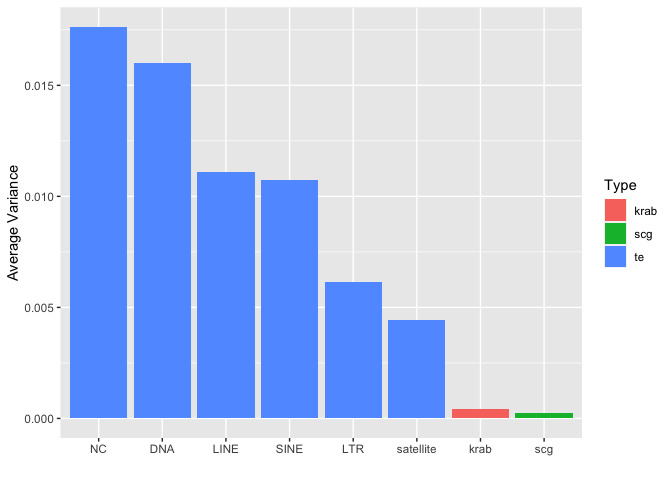
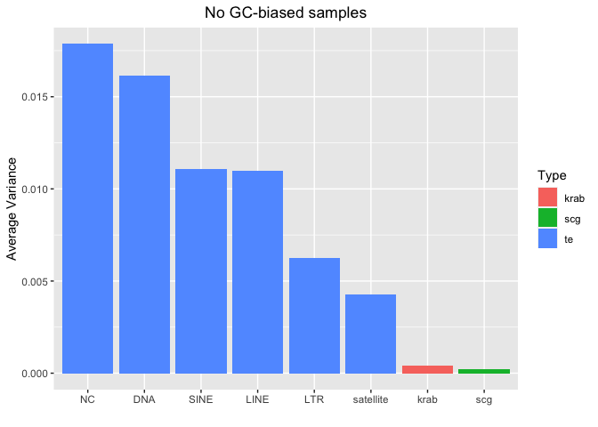
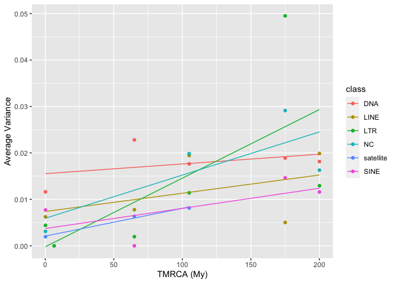
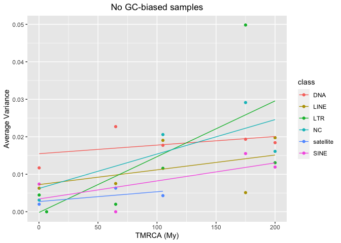

SNPs - Analysis of variance of each sequence
================

## Setting the environment

``` r
library(tidyverse)
```

    ## ── Attaching packages ─────────────────────────────────────── tidyverse 1.3.2 ──
    ## ✔ ggplot2 3.4.0      ✔ purrr   0.3.4 
    ## ✔ tibble  3.1.8      ✔ dplyr   1.0.10
    ## ✔ tidyr   1.2.1      ✔ stringr 1.4.1 
    ## ✔ readr   2.1.2      ✔ forcats 0.5.2 
    ## ── Conflicts ────────────────────────────────────────── tidyverse_conflicts() ──
    ## ✖ dplyr::filter() masks stats::filter()
    ## ✖ dplyr::lag()    masks stats::lag()

# Preparing the files

## Read HGDP summary file

``` r
HGDP <- read_delim("/Volumes/Temp1/rpianezza/0.old/summary-HGDP/HGDP_cutoff_classified.tsv")
```

    ## Rows: 1394352 Columns: 12
    ## ── Column specification ────────────────────────────────────────────────────────
    ## Delimiter: "\t"
    ## chr (9): ID, pop, sex, country, type, familyname, batch, superfamily, shared...
    ## dbl (3): length, reads, copynumber
    ## 
    ## ℹ Use `spec()` to retrieve the full column specification for this data.
    ## ℹ Specify the column types or set `show_col_types = FALSE` to quiet this message.

``` r
HGDP_pcr_free_samples <- read_tsv("/Volumes/Temp1/rpianezza/investigation/HGDP-no-PCR/HGDP-only-pcr-free-samples.tsv", col_names = "ID")
```

    ## Rows: 676 Columns: 1
    ## ── Column specification ────────────────────────────────────────────────────────
    ## Delimiter: "\t"
    ## chr (1): ID
    ## 
    ## ℹ Use `spec()` to retrieve the full column specification for this data.
    ## ℹ Specify the column types or set `show_col_types = FALSE` to quiet this message.

``` r
HGDP_pcr_free <- HGDP %>% filter(ID %in% HGDP_pcr_free_samples$ID)

a_HGDP <- read_tsv("/Volumes/Temp1/rpianezza/PCA-copynumber-all-analysis/a_HGDP.tsv")
```

    ## Rows: 828 Columns: 2
    ## ── Column specification ────────────────────────────────────────────────────────
    ## Delimiter: "\t"
    ## chr (1): ID
    ## dbl (1): a
    ## 
    ## ℹ Use `spec()` to retrieve the full column specification for this data.
    ## ℹ Specify the column types or set `show_col_types = FALSE` to quiet this message.

``` r
HGDP_nobiased_samples <- filter(a_HGDP, (a>(-0.5)) & (a<0.5)) %>% select(ID) %>% pull()
HGDP_final <- filter(HGDP_pcr_free, ID %in% HGDP_nobiased_samples)
```

## Read coordinates file

``` r
coordinates <- read_tsv("/Volumes/Temp1/rpianezza/PCA-copynumber-all-analysis/american-to-east.tsv", col_names = c("pop", "region", "latitude", "longitude")) %>% select(pop, latitude, longitude)
```

    ## Rows: 54 Columns: 4
    ## ── Column specification ────────────────────────────────────────────────────────
    ## Delimiter: "\t"
    ## chr (2): pop, region
    ## dbl (2): latitude, longitude
    ## 
    ## ℹ Use `spec()` to retrieve the full column specification for this data.
    ## ℹ Specify the column types or set `show_col_types = FALSE` to quiet this message.

``` r
data <- inner_join(coordinates, HGDP_final, by = "pop")

distances <- read_tsv("/Volumes/Temp1/rpianezza/PCA-copynumber-all-analysis/dist-from-ooa.tsv", col_names = c("pop", "region", "distance")) %>% select(pop, distance)
```

    ## Rows: 54 Columns: 3
    ## ── Column specification ────────────────────────────────────────────────────────
    ## Delimiter: "\t"
    ## chr (2): pop, region
    ## dbl (1): distance
    ## 
    ## ℹ Use `spec()` to retrieve the full column specification for this data.
    ## ℹ Specify the column types or set `show_col_types = FALSE` to quiet this message.

``` r
data_distance <- inner_join(distances, HGDP_final, by = "pop")
```

## Read the variance matrix

The variance matrix is created starting from the overall matrix (sync
file) containing all the counts of each base for each position of each
sequence in the reference library. The python3 script
*variance_matrix_v1.py* takes as input the overall matrix and gives as
output the matrix read below.

For each row of the matrix it:

- Identify the major allele across all the samples in the matrix
- Calculate the major allele frequency in all the samples
- Calculate the variance of the major allele across all the samples in
  the matrix

The output has 6 columns:

- **familyname** = the sequence name
- **type** = the sequence type (scg, scgx, krab, te)
- **position** = position in the sequence
- **main** = the base of the major allele
- **avg** = the average frequency of the major allele across the samples
- **var** = the variance of the major allele frequency across the
  samples

``` r
(matrix <- read_tsv("/Volumes/Temp1/rpianezza/PCA-SNPs-all-analysis/matrixes/filter_variance/variance_matrix_final"))
```

    ## Rows: 3331470 Columns: 6
    ## ── Column specification ────────────────────────────────────────────────────────
    ## Delimiter: "\t"
    ## chr (3): familyname, type, main
    ## dbl (3): position, avg, var
    ## 
    ## ℹ Use `spec()` to retrieve the full column specification for this data.
    ## ℹ Specify the column types or set `show_col_types = FALSE` to quiet this message.

    ## # A tibble: 3,331,470 × 6
    ##    familyname type  position main    avg    var
    ##    <chr>      <chr>    <dbl> <chr> <dbl>  <dbl>
    ##  1 LTR65      te           1 T     1.00  0     
    ##  2 LTR65      te           2 G     1.00  0     
    ##  3 LTR65      te           3 A     1     0     
    ##  4 LTR65      te           4 G     1.00  0     
    ##  5 LTR65      te           5 A     1.00  0     
    ##  6 LTR65      te           6 A     1     0     
    ##  7 LTR65      te           7 A     1     0     
    ##  8 LTR65      te           8 A     0.621 0.0065
    ##  9 LTR65      te           9 T     1     0     
    ## 10 LTR65      te          10 A     0.994 0.0003
    ## # … with 3,331,460 more rows

``` r
matrix_nogc <- read_tsv("/Volumes/Temp1/rpianezza/variance/matrixes/nogcbias-variance.matrix.tsv")
```

    ## Rows: 3331470 Columns: 6
    ## ── Column specification ────────────────────────────────────────────────────────
    ## Delimiter: "\t"
    ## chr (3): familyname, type, main
    ## dbl (3): position, avg, var
    ## 
    ## ℹ Use `spec()` to retrieve the full column specification for this data.
    ## ℹ Specify the column types or set `show_col_types = FALSE` to quiet this message.

## Analysis of variance

I did the analysis first for all the samples, then subsetting only the
non GC-biased samples to check if the GC-bias has a real impact on the
SNPs calling.

``` r
# All samples

avg_var <- matrix %>% group_by(familyname, type) %>% dplyr::summarise(avg_var=mean(var)) %>% arrange(desc(avg_var))
```

    ## `summarise()` has grouped output by 'familyname'. You can override using the
    ## `.groups` argument.

``` r
(avg_var_type <- avg_var %>% group_by(type) %>% dplyr::summarise(avg_var=mean(avg_var)))
```

    ## # A tibble: 4 × 2
    ##   type   avg_var
    ##   <chr>    <dbl>
    ## 1 krab  0.000406
    ## 2 scg   0.000261
    ## 3 scgx  0.000221
    ## 4 te    0.00974

``` r
# No-GC biased samples

avg_var_nogc <- matrix_nogc %>% group_by(familyname, type) %>% dplyr::summarise(avg_var=mean(var)) %>% arrange(desc(avg_var))
```

    ## `summarise()` has grouped output by 'familyname'. You can override using the
    ## `.groups` argument.

``` r
avg_var_nogc_type <- avg_var_nogc %>% group_by(type) %>% dplyr::summarise(avg_var=mean(avg_var))
```

The average variance of TE is much higher then krab, scg and scgx. This
is expected due to the higher TE copynumber.

``` r
DNA_names <- c("Crypton", "hAT", "Helitron", "Kolobok", "Mariner/Tc1", "Merlin", "MuDR", "piggyBac", "DNA transposon")
LINE_names <- c("L1", "CR1", "L2", "Crack", "RTE", "RTEX", "R4", "Vingi", "Tx1", "Penelope")
SINE_names <- c("SINE1/7SL", "SINE2/tRNA", "SINE3/5S", "SINE")
LTR_names <- c("ERV1", "ERV2", "ERV3", "Gypsy", "Endogenous Retrovirus", "LTR Retrotransposon", "Long terminal repeat", "Non-LTR Retrotransposon")
satellites_names <- c("Satellite", "satellite", "SAT")

classification <- HGDP %>% 
  select(familyname, superfamily, shared_with) %>% 
  mutate(class = case_when(
    superfamily %in% DNA_names ~ "DNA",
    superfamily %in% LINE_names ~ "LINE",
    superfamily %in% SINE_names ~ "SINE",
    superfamily %in% LTR_names ~ "LTR",
    superfamily %in% satellites_names ~ "satellite",
    TRUE ~ "NC"))
type <- c("te", "te", "te", "te", "te", "te", "krab", "scg")

# All samples
(avg_var_class <- avg_var %>% inner_join(classification, by="familyname") %>% group_by(class) %>% mutate(class = case_when(type=="krab" ~ "krab", type %in% c("scg", "scgx") ~ "scg", TRUE ~ class)) %>% dplyr::summarise(avg_var=mean(avg_var)) %>% arrange(desc(avg_var)) %>% mutate(type=type) %>% mutate(class = reorder(class, avg_var, FUN = desc)) %>% ggplot(aes(class, avg_var, fill=type), fill=type) + geom_bar(stat="identity") + labs(x = "", y = "Average Variance", fill = "Type") + ggtitle("All samples") + theme(plot.title = element_text(hjust = 0.5)))
```

<!-- -->

``` r
# No GC-biased samples
(avg_var_nogc_class <- avg_var_nogc %>% inner_join(classification, by="familyname") %>% group_by(class) %>% mutate(class = case_when(type=="krab" ~ "krab", type %in% c("scg", "scgx") ~ "scg", TRUE ~ class)) %>% dplyr::summarise(avg_var=mean(avg_var)) %>% arrange(desc(avg_var)) %>% mutate(type=type) %>% mutate(class = reorder(class, avg_var, FUN = desc)) %>% ggplot(aes(class, avg_var, fill=type), fill=type) + geom_bar(stat="identity") + labs(x = "", y = "Average Variance", fill = "Type") + ggtitle("No GC-biased samples") + theme(plot.title = element_text(hjust = 0.5)))
```

<!-- -->

Among the different families of TE, we see:

- **NC** (non-classified): are very old TE for which was not possible a
  classification. High variance is expected due to long time to mutate.
- **DNA** TE: old and inactive, high variance expected
- **LINE** and **SINE**: the higher copynumber TEs (ALU, ALU variants,
  L1s). Slight difference if not considering GC-biased sample.
- **LTR**: low variance (weird?)
- **satellite**: more impacted by GC-bias, as expected. Prone to errors
  due to PCR polymerase slippage.

``` r
# All samples

avg_var_shared_with <- avg_var %>% filter(type=="te") %>% inner_join(classification, by="familyname") %>% group_by(familyname, shared_with, class) %>% dplyr::summarise(avg_var=mean(avg_var)) %>% arrange(desc(avg_var)) %>% ungroup() %>% 
  mutate(TMRCA = case_when(
    shared_with == "Vertebrata" ~ "550",
    shared_with == "Mammalia" ~ "200",
    shared_with == "Theria" ~ "175",
    shared_with == "Eutheria" ~ "105",
    shared_with == "Primates" ~ "65",
    shared_with == "Hominidae" ~ "6.5",
    shared_with == "Homo sapiens" ~ "0.2",
    )) %>% type_convert() %>% group_by(class, TMRCA) %>% summarise(avg_var=mean(avg_var)) %>% filter(TMRCA<500)
```

    ## `summarise()` has grouped output by 'familyname', 'shared_with'. You can
    ## override using the `.groups` argument.
    ## ── Column specification
    ## ──────────────────────────────────────────────────────── cols( familyname =
    ## col_character(), shared_with = col_character(), class = col_character(), TMRCA
    ## = col_double() )
    ## `summarise()` has grouped output by 'class'. You can override using the
    ## `.groups` argument.

``` r
avg_var_shared_with %>% ggplot(aes(TMRCA, avg_var, color=class)) + geom_point() + geom_smooth(method = "lm", se = FALSE, alpha = 0.5, size = 0.5) + labs(x = "TMRCA (My)", y = "Average Variance", fill = "Class") + ggtitle("All samples") + theme(plot.title = element_text(hjust = 0.5))
```

    ## Warning: Using `size` aesthetic for lines was deprecated in ggplot2 3.4.0.
    ## ℹ Please use `linewidth` instead.

    ## `geom_smooth()` using formula = 'y ~ x'

<!-- -->

``` r
# No GC-biased samples

avg_var_nogc_shared_with <- avg_var_nogc %>% filter(type=="te") %>% inner_join(classification, by="familyname") %>% group_by(familyname, shared_with, class) %>% dplyr::summarise(avg_var=mean(avg_var)) %>% arrange(desc(avg_var)) %>% ungroup() %>% 
  mutate(TMRCA = case_when(
    shared_with == "Vertebrata" ~ "550",
    shared_with == "Mammalia" ~ "200",
    shared_with == "Theria" ~ "175",
    shared_with == "Eutheria" ~ "105",
    shared_with == "Primates" ~ "65",
    shared_with == "Hominidae" ~ "6.5",
    shared_with == "Homo sapiens" ~ "0.2",
    )) %>% type_convert() %>% group_by(class, TMRCA) %>% summarise(avg_var=mean(avg_var)) %>% filter(TMRCA<500)
```

    ## `summarise()` has grouped output by 'familyname', 'shared_with'. You can
    ## override using the `.groups` argument.
    ## ── Column specification
    ## ──────────────────────────────────────────────────────── cols( familyname =
    ## col_character(), shared_with = col_character(), class = col_character(), TMRCA
    ## = col_double() )
    ## `summarise()` has grouped output by 'class'. You can override using the
    ## `.groups` argument.

``` r
avg_var_nogc_shared_with %>% ggplot(aes(TMRCA, avg_var, color=class)) + geom_point() + geom_smooth(method = "lm", se = FALSE, alpha = 0.5, size = 0.5) + labs(x = "TMRCA (My)", y = "Average Variance", fill = "Class") + ggtitle("No GC-biased samples") + theme(plot.title = element_text(hjust = 0.5))
```

    ## `geom_smooth()` using formula = 'y ~ x'

<!-- -->

From RepBase, we know the taxonomic group in which every TE family is
shared. I converted this into TMRCA and looked for a correlation between
the average variance of the sequence across the samples and the TMRCA.
This is expected due to higher time to mutate. Wee see that there is a
positive correlation for all the TE families.

## SCGs variance

``` r
(scg <- matrix %>% filter(type %in% c("scg","scgx")) %>% group_by(familyname) %>% dplyr::summarise(avg_var = mean(var)) %>% arrange(desc(avg_var)))
```

    ## # A tibble: 507 × 2
    ##    familyname                avg_var
    ##    <chr>                       <dbl>
    ##  1 chr16:765731-768798      0.0159  
    ##  2 chr7:55342315-55344958   0.00254 
    ##  3 chr1:960583-965719       0.00247 
    ##  4 chr16:792523-795720      0.00182 
    ##  5 chr6:31114824-31117299   0.00139 
    ##  6 chr16:722624-724635      0.00133 
    ##  7 chr16:89883393-89886130  0.00120 
    ##  8 chr9:137452464-137454492 0.00109 
    ##  9 chr16:88742820-88745464  0.000994
    ## 10 chr19:2338759-2341187    0.000967
    ## # … with 497 more rows

``` r
scg_nogc <- matrix_nogc %>% filter(type %in% c("scg","scgx")) %>% group_by(familyname) %>% dplyr::summarise(avg_var = mean(var)) %>% arrange(desc(avg_var))

(scg_SNPs <- matrix %>% filter(type %in% c("scg","scgx")) %>% arrange(desc(var)))
```

    ## # A tibble: 1,673,584 × 6
    ##    familyname                type  position main    avg   var
    ##    <chr>                     <chr>    <dbl> <chr> <dbl> <dbl>
    ##  1 chr19:17402938-17405630   scg          1 T     0.497 0.250
    ##  2 chr10:133272737-133276856 scg          1 A     0.521 0.250
    ##  3 chr16:765731-768798       scg       1924 G     0.477 0.250
    ##  4 chr16:765731-768798       scg       1983 G     0.476 0.250
    ##  5 chr16:765731-768798       scg       1986 G     0.526 0.250
    ##  6 chr16:765731-768798       scg       1985 G     0.532 0.249
    ##  7 chr16:765731-768798       scg       1990 A     0.508 0.249
    ##  8 chr16:765731-768798       scg       1981 G     0.468 0.249
    ##  9 chr16:765731-768798       scg       1926 G     0.462 0.249
    ## 10 chr16:765731-768798       scg       1993 A     0.488 0.249
    ## # … with 1,673,574 more rows

``` r
(scg_nogc_SNPs <- matrix_nogc %>% filter(type %in% c("scg","scgx")) %>% arrange(desc(var)))
```

    ## # A tibble: 1,673,584 × 6
    ##    familyname                type  position main    avg   var
    ##    <chr>                     <chr>    <dbl> <chr> <dbl> <dbl>
    ##  1 chr16:765731-768798       scg       1983 G     0.501 0.250
    ##  2 chr10:133272737-133276856 scg          2 C     0.508 0.250
    ##  3 chr19:17402938-17405630   scg          1 T     0.484 0.250
    ##  4 chr16:765731-768798       scg       1981 G     0.498 0.25 
    ##  5 chr16:765731-768798       scg       1924 G     0.475 0.250
    ##  6 chr10:133272737-133276856 scg          1 A     0.472 0.250
    ##  7 chr16:765731-768798       scg       1976 G     0.467 0.249
    ##  8 chr16:765731-768798       scg       1978 G     0.465 0.249
    ##  9 chr16:765731-768798       scg       1926 G     0.461 0.249
    ## 10 chr16:765731-768798       scg       1977 G     0.459 0.249
    ## # … with 1,673,574 more rows

How many SNPs are there in every gene? SNPs selected with a var
threshold of 0.1247 \| 0.1219 that comprehend the most variable 1000
SNPs across all samples \| no gc-biased samples.

``` r
(snps <- scg_SNPs %>% filter(var > 0.1247) %>% dplyr::summarise(count = n()))
```

    ## # A tibble: 1 × 1
    ##   count
    ##   <int>
    ## 1   998

``` r
(snps_per_gene <- scg_SNPs %>% filter(var > 0.1247) %>% group_by(familyname) %>% dplyr::summarise(count = n()) %>% arrange(desc(count)))
```

    ## # A tibble: 299 × 2
    ##    familyname                count
    ##    <chr>                     <int>
    ##  1 chr16:765731-768798         185
    ##  2 chr1:960583-965719           49
    ##  3 chr22:19971227-19987093      17
    ##  4 chr12:53962307-53974956      15
    ##  5 chr16:88742820-88745464      15
    ##  6 chr16:722624-724635          14
    ##  7 chr14:105475310-105478776    12
    ##  8 chr10:120899837-120903175    11
    ##  9 chr6:93409653-93419547       11
    ## 10 chr3:49805208-49813953        8
    ## # … with 289 more rows

``` r
(snps_nogc <- scg_nogc_SNPs %>% filter(var > 0.1219) %>% dplyr::summarise(count = n()))
```

    ## # A tibble: 1 × 1
    ##   count
    ##   <int>
    ## 1   998

``` r
(snps_per_gene_nogc <- scg_nogc_SNPs %>% filter(var > 0.1219) %>% group_by(familyname) %>% dplyr::summarise(count = n()) %>% arrange(desc(count)))
```

    ## # A tibble: 290 × 2
    ##    familyname                count
    ##    <chr>                     <int>
    ##  1 chr16:765731-768798         184
    ##  2 chr1:960583-965719           40
    ##  3 chr12:53962307-53974956      15
    ##  4 chr16:88742820-88745464      15
    ##  5 chr16:722624-724635          14
    ##  6 chr22:19971227-19987093      14
    ##  7 chr14:105475310-105478776    12
    ##  8 chr10:120899837-120903175    11
    ##  9 chr6:93409653-93419547       11
    ## 10 chr11:2140500-2148339         9
    ## # … with 280 more rows

min var = 0.08 -\> 2k SNPs min var = 0.02 -\> 4k SNPs
