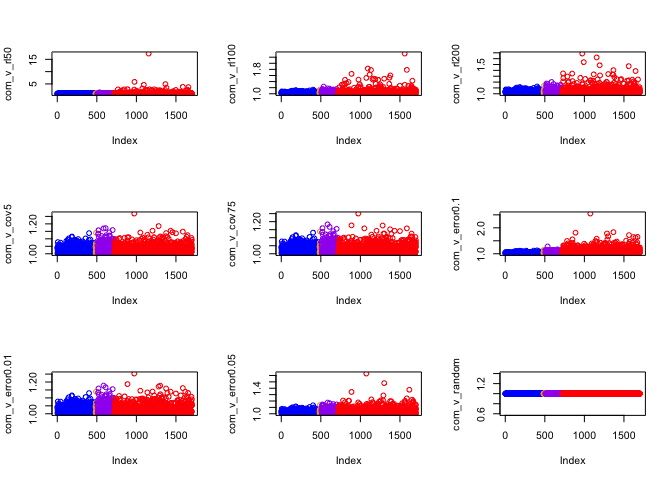
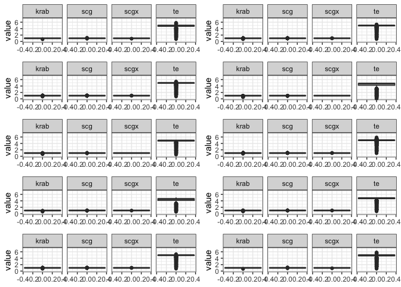
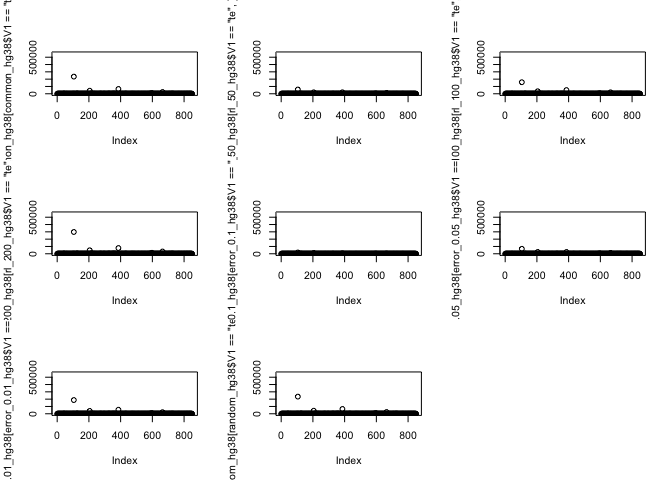
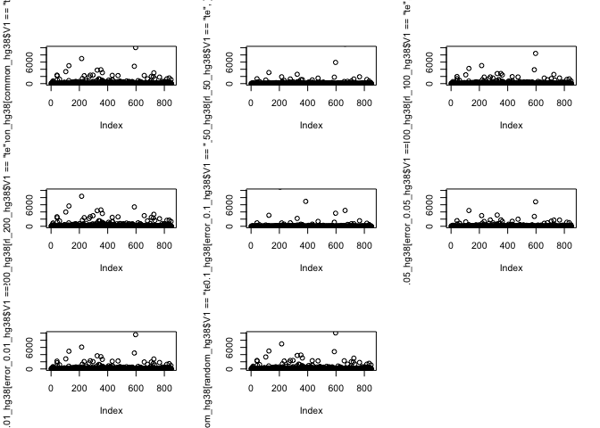
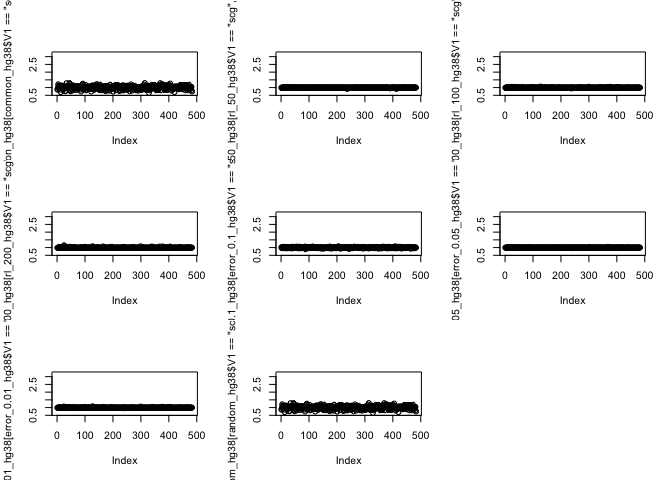
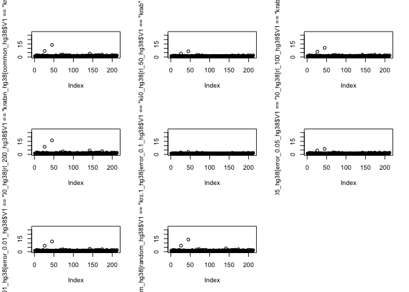
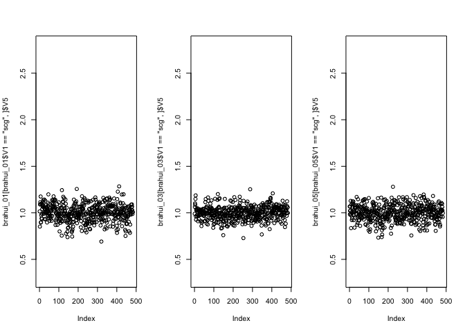
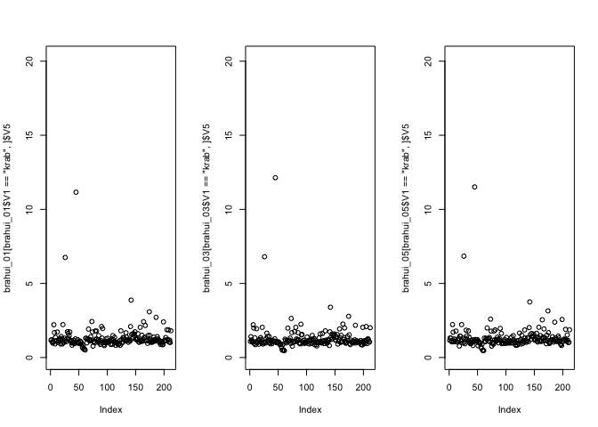
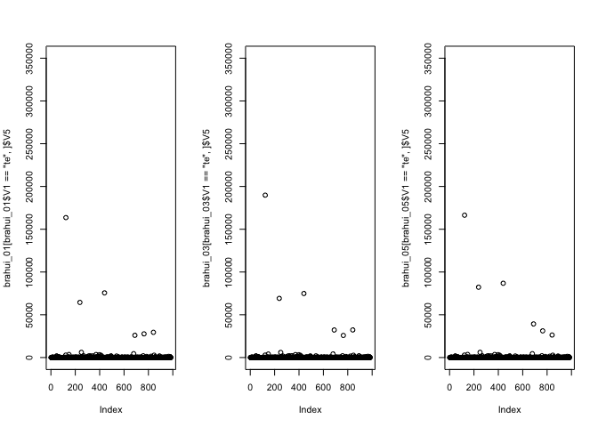

HumanTEs_Rmarkdown_Simulations
================

# Unbiased Population Variation of Human Transposable Elements - Script 1

Welcome. If you are reading this, you are interested in working with the
Transposable Element (TE) dataset of human Populations created using
mapping of whole-genome sequencing reads to TE consensus sequences and
single-copy genes (SCGs). This Document is the first in a series of 8
documents containing a variety of plots and other analyses I conducted.
Most analyses are based purely on the mapping data from the Illumina
sequencing data of the HGDP (Human Genome Diversity Project) mapped
against the custom reference library version 6.2.

I want to preface this by saying that despite my best efforts to
document comprehensively what I have done and how I have done so, I
acknowledge that some steps might not be easy to understand and some
analyses might some unintuitive. You might notice missing parts. You
might realize that some analyses could have been performed more
effectively. You might even find relevant errors in the code or in the
logic behind it. I highly encourage to mark all of it. Find more
effective solutions if you can. And please, please feel free to contact
me at any time and with any questions you have. I am personally invested
in this project and have a high interest in producing something that
makes the time invested by Robert, Ray and Yassine (and you?) worthwile
in the end. So please, hit me up at “<floschwarz1994@gmail.com>” or ask
Robert for my personal phone number, and drop me a message whenever
something pops up.

In this document, I will try to walk through the process of creation for
the dataset.

I will make an effort to include the simulations I have run. I might
touch on their influence on manipulations in the reference library
before arriving at version 6.2, but generally the simulation results
shown are those obtained with the latest version of the reference
library, i.e. v6.2

The text I include in the first section is mainly taken from my draft
materials&methods section from the very first version of a manuscript
for this analysis. For access to the overleaf document, best contact
Robert.

To properly include these plots into a manuscript, it is likely they
would have to be slightly adapted and/or that some additional plots
would have to be made.

Also, i want to note that various parts of the whole process are not
conducted in R, including, but not exclusive to the extraction of SCG
and KRAB sequences, the creation and mapping of artificial reads and
genomes as well as the whole mapping pipeline and the subsequent
processing steps to create a summary file for all mapping runs combined.
These parts of the pipeline are explained in detail on the respective
SourceForge webpage
<https://sourceforge.net/p/human-te-dynamics/wiki/Home/> .

### Dataset manipulation

##### TEs

TEs were obtained from the RepBase library v.23.10 All sequences shorter
than 150bp were excluded.

##### KRAB-ZNFs

To obtain the initial set of KRAB-ZNFs, all annotations of exons of
genes found with the search term ‘Krab’ were downloaded from
genecards.org. We used a custom python script
(‘extract_genes_KRAB-ZNF.py’) to discard all annotations with
overlapping positions (the longest annotation at a position was
retained) and to produce a bed-file of all remaining annotations.
Multiple exons of a single protein were retained if applicable.
Sequences corresponding to those annotations were again extracted from
the human reference genome hg38 version recommended for mapping with bwa
(‘GRCh38_full_analysis_set_plus_decoy_hla.fa’) using bedtools getfasta.
To identify suitable Krab-ZNF sequences that do not interfere with
mapping results for TE or SCG sequences, first RepeatMasker was run on
the KRAB sequence library using the default human RepBase TE library
(options: -no_is -nolow -a -gccalc -gff). All sequences with one or more
RepeatMasker annotation were removed from the reference set.
Additionally, all sequences shorter than 1000 bp were removed.

##### SCGs

To create the initial set of SCGs, the annotation of all human genes in
the reference genome GRCh38 was downloaded from UCSC at
<http://genome-euro.ucsc.edu/cgi-bin/hgTables>. We used a custom python
script (‘extract_genes_from_ucsc.py’) to discard all annotations with
overlapping positions (only the first annotation at a respective
position was retained) and to produce a bed-file of all remaining
annotations. Sequences corresponding to those annotations were then
extracted from the human reference genome hg38 version recommended for
mapping with bwa (‘GRCh38_full_analysis_set_plus_decoy_hla.fa’) using
bedtools (v2.29.2) getfasta. To identify suitable single-copy-gene
sequences, first RepeatMasker Smit et al. 2013 (open-4.0.7) was run on
the sequence library using the full human Repbase TE library (v 23.10)
(options: -no_is -nolow -a -gccalc -gff). All sequences with at least
one RepeatMasker annotation were removed from the SCG reference set.
Additionally, all sequences shorter than 2000 bp were removed. Next, we
used blastn (v 2.7.1) to blast the sequence dataset against the human
reference genome hg38. Only sequences with a single blast hit were
retained in the sequence dataset. Subsequently, the usability of the
putative single copy genes was tested with an example dataset of human
sequencing data (SRR10723881). All sequences with a strong coverage
deviation, where cutoffs were set as 4.5 and 8 based on the average
coverage of most sequences and the average coverage of the sequence
dataset (5x), were removed. Both the blast and mapping approach were
repeated once. The remaining sequences were distinguished into autosomal
SCGs and SCGs on the X-chromosome, as SCGs are used for the estimation
of copy numbers of KRABs and TEs and only autosomes can be reliably used
for this coverage average. However, the set of X-specific scgs is
retained (marked as scgx) and can be used to double-check the specified
gender of each sample.

## Simulations

### Artificial Genome - Simulated reads

After the datasets were filtered, they were combined to form the
reference library. The reference library was used to perform simulations
testing for the influence of various data properties. Simulations were
seperated in three different parts. First, a simulated genome was
created with SimulaTE. For this purpose, a 4 MB chassis sequence derived
from the 20 MB chassis sequence provided on the simulaTE walkthrough
page was used. In this chassis, we randomly insert 1 copy of each SCG
and KRAB-ZNF and 5 copies of each TE from the reference sequence library
using a modified version of the ‘define-landscape’ script
(‘define-landscape-flo’). Out of the resulting ‘pgd’ file we build the
genome using ‘build-population-genome.py’. Next, artificial reads were
derived from the genome using the script ‘create-reads-human.py’. As
default, we chose values closely mimicking the properties of the actual
HGDP data (\$\~\$35x coverage, 150 bp readlength). Furthermore, an
error-rate of 0 and a uniform distribution of the reads was used as
default. The created artificial reads were now mapped to the reference
library using bwa mem Li2009a(v0.7.17-r1188) with default parameters.
Finally the coverage of all mapped reads was calculated using the script
‘humante-mapstat-weight.py’ while filtering for a mapping quality of 10.
The basic coverage is calculated as reads per million (rpm), but is
additionally corrected by the percentage of a read mapped to the a
consensus sequence to avoid an inflation of the copy number by only
partially mapped reads. To calculate copy number estimates of coverage,
the average coverage of all SCGs is used as the estimate for 1 genomic
copy. Sequences strongly deviating from their expected copy number (1
for SCGs and KRAB-ZNFs and 5 for TEs) were investigated and potentially
removed from the reference library. Subsequently, we repeated this
process several times, each time altering one of the parameters for the
creation of the artificial reads to detect the influence of variation in
the sequencing data on the average coverage (see supp. Fig X for results
and Table X for an overview over all parameter variations). Again,
sequences showing strong deviations from their expected copy number (1
for SCGs and KRAB-ZNFs and 5 for TEs) were investigated and potentially
removed from the reference library. We observed little to no effect in
the estimates with variations in coverage (5x and 75x coverage). A
generally increased scatter (but no inherent bias) is observed for the
random insertion of sequences (‘random’). We observed an influence of
different read lengths manifesting in under- (50x, 100x) or
overestimation of abundance (200x). We also observed an influence of the
average error rate, where a (likely unrealistic) high error rate of 10%
leads to a massive underestimation, while a likely still relatively high
estimate of 1% error rate only prodcues slight deviations from the
original results.

the Parameter variations: Readlength: 50bp, 100bp 150bp(default),200bp ;
coverage: 5x,35x(default),75x ; error-rate: 0(default), 0.01, 0.05 ;
read distribution: uniform (default), random

Datasets resulting from each of the simulations were loaded into R:

``` r
common<-read.table("/Users/rpianezza/TE/simulation-tests/simulated-genome/mapstat_cov35_rl150_random_error0_to_reflib_v6.2_weighted.txt", skip = 8)
cov_75x<-read.table("/Users/rpianezza/TE/simulation-tests/simulated-genome/mapstat_cov75_rl150_uniform_error0_to_reflib_v6.2_weighted.txt", skip = 8)
cov_5x<-read.table("/Users/rpianezza/TE/simulation-tests/simulated-genome/mapstat_cov5_rl150_uniform_error0_to_reflib_v6.2_weighted.txt", skip = 8)
rl_50<-read.table("/Users/rpianezza/TE/simulation-tests/simulated-genome/mapstat_cov35_rl50_uniform_error0_to_reflib_v6.2_weighted.txt", skip = 8)
rl_100<-read.table("/Users/rpianezza/TE/simulation-tests/simulated-genome/mapstat_cov35_rl100_uniform_error0_to_reflib_v6.2_weighted.txt", skip = 8)
rl_200<-read.table("/Users/rpianezza/TE/simulation-tests/simulated-genome/mapstat_cov35_rl200_uniform_error0_to_reflib_v6.2_weighted.txt", skip = 8)
error_0.1<-read.table("/Users/rpianezza/TE/simulation-tests/simulated-genome/mapstat_cov35_rl150_uniform_error0.1_to_reflib_v6.2_weighted.txt", skip = 8)
error_0.05<-read.table("/Users/rpianezza/TE/simulation-tests/simulated-genome/mapstat_cov35_rl150_uniform_error0.05_to_reflib_v6.2_weighted.txt", skip = 8)
error_0.01<-read.table("/Users/rpianezza/TE/simulation-tests/simulated-genome/mapstat_cov35_rl150_uniform_error0.01_to_reflib_v6.2_weighted.txt", skip = 8)
random<-read.table("/Users/rpianezza/TE/simulation-tests/simulated-genome/mapstat_cov35_rl150_random_error0_to_reflib_v6.2_weighted.txt", skip = 8)
```

The following plots create pairwise comparisons for the copy number
estimate of each sequence in the reference library. Each comparison uses
the default simulation dataset called ‘common’ (Readlength 150bp;
coverage: 35x; error-rate: 0; read distribution: uniform) and a dataset
where one of the parameters was changed. For each comparison, the
reciprocal was calculated if the original fraction was smaller than 1,
such that only the relative difference between the two datasets is
displayed, but not the direction, i.e. which dataset has higher/lower
abundance. The last two lines for each plot are not necessary. I have
thus commented them out. I used them to get an idea what values are
particularly large, and maybe find sequences that should be excluded. I
thus did want to delete them, as it might be useful for you to
reevaulate this and get a feeling what parameter changes produce larger
outliers and what parameter changes only have outliers with very
moderate differences. Also, you can get a feeling on which sequences
tend to show up as outliers in many different parameter settings.

``` r
par(mfrow=c(3,3))
colorvector<-c(rep('blue',483),rep('orange',24),rep("purple",212),rep('red',984))
length(colorvector)
```

    ## [1] 1703

``` r
com_v_rl50<-common$V5/rl_50$V5
com_v_rl50[com_v_rl50<1]<-1/com_v_rl50[com_v_rl50<1]
plot(com_v_rl50,col=colorvector)
#common[com_v_rl50>5,]$V2
#common[com_v_rl50==max(com_v_rl50),]$V2

com_v_rl100<-common$V5/rl_100$V5
com_v_rl100[com_v_rl100<1]<-1/com_v_rl100[com_v_rl100<1]
plot(com_v_rl100,col=colorvector)
#common[com_v_rl100>1.5,]$V2
#common[com_v_rl100==max(com_v_rl100),]$V2

com_v_rl200<-common$V5/rl_200$V5
com_v_rl200[com_v_rl200<1]<-1/com_v_rl200[com_v_rl200<1]
plot(com_v_rl200,col=colorvector)
#common[com_v_rl200>1.4,]$V2
#common[com_v_rl200==max(com_v_rl200),]$V2

com_v_cov5<-common$V5/cov_5x$V5
com_v_cov5[com_v_cov5<1]<-1/com_v_cov5[com_v_cov5<1]
plot(com_v_cov5,col=colorvector)
#common[com_v_cov5>2,]$V2

com_v_cov75<-common$V5/cov_75x$V5
com_v_cov75[com_v_cov75<1]<-1/com_v_cov75[com_v_cov75<1]
plot(com_v_cov75,col=colorvector)
#common[com_v_cov75>1.015,]$V2
#common[com_v_cov75==max(com_v_cov75),]$V2

com_v_error0.1<-common$V5/error_0.1$V5
com_v_error0.1[com_v_error0.1<1]<-1/com_v_error0.1[com_v_error0.1<1]
plot(com_v_error0.1,col=colorvector)
#common[com_v_error0.1>1.8,]$V2
#common[com_v_error0.1==max(com_v_error0.1),]$V2

com_v_error0.01<-common$V5/error_0.01$V5
com_v_error0.01[com_v_error0.01<1]<-1/com_v_error0.01[com_v_error0.01<1]
plot(com_v_error0.01,col=colorvector)
#common[com_v_error0.01>1.8,]$V2
#common[com_v_error0.01==max(com_v_error0.01),]$V2

com_v_error0.05<-common$V5/error_0.05$V5
com_v_error0.05[com_v_error0.05<1]<-1/com_v_error0.05[com_v_error0.05<1]
plot(com_v_error0.05,col=colorvector)
#common[com_v_error0.05>2,]$V2
#common[com_v_error0.05==max(com_v_error0.05),]$V2

com_v_random<-common$V5/random$V5
com_v_random[com_v_random<1]<-1/com_v_random[com_v_random<1]
plot(com_v_random,col=colorvector)
```

<!-- -->

``` r
#common[com_v_random>1.15,]$V2
#common[com_v_random==max(com_v_random),]$V2
```

Another relevant plot shows the copy number values for each of the four
different sequence types (krab, scg, scgx and te) for all 10 different
settings (common and the 9 with one parameter changed). The plots are
created indepedently, saved in variabvles and then created using
grid.arrange from the package ‘gridExtra’.

``` r
library(ggplot2)
names(common)<-c('class','name','length','readnumber','value')
names(cov_5x)<-c('class','name','length','readnumber','value')
names(cov_75x)<-c('class','name','length','readnumber','value')
names(rl_50)<-c('class','name','length','readnumber','value')
names(rl_100)<-c('class','name','length','readnumber','value')
names(rl_200)<-c('class','name','length','readnumber','value')
names(error_0.01)<-c('class','name','length','readnumber','value')
names(error_0.05)<-c('class','name','length','readnumber','value')
names(error_0.1)<-c('class','name','length','readnumber','value')
names(random)<-c('class','name','length','readnumber','value')


common_plot<-ggplot(common,aes(y=value))+ylim(0,7)+facet_grid(.~class)+geom_boxplot()+theme_bw()
cov_75_plot<-ggplot(cov_75x,aes(y=value))+ylim(0,7)+facet_grid(.~class)+geom_boxplot()+theme_bw()
cov_5_plot<-ggplot(cov_5x,aes(y=value))+ylim(0,7)+facet_grid(.~class)+geom_boxplot()+theme_bw()
rl_50_plot<-ggplot(rl_50,aes(y=value))+ylim(0,7)+facet_grid(.~class)+geom_boxplot()+theme_bw() #FEW OVERESTIMATION
rl_100_plot<-ggplot(rl_100,aes(y=value))+ylim(0,7)+facet_grid(.~class)+geom_boxplot()+theme_bw()
rl_200_plot<-ggplot(rl_200,aes(y=value))+ylim(0,7)+facet_grid(.~class)+geom_boxplot()+theme_bw()#Many Overestimations
error_0.01_plot<-ggplot(error_0.01,aes(y=value))+ylim(0,7)+facet_grid(.~class)+geom_boxplot()+theme_bw()
error_0.05_plot<-ggplot(error_0.05,aes(y=value))+ylim(0,7)+facet_grid(.~class)+geom_boxplot()+theme_bw()
error_0.1_plot<-ggplot(error_0.1,aes(y=value))+ylim(0,7)+facet_grid(.~class)+geom_boxplot()+theme_bw()
random_plot<-ggplot(random,aes(y=value))+ylim(0,7)+facet_grid(.~class)+geom_boxplot()+theme_bw()
```

``` r
library(gridExtra)
grid.arrange(common_plot,cov_75_plot,cov_5_plot,rl_50_plot,rl_100_plot,rl_200_plot,error_0.1_plot,error_0.05_plot,error_0.01_plot,random_plot,ncol=2,nrow=5)
```

<!-- -->

### Human reference Genome - Simulated reads

In the next step for the simulations, we created artificial reads from
the human reference genome instead from an artificial genome. Thus, we
did no longer know the expected number of insertions for each TE. this
also allowed to identify SCG sequences that might not be as unique as we
previously thought.

``` r
common_hg38<-read.table("/Users/rpianezza/TE/simulation-tests/humangenome-artificialreads/mapstat_hg38_cov5x_rl150_noerror_random_to_reflib_v6.2_weighted.txt", skip = 8)
rl_50_hg38<-read.table("/Users/rpianezza/TE/simulation-tests/humangenome-artificialreads/mapstat_hg38_cov5x_rl50_noerror_uniform_to_reflib_v6.2_weighted.txt", skip = 8)
rl_100_hg38<-read.table("/Users/rpianezza/TE/simulation-tests/humangenome-artificialreads/mapstat_hg38_cov5x_rl100_noerror_uniform_to_reflib_v6.2_weighted.txt", skip = 8)
rl_200_hg38<-read.table("/Users/rpianezza/TE/simulation-tests/humangenome-artificialreads/mapstat_hg38_cov5x_rl200_noerror_uniform_to_reflib_v6.2_weighted.txt", skip = 8)
error_0.1_hg38<-read.table("/Users/rpianezza/TE/simulation-tests/humangenome-artificialreads/mapstat_hg38_cov5x_rl150_error0.1_uniform_to_reflib_v6.2_weighted.txt", skip = 8)
error_0.05_hg38<-read.table("/Users/rpianezza/TE/simulation-tests/humangenome-artificialreads/mapstat_hg38_cov5x_rl150_error0.05_uniform_to_reflib_v6.2_weighted.txt", skip = 8)
error_0.01_hg38<-read.table("/Users/rpianezza/TE/simulation-tests/humangenome-artificialreads/mapstat_hg38_cov5x_rl150_error0.01_uniform_to_reflib_v6.2_weighted.txt", skip = 8)
random_hg38<-read.table("/Users/rpianezza/TE/simulation-tests/humangenome-artificialreads/mapstat_hg38_cov5x_rl150_noerror_random_to_reflib_v6.2_weighted.txt", skip = 8)
```

Repeating the plots produced for the artificial genome is possible and I
included the code below. Note that 75x coverage and 35x coverage are no
longer included and the default coverage is now 5x. This was done
because 1) coverage had little influence in the above evaluation and 2)
because the files would have been too large otherwise Note that here
sometimes abundance values are ‘NA’. This causes problems for the
pairwise comparisons and values where ‘NA’ occurs are not plotted.

To resolve the issue with ’NA’s, a possible solution is to include
pseudocounts, i.e. artificially add a 1 to each value where TEs were 0.
Another option, and the one used below, was to simply exclude all TEs
with abundance of 0 in any of the simulation datasets.

``` r
zeroTEs<-c()
zeroTEs<-c(zeroTEs,as.character(common_hg38[common_hg38$V5==0,]$V2))
zeroTEs<-c(zeroTEs,as.character(rl_50_hg38[rl_50_hg38$V5==0,]$V2))
zeroTEs<-c(zeroTEs,as.character(rl_100_hg38[rl_100_hg38$V5==0,]$V2))
zeroTEs<-c(zeroTEs,as.character(rl_200_hg38[rl_200_hg38$V5==0,]$V2))
zeroTEs<-c(zeroTEs,as.character(error_0.1_hg38[error_0.1_hg38$V5==0,]$V2))
zeroTEs<-c(zeroTEs,as.character(error_0.05_hg38[error_0.05_hg38$V5==0,]$V2))
zeroTEs<-c(zeroTEs,as.character(error_0.01_hg38[error_0.01_hg38$V5==0,]$V2))
zeroTEs<-c(zeroTEs,as.character(random_hg38[random_hg38$V5==0,]$V2))
zeroTEs<-unique(zeroTEs)
#names(common_hg38)<-c('class','name','length','readnumber','value')
`%notin%` <- function(x,y) !(x %in% y)
common_hg38<-common_hg38[common_hg38$V2 %notin% zeroTEs,]
rl_50_hg38<-rl_50_hg38[rl_50_hg38$V2 %notin% zeroTEs,]
rl_100_hg38<-rl_100_hg38[rl_100_hg38$V2 %notin% zeroTEs,]
rl_200_hg38<-rl_200_hg38[rl_200_hg38$V2 %notin% zeroTEs,]
error_0.1_hg38<-error_0.1_hg38[error_0.1_hg38$V2 %notin% zeroTEs,]
error_0.05_hg38<-error_0.05_hg38[error_0.05_hg38$V2 %notin% zeroTEs,]
error_0.01_hg38<-error_0.01_hg38[error_0.01_hg38$V2 %notin% zeroTEs,]
random_hg38<-random_hg38[random_hg38$V2 %notin% zeroTEs,]
```

Plots in this case are produced seperately for TEs, SCGs and KRABs. For
TEs, the two different y-axis ranges were used to produce a plot that
not only shows Alu and then all dots together in the bottom.

``` r
options(scipen = 999)

#TEs all
par(mfrow=c(3,3))
plot(common_hg38[common_hg38$V1=='te',]$V5,ylim = c(0,550000))
plot(rl_50_hg38[rl_50_hg38$V1=='te',]$V5,ylim = c(0,550000))
plot(rl_100_hg38[rl_100_hg38$V1=='te',]$V5,ylim = c(0,550000))
plot(rl_200_hg38[rl_200_hg38$V1=='te',]$V5,ylim = c(0,550000))
plot(error_0.1_hg38[error_0.1_hg38$V1=='te',]$V5,ylim = c(0,550000))
plot(error_0.05_hg38[error_0.05_hg38$V1=='te',]$V5,ylim = c(0,550000))
plot(error_0.01_hg38[error_0.01_hg38$V1=='te',]$V5,ylim = c(0,550000))
plot(random_hg38[random_hg38$V1=='te',]$V5,ylim = c(0,550000))

#TEs 'zoomed in'
par(mfrow=c(3,3))
```

<!-- -->

``` r
plot(common_hg38[common_hg38$V1=='te',]$V5,ylim = c(0,10000))
plot(rl_50_hg38[rl_50_hg38$V1=='te',]$V5,ylim = c(0,10000))
plot(rl_100_hg38[rl_100_hg38$V1=='te',]$V5,ylim = c(0,10000))
plot(rl_200_hg38[rl_200_hg38$V1=='te',]$V5,ylim = c(0,10000))
plot(error_0.1_hg38[error_0.1_hg38$V1=='te',]$V5,ylim = c(0,10000))
plot(error_0.05_hg38[error_0.05_hg38$V1=='te',]$V5,ylim = c(0,10000))
plot(error_0.01_hg38[error_0.01_hg38$V1=='te',]$V5,ylim = c(0,10000))
plot(random_hg38[random_hg38$V1=='te',]$V5,ylim = c(0,10000))

#SCGs
par(mfrow=c(3,3))
```

<!-- -->

``` r
plot(common_hg38[common_hg38$V1=='scg',]$V5,ylim = c(0.6,3.2))
plot(rl_50_hg38[rl_50_hg38$V1=='scg',]$V5,ylim = c(0.6,3.2))
plot(rl_100_hg38[rl_100_hg38$V1=='scg',]$V5,ylim = c(0.6,3.2))
plot(rl_200_hg38[rl_200_hg38$V1=='scg',]$V5,ylim = c(0.6,3.2))
plot(error_0.1_hg38[error_0.1_hg38$V1=='scg',]$V5,ylim = c(0.6,3.2))
plot(error_0.05_hg38[error_0.05_hg38$V1=='scg',]$V5,ylim = c(0.6,3.2))
plot(error_0.01_hg38[error_0.01_hg38$V1=='scg',]$V5,ylim = c(0.6,3.2))
plot(random_hg38[random_hg38$V1=='scg',]$V5,ylim = c(0.6,3.2))

#KRABs
par(mfrow=c(3,3))
```

<!-- -->

``` r
plot(common_hg38[common_hg38$V1=='krab',]$V5,ylim = c(0,28))
plot(rl_50_hg38[rl_50_hg38$V1=='krab',]$V5,ylim = c(0,28))
plot(rl_100_hg38[rl_100_hg38$V1=='krab',]$V5,ylim = c(0,28))
plot(rl_200_hg38[rl_200_hg38$V1=='krab',]$V5,ylim = c(0,28))
plot(error_0.1_hg38[error_0.1_hg38$V1=='krab',]$V5,ylim = c(0,28))
plot(error_0.05_hg38[error_0.05_hg38$V1=='krab',]$V5,ylim = c(0,28))
plot(error_0.01_hg38[error_0.01_hg38$V1=='krab',]$V5,ylim = c(0,28))
plot(random_hg38[random_hg38$V1=='krab',]$V5,ylim = c(0,28))
```

<!-- -->

### Real Data

At the last stage of the simulation step, we tried to use a few samples
from the HGDP to again see if we can find some outlier SCGs that might
not be as unique as previously thought. We use three datasets from the
Brahui poulation

``` r
brahui_01<-read.table("/Users/rpianezza/TE/simulation-tests/realdatatest/HGDP00001-Brahui.mq10.mapstat", skip = 8)
brahui_03<-read.table("/Users/rpianezza/TE/simulation-tests/realdatatest/HGDP00003-Brahui.mq10.mapstat", skip = 8)
brahui_05<-read.table("/Users/rpianezza/TE/simulation-tests/realdatatest/HGDP00005-Brahui.mq10.mapstat", skip = 8)
```

I produce three plots, one each for SCGs, TEs, and KRABs

``` r
par(mfrow=c(1,3))
#brahui_01_03_05_scg
plot(brahui_01[brahui_01$V1=='scg',]$V5,ylim=c(0.3,2.8))
plot(brahui_03[brahui_03$V1=='scg',]$V5,ylim=c(0.3,2.8))
plot(brahui_05[brahui_05$V1=='scg',]$V5,ylim=c(0.3,2.8))
```

<!-- -->

``` r
#scgs to be removed: chr13:76880174-76886405 ; chr3:169769648-169772043

par(mfrow=c(1,3))
plot(brahui_01[brahui_01$V1=='krab',]$V5,ylim=c(0,20.2))
plot(brahui_03[brahui_03$V1=='krab',]$V5,ylim=c(0,20.2))
plot(brahui_05[brahui_05$V1=='krab',]$V5,ylim=c(0,20.2))
```

<!-- -->

``` r
par(mfrow=c(1,3))
plot(brahui_01[brahui_01$V1=='te',]$V5,ylim=c(0,350000))
plot(brahui_03[brahui_03$V1=='te',]$V5,ylim=c(0,350000))
plot(brahui_05[brahui_05$V1=='te',]$V5,ylim=c(0,350000))
```

<!-- -->

``` r
par(mfrow=c(1,1))
```

## After Simulations

All three parts of these simulations were repeated as soon as a sequence
(most likely a SCG) were removed from the reference library. TE
sequences prone to produce outliers were largely not removed, simply
because they might still be informative in the actual analyses. However,
it is crucial for the interpretation of the results from the real
dataset to be aware which TEs are prone to produce outliers due to
fluctuations in the input data. Also, these simulations are the basis
for any simulations that want to explore how systematic biases
introduced e.g. if analysing ancient DNA could influence the obtained
results. At the end of the simulation analyses, the reference library
version 6.2 was obtained. This is the final reference library that was
used for all analyses. However, it is still entirely feasible to exclude
sequences (SCG, TE or KRAB) from the analyses after the mapping
procedure. For more detail on this process, see the second script of
this script series.
