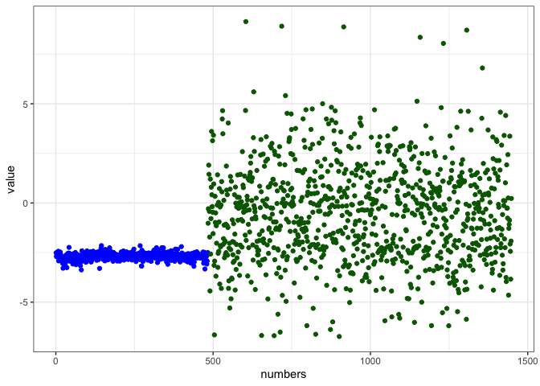
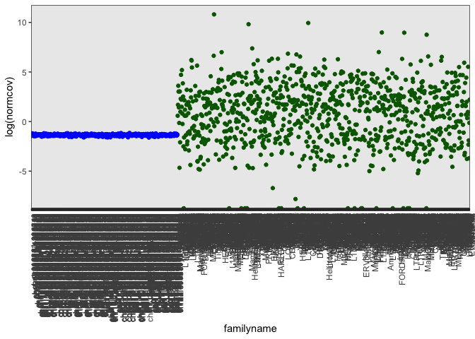

Evaluating the Validity of the single-copy gene normalization
================

``` r
#install.packages("webshot")
#webshot::install_phantomjs()
library(tidyverse)
```

    ## ── Attaching packages ─────────────────────────────────────── tidyverse 1.3.2 ──
    ## ✔ ggplot2 3.3.6      ✔ purrr   0.3.4 
    ## ✔ tibble  3.1.8      ✔ dplyr   1.0.10
    ## ✔ tidyr   1.2.1      ✔ stringr 1.4.1 
    ## ✔ readr   2.1.2      ✔ forcats 0.5.2 
    ## ── Conflicts ────────────────────────────────────────── tidyverse_conflicts() ──
    ## ✖ dplyr::filter() masks stats::filter()
    ## ✖ dplyr::lag()    masks stats::lag()

``` r
HGDPcutoff<-read_delim("/Users/rpianezza/TE/summary-HGDP/USEME_HGDP_complete_reflib6.2_mq10_batchinfo_cutoff0.01.txt",comment="#")
```

    ## Rows: 1394352 Columns: 10
    ## ── Column specification ────────────────────────────────────────────────────────
    ## Delimiter: ","
    ## chr (7): ID, Pop, sex, Country, type, familyname, batch
    ## dbl (3): length, reads, copynumber
    ## 
    ## ℹ Use `spec()` to retrieve the full column specification for this data.
    ## ℹ Specify the column types or set `show_col_types = FALSE` to quiet this message.

``` r
names(HGDPcutoff)<-c("ID","Pop","sex","Country","type","familyname","length","reads","copynumber","batch")
```

# Unbiased Population Variation of Human Transposable Elements - Script 4

This is the fourth out of eight scripts describing the creation and
analysis of the dataset of human TE abundance. This script works with
the version of the HGDP dataset created in Script 2. This means that the
‘HGDPcutoff’ dataset will be used, containing all SCGs from the original
relibrary v6.2, but missing TEs removed due to not possessing a single
value that is above the chosen threshold of 0.01 copies.

## Single-copy genes visualization

### BioCircos

The input is the file “geneannotations.txt”, which can be found on
GitHub.

``` r
scg = read.table("/Users/rpianezza/TE/geneannotations.txt", sep='\t')
head(scg)
```

    ##   V1      V2      V3 V4
    ## 1  1  916864  921016 NA
    ## 2  1  960583  965719 NA
    ## 3  1 1203507 1206571 NA
    ## 4  1 1324755 1327994 NA
    ## 5  1 1331279 1335314 NA
    ## 6  1 1399519 1402019 NA

Load the packages.

``` r
library(tidyr)
library(BioCircos)
```

Read the file as table. Store the first column (chromosome number) and
the second (chromosomal location of the gene) as vectors. Set a random
seed and create a vector of lenght 100. We will need the random numbers
just for better data visualization (Y axis).

``` r
df = read.table('/Users/rpianezza/TE/geneannotations.txt', sep='\t')
chr <- as.vector(t(as.matrix(df[1])))
start <- as.vector(t(as.matrix(df[2])))

set.seed(123)
random_position <- sample(0:100, size = 100)
```

Create the first “tracklist” to add to the figure. This one is the text
in the middle of the figure.

``` r
tracklist = BioCircosTextTrack('myTextTrack', 'SCGs', size = "2.7em",  opacity = 0.5, 
                               x = -0.39, y = 0.1)
```

Add the SCGs to the figure. The chromosome is stored in the vector
“chr”, the location in the vector “start”. The y position is defined
random using the “random_position” vector.

``` r
tracklist = tracklist + BioCircosSNPTrack('mySNPTrack', chr, start, 
                              random_position, colors = c("tomato2"), minRadius = 0.55, maxRadius = 0.85)
```

Add the light blue background to the figure.

``` r
tracklist = tracklist + BioCircosBackgroundTrack("myBackgroundTrack", 
                                                 minRadius = 0.5, maxRadius = 0.9,
                                                 borderColors = "#AAAAAA", borderSize = 0.6, fillColors = "#B3E6FF")  
```

Create and show the final figure.

``` r
BioCircos(genome = "hg19", tracklist, genomeFillColor = "PuOr",
          chrPad = 0.05, genomeTicksDisplay = FALSE)
```

<!-- -->

### Comparisons of SCGS and TEs

In this section, we compare the average variation observed in
single-copy genes vs the average copy number variation for Transposable
Elements (TEs). If interested, KRAB-ZNFs can be included. Though they
are excluded by default in this version, I included the commands for
including the KRAB-ZNFs as comments in the code.

We use the cutoff dataset created in Script 2 and I in this case I
create subsets corresponding to TE and SCG sequences (though this is
probably not necessary when using tidyverse syntax).

``` r
HGDPtecutoff<-subset(HGDPcutoff,type=="te")
HGDPscgcutoff<-subset(HGDPcutoff,type=="scg")
#HGDPkrabcutoff<-subset(HGDPcutoff,type=="krab")
```

##### Standard deviation over all samples

In this script I calculate the standard deviation for SCGs and TEs (and
KRABs) for all samples (no subsets except the type of sequence,
i.e. SCG, TE or KRAB). We can clearly see that the average variation in
copy number is much lower for SCGs than for TEs.

``` r
tenames <- unique(HGDPtecutoff$familyname)
scgnames <- unique(HGDPscgcutoff$familyname)
#krabnames <- unique(HGDPkrabcutoff$familyname)

sdvectortes<-c()
for (i in tenames){
  sdvectortes<-c(sdvectortes,sd(HGDPtecutoff$copynumber[HGDPtecutoff$familyname==i]))}

sdvectorscg<-c()
for (i in scgnames){
  sdvectorscg<-c(sdvectorscg,sd(HGDPscgcutoff$copynumber[HGDPscgcutoff$familyname==i]))}

#sdvectorkrab<-c()
#for (i in krabnames){
#  sdvectorkrab<-c(sdvectorkrab,sd(HGDPkrabcutoff$copynumber[HGDPkrabcutoff$familyname==i]))}

logsdscgvste<-data.frame(log(c(sdvectorscg,sdvectortes)),c(rep('blue',483),rep('darkgreen',965)),c(1:1448))
#logsdscgvstevskrab<-data.frame(log(c(sdvectorscg,sdvectorkrab,sdvectortes)),c(rep('blue',483),rep('orange',212),rep('darkgreen',965)),c(1:1660))
names(logsdscgvste)<-c('value','colors','numbers')
ggplot(logsdscgvste,aes(x=numbers,y=value))+geom_point(color=logsdscgvste$colors)+theme_bw()
```

<!-- -->

##### Coverage comparison for a single sample

But there is a potential problem in the previous analysis, as the values
for SCGs are used for normalization, so maybe this has an influence on
these results? For this reason we made the following plot looking at
coverage in a single sample to have a different way to argue the
difference in variation between TEs and SCGs. You can use any of the
individual datasets from the HGDP for this analysis. In this case, I
used HGDP00750-Japanese. I saved the file separately in the SVN folder
‘data-analysis/scgvalidation’ such that this analysis can be reproduced
easily. As usual, I use the dataset filtered for mapping quality of 10.
I manually modified this mapstat-file to exclude the header lines
summarizing the number of mapped/unmapped reads etc., such that only the
information about the sequences themselves is retained. Otherwise,
reading in the table will cause problems, as it will not recognize the
number of columns. What is visible here is that the average coverage
(normalized by the length of the sequence) for all SCGs and TEs in the
sample. It is visible that SCGs have a very similar coverage while it
varies widely for TEs. The advantage of this plot is that no values used
have the SCG normalization, such it is independent of this normalization
step.

``` r
HGDP00750<-read.table("/Users/rpianezza/TE/HGDP00750-Japanese.mq10.mapstat_mod")
names(HGDP00750)<-c('type','familyname','length','coverage','copynumber')
removetes<-c("X5a_DNA","LTR88a","LTR81B","LTR89","LTR81C","LTR86B1","Eutr3","LTR88b","MER104A","BSRd","MamGypLTR2","X11_LINE","LTR91","CHARLIE8A","CR1_HS","LTR86C","UCON39","LTR88c","HERVR")
`%notin%` <- Negate(`%in%`) # This defines the function %notin% as doing the reverse of the function %in%
HGDP00750cutoff<-HGDP00750 %>% filter(familyname %notin% removetes)
HGDP00750tescg<-HGDP00750cutoff[HGDP00750cutoff$type=="scg"|HGDP00750cutoff$type=="te",] #I use this instead of subset here for simplicity, as I am not sure how to set the 'or' condition, i.e. '|', with subset.
colvec00750<-c(rep('blue',483),rep('darkgreen',965))
HGDP00750tescg$familyname <- factor(HGDP00750tescg$familyname, levels = HGDP00750tescg$familyname)
covstorage<-c()
for (i in 1:length(HGDP00750tescg$familyname)){
  covstorage<-c(covstorage,HGDP00750tescg[i,4]/HGDP00750tescg[i,3])}# This evalculates the 'coverage, i.w. column 4, normalized by the sequence length, i.e. column 3)
HGDP00750tescg$normcov<-covstorage
ggplot(HGDP00750tescg,aes(x=familyname,y=log(normcov)))+geom_point(color=colvec00750)+theme_bw()+
  theme(axis.text.x = element_text(angle = 90, hjust = 1))
```

<!-- -->

At this point, we have now created a dataset with 965 TEs and 483 SCGs,
and we have confirmed that the SCG normalization seems to work nicely.

Now, it is time to start analyzing the TE content itself. Good luck!
