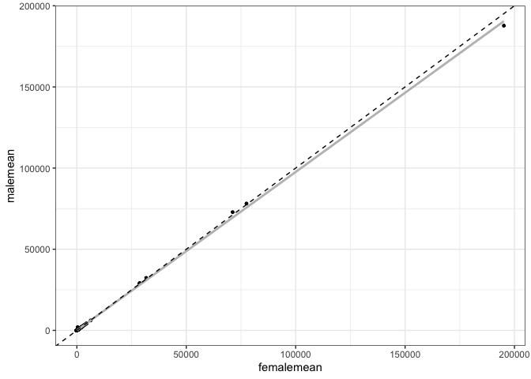
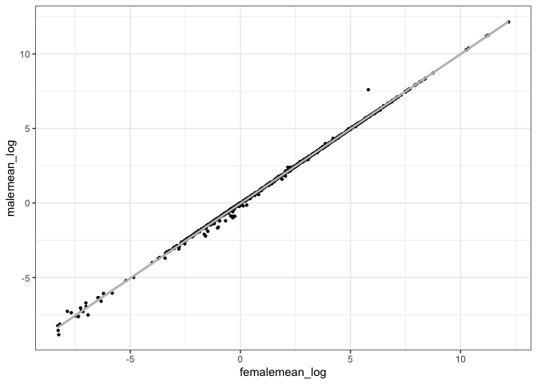

Comparing the mean TE copy numbers in males and females
================

# Unbiased Population Variation of Human Transposable Elements - Script 5

This is the fifth out of eight scripts describing the creation and
analysis of the dataset of human TE abundance. This script works with
the version of the HGDP dataset created in Script 2. In this script, we
will perform the first actual analyses of TE content in the HGDP
dataset. Specifically, we aim to compare the TE abundance between males
and females from the samples.

A few things in advance: Not all populations have samples of both sexes.
In total, much fewer samples are females than males, and for many
populations only male samples are available. Keep this in mind for
future analyses, as you will see that at the end of this section, we
will decide to perform all future analyses for males and females
separately, as they show substantial differences in TE abundance. The
most likely reason for the observed abundance differences are
differences in TE content between the X-chromosome and the Y-chromosome.

As with any analyses presented in this script series, they are by no
means a fully comprehensive set. I am sure there are various additional
aspects that could be studied.

We use the dataset produced at the end of Script 2.

``` r
library(tidyverse)
```

    ## ── Attaching packages ─────────────────────────────────────── tidyverse 1.3.2 ──
    ## ✔ ggplot2 3.3.6      ✔ purrr   0.3.4 
    ## ✔ tibble  3.1.8      ✔ dplyr   1.0.10
    ## ✔ tidyr   1.2.1      ✔ stringr 1.4.1 
    ## ✔ readr   2.1.2      ✔ forcats 0.5.2 
    ## ── Conflicts ────────────────────────────────────────── tidyverse_conflicts() ──
    ## ✖ dplyr::filter() masks stats::filter()
    ## ✖ dplyr::lag()    masks stats::lag()

``` r
#setwd(~/human-data)
HGDPcutoff<-read_delim("/Users/rpianezza/TE/summary-HGDP/USEME_HGDP_complete_reflib6.2_mq10_batchinfo_cutoff0.01.txt",comment="#")
```

    ## Rows: 1394352 Columns: 10
    ## ── Column specification ────────────────────────────────────────────────────────
    ## Delimiter: ","
    ## chr (7): ID, Pop, sex, Country, type, familyname, batch
    ## dbl (3): length, reads, copynumber
    ## 
    ## ℹ Use `spec()` to retrieve the full column specification for this data.
    ## ℹ Specify the column types or set `show_col_types = FALSE` to quiet this message.

``` r
names(HGDPcutoff)<-c("ID","Pop","sex","Country","type","familyname","length","reads","copynumber","batch")
```

As we want to compare all males vs all females, we subset the data
regarding the gender. Additionally, we are only interested in the
abundance differences in TEs. Thus, we also subset only for TE
sequences.

``` r
ftecutoff<-subset(HGDPcutoff, sex=="female" & type=="te")
mtecutoff<-subset(HGDPcutoff, sex=="male" & type=="te")
```

### Calculating mean abundance for males and females

With this code, we can calculate the mean abundance for each TE sequence
over all female or male samples regardless of their origin.
Additionally, we create a dataframe that can be easily used for plotting
with ggplot2.

``` r
#Function to calculate means in the column 'copynumber'; written by Misaki Hu 
meancopynumber<-function(df){ #input=data, newname= name of the newly produced list 
  newname<-c()
  for(x in unique(df$familyname)){
    newname<-c(newname, mean(as.numeric(df[df$familyname==x,]$copynumber)))}
  return(newname) 
} 
ftecutoffmean<- meancopynumber(ftecutoff)
mtecutoffmean<-meancopynumber(mtecutoff)
malefemale_means<- data.frame(#Create a dataframe that can be used for plotting with ggplot
  tenames=unique(ftecutoff$familyname),#Note: We could also use mtecutoff, both sets have all TE sequences that remained after the subsetting in script 2, i.e. 965 sequences
  malemean=mtecutoffmean,
  femalemean=ftecutoffmean)
```

### Comparing mean abundance between males and females

We want to create a plot that shows a pairwise comparison of the mean
copy number estimates of males and females for each of the 965 TE
sequences. Additionally, we include a linear regression line (in grey)
as well as a dashed line representing the null expectation for the
regression, i.e. that males and females have the same mean abundance
values and the regression should thus have a slope of 1. The regression
line having a slope slightly lower than one is thus an indication
(though not a proof) that TEs in females (x-axis) might be on average
slightly more abundant than TEs in males (y-axis).

``` r
ggplot(data=malefemale_means, mapping = aes(x=femalemean, y=malemean))+
  geom_point(size=1)+
  geom_smooth(method="lm",color="grey", se=F)+geom_abline(slope=1,linetype='dashed')+theme_bw()
```

    ## `geom_smooth()` using formula 'y ~ x'

<!-- -->

As you might realize, the vast majority of data points shown in the
above plot are found in the lower left corner. This is caused due to the
high copy number estimate of some human TEs. Most notably, Alu, the most
abundant TE in the human genome, consistently has copy number estimates
of at least a few hundred thousand copies, vastly more than the majority
of TEs in the genome. For this reason, I usually produce a logarithmic
version of each plot, allowing to compare the relative trends in
abundance differences while reducing the effect of extreme outliers like
Alu on the interpretability and intuitiveness of the plot. Later, I
often just produce logarithmic versions of plots. However, feel free to
have a look at the nonlogarithmic versions of these plots as well, there
might be interesting things to learn. For now, here is the log-version
of the above plot. Note that while I include the regression line, I did
not include the expected slope, as I am frankly not sure how to do this
for the log-version of the plot. It would be interesting though if
possible, as it would better illustrate if the slope of the regression
is again unequal to the neutral expectation.

``` r
malefemale_means_log<-data.frame(
  tenames=unique(ftecutoff$familyname),
  malemean_log=log(mtecutoffmean),
  femalemean_log=log(ftecutoffmean))
ggplot(data=malefemale_means_log, mapping = aes(x=femalemean_log, y=malemean_log))+
  geom_point(size=0.8)+
  geom_smooth(method="lm",color="grey", se=F)+theme_bw()
```

    ## `geom_smooth()` using formula 'y ~ x'

<!-- -->

Either way, the main take away from this plot, for me at least, is that
we do see quite some differences in the mean abundance comparison of
males and females for at least a few TEs.

Let’s look at those differences in a bit more detail, shall we?

### Relative and absolute mean differences between the sexes

#### Relative differences

First, we need to create a dataframe suitable for the planned analysis.
For this, we calculate the relative difference of mean abundance between
males and females in the column `relmeandiff` of the new dataframe.

``` r
meandiffframe<-data.frame(tenames=malefemale_means$tenames,relmeandiff=malefemale_means$malemean/malefemale_means$femalemean) # Create a suitable dataframe to create the plots
```

In the initial version, all pairwise differences where the mean of a TE
for females is higher than the mean value for males have a value
below 1. For example, a mean TE abundance of 3 copies for males and 6
copies for females would yield a value of 3/6=0.5. Contrarily, a mean TE
abundance of 6 copies for males and 3 copies for females would yield a
value of 6/3=2. Displaying such pairwise differences in a barplot can be
deceptive. Presumably, one would want to display the deviations from the
expected value, which is no difference, i.e. a value of 1. However, a
value of 2 looks twice as large on a barplot than a value of 0.5. For
this reason, I calculate the inverse for all values below one. In our
example, the inverse of 0.5 is 1/0.5=2. This way, pairwise differences
between males and females can be analyzed comprehensively while
disregarding in which sex the TE is more abundant. However, if a TE is
more abundant in males or females is vital information to analyze the
data comprehensively. If the initial value is below 1 this implies that
the value for mean abundance in females is higher than in males (see
above). Though, I do not only calculate the inverse within the loop, but
I also indicate that the respective bar should be colored in red. Red
color thus represents a higher TE abundance in females than males.
Contrarily, adding ‘blue’ to the vector indicates that the mean
abundance for the respective sequence was higher in males than females.
Adding this vector to the dataframe allows us to use this information
and display the bars in the barplot to indicate in which sex they are
more abundant.

``` r
colorvec<-c()
for (i in 1:length(meandiffframe$tenames)){
  if (meandiffframe$relmeandiff[i]<1){
    meandiffframe$relmeandiff[i]<-1/meandiffframe$relmeandiff[i]
    colorvec<-c(colorvec,'red')  }
  else{
    colorvec<-c(colorvec,'blue')  }}
meandiffframe$fillcol<-colorvec
ggplot(data=meandiffframe, aes(x=tenames, y=relmeandiff))+ 
  geom_bar(stat="identity", fill=meandiffframe$fillcol)+
  theme(axis.text.x = element_text(angle = 90, hjust = 1))
```

<!-- -->
As you might see, producing a plot with all 965 TEs is quite difficult
to interpret. Also, a random order of the TEs does not help the
interpretability of the plot. Ordering the display order of the TEs by
their difference in abundance helps to make the plot more interpretable.

``` r
ordermeandiffframe<-meandiffframe[order(meandiffframe$relmeandiff,decreasing=T),]
ordermeandiffframe$tenames<-factor(ordermeandiffframe$tenames,levels=ordermeandiffframe$tenames)
ggplot(data=ordermeandiffframe, aes(x=tenames, y=relmeandiff))+ 
  geom_bar(stat="identity", fill=meandiffframe$fillcol)+
  theme(axis.text.x = element_text(angle = 90, hjust = 1))
```

<!-- -->

While this most certainly helps, wouldn’t it be nice to focus on just a
few TEs that show the highest abundance differences? Worry not,
subsetting is your friend.

``` r
subsampleordermeandiffframe<-ordermeandiffframe[1:30,]#This number is arbitrary, feel free to look at more/less TEs in the plot
subsampleordermeandiffframe$tenames<-factor(subsampleordermeandiffframe$tenames,levels=subsampleordermeandiffframe$tenames)
ggplot(data=subsampleordermeandiffframe, aes(x=tenames, y=relmeandiff))+ 
  geom_bar(stat="identity", fill=subsampleordermeandiffframe$fillcol)+
  theme(axis.text.x = element_text(angle = 90, hjust = 1))
```

<!-- -->
The sequence with the highest abundance difference is actually a
satellite, and we have also seen in Script 1 that this sequence is quite
vulnerable to estimation differences caused by differences in the data.
So how relevant this is is debatable, I think it might not be very
relevant.  
What I did find interesting looking at this is that we see L1ME5, which
seems to be the version of L1 that shows the most differences between
the populations, i.e. I believe it to be the most recently active L1, or
at least one of them. When checking the literature, I found that it is
apparently known that L1 is quite abundant on the X-chromosome. This
seems like it confirms quite nicely with the observed results here, so I
found that to be quite neat.

#### Absolute differences

When looking at the absolute mean differences instead of the relative
ones, we again see the extreme abundance of Alu and some of its variants
like Alr, Alr1 and Alr\_. Again, red color indicates that the mean of TE
copy number is higher in females, and blue suggests that it is higher in
males.

``` r
meandifabsframe<-data.frame(tenames=malefemale_means$tenames,absmeandiff=abs(malefemale_means$malemean-malefemale_means$femalemean))
colorvecabs<-c()
for (i in 1:length(malefemale_means$malemean-malefemale_means$femalemean)){
  if (malefemale_means$malemean[i]-malefemale_means$femalemean[i]<0){
    colorvecabs<-c(colorvecabs,'red')
  }
  else{
    colorvecabs<-c(colorvecabs,'blue')  }}
meandifabsframe$fillcol<-colorvecabs
ordermeandifabsframe<-meandifabsframe[order(meandifabsframe$absmeandiff,decreasing=T),]
subsampleordermeandifabsframe<-ordermeandifabsframe[1:30,]
subsampleordermeandifabsframe$tenames<-factor(subsampleordermeandifabsframe$tenames,levels=subsampleordermeandifabsframe$tenames)

ggplot(data=subsampleordermeandifabsframe, aes(x=tenames, y=absmeandiff))+ 
  geom_bar(stat="identity", fill=subsampleordermeandifabsframe$fillcol)+
  theme(axis.text.x = element_text(angle = 90, hjust = 1))
```

<!-- -->
I am not sure if there is much additional information to obtain from the
absolute comparison. Thus, I did not include the plot version for the
full dataset. However, it shouldn’t be hard to produce it using the
ordered dataset before subsetting (compare to the code for the
‘relative’ plot).

But more generally, what do these results mean? I think what we see here
is mainly a difference in abundance between TEs found on the
X-chromosome vs TEs found on the Y-chromosome. As a word of caution, in
the female dataset various populations are missing. Potentially, this
could influence some of the abundance differences seen here. This should
be reanalyzed when the results for the comparisons of the different
populations are obtained (not yet performed as the time of this
writing).

I wanted to make a statistical test indicating if males and females
actually have significantly different relative abundances. I calculated
a standard nonparametric test, the Wilcoxon rank-sum test, comparing all
results for males with all results for females and testing if their
ranks are randomly distributed.

``` r
wilcox.test(ordermeandiffframe$relmeandiff[ordermeandiffframe$fillcol=='red'],ordermeandiffframe$relmeandiff[ordermeandiffframe$fillcol=='blue'])
```

    ## 
    ##  Wilcoxon rank sum test with continuity correction
    ## 
    ## data:  ordermeandiffframe$relmeandiff[ordermeandiffframe$fillcol == "red"] and ordermeandiffframe$relmeandiff[ordermeandiffframe$fillcol == "blue"]
    ## W = 104563, p-value < 2.2e-16
    ## alternative hypothesis: true location shift is not equal to 0

The test is significant, indicating that there are inherent abundance
differences between males and females, which was also suggested from
looking at the plots above.  
For this reason, any upcoming analysis will be performed independently
for males and females to avoid systematic differences that could
influence the comparisons on Continent- or population-level.
