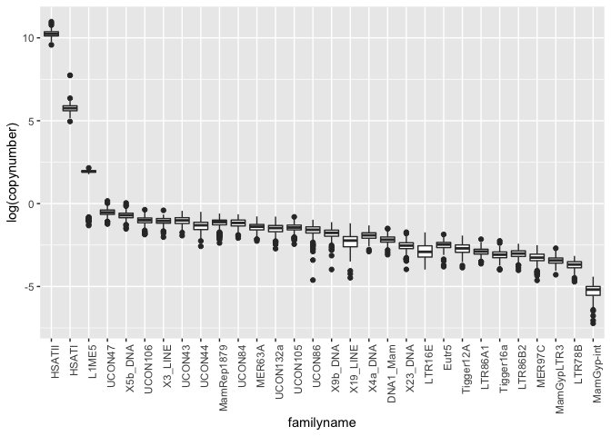
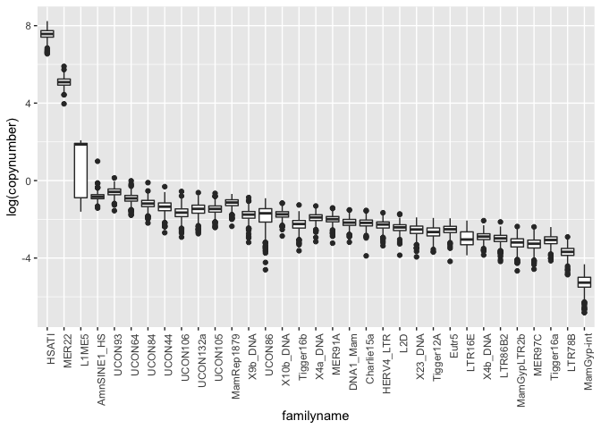

Analyzing the TEs with the highest relative or absolute difference
between their minimum and maximum abundance estimate
================

# Unbiased Population Variation of Human Transposable Elements - Script 7

This is the seventh out of eight scripts describing the creation and
analysis of the dataset of human TE abundance. This script works with
the version of the HGDP dataset created in Script 2. Additionally, we
perform all analyses separately for males and females, as we established
that there are significant differences between the sexes in Script 5.

``` r
library(tidyverse)
```

    ## ── Attaching packages ─────────────────────────────────────── tidyverse 1.3.2 ──
    ## ✔ ggplot2 3.3.6      ✔ purrr   0.3.4 
    ## ✔ tibble  3.1.8      ✔ dplyr   1.0.10
    ## ✔ tidyr   1.2.1      ✔ stringr 1.4.1 
    ## ✔ readr   2.1.2      ✔ forcats 0.5.2 
    ## ── Conflicts ────────────────────────────────────────── tidyverse_conflicts() ──
    ## ✖ dplyr::filter() masks stats::filter()
    ## ✖ dplyr::lag()    masks stats::lag()

``` r
#setwd(~/human-data)
HGDPcutoff<-read_delim("/Users/rpianezza/TE/summary-HGDP/USEME_HGDP_complete_reflib6.2_mq10_batchinfo_cutoff0.01.txt",comment="#")
```

    ## Rows: 1394352 Columns: 10
    ## ── Column specification ────────────────────────────────────────────────────────
    ## Delimiter: ","
    ## chr (7): ID, Pop, sex, Country, type, familyname, batch
    ## dbl (3): length, reads, copynumber
    ## 
    ## ℹ Use `spec()` to retrieve the full column specification for this data.
    ## ℹ Specify the column types or set `show_col_types = FALSE` to quiet this message.

``` r
names(HGDPcutoff)<-c("ID","Pop","sex","Country","type","familyname","length","reads","copynumber","batch")

ftecutoff<-subset(HGDPcutoff, sex=="female" & type=="te")
mtecutoff<-subset(HGDPcutoff, sex=="male" & type=="te")
```

The idea of this code is to plot the general distribution of TE
abundance estimates in a boxplot. This means that we will display the
25% and 75% quantile and the median in a box, and show the outlier dots
above and below this median. Looking at this plot for all 965 TEs seems
excessive, so I did want to create a subset. However, due to the data
structure, this was not as trivial as before. I found a workaround, but
I do believe it is not very intuitive. I will do my best to explain my
code and the idea behind it. If you can think of a cleaner way to do
this, feel free to implement it. As the analysis is done for males and
females separately, I will try to show the code in detail for the female
analysis, and then add the full code for the male analysis in the end.
First, I wanted to identify the minimum, mean and maximum value for each
TE sequence. This code chunk creates a data frame containing
respectively the name of the TE and the minimum, mean and maximum value
for each respective TE.

``` r
tenames <- unique(ftecutoff$familyname)
femaleminmeanmax<-c()
for (i in tenames){
  femaleminmeanmax<-c(femaleminmeanmax,min(ftecutoff$copynumber[ftecutoff$familyname==i]),mean(ftecutoff$copynumber[ftecutoff$familyname==i]),max(ftecutoff$copynumber[ftecutoff$familyname==i]))}
femaleminmeanmaxmatrix<-matrix(femaleminmeanmax,ncol=3,byrow=T)
femaleminmeanmaxframesepcols<-data.frame(tenames,femaleminmeanmaxmatrix)
names(femaleminmeanmaxframesepcols)<-c('tenames','min','mean','max')
```

This analysis, similar to the comparison of mean abundance differences,
was done for both a relative and an absolute comparison. I personally
think that the relative comparison is likely the more informative, but I
include the code for both.

### Relative comparison

#### Females

From the whole dataset, we want to create a subset containing only the
TEs with the highest relative differences between minimum and maximum
value. So what I did was to create a subset containing only the names of
TEs with a specific fold difference between the minimum and the maximum
copy number value. In this specific example, I chose a fourfold
difference. If you want to include more/less TEs in the plot, feel free
to change the fold value. I also included the condition that the value
should be lower than Infinite as otherwise this caused some issues.

``` r
outliertenames<-femaleminmeanmaxframesepcols$tenames[femaleminmeanmaxframesepcols$max/femaleminmeanmaxframesepcols$min>4 & femaleminmeanmaxframesepcols$max/femaleminmeanmaxframesepcols$min<Inf]
```

For the production of the plot we do want all values of the respective
TE, and not just its minimum and maxmimum value. Thus, we need to create
a subset of the full dataset containing only the TEs with the highest
fold difference between minimum and maximum value. As we already have a
vector containing the names of the TEs we want for the female dataset,
we just need to subset the dataset. Then we order the dataset and make
sure that the order is correctly displayed in the follwoing plot.

``` r
fteoutlier<-ftecutoff[ftecutoff$familyname %in% outliertenames,]
fteoutlierorder<-fteoutlier[order(fteoutlier$copynumber,decreasing=T),]
fteoutlierorder$familyname<-factor(fteoutlierorder$familyname,levels=unique(fteoutlierorder$familyname))
```

Now we have a dataset containing only the TEs with the highest
differences in abundance between minimum and maximum value. We can now
create a simple boxplot to look at the distribution of these values.

``` r
ggplot(fteoutlierorder,aes(x=familyname,y=log(copynumber)))+geom_boxplot(notch=F)+
  theme(axis.text.x = element_text(angle = 90, hjust = 1)) #Most of this is pretty uninteresting. How do I subset for the most variable TEs instead of the most abundant?
```

<!-- -->
One quite exciting thing about this plot is the L1 variant L1ME5. This
TE was already behaving quite interestingly in the male-female
comparison and it does again not disappoint here. It gets especially
interesting if you look at where the values with markedly lower
abundance seen in the plot actually come from:

``` r
L1ME5<-fteoutlierorder[fteoutlierorder$familyname=='L1ME5',]
L1ME5[L1ME5$copynumber<5,]
```

    ## # A tibble: 17 × 10
    ##    ID        Pop          sex   Country type  famil…¹ length reads copyn…² batch
    ##    <chr>     <chr>        <chr> <chr>   <chr> <fct>    <dbl> <dbl>   <dbl> <chr>
    ##  1 HGDP00938 Yoruba       fema… Africa  te    L1ME5      507  50.6   0.445 flo  
    ##  2 HGDP00918 Mandenka     fema… Africa  te    L1ME5      507  55.0   0.434 flo  
    ##  3 HGDP00926 Yoruba       fema… Africa  te    L1ME5      507  50.1   0.433 flo  
    ##  4 HGDP00939 Yoruba       fema… Africa  te    L1ME5      507  55.1   0.424 flo  
    ##  5 HGDP00924 Yoruba       fema… Africa  te    L1ME5      507  47.7   0.390 ro   
    ##  6 HGDP01201 Mandenka     fema… Africa  te    L1ME5      507  47.0   0.389 flo  
    ##  7 HGDP00916 Mandenka     fema… Africa  te    L1ME5      507  48.9   0.386 flo  
    ##  8 HGDP00914 Mandenka     fema… Africa  te    L1ME5      507  50.6   0.379 flo  
    ##  9 HGDP00935 Yoruba       fema… Africa  te    L1ME5      507  49.9   0.369 flo  
    ## 10 HGDP00471 Mbuti        fema… Africa  te    L1ME5      507  46.7   0.366 flo  
    ## 11 HGDP00910 Mandenka     fema… Africa  te    L1ME5      507  48.9   0.364 ro   
    ## 12 HGDP00925 Yoruba       fema… Africa  te    L1ME5      507  44.9   0.356 flo  
    ## 13 HGDP00933 Yoruba       fema… Africa  te    L1ME5      507  43.8   0.347 flo  
    ## 14 HGDP00544 PapuanSepik  fema… Oceania te    L1ME5      507  42.4   0.343 ro   
    ## 15 HGDP00934 Yoruba       fema… Africa  te    L1ME5      507  44.7   0.335 flo  
    ## 16 HGDP00920 Yoruba       fema… Africa  te    L1ME5      507  35.2   0.287 ro   
    ## 17 HGDP00550 PapuanHighl… fema… Oceania te    L1ME5      507  32.7   0.267 flo  
    ## # … with abbreviated variable names ¹​familyname, ²​copynumber

As you can see in this table, nearly all of the low abundance values
come from African populations. Which I think is quite cool a finding,
and I presume future analyses will look at this abundance difference in
more detail.

#### Males

The analysis for males is understandably mirroring the one for females,
so I will not explain the code in too much detail. I used a 5-fold
cutoff in this case to have a roughly similar number of TEs as in the
plot for females, but again, these cutoffs should probably be changed
and played around with a bit.

``` r
maleminmeanmax<-c()
for (i in tenames){
  maleminmeanmax<-c(maleminmeanmax,min(mtecutoff$copynumber[mtecutoff$familyname==i]),mean(mtecutoff$copynumber[mtecutoff$familyname==i]),max(mtecutoff$copynumber[mtecutoff$familyname==i]))}
maleminmeanmaxmatrix<-matrix(maleminmeanmax,ncol=3,byrow=T)
maleminmeanmaxframesepcols<-data.frame(tenames,maleminmeanmaxmatrix)
names(maleminmeanmaxframesepcols)<-c('tenames','min','mean','max')

outliertenames<-maleminmeanmaxframesepcols$tenames[maleminmeanmaxframesepcols$max/maleminmeanmaxframesepcols$min>5 & maleminmeanmaxframesepcols$max/maleminmeanmaxframesepcols$min<Inf]
mteoutlier<-mtecutoff[mtecutoff$familyname %in% outliertenames,]
mteoutlierorder<-mteoutlier[order(mteoutlier$copynumber,decreasing=T),]
mteoutlierorder$familyname<-factor(mteoutlierorder$familyname,levels=unique(mteoutlierorder$familyname))

ggplot(mteoutlierorder,aes(x=familyname,y=log(copynumber)))+geom_boxplot(notch=F)+
  theme(axis.text.x = element_text(angle = 90, hjust = 1)) 
```

<!-- -->
Notably, the results specific to L1ME5 seem not nearly as clear, and low
copy number estimates exist in many other Continents. Definitely worth
more investigation!

``` r
L1ME5<-mteoutlierorder[mteoutlierorder$familyname=='L1ME5',]
L1ME5[L1ME5$copynumber<3,]
```

    ## # A tibble: 149 × 10
    ##    ID        Pop        sex   Country   type  famil…¹ length reads copyn…² batch
    ##    <chr>     <chr>      <chr> <chr>     <chr> <fct>    <dbl> <dbl>   <dbl> <chr>
    ##  1 HGDP01092 Biaka      male  Africa    te    L1ME5      507  69.6   0.488 flo  
    ##  2 HGDP01213 Daur       male  East_Asia te    L1ME5      507  63.5   0.473 flo  
    ##  3 HGDP01408 BantuKenya male  Africa    te    L1ME5      507  57.1   0.465 flo  
    ##  4 HGDP00985 Biaka      male  Africa    te    L1ME5      507  55.7   0.464 ro   
    ##  5 HGDP00057 Balochi    male  Central_… te    L1ME5      507  57.1   0.461 ro   
    ##  6 HGDP01200 Mandenka   male  Africa    te    L1ME5      507  60.6   0.447 flo  
    ##  7 HGDP00937 Yoruba     male  Africa    te    L1ME5      507  60.6   0.447 flo  
    ##  8 HGDP01225 Mongolian  male  East_Asia te    L1ME5      507  56.9   0.420 flo  
    ##  9 HGDP01037 Pima       male  America   te    L1ME5      507  55.1   0.413 ro   
    ## 10 HGDP00056 Balochi    male  Central_… te    L1ME5      507  50.2   0.413 ro   
    ## # … with 139 more rows, and abbreviated variable names ¹​familyname, ²​copynumber

### Absolute comparison

#### Females

We use the same dataset for the mean, minimum and maximum values as
those do not change. The only thing that changes is our definition of
**outliers**. Instead of a relative fold-difference between the minimum
and maximum value, we now want to use an absolute value of maximum copy
number vs minimum copy number as a threshold. Again, experimenting with
the value will lead to the inclusion of more or less TEs in the plot.

``` r
outliertenames<-femaleminmeanmaxframesepcols$tenames[femaleminmeanmaxframesepcols$max-femaleminmeanmaxframesepcols$min>200 & femaleminmeanmaxframesepcols$max-femaleminmeanmaxframesepcols$min<Inf]
fteoutlier<-ftecutoff[ftecutoff$familyname %in% outliertenames,]
fteoutlierorder<-fteoutlier[order(fteoutlier$copynumber,decreasing=T),]
fteoutlierorder$familyname<-factor(fteoutlierorder$familyname,levels=unique(fteoutlierorder$familyname))
ggplot(fteoutlierorder,aes(x=familyname,y=log(copynumber)))+geom_boxplot(notch=F)+
  theme(axis.text.x = element_text(angle = 90, hjust = 1)) 
```

<!-- -->

#### Males

``` r
outliertenames<-maleminmeanmaxframesepcols$tenames[maleminmeanmaxframesepcols$max-maleminmeanmaxframesepcols$min>200 & maleminmeanmaxframesepcols$max-maleminmeanmaxframesepcols$min<Inf]
mteoutlier<-mtecutoff[mtecutoff$familyname %in% outliertenames,]
mteoutlierorder<-mteoutlier[order(mteoutlier$copynumber,decreasing=T),]
mteoutlierorder$familyname<-factor(mteoutlierorder$familyname,levels=unique(mteoutlierorder$familyname))
ggplot(mteoutlierorder,aes(x=familyname,y=log(copynumber)))+geom_boxplot(notch=F)+
  theme(axis.text.x = element_text(angle = 90, hjust = 1)) 
```

<!-- -->

My general issue with this whole series of plots is that we show the TEs
with the highest differences, but do these actually represent the TEs
that are most variable within/between the populations? And if not, what
is a better analyses to focus on the TEs whose variations in copy
numbers are the most interesting?
